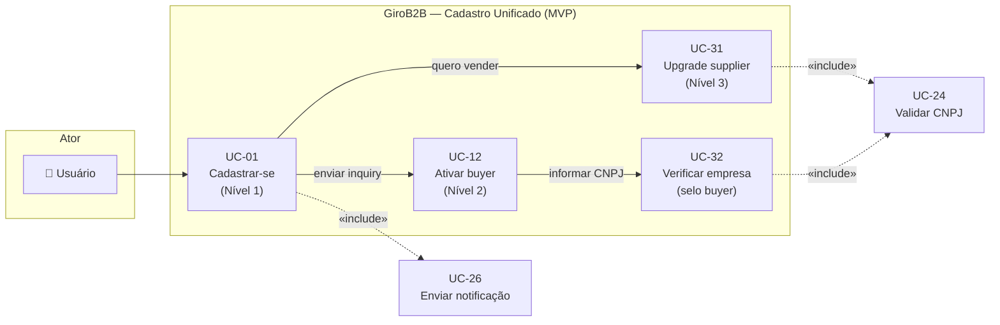
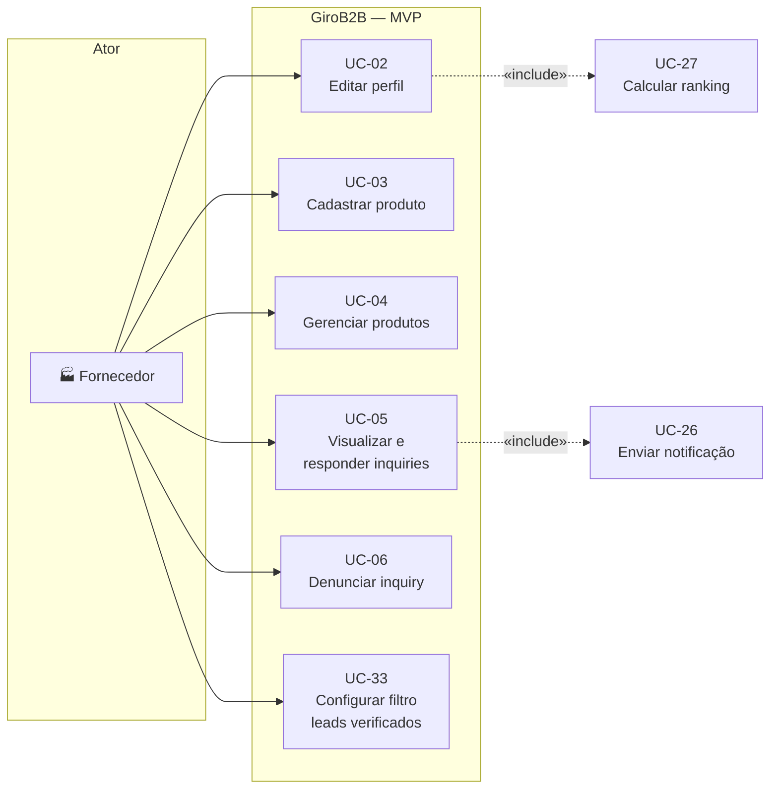
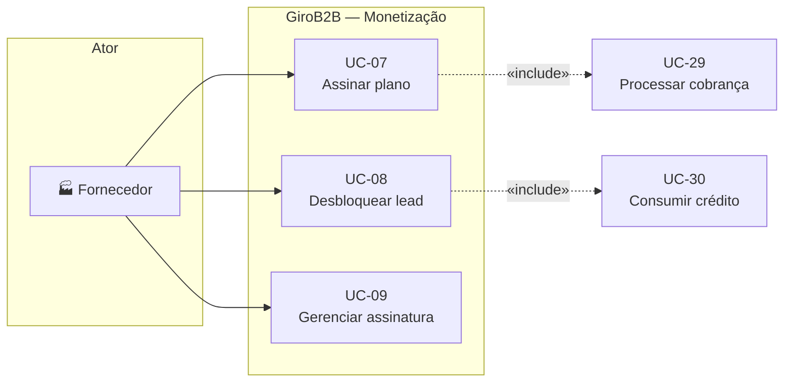
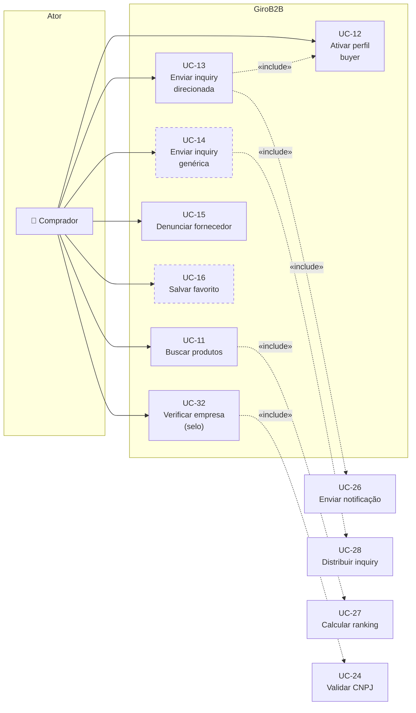
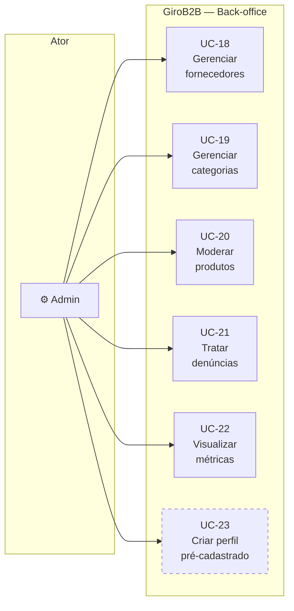
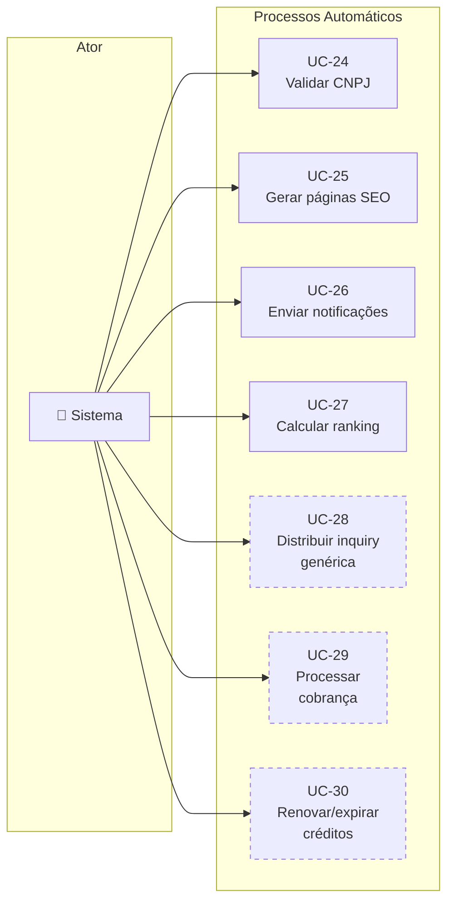

# Casos de Uso — GiroB2B

**Versão:** 1.1
**Data:** 04/04/2026
**Autor:** Gustavo (CEO) + Claude (Arquiteto)
**Público:** Time de desenvolvimento + investidores/aceleradoras
**Insumos:** 1.4 Requisitos Funcionais (v1.1), 1.6 Regras de Negócio (v1.1), 1.7 Scope Lock do MVP (v1.1), REFERENCIA_CONSOLIDADA.md (v1.1)
**Atualização v1.1:** Migração para cadastro unificado com progressão por engajamento em 3 níveis (decisão 04/04/2026). UC-01 e UC-12 reescritos, UC-31/32/33 adicionados, pré-condições de inquiry ajustadas.

---

## Convenções deste documento

Cada caso de uso segue o formato:

> **[UC-XX]** Nome do caso de uso
> **Ator principal:** quem inicia a ação
> **Fase:** MVP | Validação | Monetização | Escala
> **Rastreabilidade:** RFs e RNs relacionados

Seções de cada UC:
- **Pré-condições:** o que precisa ser verdadeiro antes de iniciar
- **Fluxo principal:** sequência de passos do cenário de sucesso (caminho feliz)
- **Fluxos alternativos:** variações válidas do fluxo principal
- **Exceções:** erros, falhas, caminhos de rejeição
- **Pós-condições:** estado do sistema após a conclusão
- **Regras de negócio aplicáveis:** códigos das RNs que regem este UC

---

## Índice de Casos de Uso

### Por ator

| Ator | Casos de Uso | Qtd |
|---|---|---|
| Usuário (qualquer) | UC-01 (cadastro), UC-31 (upgrade supplier) | 2 |
| Fornecedor | UC-02 a UC-10, UC-33 | 10 |
| Comprador | UC-11, UC-12, UC-13 a UC-16, UC-32 | 7 |
| Usuário (ambos) | UC-17 | 1 |
| Admin | UC-18 a UC-23 | 6 |
| Sistema (automático) | UC-24 a UC-30 | 7 |
| **Total** | | **33** |

### Por fase

| Fase | Casos de Uso | Qtd |
|---|---|---|
| MVP | UC-01 a UC-05, UC-11 a UC-13, UC-15, UC-17 a UC-22, UC-24 a UC-27, UC-31, UC-32, UC-33 | 22 |
| Validação | UC-06, UC-10, UC-14, UC-16, UC-23 | 5 |
| Monetização | UC-07, UC-08, UC-09, UC-28, UC-29, UC-30 | 6 |
| **Total** | | **33** |

---

## Diagramas de Casos de Uso

### Diagrama 0 — Cadastro Unificado (Progressão por Engajamento)



*Cadastro unificado: todos entram como Nível 1 (Usuário). Buyer é ativado na primeira inquiry. Supplier é upgrade voluntário.*

### Diagrama 1 — Fornecedor (MVP)



### Diagrama 2 — Fornecedor (Monetização)



### Diagrama 3 — Comprador



*Linhas tracejadas = fase Validação (não entra no MVP)*

### Diagrama 4 — Admin



### Diagrama 5 — Sistema (automático)



### Diagrama 6 — Visão geral (relacionamentos entre atores)

```mermaid
graph TB
    U["👤 Usuário"] --> |cadastra-se<br>(Nível 1)| PLAT["GiroB2B<br>Platform"]
    U --> |upgrade| F["🏭 Fornecedor"]
    U --> |ativação| B["🛒 Comprador"]
    F --> |lista produtos,<br>responde inquiries,<br>filtra leads| PLAT
    B --> |busca, envia<br>inquiries, selo| PLAT
    A["⚙️ Admin"] --> |modera, gerencia,<br>monitora| PLAT
    PLAT --> |valida CNPJ,<br>gera SEO,<br>notifica,<br>distribui leads| S["🤖 Sistema"]

    F -.->|"inquiry"| B
    B -.->|"lead (pago)"| F
```

*Cadastro unificado: todos entram como Usuário (Nível 1). Roles de buyer e supplier são adquiridos por engajamento.*

---

## Descrições Textuais dos Casos de Uso

---

### CADASTRO UNIFICADO — MVP

---

#### UC-01: Cadastrar-se na plataforma (Nível 1 — Usuário)

**Ator principal:** Usuário (qualquer pessoa)
**Fase:** MVP
**Rastreabilidade:** RF-01.01, RF-01.05 | RN-01.03, RN-01.05, RN-01.13

**Pré-condições:**
- Nenhuma (qualquer pessoa pode se cadastrar)

**Fluxo principal:**
1. Usuário acessa a página de cadastro (não há escolha de role — cadastro único)
2. Usuário preenche: email, senha, nome completo, telefone, cidade e estado
3. Sistema valida formato dos campos (email válido, senha com requisitos mínimos)
4. Sistema verifica que o email não existe na base de dados
5. Sistema cria a conta com status "pendente de confirmação" e sem role definido (Nível 1 — Usuário)
6. Sistema envia email de confirmação com link de ativação [UC-26]
7. Usuário clica no link de confirmação dentro de 48h
8. Sistema ativa a conta e redireciona para a página inicial da plataforma

**Fluxos alternativos:**
- **FA-01.1** Usuário não confirma email em 48h: Sistema envia lembrete. Após 7 dias sem confirmação, conta é removida automaticamente
- **FA-01.2** Login social Google (fase Validação): Usuário clica "Entrar com Google", dados preenchidos automaticamente [RF-01.11]

**Exceções:**
- **EX-01.1** Email já cadastrado: Sistema sugere fazer login ou recuperar a senha
- **EX-01.2** Senha não atende requisitos mínimos: Sistema exibe critérios (mín. 8 caracteres, 1 maiúscula, 1 número)

**Pós-condições:**
- Conta criada sem role específico (Nível 1 — Usuário)
- Sem CNPJ, sem dados de empresa, sem consentimento LGPD neste momento
- Usuário pode navegar, buscar produtos, ver perfis de fornecedores
- Usuário NÃO pode enviar inquiries (precisa ativação de buyer, UC-12) nem listar produtos (precisa upgrade para supplier, UC-31)
- CPF nunca coletado (RN-01.13)

**Regras de negócio aplicáveis:** RN-01.03 (email confirmado), RN-01.05 (navegação sem ser buyer), RN-01.13 (CPF nunca coletado)

---

### FORNECEDOR — MVP

---

#### UC-02: Editar perfil da empresa

**Ator principal:** Fornecedor
**Fase:** MVP
**Rastreabilidade:** RF-02.01, RF-02.02, RF-02.03, RF-02.04, RF-02.05 | RN-02.01

**Pré-condições:**
- Fornecedor logado com email confirmado

**Fluxo principal:**
1. Fornecedor acessa "Meu Perfil" no painel
2. Sistema exibe formulário com campos editáveis e barra de completude atual
3. Fornecedor preenche/edita: logo, descrição (até 2.000 chars), endereço completo, horário de funcionamento, site, redes sociais, ano de fundação, faixa de funcionários
4. Fornecedor seleciona até 5 categorias/setores na árvore hierárquica
5. Fornecedor faz upload de fotos da empresa (até 10, máx. 5MB cada)
6. Fornecedor salva alterações
7. Sistema valida campos (tamanho da descrição, formato das imagens, URLs válidas)
8. Sistema recalcula completude do perfil [fórmula RN-02.01]
9. Sistema atualiza perfil público e recalcula posição no ranking de busca [UC-27]

**Fluxos alternativos:**
- **FA-02.1** Fornecedor edita parcialmente e salva: Sistema aceita, recalcula completude, exibe quais campos faltam para chegar a 100%
- **FA-02.2** Fornecedor tenta upload de imagem >5MB: Sistema rejeita a imagem específica e exibe limite

**Exceções:**
- **EX-02.1** Descrição com conteúdo proibido (spam, links externos suspeitos): Sistema salva mas marca para moderação pelo admin
- **EX-02.2** Upload de arquivo não-imagem: Sistema rejeita com mensagem "Apenas JPG, PNG ou WebP"

**Pós-condições:**
- Perfil público atualizado
- Barra de completude recalculada conforme RN-02.01:
  Logo (10%) + descrição ≥100 chars (15%) + endereço (10%) + telefone (10%) + 1+ categoria (10%) + 3+ produtos (20%) + 1+ foto/produto (15%) + horário (5%) + ano fundação (5%)
- Posição no ranking de busca pode mudar

**Regras de negócio aplicáveis:** RN-02.01 (completude do perfil)

---

#### UC-03: Cadastrar produto

**Ator principal:** Fornecedor
**Fase:** MVP
**Rastreabilidade:** RF-03.01, RF-03.02, RF-03.04, RF-03.05, RF-03.06 | RN-02.02, RN-02.03, RN-02.04, RN-02.05, RN-02.06, RN-02.07

**Pré-condições:**
- Fornecedor logado com email confirmado
- Ao menos 1 categoria selecionada no perfil

**Fluxo principal:**
1. Fornecedor acessa "Meus Produtos" > "Adicionar Produto"
2. Sistema exibe formulário: nome, descrição (até 1.000 chars), categoria, subcategoria, fotos (até 5, máx. 5MB cada), unidade de medida, quantidade mínima de pedido, faixa de preço (opcional)
3. Fornecedor preenche os campos obrigatórios (nome, descrição, categoria)
4. Fornecedor faz upload de fotos do produto
5. Fornecedor confirma publicação
6. Sistema valida campos e imagens
7. Sistema gera tags/palavras-chave automaticamente a partir do nome e descrição [RF-03.05]
8. Sistema cria slug SEO-friendly para URL do produto [RF-05.01]
9. Sistema publica o produto (status: ativo)
10. Sistema recalcula completude do perfil (se for o 3º+ produto, pode subir)
11. Sistema agenda regeneração do sitemap XML [UC-25]

**Fluxos alternativos:**
- **FA-03.1** Fornecedor não adiciona fotos: Sistema aceita o produto, mas exibe aviso "Produtos com fotos recebem 3x mais inquiries" e não conta para o critério de completude (15% de foto)
- **FA-03.2** Fornecedor não informa preço: Sistema aceita (preço é opcional), exibe "Preço sob consulta" na página do produto
- **FA-03.3** Fornecedor salva como rascunho: Sistema salva sem publicar (status: rascunho)

**Exceções:**
- **EX-03.1** Campos obrigatórios não preenchidos: Sistema destaca campos faltantes
- **EX-03.2** Conteúdo duplicado (mesmo nome + mesma categoria de produto já existente do mesmo fornecedor): Sistema avisa e pede confirmação
- **EX-03.3** Imagem com conteúdo inadequado: Sistema rejeita (validação básica de formato; moderação manual pelo admin para conteúdo)

**Pós-condições:**
- Produto publicado e visível na busca
- Página SEO individual gerada com URL `/produto/[slug]-[cidade]`
- Tags automáticas atribuídas
- Sitemap atualizado
- Completude do perfil recalculada

**Regras de negócio aplicáveis:** RN-02.02 (listagem ilimitada gratuita), RN-02.03 (campos obrigatórios), RN-02.04 (categorias padronizadas), RN-02.05 (fotos opcionais mas incentivadas), RN-02.06 (preço opcional), RN-02.07 (slug automático)

---

#### UC-04: Gerenciar produtos

**Ator principal:** Fornecedor
**Fase:** MVP
**Rastreabilidade:** RF-03.03

**Pré-condições:**
- Fornecedor logado
- Ao menos 1 produto cadastrado

**Fluxo principal:**
1. Fornecedor acessa "Meus Produtos" no painel
2. Sistema exibe lista de produtos com: nome, categoria, status (ativo/pausado/rascunho), data de criação, visualizações
3. Fornecedor seleciona um produto e escolhe ação

**Fluxos alternativos:**
- **FA-04.1** Editar produto: Sistema exibe formulário preenchido, fornecedor altera campos desejados, sistema revalida e atualiza
- **FA-04.2** Pausar produto: Sistema oculta o produto da busca e páginas públicas, mantém dados salvos. Status muda para "pausado"
- **FA-04.3** Reativar produto pausado: Sistema republica o produto, retorna status para "ativo"
- **FA-04.4** Excluir produto: Sistema solicita confirmação ("Esta ação é irreversível"). Após confirmação, remove o produto e sua página SEO. Inquiries vinculadas são mantidas no histórico

**Exceções:**
- **EX-04.1** Produto com inquiries pendentes: Sistema avisa que existem inquiries em aberto antes de permitir exclusão

**Pós-condições:**
- Lista de produtos atualizada
- Páginas SEO regeneradas conforme status do produto
- Completude do perfil recalculada se a contagem de produtos mudou

**Regras de negócio aplicáveis:** RN-02.02 (listagem ilimitada)

---

#### UC-05: Visualizar e responder inquiries

**Ator principal:** Fornecedor
**Fase:** MVP (visualização) / Monetização (dados de contato)
**Rastreabilidade:** RF-06.03, RF-06.04, RF-06.05, RF-09.01, RF-09.02 | RN-04.01, RN-04.02, RN-04.03, RN-04.04

**Pré-condições:**
- Fornecedor logado
- Ao menos 1 inquiry recebida

**Fluxo principal (fornecedor gratuito):**
1. Fornecedor acessa "Inquiries" no painel
2. Sistema exibe lista de inquiries com filtros (status: nova, visualizada, respondida, arquivada) e filtro por data
3. Fornecedor clica em uma inquiry
4. Sistema exibe: descrição do pedido, quantidade, prazo desejado e cidade do comprador
5. Dados de contato (nome, empresa, email, telefone) aparecem ocultos com mensagem: "Assine um plano para acessar os dados de contato deste comprador"
6. Sistema marca inquiry como "visualizada" e notifica comprador [UC-26]
7. Fornecedor pode arquivar a inquiry

**Fluxo principal (fornecedor pagante com créditos — fase Monetização):**
1. Passos 1-3 iguais ao fluxo gratuito
4. Sistema exibe inquiry com botão "Desbloquear Contato (1 crédito)"
5. Fornecedor clica em "Desbloquear" [UC-08]
6. Sistema consome 1 crédito e revela: nome, empresa, email e telefone do comprador
7. Lead é adicionado ao CRM do fornecedor [RF-09.05]

**Fluxos alternativos:**
- **FA-05.1** Fornecedor pagante sem créditos: Botão "Desbloquear" desabilitado com mensagem "Créditos esgotados. Aguarde renovação domingo ou compre créditos extras"
- **FA-05.2** Filtrar por status: Fornecedor seleciona filtro, lista atualiza

**Exceções:**
- **EX-05.1** Inquiry de spam (conteúdo sem sentido): Fornecedor pode denunciar [UC-06]

**Pós-condições:**
- Inquiry marcada como "visualizada" ou "desbloqueada"
- (Se desbloqueada) Crédito consumido, lead salvo no CRM
- Comprador notificado de que sua inquiry foi visualizada

**Regras de negócio aplicáveis:** RN-04.01 (dados ocultos para free), RN-04.02 (1 crédito por desbloqueio), RN-04.03 (desbloqueio irreversível), RN-04.04 (notificação ao comprador)

---

#### UC-06: Denunciar inquiry como spam

**Ator principal:** Fornecedor
**Fase:** Validação
**Rastreabilidade:** RF-06.08 | RN-04.09

**Pré-condições:**
- Fornecedor logado
- Inquiry recebida identificada como suspeita

**Fluxo principal:**
1. Fornecedor visualiza uma inquiry suspeita
2. Fornecedor clica em "Denunciar" e seleciona motivo (spam, dados falsos, conteúdo inadequado, outro)
3. Fornecedor adiciona comentário opcional
4. Sistema registra a denúncia
5. Se a inquiry já foi denunciada por 2+ fornecedores distintos, sistema escalona automaticamente para revisão do admin [UC-21]

**Exceções:**
- **EX-06.1** Fornecedor tenta denunciar a mesma inquiry duas vezes: Sistema bloqueia e informa "Você já denunciou esta inquiry"

**Pós-condições:**
- Denúncia registrada no sistema
- Se threshold atingido, inquiry entra na fila de moderação do admin

**Regras de negócio aplicáveis:** RN-04.09 (threshold de denúncias para escalonamento)

---

### FORNECEDOR — MONETIZAÇÃO

---

#### UC-07: Assinar plano pago

**Ator principal:** Fornecedor
**Fase:** Monetização
**Rastreabilidade:** RF-08.01, RF-08.03, RF-08.04, RF-08.06 | RN-06.01, RN-06.02, RN-06.03

**Pré-condições:**
- Fornecedor logado no plano gratuito
- Fornecedor com email confirmado e perfil criado

**Fluxo principal:**
1. Fornecedor acessa "Planos" no painel ou clica no CTA de upgrade exibido ao tentar desbloquear um lead
2. Sistema exibe os 3 planos com comparativo: Starter (R$79/mês), Pro (R$199/mês), Premium (R$399/mês)
3. Fornecedor seleciona plano e ciclo de cobrança (mensal ou anual com 17% de desconto)
4. Sistema redireciona para checkout (gateway: Stripe, Mercado Pago ou PagSeguro)
5. Fornecedor informa dados de pagamento (cartão, boleto ou PIX)
6. Gateway processa pagamento [UC-29]
7. Pagamento aprovado: Sistema ativa o plano imediatamente
8. Sistema aplica benefícios: créditos semanais, selo Verificado (Pro/Premium), prioridade na busca (Premium)
9. Sistema envia email de confirmação com detalhes do plano [UC-26]

**Fluxos alternativos:**
- **FA-07.1** Trial gratuito (Starter, 7 dias, sem cartão): Fornecedor seleciona "Experimentar grátis por 7 dias". Sistema ativa Starter com créditos. Após 7 dias, converte para gratuito se não informar pagamento
- **FA-07.2** Pagamento via boleto: Gateway gera boleto com vencimento em 3 dias. Plano ativado apenas após compensação
- **FA-07.3** Pagamento via PIX: Ativação imediata após confirmação do gateway

**Exceções:**
- **EX-07.1** Pagamento recusado (cartão): Sistema exibe erro do gateway e sugere outro método
- **EX-07.2** Boleto não pago em 3 dias: Sistema cancela a tentativa de assinatura
- **EX-07.3** Fornecedor já possui plano ativo: Sistema redireciona para gerenciamento de assinatura [UC-09]

**Pós-condições:**
- Plano ativo com data de início e próxima cobrança definida
- Créditos semanais disponíveis
- Selo Verificado ativado (Pro/Premium)
- Posição no ranking atualizada

**Regras de negócio aplicáveis:** RN-06.01 (planos e preços), RN-06.02 (desconto anual ~17%), RN-06.03 (benefícios por plano)

---

#### UC-08: Desbloquear lead com crédito

**Ator principal:** Fornecedor
**Fase:** Monetização
**Rastreabilidade:** RF-07.02, RF-07.03 | RN-05.01, RN-05.02, RN-05.03

**Pré-condições:**
- Fornecedor logado com plano pago ativo
- Ao menos 1 crédito disponível
- Inquiry recebida com dados de contato ocultos

**Fluxo principal:**
1. Fornecedor visualiza inquiry com dados ocultos
2. Fornecedor clica em "Desbloquear Contato (1 crédito)"
3. Sistema exibe confirmação: "Desbloquear este lead consome 1 crédito. Você tem X créditos restantes. Continuar?"
4. Fornecedor confirma
5. Sistema consome 1 crédito do saldo semanal (ou avulso, se semanal esgotado)
6. Sistema revela dados completos: nome, empresa, email, telefone
7. Lead é salvo no CRM do fornecedor com status "novo"
8. Sistema registra o desbloqueio no histórico de créditos

**Fluxos alternativos:**
- **FA-08.1** Fornecedor com créditos semanais esgotados mas com créditos avulsos: Sistema consome crédito avulso (FIFO por data de compra)
- **FA-08.2** Fornecedor cancela na tela de confirmação: Nenhum crédito consumido, dados permanecem ocultos

**Exceções:**
- **EX-08.1** Sem créditos (nenhum tipo): Sistema exibe "Créditos esgotados" com CTAs: "Comprar créditos extras" [UC-09] ou "Aguardar renovação domingo 00:01"
- **EX-08.2** Lead já desbloqueado anteriormente (mesma inquiry): Sistema exibe dados diretamente sem consumir crédito

**Pós-condições:**
- 1 crédito consumido (desbloqueio irreversível)
- Dados de contato do comprador visíveis permanentemente para este fornecedor
- Lead registrado no CRM

**Regras de negócio aplicáveis:** RN-05.01 (1 crédito por lead), RN-05.02 (desbloqueio irreversível), RN-05.03 (créditos semanais expiram domingo 00:01, não acumulam)

---

#### UC-09: Gerenciar assinatura

**Ator principal:** Fornecedor
**Fase:** Monetização
**Rastreabilidade:** RF-08.02, RF-07.04 | RN-06.04, RN-06.05, RN-06.06

**Pré-condições:**
- Fornecedor logado com plano pago ativo

**Fluxo principal:**
1. Fornecedor acessa "Minha Assinatura" no painel
2. Sistema exibe: plano atual, próxima cobrança, créditos restantes (semanais + avulsos), histórico de pagamentos

**Fluxos alternativos:**
- **FA-09.1** Upgrade de plano: Fornecedor seleciona plano superior. Diferença cobrada pro-rata. Novos benefícios ativados imediatamente
- **FA-09.2** Downgrade de plano: Fornecedor seleciona plano inferior. Mudança efetiva no próximo ciclo de cobrança. Benefícios do plano atual mantidos até o fim do ciclo
- **FA-09.3** Cancelar assinatura: Sistema exibe pesquisa de motivo (churn survey) + oferta de retenção (ex: 1 mês com desconto). Se confirmar, plano reverte para gratuito no fim do ciclo
- **FA-09.4** Comprar créditos extras: Fornecedor seleciona pacote avulso. Pagamento processado. Créditos extras adicionados com validade de 90 dias
- **FA-09.5** Atualizar método de pagamento: Fornecedor informa novo cartão/método via gateway

**Exceções:**
- **EX-09.1** Falha na cobrança recorrente: Sistema tenta 3 vezes (dias 1, 3 e 7). Se todas falharem, plano é suspenso. Fornecedor notificado a cada tentativa [UC-26]

**Pós-condições:**
- Alteração registrada no gateway e no sistema
- (Se upgrade) Novos benefícios imediatos
- (Se downgrade/cancelamento) Mudança agendada para fim do ciclo

**Regras de negócio aplicáveis:** RN-06.04 (pro-rata no upgrade), RN-06.05 (downgrade no próximo ciclo), RN-06.06 (3 tentativas antes de suspensão)

---

### FORNECEDOR — VALIDAÇÃO

---

#### UC-10: Importar produtos em massa

**Ator principal:** Fornecedor
**Fase:** Validação
**Rastreabilidade:** RF-03.07

**Pré-condições:**
- Fornecedor logado
- Fornecedor baixou template de importação (CSV/XLSX)

**Fluxo principal:**
1. Fornecedor acessa "Meus Produtos" > "Importar em Massa"
2. Sistema oferece download do template padronizado com campos: nome, descrição, categoria, subcategoria, unidade, quantidade mínima, faixa de preço
3. Fornecedor preenche o template e faz upload
4. Sistema valida o arquivo: formato, campos obrigatórios, categorias válidas
5. Sistema exibe preview com X produtos válidos e Y com erros
6. Fornecedor corrige erros (se houver) ou confirma importação dos válidos
7. Sistema importa produtos, gera slugs e tags automaticamente
8. Sistema exibe relatório: X importados com sucesso, Y ignorados (com motivos)

**Exceções:**
- **EX-10.1** Arquivo em formato inválido: Sistema rejeita com lista de formatos aceitos
- **EX-10.2** Mais de 500 produtos em uma importação: Sistema limita e pede divisão em lotes
- **EX-10.3** Categorias inexistentes no template: Sistema lista as categorias inválidas e sugere correspondências

**Pós-condições:**
- Produtos importados e publicados
- Páginas SEO geradas para cada produto
- Completude do perfil recalculada

**Regras de negócio aplicáveis:** RN-02.02 (listagem ilimitada), RN-02.04 (categorias padronizadas)

---

### COMPRADOR

---

#### UC-11: Buscar produtos e fornecedores

**Ator principal:** Comprador
**Fase:** MVP
**Rastreabilidade:** RF-04.01, RF-04.02, RF-04.03, RF-04.04, RF-04.06 | RN-03.01, RN-03.02, RN-03.03, RN-03.04, RN-03.05

**Pré-condições:**
- Nenhuma (busca é pública, não requer login)

**Fluxo principal (busca textual):**
1. Comprador acessa a página inicial ou campo de busca
2. Comprador digita termo de busca (ex: "embalagens plásticas São Paulo")
3. Sistema processa a busca e aplica algoritmo de ranking [UC-27] conforme RN-03.01 (REFERENCIA §16):
   - Relevância textual (35%)
   - Nível do plano (25%)
   - Completude do perfil do fornecedor (15%)
   - Proximidade geográfica (15%)
   - Frescor do cadastro (10%)
4. Sistema exibe resultados paginados com: foto do produto, nome, fornecedor, cidade, selo de verificação, preço (se informado)
5. Comprador aplica filtros: categoria, subcategoria, cidade, estado, faixa de preço, selo verificado
6. Comprador clica em um produto para ver página completa

**Fluxos alternativos:**
- **FA-11.1** Navegação por categorias (browse): Comprador clica em categoria na home > subcategoria > lista de produtos. Sem necessidade de digitar
- **FA-11.2** Autocompletar (fase Validação): Durante digitação, sistema sugere categorias, produtos e fornecedores [RF-04.05]
- **FA-11.3** Busca sem resultados: Sistema exibe "Nenhum resultado para [termo]" com sugestões de categorias relacionadas e CTA "Envie uma inquiry genérica"

**Exceções:**
- **EX-11.1** Termo de busca muito curto (<2 caracteres): Sistema exibe categorias em destaque ao invés de resultados vazios

**Pós-condições:**
- Resultados exibidos conforme relevância
- Visualização do produto/perfil contabilizada para analytics do fornecedor

**Regras de negócio aplicáveis:** RN-03.01 (pesos do ranking), RN-03.02 (planos pagos com prioridade), RN-03.03 (verificados com destaque), RN-03.04 (paginação com 20 resultados por página), RN-03.05 (filtros cumulativos)

---

#### UC-12: Ativar perfil de comprador (Nível 2 — Buyer)

**Ator principal:** Usuário (Nível 1) → torna-se Comprador (Nível 2)
**Fase:** MVP
**Rastreabilidade:** RF-01.06, RF-01.07, RF-01.08 | RN-01.06, RN-01.07, RN-01.10

**Pré-condições:**
- Usuário já possui conta na plataforma (Nível 1, UC-01) com email confirmado
- Usuário tentou enviar uma inquiry (ativação de buyer exigida neste momento)

**Fluxo principal:**
1. Usuário clica em "Solicitar Cotação" em um produto ou perfil de fornecedor [UC-13]
2. Sistema detecta que o usuário ainda não é buyer (sem registro em `buyers`)
3. Sistema exibe modal/step de ativação de buyer com:
   a. Campo empresa (opcional)
   b. Campo CNPJ (opcional — para selo "Empresa Verificada", RF-01.14)
   c. Checkbox LGPD obrigatório: "Autorizo o compartilhamento dos meus dados de contato (nome, empresa, email, telefone) com fornecedores que possuam plano pago na GiroB2B, conforme a Política de Privacidade"
4. Usuário marca o checkbox LGPD e confirma
5. Sistema cria registro na tabela `buyers` (role passa a ser derivado como `buyer`, RN-01.10)
6. Sistema registra consentimento LGPD com timestamp
7. Se CNPJ informado: sistema valida via BrasilAPI [UC-24]. CNPJ ativo → selo "Empresa Verificada" concedido (RF-01.14). CNPJ não-ativo → sem selo, mas buyer não é bloqueado
8. Sistema calcula completude do buyer (RF-01.16) e exibe barra de progresso
9. Fluxo de inquiry continua automaticamente (formulário de cotação preenchido)

**Fluxos alternativos:**
- **FA-12.1** Usuário não informa empresa nem CNPJ: Sistema aceita — campos opcionais. Completude menor, sem selo
- **FA-12.2** Usuário não logado tenta enviar inquiry: Sistema redireciona para login/cadastro (UC-01). Após login, retorna ao fluxo de ativação de buyer
- **FA-12.3** Usuário já é buyer: Fluxo de ativação é pulado, inquiry enviada diretamente [UC-13]

**Exceções:**
- **EX-12.1** Usuário não aceita checkbox LGPD: Sistema bloqueia ativação de buyer com explicação de que o consentimento é necessário para enviar cotações
- **EX-12.2** CNPJ informado já existe como supplier: ⚠️ PENDÊNCIA — vincular conta? sugerir login? (Vitor decide, RF-01.04)

**Pós-condições:**
- Registro criado em `buyers` — role derivado como `buyer` (RN-01.10)
- Consentimento LGPD registrado com timestamp
- CNPJ opcional: se informado e validado → selo "Empresa Verificada"
- Barra de completude calculada (RF-01.16)
- Inquiry original continua sendo enviada

**Regras de negócio aplicáveis:** RN-01.06 (CNPJ opcional para buyer), RN-01.07 (consentimento LGPD na ativação), RN-01.10 (role derivado)

---

#### UC-13: Enviar inquiry direcionada

**Ator principal:** Comprador (Nível 2)
**Fase:** MVP
**Rastreabilidade:** RF-06.01, RF-06.02, RF-06.07 | RN-04.01, RN-04.05, RN-04.06, RN-04.07

**Pré-condições:**
- Comprador (Nível 2 — buyer ativo com consentimento LGPD) na página de um produto ou perfil de fornecedor
- Se usuário Nível 1: sistema aciona ativação de buyer [UC-12] antes de prosseguir
- Se não logado: sistema redireciona para cadastro/login [UC-01] e depois ativação [UC-12]

**Fluxo principal:**
1. Comprador clica em "Solicitar Cotação" na página do produto ou perfil
2. Sistema verifica que o usuário é buyer ativo (Nível 2). Se não for, aciona UC-12 (ativação)
3. Sistema exibe formulário: descrição do que precisa, quantidade estimada, prazo desejado
4. Dados de contato são preenchidos automaticamente do perfil do comprador (nome, empresa, email, telefone)
5. Comprador revisa e envia
6. Sistema valida campos (descrição não vazia, quantidade numérica)
7. Sistema verifica limite diário de inquiries (máx. 10/dia) [RN-04.06]
8. Sistema cria inquiry com status "nova" vinculada ao fornecedor. Se buyer possui selo "Empresa Verificada" (RF-01.14), a inquiry exibe o selo
9. Sistema envia notificação por email ao fornecedor [UC-26]
10. Sistema exibe confirmação: "Sua cotação foi enviada para [nome do fornecedor]. Você será notificado quando for visualizada"

**Fluxos alternativos:**
- **FA-13.1** Usuário Nível 1 (não-buyer): Sistema aciona ativação de buyer [UC-12]. Após ativação, retorna ao formulário de inquiry preenchido
- **FA-13.2** Usuário não logado: Sistema redireciona para cadastro [UC-01] ou login. Após autenticação, aciona UC-12 se necessário, depois retorna ao formulário

**Exceções:**
- **EX-13.1** Limite diário atingido (10 inquiries): Sistema bloqueia envio com mensagem "Você atingiu o limite de 10 cotações por dia. Tente novamente amanhã"
- **EX-13.2** Fornecedor com conta suspensa: Sistema exibe "Este fornecedor não está disponível no momento"
- **EX-13.3** Inquiry com descrição muito curta (<20 chars): Sistema pede mais detalhes

**Pós-condições:**
- Inquiry criada e visível no painel do fornecedor
- Fornecedor notificado por email
- Contagem diária de inquiries do comprador incrementada
- Inquiry visível no painel do comprador [UC-12]

**Regras de negócio aplicáveis:** RN-04.01 (dados ocultos para fornecedor free), RN-04.05 (inquiry vinculada a 1 fornecedor), RN-04.06 (limite 10/dia), RN-04.07 (notificação imediata)

---

#### UC-14: Enviar inquiry genérica

**Ator principal:** Comprador (Nível 2)
**Fase:** Validação
**Rastreabilidade:** RF-06.06, RF-07.05, RF-07.06 | RN-04.08, RN-05.04, RN-05.05, RN-05.06, RN-05.07

**Pré-condições:**
- Comprador (Nível 2 — buyer ativo com consentimento LGPD)
- Comprador não encontrou fornecedor específico ou quer múltiplas cotações

**Fluxo principal:**
1. Comprador acessa "Solicitar Cotação Genérica" (acessível pela busca sem resultados ou menu)
2. Comprador preenche: "Procuro fornecedor de [produto/serviço] em [cidade/região]", quantidade, prazo, detalhes adicionais
3. Comprador seleciona categoria do produto
4. Sistema cria inquiry genérica (sem fornecedor específico)
5. Sistema aciona distribuição automática [UC-28]:
   - Identifica até 5 fornecedores relevantes por categoria + região
   - Distribui em rodadas por nível de plano (Premium → Pro → Starter)
6. Fornecedores selecionados recebem notificação [UC-26]

**Exceções:**
- **EX-14.1** Nenhum fornecedor na categoria/região: Sistema exibe "Ainda não temos fornecedores para esta busca. Notificaremos você quando novos fornecedores se cadastrarem"
- **EX-14.2** Limite diário atingido: Mesmo comportamento de UC-13

**Pós-condições:**
- Inquiry genérica criada e distribuída para até 5 fornecedores
- Cada fornecedor que receber pode desbloquear o lead com 1 crédito

**Regras de negócio aplicáveis:** RN-04.08 (máx. 5 fornecedores por inquiry genérica), RN-05.04 (3 rodadas com intervalo de 4h — provisório), RN-05.05 (prioridade Premium > Pro > Starter), RN-05.06 (critérios dentro da rodada: categoria 40%, proximidade 25%, tempo resposta 20%, completude 15%), RN-05.07 (crédito consumido no desbloqueio)

---

#### UC-15: Denunciar fornecedor

**Ator principal:** Comprador
**Fase:** MVP
**Rastreabilidade:** RF-11.04 | RN-07.01

**Pré-condições:**
- Comprador logado
- Comprador na página de perfil de um fornecedor

**Fluxo principal:**
1. Comprador clica em "Denunciar" no perfil do fornecedor
2. Sistema exibe formulário: motivo (informações falsas, produto inexistente, comportamento inadequado, outro) + campo de texto livre
3. Comprador descreve o problema e envia
4. Sistema registra denúncia vinculada ao fornecedor e ao comprador
5. Se o fornecedor acumular 3+ denúncias distintas, sistema escalona para revisão do admin [UC-21]

**Pós-condições:**
- Denúncia registrada
- Se threshold atingido, fornecedor entra em fila de moderação

**Regras de negócio aplicáveis:** RN-07.01 (threshold de denúncias para escalonamento)

---

#### UC-16: Salvar fornecedor como favorito

**Ator principal:** Comprador
**Fase:** Validação
**Rastreabilidade:** RF-04.07

**Pré-condições:**
- Comprador logado

**Fluxo principal:**
1. Comprador clica no ícone "Favoritar" no card do fornecedor (busca ou perfil)
2. Sistema salva o fornecedor na lista de favoritos do comprador
3. Fornecedor aparece em "Meus Favoritos" no painel do comprador

**Fluxos alternativos:**
- **FA-16.1** Remover favorito: Comprador clica novamente no ícone, fornecedor removido da lista

**Pós-condições:**
- Lista de favoritos atualizada

---

### USUÁRIO (AMBOS)

---

#### UC-17: Fazer login e recuperar senha

**Ator principal:** Fornecedor ou Comprador
**Fase:** MVP
**Rastreabilidade:** RF-01.09, RF-01.10, RF-01.11 | RN-01.08, RN-01.09

**Pré-condições:**
- Usuário possui conta cadastrada e email confirmado

**Fluxo principal (login):**
1. Usuário acessa página de login
2. Usuário informa email e senha
3. Sistema valida credenciais
4. Sistema cria sessão autenticada e redireciona para o painel (fornecedor ou comprador, conforme role)

**Fluxos alternativos:**
- **FA-17.1** Recuperação de senha: Usuário clica "Esqueci minha senha" > informa email > sistema envia link de redefinição (válido 1h) > usuário define nova senha
- **FA-17.2** Login social Google (fase Validação): Usuário clica "Entrar com Google" > OAuth > sistema identifica role e redireciona [RF-01.11]

**Exceções:**
- **EX-17.1** Credenciais inválidas: Sistema exibe "Email ou senha incorretos" (genérico por segurança)
- **EX-17.2** Conta não confirmada: Sistema exibe "Confirme seu email antes de fazer login" com opção de reenviar email
- **EX-17.3** Conta suspensa pelo admin: Sistema exibe "Sua conta foi suspensa. Entre em contato com suporte@girob2b.com.br"
- **EX-17.4** Tentativas excessivas (5+ em 15min): Sistema aplica rate limiting e exige CAPTCHA

**Pós-condições:**
- Sessão autenticada criada
- Último login registrado

**Regras de negócio aplicáveis:** RN-01.08 (sessão segura), RN-01.09 (rate limiting)

---

### ADMIN

---

#### UC-18: Gerenciar fornecedores

**Ator principal:** Admin
**Fase:** MVP
**Rastreabilidade:** RF-12.02

**Pré-condições:**
- Admin logado no back-office

**Fluxo principal:**
1. Admin acessa "Fornecedores" no painel administrativo
2. Sistema exibe lista paginada com: nome, CNPJ, cidade, plano, status, data de cadastro, completude do perfil
3. Admin busca/filtra por nome, CNPJ, cidade, plano ou status
4. Admin seleciona um fornecedor e visualiza detalhes completos

**Fluxos alternativos:**
- **FA-18.1** Editar dados do fornecedor: Admin corrige informações (nome, categoria, etc.)
- **FA-18.2** Suspender fornecedor: Admin seleciona motivo, fornecedor é ocultado da busca e notificado por email. Produtos ficam inativos. Plano pago pausado (sem cobrança durante suspensão)
- **FA-18.3** Reativar fornecedor: Admin remove suspensão, fornecedor volta à busca
- **FA-18.4** Excluir fornecedor: Admin confirma exclusão definitiva. Dados anonimizados conforme LGPD após 30 dias

**Pós-condições:**
- Ação registrada no log de auditoria do admin
- Fornecedor notificado de qualquer mudança de status

**Regras de negócio aplicáveis:** RN-07.02 (suspensão com notificação), RN-07.03 (log de auditoria)

---

#### UC-19: Gerenciar categorias

**Ator principal:** Admin
**Fase:** MVP
**Rastreabilidade:** RF-12.03

**Pré-condições:**
- Admin logado

**Fluxo principal:**
1. Admin acessa "Categorias" no painel
2. Sistema exibe árvore hierárquica: Categoria > Subcategoria
3. Admin pode: criar nova categoria/subcategoria, editar nome, reorganizar (drag-and-drop), desativar

**Fluxos alternativos:**
- **FA-19.1** Mesclar categorias: Admin seleciona 2 categorias, define qual permanece. Produtos da categoria mesclada migram automaticamente
- **FA-19.2** Desativar categoria: Categoria não aparece para novos cadastros, produtos existentes mantidos. Admin pode reativar depois

**Exceções:**
- **EX-19.1** Tentativa de excluir categoria com produtos ativos: Sistema bloqueia e exige migração dos produtos para outra categoria primeiro

**Pós-condições:**
- Árvore de categorias atualizada
- Páginas SEO de categorias regeneradas [UC-25]

---

#### UC-20: Moderar produtos

**Ator principal:** Admin
**Fase:** MVP
**Rastreabilidade:** RF-12.04

**Pré-condições:**
- Admin logado
- Produto na fila de moderação (denunciado, flagged por conteúdo, ou revisão proativa)

**Fluxo principal:**
1. Admin acessa fila de moderação
2. Sistema exibe produtos pendentes com: motivo do flag, dados do produto, dados do fornecedor
3. Admin revisa o produto e decide: aprovar, solicitar edição ou rejeitar

**Fluxos alternativos:**
- **FA-20.1** Aprovar: Produto mantido ativo, flag removido
- **FA-20.2** Solicitar edição: Produto pausado, fornecedor notificado com instruções do que corrigir. Produto retorna à fila após edição
- **FA-20.3** Rejeitar: Produto removido permanentemente, fornecedor notificado com motivo

**Pós-condições:**
- Decisão registrada no log de auditoria
- Fornecedor notificado do resultado

---

#### UC-21: Tratar denúncias

**Ator principal:** Admin
**Fase:** MVP
**Rastreabilidade:** RF-12.05

**Pré-condições:**
- Admin logado
- Denúncias pendentes na fila (de compradores via UC-15 ou de fornecedores via UC-06)

**Fluxo principal:**
1. Admin acessa "Denúncias" no painel
2. Sistema exibe denúncias agrupadas por alvo (fornecedor ou inquiry), com contagem e motivos
3. Admin revisa o conteúdo denunciado e o histórico do denunciado
4. Admin decide: arquivar (improcedente), advertir o denunciado, suspender o denunciado

**Fluxos alternativos:**
- **FA-21.1** Denúncia improcedente: Admin arquiva com justificativa
- **FA-21.2** Advertência: Sistema envia email ao denunciado com aviso. Registra ocorrência (3 advertências = suspensão automática)
- **FA-21.3** Suspensão imediata: Para casos graves (fraude, dados falsos comprovados)

**Pós-condições:**
- Denúncia resolvida
- Ação registrada no log de auditoria
- Denunciante pode ser notificado do resultado (opcional)

**Regras de negócio aplicáveis:** RN-07.04 (3 advertências = suspensão), RN-07.05 (log de todas as ações)

---

#### UC-22: Visualizar métricas e relatórios

**Ator principal:** Admin
**Fase:** MVP (métricas básicas) / Validação (relatórios analíticos)
**Rastreabilidade:** RF-12.01, RF-12.07

**Pré-condições:**
- Admin logado

**Fluxo principal:**
1. Admin acessa "Dashboard" no painel
2. Sistema exibe métricas em tempo real:
   - Total de fornecedores (por plano, por status)
   - Total de compradores
   - Total de produtos ativos
   - Inquiries no período (dia, semana, mês)
   - MRR (planos ativos × valor) — fase Monetização
3. Admin pode filtrar por período

**Fluxos alternativos:**
- **FA-22.1** Relatórios analíticos (fase Validação): Termos mais buscados, categorias com mais demanda, regiões mais ativas, funil de conversão (cadastro → perfil completo → inquiry → lead pago) [RF-12.07]

**Pós-condições:**
- Dados exibidos (apenas leitura, sem alteração de estado)

---

#### UC-23: Criar perfil pré-cadastrado

**Ator principal:** Admin
**Fase:** Validação
**Rastreabilidade:** RF-12.06

**Pré-condições:**
- Admin logado
- Dados do fornecedor obtidos por pesquisa (scraping, listas públicas, associações)

**Fluxo principal:**
1. Admin acessa "Criar Perfil Pré-cadastrado"
2. Admin preenche: razão social, CNPJ, cidade, estado, categoria(s), descrição
3. Sistema valida CNPJ [UC-24]
4. Sistema cria perfil com status `pre_registered` (sem dono)
5. Perfil aparece na busca como "Perfil não reivindicado"
6. Se o representante legal da empresa se cadastrar com o mesmo CNPJ, sistema oferece opção de reivindicar [FA-01.2 do UC-01]

**Exceções:**
- **EX-23.1** CNPJ já tem dono (conta ativa): Sistema bloqueia
- **EX-23.2** CNPJ inativo: Sistema avisa admin e pede confirmação

**Pós-condições:**
- Perfil pré-cadastrado visível na busca
- Página SEO gerada
- Perfil aguardando reivindicação

---

### SISTEMA (AUTOMÁTICO)

---

#### UC-24: Validar CNPJ automaticamente

**Ator principal:** Sistema
**Fase:** MVP
**Rastreabilidade:** RF-01.02, RF-01.03 | RN-01.01, RN-01.02

**Trigger:** Upgrade para fornecedor (UC-31), verificação de empresa comprador (UC-32), ou criação de perfil pré-cadastrado (UC-23)

**Fluxo principal:**
1. Sistema recebe CNPJ informado
2. Sistema valida formato (14 dígitos, dígitos verificadores)
3. Sistema consulta API externa (ReceitaWS ou BrasilAPI)
4. API retorna: situação cadastral, razão social, natureza jurídica, endereço, CNAEs
5. Sistema verifica: situação = "Ativa"
6. Sistema salva dados retornados e marca CNPJ como `verified_level_1`
7. Badge "CNPJ Verificado" exibido no perfil público

**Exceções:**
- **EX-24.1** API indisponível: Sistema marca como `cnpj_pending_validation`, agenda retry em 24h. Tentativas a cada 24h por até 72h. Se falhar 3x, notifica admin
- **EX-24.2** CNPJ não encontrado na base: Sistema rejeita com "CNPJ não encontrado nos registros da Receita Federal"
- **EX-24.3** CNPJ baixado/suspenso/inapto: Sistema bloqueia cadastro com mensagem específica por situação

**Pós-condições:**
- CNPJ validado e dados da Receita armazenados
- Nível de verificação atribuído (Nível 1 = automático)

---

#### UC-25: Gerar páginas SEO programáticas

**Ator principal:** Sistema
**Fase:** MVP
**Rastreabilidade:** RF-05.01 a RF-05.09 | RN-03.01

**Trigger:** Criação/edição/exclusão de produto, criação de fornecedor, alteração de categoria

**Fluxo principal:**
1. Sistema detecta mudança em dados indexáveis (produto, fornecedor, categoria)
2. Sistema gera/atualiza páginas:
   - Produto: `/produto/[slug]-[cidade]` com meta tags, Schema.org (`Product`), breadcrumbs
   - Categoria: `/categoria/[slug]` com lista de produtos, meta tags
   - Localidade: `/fornecedores/[cidade]-[estado]` com lista de fornecedores
   - Categoria + localidade: `/fornecedor-de/[categoria]-em-[cidade]`
3. Sistema renderiza via SSR/SSG (Next.js) para garantir indexação
4. Sistema atualiza sitemap XML
5. Sistema submete sitemap atualizado ao Google Search Console

**Pós-condições:**
- Páginas indexáveis atualizadas
- Meta tags e dados estruturados corretos
- Sitemap XML atualizado
- Breadcrumbs navegáveis em todas as páginas internas

---

#### UC-26: Enviar notificações

**Ator principal:** Sistema
**Fase:** MVP (email) / Validação (push) / Escala (WhatsApp)
**Rastreabilidade:** RF-13.01, RF-13.02, RF-13.03, RF-13.04 | RN-09.01, RN-09.02, RN-09.03

**Trigger:** Eventos definidos na tabela de notificações (seção 19 da REFERENCIA_CONSOLIDADA)

**Fluxo principal (email — MVP):**
1. Sistema detecta evento (nova inquiry, cadastro, perfil incompleto, etc.)
2. Sistema identifica destinatário e template de email
3. Sistema renderiza template com dados dinâmicos
4. Sistema envia email via serviço transacional (SendGrid, Resend ou similar)
5. Sistema registra envio no log (enviado, falhou, bounced)

**Eventos e timing (MVP):**

| Evento | Destinatário | Timing |
|---|---|---|
| Confirmação de cadastro | Ambos | Imediato |
| Nova inquiry recebida | Fornecedor | Imediato |
| Inquiry visualizada | Comprador | Até 1h |
| Perfil incompleto | Fornecedor | 3d, 7d, 14d, 30d |
| Resumo semanal | Fornecedor | Segunda 9h |

**Fluxos alternativos:**
- **FA-26.1** Push PWA (fase Validação): Notificação push no navegador para fornecedores logados
- **FA-26.2** WhatsApp Business API (fase Escala): Mensagem via WhatsApp para fornecedores pagantes com opt-in

**Exceções:**
- **EX-26.1** Email bounce: Sistema marca email como inválido após 3 bounces consecutivos, notifica admin
- **EX-26.2** Usuário optou por não receber: Sistema respeita preferências de notificação [RF-13.04]

**Pós-condições:**
- Notificação enviada e registrada no log
- Preferências do usuário respeitadas

**Regras de negócio aplicáveis:** RN-09.01 (tabela de eventos), RN-09.02 (respeito ao opt-out), RN-09.03 (rate limiting de emails)

---

#### UC-27: Calcular ranking de busca

**Ator principal:** Sistema
**Fase:** MVP
**Rastreabilidade:** RF-04.03 | RN-03.01

**Trigger:** Busca do comprador (UC-11), atualização de perfil (UC-02), mudança de plano (UC-07)

**Fluxo principal:**
1. Sistema recebe query de busca com termos e filtros
2. Sistema aplica algoritmo de ranking com pesos (REFERENCIA §16):
   - Relevância textual com query (35%)
   - Nível do plano: Premium (100pts), Pro (70pts), Starter (40pts), Free (10pts) — peso 25%
   - Completude do perfil do fornecedor (15%) [fórmula RN-02.01]
   - Proximidade geográfica ao comprador ou cidade buscada (15%)
   - Frescor do cadastro — produtos cadastrados/atualizados recentemente (10%)
3. Sistema ordena resultados por score composto
4. Sistema aplica filtros adicionais (categoria, cidade, selo, preço)
5. Sistema retorna resultados paginados (20 por página)

**Pós-condições:**
- Resultados ordenados por relevância
- Fornecedores pagantes com vantagem proporcional ao plano

**Regras de negócio aplicáveis:** RN-03.01 (pesos do ranking — sujeito a A/B testing pós-lançamento)

---

#### UC-28: Distribuir inquiry genérica

**Ator principal:** Sistema
**Fase:** Monetização
**Rastreabilidade:** RF-07.05, RF-07.06 | RN-05.01 a RN-05.10

**Trigger:** Comprador envia inquiry genérica (UC-14)

**Fluxo principal:**
1. Sistema recebe inquiry genérica com categoria e localidade
2. Sistema identifica fornecedores elegíveis: mesma categoria (ou subcategoria) + mesma região
3. Sistema limita a no máximo 5 fornecedores por inquiry
4. Sistema distribui em 3 rodadas com intervalo de 4h (⚠️ provisório):
   - **Rodada 1:** Fornecedores Premium elegíveis
   - **Rodada 2** (T+4h): Fornecedores Pro elegíveis (se sobrarem vagas)
   - **Rodada 3** (T+8h): Fornecedores Starter elegíveis (se sobrarem vagas)
5. Dentro de cada rodada, prioriza por:
   - Relevância da categoria (40%)
   - Proximidade geográfica (25%)
   - Tempo de resposta histórico (20%)
   - Completude do perfil (15%)
6. Fornecedores selecionados recebem notificação [UC-26]
7. Cada fornecedor pode desbloquear o lead com 1 crédito [UC-08]

**Exceções:**
- **EX-28.1** Nenhum fornecedor Premium na rodada 1: Rodada 2 executada imediatamente
- **EX-28.2** Menos de 5 fornecedores em todas as rodadas: Inquiry distribuída para todos os disponíveis (pode ser <5)
- **EX-28.3** Zero fornecedores elegíveis: Comprador notificado, inquiry marcada como "sem correspondência"

**Pós-condições:**
- Inquiry distribuída para até 5 fornecedores
- Cada fornecedor pode independentemente desbloquear o lead

**Regras de negócio aplicáveis:** RN-05.01 (máx. 5 por inquiry), RN-05.02 (3 rodadas, intervalo 4h — provisório), RN-05.03 (prioridade por plano), RN-05.04 (critérios de ordenação dentro da rodada), RN-05.05 (1 crédito por desbloqueio), RN-05.06 (créditos semanais expiram), RN-05.07 (créditos avulsos validade 90 dias)

---

#### UC-29: Processar cobrança recorrente

**Ator principal:** Sistema
**Fase:** Monetização
**Rastreabilidade:** RF-08.03, RF-08.05 | RN-06.06

**Trigger:** Data de renovação do plano atingida

**Fluxo principal:**
1. Sistema identifica planos com vencimento hoje
2. Sistema envia lembrete 3 dias antes [UC-26]
3. Na data de vencimento, sistema solicita cobrança ao gateway
4. Gateway processa pagamento
5. Pagamento aprovado: Sistema renova plano, registra recibo
6. Sistema envia confirmação por email [UC-26]

**Exceções:**
- **EX-29.1** Falha na cobrança — retry automático:
  - Tentativa 1 (dia 0): Falha → email ao fornecedor
  - Tentativa 2 (dia 3): Falha → email ao fornecedor com urgência
  - Tentativa 3 (dia 7): Falha → plano suspenso, fornecedor volta para `free`, perde benefícios
  - Créditos não usados são perdidos na suspensão
- **EX-29.2** Fornecedor cancelou antes do vencimento: Sistema não cobra, plano expira na data. Créditos avulsos com validade restante permanecem ativos até sua data de expiração original (90 dias da compra)

**Pós-condições:**
- (Se aprovado) Plano renovado por mais 1 ciclo
- (Se falhou 3x) Plano suspenso, fornecedor em `free`

**Regras de negócio aplicáveis:** RN-06.06 (3 tentativas antes de suspensão)

---

#### UC-30: Renovar e expirar créditos semanais

**Ator principal:** Sistema
**Fase:** Monetização
**Rastreabilidade:** RF-07.01 | RN-05.03, RN-05.08, RN-05.09, RN-05.10

**Trigger:** Domingo 00:01 (cron job semanal)

**Fluxo principal:**
1. Sistema identifica todos os fornecedores com plano pago ativo
2. Para cada fornecedor:
   a. Créditos semanais não utilizados expiram (zerados)
   b. Novos créditos semanais são creditados conforme plano (Starter: 5, Pro: 15, Premium: 30+)
   c. Créditos avulsos NÃO são afetados (validade própria de 90 dias)
3. Sistema envia notificação "Seus créditos foram renovados" [UC-26]

**Fluxos alternativos:**
- **FA-30.1** Fornecedor com créditos avulsos vencendo: Sistema verifica validade dos créditos avulsos e expira os com mais de 90 dias (FIFO)

**Exceções:**
- **EX-30.1** Plano suspenso por falha de pagamento: Sistema não renova créditos

**Pós-condições:**
- Créditos semanais resetados para o valor do plano
- Créditos avulsos mantidos (exceto expirados)
- Fornecedores notificados

**Regras de negócio aplicáveis:** RN-05.03 (créditos semanais não acumulam), RN-05.08 (renovação domingo 00:01), RN-05.09 (avulsos com validade 90 dias), RN-05.10 (FIFO para consumo de avulsos)

---

### CADASTRO UNIFICADO — Novos Casos de Uso (MVP)

---

#### UC-31: Fazer upgrade para fornecedor (Nível 3 — Supplier)

**Ator principal:** Usuário (Nível 1) ou Comprador (Nível 2)
**Fase:** MVP
**Rastreabilidade:** RF-01.02, RF-01.03, RF-01.04, RF-01.13 | RN-01.01, RN-01.02, RN-01.10, RN-01.11

**Pré-condições:**
- Usuário possui conta na plataforma (Nível 1, UC-01) com email confirmado
- Usuário ainda não é fornecedor (sem registro em `suppliers`)

**Fluxo principal:**
1. Usuário/Buyer acessa CTA "Quero Vender" (disponível no dashboard, banner no perfil ou página institucional)
2. Sistema exibe formulário de upgrade para fornecedor com campos:
   - CNPJ (obrigatório, 14 dígitos)
   - Razão social (preenchida automaticamente pela API)
   - Endereço completo: CEP, rua, número, bairro, cidade, estado
3. Usuário preenche o CNPJ
4. Sistema consulta API da Receita Federal (ReceitaWS/BrasilAPI) para validar o CNPJ [UC-24]
5. API retorna: CNPJ ativo, razão social, natureza jurídica, situação cadastral "Ativa"
6. Sistema preenche automaticamente razão social e (se disponível) endereço a partir dos dados da API
7. Usuário completa/confirma os campos de endereço
8. Sistema verifica que o CNPJ não existe na base como outro supplier
9. Sistema cria registro na tabela `suppliers` com plano `free`
10. Role do usuário passa a incluir `supplier` (se já era buyer, mantém ambos — dual-role, RN-01.11)
11. Sistema redireciona para o painel do fornecedor com wizard de perfil

**Fluxos alternativos:**
- **FA-31.1** CNPJ já cadastrado com conta ativa: Sistema exibe "Este CNPJ já possui conta ativa" e oferece opção de login ou recuperação de senha
- **FA-31.2** CNPJ já cadastrado como perfil pré-cadastrado (sem dono): Sistema exibe opção de "Reivindicar este perfil" [ver RF-01.12, fase Validação]
- **FA-31.3** Usuário não completa o formulário: Sistema permite salvar rascunho e retomar depois (⚠️ PENDÊNCIA: URL exata da página de upgrade — Vitor decide)

**Exceções:**
- **EX-31.1** CNPJ com situação diferente de "Ativa" (baixada, suspensa, inapta): Sistema bloqueia upgrade e exibe mensagem explicando que apenas empresas com CNPJ ativo podem ser fornecedores
- **EX-31.2** API da Receita Federal indisponível: Sistema permite upgrade provisório (flag `cnpj_pending_validation`), agenda revalidação em 24h. Se a API permanecer indisponível por 72h, admin é notificado
- **EX-31.3** CEP inválido ou não encontrado: Sistema permite preenchimento manual do endereço

**Pós-condições:**
- Registro criado em `suppliers` com plano `free`
- Role inclui `supplier` (derivado, RN-01.10). Se já era buyer → dual-role (RN-01.11)
- CNPJ verificado automaticamente
- Perfil público de fornecedor criado com dados mínimos (nome, cidade, CNPJ verificado)
- Completude do perfil calculada em ~15-20%

**Regras de negócio aplicáveis:** RN-01.01 (CNPJ obrigatório para supplier), RN-01.02 (CNPJ único para supplier), RN-01.10 (role derivado), RN-01.11 (dual-role permitido)

---

#### UC-32: Verificar empresa como comprador (Selo "Empresa Verificada")

**Ator principal:** Comprador (Nível 2)
**Fase:** MVP
**Rastreabilidade:** RF-01.02, RF-01.14, RF-01.16 | RN-01.01, RN-01.06

**Pré-condições:**
- Usuário é buyer (Nível 2, UC-12) com registro em `buyers`
- Buyer ainda não possui CNPJ validado (campo `cnpj_verified` = false)

**Fluxo principal:**
1. Buyer acessa o painel do comprador e vê nudge de completude: "Compradores com empresa verificada recebem mais propostas" (RF-01.17)
2. Buyer clica em "Verificar minha empresa"
3. Sistema exibe formulário com campo CNPJ (14 dígitos)
4. Buyer informa o CNPJ
5. Sistema consulta API da Receita Federal (ReceitaWS/BrasilAPI) [UC-24]
6. API retorna: CNPJ ativo, razão social, situação cadastral "Ativa"
7. Sistema atualiza registro do buyer: `cnpj` = valor informado, `cnpj_verified` = true, `cnpj_verified_at` = timestamp
8. Sistema concede selo "Empresa Verificada" ao buyer
9. Sistema recalcula barra de completude (RF-01.16)
10. Sistema exibe confirmação: "Sua empresa foi verificada! Suas cotações agora exibem o selo Empresa Verificada"

**Fluxos alternativos:**
- **FA-32.1** Buyer informa CNPJ durante ativação (UC-12): Verificação acontece inline, sem necessidade de acessar UC-32 separadamente
- **FA-32.2** Buyer com empresa já informada mas sem CNPJ: Sistema sugere adicionar CNPJ para obter selo

**Exceções:**
- **EX-32.1** CNPJ com situação diferente de "Ativa": Selo não concedido, buyer não é bloqueado. Sistema exibe "O CNPJ informado não possui situação ativa. Você pode continuar sem o selo"
- **EX-32.2** CNPJ já cadastrado como supplier: ⚠️ PENDÊNCIA — vincular conta? sugerir login? (Vitor decide, RF-01.04)
- **EX-32.3** API da Receita Federal indisponível: Sistema registra CNPJ com flag `cnpj_pending_validation`, agenda revalidação em 24h

**Pós-condições:**
- Buyer com selo "Empresa Verificada" (visível nas inquiries enviadas)
- Selo visível para fornecedor **antes** de gastar crédito para desbloquear lead
- Barra de completude atualizada (~80%)
- CNPJ permanece opcional — sem selo buyer continua operando normalmente

**Regras de negócio aplicáveis:** RN-01.01 (validação CNPJ), RN-01.06 (CNPJ opcional para buyer — selo é incentivo, não obrigação)

---

#### UC-33: Configurar filtro de leads verificados

**Ator principal:** Fornecedor (Nível 3)
**Fase:** MVP
**Rastreabilidade:** RF-01.15 | RN-01.12

**Pré-condições:**
- Fornecedor logado com conta ativa

**Fluxo principal:**
1. Fornecedor acessa configurações de leads/inquiries no painel
2. Sistema exibe opção "Mostrar apenas inquiries de Empresas Verificadas" (toggle, default OFF)
3. Fornecedor ativa o toggle
4. Sistema exibe aviso: "Ativar este filtro pode reduzir significativamente o volume de solicitações recebidas. Deseja continuar?"
5. Fornecedor confirma
6. Sistema salva preferência do fornecedor
7. A partir deste momento, apenas inquiries de buyers com selo "Empresa Verificada" aparecem na lista de leads do fornecedor

**Fluxos alternativos:**
- **FA-33.1** Fornecedor desativa o filtro: Sistema restaura visualização de todos os leads sem aviso adicional
- **FA-33.2** Fornecedor com filtro ativo recebe inquiry de buyer não-verificado: Inquiry é criada normalmente no sistema, mas não aparece na lista filtrada do fornecedor. Se desativar filtro, todas as inquiries pendentes aparecem

**Exceções:**
- Nenhuma exceção relevante (operação simples de preferência)

**Pós-condições:**
- Preferência de filtro salva no perfil do fornecedor
- Lista de leads filtrada conforme preferência
- Inquiries de buyers não-verificados continuam existindo no sistema (não são descartadas)

**Regras de negócio aplicáveis:** RN-01.12 (filtro de empresas verificadas, default OFF, aviso de impacto)

---

## Matriz de Rastreabilidade UC ↔ RF

| UC | RFs cobertos |
|---|---|
| UC-01 | RF-01.01, RF-01.05 |
| UC-02 | RF-02.01, RF-02.02, RF-02.03, RF-02.04, RF-02.05 |
| UC-03 | RF-03.01, RF-03.02, RF-03.04, RF-03.05, RF-03.06 |
| UC-04 | RF-03.03 |
| UC-05 | RF-06.03, RF-06.04, RF-06.05, RF-09.01, RF-09.02 |
| UC-06 | RF-06.08 |
| UC-07 | RF-08.01, RF-08.03, RF-08.04, RF-08.06 |
| UC-08 | RF-07.02, RF-07.03 |
| UC-09 | RF-08.02, RF-07.04 |
| UC-10 | RF-03.07 |
| UC-11 | RF-04.01, RF-04.02, RF-04.03, RF-04.04, RF-04.05, RF-04.06 |
| UC-12 | RF-01.06, RF-01.07, RF-01.08, RF-01.14, RF-01.16 |
| UC-13 | RF-06.01, RF-06.02, RF-06.07 |
| UC-14 | RF-06.06, RF-07.05, RF-07.06 |
| UC-15 | RF-11.04 |
| UC-16 | RF-04.07 |
| UC-17 | RF-01.09, RF-01.10, RF-01.11 |
| UC-18 | RF-12.02 |
| UC-19 | RF-12.03 |
| UC-20 | RF-12.04 |
| UC-21 | RF-12.05 |
| UC-22 | RF-12.01, RF-12.07 |
| UC-23 | RF-12.06 |
| UC-24 | RF-01.02, RF-01.03, RF-11.01 |
| UC-25 | RF-05.01 a RF-05.09 |
| UC-26 | RF-13.01, RF-13.02, RF-13.03, RF-13.04 |
| UC-27 | RF-04.03 |
| UC-28 | RF-07.05, RF-07.06 |
| UC-29 | RF-08.03, RF-08.05 |
| UC-30 | RF-07.01 |
| UC-31 | RF-01.02, RF-01.03, RF-01.04, RF-01.13 |
| UC-32 | RF-01.02, RF-01.14, RF-01.16, RF-01.17 |
| UC-33 | RF-01.15 |

### RFs não cobertos diretamente por UCs

| RF | Motivo |
|---|---|
| RF-02.06 (vídeo no perfil) | Extensão de UC-02, fase Monetização. Subfluxo: fornecedor pagante embeda URL YouTube/Vimeo |
| RF-02.07 (subdomínio personalizado) | Extensão de UC-02, fase Escala. Subfluxo: Premium configura subdomínio |
| RF-04.08 (comparação lado a lado) | Extensão de UC-11, fase Escala. Subfluxo: comprador seleciona até 3 fornecedores |
| RF-05.08 (Schema.org) | Detalhe técnico de UC-25, coberto no fluxo de geração SEO |
| RF-05.09 (breadcrumbs) | Detalhe técnico de UC-25, coberto no fluxo de geração SEO |
| RF-09.03 (gerenciar produtos no painel) | Coberto por UC-03 e UC-04 (mesmo contexto, acesso pelo painel) |
| RF-09.04 (analytics no painel) | Extensão de UC-22 para fornecedores, fase Validação |
| RF-09.05 (CRM de leads) | Mencionado em UC-05/UC-08 como pós-condição |
| RF-09.06 (relatório mensal) | Extensão de UC-22 para fornecedores pagantes |
| RF-10.02 (histórico de inquiries do comprador) | Extensão de UC-12 no painel do comprador |
| RF-10.03 (alertas de novos fornecedores) | Feature autônoma, fase Validação — extensão de UC-26 |
| RF-11.02 (selo GiroB2B Verificado Pro/Premium) | Extensão de UC-07 como pós-condição |
| RF-11.03 (exibição do selo) | Detalhe de apresentação, coberto por UC-11 e UC-25 |
| RF-14.01 (páginas institucionais) | Conteúdo estático, não requer UC formal |
| RF-14.02 (blog) | Funcionalidade editorial, fase Validação |
| RF-14.03 (página inicial) | Coberta por UC-11 (ponto de entrada da busca) |

**Cobertura: 33 UCs cobrem 80 dos 95 RFs diretamente. Os 15 restantes são extensões de UCs existentes, detalhes técnicos de implementação ou conteúdo estático.**

---

## Observações e decisões pendentes

| # | Observação | Afeta | Status |
|---|---|---|---|
| 1 | Intervalo entre rodadas de distribuição (4h) é provisório | UC-28, RN-05.02 | ⏳ Dados reais definem |
| 2 | Pesos do ranking (35/25/15/15/10) definidos (REFERENCIA §16) — A/B testing futuro | UC-27, RN-03.01 | ✅ Definido |
| 3 | Threshold de denúncias para escalonamento (2 ou 3?) | UC-06, UC-15, UC-21 | ⏳ Definir |
| 4 | Rate limiting de login (5 tentativas / 15min) | UC-17 | ⏳ Validar com Vitor |
| 5 | Limite de importação em massa (500 produtos/lote) | UC-10 | ⏳ Validar com infra |
| 6 | Processo de reivindicação de perfil (docs necessários) | UC-23, FA-01.2 | ⏳ Fase Validação |
| 7 | LGPD: texto exato do consentimento do comprador | UC-12, RF-01.08 | ⏳ Revisão de advogado |

---

## Fontes e referências internas

- REFERENCIA_CONSOLIDADA.md — índice completo de RF, RNF, RN, algoritmos, métricas
- 1.4_REQUISITOS_FUNCIONAIS.md — detalhamento dos 90 RFs
- 1.6_REGRAS_DE_NEGOCIO.md — 66 regras de negócio formalizadas
- 1.7_DEFINICAO_MVP_SCOPE_LOCK.md — o que entra e não entra no MVP
- DNA_GIROB2B.md — visão geral do projeto
