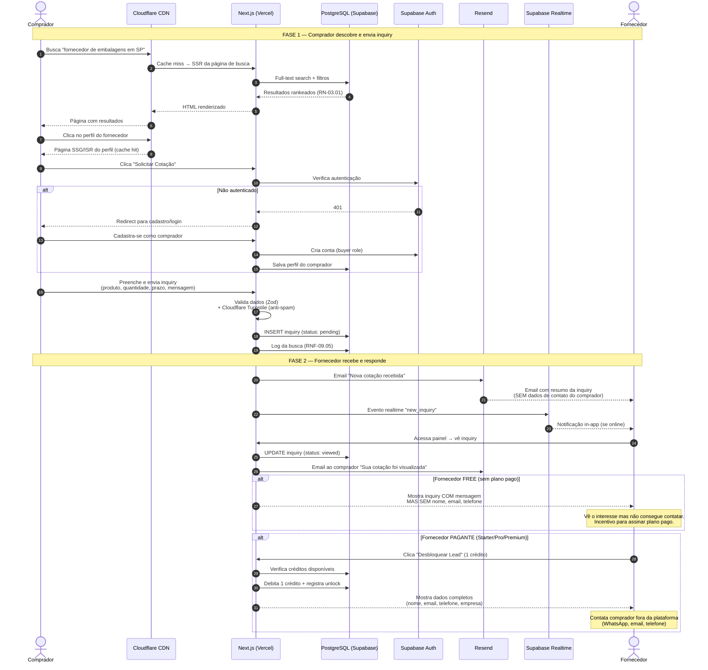
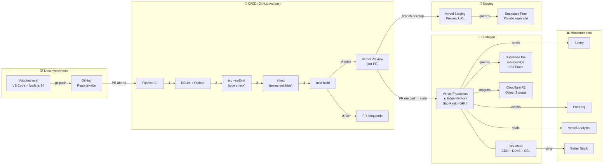
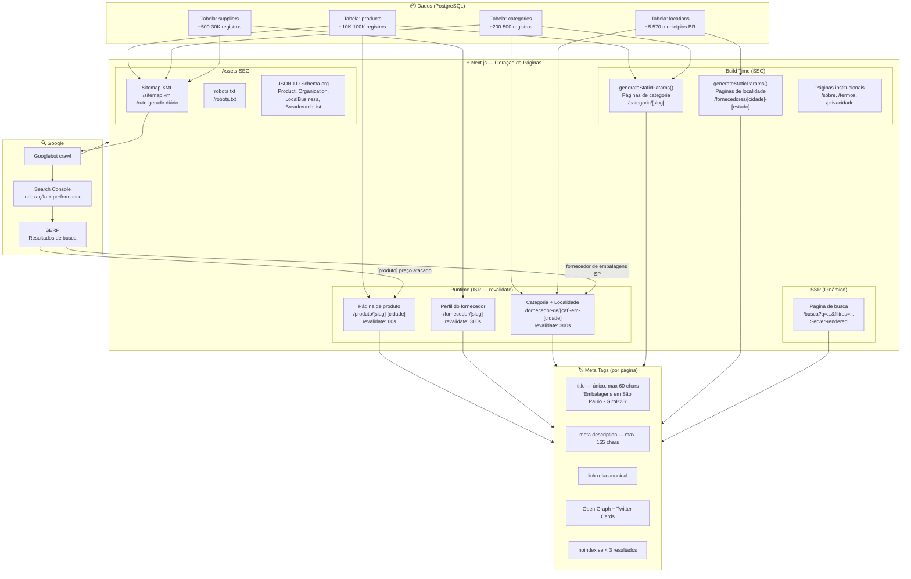
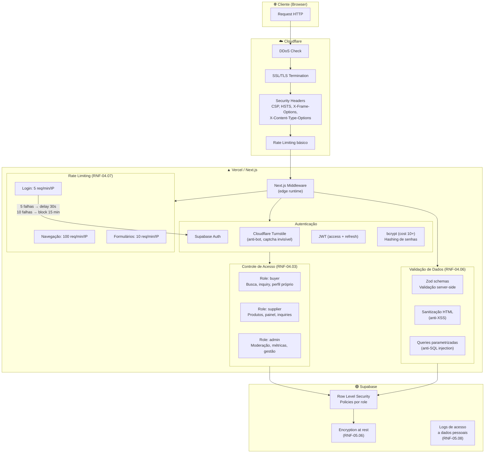

# Diagrama de Arquitetura — GiroB2B

**Versão:** 1.0
**Data:** 02/04/2026
**Autor:** Gustavo (CEO) + Claude (Arquiteto)
**Público:** Time de desenvolvimento + investidores/aceleradoras
**Insumo principal:** Artefato 2.3 — Documento de Stack Tecnológico

---

## Convenções deste documento

Este documento apresenta a arquitetura da GiroB2B em **5 visões complementares**, cada uma respondendo a uma pergunta diferente:

| # | Visão | Pergunta que responde |
|---|---|---|
| 1 | Visão Geral (C4 — Container) | Quais são os grandes blocos do sistema e como se conectam? |
| 2 | Fluxo de Dados | Como os dados fluem do comprador ao fornecedor? |
| 3 | Infraestrutura e Deploy | Onde cada componente roda e quanto custa? |
| 4 | SEO Programático | Como as páginas são geradas e indexadas? |
| 5 | Segurança e Autenticação | Como protegemos dados e controlamos acesso? |

Todos os diagramas estão em **Mermaid** (versionável em Git, renderizável em Markdown).

**Princípio arquitetural:** Monolito modular no Next.js. Um repositório, um deploy, uma linguagem (TypeScript). Microserviços só quando a complexidade justificar (estimativa: pós-mês 12).

---

## 1. Visão Geral — Container Diagram (C4 Level 2)

Esta visão mostra os grandes containers (aplicações/serviços) do sistema e suas dependências externas.

```mermaid
graph TB
    subgraph USUARIOS["👥 Usuários"]
        BUYER["🔍 Comprador<br/>(Browser/PWA)"]
        SUPPLIER["🏭 Fornecedor<br/>(Browser/PWA)"]
        ADMIN["⚙️ Admin<br/>(Browser)"]
        GOOGLE["🤖 Googlebot<br/>(Crawler)"]
    end

    subgraph EDGE["☁️ Cloudflare (CDN + Segurança)"]
        CF_DNS["DNS"]
        CF_CDN["CDN Global<br/>330+ PoPs"]
        CF_DDOS["DDoS Protection"]
        CF_SSL["SSL/TLS"]
        CF_R2["R2 Object Storage<br/>Imagens de produtos"]
        CF_TURNSTILE["Turnstile<br/>Captcha invisível"]
    end

    subgraph VERCEL["▲ Vercel (Front-end + API)"]
        NEXTJS["Next.js 16.2<br/>Framework Full-Stack"]

        subgraph FRONT["Front-end (React + Tailwind)"]
            SSG["SSG/ISR<br/>Páginas estáticas<br/>(produto, categoria, localidade)"]
            SSR["SSR<br/>Páginas dinâmicas<br/>(busca, painéis)"]
            CSR["CSR<br/>Componentes interativos<br/>(formulários, modais)"]
        end

        subgraph API["API Routes (Node.js)"]
            AUTH_API["Auth API<br/>/api/auth/*"]
            SUPPLIER_API["Supplier API<br/>/api/suppliers/*"]
            PRODUCT_API["Product API<br/>/api/products/*"]
            INQUIRY_API["Inquiry API<br/>/api/inquiries/*"]
            SEARCH_API["Search API<br/>/api/search/*"]
            ADMIN_API["Admin API<br/>/api/admin/*"]
            HEALTH["Health Check<br/>/api/health"]
            SEO_API["SEO API<br/>/api/sitemap<br/>/api/robots"]
        end
    end

    subgraph SUPABASE["🟢 Supabase (BaaS)"]
        PG["PostgreSQL 15+<br/>Banco principal"]
        SB_AUTH["Supabase Auth<br/>JWT + RBAC (RLS)"]
        SB_STORAGE["Supabase Storage<br/>Uploads temporários"]
        SB_REALTIME["Supabase Realtime<br/>Notificações in-app"]
        SB_EDGE["Edge Functions<br/>Background jobs"]
    end

    subgraph EXTERNAL["🔌 Serviços Externos"]
        CNPJ_API["BrasilAPI / ReceitaWS<br/>Validação CNPJ"]
        RESEND["Resend<br/>Email transacional"]
        STRIPE["Stripe<br/>Pagamentos<br/>(fase Monetização)"]
        WHATSAPP["WhatsApp Business API<br/>(fase Escala)"]
    end

    subgraph OBSERVABILITY["📊 Observabilidade"]
        SENTRY["Sentry<br/>Error tracking"]
        POSTHOG["PostHog<br/>Product analytics"]
        BETTERSTACK["Better Stack<br/>Uptime monitoring"]
        VERCEL_ANALYTICS["Vercel Analytics<br/>Core Web Vitals"]
        GSC["Google Search Console<br/>SEO monitoring"]
    end

    subgraph DEVOPS["🔧 DevOps"]
        GITHUB["GitHub<br/>Repositório + PRs"]
        GH_ACTIONS["GitHub Actions<br/>CI/CD pipeline"]
    end

    %% Conexões dos usuários
    BUYER --> CF_CDN
    SUPPLIER --> CF_CDN
    ADMIN --> CF_CDN
    GOOGLE --> CF_CDN

    %% Cloudflare para Vercel
    CF_CDN --> NEXTJS
    CF_DNS --> CF_CDN
    CF_DDOS --> CF_CDN
    CF_SSL --> CF_CDN

    %% Next.js interno
    NEXTJS --> FRONT
    NEXTJS --> API

    %% API para Supabase
    AUTH_API --> SB_AUTH
    SUPPLIER_API --> PG
    PRODUCT_API --> PG
    INQUIRY_API --> PG
    SEARCH_API --> PG
    ADMIN_API --> PG
    HEALTH --> PG

    %% API para externos
    SUPPLIER_API --> CNPJ_API
    INQUIRY_API --> RESEND
    SUPPLIER_API --> RESEND

    %% Storage
    PRODUCT_API --> CF_R2
    SUPPLIER_API --> CF_R2

    %% Realtime
    SB_REALTIME --> NEXTJS

    %% Observabilidade
    NEXTJS --> SENTRY
    NEXTJS --> POSTHOG
    BETTERSTACK --> HEALTH
    NEXTJS --> VERCEL_ANALYTICS

    %% DevOps
    GITHUB --> GH_ACTIONS
    GH_ACTIONS --> VERCEL

    %% Futuro
    INQUIRY_API -.-> STRIPE
    INQUIRY_API -.-> WHATSAPP
```



### Decisões arquiteturais neste diagrama

**Monolito modular.** Tudo dentro do Next.js (front + API). Não existe servidor back-end separado. As API Routes são organizadas por domínio (`/api/suppliers/*`, `/api/products/*`, etc.), cada uma como módulo independente. Isso permite extrair para microserviço no futuro sem reescrever.

**Cloudflare na frente de tudo.** Todo tráfego passa por Cloudflare antes de chegar ao Vercel. Isso garante: cache de assets estáticos no edge, proteção DDoS sem configuração, SSL/TLS gerenciado, compressão automática (Brotli/gzip).

**Cloudflare R2 para imagens (não Supabase Storage).** O free tier do Supabase Storage (1 GB) é insuficiente para imagens de produtos. R2 oferece 10 GB grátis, sem custos de egress, e integra nativamente com Cloudflare CDN. Imagens são servidas via CDN global com transformação via URL (resize, WebP). **Supabase Storage fica para uploads temporários e documentos pequenos.**

**Supabase como BaaS completo.** Auth, banco, storage auxiliar e realtime em um serviço. Reduz a quantidade de integrações e simplifica o desenvolvimento.

**Linhas tracejadas = futuro.** Stripe (Monetização, mês 7+) e WhatsApp (Escala, mês 13+) não fazem parte do MVP.

---

## 2. Fluxo de Dados — Jornada da Inquiry

Este diagrama mostra o fluxo de dados mais crítico do negócio: um comprador envia uma inquiry e um fornecedor a recebe.



### Pontos-chave do fluxo

**Consentimento LGPD (RNF-05.01).** No passo 11, o formulário de inquiry inclui checkbox de consentimento explícito: "Autorizo compartilhar meus dados de contato com fornecedores que respondam a esta cotação."

**Dados ocultos como motor de monetização.** O fornecedor free vê a inquiry (sabe que existe demanda) mas não consegue contatar o comprador. Essa é a fricção que converte para plano pago. O fluxo é deliberadamente projetado para gerar valor antes de cobrar.

**Logging estratégico (RNF-09.05).** Toda busca (passo 4) é logada: termo, filtros, resultados, cliques. Esses dados são ativos estratégicos para entender demanda por setor/região.

---

## 3. Infraestrutura e Deploy



### Ambientes isolados (RNF-10.04)

| Ambiente | Front-end | Banco | Variáveis | Propósito |
|---|---|---|---|---|
| **Local** | `next dev` (Turbopack) | Supabase local (Docker) ou projeto dev | `.env.local` | Desenvolvimento |
| **Staging** | Vercel Preview (branch `develop`) | Supabase Free (projeto 2) | `.env.staging` | QA antes de produção |
| **Produção** | Vercel Production (branch `main`) | Supabase Pro (projeto 1) | `.env.production` | Usuários reais |

**Dados de produção NUNCA vão para dev/staging** (RNF-10.04). Seeds de desenvolvimento com dados fictícios.

### Deploy flow (RNF-10.02, RNF-03.03)

1. Dev faz push para feature branch
2. GitHub Actions roda lint + types + testes + build
3. Vercel cria Preview URL automática (ex: `feat-xyz.girob2b.vercel.app`)
4. PR review (mesmo sendo 1 dev, o CI valida)
5. Merge para `develop` → deploy automático para staging
6. Merge para `main` → deploy automático para produção
7. Zero-downtime (Vercel immutable deployments)
8. Rollback: reverter para deploy anterior em 1 clique

---

## 4. SEO Programático — Geração de Páginas

O SEO programático é o motor de aquisição de compradores (custo zero). Este diagrama mostra como as páginas são geradas, cacheadas e indexadas.



### Estratégia de cache e revalidação (RNF-02.04)

| Tipo de página | Método | Revalidate | Justificativa |
|---|---|---|---|
| Produto | ISR | 60s | Fornecedor pode editar preço/descrição. 60s de stale é aceitável |
| Perfil do fornecedor | ISR | 300s (5 min) | Muda pouco. Cache mais agressivo melhora performance |
| Categoria | SSG + ISR | 300s | Listas mudam quando produtos são adicionados |
| Categoria + Localidade | ISR | 300s | Combinação mais específica, mesma lógica |
| Localidade | SSG | Build time | Lista de cidades é estática. Rebuild quando adicionar novos municípios |
| Busca | SSR | Sem cache | Resultados dependem de query params dinâmicos |
| Institucional | SSG | Build time | Conteúdo estático (sobre, termos, privacidade) |

### Volume estimado de páginas indexáveis

| Tipo | Fórmula | Mês 3 (MVP) | Mês 12 | Mês 18 |
|---|---|---|---|---|
| Produtos | 1 por produto | ~3.000 | ~30.000 | ~100.000 |
| Categorias | 1 por categoria | ~200 | ~500 | ~500 |
| Localidades | 1 por cidade ativa | ~50 | ~500 | ~2.000 |
| Cat + Localidade | categorias × cidades ativas | ~500 | ~10.000 | ~50.000 |
| Perfis | 1 por fornecedor | ~1.000 | ~10.000 | ~30.000 |
| **Total** | | **~4.750** | **~51.000** | **~182.500** |

Esse volume é o motor de SEO. Cada página é uma oportunidade de capturar busca orgânica de compradores.

---

## 5. Segurança e Autenticação



### Camadas de segurança (defense in depth)

| Camada | Componente | RNFs atendidos |
|---|---|---|
| 1 — Rede | Cloudflare DDoS + SSL/TLS | RNF-04.08, RNF-04.10 |
| 2 — Edge | Next.js Middleware (rate limiting, headers) | RNF-04.07, RNF-04.09 |
| 3 — Aplicação | Zod validation, sanitização, queries parametrizadas | RNF-04.05, RNF-04.06 |
| 4 — Autenticação | Supabase Auth (bcrypt, JWT, MFA futuro) | RNF-04.01, RNF-04.02, RNF-04.04 |
| 5 — Autorização | RBAC via RLS no PostgreSQL | RNF-04.03 |
| 6 — Dados | Encryption at rest, logs de acesso | RNF-05.06, RNF-05.08 |
| 7 — Secrets | GitHub Secrets + Vercel env vars | RNF-04.11 |
| 8 — Monitoramento | Sentry (erros), Better Stack (uptime) | RNF-09.02, RNF-09.04 |

---

## Estrutura de diretórios do projeto

```
girob2b/
├── src/
│   ├── app/                          # App Router (Next.js 16)
│   │   ├── (public)/                 # Rotas públicas (SEO)
│   │   │   ├── produto/[slug]/       # Página de produto (ISR)
│   │   │   ├── categoria/[slug]/     # Página de categoria (SSG+ISR)
│   │   │   ├── fornecedores/[loc]/   # Página de localidade (SSG)
│   │   │   ├── fornecedor-de/[combo]/ # Cat+Localidade (ISR)
│   │   │   ├── fornecedor/[slug]/    # Perfil do fornecedor (ISR)
│   │   │   └── busca/               # Busca (SSR)
│   │   ├── (auth)/                   # Rotas de autenticação
│   │   │   ├── login/
│   │   │   ├── cadastro/
│   │   │   └── recuperar-senha/
│   │   ├── (dashboard)/              # Painéis (autenticado)
│   │   │   ├── fornecedor/           # Painel do fornecedor
│   │   │   ├── comprador/            # Painel do comprador
│   │   │   └── admin/                # Painel admin
│   │   ├── api/                      # API Routes
│   │   │   ├── auth/
│   │   │   ├── suppliers/
│   │   │   ├── products/
│   │   │   ├── inquiries/
│   │   │   ├── search/
│   │   │   ├── admin/
│   │   │   ├── health/
│   │   │   └── webhooks/
│   │   ├── sitemap.xml/              # Sitemap dinâmico
│   │   ├── robots.txt/               # Robots dinâmico
│   │   └── layout.tsx                # Layout raiz
│   ├── components/                   # Componentes React
│   │   ├── ui/                       # Design system (botões, inputs, cards)
│   │   ├── forms/                    # Formulários (inquiry, cadastro, produto)
│   │   ├── layout/                   # Header, footer, sidebar, breadcrumbs
│   │   └── seo/                      # Meta tags, JSON-LD, OpenGraph
│   ├── lib/                          # Lógica de negócio
│   │   ├── db/                       # Queries e schemas (Prisma ou Drizzle)
│   │   ├── auth/                     # Helpers de autenticação
│   │   ├── search/                   # Lógica de busca e ranking
│   │   ├── email/                    # Templates e envio (Resend)
│   │   ├── validation/               # Schemas Zod
│   │   ├── seo/                      # Geração de meta tags, sitemap
│   │   └── utils/                    # Helpers genéricos
│   ├── types/                        # Tipos TypeScript compartilhados
│   └── styles/                       # Tailwind config + globals
├── public/                           # Assets estáticos
│   ├── icons/                        # PWA icons
│   └── manifest.json                 # PWA manifest
├── tests/                            # Testes (Vitest)
├── supabase/                         # Migrations e seeds
│   ├── migrations/
│   └── seed.sql
├── .github/
│   └── workflows/                    # GitHub Actions CI/CD
├── .env.local                        # Env local (git-ignored)
├── .env.example                      # Template de env vars
├── next.config.ts                    # Config Next.js
├── tailwind.config.ts                # Config Tailwind (v4: CSS-first)
├── tsconfig.json                     # TypeScript strict
├── package.json
└── README.md
```

### Organização por domínio

A estrutura segue o princípio de **separação por domínio**, não por tipo de arquivo. A pasta `lib/` contém a lógica de negócio organizada por funcionalidade (db, auth, search, email), facilitando a futura extração para microserviços se necessário.

---

## Decisões arquiteturais registradas (ADRs — Architecture Decision Records)

| # | Decisão | Justificativa | Alternativa descartada |
|---|---|---|---|
| ADR-01 | Monolito modular (Next.js full-stack) | 1 dev, 1 deploy, 1 linguagem. Maximiza produtividade | Microserviços (overhead de comunicação e deploy) |
| ADR-02 | Cloudflare R2 para imagens (não Supabase Storage) | Free tier 10 GB vs 1 GB. Sem egress fees. CDN nativa | Supabase Storage (1 GB insuficiente) |
| ADR-03 | SSG/ISR para SEO, SSR para busca | Páginas estáticas escalam infinitamente. Busca precisa de params dinâmicos | SSR para tudo (mais caro em compute, mais lento) |
| ADR-04 | RLS no Supabase como camada de autorização | Segurança no nível do banco. Mesmo se a API tiver bug, o banco bloqueia acesso indevido | RBAC apenas na aplicação (risco se bypass) |
| ADR-05 | PostHog cookieless (não Google Analytics) | LGPD-first. Sem banner de cookies para analytics | GA4 (requer consentimento, envia dados para Google) |
| ADR-06 | PWA em vez de app nativo | Custo zero, sem App Store, mesma base de código | React Native (2 codebases, 2 deploys, App Store review) |
| ADR-07 | App Router (não Pages Router) | Next.js 16 recomenda App Router. Server Components reduzem JS no client | Pages Router (legacy, sem Server Components) |
| ADR-08 | Vitest (não Jest) para testes | Mais rápido, integração nativa com TypeScript e Vite/Turbopack | Jest (mais lento, configuração mais complexa) |

---

## Mapeamento: arquitetura × requisitos

### Requisitos Funcionais cobertos pela arquitetura

| Módulo RF | Componente arquitetural |
|---|---|
| 01 — Cadastro e Auth | Supabase Auth + API `/api/auth/*` + Turnstile |
| 02 — Perfil do Fornecedor | API `/api/suppliers/*` + PostgreSQL + R2 (logo) |
| 03 — Catálogo de Produtos | API `/api/products/*` + PostgreSQL + R2 (fotos) |
| 04 — Busca e Descoberta | API `/api/search/*` + PostgreSQL FTS + SSR |
| 05 — SEO Programático | SSG/ISR + Sitemap + Schema.org + Cloudflare CDN |
| 06 — Inquiries | API `/api/inquiries/*` + PostgreSQL + Resend + Realtime |
| 07 — Leads e Créditos | API `/api/inquiries/unlock` + PostgreSQL (Monetização) |
| 08 — Planos e Assinaturas | API `/api/subscriptions/*` + Stripe (Monetização) |
| 09 — Painel do Fornecedor | Dashboard SSR `/fornecedor/*` + API |
| 10 — Painel do Comprador | Dashboard SSR `/comprador/*` + API |
| 11 — Verificação | API `/api/suppliers/verify` + BrasilAPI/ReceitaWS |
| 12 — Administração | Dashboard SSR `/admin/*` + API `/api/admin/*` |
| 13 — Notificações | Resend (email) + Supabase Realtime (in-app) |
| 14 — Institucional | SSG (páginas estáticas) |

### RNFs cobertos pela arquitetura

| Categoria RNF | Como a arquitetura atende |
|---|---|
| 01 — Performance | CDN (Cloudflare) + Edge (Vercel GRU) + SSG/ISR + Tailwind CSS mínimo |
| 02 — Escalabilidade | ISR (páginas sem rebuild), PostgreSQL (500K+ registros), Vercel auto-scale |
| 03 — Disponibilidade | Vercel (99.99%), Cloudflare (redundância), health checks, Better Stack |
| 04 — Segurança | 8 camadas (rede → dados), DDoS, rate limiting, RBAC/RLS, Zod validation |
| 05 — LGPD | Encryption at rest, consentimento no fluxo, PostHog cookieless, RLS |
| 06 — Acessibilidade | HTML semântico (React), Tailwind (contraste), ARIA attributes |
| 07 — Compatibilidade | PWA, responsivo (Tailwind breakpoints), navegadores modernos |
| 08 — SEO Técnico | SSG/ISR, sitemap XML, robots.txt, Schema.org JSON-LD, meta tags únicas |
| 09 — Observabilidade | Sentry + PostHog + Better Stack + Vercel Analytics + logs de busca |
| 10 — Manutenibilidade | TypeScript strict, ESLint, GitHub Actions CI/CD, 3 ambientes |
| 11 — Backup | Supabase Pro (diários), R2 (redundante), offsite via AWS/Azure |

---

## Limitações conhecidas e evolução futura

| Limitação atual | Quando resolver | Solução planejada |
|---|---|---|
| Full-text search nativo do PostgreSQL | Quando > 100K produtos (RNF-02.03) | Migrar para Meilisearch ou Typesense |
| Monolito Next.js (tudo em um deploy) | Quando equipe > 3 devs | Extrair API para microserviço Node.js (ou Python para ML) |
| WAF básico (Cloudflare free) | Quando houver receita ou ataques L7 | Upgrade para Cloudflare Pro ($20/mês) |
| Sem queue/workers dedicados | Quando background jobs crescerem | Adicionar BullMQ + Redis via Railway |
| Supabase Realtime (limitações do free tier) | Quando > 1.000 conexões simultâneas | Avaliar Pusher ou Ably como alternativa |
| Sem CDN de imagens com transformação | Quando volume de imagens crescer | Cloudflare Images ($5/100K transformações) |

---

## Fontes

### Arquitetura e padrões
- Artefato 2.3 — `2.3_STACK_TECNOLOGICO.md` — decisões de tecnologia com justificativas
- Artefato 1.4 — `1.4_REQUISITOS_FUNCIONAIS.md` — 14 módulos, 90 RFs
- Artefato 1.5 — `1.5_REQUISITOS_NAO_FUNCIONAIS.md` — 67 RNFs
- Artefato 1.6 — `1.6_REGRAS_DE_NEGOCIO.md` — algoritmos de ranking e distribuição
- Artefato 1.7 — `1.7_DEFINICAO_MVP_SCOPE_LOCK.md` — escopo do MVP
- `REFERENCIA_CONSOLIDADA.md` — seções 6 (stack), 16 (algoritmos), 18 (URLs SEO)

### Next.js App Router
- [Next.js App Router Docs — nextjs.org](https://nextjs.org/docs/app) — referência oficial
- [Next.js ISR Docs — nextjs.org](https://nextjs.org/docs/app/building-your-application/data-fetching/incremental-static-regeneration) — revalidação incremental

### C4 Model
- [C4 Model — c4model.com](https://c4model.com/) — framework de diagramas de arquitetura (Context, Container, Component, Code)

### Supabase RLS
- [Supabase Row Level Security — supabase.com](https://supabase.com/docs/guides/database/postgres/row-level-security) — autorização no nível do banco
