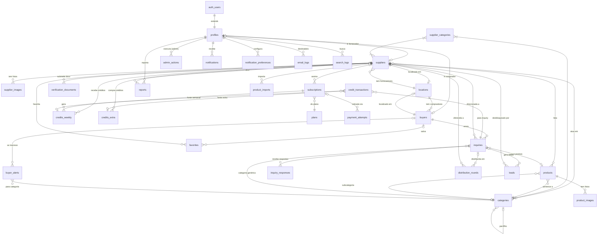
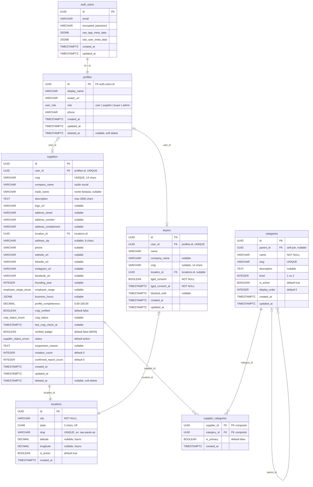
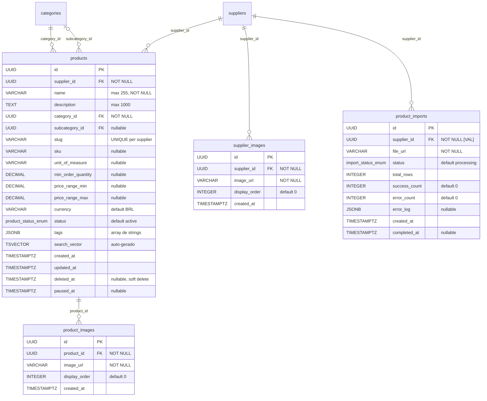
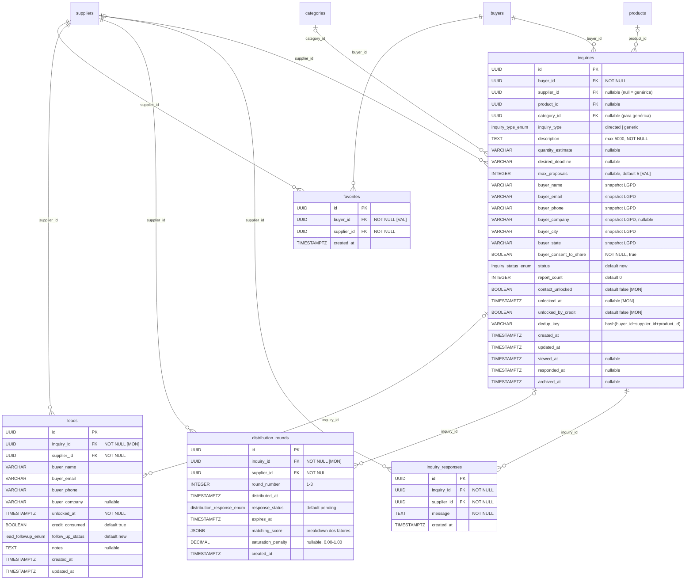
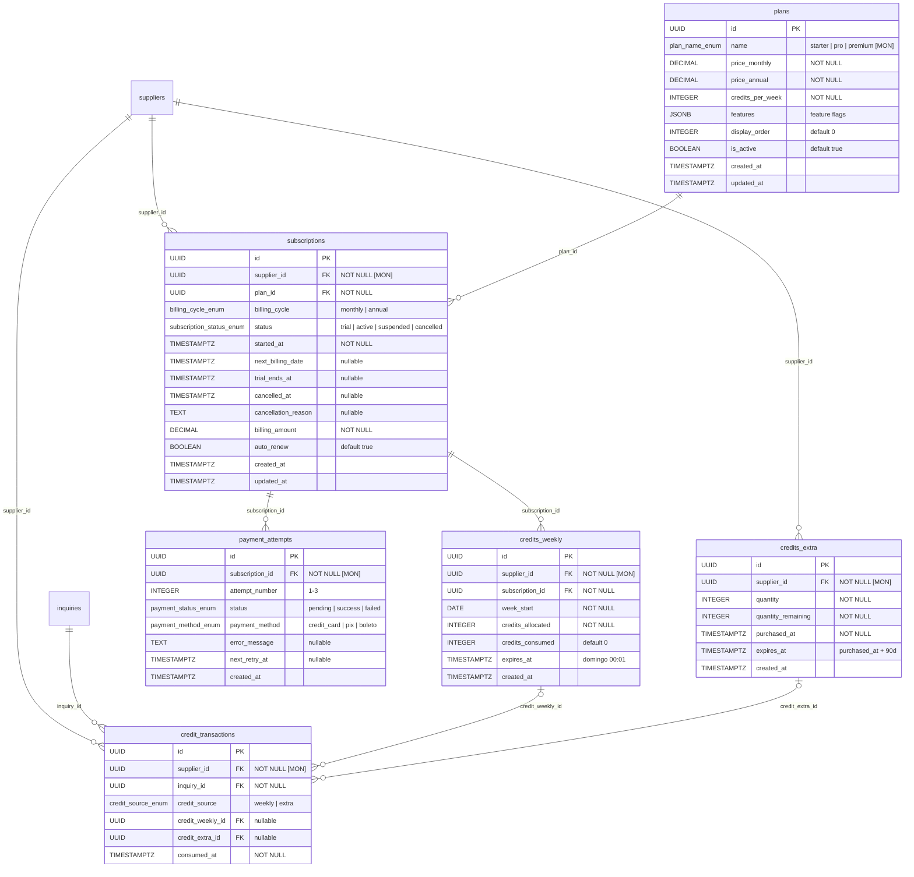

# Diagrama Entidade-Relacionamento (ERD) — GiroB2B

**Versão:** 1.0
**Data:** 2026-04-03
**Autor:** Gustavo (CEO) + Claude (Arquiteto)
**Público:** Time de desenvolvimento
**Insumos:** 1.4 RFs, 1.6 RNs, 1.7 Scope Lock, 1.8 Glossário, 2.1 UCs, 2.2 USs, 2.3 Stack, 2.4 Arquitetura, REFERENCIA_CONSOLIDADA.md

---

## 1. Convenções

### 1.1 Nomenclatura

| Elemento | Padrão | Exemplo |
|----------|--------|---------|
| Tabelas | snake_case, plural, inglês | `suppliers`, `credit_transactions` |
| Colunas | snake_case, inglês | `company_name`, `profile_completeness` |
| PKs | `id` (UUID v7) | `id UUID PRIMARY KEY DEFAULT gen_random_uuid()` |
| FKs | `{entidade_singular}_id` | `supplier_id`, `category_id` |
| Índices | `idx_{tabela}_{colunas}` | `idx_products_supplier_id` |
| Constraints | `chk_{tabela}_{regra}` | `chk_products_price_range` |
| Unique | `unq_{tabela}_{colunas}` | `unq_suppliers_cnpj` |

### 1.2 Tipos PostgreSQL utilizados

| Uso | Tipo | Justificativa |
|-----|------|---------------|
| Identificadores | `UUID` (v7) | Time-sortable, seguro, distribuído |
| Texto curto | `VARCHAR(n)` | Limite explícito para validação |
| Texto longo | `TEXT` | Descrições, notas |
| Números inteiros | `INTEGER` | Contadores, quantidades |
| Valores monetários | `DECIMAL(10,2)` | Precisão para BRL |
| Percentuais | `DECIMAL(5,2)` | 0.00 a 100.00 |
| Booleanos | `BOOLEAN` | Flags |
| Timestamps | `TIMESTAMPTZ` | Timezone-aware (America/Sao_Paulo) |
| Datas | `DATE` | Sem hora |
| Dados flexíveis | `JSONB` | Estruturas variáveis |
| Busca textual | `TSVECTOR` | Full-text search com GIN index |
| Enums | `CREATE TYPE ... AS ENUM` | Valores fixos validados pelo banco |

### 1.3 Representação de fases

| Fase | Meses | Cor no diagrama | Sigla |
|------|-------|-----------------|-------|
| MVP | 1-3 | Sem marcação (default) | — |
| Validação | 4-6 | `[VAL]` | VAL |
| Monetização | 7-9 | `[MON]` | MON |
| Tração | 10-12 | `[TRA]` | TRA |
| Escala | 13-18 | `[ESC]` | ESC |

Entidades e campos que pertencem a fases futuras estão documentados no ERD completo, mas devem ser criados apenas na fase correspondente. O desenvolvedor deve filtrar por fase ao gerar migrations.

### 1.4 Legenda de cardinalidades (Mermaid)

| Símbolo | Significado |
|---------|-------------|
| `\|\|--o{` | Um para muitos (obrigatório do lado esquerdo) |
| `\|o--o{` | Um para muitos (opcional do lado esquerdo) |
| `\|\|--\|\|` | Um para um (obrigatório) |
| `}o--o{` | Muitos para muitos |

---

## 2. Diagramas ERD

### 2.1 Diagrama Consolidado (visão geral — sem atributos)



### 2.2 Diagrama — Domínio Identidade



### 2.3 Diagrama — Domínio Catálogo



### 2.4 Diagrama — Domínio Inquiries e Leads



### 2.5 Diagrama — Domínio Monetização



### 2.6 Diagrama — Domínio Moderação, Notificações e Analytics

```mermaid
erDiagram
    reports {
        UUID id PK
        UUID reporter_id FK "profiles.id, NOT NULL"
        report_target_type_enum target_type "supplier | product | inquiry"
        UUID target_id "NOT NULL"
        report_reason_enum reason "spam | fraud | inappropriate | other"
        TEXT description "nullable"
        report_status_enum status "default pending"
        UUID reviewed_by FK "profiles.id, nullable"
        TIMESTAMPTZ reviewed_at "nullable"
        TIMESTAMPTZ created_at
    }

    admin_actions {
        UUID id PK
        UUID admin_id FK "profiles.id, NOT NULL"
        admin_action_type_enum action_type "suspend | reactivate | warn | delete | edit | verify"
        admin_target_type_enum target_type "supplier | product | inquiry | category"
        UUID target_id "NOT NULL"
        TEXT reason "NOT NULL"
        JSONB details "nullable"
        TIMESTAMPTZ created_at "INSERT-ONLY"
    }

    verification_documents {
        UUID id PK
        UUID supplier_id FK "NOT NULL [MON]"
        verification_doc_type_enum document_type "address_proof | identity | storefront_photo"
        VARCHAR document_url "NOT NULL"
        verification_status_enum status "default pending"
        UUID reviewed_by FK "profiles.id, nullable"
        TIMESTAMPTZ reviewed_at "nullable"
        TIMESTAMPTZ created_at
    }

    system_configs {
        UUID id PK
        VARCHAR key "UNIQUE, NOT NULL"
        JSONB value "NOT NULL"
        TEXT description "nullable"
        TIMESTAMPTZ updated_at
        UUID updated_by FK "profiles.id, nullable"
    }

    notifications {
        UUID id PK
        UUID recipient_id FK "profiles.id, NOT NULL"
        notification_event_enum event_type
        notification_channel_enum channel "email | in_app | push"
        notification_status_enum status "default pending"
        TIMESTAMPTZ read_at "nullable"
        TIMESTAMPTZ sent_at "nullable"
        JSONB metadata "nullable"
        TIMESTAMPTZ created_at
    }

    notification_preferences {
        UUID id PK
        UUID user_id FK "profiles.id, NOT NULL"
        notification_event_enum event_type
        BOOLEAN email_enabled "default true"
        BOOLEAN push_enabled "default true"
        TIMESTAMPTZ updated_at
    }

    email_logs {
        UUID id PK
        UUID recipient_id FK "profiles.id, nullable"
        VARCHAR recipient_email "NOT NULL"
        VARCHAR event_type "NOT NULL"
        email_status_enum status "sent | failed | bounced"
        INTEGER bounce_count "default 0"
        UUID unsubscribe_token "NOT NULL"
        TIMESTAMPTZ sent_at
        TIMESTAMPTZ created_at
    }

    search_logs {
        UUID id PK
        UUID user_id FK "profiles.id, nullable"
        VARCHAR session_id "nullable"
        TEXT query "NOT NULL"
        JSONB filters "nullable"
        INTEGER results_count
        UUID clicked_product_id FK "nullable"
        UUID clicked_supplier_id FK "nullable"
        TIMESTAMPTZ created_at
    }

    buyer_alerts {
        UUID id PK
        UUID buyer_id FK "buyers.id, NOT NULL [VAL]"
        UUID category_id FK "categories.id, NOT NULL"
        TIMESTAMPTZ created_at
    }

    profiles ||--o{ reports : "reporter_id"
    profiles ||--o{ admin_actions : "admin_id"
    profiles ||--o{ notifications : "recipient_id"
    profiles ||--o{ notification_preferences : "user_id"
    profiles |o--o{ email_logs : "recipient_id"
    profiles |o--o{ search_logs : "user_id"
    suppliers ||--o{ verification_documents : "supplier_id"
    buyers ||--o{ buyer_alerts : "buyer_id"
    categories ||--o{ buyer_alerts : "category_id"
```



---

## 3. Catálogo de Entidades

### 3.1 `profiles`

**Descrição:** Estende `auth.users` do Supabase. Tabela-ponte entre o sistema de autenticação gerenciado pelo Supabase e as entidades de domínio (suppliers, buyers). Todo usuário autenticado tem exatamente um profile.

**Fase:** MVP

| Coluna | Tipo | Nullable | Default | Constraint | Descrição |
|--------|------|----------|---------|------------|-----------|
| `id` | `UUID` | NO | — | PK, FK `auth.users(id)` ON DELETE CASCADE | Mesmo ID do Supabase Auth |
| `display_name` | `VARCHAR(255)` | YES | `NULL` | — | Nome de exibição |
| `avatar_url` | `VARCHAR(500)` | YES | `NULL` | — | URL do avatar no R2/Storage |
| `role` | `user_role` | NO | `'user'` | — | Enum: `user`, `supplier`, `buyer`, `admin` |
| `phone` | `VARCHAR(20)` | YES | `NULL` | — | Telefone (formato brasileiro) |
| `created_at` | `TIMESTAMPTZ` | NO | `now()` | — | — |
| `updated_at` | `TIMESTAMPTZ` | NO | `now()` | — | — |
| `deleted_at` | `TIMESTAMPTZ` | YES | `NULL` | — | Soft delete |

**Índices:**
- PK em `id`
- `idx_profiles_role` em `role` — filtragem por tipo de usuário no admin

**Rastreabilidade:** RF-01.01, RF-01.02, RF-01.06, UC-01, UC-12, US-001, US-024

**RLS:** Usuário lê/edita apenas seu próprio profile. Admin lê todos.

---

### 3.2 `suppliers`

**Descrição:** Dados cadastrais e de perfil da empresa fornecedora. Entidade central do marketplace. O perfil público é construído a partir dos campos desta tabela combinados com `products`, `supplier_images` e `supplier_categories`.

**Fase:** MVP (campos de verificação Nível 2 e selo = Monetização)

| Coluna | Tipo | Nullable | Default | Constraint | Descrição |
|--------|------|----------|---------|------------|-----------|
| `id` | `UUID` | NO | `gen_random_uuid()` | PK | — |
| `user_id` | `UUID` | NO | — | FK `profiles(id)`, UNIQUE | Vínculo com auth |
| `cnpj` | `VARCHAR(14)` | NO | — | UNIQUE, `chk_suppliers_cnpj_format` | Apenas dígitos, validado contra Receita |
| `company_name` | `VARCHAR(255)` | NO | — | — | Razão social (da Receita) |
| `trade_name` | `VARCHAR(255)` | YES | `NULL` | — | Nome fantasia |
| `description` | `TEXT` | YES | `NULL` | `chk_suppliers_desc_length` (max 2000) | Descrição da empresa |
| `logo_url` | `VARCHAR(500)` | YES | `NULL` | — | URL no R2 |
| `address_street` | `VARCHAR(255)` | YES | `NULL` | — | Logradouro |
| `address_number` | `VARCHAR(20)` | YES | `NULL` | — | Número |
| `address_complement` | `VARCHAR(100)` | YES | `NULL` | — | Complemento |
| `location_id` | `UUID` | YES | `NULL` | FK `locations(id)` | Cidade/estado normalizado |
| `address_zip` | `VARCHAR(8)` | YES | `NULL` | — | CEP (apenas dígitos) |
| `phone` | `VARCHAR(20)` | YES | `NULL` | — | Telefone comercial |
| `website_url` | `VARCHAR(500)` | YES | `NULL` | — | Site institucional |
| `linkedin_url` | `VARCHAR(500)` | YES | `NULL` | — | Perfil LinkedIn |
| `instagram_url` | `VARCHAR(500)` | YES | `NULL` | — | Perfil Instagram |
| `facebook_url` | `VARCHAR(500)` | YES | `NULL` | — | Página Facebook |
| `founding_year` | `INTEGER` | YES | `NULL` | `chk_suppliers_founding_year` (1900-2030) | Ano de fundação |
| `employee_range` | `employee_range_enum` | YES | `NULL` | — | Faixa de funcionários |
| `business_hours` | `JSONB` | YES | `NULL` | — | Ex: `{"mon-fri": "09:00-18:00"}` |
| `profile_completeness` | `DECIMAL(5,2)` | NO | `0.00` | `chk_suppliers_completeness` (0-100) | Calculado via RN-02.01 |
| `cnpj_verified` | `BOOLEAN` | NO | `false` | — | Nível 1: validado via ReceitaWS/BrasilAPI |
| `cnpj_status` | `cnpj_status_enum` | YES | `NULL` | — | Situação cadastral retornada pela Receita |
| `last_cnpj_check_at` | `TIMESTAMPTZ` | YES | `NULL` | — | Última revalidação (a cada 90 dias) |
| `verified_badge` | `BOOLEAN` | NO | `false` | — | **[MON]** Selo GiroB2B Verificado (Nível 2) |
| `status` | `supplier_status_enum` | NO | `'active'` | — | Status da conta |
| `suspension_reason` | `TEXT` | YES | `NULL` | — | Motivo de suspensão (admin) |
| `violation_count` | `INTEGER` | NO | `0` | — | Total de violações registradas |
| `confirmed_report_count` | `INTEGER` | NO | `0` | — | Denúncias confirmadas (3=advertência, 5=suspensão) |
| `created_at` | `TIMESTAMPTZ` | NO | `now()` | — | — |
| `updated_at` | `TIMESTAMPTZ` | NO | `now()` | — | — |
| `deleted_at` | `TIMESTAMPTZ` | YES | `NULL` | — | Soft delete (30 dias para recuperação) |

**Índices:**
- PK em `id`
- `unq_suppliers_user_id` UNIQUE em `user_id`
- `unq_suppliers_cnpj` UNIQUE em `cnpj`
- `idx_suppliers_location_id` em `location_id` — busca geográfica
- `idx_suppliers_status` em `status` — filtragem de ativos
- `idx_suppliers_profile_completeness` em `profile_completeness` — fator de ranking (RN-03.01, peso 15%)
- `idx_suppliers_created_at` em `created_at` — fator de frescor no ranking (peso 10%)
- `idx_suppliers_verified_badge` em `verified_badge` — filtro de busca

**Rastreabilidade:** RF-01.01 a 01.05, RF-02.01 a 02.07, RF-11.01 a 11.04, RN-01.01 a 01.04, RN-02.01, RN-07.05, RN-07.06, UC-01 a UC-04, UC-18, US-001 a US-010

**RLS:** Supplier lê/edita apenas seus próprios dados. Dados públicos (perfil ativo) visíveis para todos. Admin lê/edita todos.

**Observações:**
- Soft delete com janela de 30 dias (RN-02.05). Job agendado faz hard delete após expiração.
- `profile_completeness` recalculado na aplicação a cada alteração de perfil, produtos ou imagens (RN-02.01).
- `cnpj` revalidado a cada 90 dias via job agendado (RN-07.06).

---

### 3.3 `buyers`

**Descrição:** Dados específicos do comprador. Compradores podem navegar sem conta (RN-01.05), mas precisam de cadastro para enviar inquiries. CNPJ opcional (RN-01.06).

**Fase:** MVP

| Coluna | Tipo | Nullable | Default | Constraint | Descrição |
|--------|------|----------|---------|------------|-----------|
| `id` | `UUID` | NO | `gen_random_uuid()` | PK | — |
| `user_id` | `UUID` | NO | — | FK `profiles(id)`, UNIQUE | Vínculo com auth |
| `name` | `VARCHAR(255)` | NO | — | — | Nome completo |
| `company_name` | `VARCHAR(255)` | YES | `NULL` | — | Empresa (opcional) |
| `cnpj` | `VARCHAR(14)` | YES | `NULL` | — | CNPJ (opcional para buyers) |
| `location_id` | `UUID` | YES | `NULL` | FK `locations(id)` | Cidade/estado |
| `lgpd_consent` | `BOOLEAN` | NO | — | `chk_buyers_lgpd_consent` (= true) | Consentimento obrigatório |
| `lgpd_consent_at` | `TIMESTAMPTZ` | NO | — | — | Timestamp do consentimento |
| `blocked_until` | `TIMESTAMPTZ` | YES | `NULL` | — | Bloqueio por denúncias (30d, RN-07.04) |
| `created_at` | `TIMESTAMPTZ` | NO | `now()` | — | — |
| `updated_at` | `TIMESTAMPTZ` | NO | `now()` | — | — |

**Índices:**
- PK em `id`
- `unq_buyers_user_id` UNIQUE em `user_id`
- `idx_buyers_location_id` em `location_id`

**Rastreabilidade:** RF-01.06, RF-01.07, RF-10.01 a 10.03, RN-01.05 a 01.07, UC-12, UC-13, US-024, US-026

**RLS:** Buyer lê/edita apenas seus próprios dados. Admin lê todos.

---

### 3.4 `locations`

**Descrição:** Tabela normalizada de cidades e estados brasileiros. Garante consistência de nomes para busca geográfica, SEO programático (URLs `/fornecedores/[slug]`) e regra de thin content (RN-03.06). Suppliers e buyers referenciam esta tabela via FK.

**Fase:** MVP

| Coluna | Tipo | Nullable | Default | Constraint | Descrição |
|--------|------|----------|---------|------------|-----------|
| `id` | `UUID` | NO | `gen_random_uuid()` | PK | — |
| `city` | `VARCHAR(100)` | NO | — | — | Nome da cidade |
| `state` | `CHAR(2)` | NO | — | — | UF (ex: SP, RJ, MG) |
| `slug` | `VARCHAR(120)` | NO | — | UNIQUE | Ex: `sao-paulo-sp`, para URLs SEO |
| `latitude` | `DECIMAL(10,7)` | YES | `NULL` | — | Para proximidade geográfica (futuro) |
| `longitude` | `DECIMAL(10,7)` | YES | `NULL` | — | Para proximidade geográfica (futuro) |
| `is_active` | `BOOLEAN` | NO | `true` | — | Permite desativar cidades sem fornecedores |
| `created_at` | `TIMESTAMPTZ` | NO | `now()` | — | — |

**Índices:**
- PK em `id`
- `unq_locations_slug` UNIQUE em `slug`
- `unq_locations_city_state` UNIQUE em `(city, state)` — previne duplicatas
- `idx_locations_state` em `state` — filtro por estado

**Rastreabilidade:** RF-04.03, RF-05.02 a 05.04, RN-03.05, RN-03.06, UC-11, US-021, US-022

**RLS:** Leitura pública (dados de localidade são públicos). Escrita apenas admin.

**Observações:**
- Tabela populada inicialmente com seed de cidades onde há fornecedores cadastrados.
- Novas cidades inseridas automaticamente no cadastro do primeiro fornecedor daquela localidade.
- `latitude`/`longitude` são campos preparados para o fator de proximidade geográfica no ranking (RN-03.01, peso 15%). Implementação real na fase Validação/Monetização.

---

### 3.5 `categories`

**Descrição:** Taxonomia hierárquica de categorias de produtos/serviços. Dois níveis: categoria (parent, level=1) e subcategoria (child, level=2). Gerenciada pelo admin (RF-12.05). Self-join via `parent_id`.

**Fase:** MVP

| Coluna | Tipo | Nullable | Default | Constraint | Descrição |
|--------|------|----------|---------|------------|-----------|
| `id` | `UUID` | NO | `gen_random_uuid()` | PK | — |
| `parent_id` | `UUID` | YES | `NULL` | FK `categories(id)` | NULL = categoria pai |
| `name` | `VARCHAR(100)` | NO | — | — | Nome da categoria |
| `slug` | `VARCHAR(120)` | NO | — | UNIQUE | Para URLs SEO |
| `description` | `TEXT` | YES | `NULL` | — | Descrição para SEO |
| `level` | `INTEGER` | NO | — | `chk_categories_level` (1 ou 2) | 1=categoria, 2=subcategoria |
| `is_active` | `BOOLEAN` | NO | `true` | — | Permite desativar sem deletar |
| `display_order` | `INTEGER` | NO | `0` | — | Ordem de exibição |
| `created_at` | `TIMESTAMPTZ` | NO | `now()` | — | — |
| `updated_at` | `TIMESTAMPTZ` | NO | `now()` | — | — |

**Índices:**
- PK em `id`
- `unq_categories_slug` UNIQUE em `slug`
- `idx_categories_parent_id` em `parent_id` — busca de subcategorias
- `idx_categories_level_active` em `(level, is_active)` — listagem de categorias ativas

**Rastreabilidade:** RF-03.04, RF-04.01 a 04.03, RF-05.01 a 05.04, RF-12.05, RN-02.04, RN-03.05, UC-11, UC-19, US-005

**RLS:** Leitura pública. Escrita apenas admin.

**Observações:**
- Profundidade limitada a 2 níveis (constraint `chk_categories_level`).
- Produtos sem categoria atribuída caem em "Outros" (RN-02.04) — categoria seed com slug `outros`.
- Subcategoria herda `is_active` do pai? Não: gerenciamento independente.

---

### 3.6 `supplier_categories`

**Descrição:** Tabela de junção N:N entre fornecedores e categorias. Cada fornecedor pode selecionar até 5 categorias (RF-02.03), sendo uma marcada como primária.

**Fase:** MVP

| Coluna | Tipo | Nullable | Default | Constraint | Descrição |
|--------|------|----------|---------|------------|-----------|
| `supplier_id` | `UUID` | NO | — | FK `suppliers(id)` ON DELETE CASCADE, PK composto | — |
| `category_id` | `UUID` | NO | — | FK `categories(id)`, PK composto | — |
| `is_primary` | `BOOLEAN` | NO | `false` | — | Categoria principal do fornecedor |
| `created_at` | `TIMESTAMPTZ` | NO | `now()` | — | — |

**Índices:**
- PK composto em `(supplier_id, category_id)`
- `idx_supplier_categories_category_id` em `category_id` — busca reversa (fornecedores por categoria)

**Rastreabilidade:** RF-02.03, RN-02.01 (peso 10% na completude), UC-02, US-005

**RLS:** Mesmo escopo do supplier proprietário.

**Observações:**
- Limite de 5 categorias por fornecedor aplicado na camada de aplicação (não no banco).
- Apenas uma `is_primary = true` por supplier — validação na aplicação.

---

### 3.7 `products`

**Descrição:** Itens do catálogo do fornecedor. Listagem ilimitada e gratuita (RN-02.03). Suporta soft delete com janela de 30 dias (RN-02.05). Tags auto-geradas a partir de nome + descrição (RN-02.07). Full-text search via `search_vector` (tsvector).

**Fase:** MVP

| Coluna | Tipo | Nullable | Default | Constraint | Descrição |
|--------|------|----------|---------|------------|-----------|
| `id` | `UUID` | NO | `gen_random_uuid()` | PK | — |
| `supplier_id` | `UUID` | NO | — | FK `suppliers(id)` ON DELETE CASCADE | Fornecedor dono |
| `name` | `VARCHAR(255)` | NO | — | — | Nome do produto |
| `description` | `TEXT` | YES | `NULL` | `chk_products_desc_length` (max 1000) | Descrição (≥100 chars conta para completude) |
| `category_id` | `UUID` | NO | — | FK `categories(id)` | Categoria principal |
| `subcategory_id` | `UUID` | YES | `NULL` | FK `categories(id)` | Subcategoria |
| `slug` | `VARCHAR(280)` | NO | — | — | URL-friendly, UNIQUE per supplier |
| `sku` | `VARCHAR(50)` | YES | `NULL` | — | Código interno do fornecedor |
| `unit_of_measure` | `VARCHAR(50)` | YES | `NULL` | — | Ex: unidade, kg, metro, caixa |
| `min_order_quantity` | `DECIMAL(10,2)` | YES | `NULL` | `chk_products_min_qty` (>= 0) | Quantidade mínima |
| `price_range_min` | `DECIMAL(10,2)` | YES | `NULL` | — | Preço mínimo (opcional, RN-02.06) |
| `price_range_max` | `DECIMAL(10,2)` | YES | `NULL` | — | Preço máximo (opcional) |
| `currency` | `VARCHAR(3)` | NO | `'BRL'` | — | Moeda |
| `status` | `product_status_enum` | NO | `'active'` | — | active, paused, deleted |
| `tags` | `JSONB` | YES | `NULL` | — | Array de strings, auto-gerado + editável |
| `search_vector` | `TSVECTOR` | YES | `NULL` | — | Auto-populado por trigger |
| `created_at` | `TIMESTAMPTZ` | NO | `now()` | — | — |
| `updated_at` | `TIMESTAMPTZ` | NO | `now()` | — | — |
| `deleted_at` | `TIMESTAMPTZ` | YES | `NULL` | — | Soft delete |
| `paused_at` | `TIMESTAMPTZ` | YES | `NULL` | — | Quando foi pausado |

**Índices:**
- PK em `id`
- `idx_products_supplier_id` em `supplier_id`
- `unq_products_supplier_slug` UNIQUE em `(supplier_id, slug)` — slug único por fornecedor
- `idx_products_category_id` em `category_id`
- `idx_products_subcategory_id` em `subcategory_id`
- `idx_products_status` em `status` — filtragem de ativos
- `idx_products_search_vector` GIN em `search_vector` — full-text search
- `idx_products_tags` GIN em `tags` — busca por tags

**Constraints:**
- `chk_products_price_range`: `price_range_min IS NULL OR price_range_max IS NULL OR price_range_min <= price_range_max`

**Rastreabilidade:** RF-03.01 a 03.07, RN-02.03 a 02.07, RN-03.01, UC-03, UC-04, UC-11, US-006 a US-011

**RLS:** Supplier lê/edita apenas seus produtos. Produtos ativos são leitura pública. Admin lê/edita todos.

**Observações:**
- `search_vector` populado por trigger: `to_tsvector('portuguese', name || ' ' || coalesce(description,'') || ' ' || coalesce(tags::text,''))`.
- Soft delete: queries filtram `WHERE deleted_at IS NULL`. Job agendado faz hard delete após 30 dias.
- Produtos pausados (`status = 'paused'`) não aparecem em buscas públicas mas ficam visíveis no painel do fornecedor.

---

### 3.8 `product_images`

**Descrição:** Fotos de produtos. Máximo 5 por produto (RF-03.01). Imagens armazenadas no Cloudflare R2 ou Supabase Storage; aqui é armazenada apenas a URL de referência.

**Fase:** MVP

| Coluna | Tipo | Nullable | Default | Constraint | Descrição |
|--------|------|----------|---------|------------|-----------|
| `id` | `UUID` | NO | `gen_random_uuid()` | PK | — |
| `product_id` | `UUID` | NO | — | FK `products(id)` ON DELETE CASCADE | — |
| `image_url` | `VARCHAR(500)` | NO | — | — | URL no R2/Storage |
| `display_order` | `INTEGER` | NO | `0` | — | Ordem de exibição (0 = principal) |
| `created_at` | `TIMESTAMPTZ` | NO | `now()` | — | — |

**Índices:**
- PK em `id`
- `idx_product_images_product_id` em `product_id`

**Rastreabilidade:** RF-03.01, RN-02.01 (peso 15% na completude — 1+ foto), UC-03, US-007

**RLS:** Mesmo escopo do produto (via supplier_id do produto pai).

---

### 3.9 `supplier_images`

**Descrição:** Fotos da empresa (max 10, RF-02.01). Imagens do espaço físico, equipe, etc.

**Fase:** MVP

| Coluna | Tipo | Nullable | Default | Constraint | Descrição |
|--------|------|----------|---------|------------|-----------|
| `id` | `UUID` | NO | `gen_random_uuid()` | PK | — |
| `supplier_id` | `UUID` | NO | — | FK `suppliers(id)` ON DELETE CASCADE | — |
| `image_url` | `VARCHAR(500)` | NO | — | — | URL no R2/Storage |
| `display_order` | `INTEGER` | NO | `0` | — | Ordem de exibição |
| `created_at` | `TIMESTAMPTZ` | NO | `now()` | — | — |

**Índices:**
- PK em `id`
- `idx_supplier_images_supplier_id` em `supplier_id`

**Rastreabilidade:** RF-02.01, UC-02, US-003

**RLS:** Mesmo escopo do supplier proprietário.

---

### 3.10 `product_imports` [VAL]

**Descrição:** Tracking de importações em lote de produtos via CSV/XLSX (RF-03.07). Registra status, contagens de sucesso/erro e log detalhado de erros por linha.

**Fase:** Validação

| Coluna | Tipo | Nullable | Default | Constraint | Descrição |
|--------|------|----------|---------|------------|-----------|
| `id` | `UUID` | NO | `gen_random_uuid()` | PK | — |
| `supplier_id` | `UUID` | NO | — | FK `suppliers(id)` | — |
| `file_url` | `VARCHAR(500)` | NO | — | — | URL do arquivo no Storage |
| `status` | `import_status_enum` | NO | `'processing'` | — | processing, completed, partial, failed |
| `total_rows` | `INTEGER` | NO | `0` | — | Total de linhas no arquivo |
| `success_count` | `INTEGER` | NO | `0` | — | Linhas importadas com sucesso |
| `error_count` | `INTEGER` | NO | `0` | — | Linhas com erro |
| `error_log` | `JSONB` | YES | `NULL` | — | Array: [{line, field, error}] |
| `created_at` | `TIMESTAMPTZ` | NO | `now()` | — | — |
| `completed_at` | `TIMESTAMPTZ` | YES | `NULL` | — | Quando terminou o processamento |

**Índices:**
- PK em `id`
- `idx_product_imports_supplier_id` em `supplier_id`

**Rastreabilidade:** RF-03.07, US-011

---

### 3.11 `inquiries`

**Descrição:** Entidade transacional central. Representa uma solicitação de cotação (RFQ) enviada por um comprador. Pode ser direcionada (para um fornecedor específico, com ou sem produto) ou genérica (para uma categoria/região, distribuída em rodadas). Dados de contato do comprador são armazenados como snapshot (denormalizados) para compliance LGPD.

**Fase:** MVP (direcionada), Validação (genérica)

| Coluna | Tipo | Nullable | Default | Constraint | Descrição |
|--------|------|----------|---------|------------|-----------|
| `id` | `UUID` | NO | `gen_random_uuid()` | PK | — |
| `buyer_id` | `UUID` | NO | — | FK `buyers(id)` | Quem enviou |
| `supplier_id` | `UUID` | YES | `NULL` | FK `suppliers(id)` | NULL = genérica |
| `product_id` | `UUID` | YES | `NULL` | FK `products(id)` | Produto específico (direcionada) |
| `category_id` | `UUID` | YES | `NULL` | FK `categories(id)` | Categoria (genérica) |
| `inquiry_type` | `inquiry_type_enum` | NO | — | — | `directed` ou `generic` |
| `description` | `TEXT` | NO | — | `chk_inquiries_desc_length` (20-5000) | O que o comprador precisa |
| `quantity_estimate` | `VARCHAR(100)` | YES | `NULL` | — | Ex: "100 unidades", "500 kg" |
| `desired_deadline` | `VARCHAR(100)` | YES | `NULL` | — | Ex: "30 dias", "urgente" |
| `max_proposals` | `INTEGER` | YES | `NULL` | `chk_inquiries_max_proposals` (3,5,10) | **[VAL]** Só para genérica (RN-05.01) |
| `buyer_name` | `VARCHAR(255)` | NO | — | — | Snapshot LGPD |
| `buyer_email` | `VARCHAR(255)` | NO | — | — | Snapshot LGPD |
| `buyer_phone` | `VARCHAR(20)` | NO | — | — | Snapshot LGPD |
| `buyer_company` | `VARCHAR(255)` | YES | `NULL` | — | Snapshot LGPD |
| `buyer_city` | `VARCHAR(100)` | NO | — | — | Snapshot LGPD |
| `buyer_state` | `CHAR(2)` | NO | — | — | Snapshot LGPD |
| `buyer_consent_to_share` | `BOOLEAN` | NO | — | `chk_inquiries_consent` (= true) | Consentimento LGPD obrigatório |
| `status` | `inquiry_status_enum` | NO | `'new'` | — | new, viewed, responded, archived, reported |
| `report_count` | `INTEGER` | NO | `0` | — | Auto-suspende em threshold (system_configs) |
| `contact_unlocked` | `BOOLEAN` | NO | `false` | — | **[MON]** Dados desbloqueados? |
| `unlocked_at` | `TIMESTAMPTZ` | YES | `NULL` | — | **[MON]** Quando desbloqueou |
| `unlocked_by_credit` | `BOOLEAN` | NO | `false` | — | **[MON]** Via crédito? |
| `dedup_key` | `VARCHAR(64)` | YES | `NULL` | — | Hash para deduplicação 48h (RN-04.04) |
| `created_at` | `TIMESTAMPTZ` | NO | `now()` | — | — |
| `updated_at` | `TIMESTAMPTZ` | NO | `now()` | — | — |
| `viewed_at` | `TIMESTAMPTZ` | YES | `NULL` | — | Primeira visualização pelo fornecedor |
| `responded_at` | `TIMESTAMPTZ` | YES | `NULL` | — | Quando respondeu |
| `archived_at` | `TIMESTAMPTZ` | YES | `NULL` | — | Auto-archive 7d sem resposta (RN-04.09) |

**Índices:**
- PK em `id`
- `idx_inquiries_buyer_id` em `buyer_id`
- `idx_inquiries_supplier_id` em `supplier_id`
- `idx_inquiries_product_id` em `product_id`
- `idx_inquiries_category_id` em `category_id`
- `idx_inquiries_status` em `status`
- `idx_inquiries_created_at` em `created_at DESC` — ordenação cronológica
- `idx_inquiries_dedup` em `(dedup_key, created_at)` — deduplicação 48h
- `idx_inquiries_type_status` em `(inquiry_type, status)` — filtragem no painel

**Rastreabilidade:** RF-06.01 a 06.08, RN-04.01 a 04.09, RN-05.01 a 05.10, UC-05, UC-06, UC-13, UC-14, US-012 a US-016, US-025 a US-029

**RLS:** Buyer lê apenas suas inquiries. Supplier lê apenas inquiries endereçadas a ele. Admin lê todas.

**Observações:**
- Limite de 10 inquiries/dia por comprador (RN-04.01) — validado na aplicação.
- Deduplicação: hash(buyer_id + supplier_id + product_id), verifica se existe inquiry idêntica nas últimas 48h (RN-04.04).
- Auto-archive: job agendado muda status para `archived` se `viewed_at IS NULL AND created_at < now() - 7 days` (RN-04.09).
- Lembrete 48h: notificação enviada ao fornecedor se `viewed_at IS NULL AND created_at < now() - 48h`.

---

### 3.12 `inquiry_responses`

**Descrição:** Respostas textuais do fornecedor a uma inquiry. No MVP, pode ser apenas a transição de status (viewed → responded), mas a tabela suporta mensagens estruturadas para expansão futura.

**Fase:** MVP (básico), Validação (completo)

| Coluna | Tipo | Nullable | Default | Constraint | Descrição |
|--------|------|----------|---------|------------|-----------|
| `id` | `UUID` | NO | `gen_random_uuid()` | PK | — |
| `inquiry_id` | `UUID` | NO | — | FK `inquiries(id)` | — |
| `supplier_id` | `UUID` | NO | — | FK `suppliers(id)` | Quem respondeu |
| `message` | `TEXT` | NO | — | — | Texto da resposta |
| `created_at` | `TIMESTAMPTZ` | NO | `now()` | — | — |

**Índices:**
- PK em `id`
- `idx_inquiry_responses_inquiry_id` em `inquiry_id`

**Rastreabilidade:** RF-06.05, UC-05, US-015

---

### 3.13 `distribution_rounds` [MON]

**Descrição:** Controla a distribuição de inquiries genéricas para fornecedores pagantes em rodadas hierárquicas: Rodada 1 (Premium, h0) → Rodada 2 (Pro, h4) → Rodada 3 (Starter, h8). Máximo 5 fornecedores por inquiry (RN-04.03). Registra matching score e penalidade de saturação.

**Fase:** Monetização

| Coluna | Tipo | Nullable | Default | Constraint | Descrição |
|--------|------|----------|---------|------------|-----------|
| `id` | `UUID` | NO | `gen_random_uuid()` | PK | — |
| `inquiry_id` | `UUID` | NO | — | FK `inquiries(id)` | — |
| `supplier_id` | `UUID` | NO | — | FK `suppliers(id)` | Fornecedor que recebeu |
| `round_number` | `INTEGER` | NO | — | `chk_distribution_round` (1-3) | 1=Premium, 2=Pro, 3=Starter |
| `distributed_at` | `TIMESTAMPTZ` | NO | `now()` | — | Quando foi distribuída |
| `response_status` | `distribution_response_enum` | NO | `'pending'` | — | pending, accepted, declined, expired |
| `expires_at` | `TIMESTAMPTZ` | NO | — | — | Expira na próxima rodada |
| `matching_score` | `JSONB` | YES | `NULL` | — | {category: 35%, proximity: 25%, response_time: 20%, saturation: 10%, completeness: 10%} |
| `saturation_penalty` | `DECIMAL(3,2)` | YES | `NULL` | — | 0.00-1.00, >0.80 = penalizado (RN-05.05) |
| `created_at` | `TIMESTAMPTZ` | NO | `now()` | — | — |

**Índices:**
- PK em `id`
- `idx_distribution_inquiry_id` em `inquiry_id`
- `idx_distribution_supplier_id` em `supplier_id`
- `unq_distribution_inquiry_supplier` UNIQUE em `(inquiry_id, supplier_id)` — não distribuir mesma inquiry 2x para mesmo fornecedor

**Rastreabilidade:** RF-07.03 a 07.05, RN-05.01 a 05.10, UC-06, UC-14, US-028, US-054

---

### 3.14 `leads` [MON]

**Descrição:** Registro de dados de contato desbloqueados por um fornecedor pagante ao consumir um crédito. Os dados do comprador são copiados da inquiry (snapshot no momento do desbloqueio). Inclui mini-CRM de follow-up (RF-09.05).

**Fase:** Monetização

| Coluna | Tipo | Nullable | Default | Constraint | Descrição |
|--------|------|----------|---------|------------|-----------|
| `id` | `UUID` | NO | `gen_random_uuid()` | PK | — |
| `inquiry_id` | `UUID` | NO | — | FK `inquiries(id)` | Inquiry de origem |
| `supplier_id` | `UUID` | NO | — | FK `suppliers(id)` | Quem desbloqueou |
| `buyer_name` | `VARCHAR(255)` | NO | — | — | Snapshot no desbloqueio |
| `buyer_email` | `VARCHAR(255)` | NO | — | — | Snapshot no desbloqueio |
| `buyer_phone` | `VARCHAR(20)` | NO | — | — | Snapshot no desbloqueio |
| `buyer_company` | `VARCHAR(255)` | YES | `NULL` | — | Snapshot no desbloqueio |
| `unlocked_at` | `TIMESTAMPTZ` | NO | — | — | Momento do desbloqueio |
| `credit_consumed` | `BOOLEAN` | NO | `true` | — | Irreversível (RN-05.09) |
| `follow_up_status` | `lead_followup_enum` | NO | `'new'` | — | new, negotiating, closed_won, closed_lost |
| `notes` | `TEXT` | YES | `NULL` | — | Anotações do fornecedor |
| `created_at` | `TIMESTAMPTZ` | NO | `now()` | — | — |
| `updated_at` | `TIMESTAMPTZ` | NO | `now()` | — | — |

**Índices:**
- PK em `id`
- `idx_leads_supplier_id` em `supplier_id` — painel CRM do fornecedor
- `idx_leads_inquiry_id` em `inquiry_id`
- `unq_leads_inquiry_supplier` UNIQUE em `(inquiry_id, supplier_id)` — 1 desbloqueio por inquiry por fornecedor

**Rastreabilidade:** RF-07.01, RF-07.02, RF-09.05, RN-05.09, UC-07, UC-08, US-017 a US-020

---

### 3.15 `favorites` [VAL]

**Descrição:** Comprador salva fornecedores favoritos para acesso rápido (RF-04.07). Relação N:N simples.

**Fase:** Validação

| Coluna | Tipo | Nullable | Default | Constraint | Descrição |
|--------|------|----------|---------|------------|-----------|
| `id` | `UUID` | NO | `gen_random_uuid()` | PK | — |
| `buyer_id` | `UUID` | NO | — | FK `buyers(id)` ON DELETE CASCADE | — |
| `supplier_id` | `UUID` | NO | — | FK `suppliers(id)` ON DELETE CASCADE | — |
| `created_at` | `TIMESTAMPTZ` | NO | `now()` | — | — |

**Índices:**
- PK em `id`
- `unq_favorites_buyer_supplier` UNIQUE em `(buyer_id, supplier_id)`
- `idx_favorites_buyer_id` em `buyer_id`

**Rastreabilidade:** RF-04.07, RF-10.02, UC-15, US-023

---

### 3.16 `plans` [MON]

**Descrição:** Definições dos planos de assinatura. Tabela de referência com os 3 planos pagos (Starter, Pro, Premium). Preços, créditos semanais e features configuráveis.

**Fase:** Monetização

| Coluna | Tipo | Nullable | Default | Constraint | Descrição |
|--------|------|----------|---------|------------|-----------|
| `id` | `UUID` | NO | `gen_random_uuid()` | PK | — |
| `name` | `plan_name_enum` | NO | — | UNIQUE | starter, pro, premium |
| `price_monthly` | `DECIMAL(10,2)` | NO | — | — | Em BRL |
| `price_annual` | `DECIMAL(10,2)` | NO | — | — | Em BRL (10x mensal, RN-06.02) |
| `credits_per_week` | `INTEGER` | NO | — | — | Starter=5, Pro=15, Premium=30 |
| `features` | `JSONB` | YES | `NULL` | — | Feature flags por plano |
| `display_order` | `INTEGER` | NO | `0` | — | Ordem na página de planos |
| `is_active` | `BOOLEAN` | NO | `true` | — | Permite desativar plano |
| `created_at` | `TIMESTAMPTZ` | NO | `now()` | — | — |
| `updated_at` | `TIMESTAMPTZ` | NO | `now()` | — | — |

**Dados iniciais (seed):**

| name | price_monthly | price_annual | credits_per_week |
|------|--------------|-------------|-----------------|
| starter | 79.00 | 790.00 | 5 |
| pro | 199.00 | 1990.00 | 15 |
| premium | 399.00 | 3990.00 | 30 |

**Rastreabilidade:** RF-08.01, RN-06.01 a 06.10, UC-07, US-030, US-031

---

### 3.17 `subscriptions` [MON]

**Descrição:** Assinatura de um fornecedor a um plano. Apenas uma assinatura ativa por fornecedor (enforced por partial unique index). Suporta trial de 7 dias (RN-06.08), upgrade imediato (RN-06.03), downgrade/cancelamento no próximo ciclo (RN-06.04, RN-06.05).

**Fase:** Monetização

| Coluna | Tipo | Nullable | Default | Constraint | Descrição |
|--------|------|----------|---------|------------|-----------|
| `id` | `UUID` | NO | `gen_random_uuid()` | PK | — |
| `supplier_id` | `UUID` | NO | — | FK `suppliers(id)` | — |
| `plan_id` | `UUID` | NO | — | FK `plans(id)` | — |
| `billing_cycle` | `billing_cycle_enum` | NO | — | — | monthly, annual |
| `status` | `subscription_status_enum` | NO | — | — | trial, active, suspended, cancelled |
| `started_at` | `TIMESTAMPTZ` | NO | — | — | Início do ciclo |
| `next_billing_date` | `TIMESTAMPTZ` | YES | `NULL` | — | Próxima cobrança |
| `trial_ends_at` | `TIMESTAMPTZ` | YES | `NULL` | — | Fim do trial (7 dias) |
| `cancelled_at` | `TIMESTAMPTZ` | YES | `NULL` | — | Data do cancelamento |
| `cancellation_reason` | `TEXT` | YES | `NULL` | — | Motivo do cancelamento |
| `billing_amount` | `DECIMAL(10,2)` | NO | — | — | Valor cobrado no ciclo atual |
| `auto_renew` | `BOOLEAN` | NO | `true` | — | Renovação automática |
| `created_at` | `TIMESTAMPTZ` | NO | `now()` | — | — |
| `updated_at` | `TIMESTAMPTZ` | NO | `now()` | — | — |

**Índices:**
- PK em `id`
- `idx_subscriptions_supplier_id` em `supplier_id`
- `unq_subscriptions_active` UNIQUE PARTIAL em `supplier_id WHERE status IN ('active', 'trial')` — máximo 1 ativa
- `idx_subscriptions_next_billing` em `next_billing_date` — job de cobrança
- `idx_subscriptions_status` em `status`

**Rastreabilidade:** RF-08.01 a 08.06, RN-06.01 a 06.10, UC-07, UC-08, UC-09, US-030 a US-032

**Observações:**
- Trial: 7 dias sem cartão, requer 3+ produtos E ≥50% completude (RN-06.08). Apenas Starter. Apenas 1 trial por CNPJ.
- Falha de cobrança: 3 tentativas (dias 1, 3, 7). Suspende no dia 10, cancela no dia 30 (RN-06.06).
- Downgrade/cancelamento efetivo apenas no fim do ciclo (RN-06.04, RN-06.05).

---

### 3.18 `credits_weekly` [MON]

**Descrição:** Alocação semanal de créditos vinculada à assinatura. Renovados todo domingo 00:01 horário de Brasília (RN-05.07). Créditos não utilizados expiram (não acumulam).

**Fase:** Monetização

| Coluna | Tipo | Nullable | Default | Constraint | Descrição |
|--------|------|----------|---------|------------|-----------|
| `id` | `UUID` | NO | `gen_random_uuid()` | PK | — |
| `supplier_id` | `UUID` | NO | — | FK `suppliers(id)` | — |
| `subscription_id` | `UUID` | NO | — | FK `subscriptions(id)` | — |
| `week_start` | `DATE` | NO | — | — | Início da semana (segunda-feira) |
| `credits_allocated` | `INTEGER` | NO | — | — | Baseado no plano |
| `credits_consumed` | `INTEGER` | NO | `0` | — | Incrementado a cada desbloqueio |
| `expires_at` | `TIMESTAMPTZ` | NO | — | — | Domingo 00:01 seguinte |
| `created_at` | `TIMESTAMPTZ` | NO | `now()` | — | — |

**Índices:**
- PK em `id`
- `unq_credits_weekly_supplier_week` UNIQUE em `(supplier_id, week_start)` — 1 alocação por semana
- `idx_credits_weekly_expires` em `expires_at` — job de expiração

**Rastreabilidade:** RF-07.03, RF-07.04, RN-05.07, RN-05.08, US-017

**Observações:**
- Saturação = `credits_consumed / credits_allocated`. Se ≥ 0.80, fornecedor é penalizado na distribuição (RN-05.05).

---

### 3.19 `credits_extra` [MON]

**Descrição:** Pacotes de créditos avulsos comprados pelo fornecedor. Validade de 90 dias. Consumidos após os créditos semanais (FIFO por data de compra).

**Fase:** Monetização

| Coluna | Tipo | Nullable | Default | Constraint | Descrição |
|--------|------|----------|---------|------------|-----------|
| `id` | `UUID` | NO | `gen_random_uuid()` | PK | — |
| `supplier_id` | `UUID` | NO | — | FK `suppliers(id)` | — |
| `quantity` | `INTEGER` | NO | — | — | Total comprado |
| `quantity_remaining` | `INTEGER` | NO | — | — | Restante |
| `purchased_at` | `TIMESTAMPTZ` | NO | `now()` | — | — |
| `expires_at` | `TIMESTAMPTZ` | NO | — | — | purchased_at + 90 dias |
| `created_at` | `TIMESTAMPTZ` | NO | `now()` | — | — |

**Índices:**
- PK em `id`
- `idx_credits_extra_supplier` em `(supplier_id, expires_at)` — consumo FIFO

**Rastreabilidade:** RF-07.06, RN-05.10, US-020

**Pacotes (seed):**

| quantity | price (BRL) |
|----------|------------|
| 5 | 29.90 |
| 15 | 69.90 |
| 30 | 119.90 |

---

### 3.20 `credit_transactions` [MON]

**Descrição:** Audit trail imutável de cada consumo de crédito. Registra qual inquiry foi desbloqueada e de qual fonte (semanal ou extra) o crédito veio. INSERT-ONLY.

**Fase:** Monetização

| Coluna | Tipo | Nullable | Default | Constraint | Descrição |
|--------|------|----------|---------|------------|-----------|
| `id` | `UUID` | NO | `gen_random_uuid()` | PK | — |
| `supplier_id` | `UUID` | NO | — | FK `suppliers(id)` | Quem consumiu |
| `inquiry_id` | `UUID` | NO | — | FK `inquiries(id)` | Inquiry desbloqueada |
| `credit_source` | `credit_source_enum` | NO | — | — | weekly ou extra |
| `credit_weekly_id` | `UUID` | YES | `NULL` | FK `credits_weekly(id)` | Se fonte = weekly |
| `credit_extra_id` | `UUID` | YES | `NULL` | FK `credits_extra(id)` | Se fonte = extra |
| `consumed_at` | `TIMESTAMPTZ` | NO | `now()` | — | — |

**Constraints:**
- `chk_credit_tx_source`: Exatamente um de `credit_weekly_id` ou `credit_extra_id` deve ser NOT NULL (XOR).

**Índices:**
- PK em `id`
- `idx_credit_tx_supplier` em `supplier_id`
- `idx_credit_tx_inquiry` em `inquiry_id`

**Rastreabilidade:** RF-07.01, RF-07.02, RN-05.09, US-017 a US-019

---

### 3.21 `payment_attempts` [MON]

**Descrição:** Tentativas de cobrança de assinaturas. Lógica de retry: 3 tentativas nos dias 1, 3 e 7. Se todas falharem, suspende no dia 10, cancela no dia 30 (RN-06.06).

**Fase:** Monetização

| Coluna | Tipo | Nullable | Default | Constraint | Descrição |
|--------|------|----------|---------|------------|-----------|
| `id` | `UUID` | NO | `gen_random_uuid()` | PK | — |
| `subscription_id` | `UUID` | NO | — | FK `subscriptions(id)` | — |
| `attempt_number` | `INTEGER` | NO | — | `chk_payment_attempt_num` (1-3) | — |
| `status` | `payment_status_enum` | NO | `'pending'` | — | pending, success, failed |
| `payment_method` | `payment_method_enum` | NO | — | — | credit_card, pix, boleto |
| `error_message` | `TEXT` | YES | `NULL` | — | Motivo da falha |
| `next_retry_at` | `TIMESTAMPTZ` | YES | `NULL` | — | Quando tentar novamente |
| `created_at` | `TIMESTAMPTZ` | NO | `now()` | — | — |

**Índices:**
- PK em `id`
- `idx_payment_attempts_subscription` em `subscription_id`
- `idx_payment_attempts_next_retry` em `next_retry_at` — job de retry

**Rastreabilidade:** RF-08.05, RN-06.06, RN-06.07, US-032

---

### 3.22 `reports`

**Descrição:** Denúncias de usuários contra fornecedores, produtos ou inquiries. Target polimórfico via `target_type + target_id`. Threshold configurável via `system_configs` (RN-07.04, RN-07.05).

**Fase:** MVP

| Coluna | Tipo | Nullable | Default | Constraint | Descrição |
|--------|------|----------|---------|------------|-----------|
| `id` | `UUID` | NO | `gen_random_uuid()` | PK | — |
| `reporter_id` | `UUID` | NO | — | FK `profiles(id)` | Quem denunciou |
| `target_type` | `report_target_type_enum` | NO | — | — | supplier, product, inquiry |
| `target_id` | `UUID` | NO | — | — | ID da entidade denunciada |
| `reason` | `report_reason_enum` | NO | — | — | spam, fraud, inappropriate, other |
| `description` | `TEXT` | YES | `NULL` | — | Detalhes adicionais |
| `status` | `report_status_enum` | NO | `'pending'` | — | pending, reviewed, confirmed, dismissed |
| `reviewed_by` | `UUID` | YES | `NULL` | FK `profiles(id)` | Admin que revisou |
| `reviewed_at` | `TIMESTAMPTZ` | YES | `NULL` | — | — |
| `created_at` | `TIMESTAMPTZ` | NO | `now()` | — | — |

**Índices:**
- PK em `id`
- `unq_reports_reporter_target` UNIQUE em `(reporter_id, target_type, target_id)` — 1 denúncia por usuário por target
- `idx_reports_target` em `(target_type, target_id)` — busca por alvo
- `idx_reports_status` em `status` — fila de moderação

**Rastreabilidade:** RF-11.04, RF-12.04, RN-07.03 a 07.05, UC-06, UC-15, UC-20, US-039, US-040

---

### 3.23 `admin_actions`

**Descrição:** Log imutável de todas as ações administrativas. INSERT-ONLY (sem UPDATE ou DELETE). Essencial para auditoria e compliance.

**Fase:** MVP

| Coluna | Tipo | Nullable | Default | Constraint | Descrição |
|--------|------|----------|---------|------------|-----------|
| `id` | `UUID` | NO | `gen_random_uuid()` | PK | — |
| `admin_id` | `UUID` | NO | — | FK `profiles(id)` | Admin que executou |
| `action_type` | `admin_action_type_enum` | NO | — | — | suspend, reactivate, warn, delete, edit, verify |
| `target_type` | `admin_target_type_enum` | NO | — | — | supplier, product, inquiry, category |
| `target_id` | `UUID` | NO | — | — | ID da entidade afetada |
| `reason` | `TEXT` | NO | — | — | Justificativa obrigatória |
| `details` | `JSONB` | YES | `NULL` | — | Dados adicionais (ex: estado anterior) |
| `created_at` | `TIMESTAMPTZ` | NO | `now()` | — | — |

**Índices:**
- PK em `id`
- `idx_admin_actions_admin` em `admin_id`
- `idx_admin_actions_target` em `(target_type, target_id)` — histórico por entidade
- `idx_admin_actions_created` em `created_at DESC` — timeline

**Rastreabilidade:** RF-12.01 a 12.04, RN-07.03, UC-18, UC-20, UC-21, US-045

**Observações:** Sem `updated_at`. Registros nunca devem ser alterados ou deletados.

---

### 3.24 `verification_documents` [MON]

**Descrição:** Documentos submetidos para verificação de Nível 2 (selo GiroB2B Verificado). Inclui comprovante de endereço, documento de identidade do representante legal e foto da fachada. Revalidação anual.

**Fase:** Monetização

| Coluna | Tipo | Nullable | Default | Constraint | Descrição |
|--------|------|----------|---------|------------|-----------|
| `id` | `UUID` | NO | `gen_random_uuid()` | PK | — |
| `supplier_id` | `UUID` | NO | — | FK `suppliers(id)` | — |
| `document_type` | `verification_doc_type_enum` | NO | — | — | address_proof, identity, storefront_photo |
| `document_url` | `VARCHAR(500)` | NO | — | — | URL no Storage (acesso restrito) |
| `status` | `verification_status_enum` | NO | `'pending'` | — | pending, approved, rejected |
| `reviewed_by` | `UUID` | YES | `NULL` | FK `profiles(id)` | Admin que revisou |
| `reviewed_at` | `TIMESTAMPTZ` | YES | `NULL` | — | — |
| `created_at` | `TIMESTAMPTZ` | NO | `now()` | — | — |

**Índices:**
- PK em `id`
- `idx_verification_docs_supplier` em `supplier_id`
- `idx_verification_docs_status` em `status` — fila de revisão

**Rastreabilidade:** RF-11.02, RF-11.03, RN-07.06, UC-22, US-044

---

### 3.25 `system_configs`

**Descrição:** Key-value store para configurações runtime do sistema. Evita hardcode de thresholds e parâmetros que podem precisar de ajuste sem deploy (ex: threshold de denúncias, intervalo de rodadas).

**Fase:** MVP

| Coluna | Tipo | Nullable | Default | Constraint | Descrição |
|--------|------|----------|---------|------------|-----------|
| `id` | `UUID` | NO | `gen_random_uuid()` | PK | — |
| `key` | `VARCHAR(100)` | NO | — | UNIQUE | Chave única |
| `value` | `JSONB` | NO | — | — | Valor (qualquer tipo via JSONB) |
| `description` | `TEXT` | YES | `NULL` | — | Documentação da config |
| `updated_at` | `TIMESTAMPTZ` | NO | `now()` | — | — |
| `updated_by` | `UUID` | YES | `NULL` | FK `profiles(id)` | Admin que alterou |

**Dados iniciais (seed):**

| key | value | description |
|-----|-------|-------------|
| `report_threshold_inquiry` | `2` | Denúncias para auto-suspender inquiry (RN-07.04) |
| `report_threshold_supplier_warn` | `3` | Denúncias confirmadas para advertência (RN-07.05) |
| `report_threshold_supplier_suspend` | `5` | Denúncias confirmadas para suspensão |
| `distribution_interval_hours` | `4` | Intervalo entre rodadas de distribuição (RN-05.02) |
| `credit_expiry_day` | `"sunday"` | Dia de expiração de créditos semanais |
| `cnpj_revalidation_days` | `90` | Intervalo de revalidação CNPJ |
| `inquiry_daily_limit` | `10` | Max inquiries por dia por comprador (RN-04.01) |
| `inquiry_dedup_hours` | `48` | Janela de deduplicação (RN-04.04) |
| `inquiry_auto_archive_days` | `7` | Dias para auto-archive sem resposta (RN-04.09) |
| `product_soft_delete_days` | `30` | Dias antes do hard delete |
| `profile_unconfirmed_delete_days` | `7` | Dias para deletar perfil não confirmado (RN-01.03) |
| `spam_block_days` | `30` | Dias de bloqueio de buyer spammer (RN-07.04) |
| `violation_reoffense_threshold` | `3` | Violações de produto para suspensão de conta (RN-07.03) |
| `violation_contest_days` | `7` | Dias para contestação de violação (RN-07.03) |
| `blocked_words` | `[]` | Lista de palavras proibidas para filtro automático (RN-07.02) |
| `profile_incomplete_reminders` | `[3, 7, 14, 30]` | Dias para envio de lembretes de perfil incompleto (RN-02.02) |

**Rastreabilidade:** RN-02.02, RN-04.01, RN-04.04, RN-04.09, RN-05.02, RN-07.02, RN-07.03, RN-07.04, RN-07.05, RN-07.06

**RLS:** Leitura pública (configs não são secretas). Escrita apenas admin.

---

### 3.26 `notifications`

**Descrição:** Tracking de notificações enviadas para usuários via email, in-app ou push. Registra status de envio, leitura e metadados do evento.

**Fase:** MVP (email, in-app), Validação (push)

| Coluna | Tipo | Nullable | Default | Constraint | Descrição |
|--------|------|----------|---------|------------|-----------|
| `id` | `UUID` | NO | `gen_random_uuid()` | PK | — |
| `recipient_id` | `UUID` | NO | — | FK `profiles(id)` | — |
| `event_type` | `notification_event_enum` | NO | — | — | new_inquiry, inquiry_viewed, etc. |
| `channel` | `notification_channel_enum` | NO | — | — | email, in_app, push |
| `status` | `notification_status_enum` | NO | `'pending'` | — | pending, sent, failed, bounced |
| `read_at` | `TIMESTAMPTZ` | YES | `NULL` | — | Quando o usuário leu (in_app) |
| `sent_at` | `TIMESTAMPTZ` | YES | `NULL` | — | Quando foi enviada |
| `metadata` | `JSONB` | YES | `NULL` | — | Dados contextuais (inquiry_id, etc.) |
| `created_at` | `TIMESTAMPTZ` | NO | `now()` | — | — |

**Índices:**
- PK em `id`
- `idx_notifications_recipient` em `(recipient_id, created_at DESC)` — feed do usuário
- `idx_notifications_unread` em `(recipient_id, read_at)` WHERE `read_at IS NULL` — badge de não lidas

**Rastreabilidade:** RF-13.01 a 13.04, RN-09.01 a 09.03, UC-16, UC-17, US-050, US-051

**RLS:** Usuário lê apenas suas notificações.

---

### 3.27 `notification_preferences`

**Descrição:** Preferências de opt-out do usuário por tipo de evento e canal. Usuário pode desabilitar emails de lembrete sem desabilitar emails transacionais obrigatórios (confirmação de cadastro, cobrança).

**Fase:** MVP

| Coluna | Tipo | Nullable | Default | Constraint | Descrição |
|--------|------|----------|---------|------------|-----------|
| `id` | `UUID` | NO | `gen_random_uuid()` | PK | — |
| `user_id` | `UUID` | NO | — | FK `profiles(id)` | — |
| `event_type` | `notification_event_enum` | NO | — | — | — |
| `email_enabled` | `BOOLEAN` | NO | `true` | — | — |
| `push_enabled` | `BOOLEAN` | NO | `true` | — | **[VAL]** |
| `updated_at` | `TIMESTAMPTZ` | NO | `now()` | — | — |

**Índices:**
- PK em `id`
- `unq_notif_prefs_user_event` UNIQUE em `(user_id, event_type)` — 1 preferência por tipo

**Rastreabilidade:** RF-13.03, RN-09.02, US-053

---

### 3.28 `email_logs`

**Descrição:** Audit trail de todos os emails transacionais enviados. Tracking de bounces (3 consecutivos = marcar email como inválido). Token de unsubscribe para compliance LGPD.

**Fase:** MVP

| Coluna | Tipo | Nullable | Default | Constraint | Descrição |
|--------|------|----------|---------|------------|-----------|
| `id` | `UUID` | NO | `gen_random_uuid()` | PK | — |
| `recipient_id` | `UUID` | YES | `NULL` | FK `profiles(id)` | Pode ser null para emails pré-cadastro |
| `recipient_email` | `VARCHAR(255)` | NO | — | — | Email de destino |
| `event_type` | `VARCHAR(50)` | NO | — | — | Tipo de email (confirmation, new_inquiry, etc.) |
| `status` | `email_status_enum` | NO | — | — | sent, failed, bounced |
| `bounce_count` | `INTEGER` | NO | `0` | — | Bounces consecutivos |
| `unsubscribe_token` | `UUID` | NO | `gen_random_uuid()` | — | Token para link de unsubscribe |
| `sent_at` | `TIMESTAMPTZ` | YES | `NULL` | — | — |
| `created_at` | `TIMESTAMPTZ` | NO | `now()` | — | — |

**Índices:**
- PK em `id`
- `idx_email_logs_recipient` em `recipient_id`
- `idx_email_logs_created` em `created_at DESC` — timeline

**Rastreabilidade:** RF-13.01, RN-09.01, RN-09.02, US-050

---

### 3.29 `search_logs`

**Descrição:** Log de todas as buscas realizadas no marketplace. Anonimizável (user_id nullable para buscas de visitantes). Dados usados para relatório semanal admin (RN-10.02) e analytics de categorias com demanda.

**Fase:** MVP

| Coluna | Tipo | Nullable | Default | Constraint | Descrição |
|--------|------|----------|---------|------------|-----------|
| `id` | `UUID` | NO | `gen_random_uuid()` | PK | — |
| `user_id` | `UUID` | YES | `NULL` | FK `profiles(id)` | NULL = visitante anônimo |
| `session_id` | `VARCHAR(64)` | YES | `NULL` | — | Identificador de sessão |
| `query` | `TEXT` | NO | — | — | Termo buscado |
| `filters` | `JSONB` | YES | `NULL` | — | Filtros aplicados |
| `results_count` | `INTEGER` | NO | `0` | — | Quantidade de resultados |
| `clicked_product_id` | `UUID` | YES | `NULL` | FK `products(id)` | Produto clicado (se houver) |
| `clicked_supplier_id` | `UUID` | YES | `NULL` | FK `suppliers(id)` | Fornecedor clicado (se houver) |
| `created_at` | `TIMESTAMPTZ` | NO | `now()` | — | — |

**Índices:**
- PK em `id`
- `idx_search_logs_created` em `created_at DESC` — relatórios por período
- `idx_search_logs_query` em `query` — top termos buscados

**Rastreabilidade:** RF-04.06, RN-10.01, RN-10.02, UC-11, US-046, US-047

**Observações:** Tabela de alto volume. Considerar particionamento por mês na fase Escala.

---

### 3.30 `buyer_alerts` [VAL]

**Descrição:** Comprador se inscreve para receber alertas quando novos fornecedores se cadastram em categorias de interesse (RF-10.03).

**Fase:** Validação

| Coluna | Tipo | Nullable | Default | Constraint | Descrição |
|--------|------|----------|---------|------------|-----------|
| `id` | `UUID` | NO | `gen_random_uuid()` | PK | — |
| `buyer_id` | `UUID` | NO | — | FK `buyers(id)` ON DELETE CASCADE | — |
| `category_id` | `UUID` | NO | — | FK `categories(id)` | — |
| `created_at` | `TIMESTAMPTZ` | NO | `now()` | — | — |

**Índices:**
- PK em `id`
- `unq_buyer_alerts_buyer_category` UNIQUE em `(buyer_id, category_id)`

**Rastreabilidade:** RF-10.03, US-055

---

## 4. Tabela de Relacionamentos

| Entidade A | Entidade B | Cardinalidade | FK | Fase | Descrição |
|-----------|-----------|---------------|----|----- |-----------|
| `auth.users` | `profiles` | 1:1 | `profiles.id` = `auth.users.id` | MVP | Profile estende auth |
| `profiles` | `suppliers` | 1:0..1 | `suppliers.user_id` | MVP | Profile pode ser supplier |
| `profiles` | `buyers` | 1:0..1 | `buyers.user_id` | MVP | Profile pode ser buyer |
| `suppliers` | `locations` | N:1 | `suppliers.location_id` | MVP | Localização do fornecedor |
| `buyers` | `locations` | N:1 | `buyers.location_id` | MVP | Localização do comprador |
| `suppliers` | `categories` | M:N | via `supplier_categories` | MVP | Categorias de atuação |
| `suppliers` | `products` | 1:N | `products.supplier_id` | MVP | Catálogo |
| `suppliers` | `supplier_images` | 1:N | `supplier_images.supplier_id` | MVP | Fotos da empresa |
| `suppliers` | `inquiries` | 1:N | `inquiries.supplier_id` | MVP | Inquiries recebidas (direcionada) |
| `suppliers` | `subscriptions` | 1:N | `subscriptions.supplier_id` | MON | Histórico de assinaturas |
| `suppliers` | `credits_extra` | 1:N | `credits_extra.supplier_id` | MON | Créditos avulsos |
| `suppliers` | `verification_documents` | 1:N | `verification_documents.supplier_id` | MON | Docs verificação Nível 2 |
| `suppliers` | `product_imports` | 1:N | `product_imports.supplier_id` | VAL | Importações em lote |
| `buyers` | `inquiries` | 1:N | `inquiries.buyer_id` | MVP | Inquiries enviadas |
| `buyers` | `favorites` | 1:N | `favorites.buyer_id` | VAL | Fornecedores salvos |
| `buyers` | `buyer_alerts` | 1:N | `buyer_alerts.buyer_id` | VAL | Alertas por categoria |
| `categories` | `categories` | 1:N (self) | `categories.parent_id` | MVP | Hierarquia pai-filho |
| `categories` | `products` | 1:N | `products.category_id` | MVP | Produtos da categoria |
| `categories` | `products` | 1:N | `products.subcategory_id` | MVP | Produtos da subcategoria |
| `categories` | `buyer_alerts` | 1:N | `buyer_alerts.category_id` | VAL | Alertas para categoria |
| `products` | `product_images` | 1:N | `product_images.product_id` | MVP | Fotos do produto |
| `products` | `inquiries` | 1:N | `inquiries.product_id` | MVP | Inquiries sobre produto |
| `inquiries` | `inquiry_responses` | 1:N | `inquiry_responses.inquiry_id` | MVP | Respostas do fornecedor |
| `inquiries` | `distribution_rounds` | 1:N | `distribution_rounds.inquiry_id` | MON | Rodadas de distribuição |
| `inquiries` | `leads` | 1:N | `leads.inquiry_id` | MON | Leads desbloqueados |
| `inquiries` | `credit_transactions` | 1:N | `credit_transactions.inquiry_id` | MON | Consumo de crédito |
| `plans` | `subscriptions` | 1:N | `subscriptions.plan_id` | MON | Assinaturas do plano |
| `subscriptions` | `credits_weekly` | 1:N | `credits_weekly.subscription_id` | MON | Créditos semanais |
| `subscriptions` | `payment_attempts` | 1:N | `payment_attempts.subscription_id` | MON | Tentativas de cobrança |
| `credits_weekly` | `credit_transactions` | 1:N | `credit_transactions.credit_weekly_id` | MON | Transações semanais |
| `credits_extra` | `credit_transactions` | 1:N | `credit_transactions.credit_extra_id` | MON | Transações extras |
| `profiles` | `reports` | 1:N | `reports.reporter_id` | MVP | Denúncias feitas |
| `profiles` | `admin_actions` | 1:N | `admin_actions.admin_id` | MVP | Ações admin |
| `profiles` | `notifications` | 1:N | `notifications.recipient_id` | MVP | Notificações recebidas |
| `profiles` | `notification_preferences` | 1:N | `notification_preferences.user_id` | MVP | Preferências |
| `profiles` | `email_logs` | 1:N | `email_logs.recipient_id` | MVP | Emails enviados |
| `profiles` | `search_logs` | 1:N | `search_logs.user_id` | MVP | Buscas realizadas |
| `suppliers` | `favorites` | 1:N | `favorites.supplier_id` | VAL | Favoritado por buyers |
| `suppliers` | `distribution_rounds` | 1:N | `distribution_rounds.supplier_id` | MON | Rounds recebidos |
| `suppliers` | `leads` | 1:N | `leads.supplier_id` | MON | Leads desbloqueados |

---

## 5. Campos de Auditoria Padrão

Toda tabela do GiroB2B segue um destes padrões:

### Padrão A — Entidade com ciclo de vida completo
```sql
created_at  TIMESTAMPTZ NOT NULL DEFAULT now(),
updated_at  TIMESTAMPTZ NOT NULL DEFAULT now(),
deleted_at  TIMESTAMPTZ -- nullable, soft delete
```
**Aplicado em:** `profiles`, `suppliers`, `products`

### Padrão B — Entidade mutável sem soft delete
```sql
created_at  TIMESTAMPTZ NOT NULL DEFAULT now(),
updated_at  TIMESTAMPTZ NOT NULL DEFAULT now()
```
**Aplicado em:** `buyers`, `categories`, `plans`, `subscriptions`, `leads`, `notification_preferences`

### Padrão C — Entidade imutável (log/evento)
```sql
created_at  TIMESTAMPTZ NOT NULL DEFAULT now()
```
**Aplicado em:** `supplier_categories`, `product_images`, `supplier_images`, `inquiry_responses`, `distribution_rounds`, `credits_weekly`, `credits_extra`, `credit_transactions`, `payment_attempts`, `reports`, `admin_actions`, `verification_documents`, `notifications`, `email_logs`, `search_logs`, `favorites`, `buyer_alerts`, `locations`

### Padrão D — Configuração (sem created_at, só updated)
```sql
updated_at  TIMESTAMPTZ NOT NULL DEFAULT now(),
updated_by  UUID REFERENCES profiles(id)
```
**Aplicado em:** `system_configs`

### Trigger de updated_at
```sql
CREATE OR REPLACE FUNCTION update_updated_at()
RETURNS TRIGGER AS $$
BEGIN
    NEW.updated_at = now();
    RETURN NEW;
END;
$$ LANGUAGE plpgsql;

-- Aplicar em cada tabela com Padrão A ou B:
CREATE TRIGGER trg_suppliers_updated_at
    BEFORE UPDATE ON suppliers
    FOR EACH ROW EXECUTE FUNCTION update_updated_at();
```

---

## 6. Políticas RLS (Row Level Security)

### 6.1 Padrão geral

O Supabase RLS usa `auth.uid()` para identificar o usuário logado. As policies abaixo controlam acesso por role (derivado de `profiles.role`).

### 6.2 Policies por tabela

| Tabela | SELECT | INSERT | UPDATE | DELETE |
|--------|--------|--------|--------|--------|
| `profiles` | Próprio profile OU admin | Via Supabase Auth | Próprio OU admin | Soft delete próprio OU admin |
| `suppliers` | Dados públicos (status=active): todos. Dados completos: próprio OU admin | Próprio user_id | Próprio OU admin | Soft delete próprio OU admin |
| `buyers` | Próprio OU admin | Próprio user_id | Próprio OU admin | Admin |
| `locations` | Público (todos) | Admin | Admin | Admin |
| `categories` | Público (todos) | Admin | Admin | Admin |
| `supplier_categories` | Público (via supplier) | Supplier proprietário | Supplier proprietário | Supplier proprietário |
| `products` | Ativos (status=active): público. Todos: supplier proprietário OU admin | Supplier proprietário | Supplier proprietário OU admin | Soft delete supplier proprietário OU admin |
| `product_images` | Público (via product) | Supplier proprietário | Supplier proprietário | Supplier proprietário |
| `supplier_images` | Público (via supplier) | Supplier proprietário | Supplier proprietário | Supplier proprietário |
| `inquiries` | Buyer autor OU supplier destinatário OU admin | Buyer (com rate limit na app) | Supplier destinatário (status) OU admin | Admin |
| `inquiry_responses` | Buyer autor da inquiry OU supplier OU admin | Supplier destinatário | — | Admin |
| `distribution_rounds` | Supplier distribuído OU admin | Sistema (Edge Function) | Sistema | Admin |
| `leads` | Supplier que desbloqueou OU admin | Sistema (via desbloqueio) | Supplier (follow_up_status, notes) | — |
| `favorites` | Buyer proprietário | Buyer | — | Buyer proprietário |
| `plans` | Público (todos) | Admin | Admin | Admin |
| `subscriptions` | Supplier proprietário OU admin | Sistema (via pagamento) | Sistema OU admin | — |
| `credits_weekly` | Supplier proprietário OU admin | Sistema (job semanal) | Sistema (incrementa consumed) | — |
| `credits_extra` | Supplier proprietário OU admin | Sistema (via compra) | Sistema (decrementa remaining) | — |
| `credit_transactions` | Supplier proprietário OU admin | Sistema (via desbloqueio) | — | — |
| `payment_attempts` | Supplier proprietário OU admin | Sistema | Sistema | — |
| `reports` | Reporter OU admin | Qualquer autenticado | Admin (status) | Admin |
| `admin_actions` | Admin | Admin | — (INSERT-ONLY) | — |
| `verification_documents` | Supplier proprietário OU admin | Supplier | Admin (status, reviewed_by) | — |
| `system_configs` | Público | Admin | Admin | Admin |
| `notifications` | Recipient OU admin | Sistema | Recipient (read_at) | Admin |
| `notification_preferences` | Proprietário OU admin | Proprietário | Proprietário | Proprietário |
| `email_logs` | Admin | Sistema | Sistema (bounce_count) | — |
| `search_logs` | Admin | Sistema/público (anônimo) | — | Admin |
| `buyer_alerts` | Buyer proprietário | Buyer | — | Buyer proprietário |
| `product_imports` | Supplier proprietário OU admin | Supplier | Sistema (status, counts) | — |

---

## 7. ENUMs e Tipos Customizados

```sql
-- Identidade
CREATE TYPE user_role AS ENUM ('user', 'supplier', 'buyer', 'admin');
CREATE TYPE supplier_status_enum AS ENUM ('active', 'pre_registered', 'suspended', 'deleted');
CREATE TYPE cnpj_status_enum AS ENUM ('ativa', 'baixada', 'inapta', 'suspensa', 'nula');
CREATE TYPE employee_range_enum AS ENUM ('range_1_10', 'range_11_50', 'range_51_200', 'range_200_plus');

-- Catálogo
CREATE TYPE product_status_enum AS ENUM ('active', 'paused', 'deleted');
CREATE TYPE import_status_enum AS ENUM ('processing', 'completed', 'partial', 'failed');

-- Inquiries e Leads
CREATE TYPE inquiry_type_enum AS ENUM ('directed', 'generic');
CREATE TYPE inquiry_status_enum AS ENUM ('new', 'viewed', 'responded', 'archived', 'reported', 'suspended');
CREATE TYPE distribution_response_enum AS ENUM ('pending', 'accepted', 'declined', 'expired');
CREATE TYPE lead_followup_enum AS ENUM ('new', 'negotiating', 'closed_won', 'closed_lost');

-- Monetização
CREATE TYPE plan_name_enum AS ENUM ('starter', 'pro', 'premium');
CREATE TYPE billing_cycle_enum AS ENUM ('monthly', 'annual');
CREATE TYPE subscription_status_enum AS ENUM ('trial', 'active', 'suspended', 'cancelled');
CREATE TYPE credit_source_enum AS ENUM ('weekly', 'extra');
CREATE TYPE payment_status_enum AS ENUM ('pending', 'success', 'failed');
CREATE TYPE payment_method_enum AS ENUM ('credit_card', 'pix', 'boleto');

-- Moderação
CREATE TYPE report_target_type_enum AS ENUM ('supplier', 'product', 'inquiry');
CREATE TYPE report_reason_enum AS ENUM ('spam', 'fraud', 'inappropriate', 'other');
CREATE TYPE report_status_enum AS ENUM ('pending', 'reviewed', 'confirmed', 'dismissed');
CREATE TYPE admin_action_type_enum AS ENUM ('suspend', 'reactivate', 'warn', 'delete', 'edit', 'verify');
CREATE TYPE admin_target_type_enum AS ENUM ('supplier', 'product', 'inquiry', 'category');
CREATE TYPE verification_doc_type_enum AS ENUM ('address_proof', 'identity', 'storefront_photo');
CREATE TYPE verification_status_enum AS ENUM ('pending', 'approved', 'rejected');

-- Notificações
CREATE TYPE notification_event_enum AS ENUM (
    'welcome',
    'email_confirmation',
    'new_inquiry',
    'inquiry_viewed',
    'inquiry_responded',
    'profile_incomplete_3d',
    'profile_incomplete_7d',
    'profile_incomplete_14d',
    'profile_incomplete_30d',
    'credits_renewed',
    'credits_expiring',
    'credits_exhausted',
    'payment_success',
    'payment_failed',
    'subscription_suspended',
    'subscription_cancelled',
    'report_received',
    'account_suspended',
    'account_reactivated',
    'new_supplier_in_category'
);
CREATE TYPE notification_channel_enum AS ENUM ('email', 'in_app', 'push');
CREATE TYPE notification_status_enum AS ENUM ('pending', 'sent', 'failed', 'bounced');
CREATE TYPE email_status_enum AS ENUM ('sent', 'failed', 'bounced');
```

**Total: 27 ENUMs**

---

## 8. Decisões de Modelagem

### DM-01: `free` como ausência de plano

**Decisão:** O conceito "free" (conta gratuita) não é representado como um plano na tabela `plans`. Fornecedores sem assinatura ativa (`subscriptions WHERE status IN ('active','trial')`) são automaticamente "free". O plano efetivo é derivado na camada de aplicação.

**Justificativa:** O Glossário (1.8) define: "free não é um plano de assinatura, é a ausência de plano". Criar um registro na tabela `plans` com preço zero e zero créditos poluiria a tabela e criaria ambiguidade em queries de receita (MRR).

**Impacto:** Queries de ranking que usam `plan_level` como fator (RN-03.01, peso 25%) precisam fazer LEFT JOIN com `subscriptions` e tratar NULL como "free" (peso = 0).

### DM-02: Dados de contato do comprador denormalizados na inquiry

**Decisão:** Buyer name, email, phone, company, city, state são armazenados diretamente na tabela `inquiries` como snapshot no momento do envio.

**Justificativa:** (a) Se o comprador atualizar seu perfil, inquiries antigas mantêm os dados originais — essencial para audit trail LGPD. (b) A tabela `leads` copia os mesmos dados no desbloqueio, criando mais um snapshot. (c) Padrão de mercado em plataformas de lead generation (IndiaMART, Alibaba).

**Trade-off:** Duplicação de dados (~200 bytes por inquiry). Em 100K inquiries = ~20MB de overhead, irrelevante para PostgreSQL.

### DM-03: `supplier.plan` derivado vs. denormalizado

**Decisão:** Não há coluna `plan` na tabela `suppliers`. O plano ativo é obtido via JOIN: `LEFT JOIN subscriptions ON suppliers.id = subscriptions.supplier_id AND subscriptions.status IN ('active','trial')`.

**Justificativa:** Evita dessincronização entre `suppliers.plan` e `subscriptions.status`. Se performance exigir, uma view materializada ou trigger pode ser adicionado na fase Monetização.

### DM-04: Localidades como tabela normalizada

**Decisão:** Criada tabela `locations` com city, state, slug, lat/lng. Suppliers e buyers referenciam via FK ao invés de campos city/state soltos.

**Justificativa:** (a) URLs de SEO programático dependem de slugs consistentes (`/fornecedores/sao-paulo-sp`). (b) Regra de thin content (RN-03.06) precisa contar fornecedores por localidade+categoria. (c) Fator de proximidade geográfica no ranking (RN-03.01, 15%) necessita lat/lng. (d) Previne inconsistências ("São Paulo" vs "Sao Paulo" vs "SP").

### DM-05: Tags como JSONB array vs. tabela separada

**Decisão:** Tags de produtos armazenadas como JSONB array (`["tag1","tag2","tag3"]`) na coluna `products.tags`, com índice GIN.

**Justificativa:** (a) Tags são auto-geradas a partir de nome+descrição (RN-02.07), não são entidades independentes. (b) Consultas de tags são sempre no contexto de um produto ou busca, não requerem queries reversas frequentes. (c) JSONB com GIN é eficiente para operações `@>` (contains). (d) Menos JOINs = queries mais simples e rápidas.

**Trade-off:** Se no futuro tags precisarem ser entidades com metadados (ex: sinônimos, traduções), será necessário migrar para tabela N:N. Decisão revisável na fase Escala.

### DM-06: Soft delete com `deleted_at` timestamp vs. boolean

**Decisão:** Soft delete implementado via `deleted_at TIMESTAMPTZ` (nullable), nunca via `is_deleted BOOLEAN`.

**Justificativa:** (a) Timestamp permite calcular janela de recuperação de 30 dias (RN-02.05). (b) Permite queries como "deletados nos últimos 7 dias" sem campo adicional. (c) `deleted_at IS NULL` é semanticamente claro como filtro padrão. (d) Regra do prompt: "Soft delete com deleted_at timestamp. Não boolean."

### DM-07: Profile completeness como campo calculado armazenado

**Decisão:** `suppliers.profile_completeness DECIMAL(5,2)` é recalculado e persistido a cada alteração de perfil, produtos ou imagens (RN-02.01).

**Justificativa:** O percentual é usado em múltiplos contextos: ranking de busca (15%), dashboard do fornecedor, elegibilidade de trial (≥50%), lembretes de perfil incompleto. Calculá-lo em cada query seria custoso e propenso a inconsistências.

**Implementação:** Trigger ou função na camada de aplicação que recalcula usando os pesos documentados na RN-02.01.

### DM-08: `system_configs` para parâmetros configuráveis

**Decisão:** Thresholds, intervalos e limites que podem precisar de ajuste sem deploy são armazenados na tabela `system_configs` como key-value JSONB.

**Justificativa:** O prompt lista 6+ parâmetros marcados como "pendentes" ou "provisórios" (threshold de denúncias, intervalo de rodadas, limite diário de inquiries, etc.). Hardcodar esses valores no código criaria necessidade de deploy para cada ajuste. A tabela `system_configs` permite alteração via painel admin.

### DM-09: Target polimórfico em `reports` e `admin_actions`

**Decisão:** `target_type ENUM + target_id UUID` ao invés de FKs separadas para cada tipo de entidade.

**Justificativa:** (a) Denúncias e ações admin podem afetar suppliers, products ou inquiries. (b) 3 FKs nullable seria mais rígido mas criaria sparse columns. (c) O padrão polimórfico é mais extensível (se surgir novo tipo, apenas adiciona valor ao ENUM). (d) A integridade referencial é garantida na camada de aplicação.

**Trade-off:** Sem FK real no banco. Se integridade referencial for crítica, pode-se adicionar triggers de validação.

---

## 9. Matriz de Rastreabilidade

### 9.1 Entidades × Módulos RF

| Entidade | M01 Cadastro | M02 Perfil | M03 Catálogo | M04 Busca | M05 SEO | M06 Inquiries | M07 Leads | M08 Planos | M09 Painel Forn | M10 Painel Comp | M11 Verificação | M12 Admin | M13 Notificações | M14 Institucional |
|----------|:---:|:---:|:---:|:---:|:---:|:---:|:---:|:---:|:---:|:---:|:---:|:---:|:---:|:---:|
| `profiles` | X | | | | | | | | | | | X | | |
| `suppliers` | X | X | | X | X | X | | | X | | X | X | | |
| `buyers` | X | | | | | X | | | | X | | | | |
| `locations` | | | | X | X | | | | | | | | | |
| `categories` | | X | X | X | X | | | | | | | X | | |
| `supplier_categories` | | X | | X | | | | | | | | | | |
| `products` | | | X | X | X | X | | | X | | | X | | |
| `product_images` | | | X | | | | | | | | | | | |
| `supplier_images` | | X | | | | | | | | | | | | |
| `product_imports` | | | X | | | | | | | | | | | |
| `inquiries` | | | | | | X | X | | X | X | | X | X | |
| `inquiry_responses` | | | | | | X | | | | | | | | |
| `distribution_rounds` | | | | | | | X | | | | | | | |
| `leads` | | | | | | | X | | X | | | | | |
| `favorites` | | | | X | | | | | | X | | | | |
| `plans` | | | | | | | | X | | | | | | |
| `subscriptions` | | | | | | | | X | X | | | X | X | |
| `credits_weekly` | | | | | | | X | | X | | | | | |
| `credits_extra` | | | | | | | X | | X | | | | | |
| `credit_transactions` | | | | | | | X | | X | | | | | |
| `payment_attempts` | | | | | | | | X | | | | | X | |
| `reports` | | | | | | | | | | | X | X | | |
| `admin_actions` | | | | | | | | | | | | X | | |
| `verification_documents` | | | | | | | | | | | X | | | |
| `system_configs` | | | | | | X | X | | | | X | X | | |
| `notifications` | | | | | | | | | | | | | X | |
| `notification_preferences` | | | | | | | | | | | | | X | |
| `email_logs` | | | | | | | | | | | | | X | |
| `search_logs` | | | | X | | | | | | | | X | | |
| `buyer_alerts` | | | | | | | | | | X | | | X | |

### 9.2 Entidades × Grupos RN

| Entidade | G01 Cadastro | G02 Perfil | G03 Busca | G04 Inquiries | G05 Distribuição | G06 Planos | G07 Moderação | G08 SLA | G09 Notif | G10 Analytics |
|----------|:---:|:---:|:---:|:---:|:---:|:---:|:---:|:---:|:---:|:---:|
| `profiles` | X | | | | | | | | | |
| `suppliers` | X | X | X | | | | X | | | |
| `buyers` | X | | | X | | | X | | | |
| `locations` | | | X | | | | | | | |
| `categories` | | X | X | | | | | | | |
| `products` | | X | X | | | | X | | | |
| `inquiries` | | | | X | X | | X | | | |
| `distribution_rounds` | | | | | X | | | | | |
| `leads` | | | | | X | | | X | | |
| `plans` | | | X | | | X | | | | |
| `subscriptions` | | | | | | X | | X | | |
| `credits_weekly` | | | | | X | | | | | |
| `credits_extra` | | | | | X | | | | | |
| `credit_transactions` | | | | | X | | | | | |
| `reports` | | | | | | | X | | | |
| `admin_actions` | | | | | | | X | | | |
| `system_configs` | | | | X | X | | X | | | |
| `notifications` | | | | | | | | | X | |
| `search_logs` | | | | | | | | | | X |

---

## 10. Pendências e Notas

| # | Pendência | Impacto no ERD | Responsável |
|---|-----------|---------------|-------------|
| 1 | ORM (Prisma vs Drizzle) | Nenhum — ERD modelado em SQL puro com tipos PostgreSQL | CTO (Vitor) |
| 2 | ReceitaWS vs BrasilAPI para CNPJ | Nenhum — ambos retornam os mesmos campos (razão social, situação cadastral) | CTO |
| 3 | Cloudflare R2 vs Supabase Storage | Nenhum — armazenamos apenas URLs (VARCHAR) | CTO |
| 4 | Threshold de denúncias: 2 ou 3? | Parametrizado em `system_configs` | CEO + CTO |
| 5 | Intervalo entre rodadas: 4h definitivo? | Parametrizado em `system_configs` (`distribution_interval_hours`) | CEO, validar com dados reais |
| 6 | Pesos do ranking (discrepância RN-03.01 vs REFERENCIA seção 16) | Lógica de aplicação, não schema. RN-03.01 é autoridade. | CEO |
| 7 | Subsetores industriais (Márcio) | Dados de seed na tabela `categories`, não afeta schema | CEO |
| 8 | `data_access_logs` para LGPD (RNF-05.08) | Avaliar se pgaudit do Supabase é suficiente ou se precisa tabela dedicada | CTO |
| 9 | Preço Premium: R$399 (documentação) vs R$499 (prompt) | ERD usa R$399 conforme 13 artefatos. Confirmar se houve reajuste. | CEO |
| 10 | Multi-user por supplier (fase Escala) | Requer junction `supplier_users` e refatoração de RLS. Não modelado agora. | CTO (Escala) |
| 11 | `inquiry_responses` — mecanismo exato de resposta no MVP | Tabela criada mas pode ser simplificada (apenas status) se MVP for minimal | CEO + CTO |
| 12 | Seed de `locations` — fonte de dados | IBGE API ou lista manual de cidades com atividade industrial | CEO |

---

## 11. Verificação Cruzada

### Checklist

- [x] **Toda entidade tem rastreabilidade?** Sim — seção 9 mapeia todas as 30 entidades contra os 14 módulos RF e 10 grupos RN.
- [x] **Todo RF que persiste dados está coberto?** Verificado módulo a módulo: 90 RFs mapeados para entidades correspondentes.
- [x] **Toda RN que implica constraint está modelada?** Verificado: 66 RNs traduzidas em ENUMs, check constraints, índices únicos, parametrizações em `system_configs` ou validações na aplicação.
- [x] **Terminologia consistente com Glossário 1.8?** Verificado: `suppliers` (não vendors), `inquiries` (não messages), `leads`, `credits`, `categories`. Todos os termos respeitam o glossário.
- [x] **Fases marcadas corretamente?** Verificado: 19 entidades MVP, 4 Validação, 7 Monetização. Campos individuais marcados com `[MON]` ou `[VAL]` quando pertencem a fase futura.
- [x] **Diagramas Mermaid consistentes?** 6 diagramas cobrindo todos os 30 entidades e relacionamentos.
- [x] **Soft delete aplicado corretamente?** `deleted_at TIMESTAMPTZ` em `profiles`, `suppliers`, `products`. Demais entidades usam status enum ou hard delete.
- [x] **UUIDs como PK?** Todas as 30 tabelas usam UUID (v7).
- [x] **snake_case em tudo?** Verificado em tabelas, colunas, índices, constraints e ENUMs.
- [x] **auth.users NÃO redefinida?** Correto — `profiles` estende via FK, auth.users aparece apenas como referência nos diagramas.
- [x] **Campos de auditoria padrão aplicados?** 4 padrões definidos (A-D) e aplicados consistentemente.
- [x] **RLS policies esboçadas?** Seção 6 cobre todas as 30 tabelas com policies de SELECT/INSERT/UPDATE/DELETE.

---

*Fim do documento. Próximo artefato: 2.6 Diagrama de Classes.*
