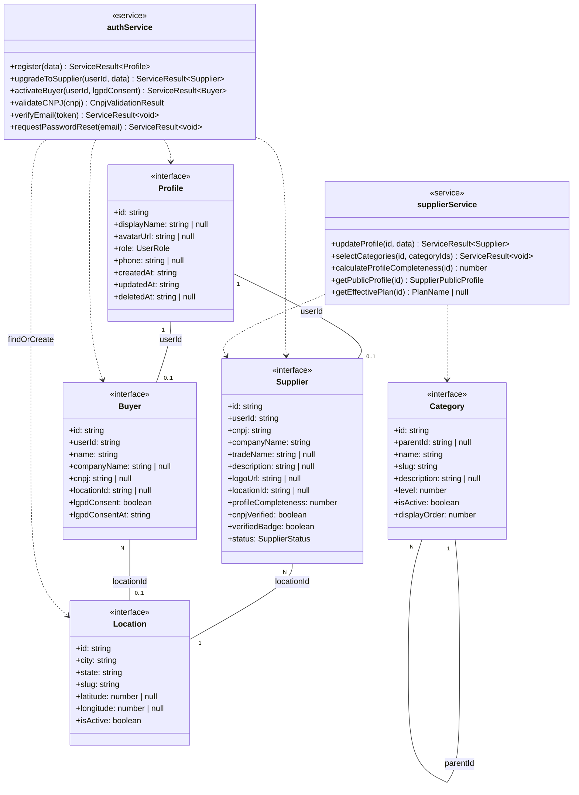
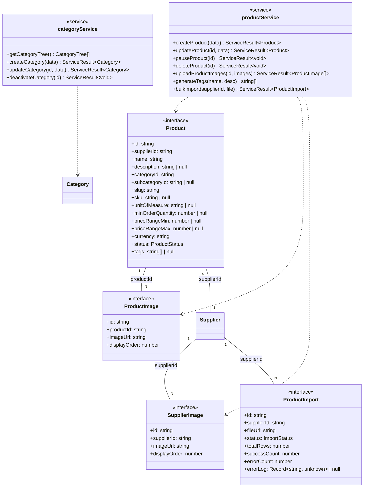
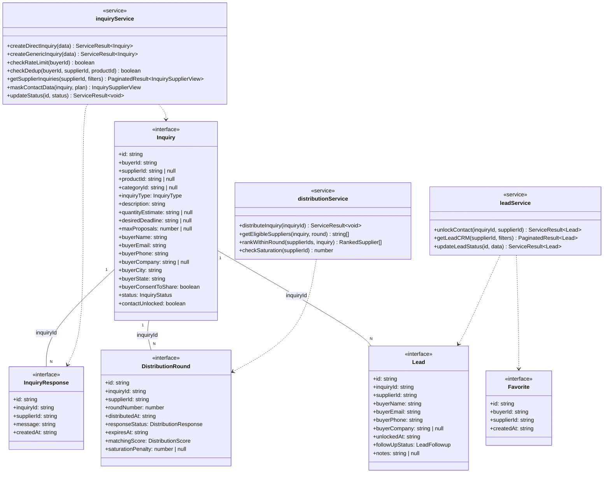
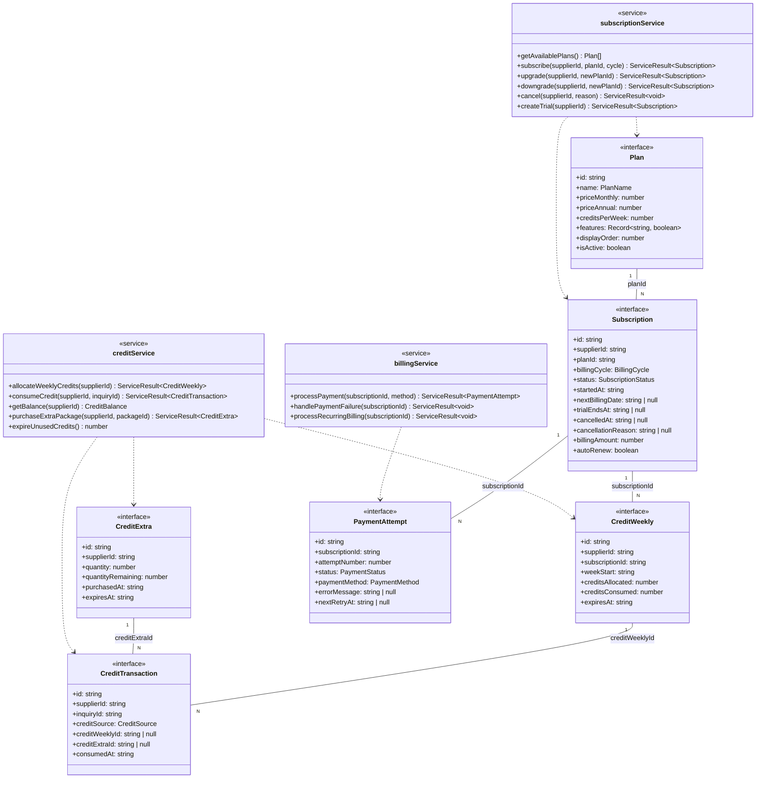
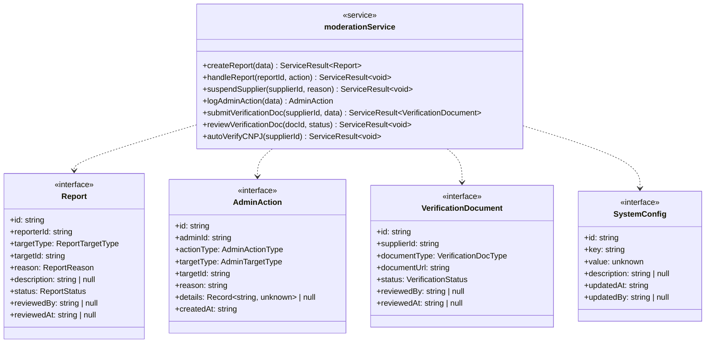
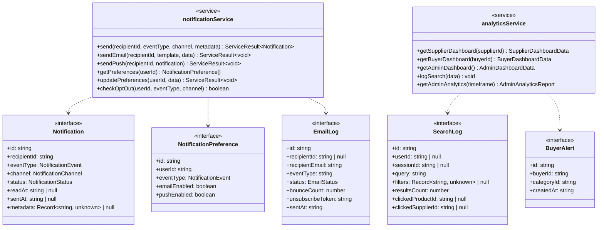

# Diagrama de Classes — GiroB2B

**Versão:** 1.0
**Data:** 2026-04-03
**Autor:** Gustavo (CEO) + Claude (Arquiteto)
**Público:** Time de desenvolvimento
**Insumos:** 2.5 ERD, 1.4 RFs, 1.6 RNs, 2.3 Stack, 2.4 Arquitetura, 2.1 UCs, 2.2 USs, REFERENCIA_CONSOLIDADA.md

---

## 1. Convenções

### 1.1 Estereótipos UML adaptados para TypeScript

| Estereótipo | Significado TypeScript | Exemplo |
|-------------|----------------------|---------|
| `<<interface>>` | `interface` ou `type` | `Supplier`, `CreateProductDTO` |
| `<<service>>` | Módulo com funções exportadas em `lib/{domain}/` | `supplierService` |
| `<<schema>>` | Zod schema de validação em `lib/validation/` | `createProductSchema` |
| `<<repository>>` | Funções de acesso a dados em `lib/db/` | `supplierRepository` |
| `<<enum>>` | Objeto `as const` + union type | `UserRole` |
| `<<utility>>` | Tipo utilitário transversal | `PaginatedResult<T>` |

### 1.2 Mapeamento ERD para Classes

| ERD (PostgreSQL) | TypeScript | Exemplo |
|-----------------|------------|---------|
| snake_case | camelCase | `company_name` → `companyName` |
| UUID | `string` | `id: string` |
| VARCHAR(n), TEXT | `string` | `description: string` |
| INTEGER | `number` | `creditsAllocated: number` |
| DECIMAL | `number` | `profileCompleteness: number` |
| BOOLEAN | `boolean` | `cnpjVerified: boolean` |
| TIMESTAMPTZ | `string` (ISO 8601) | `createdAt: string` |
| DATE | `string` (YYYY-MM-DD) | `weekStart: string` |
| JSONB | Tipo específico ou `Record<string, unknown>` | `businessHours: BusinessHours \| null` |
| TSVECTOR | Omitido (DB-only, trigger-managed) | — |
| ENUM | `as const` object + union type | `UserRole` |
| nullable | `T \| null` | `tradeName: string \| null` |

### 1.3 Marcação de fases

| Fase | Sigla | Meses |
|------|-------|-------|
| MVP | — (sem marcação) | 1-3 |
| Validação | `[VAL]` | 4-6 |
| Monetização | `[MON]` | 7-9 |
| Tração | `[TRA]` | 10-12 |
| Escala | `[ESC]` | 13-18 |

Interfaces, métodos e schemas de fases futuras estão documentados mas devem ser implementados apenas na fase correspondente.

### 1.4 Convenção de nomes

| Camada | Padrão | Exemplo |
|--------|--------|---------|
| Interface base | PascalCase singular | `Supplier`, `CreditWeekly` |
| DTO de criação | `Create{Entity}DTO` | `CreateUserDTO`, `UpgradeToSupplierDTO` |
| DTO de atualização | `Update{Entity}DTO` | `UpdateSupplierDTO` |
| Tipo derivado | `{Entity}{Contexto}` | `SupplierPublicProfile` |
| Service | `{domain}Service` | `supplierService` |
| Repository | `{entity}Repository` | `supplierRepository` |
| Schema Zod | `{operação}{Entity}Schema` | `createProductSchema` |
| Enum | PascalCase | `UserRole`, `InquiryStatus` |

---

## 2. Diagramas de Classes

### 2.1 Diagrama Consolidado (visão geral)

```mermaid
classDiagram
    direction TB

    class Profile {
        <<interface>>
    }
    class Supplier {
        <<interface>>
    }
    class Buyer {
        <<interface>>
    }
    class Location {
        <<interface>>
    }
    class Category {
        <<interface>>
    }
    class Product {
        <<interface>>
    }
    class ProductImage {
        <<interface>>
    }
    class SupplierImage {
        <<interface>>
    }
    class ProductImport {
        <<interface>>
    }
    class Inquiry {
        <<interface>>
    }
    class InquiryResponse {
        <<interface>>
    }
    class DistributionRound {
        <<interface>>
    }
    class Lead {
        <<interface>>
    }
    class Favorite {
        <<interface>>
    }
    class Plan {
        <<interface>>
    }
    class Subscription {
        <<interface>>
    }
    class CreditWeekly {
        <<interface>>
    }
    class CreditExtra {
        <<interface>>
    }
    class CreditTransaction {
        <<interface>>
    }
    class PaymentAttempt {
        <<interface>>
    }
    class Report {
        <<interface>>
    }
    class AdminAction {
        <<interface>>
    }
    class VerificationDocument {
        <<interface>>
    }
    class SystemConfig {
        <<interface>>
    }
    class Notification {
        <<interface>>
    }
    class NotificationPreference {
        <<interface>>
    }
    class EmailLog {
        <<interface>>
    }
    class SearchLog {
        <<interface>>
    }
    class BuyerAlert {
        <<interface>>
    }

    class authService {
        <<service>>
    }
    class supplierService {
        <<service>>
    }
    class productService {
        <<service>>
    }
    class categoryService {
        <<service>>
    }
    class searchService {
        <<service>>
    }
    class seoService {
        <<service>>
    }
    class inquiryService {
        <<service>>
    }
    class distributionService {
        <<service>>
    }
    class leadService {
        <<service>>
    }
    class subscriptionService {
        <<service>>
    }
    class creditService {
        <<service>>
    }
    class billingService {
        <<service>>
    }
    class notificationService {
        <<service>>
    }
    class moderationService {
        <<service>>
    }
    class analyticsService {
        <<service>>
    }

    Profile "1" -- "0..1" Supplier
    Profile "1" -- "0..1" Buyer
    Supplier "N" -- "1" Location
    Buyer "N" -- "0..1" Location
    Supplier "M" -- "N" Category
    Supplier "1" -- "N" Product
    Supplier "1" -- "N" SupplierImage
    Product "1" -- "N" ProductImage
    Supplier "1" -- "N" ProductImport
    Buyer "1" -- "N" Inquiry
    Supplier "1" -- "N" Inquiry
    Product "1" -- "N" Inquiry
    Inquiry "1" -- "N" InquiryResponse
    Inquiry "1" -- "N" DistributionRound
    Inquiry "1" -- "N" Lead
    Buyer "1" -- "N" Favorite
    Supplier "1" -- "N" Subscription
    Plan "1" -- "N" Subscription
    Subscription "1" -- "N" CreditWeekly
    Supplier "1" -- "N" CreditExtra
    Supplier "1" -- "N" CreditTransaction
    Subscription "1" -- "N" PaymentAttempt
    Profile "1" -- "N" Report
    Profile "1" -- "N" AdminAction
    Supplier "1" -- "N" VerificationDocument
    Profile "1" -- "N" Notification
    Buyer "1" -- "N" BuyerAlert

    authService ..> Profile
    authService ..> Supplier
    authService ..> Buyer
    supplierService ..> Supplier
    productService ..> Product
    categoryService ..> Category
    searchService ..> Product
    searchService ..> Supplier
    inquiryService ..> Inquiry
    distributionService ..> DistributionRound
    leadService ..> Lead
    subscriptionService ..> Subscription
    creditService ..> CreditWeekly
    creditService ..> CreditExtra
    billingService ..> PaymentAttempt
    moderationService ..> Report
    notificationService ..> Notification
    analyticsService ..> SearchLog
```



### 2.2 Diagrama — Identity Domain



### 2.3 Diagrama — Catalog Domain



### 2.4 Diagrama — Inquiries & Leads Domain



### 2.5 Diagrama — Monetization Domain



### 2.6 Diagrama — Moderation & Trust Domain



### 2.7 Diagrama — Notifications & Analytics Domain



---

## 3. Camada de Dominio (Interfaces e Types)

### 3.1 Tipos utilitários transversais

```typescript
/** Campos de auditoria — Padrão A: ciclo completo com soft delete */
interface AuditFieldsFull {
  createdAt: string;
  updatedAt: string;
  deletedAt: string | null;
}

/** Campos de auditoria — Padrão B: mutável sem soft delete */
interface AuditFieldsMutable {
  createdAt: string;
  updatedAt: string;
}

/** Campos de auditoria — Padrão C: imutável (eventos/logs) */
interface AuditFieldsImmutable {
  createdAt: string;
}

/** Resultado paginado genérico */
interface PaginatedResult<T> {
  data: T[];
  total: number;
  page: number;
  limit: number;
  hasMore: boolean;
}

/** Resultado de operação de serviço (sem throw) */
type ServiceResult<T> =
  | { success: true; data: T }
  | { success: false; error: ServiceError };

interface ServiceError {
  code: string;       // Ex: 'CNPJ_INACTIVE', 'RATE_LIMIT_EXCEEDED'
  message: string;
  details?: unknown;
}

/** Horário comercial (JSONB no ERD) */
interface BusinessHours {
  [day: string]: string; // Ex: { "mon-fri": "09:00-18:00", "sat": "09:00-13:00" }
}

/** Score de distribuição (JSONB matching_score no ERD) */
interface DistributionScore {
  categoryRelevance: number;
  geographicProximity: number;
  responseTime: number;
  saturation: number;
  completeness: number;
  total: number;
}
```

### 3.2 Domínio Identity

```typescript
// === PROFILES ===

interface Profile {
  id: string;
  displayName: string | null;
  avatarUrl: string | null;
  role: UserRole;
  phone: string | null;
  createdAt: string;
  updatedAt: string;
  deletedAt: string | null;
}

interface CreateProfileDTO {
  displayName?: string;
  avatarUrl?: string;
  role: UserRole;
  phone?: string;
}

// === SUPPLIERS ===

interface Supplier {
  id: string;
  userId: string;
  cnpj: string;
  companyName: string;
  tradeName: string | null;
  description: string | null;
  logoUrl: string | null;
  addressStreet: string | null;
  addressNumber: string | null;
  addressComplement: string | null;
  locationId: string | null;
  addressZip: string | null;
  phone: string | null;
  websiteUrl: string | null;
  linkedinUrl: string | null;
  instagramUrl: string | null;
  facebookUrl: string | null;
  foundingYear: number | null;
  employeeRange: EmployeeRange | null;
  businessHours: BusinessHours | null;
  profileCompleteness: number;
  cnpjVerified: boolean;
  cnpjStatus: CnpjStatus | null;
  lastCnpjCheckAt: string | null;
  verifiedBadge: boolean;            // [MON]
  status: SupplierStatus;
  suspensionReason: string | null;
  violationCount: number;
  confirmedReportCount: number;
  createdAt: string;
  updatedAt: string;
  deletedAt: string | null;
}

/** Cadastro genérico Nível 1 (UC-01, SEQ-01) */
interface CreateUserDTO {
  email: string;
  password: string;
  name: string;
  phone: string;
  city: string;
  state: string;
  // Sem CNPJ, sem companyName, sem role (RN-01.10, RN-01.13)
}

/** Upgrade para fornecedor Nível 3 (UC-31, SEQ-17) */
interface UpgradeToSupplierDTO {
  companyName: string;
  cnpj: string;
  // locationId derivado do profile (city, state) ou findOrCreate
}

/** Edição do perfil (RF-02.01) */
interface UpdateSupplierDTO {
  tradeName?: string;
  description?: string;
  logoUrl?: string;
  addressStreet?: string;
  addressNumber?: string;
  addressComplement?: string;
  locationId?: string;
  addressZip?: string;
  phone?: string;
  websiteUrl?: string;
  linkedinUrl?: string;
  instagramUrl?: string;
  facebookUrl?: string;
  foundingYear?: number;
  employeeRange?: EmployeeRange;
  businessHours?: BusinessHours;
}

/** Perfil público exibido na página do fornecedor (RF-02.05) */
interface SupplierPublicProfile {
  id: string;
  companyName: string;
  tradeName: string | null;
  description: string | null;
  logoUrl: string | null;
  location: LocationOption | null;
  phone: string | null;          // visível apenas se ativo
  websiteUrl: string | null;
  foundingYear: number | null;
  employeeRange: EmployeeRange | null;
  businessHours: BusinessHours | null;
  cnpjVerified: boolean;
  verifiedBadge: boolean;
  categories: CategoryOption[];
  profileCompleteness: number;
  createdAt: string;
}

/** Card resumido para resultados de busca (RF-04.01) */
interface SupplierSearchResult {
  id: string;
  companyName: string;
  tradeName: string | null;
  logoUrl: string | null;
  location: LocationOption | null;
  cnpjVerified: boolean;
  verifiedBadge: boolean;
  primaryCategory: string | null;
  profileCompleteness: number;
  rankingScore: number;      // score composto (RN-03.01)
}

// === BUYERS ===

interface Buyer {
  id: string;
  userId: string;
  name: string;
  companyName: string | null;
  cnpj: string | null;
  locationId: string | null;
  lgpdConsent: boolean;
  lgpdConsentAt: string;
  blockedUntil: string | null;
  createdAt: string;
  updatedAt: string;
}

/** Ativação como comprador Nível 2 (UC-12) — na primeira inquiry */
interface ActivateBuyerDTO {
  lgpdConsent: true;       // obrigatório = true (RN-01.07)
  lgpdConsentAt: string;   // timestamp do aceite
  // Dados do comprador (nome, email, telefone) já existem em profiles
}

interface UpdateBuyerDTO {
  name?: string;
  companyName?: string;
  cnpj?: string;
  locationId?: string;
}

// === LOCATIONS ===

interface Location {
  id: string;
  city: string;
  state: string;
  slug: string;
  latitude: number | null;
  longitude: number | null;
  isActive: boolean;
  createdAt: string;
}

/** Opção de select para formulários */
interface LocationOption {
  id: string;
  city: string;
  state: string;
  slug: string;
}

// === CATEGORIES ===

interface Category {
  id: string;
  parentId: string | null;
  name: string;
  slug: string;
  description: string | null;
  level: number;
  isActive: boolean;
  displayOrder: number;
  createdAt: string;
  updatedAt: string;
}

/** Árvore hierárquica para navegação (RF-04.04) */
interface CategoryTree {
  id: string;
  name: string;
  slug: string;
  displayOrder: number;
  children: CategoryTree[];  // subcategorias (level 2)
}

/** Opção de select com indicação de nível */
interface CategoryOption {
  id: string;
  name: string;
  slug: string;
  level: number;
  parentName: string | null; // nome da categoria pai para subcategorias
}

interface CreateCategoryDTO {
  parentId?: string;
  name: string;
  slug: string;
  description?: string;
  level: 1 | 2;
  displayOrder?: number;
}
```

### 3.3 Domínio Catalog

```typescript
// === PRODUCTS ===

interface Product {
  id: string;
  supplierId: string;
  name: string;
  description: string | null;
  categoryId: string;
  subcategoryId: string | null;
  slug: string;
  sku: string | null;
  unitOfMeasure: string | null;
  minOrderQuantity: number | null;
  priceRangeMin: number | null;
  priceRangeMax: number | null;
  currency: string;
  status: ProductStatus;
  tags: string[] | null;
  // search_vector omitido (DB-only, trigger-managed)
  createdAt: string;
  updatedAt: string;
  deletedAt: string | null;
  pausedAt: string | null;
}

/** Cadastro de produto (RF-03.01) */
interface CreateProductDTO {
  name: string;
  description?: string;
  categoryId: string;
  subcategoryId?: string;
  sku?: string;
  unitOfMeasure?: string;
  minOrderQuantity?: number;
  priceRangeMin?: number;
  priceRangeMax?: number;
  currency?: string;         // default BRL
}

interface UpdateProductDTO {
  name?: string;
  description?: string;
  categoryId?: string;
  subcategoryId?: string;
  sku?: string;
  unitOfMeasure?: string;
  minOrderQuantity?: number;
  priceRangeMin?: number;
  priceRangeMax?: number;
}

/** Detalhe público do produto (RF-03.06) */
interface ProductPublicDetail {
  id: string;
  name: string;
  description: string | null;
  category: CategoryOption;
  subcategory: CategoryOption | null;
  slug: string;
  unitOfMeasure: string | null;
  minOrderQuantity: number | null;
  priceRangeMin: number | null;
  priceRangeMax: number | null;
  currency: string;
  tags: string[] | null;
  images: ProductImage[];
  supplier: SupplierPublicProfile;
  createdAt: string;
  updatedAt: string;
}

/** Card de produto nos resultados de busca */
interface ProductSearchResult {
  id: string;
  name: string;
  slug: string;
  supplierId: string;
  supplierName: string;
  supplierLocation: LocationOption | null;
  supplierVerified: boolean;
  categoryName: string;
  priceRangeMin: number | null;
  priceRangeMax: number | null;
  currency: string;
  thumbnailUrl: string | null;  // primeira imagem
}

// === PRODUCT IMAGES ===

interface ProductImage {
  id: string;
  productId: string;
  imageUrl: string;
  displayOrder: number;
  createdAt: string;
}

interface UploadProductImageDTO {
  productId: string;
  imageUrl: string;
  displayOrder: number;
}

// === SUPPLIER IMAGES ===

interface SupplierImage {
  id: string;
  supplierId: string;
  imageUrl: string;
  displayOrder: number;
  createdAt: string;
}

interface UploadSupplierImageDTO {
  supplierId: string;
  imageUrl: string;
  displayOrder: number;
}

// === PRODUCT IMPORTS [VAL] ===

interface ProductImport {
  id: string;
  supplierId: string;
  fileUrl: string;
  status: ImportStatus;
  totalRows: number;
  successCount: number;
  errorCount: number;
  errorLog: Record<string, unknown> | null;
  createdAt: string;
  completedAt: string | null;
}

interface CreateProductImportDTO {
  fileUrl: string;
}
```

### 3.4 Domínio Inquiries & Leads

```typescript
// === INQUIRIES ===

interface Inquiry {
  id: string;
  buyerId: string;
  supplierId: string | null;        // null = genérica
  productId: string | null;
  categoryId: string | null;         // para genérica
  inquiryType: InquiryType;
  description: string;
  quantityEstimate: string | null;
  desiredDeadline: string | null;
  maxProposals: number | null;       // [VAL] genérica: 3/5/10
  // Snapshot LGPD (DM-02)
  buyerName: string;
  buyerEmail: string;
  buyerPhone: string;
  buyerCompany: string | null;
  buyerCity: string;
  buyerState: string;
  buyerConsentToShare: boolean;
  status: InquiryStatus;
  reportCount: number;
  contactUnlocked: boolean;          // [MON]
  unlockedAt: string | null;         // [MON]
  unlockedByCredit: boolean;         // [MON]
  dedupKey: string;
  createdAt: string;
  updatedAt: string;
  viewedAt: string | null;
  respondedAt: string | null;
  archivedAt: string | null;
}

/** Inquiry direcionada a supplier específico (RF-06.01) */
interface CreateDirectInquiryDTO {
  supplierId: string;
  productId?: string;
  description: string;
  quantityEstimate?: string;
  desiredDeadline?: string;
  buyerName: string;
  buyerEmail: string;
  buyerPhone: string;
  buyerCompany?: string;
  buyerCity: string;
  buyerState: string;
  buyerConsentToShare: true;
}

/** Inquiry genérica distribuída por categoria/região [VAL] (RF-06.06) */
interface CreateGenericInquiryDTO {
  categoryId: string;
  description: string;
  quantityEstimate?: string;
  desiredDeadline?: string;
  maxProposals?: 3 | 5 | 10;   // default 5 (RN-05.01)
  buyerName: string;
  buyerEmail: string;
  buyerPhone: string;
  buyerCompany?: string;
  buyerCity: string;
  buyerState: string;
  buyerConsentToShare: true;
}

/** View da inquiry para o fornecedor — dados mascarados ou completos */
interface InquirySupplierView {
  id: string;
  inquiryType: InquiryType;
  description: string;
  quantityEstimate: string | null;
  desiredDeadline: string | null;
  buyerCity: string;           // sempre visível
  buyerState: string;          // sempre visível
  // Campos abaixo: null se free tier (RN-04.05), preenchidos se paid + crédito (RN-04.06)
  buyerName: string | null;
  buyerEmail: string | null;
  buyerPhone: string | null;
  buyerCompany: string | null;
  contactUnlocked: boolean;
  status: InquiryStatus;
  createdAt: string;
  viewedAt: string | null;
}

/** View da inquiry para o comprador */
interface InquiryBuyerView {
  id: string;
  supplierId: string | null;
  supplierName: string | null;
  productName: string | null;
  inquiryType: InquiryType;
  description: string;
  status: InquiryStatus;
  createdAt: string;
  viewedAt: string | null;
  respondedAt: string | null;
}

// === INQUIRY RESPONSES ===

interface InquiryResponse {
  id: string;
  inquiryId: string;
  supplierId: string;
  message: string;
  createdAt: string;
}

interface CreateInquiryResponseDTO {
  inquiryId: string;
  message: string;
}

// === DISTRIBUTION ROUNDS [MON] ===

interface DistributionRound {
  id: string;
  inquiryId: string;
  supplierId: string;
  roundNumber: number;       // 1=Premium, 2=Pro, 3=Starter
  distributedAt: string;
  responseStatus: DistributionResponse;
  expiresAt: string;
  matchingScore: DistributionScore;
  saturationPenalty: number | null;
  createdAt: string;
}

// === LEADS [MON] ===

interface Lead {
  id: string;
  inquiryId: string;
  supplierId: string;
  buyerName: string;
  buyerEmail: string;
  buyerPhone: string;
  buyerCompany: string | null;
  unlockedAt: string;
  creditConsumed: boolean;
  followUpStatus: LeadFollowup;
  notes: string | null;
  createdAt: string;
  updatedAt: string;
}

interface UpdateLeadStatusDTO {
  followUpStatus: LeadFollowup;
  notes?: string;
}

// === FAVORITES [VAL] ===

interface Favorite {
  id: string;
  buyerId: string;
  supplierId: string;
  createdAt: string;
}
```

### 3.5 Domínio Monetization

```typescript
// === PLANS [MON] ===

interface Plan {
  id: string;
  name: PlanName;
  priceMonthly: number;
  priceAnnual: number;
  creditsPerWeek: number;
  features: Record<string, boolean>;
  displayOrder: number;
  isActive: boolean;
  createdAt: string;
  updatedAt: string;
}

/** View pública dos planos para pricing page (RF-08.01) */
interface PlanPublicView {
  id: string;
  name: PlanName;
  priceMonthly: number;
  priceAnnual: number;
  creditsPerWeek: number;
  features: Record<string, boolean>;
}

// === SUBSCRIPTIONS [MON] ===

interface Subscription {
  id: string;
  supplierId: string;
  planId: string;
  billingCycle: BillingCycle;
  status: SubscriptionStatus;
  startedAt: string;
  nextBillingDate: string | null;
  trialEndsAt: string | null;
  cancelledAt: string | null;
  cancellationReason: string | null;
  billingAmount: number;
  autoRenew: boolean;
  createdAt: string;
  updatedAt: string;
}

interface CreateSubscriptionDTO {
  planId: string;
  billingCycle: BillingCycle;
}

/** Mudança de plano: upgrade, downgrade ou cancelamento (RF-08.02) */
interface PlanChangeDTO {
  action: 'upgrade' | 'downgrade' | 'cancel';
  newPlanId?: string;          // obrigatório para upgrade/downgrade
  cancellationReason?: string; // obrigatório para cancel (RN-06.10)
}

// === CREDITS WEEKLY [MON] ===

interface CreditWeekly {
  id: string;
  supplierId: string;
  subscriptionId: string;
  weekStart: string;
  creditsAllocated: number;
  creditsConsumed: number;
  expiresAt: string;
  createdAt: string;
}

// === CREDITS EXTRA [MON] ===

interface CreditExtra {
  id: string;
  supplierId: string;
  quantity: number;
  quantityRemaining: number;
  purchasedAt: string;
  expiresAt: string;
  createdAt: string;
}

interface PurchaseCreditPackDTO {
  packageId: string;  // referencia pacote de créditos avulsos
}

/** Saldo consolidado de créditos do fornecedor (RF-07.03) */
interface CreditBalance {
  weeklyRemaining: number;
  weeklyTotal: number;
  weeklyExpiresAt: string | null;
  extraRemaining: number;
  extraExpireDates: { quantity: number; expiresAt: string }[];
  totalAvailable: number;
}

// === CREDIT TRANSACTIONS [MON] ===

interface CreditTransaction {
  id: string;
  supplierId: string;
  inquiryId: string;
  creditSource: CreditSource;
  creditWeeklyId: string | null;
  creditExtraId: string | null;
  consumedAt: string;
}

// === PAYMENT ATTEMPTS [MON] ===

interface PaymentAttempt {
  id: string;
  subscriptionId: string;
  attemptNumber: number;
  status: PaymentStatus;
  paymentMethod: PaymentMethod;
  errorMessage: string | null;
  nextRetryAt: string | null;
  createdAt: string;
}
```

### 3.6 Domínio Moderation & Trust

```typescript
// === REPORTS ===

interface Report {
  id: string;
  reporterId: string;
  targetType: ReportTargetType;
  targetId: string;
  reason: ReportReason;
  description: string | null;
  status: ReportStatus;
  reviewedBy: string | null;
  reviewedAt: string | null;
  createdAt: string;
}

interface CreateReportDTO {
  targetType: ReportTargetType;
  targetId: string;
  reason: ReportReason;
  description?: string;
}

// === ADMIN ACTIONS ===

interface AdminAction {
  id: string;
  adminId: string;
  actionType: AdminActionType;
  targetType: AdminTargetType;
  targetId: string;
  reason: string;
  details: Record<string, unknown> | null;
  createdAt: string;          // INSERT-ONLY, sem updatedAt
}

interface CreateAdminActionDTO {
  actionType: AdminActionType;
  targetType: AdminTargetType;
  targetId: string;
  reason: string;
  details?: Record<string, unknown>;
}

// === VERIFICATION DOCUMENTS [MON] ===

interface VerificationDocument {
  id: string;
  supplierId: string;
  documentType: VerificationDocType;
  documentUrl: string;
  status: VerificationStatus;
  reviewedBy: string | null;
  reviewedAt: string | null;
  createdAt: string;
}

interface SubmitVerificationDocDTO {
  documentType: VerificationDocType;
  documentUrl: string;
}

// === SYSTEM CONFIGS ===

interface SystemConfig {
  id: string;
  key: string;
  value: unknown;             // JSONB: number, string, boolean, object
  description: string | null;
  updatedAt: string;
  updatedBy: string | null;
}

interface UpdateSystemConfigDTO {
  value: unknown;
}
```

### 3.7 Domínio Notifications & Analytics

```typescript
// === NOTIFICATIONS ===

interface Notification {
  id: string;
  recipientId: string;
  eventType: NotificationEvent;
  channel: NotificationChannel;
  status: NotificationStatus;
  readAt: string | null;
  sentAt: string | null;
  metadata: Record<string, unknown> | null;
  createdAt: string;
}

// === NOTIFICATION PREFERENCES ===

interface NotificationPreference {
  id: string;
  userId: string;
  eventType: NotificationEvent;
  emailEnabled: boolean;
  pushEnabled: boolean;
  updatedAt: string;
}

interface UpdateNotificationPrefDTO {
  eventType: NotificationEvent;
  emailEnabled?: boolean;
  pushEnabled?: boolean;
}

// === EMAIL LOGS ===

interface EmailLog {
  id: string;
  recipientId: string | null;
  recipientEmail: string;
  eventType: string;
  status: EmailStatus;
  bounceCount: number;
  unsubscribeToken: string;
  sentAt: string;
  createdAt: string;
}

// === SEARCH LOGS ===

interface SearchLog {
  id: string;
  userId: string | null;         // nullable = anônimo (RN-10.01)
  sessionId: string | null;
  query: string;
  filters: Record<string, unknown> | null;
  resultsCount: number;
  clickedProductId: string | null;
  clickedSupplierId: string | null;
  createdAt: string;
}

// === BUYER ALERTS [VAL] ===

interface BuyerAlert {
  id: string;
  buyerId: string;
  categoryId: string;
  createdAt: string;
}

interface CreateBuyerAlertDTO {
  categoryId: string;
}
```

### 3.8 Tipos de dashboard (derivados)

```typescript
/** Dashboard do fornecedor (RF-09.01) */
interface SupplierDashboardData {
  inquiriesTotal: number;
  inquiriesNew: number;
  productsListed: number;
  profileViews: number;
  profileCompleteness: number;
  effectivePlan: PlanName | null;
  creditsBalance: CreditBalance | null;      // [MON]
}

/** Dashboard do comprador (RF-10.01) */
interface BuyerDashboardData {
  inquiriesSent: number;
  favoritesCount: number;
  alertsCount: number;
}

/** Dashboard admin (RF-12.01) */
interface AdminDashboardData {
  totalSuppliers: number;
  totalBuyers: number;
  totalProducts: number;
  inquiriesByPeriod: number;
  activePlans: { starter: number; pro: number; premium: number };
  mrr: number;
}
```

---

## 4. Camada de Validação (Zod Schemas)

### 4.1 Schemas de criação

```typescript
// lib/validation/supplier.ts
const createSupplierSchema = z.object({
  email: z.string().email(),
  password: z.string().min(8),
  companyName: z.string().min(2).max(255),
  cnpj: z.string().length(14).regex(/^\d{14}$/),    // RN-01.01: apenas dígitos
  phone: z.string().min(10).max(20),
  locationId: z.string().uuid(),
});
// Valida: RN-01.01 (CNPJ formato), RN-01.02 (unique — verificado no service)

const updateSupplierProfileSchema = z.object({
  tradeName: z.string().max(255).optional(),
  description: z.string().max(2000).optional(),        // chk_suppliers_desc_length
  logoUrl: z.string().url().max(500).optional(),
  addressStreet: z.string().max(255).optional(),
  addressNumber: z.string().max(20).optional(),
  addressComplement: z.string().max(100).optional(),
  locationId: z.string().uuid().optional(),
  addressZip: z.string().length(8).regex(/^\d{8}$/).optional(),
  phone: z.string().min(10).max(20).optional(),
  websiteUrl: z.string().url().max(500).optional(),
  linkedinUrl: z.string().url().max(500).optional(),
  instagramUrl: z.string().url().max(500).optional(),
  facebookUrl: z.string().url().max(500).optional(),
  foundingYear: z.number().int().min(1900).max(2030).optional(),
  employeeRange: z.enum(['range_1_10', 'range_11_50', 'range_51_200', 'range_200_plus']).optional(),
  businessHours: z.record(z.string()).optional(),
});
// Valida: RN-02.01 (campos de completude), chk_suppliers_founding_year

// lib/validation/buyer.ts
const createBuyerSchema = z.object({
  email: z.string().email(),
  password: z.string().min(8),
  name: z.string().min(2).max(255),
  companyName: z.string().max(255).optional(),   // RN-01.06: opcional
  phone: z.string().min(10).max(20).optional(),
  locationId: z.string().uuid().optional(),
  lgpdConsent: z.literal(true),                  // RN-01.07: obrigatório = true
});

// lib/validation/product.ts
const createProductSchema = z.object({
  name: z.string().min(1).max(255),
  description: z.string().max(1000).optional(),
  categoryId: z.string().uuid(),                 // RN-02.04: obrigatório
  subcategoryId: z.string().uuid().optional(),
  sku: z.string().max(50).optional(),
  unitOfMeasure: z.string().max(50).optional(),
  minOrderQuantity: z.number().min(0).optional(),
  priceRangeMin: z.number().min(0).optional(),
  priceRangeMax: z.number().min(0).optional(),
  currency: z.string().length(3).default('BRL'),
}).refine(
  (data) => !data.priceRangeMin || !data.priceRangeMax || data.priceRangeMin <= data.priceRangeMax,
  { message: 'priceRangeMin must be <= priceRangeMax' }
);
// Valida: RN-02.04 (categoria), RN-02.06 (preço range), chk_products_price_range

const updateProductSchema = createProductSchema.partial().omit({ currency: true });

// lib/validation/inquiry.ts
const createDirectInquirySchema = z.object({
  supplierId: z.string().uuid(),
  productId: z.string().uuid().optional(),
  description: z.string().min(20).max(5000),     // chk no ERD
  quantityEstimate: z.string().max(100).optional(),
  desiredDeadline: z.string().max(100).optional(),
  buyerName: z.string().min(2).max(255),
  buyerEmail: z.string().email(),
  buyerPhone: z.string().min(10).max(20),
  buyerCompany: z.string().max(255).optional(),
  buyerCity: z.string().min(2).max(100),
  buyerState: z.string().length(2),
  buyerConsentToShare: z.literal(true),          // RN-01.07, RN-04.02
});
// Valida: RN-04.01 (rate limit — verificado no service), RN-04.04 (dedup — service)

const createGenericInquirySchema = z.object({
  categoryId: z.string().uuid(),
  description: z.string().min(20).max(5000),
  quantityEstimate: z.string().max(100).optional(),
  desiredDeadline: z.string().max(100).optional(),
  maxProposals: z.union([z.literal(3), z.literal(5), z.literal(10)]).default(5), // RN-05.01
  buyerName: z.string().min(2).max(255),
  buyerEmail: z.string().email(),
  buyerPhone: z.string().min(10).max(20),
  buyerCompany: z.string().max(255).optional(),
  buyerCity: z.string().min(2).max(100),
  buyerState: z.string().length(2),
  buyerConsentToShare: z.literal(true),
});

// lib/validation/report.ts
const createReportSchema = z.object({
  targetType: z.enum(['supplier', 'product', 'inquiry']),
  targetId: z.string().uuid(),
  reason: z.enum(['spam', 'fraud', 'inappropriate', 'other']),
  description: z.string().max(2000).optional(),
});

// lib/validation/category.ts
const createCategorySchema = z.object({
  parentId: z.string().uuid().optional(),
  name: z.string().min(2).max(100),
  slug: z.string().min(2).max(120).regex(/^[a-z0-9-]+$/),
  description: z.string().max(500).optional(),
  level: z.union([z.literal(1), z.literal(2)]),
  displayOrder: z.number().int().min(0).default(0),
}).refine(
  (data) => (data.level === 1 && !data.parentId) || (data.level === 2 && !!data.parentId),
  { message: 'Subcategory (level 2) requires parentId; category (level 1) must not have parentId' }
);

// lib/validation/subscription.ts — [MON]
const createSubscriptionSchema = z.object({
  planId: z.string().uuid(),
  billingCycle: z.enum(['monthly', 'annual']),
});
// Valida: RN-06.01 (plan + cycle)

const planChangeSchema = z.object({
  action: z.enum(['upgrade', 'downgrade', 'cancel']),
  newPlanId: z.string().uuid().optional(),
  cancellationReason: z.string().max(1000).optional(),
}).refine(
  (data) => data.action === 'cancel' || !!data.newPlanId,
  { message: 'newPlanId required for upgrade/downgrade' }
).refine(
  (data) => data.action !== 'cancel' || !!data.cancellationReason,
  { message: 'cancellationReason required for cancel (RN-06.10)' }
);

// lib/validation/buyer-alert.ts — [VAL]
const createBuyerAlertSchema = z.object({
  categoryId: z.string().uuid(),
});

// lib/validation/verification.ts — [MON]
const submitVerificationDocSchema = z.object({
  documentType: z.enum(['address_proof', 'identity', 'storefront_photo']),
  documentUrl: z.string().url().max(500),
});
// Valida: RN-07.06 (tipos válidos)
```

### 4.2 Schemas de atualização adicionais

```typescript
// lib/validation/inquiry.ts
const updateInquiryStatusSchema = z.object({
  status: z.enum(['viewed', 'responded', 'archived', 'reported']),
});
// Valida: RN-04.08 (transições válidas — verificado no service via state machine)

// lib/validation/lead.ts — [MON]
const updateLeadStatusSchema = z.object({
  followUpStatus: z.enum(['new', 'negotiating', 'closed_won', 'closed_lost']),
  notes: z.string().max(5000).optional(),
});

// lib/validation/notification.ts
const updateNotificationPrefSchema = z.object({
  eventType: z.enum([
    'welcome', 'email_confirmation', 'new_inquiry', 'inquiry_viewed',
    'inquiry_responded', 'profile_incomplete_3d', 'profile_incomplete_7d',
    'profile_incomplete_14d', 'profile_incomplete_30d', 'credits_renewed',
    'credits_expiring', 'credits_exhausted', 'payment_success', 'payment_failed',
    'subscription_suspended', 'subscription_cancelled', 'report_received',
    'account_suspended', 'account_reactivated', 'new_supplier_in_category',
  ]),
  emailEnabled: z.boolean().optional(),
  pushEnabled: z.boolean().optional(),
});
// Valida: RN-09.02 (inquiry/billing events são mandatory — verificado no service)

// lib/validation/system-config.ts
const updateSystemConfigSchema = z.object({
  value: z.unknown(),   // JSONB: type depends on key
});

// lib/validation/category.ts
const updateCategorySchema = z.object({
  name: z.string().min(2).max(100).optional(),
  slug: z.string().min(2).max(120).regex(/^[a-z0-9-]+$/).optional(),
  description: z.string().max(500).optional(),
  isActive: z.boolean().optional(),
  displayOrder: z.number().int().min(0).optional(),
});
```

### 4.3 Schemas de consulta e filtro

```typescript
// lib/validation/search.ts
const searchQuerySchema = z.object({
  q: z.string().min(1).max(500).optional(),    // texto livre
  categoryId: z.string().uuid().optional(),
  subcategoryId: z.string().uuid().optional(),
  locationSlug: z.string().optional(),
  state: z.string().length(2).optional(),
  priceMin: z.number().min(0).optional(),
  priceMax: z.number().min(0).optional(),
  verifiedOnly: z.boolean().optional(),
  page: z.number().int().min(1).default(1),
  limit: z.number().int().min(1).max(50).default(20),
  sort: z.enum(['relevance', 'newest', 'name']).default('relevance'),
});

// lib/validation/inquiry.ts
const inquiryFilterSchema = z.object({
  status: z.enum(['new', 'viewed', 'responded', 'archived', 'reported']).optional(),
  inquiryType: z.enum(['directed', 'generic']).optional(),
  dateFrom: z.string().datetime().optional(),
  dateTo: z.string().datetime().optional(),
  page: z.number().int().min(1).default(1),
  limit: z.number().int().min(1).max(50).default(20),
});

// lib/validation/admin.ts
const adminFilterSchema = z.object({
  entityType: z.enum(['supplier', 'product', 'inquiry', 'report']).optional(),
  status: z.string().optional(),
  dateFrom: z.string().datetime().optional(),
  dateTo: z.string().datetime().optional(),
  page: z.number().int().min(1).default(1),
  limit: z.number().int().min(1).max(50).default(20),
});

// lib/validation/common.ts
const paginationSchema = z.object({
  page: z.number().int().min(1).default(1),
  limit: z.number().int().min(1).max(50).default(20),
});

// lib/validation/cnpj.ts
const cnpjValidationSchema = z.string()
  .length(14)
  .regex(/^\d{14}$/, 'CNPJ deve conter apenas 14 dígitos')
  .refine(validateCnpjCheckDigits, 'CNPJ com dígitos verificadores inválidos');
// Valida: formato + dígitos verificadores (mod 11)
```

### 4.4 Schemas de domínio e cálculo

```typescript
// lib/validation/profile-completeness.ts
/** Dados para cálculo de completude conforme RN-02.01 */
const profileCompletenessSchema = z.object({
  hasLogo: z.boolean(),
  descriptionMin100: z.boolean(),
  hasAddressCityState: z.boolean(),
  hasPhone: z.boolean(),
  hasAtLeastOneCategory: z.boolean(),
  hasAtLeastThreeProducts: z.boolean(),
  allProductsHavePhoto: z.boolean(),
  hasBusinessHours: z.boolean(),
  hasFoundingYear: z.boolean(),
});
// Pesos RN-02.01: logo=10, desc=15, address=10, phone=10, category=10, products=20, photo=15, hours=5, year=5

// lib/validation/search-ranking.ts
/** Fatores do RANKING DE BUSCA conforme RN-03.01 */
const searchRankingSchema = z.object({
  textRelevance: z.number().min(0).max(1),        // peso 35%
  planLevel: z.number().min(0).max(100),           // peso 25% (Premium=100, Pro=70, Starter=40, Free=10)
  profileCompleteness: z.number().min(0).max(100), // peso 15%
  geographicProximity: z.number().min(0).max(100), // peso 15%
  recencyBoost: z.number().min(0).max(100),        // peso 10% (30 dias = boost)
});
// NOTA: Este é o algoritmo de BUSCA (RN-03.01). Distinto do algoritmo de DISTRIBUIÇÃO (RN-05.04).
// Veja seção 9 — Padrões de Design, item "Dois algoritmos de ranking".
```

**Total: 25 schemas** (10 criação + 8 atualização + 5 filtro + 2 domínio)

---

## 5. Camada de Serviço (Services)

Cada service é um módulo TypeScript em `lib/{domain}/` com funções exportadas.

### 5.1 `authService` — `lib/auth/`

**Responsabilidade:** Registro, login, verificação de email, validação CNPJ, claim de perfil.

| Método | Parâmetros | Retorno | RF/RN | Fase |
|--------|-----------|---------|-------|------|
| `register` | `CreateUserDTO` | `ServiceResult<Profile>` | RF-01.01, RF-01.05, RN-01.03, RN-01.05, RN-01.13 | MVP |
| `upgradeToSupplier` | `userId, UpgradeToSupplierDTO` | `ServiceResult<Supplier>` | UC-31, RF-01.02, RN-01.01, RN-01.02 | MVP |
| `activateBuyer` | `userId, LgpdConsentDTO` | `ServiceResult<Buyer>` | UC-12, RF-01.06, RN-01.06, RN-01.07 | MVP |
| `validateCNPJ` | `cnpj: string` | `ServiceResult<CnpjValidationResult>` | RF-01.02, RN-01.01 | MVP |
| `verifyEmail` | `token: string` | `ServiceResult<void>` | RF-01.05, RN-01.03 | MVP |
| `requestPasswordReset` | `email: string` | `ServiceResult<void>` | RF-01.10 | MVP |
| `authenticateWithGoogle` | `token: string` | `ServiceResult<Profile>` | RF-01.11 | [VAL] |
| `claimProfile` | `ClaimProfileDTO` | `ServiceResult<Supplier>` | RF-01.12, RN-01.08, RN-01.09 | [VAL] |

**Dependências:** `profileRepository`, `supplierRepository`, `buyerRepository`, `locationRepository`, `notificationService`

**Notas:**
- `register` cria conta genérica (Nível 1): Supabase Auth `auth.users` + `profiles`. Sem CNPJ, sem role, sem `suppliers`/`buyers`. Campos: email, senha, nome, telefone, cidade, estado (RN-01.13: CPF nunca coletado).
- `upgradeToSupplier` (UC-31, SEQ-17) valida CNPJ via BrasilAPI, executa `locationRepository.findOrCreate(city, state)` e cria registro `suppliers` em transaction. Role derivado (RN-01.10).
- `activateBuyer` (UC-12) exige consentimento LGPD (RN-01.07) e cria registro `buyers`. Ativação acontece na primeira inquiry.
- `validateCNPJ` consulta BrasilAPI/ReceitaWS e retorna status.

---

### 5.2 `supplierService` — `lib/suppliers/`

**Responsabilidade:** Perfil do fornecedor, completude, fotos, plano efetivo.

| Método | Parâmetros | Retorno | RF/RN | Fase |
|--------|-----------|---------|-------|------|
| `updateProfile` | `supplierId, UpdateSupplierDTO` | `ServiceResult<Supplier>` | RF-02.01 | MVP |
| `selectCategories` | `supplierId, categoryIds: string[]` | `ServiceResult<void>` | RF-02.02 (max 5) | MVP |
| `uploadImages` | `supplierId, images: UploadSupplierImageDTO[]` | `ServiceResult<SupplierImage[]>` | RF-02.03 (max 10) | MVP |
| `calculateProfileCompleteness` | `supplierId: string` | `number` | RF-02.04, RN-02.01 | MVP |
| `getPublicProfile` | `supplierId: string` | `SupplierPublicProfile \| null` | RF-02.05 | MVP |
| `getEffectivePlan` | `supplierId: string` | `PlanName \| null` | DM-01, DM-03 | MVP |

**Dependências:** `supplierRepository`, `categoryRepository`, `subscriptionRepository`

**Notas:**
- `calculateProfileCompleteness` implementa RN-02.01 com pesos: logo (10%) + desc ≥100 chars (15%) + address city+state (10%) + phone (10%) + 1+ category (10%) + 3+ products (20%) + 1+ photo/product (15%) + business hours (5%) + founding year (5%).
- `getEffectivePlan` faz LEFT JOIN `subscriptions WHERE status IN ('active','trial')`. Retorna `null` se free (DM-01: free = ausência de plano).
- `updateProfile` recalcula completude e persiste em `suppliers.profile_completeness` (DM-07).

---

### 5.3 `productService` — `lib/products/`

**Responsabilidade:** CRUD de produtos, imagens, tags auto-geradas, importação em lote.

| Método | Parâmetros | Retorno | RF/RN | Fase |
|--------|-----------|---------|-------|------|
| `createProduct` | `supplierId, CreateProductDTO` | `ServiceResult<Product>` | RF-03.01, RN-02.03, RN-02.04 | MVP |
| `updateProduct` | `productId, UpdateProductDTO` | `ServiceResult<Product>` | RF-03.03 | MVP |
| `pauseProduct` | `productId: string` | `ServiceResult<void>` | RF-03.03, RN-02.05 | MVP |
| `deleteProduct` | `productId: string` | `ServiceResult<void>` | RF-03.03, RN-02.05 (soft delete) | MVP |
| `uploadProductImages` | `productId, images[]` | `ServiceResult<ProductImage[]>` | RF-03.01 (max 5) | MVP |
| `generateTags` | `name, description: string` | `string[]` | RF-03.05, RN-02.07 | MVP |
| `getProductDetail` | `productId: string` | `ProductPublicDetail \| null` | RF-03.06 | MVP |
| `bulkImport` | `supplierId, file` | `ServiceResult<ProductImport>` | RF-03.07 | [VAL] |

**Dependências:** `productRepository`, `supplierService` (recalc completude após create/delete)

**Notas:**
- `generateTags` extrai substantivos do nome + descrição, adiciona sinônimos e nomes de categoria (RN-02.07). Tags editáveis pelo fornecedor.
- `deleteProduct` faz soft delete (`deleted_at = now()`). Job agendado hard-deleta após 30 dias.
- Toda operação de create/delete/pause chama `supplierService.calculateProfileCompleteness()`.

---

### 5.4 `categoryService` — `lib/categories/`

**Responsabilidade:** Árvore hierárquica de categorias, CRUD admin.

| Método | Parâmetros | Retorno | RF/RN | Fase |
|--------|-----------|---------|-------|------|
| `getCategoryTree` | — | `CategoryTree[]` | RF-03.04, RF-04.04 | MVP |
| `createCategory` | `CreateCategoryDTO` | `ServiceResult<Category>` | RF-12.03 | MVP |
| `updateCategory` | `id, UpdateCategoryDTO` | `ServiceResult<Category>` | RF-12.03 | MVP |
| `deactivateCategory` | `id: string` | `ServiceResult<void>` | RF-12.03 | MVP |

**Dependências:** `categoryRepository`

---

### 5.5 `searchService` — `lib/search/`

**Responsabilidade:** Busca full-text, ranking de busca, autocomplete, homepage.

| Método | Parâmetros | Retorno | RF/RN | Fase |
|--------|-----------|---------|-------|------|
| `search` | `SearchQueryDTO` | `PaginatedResult<ProductSearchResult>` | RF-04.01, RF-04.02 | MVP |
| `rankResults` | `results[], buyerLocation?` | `RankedResult[]` | RF-04.03, RN-03.01 | MVP |
| `applyFairnessRandomization` | `results[]` | `RankedResult[]` | RN-03.02 | MVP |
| `getAutocompleteSuggestions` | `partial: string` | `string[]` | RF-04.05 | [VAL] |
| `getHomepageContent` | — | `HomepageData` | RF-04.06, RF-14.03 | MVP |
| `checkThinContentRule` | `categorySlug, locationSlug` | `boolean` | RN-03.05, RN-03.06 | MVP |

**Dependências:** `productRepository`, `supplierRepository`, `locationRepository`

**Notas:**

> **RANKING DE BUSCA (RN-03.01):** Algoritmo com 5 fatores ponderados.
> Relevância textual (35%) + Nível do plano (25%) + Completude do perfil (15%) + Proximidade geográfica (15%) + Frescor do cadastro (10%).
> Scores com diferença < 5% são randomizados para fairness (RN-03.02).
> Paid suppliers ficam acima de free se tiverem ≥ 20% de relevância (RN-03.03, [MON]).
>
> **Este algoritmo é independente do algoritmo de distribuição** (distributionService.rankWithinRound, RN-05.04). Fatores e pesos distintos. Veja seção 9.

---

### 5.6 `seoService` — `lib/seo/`

**Responsabilidade:** Meta tags, sitemap, structured data (Schema.org), breadcrumbs.

| Método | Parâmetros | Retorno | RF/RN | Fase |
|--------|-----------|---------|-------|------|
| `generateMetaTags` | `pageType, data` | `MetaTags` | RF-05.05 | MVP |
| `generateStructuredData` | `pageType, data` | `JsonLd` | RF-05.08 | MVP |
| `generateSitemap` | — | `SitemapEntry[]` | RF-05.06 | MVP |
| `generateBreadcrumbs` | `pageType, data` | `Breadcrumb[]` | RF-05.09 | MVP |

**Dependências:** `categoryRepository`, `locationRepository`, `productRepository`

**Notas:**
- Na prática, essas funções são helpers utilitários chamados nos componentes React (Server Components) e nos route handlers de sitemap/robots.txt.
- Schema.org types: `Product`, `Organization`, `LocalBusiness`, `BreadcrumbList` (RF-05.08).

---

### 5.7 `inquiryService` — `lib/inquiries/`

**Responsabilidade:** Criação de inquiries, lifecycle (state machine), rate limit, dedup, mascaramento de dados.

| Método | Parâmetros | Retorno | RF/RN | Fase |
|--------|-----------|---------|-------|------|
| `createDirectInquiry` | `buyerId, CreateDirectInquiryDTO` | `ServiceResult<Inquiry>` | RF-06.01, RN-04.02 | MVP |
| `createGenericInquiry` | `buyerId, CreateGenericInquiryDTO` | `ServiceResult<Inquiry>` | RF-06.06, RN-04.03 | [VAL] |
| `checkRateLimit` | `buyerId: string` | `boolean` | RF-06.07, RN-04.01 (max 10/dia) | MVP |
| `checkDedup` | `buyerId, supplierId, productId` | `boolean` | RN-04.04 (48h) | MVP |
| `getSupplierInquiries` | `supplierId, InquiryFilterSchema` | `PaginatedResult<InquirySupplierView>` | RF-06.03, RF-09.02 | MVP |
| `getBuyerInquiries` | `buyerId, InquiryFilterSchema` | `PaginatedResult<InquiryBuyerView>` | RF-10.01, RF-10.02 | MVP |
| `maskContactData` | `inquiry, effectivePlan` | `InquirySupplierView` | RN-04.05, RN-04.06 | MVP |
| `updateStatus` | `inquiryId, newStatus` | `ServiceResult<void>` | RN-04.08 | MVP |
| `autoArchiveStale` | — | `number` (archived count) | RN-04.09 (>7d) | [VAL] |

**Dependências:** `inquiryRepository`, `supplierService`, `creditService`, `notificationService`

**Notas:**
- State machine (RN-04.08): `new` → `viewed` → (`responded` | `archived` | `reported`). Transições inválidas rejeitadas.
- `createDirectInquiry` verifica rate limit + dedup antes de inserir.
- `createGenericInquiry` dispara `distributionService.distributeInquiry()` após inserção.
- `maskContactData` aplica mascaramento conforme plano: free = oculta nome/email/phone/company (RN-04.05), paid + crédito = mostra tudo (RN-04.06), paid sem crédito = free behavior (RN-04.07).

---

### 5.8 `distributionService` — `lib/distribution/`

**Responsabilidade:** Distribuição de inquiries genéricas em rodadas hierárquicas por plano.

| Método | Parâmetros | Retorno | RF/RN | Fase |
|--------|-----------|---------|-------|------|
| `distributeInquiry` | `inquiryId: string` | `ServiceResult<void>` | RN-05.02 | [MON] |
| `getEligibleSuppliers` | `inquiry, roundNumber` | `string[]` | RN-05.03 | [MON] |
| `rankWithinRound` | `supplierIds[], inquiry` | `RankedSupplier[]` | RN-05.04 | [MON] |
| `checkSaturation` | `supplierId: string` | `number` (0-100) | RN-05.05 | [MON] |
| `handleExpiredQueue` | `inquiryId: string` | `ServiceResult<void>` | RN-05.06 (72h) | [MON] |

**Dependências:** `inquiryRepository`, `distributionRepository`, `supplierService`, `creditService`, `subscriptionService`

**Notas:**

> **RANKING DE DISTRIBUIÇÃO (RN-05.04):** Algoritmo com 5 fatores ponderados.
> Relevância de categoria (35%) + Proximidade geográfica (25%) + Tempo de resposta histórico (20%) + Penalidade de saturação (10%) + Completude do perfil (10%).
>
> **Este algoritmo é independente do ranking de busca** (searchService.rankResults, RN-03.01). Não unificar: servem propósitos distintos (busca pública vs. alocação de leads pagos).

- 3 rodadas: Round 1 (h0) = Premium, Round 2 (h4) = Pro, Round 3 (h8) = Starter. Intervalo configurável via `system_configs.distribution_interval_hours`.
- Elegibilidade nível 1 (ver inquiry): plano ativo + match categoria/região + conta ativa.
- Elegibilidade nível 2 (unlock lead): nível 1 + créditos disponíveis + saturação < 80%.
- Saturação (RN-05.05): `credits_consumed / credits_week × 100`. Se > 80%, supplier removido da distribuição genérica (pode receber direcionada).
- Fila de 72h (RN-05.06): se nenhum supplier elegível após 3 rodadas, inquiry fica em queue. Distribuída se supplier elegível aparecer (novo signup, credit refresh domingo). Após 72h: expirada.

---

### 5.9 `leadService` — `lib/leads/`

**Responsabilidade:** Desbloqueio de contato (irreversível), mini-CRM, relatórios.

| Método | Parâmetros | Retorno | RF/RN | Fase |
|--------|-----------|---------|-------|------|
| `unlockContact` | `inquiryId, supplierId` | `ServiceResult<Lead>` | RF-07.02, RN-05.09 | [MON] |
| `getLeadCRM` | `supplierId, PaginationSchema` | `PaginatedResult<Lead>` | RF-09.05 | [MON] |
| `updateLeadStatus` | `leadId, UpdateLeadStatusDTO` | `ServiceResult<Lead>` | RF-09.05 | [MON] |
| `generateMonthlyReport` | `supplierId: string` | `MonthlyReport` | RF-09.06 | [MON] |
| `toggleFavorite` | `buyerId, supplierId` | `ServiceResult<void>` | RF-04.07 | [VAL] |

**Dependências:** `leadRepository`, `creditService`, `inquiryRepository`

**Notas:**
- `unlockContact` é operação irreversível (RN-05.09): consome 1 crédito (weekly first, then extra via `creditService.consumeCredit`), cria registro `Lead` com snapshot dos dados do comprador, marca `inquiry.contact_unlocked = true`.
- `toggleFavorite` gerencia a tabela `favorites` (insert ou delete).

---

### 5.10 `subscriptionService` — `lib/subscriptions/`

**Responsabilidade:** Planos, assinatura, upgrade, downgrade, trial, cancelamento.

| Método | Parâmetros | Retorno | RF/RN | Fase |
|--------|-----------|---------|-------|------|
| `getAvailablePlans` | — | `PlanPublicView[]` | RF-08.01 | [MON] |
| `subscribe` | `supplierId, CreateSubscriptionDTO` | `ServiceResult<Subscription>` | RF-08.02, RN-06.01 | [MON] |
| `upgrade` | `supplierId, newPlanId` | `ServiceResult<Subscription>` | RF-08.02, RN-06.03 | [MON] |
| `downgrade` | `supplierId, newPlanId` | `ServiceResult<Subscription>` | RF-08.02, RN-06.04 | [MON] |
| `cancel` | `supplierId, reason` | `ServiceResult<void>` | RF-08.02, RN-06.05, RN-06.10 | [MON] |
| `createTrial` | `supplierId: string` | `ServiceResult<Subscription>` | RF-08.06, RN-06.08 | [MON] |
| `applyPlanBenefits` | `supplierId, planId` | `ServiceResult<void>` | RF-08.04 | [MON] |

**Dependências:** `subscriptionRepository`, `planRepository`, `creditService`, `billingService`

**Notas:**
- `upgrade`: efeito imediato, crédito pro-rata do plano anterior como desconto (RN-06.03).
- `downgrade`: efeito no próximo ciclo, mantém benefícios atuais até lá (RN-06.04).
- `cancel`: mantém benefícios até fim do ciclo (RN-06.05). Survey obrigatório (RN-06.10): "not enough leads" → oferece 1 mês grátis; "too expensive" → oferece downgrade.
- `createTrial`: 7 dias Starter grátis, sem cartão, requer 3+ produtos e ≥ 50% completude (RN-06.08).

---

### 5.11 `creditService` — `lib/credits/`

**Responsabilidade:** Alocação semanal, pacotes extras, consumo, expiração.

| Método | Parâmetros | Retorno | RF/RN | Fase |
|--------|-----------|---------|-------|------|
| `allocateWeeklyCredits` | `supplierId: string` | `ServiceResult<CreditWeekly>` | RF-07.01, RN-05.07, RN-05.08 | [MON] |
| `consumeCredit` | `supplierId, inquiryId` | `ServiceResult<CreditTransaction>` | RN-05.09 | [MON] |
| `getBalance` | `supplierId: string` | `CreditBalance` | RF-07.03 | [MON] |
| `purchaseExtraPackage` | `supplierId, packageId` | `ServiceResult<CreditExtra>` | RF-07.04, RN-05.10 | [MON] |
| `expireUnusedCredits` | — | `number` (expired count) | RN-05.07 | [MON] |

**Dependências:** `creditRepository`, `subscriptionRepository`

**Notas:**
- Alocação domingo 00:01 (Brasília). Créditos semanais expiram no domingo seguinte. Sem acúmulo (RN-05.07).
- `consumeCredit` prioriza weekly, depois extra (FIFO por `expires_at`). Operação irreversível.
- Pacotes extras: 5 (R$29.90), 15 (R$69.90), 30 (R$119.90). Validade 90 dias (RN-05.10).

---

### 5.12 `billingService` — `lib/billing/`

**Responsabilidade:** Processamento de pagamento, retry de cobrança, gestão de inadimplência.

| Método | Parâmetros | Retorno | RF/RN | Fase |
|--------|-----------|---------|-------|------|
| `processPayment` | `subscriptionId, method` | `ServiceResult<PaymentAttempt>` | RF-08.03 | [MON] |
| `handlePaymentFailure` | `subscriptionId: string` | `ServiceResult<void>` | RN-06.06 | [MON] |
| `processRecurringBilling` | `subscriptionId: string` | `ServiceResult<void>` | RF-08.03 | [MON] |
| `sendBillingNotifications` | `supplierId, eventType` | `ServiceResult<void>` | RF-08.05 | [MON] |

**Dependências:** `paymentRepository`, `subscriptionService`, `notificationService`

**Notas:**
- Sequência de falha (RN-06.06): D0 falha → email + alerta. D3 retry → lembrete. D7 retry final → aviso de suspensão. D10 suspensão (perde benefícios). D30 cancelamento definitivo.
- PIX/boleto: tolera 3 dias úteis para compensação antes de marcar como falha (RN-06.07).
- Gateway: Stripe, Mercado Pago ou PagSeguro (RF-08.03). Integração via webhooks.

---

### 5.13 `notificationService` — `lib/notifications/`

**Responsabilidade:** Email transacional (Resend), push (PWA), preferências, audit trail.

| Método | Parâmetros | Retorno | RF/RN | Fase |
|--------|-----------|---------|-------|------|
| `send` | `recipientId, eventType, channel, metadata` | `ServiceResult<Notification>` | RF-13.01 | MVP |
| `sendEmail` | `recipientId, template, data` | `ServiceResult<void>` | RF-13.01 | MVP |
| `sendPush` | `recipientId, notification` | `ServiceResult<void>` | RF-13.02 | [VAL] |
| `getPreferences` | `userId: string` | `NotificationPreference[]` | RF-13.04 | [VAL] |
| `updatePreferences` | `userId, UpdateNotificationPrefDTO` | `ServiceResult<void>` | RF-13.04 | [VAL] |
| `checkOptOut` | `userId, eventType, channel` | `boolean` | RN-09.02 | MVP |
| `logEmail` | `data: EmailLogData` | `void` | audit trail | MVP |

**Dependências:** `notificationRepository`, Resend SDK

**Notas:**
- `checkOptOut` verifica preferências, mas notificações de inquiry e billing são mandatory (RN-09.02).
- Cada email transacional inclui unsubscribe token funcional (RN-09.02).
- Templates via React Email (Resend).

---

### 5.14 `moderationService` — `lib/moderation/`

**Responsabilidade:** Denúncias, ações admin, verificação de documentos, revalidação CNPJ.

| Método | Parâmetros | Retorno | RF/RN | Fase |
|--------|-----------|---------|-------|------|
| `createReport` | `reporterId, CreateReportDTO` | `ServiceResult<Report>` | RF-11.04, RF-06.08 | MVP |
| `handleReport` | `reportId, action, adminId` | `ServiceResult<void>` | RF-12.05, RN-07.04, RN-07.05 | MVP |
| `suspendSupplier` | `supplierId, reason, adminId` | `ServiceResult<void>` | RF-12.02, RN-07.03 | MVP |
| `reactivateSupplier` | `supplierId, adminId` | `ServiceResult<void>` | RF-12.02 | MVP |
| `logAdminAction` | `CreateAdminActionDTO` | `AdminAction` | audit (INSERT-ONLY) | MVP |
| `submitVerificationDoc` | `supplierId, SubmitVerificationDocDTO` | `ServiceResult<VerificationDocument>` | RF-11.02 | [MON] |
| `reviewVerificationDoc` | `docId, status, adminId` | `ServiceResult<void>` | RN-07.06 Level 2 | [MON] |
| `autoVerifyCNPJ` | `supplierId: string` | `ServiceResult<void>` | RF-11.01, RN-07.06 Level 1 | MVP |

**Dependências:** `reportRepository`, `adminActionRepository`, `verificationRepository`, `supplierRepository`, `notificationService`

**Notas:**
- `handleReport`: se 2+ reports na mesma inquiry → auto-suspende inquiry (RN-07.04). Buyer com 3+ spam confirmados → bloqueio 30 dias.
- `suspendSupplier`: 3 reports confirmados = advertência, 5 = suspensão (RN-07.05). Toda ação logada em `admin_actions`.
- `autoVerifyCNPJ`: revalidação a cada 90 dias via job (consulta BrasilAPI). Se CNPJ baixada/inapta → notifica supplier + admin.

---

### 5.15 `analyticsService` — `lib/analytics/`

**Responsabilidade:** Dashboards, search logs, relatórios admin e fornecedor.

| Método | Parâmetros | Retorno | RF/RN | Fase |
|--------|-----------|---------|-------|------|
| `getSupplierDashboard` | `supplierId: string` | `SupplierDashboardData` | RF-09.01 | MVP |
| `getBuyerDashboard` | `buyerId: string` | `BuyerDashboardData` | RF-10.01 | MVP |
| `getAdminDashboard` | — | `AdminDashboardData` | RF-12.01 | MVP |
| `logSearch` | `SearchLogData` | `void` | RN-10.01 | MVP |
| `getAdminAnalytics` | `timeframe` | `AdminAnalyticsReport` | RF-12.07, RN-10.02 | [VAL] |
| `getSupplierAnalytics` | `supplierId, timeframe` | `SupplierAnalyticsReport` | RF-09.04, RN-10.03 | [VAL] |

**Dependências:** queries diretas em `search_logs`, `inquiries`, `suppliers`, `products`, `buyer_alerts`

**Notas:**
- `logSearch` insere em `search_logs` com `user_id = null` para buscas anônimas (RN-10.01).
- `search_logs` e `buyer_alerts` acessados via queries diretas (sem repository dedicado).

---

## 6. Camada de Repository (Data Access)

### 6.1 `profileRepository` — `lib/db/profiles.ts`

| Função | Retorno | Notas |
|--------|---------|-------|
| `findById(id)` | `Profile \| null` | — |
| `findByUserId(userId)` | `Profile \| null` | — |
| `create(data)` | `Profile` | Na mesma transaction do auth.users |
| `update(id, data)` | `Profile` | — |
| `softDelete(id)` | `void` | Sets deleted_at |

**Entidade ERD:** `profiles`
**RLS:** Usuário lê/edita apenas seu profile. Admin lê todos.

---

### 6.2 `supplierRepository` — `lib/db/suppliers.ts`

| Função | Retorno | Notas |
|--------|---------|-------|
| `findById(id)` | `Supplier \| null` | — |
| `findByUserId(userId)` | `Supplier \| null` | — |
| `findBySlug(slug)` | `Supplier \| null` | Via location slug + company slug |
| `findByCNPJ(cnpj)` | `Supplier \| null` | Para duplicate check (RN-01.02) |
| `search(query, filters)` | `PaginatedResult<SupplierSearchResult>` | Full-text + ranking factors |
| `updateCompleteness(id, score)` | `void` | Persiste score calculado |
| `listByLocation(locationSlug)` | `Supplier[]` | Para páginas SEO de localidade |
| `create(data)` | `Supplier` | — |
| `update(id, data)` | `Supplier` | — |
| `softDelete(id)` | `void` | Sets deleted_at |
| `upsertCategories(supplierId, categoryIds, primaryId)` | `void` | Gerencia supplier_categories |
| `getImages(supplierId)` | `SupplierImage[]` | — |
| `addImage(data)` | `SupplierImage` | — |
| `removeImage(imageId)` | `void` | — |

**Entidades ERD:** `suppliers`, `supplier_categories`, `supplier_images`
**RLS:** Own data + public active profiles.

---

### 6.3 `buyerRepository` — `lib/db/buyers.ts`

| Função | Retorno | Notas |
|--------|---------|-------|
| `findById(id)` | `Buyer \| null` | — |
| `findByUserId(userId)` | `Buyer \| null` | — |
| `create(data)` | `Buyer` | — |
| `update(id, data)` | `Buyer` | — |
| `countInquiriesToday(buyerId)` | `number` | Para rate limit (RN-04.01) |

**Entidade ERD:** `buyers`

---

### 6.4 `productRepository` — `lib/db/products.ts`

| Função | Retorno | Notas |
|--------|---------|-------|
| `findById(id)` | `Product \| null` | — |
| `findBySlug(supplierId, slug)` | `Product \| null` | Slug unique per supplier |
| `findBySupplierId(supplierId, filters)` | `PaginatedResult<Product>` | Dashboard |
| `search(query, filters)` | `PaginatedResult<ProductSearchResult>` | tsvector + GIN |
| `countBySupplierId(supplierId)` | `number` | Para completude (3+ products) |
| `create(supplierId, data)` | `Product` | Auto-generates slug + tags |
| `update(id, data)` | `Product` | — |
| `softDelete(id)` | `void` | Sets deleted_at |
| `pause(id)` | `void` | Sets status=paused, paused_at |
| `getImages(productId)` | `ProductImage[]` | — |
| `addImage(data)` | `ProductImage` | — |
| `removeImage(imageId)` | `void` | — |

**Entidades ERD:** `products`, `product_images`

---

### 6.5 `categoryRepository` — `lib/db/categories.ts`

| Função | Retorno | Notas |
|--------|---------|-------|
| `getTree()` | `CategoryTree[]` | Level 1 + children level 2 |
| `findById(id)` | `Category \| null` | — |
| `findBySlug(slug)` | `Category \| null` | — |
| `countSuppliersByCategory(categoryId)` | `number` | Para thin content (RN-03.05) |
| `create(data)` | `Category` | — |
| `update(id, data)` | `Category` | — |

**Entidade ERD:** `categories`

---

### 6.6 `locationRepository` — `lib/db/locations.ts`

| Função | Retorno | Notas |
|--------|---------|-------|
| `findBySlug(slug)` | `Location \| null` | Para páginas SEO |
| `findByCityState(city, state)` | `Location \| null` | — |
| `findOrCreate(city, state)` | `Location` | Auto-cria com slug gerado. Usado em `authService.upgradeToSupplier()` |
| `listStates()` | `string[]` | UFs com suppliers ativos |
| `listCitiesByState(state)` | `LocationOption[]` | — |
| `listAll(activeOnly)` | `LocationOption[]` | Para selects de formulário |

**Entidade ERD:** `locations`
**RLS:** Leitura pública. Escrita admin + findOrCreate no registro.

**Nota:** Não há `locationService` dedicado. A lógica de `findOrCreate` está em `authService.upgradeToSupplier()` (auto-criação de location no upgrade do primeiro fornecedor de uma cidade). Admin CRUD de locations opera diretamente via `locationRepository` nas rotas admin.

---

### 6.7 `inquiryRepository` — `lib/db/inquiries.ts`

| Função | Retorno | Notas |
|--------|---------|-------|
| `create(data)` | `Inquiry` | — |
| `findById(id)` | `Inquiry \| null` | — |
| `findBySupplier(supplierId, filters)` | `PaginatedResult<Inquiry>` | Dashboard fornecedor |
| `findByBuyer(buyerId, filters)` | `PaginatedResult<Inquiry>` | Dashboard comprador |
| `updateStatus(id, status)` | `void` | + timestamps (viewed_at, etc.) |
| `checkDedup(buyerId, supplierId, productId)` | `boolean` | Hash dedup_key, 48h window |
| `markUnlocked(id)` | `void` | Sets contact_unlocked, unlocked_at |
| `findStaleUnviewed(daysThreshold)` | `Inquiry[]` | Para auto-archive |
| `createResponse(data)` | `InquiryResponse` | — |
| `getResponses(inquiryId)` | `InquiryResponse[]` | — |

**Entidades ERD:** `inquiries`, `inquiry_responses`

---

### 6.8 `distributionRepository` — `lib/db/distribution.ts` [MON]

| Função | Retorno | Notas |
|--------|---------|-------|
| `createRound(data)` | `DistributionRound` | — |
| `findByInquiry(inquiryId)` | `DistributionRound[]` | Todas as rodadas |
| `updateResponse(id, status)` | `void` | accepted/declined/expired |
| `countAccepted(inquiryId)` | `number` | Para check vs maxProposals |

**Entidade ERD:** `distribution_rounds`

---

### 6.9 `leadRepository` — `lib/db/leads.ts` [MON]

| Função | Retorno | Notas |
|--------|---------|-------|
| `create(data)` | `Lead` | Snapshot buyer data |
| `findBySupplier(supplierId, filters)` | `PaginatedResult<Lead>` | CRM |
| `updateFollowUp(id, status, notes)` | `Lead` | — |
| `findByInquiryAndSupplier(inquiryId, supplierId)` | `Lead \| null` | Dedup check |
| `addFavorite(buyerId, supplierId)` | `Favorite` | — |
| `removeFavorite(buyerId, supplierId)` | `void` | — |
| `getFavorites(buyerId)` | `Favorite[]` | — |

**Entidades ERD:** `leads`, `favorites`

---

### 6.10 `subscriptionRepository` — `lib/db/subscriptions.ts` [MON]

| Função | Retorno | Notas |
|--------|---------|-------|
| `findActive(supplierId)` | `Subscription \| null` | status IN ('active','trial') |
| `findPlanById(planId)` | `Plan \| null` | — |
| `getAvailablePlans()` | `Plan[]` | is_active = true |
| `create(data)` | `Subscription` | Partial unique (1 active per supplier) |
| `update(id, data)` | `Subscription` | — |
| `findExpiringSoon(days)` | `Subscription[]` | Renewal reminders |

**Entidades ERD:** `subscriptions`, `plans`

---

### 6.11 `creditRepository` — `lib/db/credits.ts` [MON]

| Função | Retorno | Notas |
|--------|---------|-------|
| `allocateWeekly(supplierId, subscriptionId, amount)` | `CreditWeekly` | week_start, expires_at |
| `getCurrentWeekly(supplierId)` | `CreditWeekly \| null` | Active, non-expired |
| `getExtras(supplierId)` | `CreditExtra[]` | Non-expired, ordered by expires_at ASC |
| `consumeWeekly(creditWeeklyId)` | `void` | Increment credits_consumed |
| `consumeExtra(creditExtraId)` | `void` | Decrement quantity_remaining |
| `createTransaction(data)` | `CreditTransaction` | Immutable audit |
| `getTransactions(supplierId, filters)` | `PaginatedResult<CreditTransaction>` | History |
| `expireWeekly()` | `number` | Bulk expire past-due weekly |
| `getBalance(supplierId)` | `CreditBalance` | Consolidated view |

**Entidades ERD:** `credits_weekly`, `credits_extra`, `credit_transactions`

---

### 6.12 `paymentRepository` — `lib/db/payments.ts` [MON]

| Função | Retorno | Notas |
|--------|---------|-------|
| `create(data)` | `PaymentAttempt` | — |
| `findBySubscription(subscriptionId)` | `PaymentAttempt[]` | — |
| `updateStatus(id, status, errorMessage)` | `void` | — |
| `getLatestAttempt(subscriptionId)` | `PaymentAttempt \| null` | Para retry logic |

**Entidade ERD:** `payment_attempts`

---

### 6.13 `reportRepository` — `lib/db/reports.ts`

| Função | Retorno | Notas |
|--------|---------|-------|
| `create(data)` | `Report` | — |
| `findPending(filters)` | `PaginatedResult<Report>` | Admin queue |
| `updateStatus(id, status, reviewedBy)` | `void` | — |
| `countByTarget(targetType, targetId)` | `number` | Threshold check |
| `logAction(data)` | `AdminAction` | INSERT-ONLY |
| `getActions(filters)` | `PaginatedResult<AdminAction>` | Admin audit |
| `createVerificationDoc(data)` | `VerificationDocument` | [MON] |
| `updateVerificationStatus(id, status, reviewedBy)` | `void` | [MON] |
| `getVerificationDocs(supplierId)` | `VerificationDocument[]` | [MON] |

**Entidades ERD:** `reports`, `admin_actions`, `verification_documents`

---

### 6.14 `notificationRepository` — `lib/db/notifications.ts`

| Função | Retorno | Notas |
|--------|---------|-------|
| `create(data)` | `Notification` | — |
| `markRead(id)` | `void` | Sets read_at |
| `getUnread(recipientId)` | `Notification[]` | In-app bell |
| `getPreferences(userId)` | `NotificationPreference[]` | — |
| `upsertPreference(userId, eventType, data)` | `void` | — |
| `logEmail(data)` | `EmailLog` | Audit trail |
| `getEmailBounces(recipientEmail)` | `number` | Bounce count |

**Entidades ERD:** `notifications`, `notification_preferences`, `email_logs`

---

## 7. ENUMs e Constantes

### 7.1 ENUMs TypeScript (26 mapeamentos do ERD)

Padrão adotado: `as const` object + union type. Mais idiomático em TypeScript moderno, tree-shakeable, e funciona com Zod `.enum()`.

```typescript
// ============================================
// IDENTITY (4 ENUMs)
// ============================================

export const UserRole = { USER: 'user', SUPPLIER: 'supplier', BUYER: 'buyer', ADMIN: 'admin' } as const;
export type UserRole = (typeof UserRole)[keyof typeof UserRole];
// PostgreSQL: user_role ('user', 'supplier', 'buyer', 'admin')

export const SupplierStatus = { ACTIVE: 'active', SUSPENDED: 'suspended', DELETED: 'deleted' } as const;
export type SupplierStatus = (typeof SupplierStatus)[keyof typeof SupplierStatus];
// PostgreSQL: supplier_status_enum

export const CnpjStatus = { ATIVA: 'ativa', BAIXADA: 'baixada', INAPTA: 'inapta', SUSPENSA: 'suspensa', NULA: 'nula' } as const;
export type CnpjStatus = (typeof CnpjStatus)[keyof typeof CnpjStatus];
// PostgreSQL: cnpj_status_enum (valores em português — Receita Federal)

export const EmployeeRange = {
  RANGE_1_10: 'range_1_10', RANGE_11_50: 'range_11_50',
  RANGE_51_200: 'range_51_200', RANGE_200_PLUS: 'range_200_plus',
} as const;
export type EmployeeRange = (typeof EmployeeRange)[keyof typeof EmployeeRange];
// PostgreSQL: employee_range_enum

// ============================================
// CATALOG (2 ENUMs)
// ============================================

export const ProductStatus = { ACTIVE: 'active', PAUSED: 'paused', DELETED: 'deleted' } as const;
export type ProductStatus = (typeof ProductStatus)[keyof typeof ProductStatus];
// PostgreSQL: product_status_enum

export const ImportStatus = { PROCESSING: 'processing', COMPLETED: 'completed', PARTIAL: 'partial', FAILED: 'failed' } as const;
export type ImportStatus = (typeof ImportStatus)[keyof typeof ImportStatus];
// PostgreSQL: import_status_enum

// ============================================
// INQUIRIES & LEADS (4 ENUMs)
// ============================================

export const InquiryType = { DIRECTED: 'directed', GENERIC: 'generic' } as const;
export type InquiryType = (typeof InquiryType)[keyof typeof InquiryType];
// PostgreSQL: inquiry_type_enum

export const InquiryStatus = {
  NEW: 'new', VIEWED: 'viewed', RESPONDED: 'responded',
  ARCHIVED: 'archived', REPORTED: 'reported',
} as const;
export type InquiryStatus = (typeof InquiryStatus)[keyof typeof InquiryStatus];
// PostgreSQL: inquiry_status_enum

export const DistributionResponse = { PENDING: 'pending', ACCEPTED: 'accepted', DECLINED: 'declined', EXPIRED: 'expired' } as const;
export type DistributionResponse = (typeof DistributionResponse)[keyof typeof DistributionResponse];
// PostgreSQL: distribution_response_enum

export const LeadFollowup = { NEW: 'new', NEGOTIATING: 'negotiating', CLOSED_WON: 'closed_won', CLOSED_LOST: 'closed_lost' } as const;
export type LeadFollowup = (typeof LeadFollowup)[keyof typeof LeadFollowup];
// PostgreSQL: lead_followup_enum

// ============================================
// MONETIZATION (6 ENUMs)
// ============================================

export const PlanName = { STARTER: 'starter', PRO: 'pro', PREMIUM: 'premium' } as const;
export type PlanName = (typeof PlanName)[keyof typeof PlanName];
// PostgreSQL: plan_name_enum

export const BillingCycle = { MONTHLY: 'monthly', ANNUAL: 'annual' } as const;
export type BillingCycle = (typeof BillingCycle)[keyof typeof BillingCycle];
// PostgreSQL: billing_cycle_enum

export const SubscriptionStatus = { TRIAL: 'trial', ACTIVE: 'active', SUSPENDED: 'suspended', CANCELLED: 'cancelled' } as const;
export type SubscriptionStatus = (typeof SubscriptionStatus)[keyof typeof SubscriptionStatus];
// PostgreSQL: subscription_status_enum

export const CreditSource = { WEEKLY: 'weekly', EXTRA: 'extra' } as const;
export type CreditSource = (typeof CreditSource)[keyof typeof CreditSource];
// PostgreSQL: credit_source_enum

export const PaymentStatus = { PENDING: 'pending', SUCCESS: 'success', FAILED: 'failed' } as const;
export type PaymentStatus = (typeof PaymentStatus)[keyof typeof PaymentStatus];
// PostgreSQL: payment_status_enum

export const PaymentMethod = { CREDIT_CARD: 'credit_card', PIX: 'pix', BOLETO: 'boleto' } as const;
export type PaymentMethod = (typeof PaymentMethod)[keyof typeof PaymentMethod];
// PostgreSQL: payment_method_enum

// ============================================
// MODERATION (7 ENUMs)
// ============================================

export const ReportTargetType = { SUPPLIER: 'supplier', PRODUCT: 'product', INQUIRY: 'inquiry' } as const;
export type ReportTargetType = (typeof ReportTargetType)[keyof typeof ReportTargetType];
// PostgreSQL: report_target_type_enum

export const ReportReason = { SPAM: 'spam', FRAUD: 'fraud', INAPPROPRIATE: 'inappropriate', OTHER: 'other' } as const;
export type ReportReason = (typeof ReportReason)[keyof typeof ReportReason];
// PostgreSQL: report_reason_enum

export const ReportStatus = { PENDING: 'pending', REVIEWED: 'reviewed', CONFIRMED: 'confirmed', DISMISSED: 'dismissed' } as const;
export type ReportStatus = (typeof ReportStatus)[keyof typeof ReportStatus];
// PostgreSQL: report_status_enum

export const AdminActionType = {
  SUSPEND: 'suspend', REACTIVATE: 'reactivate', WARN: 'warn',
  DELETE: 'delete', EDIT: 'edit', VERIFY: 'verify',
} as const;
export type AdminActionType = (typeof AdminActionType)[keyof typeof AdminActionType];
// PostgreSQL: admin_action_type_enum

export const AdminTargetType = { SUPPLIER: 'supplier', PRODUCT: 'product', INQUIRY: 'inquiry', CATEGORY: 'category' } as const;
export type AdminTargetType = (typeof AdminTargetType)[keyof typeof AdminTargetType];
// PostgreSQL: admin_target_type_enum

export const VerificationDocType = { ADDRESS_PROOF: 'address_proof', IDENTITY: 'identity', STOREFRONT_PHOTO: 'storefront_photo' } as const;
export type VerificationDocType = (typeof VerificationDocType)[keyof typeof VerificationDocType];
// PostgreSQL: verification_doc_type_enum

export const VerificationStatus = { PENDING: 'pending', APPROVED: 'approved', REJECTED: 'rejected' } as const;
export type VerificationStatus = (typeof VerificationStatus)[keyof typeof VerificationStatus];
// PostgreSQL: verification_status_enum

// ============================================
// NOTIFICATIONS (4 ENUMs)
// ============================================

export const NotificationEvent = {
  WELCOME: 'welcome', EMAIL_CONFIRMATION: 'email_confirmation',
  NEW_INQUIRY: 'new_inquiry', INQUIRY_VIEWED: 'inquiry_viewed',
  INQUIRY_RESPONDED: 'inquiry_responded',
  PROFILE_INCOMPLETE_3D: 'profile_incomplete_3d',
  PROFILE_INCOMPLETE_7D: 'profile_incomplete_7d',
  PROFILE_INCOMPLETE_14D: 'profile_incomplete_14d',
  PROFILE_INCOMPLETE_30D: 'profile_incomplete_30d',
  CREDITS_RENEWED: 'credits_renewed',
  CREDITS_EXPIRING: 'credits_expiring',
  CREDITS_EXHAUSTED: 'credits_exhausted',
  PAYMENT_SUCCESS: 'payment_success',
  PAYMENT_FAILED: 'payment_failed',
  SUBSCRIPTION_SUSPENDED: 'subscription_suspended',
  SUBSCRIPTION_CANCELLED: 'subscription_cancelled',
  REPORT_RECEIVED: 'report_received',
  ACCOUNT_SUSPENDED: 'account_suspended',
  ACCOUNT_REACTIVATED: 'account_reactivated',
  NEW_SUPPLIER_IN_CATEGORY: 'new_supplier_in_category',
} as const;
export type NotificationEvent = (typeof NotificationEvent)[keyof typeof NotificationEvent];
// PostgreSQL: notification_event_enum (19 valores)

export const NotificationChannel = { EMAIL: 'email', IN_APP: 'in_app', PUSH: 'push' } as const;
export type NotificationChannel = (typeof NotificationChannel)[keyof typeof NotificationChannel];
// PostgreSQL: notification_channel_enum

export const NotificationStatus = { PENDING: 'pending', SENT: 'sent', FAILED: 'failed', BOUNCED: 'bounced' } as const;
export type NotificationStatus = (typeof NotificationStatus)[keyof typeof NotificationStatus];
// PostgreSQL: notification_status_enum

export const EmailStatus = { SENT: 'sent', FAILED: 'failed', BOUNCED: 'bounced' } as const;
export type EmailStatus = (typeof EmailStatus)[keyof typeof EmailStatus];
// PostgreSQL: email_status_enum
```

### 7.2 Constantes de configuração

```typescript
/** Valores seed da tabela system_configs (DM-08) */
export const SYSTEM_DEFAULTS = {
  REPORT_THRESHOLD_INQUIRY: 2,          // auto-suspend inquiry
  REPORT_THRESHOLD_SUPPLIER_WARN: 3,    // advertência
  REPORT_THRESHOLD_SUPPLIER_SUSPEND: 5, // suspensão
  DISTRIBUTION_INTERVAL_HOURS: 4,       // entre rodadas
  CREDIT_EXPIRY_DAY: 'sunday',          // 00:01 BRT
  CNPJ_REVALIDATION_DAYS: 90,
  INQUIRY_DAILY_LIMIT: 10,
  INQUIRY_DEDUP_HOURS: 48,
  INQUIRY_AUTO_ARCHIVE_DAYS: 7,
  PRODUCT_SOFT_DELETE_DAYS: 30,
  PROFILE_UNCONFIRMED_DELETE_DAYS: 7,
} as const;

/** Pesos do ranking de BUSCA (RN-03.01) */
export const SEARCH_RANKING_WEIGHTS = {
  TEXT_RELEVANCE: 0.35,
  PLAN_LEVEL: 0.25,
  PROFILE_COMPLETENESS: 0.15,
  GEOGRAPHIC_PROXIMITY: 0.15,
  RECENCY_BOOST: 0.10,
} as const;

/** Pontos por nível de plano no ranking de BUSCA (RN-03.01) */
export const PLAN_RANKING_POINTS = {
  premium: 100,
  pro: 70,
  starter: 40,
  free: 10,     // null plan = free
} as const;

/** Pesos do ranking de DISTRIBUIÇÃO (RN-05.04) — algoritmo INDEPENDENTE do ranking de busca */
export const DISTRIBUTION_RANKING_WEIGHTS = {
  CATEGORY_RELEVANCE: 0.35,
  GEOGRAPHIC_PROXIMITY: 0.25,
  RESPONSE_TIME: 0.20,
  SATURATION_PENALTY: 0.10,
  PROFILE_COMPLETENESS: 0.10,
} as const;

/** Pesos de completude do perfil (RN-02.01) */
export const PROFILE_COMPLETENESS_WEIGHTS = {
  logo: 10,
  descriptionMin100: 15,
  addressCityState: 10,
  phone: 10,
  atLeastOneCategory: 10,
  atLeastThreeProducts: 20,
  allProductsHavePhoto: 15,
  businessHours: 5,
  foundingYear: 5,
} as const;

/** Seed data dos planos (RF-08.01) */
export const PLAN_SEED = {
  starter: { priceMonthly: 79, priceAnnual: 790, creditsPerWeek: 5 },
  pro:     { priceMonthly: 199, priceAnnual: 1990, creditsPerWeek: 15 },
  premium: { priceMonthly: 399, priceAnnual: 3990, creditsPerWeek: 30 },
} as const;

/** Pacotes de créditos avulsos (RN-05.10) */
export const CREDIT_PACKAGES = [
  { id: 'pack_5',  quantity: 5,  price: 29.90,  validityDays: 90 },
  { id: 'pack_15', quantity: 15, price: 69.90,  validityDays: 90 },
  { id: 'pack_30', quantity: 30, price: 119.90, validityDays: 90 },
] as const;
```

---

## 8. Relações entre Classes (Tabela de Dependências)

### 8.1 Service → Repository

| Service | Repositories utilizados |
|---------|------------------------|
| `authService` | profileRepository, supplierRepository, buyerRepository, locationRepository |
| `supplierService` | supplierRepository, categoryRepository, subscriptionRepository |
| `productService` | productRepository, supplierService (recalc completude) |
| `categoryService` | categoryRepository |
| `searchService` | productRepository, supplierRepository, locationRepository |
| `seoService` | categoryRepository, locationRepository, productRepository |
| `inquiryService` | inquiryRepository, supplierService, creditService, notificationService |
| `distributionService` | distributionRepository, inquiryRepository, supplierService, creditService, subscriptionService |
| `leadService` | leadRepository, creditService, inquiryRepository |
| `subscriptionService` | subscriptionRepository, creditService, billingService |
| `creditService` | creditRepository, subscriptionRepository |
| `billingService` | paymentRepository, subscriptionService, notificationService |
| `notificationService` | notificationRepository |
| `moderationService` | reportRepository, supplierRepository, notificationService |
| `analyticsService` | queries diretas (search_logs, inquiries, suppliers) |

### 8.2 Schema → DTO validado

| Schema | DTO produzido |
|--------|--------------|
| `createUserSchema` | `CreateUserDTO` |
| `upgradeToSupplierSchema` | `UpgradeToSupplierDTO` |
| `updateSupplierProfileSchema` | `UpdateSupplierDTO` |
| `activateBuyerSchema` | `ActivateBuyerDTO` |
| `createProductSchema` | `CreateProductDTO` |
| `updateProductSchema` | `UpdateProductDTO` |
| `createDirectInquirySchema` | `CreateDirectInquiryDTO` |
| `createGenericInquirySchema` | `CreateGenericInquiryDTO` |
| `createReportSchema` | `CreateReportDTO` |
| `createCategorySchema` | `CreateCategoryDTO` |
| `updateCategorySchema` | `UpdateCategoryDTO` (parcial) |
| `createSubscriptionSchema` | `CreateSubscriptionDTO` |
| `planChangeSchema` | `PlanChangeDTO` |
| `updateInquiryStatusSchema` | Status enum literal |
| `updateLeadStatusSchema` | `UpdateLeadStatusDTO` |
| `updateNotificationPrefSchema` | `UpdateNotificationPrefDTO` |
| `submitVerificationDocSchema` | `SubmitVerificationDocDTO` |
| `searchQuerySchema` | `SearchQueryDTO` (inferred) |
| `inquiryFilterSchema` | Filtro inline |
| `cnpjValidationSchema` | `string` (validated) |
| `createBuyerAlertSchema` | `CreateBuyerAlertDTO` |

### 8.3 Service → Service (dependências cruzadas)

| De → Para | Motivo |
|-----------|--------|
| `productService` → `supplierService` | Recalcular completude após create/delete produto |
| `inquiryService` → `creditService` | Verificar créditos para mascaramento |
| `inquiryService` → `notificationService` | Notificar fornecedor de nova inquiry |
| `leadService` → `creditService` | Consumir crédito no unlock |
| `distributionService` → `creditService` | Verificar créditos para elegibilidade |
| `distributionService` → `subscriptionService` | Verificar plano para rodada |
| `subscriptionService` → `creditService` | Alocar créditos iniciais |
| `subscriptionService` → `billingService` | Processar primeiro pagamento |
| `billingService` → `notificationService` | Emails de falha/sucesso de pagamento |
| `moderationService` → `notificationService` | Notificar supplier de ação admin |
| `authService` → `notificationService` | Email de confirmação, welcome |

---

## 9. Padrões de Design (Design Patterns aplicados)

### 9.1 Repository Pattern

**Onde:** `lib/db/*.ts`

Isola todas as queries ao banco de dados. O restante da aplicação nunca importa o client Supabase/Prisma/Drizzle diretamente. Facilita troca de ORM (decisão pendente Prisma vs Drizzle) sem afetar services.

```typescript
// lib/db/suppliers.ts
export async function findById(id: string): Promise<Supplier | null> {
  // Query agnostic — será Prisma, Drizzle, ou Supabase client
}
```

### 9.2 Service Layer

**Onde:** `lib/{domain}/*.ts`

Toda lógica de negócio vive nos services. API routes (em `app/api/`) são thin controllers que: (1) validam input com Zod, (2) chamam service, (3) retornam resposta. Services nunca acessam `Request`/`Response` do HTTP.

### 9.3 DTO Pattern

**Onde:** `types/*.ts`

DTOs separam o modelo de banco da API pública. A interface base (`Supplier`) reflete a tabela. Os DTOs (`CreateUserDTO`, `UpgradeToSupplierDTO`, `SupplierPublicProfile`) definem o que entra e o que sai da API. O service faz o mapeamento. Com o cadastro unificado, `CreateUserDTO` cria apenas `profiles` (Nível 1), e DTOs de upgrade/ativação criam registros em `suppliers`/`buyers`.

### 9.4 Schema Validation (Zod)

**Onde:** `lib/validation/*.ts`

Zod schemas validam toda entrada de dados no boundary (API routes). São compartilhados entre client (form validation) e server (API validation) via inferência de tipos: `type CreateProductDTO = z.infer<typeof createProductSchema>`.

### 9.5 Result Pattern

**Onde:** Retorno de todos os services

Services retornam `ServiceResult<T>` ao invés de throws. Erros são valores, não exceções. Simplifica o tratamento nos API routes e evita try/catch cascading.

### 9.6 Soft Delete

**Onde:** Repositories de `profiles`, `suppliers`, `products`

Consistente com ERD (DM-06). Queries filtram `WHERE deleted_at IS NULL` por padrão. Janela de recuperação de 30 dias. Job agendado hard-deleta após expiração.

### 9.7 Derived State (sem campos redundantes)

**Onde:** `supplierService.getEffectivePlan()`, `supplierService.calculateProfileCompleteness()`

Consistente com DM-01 (free = ausência de plano), DM-03 (plano derivado via JOIN), DM-07 (completude calculada e persistida). Nenhum campo redundante que possa desincronizar.

### 9.8 Dois algoritmos de ranking (independentes)

O sistema possui dois algoritmos de ranking com propósitos e pesos distintos:

| | Ranking de Busca (RN-03.01) | Ranking de Distribuição (RN-05.04) |
|---|---|---|
| **Propósito** | Ordenar resultados de busca pública | Selecionar suppliers para inquiries genéricas |
| **Service** | `searchService.rankResults()` | `distributionService.rankWithinRound()` |
| **Fator 1** | Relevância textual: 35% | Relevância de categoria: 35% |
| **Fator 2** | Nível do plano: 25% | Proximidade geográfica: 25% |
| **Fator 3** | Completude do perfil: 15% | Tempo de resposta: 20% |
| **Fator 4** | Proximidade geográfica: 15% | Penalidade de saturação: 10% |
| **Fator 5** | Frescor do cadastro: 10% | Completude do perfil: 10% |
| **Fase** | MVP | [MON] |

Estes algoritmos compartilham alguns fatores (completude, proximidade) mas com pesos diferentes e contextos diferentes. O ranking de busca privilegia relevância textual e plano; o ranking de distribuição privilegia match de categoria e tempo de resposta. **Devem permanecer separados.**

---

## 10. Matriz de Rastreabilidade

### 10.1 Services x Módulos RF

| Service | RF-01 | RF-02 | RF-03 | RF-04 | RF-05 | RF-06 | RF-07 | RF-08 | RF-09 | RF-10 | RF-11 | RF-12 | RF-13 | RF-14 |
|---------|-------|-------|-------|-------|-------|-------|-------|-------|-------|-------|-------|-------|-------|-------|
| authService | **X** | | | | | | | | | | | | | |
| supplierService | | **X** | | | | | | | | | | | | |
| productService | | | **X** | | | | | | | | | | | |
| categoryService | | | X | | | | | | | | | **X** | | |
| searchService | | | | **X** | | | | | | | | | | |
| seoService | | | | | **X** | | | | | | | | | X |
| inquiryService | | | | | | **X** | | | X | X | | | | |
| distributionService | | | | | | | X | | | | | | | |
| leadService | | | | X | | | **X** | | X | | | | | |
| subscriptionService | | | | | | | | **X** | | | | | | |
| creditService | | | | | | | **X** | | | | | | | |
| billingService | | | | | | | | **X** | | | | | | |
| notificationService | | | | | | | | | | | | | **X** | |
| moderationService | | | | | | | | | | | **X** | **X** | | |
| analyticsService | | | | | | | | | **X** | **X** | | X | | |

(**X** = responsabilidade principal, X = contribuição secundária)

### 10.2 Services x Grupos RN

| Service | RN-01 | RN-02 | RN-03 | RN-04 | RN-05 | RN-06 | RN-07 | RN-08 | RN-09 | RN-10 |
|---------|-------|-------|-------|-------|-------|-------|-------|-------|-------|-------|
| authService | **X** | | | | | | | | | |
| supplierService | | **X** | | | | | | | | |
| productService | | **X** | | | | | | | | |
| categoryService | | X | | | | | | | | |
| searchService | | | **X** | | | | | | | |
| seoService | | | X | | | | | | | |
| inquiryService | | | | **X** | | | | | | |
| distributionService | | | | | **X** | | | | | |
| leadService | | | | | **X** | | | | | |
| subscriptionService | | | | | | **X** | | X | | |
| creditService | | | | | **X** | | | | | |
| billingService | | | | | | **X** | | | | |
| notificationService | | | | | | | | | **X** | |
| moderationService | | | | | | | **X** | | | |
| analyticsService | | | | | | | | | | **X** |

---

## 11. Verificação Cruzada

### 11.1 Checklist

| # | Verificação | Status |
|---|------------|--------|
| 1 | Toda entidade do ERD (30) tem interface TypeScript correspondente? | OK — 30 interfaces em seção 3 |
| 2 | Todo RF que implica operação tem método de service mapeado? | OK — 90 RFs cobertos por 15 service classes (seção 5) |
| 3 | Toda RN que implica validação tem Zod schema ou lógica no service? | OK — 66 RNs rastreadas (seção 4 + notas em seção 5) |
| 4 | 27 ENUMs PostgreSQL mapeados para TypeScript? | OK — 27 ENUMs em seção 7.1 (corrigido: contagem original dizia 26) |
| 5 | Terminologia consistente com Glossário 1.8? | OK — Supplier (not Vendor), Inquiry (not Message), Lead (not Contact) |
| 6 | Fases marcadas corretamente (MVP/VAL/MON)? | OK — tags [VAL] e [MON] em todas as seções |
| 7 | Diagramas Mermaid sem erro de sintaxe? | OK — 7 diagramas `classDiagram` |
| 8 | Nenhuma classe inventada sem entidade no ERD? | OK — 30 interfaces derivam de 30 entidades |
| 9 | Convenção camelCase aplicada (snake_case → camelCase)? | OK — mapeamento documentado em seção 1.2 |
| 10 | Dois algoritmos de ranking documentados como independentes? | OK — seção 9.8 |
| 11 | Lógica de findOrCreate de locations documentada? | OK — nota em seção 6.6 e 5.1 |

### 11.2 Entidades ERD x Interfaces (30/30)

| # | Entidade ERD | Interface TypeScript | Fase |
|---|-------------|---------------------|------|
| 1 | profiles | Profile | MVP |
| 2 | suppliers | Supplier | MVP |
| 3 | buyers | Buyer | MVP |
| 4 | locations | Location | MVP |
| 5 | categories | Category | MVP |
| 6 | supplier_categories | (absorbed in Supplier + DTO) | MVP |
| 7 | products | Product | MVP |
| 8 | product_images | ProductImage | MVP |
| 9 | supplier_images | SupplierImage | MVP |
| 10 | product_imports | ProductImport | [VAL] |
| 11 | inquiries | Inquiry | MVP |
| 12 | inquiry_responses | InquiryResponse | MVP |
| 13 | distribution_rounds | DistributionRound | [MON] |
| 14 | leads | Lead | [MON] |
| 15 | favorites | Favorite | [VAL] |
| 16 | plans | Plan | [MON] |
| 17 | subscriptions | Subscription | [MON] |
| 18 | credits_weekly | CreditWeekly | [MON] |
| 19 | credits_extra | CreditExtra | [MON] |
| 20 | credit_transactions | CreditTransaction | [MON] |
| 21 | payment_attempts | PaymentAttempt | [MON] |
| 22 | reports | Report | MVP |
| 23 | admin_actions | AdminAction | MVP |
| 24 | verification_documents | VerificationDocument | [MON] |
| 25 | system_configs | SystemConfig | MVP |
| 26 | notifications | Notification | MVP |
| 27 | notification_preferences | NotificationPreference | MVP |
| 28 | email_logs | EmailLog | MVP |
| 29 | search_logs | SearchLog | MVP |
| 30 | buyer_alerts | BuyerAlert | [VAL] |

### 11.3 Pendências herdadas do ERD (contexto)

| # | Pendência | Status no Diagrama de Classes |
|---|-----------|------------------------------|
| 1 | ORM (Prisma vs Drizzle) | Repositories agnósticos. Nenhuma importação de ORM específico. |
| 2 | Blog (RF-14.02) | Não modelado como interface (Validação). Nota futura: `BlogPost` interface. |
| 3 | data_access_logs LGPD | Não modelado. Avaliar pgaudit do Supabase (decisão CTO). |
| 4 | WhatsApp notifications (RF-13.03) | Fase Escala. notificationService preparado com channel `push` extensível. |

---

*Fim do documento. Próximo artefato: 2.7 Diagrama de Sequência.*
