# Jornada do Comprador — GiroB2B

**Versão:** 1.0
**Data:** 2026-04-04
**Autor:** Gustavo (CEO) + Claude (Arquiteto)
**Público:** Time de desenvolvimento, design de UX, investidores/aceleradoras
**Insumos:** REFERENCIA_CONSOLIDADA.md, 1.4 RFs, 1.6 RNs, 1.7 Scope Lock, 2.1 UCs, 2.2 USs, 2.5 ERD, 2.6 Classes, DNA_GIROB2B.md

---

## Resumo Executivo

Este artefato documenta a jornada completa do comprador no GiroB2B, desde o primeiro contato via Google até a retenção como usuário recorrente. A jornada é organizada em **6 etapas macro** — Descoberta, Exploração, Avaliação, Contato, Acompanhamento e Retenção — com 12 diagramas Mermaid, rastreabilidade para 6 UCs (UC-11 a UC-17), 15 User Stories (US-021 a US-035), ~30 RFs e ~20 RNs.

O princípio fundamental é: **o comprador NUNCA paga**. Ele navega, busca e envia inquiries sem custo. A fricção é zero até o momento da inquiry, quando o cadastro é exigido — e mesmo assim, é um formulário mínimo com 5 campos. O comprador é o ativo que gera valor: suas inquiries são o produto que fornecedores pagantes querem acessar. Por design, os dados de contato do comprador ficam ocultos para fornecedores gratuitos (RN-04.05), criando o incentivo de monetização sem prejudicar a experiência do comprador.

O mercado brasileiro tem 24,2M de empresas ativas (93,8% micro/pequenas) com maturidade digital de apenas 40,77/100. Não existe um marketplace B2B horizontal dominante no Brasil. O GiroB2B entra nesse gap com SEO programático como canal primário de aquisição (conversão orgânica de 2,6-2,7%, acima da média B2B de 1,8%) e um modelo de inquiries validado pelo IndiaMART (27M inquiries únicas/trimestre).

---

## 2. Perfil do Comprador

### 2.1 Quem é

O comprador do GiroB2B é um **profissional B2B** — não consumidor final. Tipicamente:

- **Dono de micro/pequena empresa** (93,8% das 24,2M empresas ativas no Brasil, SEBRAE 2025)
- **Responsável por compras** (gerente de operações, comprador profissional, ou o próprio sócio)
- **Digitalmente em fase inicial** (66% das PMEs têm maturidade digital em nível inicial, índice 40,77/100, SEBRAE/PR 2024)
- **Localizado em capitais e regiões metropolitanas** (MVP foca nas principais cidades com mass crítica de fornecedores)

Perfil demográfico: 25-55 anos, ensino médio a superior, faturamento da empresa entre R$81K e R$4,8M/ano (faixa ME/EPP).

### 2.2 Motivações

| Motivação | Descrição |
|-----------|-----------|
| **Encontrar fornecedores** | Precisa de insumos, matéria-prima ou serviços para sua operação |
| **Comparar opções** | Quer ver múltiplos fornecedores antes de decidir |
| **Cotar sem compromisso** | Enviar solicitação de cotação sem obrigação de compra |
| **Economizar tempo** | Substituir processo manual (ligações, WhatsApp, feiras) por busca digital |
| **Descobrir novos fornecedores** | Encontrar opções que não conhecia, especialmente fora do seu círculo |

### 2.3 Dores

| Dor | Impacto |
|-----|---------|
| **Dificuldade de achar fornecedores confiáveis** | Depende de indicações e networking limitado |
| **Processos manuais e fragmentados** | WhatsApp, ligações, e-mails avulsos, planilhas |
| **Feiras presenciais caras** | R$10-25K por stand, deslocamento, tempo |
| **Falta de transparência** | Não sabe se o fornecedor é legítimo até ter problemas |
| **Informação desatualizada** | Catálogos PDF, sites desatualizados, dados de contato errados |
| **Sem plataforma centralizada** | Não existe um "IndiaMART brasileiro" — o gap que o GiroB2B preenche |

### 2.4 Comportamento esperado

| Comportamento | Canal | Frequência esperada |
|---------------|-------|-------------------|
| Busca por "fornecedor de X em Y" no Google | Orgânico (SEO) | ~60% das entradas |
| Acessa URL direta por indicação | Direto | ~20% das entradas |
| Navega por categorias na home | Browse | Sessões exploratórias |
| Envia inquiry direcionada para 1 fornecedor | Formulário inline | 1-3 por sessão ativa |
| Retorna para checar status da inquiry | Dashboard | 1-2 dias após envio |
| Envia inquiry genérica (múltiplos fornecedores) | Formulário [VAL] | Quando não acha fornecedor específico |

### 2.5 Dados de mercado de referência

| Métrica | Valor | Fonte |
|---------|-------|-------|
| Conversão média websites B2B | 1,8% | Unbounce, 2025 |
| Conversão tráfego orgânico | 2,6-2,7% | SERPSculpt, 2025 |
| CPL B2B médio Brasil (Google Ads) | R$35-90/lead | Agência Floki |
| IndiaMART inquiries únicas/trimestre | 27M | IndiaMART FY25 |
| IndiaMART suppliers cadastrados | 8,4M | IndiaMART FY25 |
| IndiaMART taxa conversão free→pago | ~2,6% | Calculado (220K/8,4M) |

*Fonte: REFERENCIA_CONSOLIDADA seção 15*

---

## 3. Mapa da Jornada Completa

### 3.1 Visão experiencial

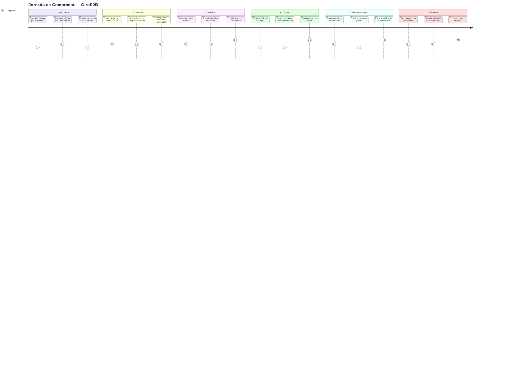

### 3.2 Visão de fluxo

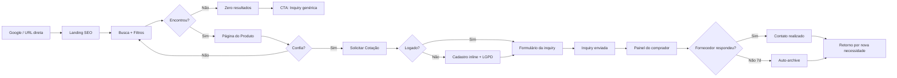

---

## 4. Etapas Detalhadas

### 4.1 DESCOBERTA

**Descrição:** O comprador encontra o GiroB2B pela primeira vez. Pode chegar via busca orgânica no Google (canal primário), URL direta por indicação, ou link em redes sociais.

**Canais de entrada:**

| Canal | % estimado | Exemplo |
|-------|-----------|---------|
| Google orgânico (SEO) | ~60% | Busca "fornecedor de embalagens em São Paulo" |
| URL direta / indicação | ~20% | Colega recomenda girob2b.com.br |
| Redes sociais (LinkedIn) | ~10% | Post compartilhado |
| Google Ads | ~10% | Anúncio patrocinado [futuro] |

**Ações na plataforma:**

| Ação | RF/RN | Fase |
|------|-------|------|
| Visualizar página de produto SEO | RF-05.01 | MVP |
| Visualizar página de categoria | RF-05.02 | MVP |
| Visualizar página de localidade | RF-05.03 | MVP |
| Visualizar página de categoria + localidade | RF-05.04 | MVP |
| Ver meta tags otimizadas e Schema.org | RF-05.05, RF-05.08 | MVP |
| Navegar via breadcrumbs | RF-05.09 | MVP |
| Acessar homepage com categorias em destaque | RF-04.06, RF-14.03 | MVP |
| Acessar "Como Funciona (comprador)" | RF-14.01 | MVP |
| Navegar sem login | RF-01.07, RN-01.05 | MVP |

**Telas/páginas envolvidas:**

| Página | URL SEO | Fonte |
|--------|---------|-------|
| Produto individual | `/produto/[slug-do-produto]-[cidade]` | RF-05.01 |
| Categoria | `/categoria/[slug]` | RF-05.02 |
| Localidade | `/fornecedores/[cidade]-[estado]` | RF-05.03 |
| Categoria + localidade | `/fornecedor-de/[categoria]-em-[cidade]` | RF-05.04 |
| Homepage | `/` | RF-14.03 |
| Como Funciona | `/como-funciona` | RF-14.01 |

*URLs conforme REFERENCIA seção 18.*

**Decisões do comprador:**
- "Este resultado é relevante para o que eu preciso?"
- "Essa plataforma parece confiável?"
- "Vale a pena explorar mais ou volto ao Google?"

**Emoções/expectativas:**
- **Curiosidade** misturada com **ceticismo** (plataforma nova)
- Espera **carregamento rápido** (TTFB <200ms, RNF-01.01)
- Espera **conteúdo relevante** ao termo que buscou no Google
- Frustração se a página parecer genérica ou vazia

**Regras de negócio aplicáveis:**
- RN-03.05: Páginas combinadas (categoria + localidade) só são geradas com ≥3 fornecedores
- RN-03.06: Páginas com <3 resultados recebem `noindex` automaticamente

**Métricas:**

| Métrica | Descrição | Meta MVP |
|---------|-----------|----------|
| Tráfego orgânico | Sessões via Google | Crescimento mensal |
| Bounce rate (landing SEO) | % que sai sem interagir | <60% |
| Pages/session | Páginas vistas por sessão | >2 |
| CTR no Google (SERP) | Cliques / impressões | >3% |
| Landing → busca | % que usa o campo de busca | >30% |

**Fase:** MVP (todos os RF-05.xx são MVP conforme Scope Lock)

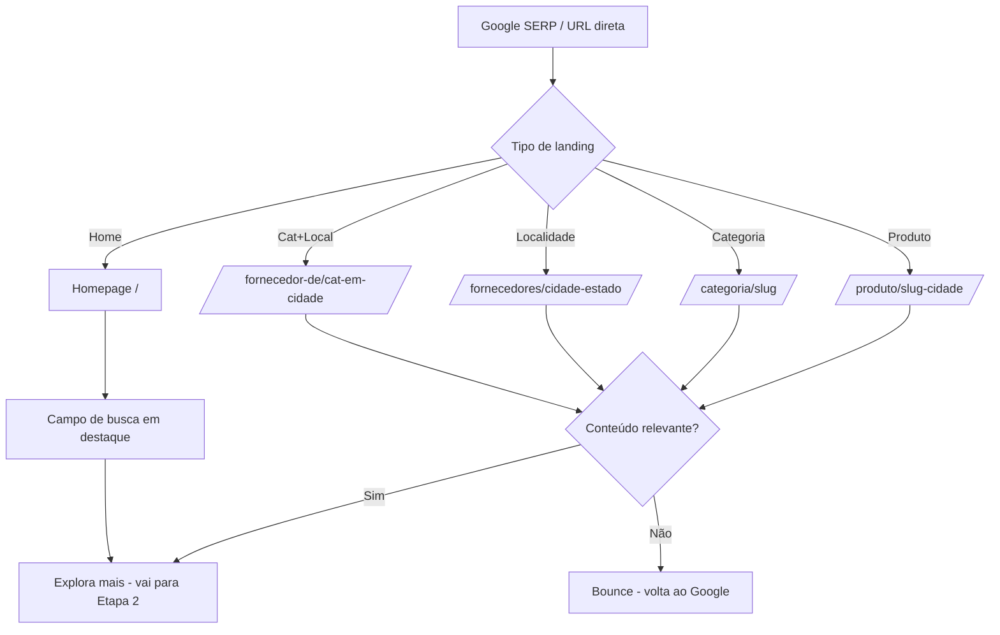

---

### 4.2 EXPLORAÇÃO

**Descrição:** O comprador busca ativamente por produtos e fornecedores. Usa busca textual, filtros e/ou navegação por categorias. O sistema aplica o algoritmo de ranking para ordenar resultados.

**Canais de entrada:** Campo de busca (qualquer página), navegação por categorias na home, link de categoria em landing SEO.

**Ações na plataforma:**

| Ação | RF/RN | Fase |
|------|-------|------|
| Busca textual por nome, categoria, palavras-chave, fornecedor | RF-04.01, UC-11 | MVP |
| Aplica filtros: categoria, subcategoria, cidade, estado, preço, selo verificado | RF-04.02, US-022 | MVP |
| Navega por categorias (browse) | RF-04.04, UC-11 FA-11.1, US-023 | MVP |
| Visualiza resultados rankeados pelo algoritmo | RF-04.03, RN-03.01 | MVP |
| Vê homepage: categorias destaque, produtos recentes, verificados, termos populares | RF-04.06 | MVP |
| Recebe sugestões de autocompletar | RF-04.05, US-029 | [VAL] |
| Busca registrada em search_logs para analytics | RN-10.01 | MVP |

**Algoritmo de ranking (RN-03.01):**

| Fator | Peso | Descrição |
|-------|------|-----------|
| Relevância textual | 35% | Match com nome, tags, categoria, descrição do produto |
| Nível do plano | 25% | Premium 100pts, Pro 70pts, Starter 40pts, Gratuito 10pts |
| Completude do perfil | 15% | % de completude do fornecedor (RN-02.01) |
| Proximidade geográfica | 15% | Distância até localização do comprador ou cidade buscada |
| Frescor do cadastro | 10% | Boost de 30 dias para produtos recém-cadastrados/atualizados |

*Pesos conforme RN-03.01 (REFERENCIA §16). Todos os artefatos (UC-11, UC-27, US-021, US-052) foram alinhados em 2026-04-04.*

**Regras adicionais:**
- RN-03.02: Dentro do mesmo nível de plano e faixa de relevância (diff <5%), ordem randomizada para fairness
- RN-03.03: Fornecedores gratuitos sempre abaixo dos pagantes (se pagantes tiverem relevância ≥20%) [MON]
- RN-03.04: Zero resultados → sugestões de categorias similares + CTA "Envie uma cotação genérica"

**Telas/páginas envolvidas:**

| Página | URL | Descrição |
|--------|-----|-----------|
| Resultados de busca | `/busca?q=[termo]` | Paginação de 20 resultados/página |
| Categoria | `/categoria/[slug]` | Lista de produtos da categoria |
| Homepage | `/` | Categorias destaque + busca |

**Decisões do comprador:**
- "Qual fornecedor parece mais adequado?"
- "Devo refinar minha busca com filtros?"
- "Devo tentar outra categoria?"
- "Há opções suficientes?"

**Emoções/expectativas:**
- **Eficiência** — quer resultados rápidos e relevantes
- **Frustração** se zero resultados sem alternativas (RN-03.04 mitiga isso)
- **Satisfação** se resultados numerosos e relevantes
- **Comparação mental** — está formando um shortlist

**Métricas:**

| Métrica | Descrição | Meta MVP |
|---------|-----------|----------|
| Buscas/sessão | Média de buscas por sessão | >1,5 |
| Filtros usados | % de buscas com filtro aplicado | Monitorar |
| CTR resultado→produto | % cliques nos resultados | >15% |
| Taxa zero resultados | % de buscas sem resultado | <10% |
| Termos mais buscados | Top 20 termos (search_logs) | Análise semanal |

**Fase:** MVP (busca + filtros + browse), Validação (autocomplete RF-04.05)

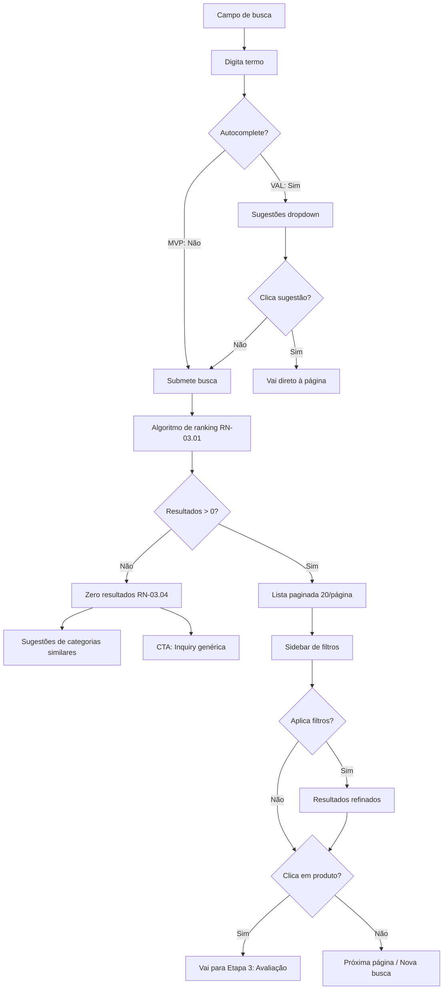

---

### 4.3 AVALIAÇÃO

**Descrição:** O comprador examina produtos e perfis de fornecedores individuais. Avalia credibilidade, qualidade do catálogo e sinais de confiança. Está construindo um shortlist mental.

**Canais de entrada:** Click em resultado de busca, click em card de categoria, acesso direto via URL SEO de produto.

**Ações na plataforma:**

| Ação | RF/RN | Fase |
|------|-------|------|
| Visualizar página completa do produto (fotos, descrição, specs, fornecedor) | RF-03.06, RF-05.01 | MVP |
| Visualizar perfil público do fornecedor (todos os produtos, dados, selo) | RF-02.05 | MVP |
| Ver selo "CNPJ Verificado" (Nível 1) | RF-11.01, RN-07.06 L1 | MVP |
| Denunciar fornecedor (informações falsas, produto inexistente, comportamento inadequado) | RF-11.04, UC-15, US-027 | MVP |
| Salvar fornecedor como favorito | RF-04.07, UC-16, US-029 | [VAL] |
| Ver selo "GiroB2B Verificado" (Nível 2) | RF-11.02, RF-11.03, RN-07.06 L2 | [MON] |
| Comparar até 3 fornecedores lado a lado | RF-04.08 | [ESC] |

**Telas/páginas envolvidas:**

| Página | URL | Conteúdo visível ao comprador |
|--------|-----|-------------------------------|
| Produto | `/produto/[slug]-[cidade]` | Fotos, descrição, preço (se informado), fornecedor, selo, CTA "Solicitar Cotação" |
| Perfil do fornecedor | `/fornecedor/[slug]` | Nome, cidade, categorias, todos os produtos, fotos, selo verificado, ano de fundação, horário |

**Sinais de confiança visíveis ao comprador:**

| Sinal | Impacto | Fase |
|-------|---------|------|
| Selo "CNPJ Verificado" | Confiança básica — CNPJ existe e está ativo | MVP |
| Fotos profissionais do produto | Alta credibilidade | MVP |
| Descrição detalhada (≥100 chars) | Fornecedor comprometido | MVP |
| Múltiplos produtos cadastrados (3+) | Catálogo real, não perfil abandonado | MVP |
| Logo da empresa | Profissionalismo | MVP |
| Horário de funcionamento | Acessibilidade | MVP |
| Selo "GiroB2B Verificado" completo | Confiança alta — verificação documental | [MON] |

*Nota: A completude do perfil (RN-02.01) não é exibida numericamente ao comprador — é uma métrica interna do fornecedor. Mas seus efeitos são visíveis: fornecedores com perfis completos aparecem melhor nos resultados (peso 15% no ranking) e passam mais confiança visual.*

**Decisões do comprador:**
- "Este fornecedor é confiável?"
- "Este produto atende minha necessidade?"
- "Devo solicitar cotação ou continuar buscando?"
- "O selo verificado me dá mais segurança?"

**Emoções/expectativas:**
- **Avaliação de risco** — está decidindo se confia o suficiente para compartilhar seus dados
- **Confiança** cresce com perfis completos, fotos, selo verificado
- **Desconfiança** com perfis vazios, sem foto, sem selo
- **Comparação** — mentalmente comparando fornecedores visitados

**Métricas:**

| Métrica | Descrição | Meta MVP |
|---------|-----------|----------|
| Tempo na página de produto | Engajamento com conteúdo | >45s |
| Perfis visitados/sessão | Amplitude de exploração | >2 |
| Taxa de denúncia | % de perfis denunciados | <1% |
| Favoritos adicionados | Engajamento com fornecedores | [VAL] Monitorar |
| Produto→inquiry | % que envia inquiry após ver produto | >5% |

**Fase:** MVP (visualizar), Validação (favoritos), Escala (comparação)

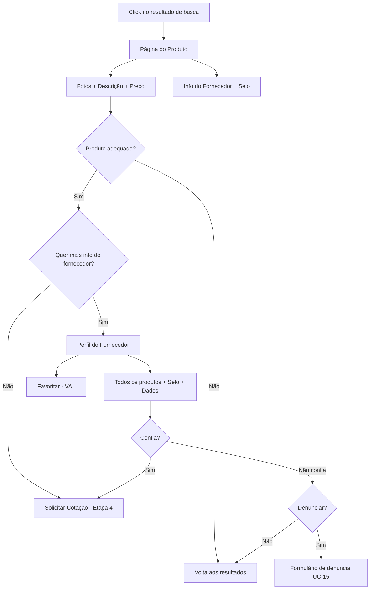

---

### 4.4 CONTATO

**Descrição:** A etapa crítica de conversão. O comprador decide enviar uma inquiry (solicitação de cotação) para um fornecedor. Se não estiver logado, o cadastro é exigido neste momento — e somente neste momento. É aqui que o comprador se torna um "ativo" da plataforma.

**Canais de entrada:** Botão "Solicitar Cotação" na página do produto ou perfil do fornecedor (CA-025.1). Também CTA "Cotação Genérica" na página de zero resultados [VAL].

**Ações na plataforma:**

| Ação | RF/RN | Fase |
|------|-------|------|
| Clicar "Solicitar Cotação" | RF-06.01, UC-13, US-025 | MVP |
| Cadastro inline (se não logado): nome, email, empresa[opt], telefone, cidade/estado | RF-01.06, UC-12, US-024 | MVP |
| Aceitar checkbox LGPD obrigatório | RF-01.08, RN-01.07 | MVP |
| Preencher formulário: descrição (min 20 chars), quantidade, prazo | RF-06.01, CA-025.2 | MVP |
| Auto-fill dados de contato do perfil | CA-025.3 | MVP |
| Submeter → validação rate limit (10/dia) + dedup (48h) | RF-06.07, RN-04.01, RN-04.04 | MVP |
| Inquiry criada com status "nova" | RN-04.08 | MVP |
| Fornecedor notificado por email (imediato) | RF-06.02, RN-09.01 | MVP |
| Confirmação: "Cotação enviada para [fornecedor]" | CA-025.8 | MVP |
| Login social Google | RF-01.11, US-031 | [VAL] |
| Enviar inquiry genérica (categoria + região → até 5 fornecedores) | RF-06.06, UC-14, US-028, RN-04.03 | [VAL] |

**Mecânica de mascaramento (lado do fornecedor — o comprador NÃO vê isso):**

| Plano do fornecedor | O que o fornecedor vê | RN |
|---------------------|----------------------|-----|
| Gratuito | Descrição + quantidade + prazo + cidade do comprador. **Dados ocultos:** nome, empresa, email, telefone. Mensagem: "Para ver os dados de contato, assine a partir de R$79/mês" | RN-04.05 |
| Pago (com créditos) | Todos os dados + contato completo. Consome 1 crédito de lead (irreversível) | RN-04.06 |
| Pago (sem créditos) | Comportamento igual ao gratuito. Mensagem: "Seus créditos acabaram. Compre extras ou aguarde renovação em [data]" | RN-04.07 |

*O comprador é informado apenas de que a cotação foi enviada. Ele não sabe se o fornecedor é gratuito ou pago, nem se seus dados estão mascarados. A assimetria é by design (ver seção 8).*

**Texto do checkbox LGPD (UC-12, passo 3):**
> "Autorizo o compartilhamento dos meus dados de contato (nome, empresa, email, telefone) com fornecedores que possuam plano pago na GiroB2B, conforme a Política de Privacidade."

*Nota: Texto sujeito a revisão de advogado (REFERENCIA §17 item 6).*

**Telas/páginas envolvidas:**

| Página | Descrição |
|--------|-----------|
| Formulário de inquiry (inline) | Sobrepõe a página do produto/perfil, sem redirect |
| Cadastro inline | Modal/drawer na mesma página (CA-024.8) |
| Confirmação | Mensagem inline após envio |
| Formulário de inquiry genérica | Acessível via zero resultados ou menu [VAL] |

**Decisões do comprador:**
- "Estou pronto para compartilhar meus dados de contato?"
- "Este é o fornecedor certo ou devo continuar buscando?"
- "Confio nesta plataforma o suficiente para cadastrar?"
- "Devo enviar para um fornecedor específico ou para vários?" [VAL]

**Emoções/expectativas:**
- **Maior fricção da jornada** — é aqui que pede cadastro
- O formulário curto (5 campos) e inline mitiga a fricção
- **Ansiedade sobre privacidade** — o checkbox LGPD deve ser claro e honesto
- **Expectativa de resposta rápida** — B2B espera retorno em horas, não dias
- **Alívio** após confirmação de envio

**Métricas:**

| Métrica | Descrição | Meta MVP |
|---------|-----------|----------|
| Taxa conversão inquiry | Visitantes → inquiry enviada | >2% (orgânico: 2,6%) |
| Registration-to-inquiry | % que envia inquiry após cadastro | >70% |
| Inquiries/comprador/dia | Média diária | 1-3 |
| Drop-off no cadastro | % que abandona no formulário de registro | <40% |
| Taxa consentimento LGPD | % que aceita o checkbox | >95% |
| Dedup rate | % de inquiries duplicadas bloqueadas | Monitorar |

**Fase:** MVP (inquiry direcionada + cadastro), Validação (inquiry genérica + login social)

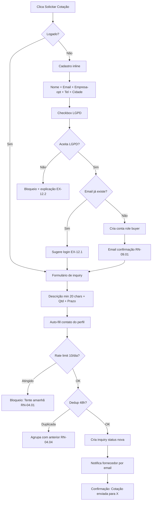

---

### 4.5 ACOMPANHAMENTO

**Descrição:** Após enviar a inquiry, o comprador acompanha o status e aguarda resposta do fornecedor. O painel do comprador é a central de controle, e as notificações por email mantêm o engajamento.

**Canais de entrada:** Acesso direto ao painel, click em link do email de notificação, retorno pela home.

**Ações na plataforma:**

| Ação | RF/RN | Fase |
|------|-------|------|
| Acessar painel do comprador: inquiries enviadas + status + perfil | RF-10.01, US-026 | MVP |
| Ver status da inquiry: nova → visualizada → respondida/arquivada | RN-04.08 | MVP |
| Receber email "Inquiry visualizada" (até 1h após visualização) | RN-09.01 | MVP |
| Receber email se nenhum fornecedor respondeu (inquiry genérica, após todas as rodadas) | RN-04.09, RN-09.01 | [VAL] |
| Ver histórico detalhado de inquiries com datas e fornecedores | RF-10.02 | [VAL] |
| Gerenciar lista de favoritos | RF-10.01 | [VAL] |

**Ciclo de vida da inquiry (visão do comprador):**

```
[Enviada] → [Visualizada pelo fornecedor] → [Respondida] ou [Sem resposta 7d → Arquivada]
```

**Tempos e notificações:**

| Evento | Timing | Destinatário | Fase |
|--------|--------|-------------|------|
| Inquiry enviada (confirmação) | Imediato | Comprador | MVP |
| Inquiry visualizada pelo fornecedor | Até 1h | Comprador (email) | MVP |
| Fornecedor não visualizou em 48h | 48h | Fornecedor (lembrete) | [VAL] |
| Inquiry sem visualização em 7 dias | 7d | Auto-archive (RN-04.09) | [VAL] |
| Nenhum fornecedor respondeu (genérica) | Após última rodada | Comprador (email) | [VAL] |

**Telas/páginas envolvidas:**

| Página | URL | Conteúdo |
|--------|-----|----------|
| Painel do comprador | `/painel/comprador` | Lista de inquiries, status, data de envio, fornecedor destino |
| Perfil do comprador | `/painel/comprador/perfil` | Dados pessoais editáveis |
| Favoritos | `/painel/comprador/favoritos` | Lista de fornecedores salvos [VAL] |

**Decisões do comprador:**
- "O fornecedor já viu minha cotação?"
- "Devo enviar para outros fornecedores?"
- "Devo tentar uma inquiry genérica?" [VAL]
- "Esta plataforma funciona ou estou perdendo tempo?"

**Emoções/expectativas:**
- **Ansiedade** sobre se receberá resposta
- O email "Inquiry visualizada" é **crítico** para reassurance — valida que a plataforma funciona
- **Frustração** se não houver resposta. O auto-archive de 7 dias evita espera indefinida
- **Satisfação** quando o fornecedor responde rápido

**Métricas:**

| Métrica | Descrição | Meta MVP |
|---------|-----------|----------|
| Taxa retorno ao painel | % que volta ao painel após enviar inquiry | >50% |
| Tempo inquiry→visualização | Horas entre envio e visualização pelo fornecedor | <24h |
| Email open rate (inquiry visualizada) | Abertura do email de notificação | >40% |
| % inquiries arquivadas (7d sem resposta) | Taxa de não-resposta | <30% |
| Inquiries subsequentes | % de compradores que enviam 2+ inquiries | >30% |

**Fase:** MVP (painel básico com lista de inquiries), Validação (histórico detalhado, favoritos)

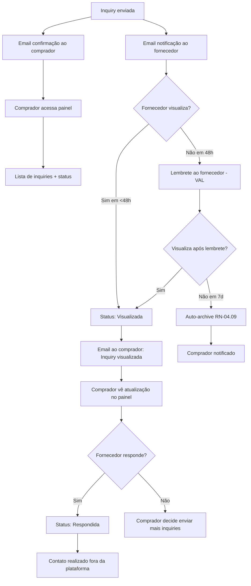

---

### 4.6 RETENÇÃO

**Descrição:** O que traz o comprador de volta à plataforma após a primeira interação. A retenção depende de (1) novas necessidades de compra, (2) notificações que puxam de volta, e (3) features que criam hábito (favoritos, alertas).

**Canais de entrada:** Email de notificação (link), necessidade orgânica nova, alerta de novo fornecedor [VAL], verificação de favoritos [VAL].

**Ações na plataforma:**

| Ação | RF/RN | Fase |
|------|-------|------|
| Retornar para verificar status de inquiries anteriores | RF-10.01 | MVP |
| Enviar novas inquiries para outros fornecedores | RF-06.01 | MVP |
| Buscar novos produtos/fornecedores para nova necessidade | RF-04.01 | MVP |
| Configurar alertas por categoria (notificação quando novos fornecedores se cadastram) | RF-10.03, US-032 | [VAL] |
| Gerenciar lista de favoritos | RF-04.07, UC-16 | [VAL] |
| Receber email de alerta: novo fornecedor na categoria monitorada | CA-032.2 | [VAL] |
| Criar alerta via CTA em busca sem resultado: "Notifique-me quando houver fornecedores" | CA-032.1 | [VAL] |

**Triggers de retorno:**

| Trigger | Canal | Fase | Efetividade esperada |
|---------|-------|------|---------------------|
| Email "Inquiry visualizada" | Email | MVP | Alta — valida que a plataforma funciona |
| Nova necessidade de compra | Orgânico/direto | MVP | Média — depende do ciclo de compras |
| Alerta: novo fornecedor na categoria | Email | [VAL] | Alta — altamente relevante |
| Lista de favoritos como bookmark | Dashboard | [VAL] | Média — cria hábito |
| Email "Nenhum fornecedor respondeu - ampliar busca?" | Email | [VAL] | Média — re-engaja insatisfeitos |

**Mapeamento AARRR (REFERENCIA seção 14):**

| AARRR | Ação do comprador | Métrica | Meta |
|-------|------------------|---------|------|
| **Acquisition** | Chega via Google orgânico ou indicação | Sessões, fonte de tráfego | Orgânico >60% |
| **Activation** | Faz primeira busca → envia primeira inquiry | Taxa conversão inquiry | >2% |
| **Retention** | Retorna e envia novas inquiries | DAU/MAU, repeat inquiries | 30d retention >30% |
| **Revenue** | Indireto: atividade do comprador gera leads que fornecedores pagam para acessar | Inquiries/mês, buyer:supplier ratio | 100+ inq/mês, ratio 3:1 a 5:1 |
| **Referral** | Indica a plataforma para outros compradores | Cadastros via indicação | >5% |

**Decisões do comprador:**
- "Tenho nova necessidade de compra?"
- "O GiroB2B me ajudou da última vez?"
- "Há novos fornecedores na minha categoria?"
- "Vale manter meus favoritos atualizados?"

**Emoções/expectativas:**
- **Lealdade** constrói-se se inquiries anteriores resultaram em respostas
- **Frustração** se a plataforma não entregou valor (nenhuma resposta)
- **Conveniência** — voltar é mais fácil que buscar no Google novamente
- **Alertas** criam mecanismo de "pull" sem esforço do comprador

**Métricas:**

| Métrica | Descrição | Meta MVP |
|---------|-----------|----------|
| DAU/MAU | Ratio de engajamento | >10% |
| Repeat inquiries | % de compradores com 2+ inquiries | >30% |
| Buyer lifetime inquiries | Total de inquiries por comprador | >5 (12 meses) |
| Alerta signup rate | % de buscas sem resultado que geram alerta | [VAL] >20% |
| Alerta→retorno | % de alertas que geram visita | [VAL] >15% |
| Churn de comprador | % que não volta em 90 dias | <50% |

**Fase:** MVP (notificações de inquiry, retorno orgânico), Validação (favoritos, alertas)

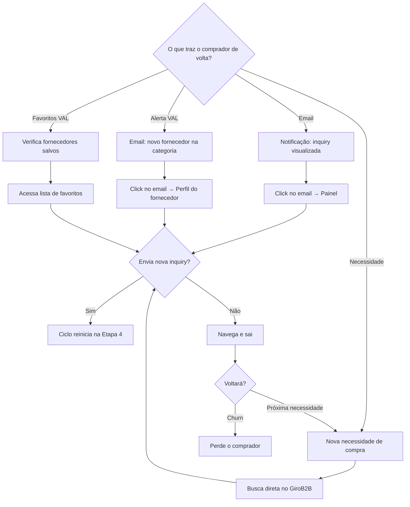

---

## 5. Fluxos Críticos

### 5.1 Busca e Descoberta (fluxo detalhado)

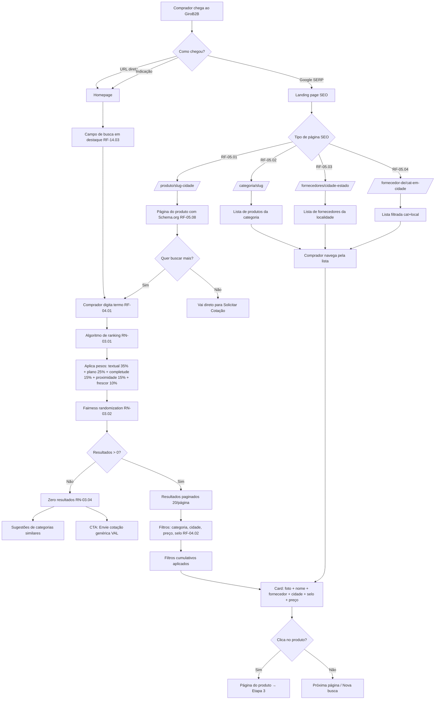

### 5.2 Envio de Inquiry Direcionada (MVP)

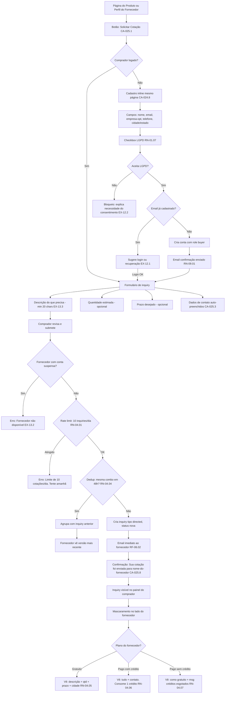

### 5.3 Envio de Inquiry Genérica [VAL]

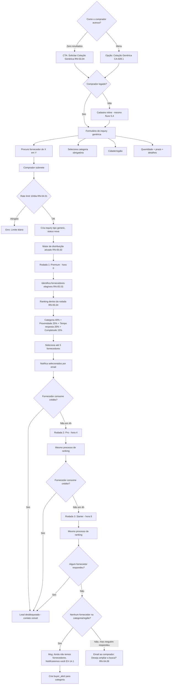

*Nota: Os pesos do ranking de distribuição (RN-05.04) são DISTINTOS dos pesos de busca (RN-03.01). São dois algoritmos independentes — ver seção 9.8 do artefato 2.6.*

### 5.4 Cadastro e Ativação como Comprador

> **Cadastro unificado (RN-01.10):** O comprador primeiro cria conta genérica (Nível 1) em `/cadastro`. A ativação como buyer (Nível 2) acontece na primeira inquiry, quando o consentimento LGPD é exigido e o registro `buyers` é criado. Role é derivado da existência do registro (RN-01.10).

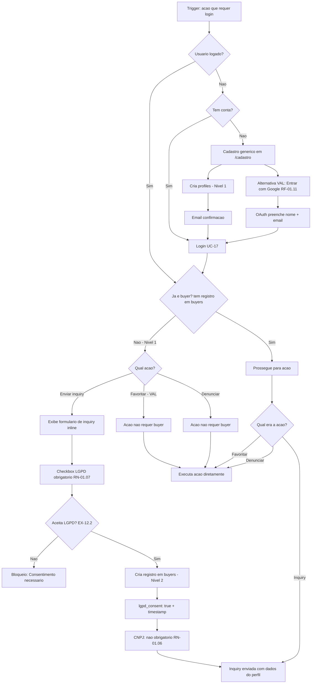

---

## 6. Jornada por Fase do Produto

| Touchpoint | MVP | Validação [VAL] | Monetização [MON] | Escala [ESC] |
|------------|-----|-----------------|-------------------|-------------|
| **Busca** | Textual + filtros + browse por categorias | + Autocomplete (RF-04.05) | — | + Matchmaking IA |
| **SEO** | 9 RFs completos (RF-05.01 a RF-05.09): produto, categoria, localidade, combinadas | — | — | — |
| **Inquiry** | Direcionada para 1 fornecedor (RF-06.01) | + Genérica distribuída para até 5 (RF-06.06) | — | — |
| **Cadastro** | Email + senha (RF-01.06) | + Login social Google (RF-01.11) | — | — |
| **Dashboard** | Básico: inquiries enviadas + status (RF-10.01) | + Histórico detalhado (RF-10.02) + Favoritos (RF-04.07) | — | + Recomendações personalizadas |
| **Notificações** | Email: confirmação cadastro, inquiry visualizada (RN-09.01) | + Alertas por categoria (RF-10.03) + Push PWA opt-in (RN-09.03) | — | + WhatsApp (RF-13.03) |
| **Avaliação** | Ver produto + perfil + selo CNPJ L1 | + Favoritar fornecedores | + Mais fornecedores verificados L2, respostas mais rápidas (incentivo por créditos) | + Comparação lado a lado 3 fornecedores (RF-04.08) |
| **Confiança** | CNPJ verificado automaticamente, revalidação 90d (RF-11.01, RN-07.06 L1) | — | + Selo GiroB2B Verificado completo (RF-11.02, RN-07.06 L2) | — |
| **Anti-spam** | Rate limit 10/dia (RN-04.01) + dedup 48h (RN-04.04) | + Denúncia de inquiries falsas pelo fornecedor (RF-06.08) | — | — |

**Princípio-chave:** A experiência do comprador melhora indiretamente conforme a plataforma monetiza. Na fase MON, mais fornecedores aderem a planos pagos → respondem mais rápido → comprador recebe respostas de melhor qualidade. O comprador nunca paga, mas se beneficia do ecossistema.

---

## 7. Pontos de Conversão e Gatilhos

### 7.1 Momentos de conversão (visitante → usuário cadastrado)

| Momento | Trigger | Prioridade | Fase |
|---------|---------|-----------|------|
| **Enviar inquiry** | Botão "Solicitar Cotação" — principal mecanismo | Primário | MVP |
| **Denunciar fornecedor** | Botão "Denunciar" no perfil | Secundário | MVP |
| **Favoritar fornecedor** | Ícone de favorito no card/perfil | Secundário | [VAL] |
| **Criar alerta** | CTA "Notifique-me" em zero resultados | Terciário | [VAL] |

O cadastro é **lazy** — nunca exigido antes do necessário. O comprador pode completar as etapas 1-3 (Descoberta, Exploração, Avaliação) sem conta. O muro de autenticação só aparece na etapa 4 (Contato), no exato momento em que o comprador demonstra intenção de ação.

### 7.2 Momento da primeira inquiry

| Fator | Impacto na conversão |
|-------|---------------------|
| Formulário inline (não redirect) | Positivo — sem quebra de contexto |
| Apenas 5 campos no cadastro | Positivo — baixa fricção |
| CNPJ não obrigatório para comprador | Positivo — não bloqueia pessoa física |
| Checkbox LGPD como único "obstáculo" | Neutro — necessário por lei |
| Auto-fill de dados de contato | Positivo — economiza tempo |
| Descrição mínima 20 chars | Neutro — garante qualidade sem ser oneroso |
| Confirmação imediata com nome do fornecedor | Positivo — feedback claro |

### 7.3 Gatilhos de retorno

| Gatilho | Canal | Timing | Efetividade | Fase |
|---------|-------|--------|-------------|------|
| Email: inquiry visualizada pelo fornecedor | Email | Até 1h após visualização | Alta | MVP |
| Email: confirmação de cadastro | Email | Imediato | Média | MVP |
| Nova necessidade de compra (orgânico) | Direto/Google | Ciclo de compras do comprador | Média | MVP |
| Email: nenhum fornecedor respondeu (genérica) | Email | Após última rodada | Média | [VAL] |
| Email: novo fornecedor na sua categoria | Email | Quando fornecedor se cadastra | Alta | [VAL] |
| Push: nova inquiry respondida | Push (PWA) | Imediato | Alta | [VAL] |
| Dashboard com favoritos | Direto | A qualquer momento | Média | [VAL] |

### 7.4 Funil de conversão esperado

```
Visitantes (100%) → Busca/Exploração (60%) → Produto/Perfil (30%) → Cadastro (5%) → Inquiry enviada (3%) → Inquiry respondida (2%)
```

*Baseado em conversão orgânica de 2,6-2,7% (SERPSculpt 2025) e conversão B2B de 1,8% (Unbounce 2025). Alvo: >2% de visitante→inquiry.*

---

## 8. Touchpoints com o Fornecedor

### 8.1 Assimetria de informação (by design)

A assimetria de informação entre comprador e fornecedor é **intencional** e é a base do modelo de monetização:

| Informação | Comprador vê | Fornecedor gratuito vê | Fornecedor pago vê |
|------------|-------------|----------------------|-------------------|
| Perfil do fornecedor | Tudo (nome, cidade, categorias, produtos, fotos, selo) | N/A (é o próprio) | N/A |
| Plano do fornecedor | **Não vê** (by design) | N/A | N/A |
| Dados do comprador na inquiry | N/A (são seus próprios dados) | Descrição + qtd + prazo + cidade. **Contato oculto** (RN-04.05) | **Tudo** (consome 1 crédito, RN-04.06) |
| Quantas inquiries o fornecedor recebe | **Não vê** | Vê no painel | Vê no painel |
| Taxa de resposta do fornecedor | **Não vê** (até fase Escala) | Vê no dashboard | Vê no dashboard |
| Ranking/posição nos resultados | Não vê posição numérica | Não vê posição | Não vê posição |

**O comprador não sabe se o fornecedor é gratuito ou pago.** Ele envia a inquiry e recebe confirmação. O que acontece do lado do fornecedor (mascaramento, créditos, planos) é invisível ao comprador. Isso é critical — se o comprador soubesse que seu contato está "preso", poderia perder confiança na plataforma.

### 8.2 Impacto visual do selo de verificação

| Nível | O que o comprador vê | Confiança gerada | Fase |
|-------|---------------------|------------------|------|
| Nenhum | Perfil sem selo | Baixa — "será que existe mesmo?" | MVP |
| Nível 1 — CNPJ Verificado | Badge "CNPJ Verificado" + checkmark | Média — "a empresa existe e tem CNPJ ativo" | MVP |
| Nível 2 — GiroB2B Verificado | Badge premium + selo destaque | Alta — "a plataforma verificou documentos e fotos" | [MON] |

O selo aparece em:
- Cards de resultado de busca (CA-021.4)
- Página do produto
- Perfil do fornecedor
- Listagens de categoria e localidade

### 8.3 Impacto da completude do perfil

O comprador **não vê** um número de completude (isso é métrica interna para o fornecedor, RN-02.01). Mas percebe os efeitos:

| Sinal visível | Completude associada | Impacto na confiança |
|---------------|---------------------|---------------------|
| Logo da empresa | 10% | Profissionalismo |
| Descrição detalhada (≥100 chars) | 15% | Fornecedor comprometido |
| Endereço completo | 10% | Empresa real |
| Telefone de contato | 10% | Acessibilidade |
| Categorias selecionadas | 10% | Relevância |
| 3+ produtos cadastrados | 20% | Catálogo real |
| Fotos nos produtos | 15% | Credibilidade visual |
| Horário de funcionamento | 5% | Detalhamento |
| Ano de fundação | 5% | Experiência |

Fornecedores com maior completude rankeiam melhor (15% do peso no ranking, RN-03.01), aparecendo mais alto nos resultados — um mecanismo indireto mas poderoso.

---

## 9. Matriz de Rastreabilidade

### 9.1 Etapas × Casos de Uso

| Etapa | UC-11 Buscar | UC-12 Cadastrar | UC-13 Inquiry Dir. | UC-14 Inquiry Gen. | UC-15 Denunciar | UC-16 Favoritar | UC-17 Login |
|-------|:---:|:---:|:---:|:---:|:---:|:---:|:---:|
| Descoberta | | | | | | | |
| Exploração | **P** | | | | | | |
| Avaliação | S | | | | **P** | **P** | |
| Contato | | **P** | **P** | **P** | | | S |
| Acompanhamento | | S | S | S | | S | |
| Retenção | S | | | | | S | |

(**P** = participação principal, S = suporte)

### 9.2 Etapas × Requisitos Funcionais

| Etapa | RFs envolvidos |
|-------|---------------|
| Descoberta | RF-05.01, RF-05.02, RF-05.03, RF-05.04, RF-05.05, RF-05.06, RF-05.07, RF-05.08, RF-05.09, RF-14.01, RF-14.03, RF-01.07 |
| Exploração | RF-04.01, RF-04.02, RF-04.03, RF-04.04, RF-04.05 [VAL], RF-04.06 |
| Avaliação | RF-02.05, RF-03.06, RF-11.01, RF-11.04, RF-04.07 [VAL], RF-04.08 [ESC] |
| Contato | RF-01.06, RF-01.07, RF-01.08, RF-01.11 [VAL], RF-06.01, RF-06.02, RF-06.06 [VAL], RF-06.07 |
| Acompanhamento | RF-10.01, RF-10.02 [VAL], RF-13.01 |
| Retenção | RF-10.03 [VAL], RF-13.01, RF-04.07 [VAL] |

### 9.3 Etapas × Regras de Negócio

| Etapa | RNs envolvidas |
|-------|---------------|
| Descoberta | RN-01.05, RN-03.05, RN-03.06 |
| Exploração | RN-03.01, RN-03.02, RN-03.03 [MON], RN-03.04, RN-10.01 |
| Avaliação | RN-07.01, RN-07.06 |
| Contato | RN-01.05, RN-01.06, RN-01.07, RN-04.01, RN-04.02, RN-04.03 [VAL], RN-04.04, RN-04.05, RN-04.06 [MON], RN-04.07 [MON], RN-04.08, RN-05.01 a RN-05.10 [VAL/MON] |
| Acompanhamento | RN-04.08, RN-04.09 [VAL], RN-09.01, RN-09.02 |
| Retenção | RN-09.01, RN-09.02, RN-09.03 [VAL] |

### 9.4 Etapas × User Stories

| Etapa | User Stories |
|-------|------------|
| Descoberta | US-030 (páginas SEO por localidade) |
| Exploração | US-021 (busca textual), US-022 (filtros), US-023 (browse categorias), US-029 [VAL] (autocomplete) |
| Avaliação | US-027 (denunciar fornecedor) |
| Contato | US-024 (cadastro comprador), US-025 (inquiry direcionada), US-028 [VAL] (inquiry genérica), US-031 [VAL] (login Google) |
| Acompanhamento | US-026 (painel comprador), US-033 (login), US-034 (recuperar senha), US-035 (logout) |
| Retenção | US-032 [VAL] (alertas novos fornecedores) |

---

## 10. Pendências e Observações

### 10.1 Decisões pendentes que afetam a jornada do comprador

| # | Pendência | Impacto na jornada | Ref. REFERENCIA §17 | Status |
|---|-----------|-------------------|---------------------|--------|
| 1 | Pesos do algoritmo de ranking (RN-03.01) sujeitos a A/B testing | Ordem dos resultados na etapa Exploração | Item 7 | ⏳ Pós-lançamento |
| 2 | Intervalo entre rodadas de distribuição (4h provisório) | Tempo de espera na inquiry genérica [VAL] | Item 2 | ⏳ Dados reais definem |
| 3 | ~~Threshold de denúncias~~ | ~~Moderação~~ | — | ✅ Decidido: 3 denúncias = advertência, 5 = suspensão. Configurável via `system_configs` |
| 4 | Texto exato do checkbox LGPD | Conversão na etapa Contato | Item 6 | ⏳ Revisão de advogado |
| 5 | Subsetores industriais de Márcio | Categorias disponíveis na busca + páginas SEO | Item 1 | ⏳ Aguardando |
| 6 | ORM (Prisma vs Drizzle) | Não afeta jornada diretamente (decisão de implementação) | — | ⏳ CTO decide |

### 10.2 Pontos para A/B testing pós-lançamento

| # | Hipótese a testar | Etapa afetada | Métrica |
|---|-------------------|---------------|---------|
| 1 | Posição do formulário de cadastro: inline vs modal vs página separada | Contato | Drop-off rate |
| 2 | Descrição mínima: 20 chars vs 50 chars vs sem mínimo | Contato | Qualidade da inquiry vs conversão |
| 3 | Texto do botão: "Solicitar Cotação" vs "Pedir Orçamento" vs "Entrar em Contato" | Contato | CTR |
| 4 | CTA de zero resultados: texto e posicionamento | Exploração | Conversão para inquiry genérica |
| 5 | Ordem dos campos no cadastro | Contato | Tempo de preenchimento |
| 6 | Número de resultados por página: 10 vs 20 vs 30 | Exploração | Pages/session, CTR |

### 10.3 Pesos dos algoritmos (fonte autoritativa)

Os pesos dos algoritmos de ranking e distribuição foram unificados em todos os artefatos conforme REFERENCIA §16 (atualizada 2026-04-04):

| Algoritmo | Fatores (peso) | Fonte |
|-----------|---------------|-------|
| **Ranking de busca** (RN-03.01) | Textual 35% + Plano 25% + Completude 15% + Proximidade 15% + Frescor 10% | REFERENCIA §16 |
| **Distribuição** (RN-05.04) | Categoria 40% + Proximidade 25% + Tempo resposta 20% + Completude 15% | REFERENCIA §16 |

**Nota:** Fator "Saturação semanal" removido do algoritmo de distribuição nesta revisão. Documentado como enhancement futuro em REFERENCIA §17.

### 10.4 Observações de design

1. **MVP sem pagamento:** No MVP, nenhum fornecedor pode de fato assinar um plano (não há gateway de pagamento). As inquiries funcionam com dados ocultos para todos. A equipe pode liberar manualmente dados de contato para fornecedores estratégicos nos primeiros meses (onboarding white-glove). O comprador não percebe diferença.

2. **Comprador como produto:** O comprador não paga, mas é o "produto" da plataforma. Suas inquiries são o que os fornecedores querem acessar. Todo design deve maximizar a quantidade e qualidade de inquiries com mínima fricção.

3. **Formulário inline vs redirect:** O cadastro e a inquiry são inline (na mesma página) por decisão de UX (CA-024.8). Redirect para página separada aumentaria o drop-off significativamente.

4. **LGPD como feature, não obstáculo:** O checkbox LGPD, embora obrigatório por lei, serve como sinal de transparência. O texto explícito sobre compartilhamento de dados com fornecedores pagantes pode aumentar confiança, não reduzi-la.

---

*Fim do documento. Próximo artefato: 2.8 Jornada do Fornecedor.*
