# 2.8 — Jornada do Fornecedor

| Campo | Valor |
|-------|-------|
| **Artefato** | 2.8 — Jornada do Fornecedor |
| **Fase** | Fase 2 — Design (8/8 — ÚLTIMO da fase) |
| **Data** | 2026-04-04 |
| **Versão** | 1.0 |
| **Autor** | Claude Code (Opus 4.6) |
| **Público** | Produto, UX/UI, Desenvolvimento, Comercial |
| **Depende de** | REFERENCIA_CONSOLIDADA, 1.4 RFs, 1.6 RNs, 1.7 Scope Lock, 1.9 Precificação, 2.1 UCs, 2.2 USs, 2.5 ERD, 2.6 Classes, 2.7 Jornada Comprador, DNA_GIROB2B |

---

## Resumo Executivo

A Jornada do Fornecedor documenta a experiência completa do fornecedor no GiroB2B, desde o momento em que descobre a plataforma até a operação como assinante pagante e o ciclo de renovação/churn. O fornecedor é o **gerador de receita** do marketplace — diferentemente do comprador (artefato 2.7), que nunca paga e cujo fluxo é mais curto e linear. A jornada do fornecedor percorre **9 etapas**: Descoberta, Cadastro, Configuração do Perfil, Catálogo, Primeiras Inquiries, Momento Aha, Decisão de Assinar, Operação como Pagante e Renovação/Churn.

O princípio central que rege esta jornada é o modelo **freemium com monetização por lead**: o fornecedor lista produtos gratuitamente e de forma ilimitada, recebe inquiries de compradores reais, mas só acessa os dados de contato do comprador ao assinar um plano pago e consumir créditos de lead. A frustração controlada ao ver demanda real sem poder acessar o contato é o principal gatilho de conversão (o "Momento Aha"). Este artefato cruza 10 UCs (UC-01 a UC-10), 20 User Stories (US-001 a US-020) e 3 compartilhadas (US-033 a US-035), mapeando cada etapa aos requisitos funcionais, regras de negócio e métricas correspondentes.

Enquanto o artefato 2.7 foca em **buscar e cotar** (perspectiva do comprador), este artefato foca em **construir presença e monetizar** (perspectiva do fornecedor). Os touchpoints entre ambos são espelhados: a inquiry enviada pelo comprador = inquiry recebida pelo fornecedor; o selo verificado que o comprador vê = a verificação que o fornecedor obtém; os dados mascarados que protegem o comprador = a frustração que converte o fornecedor em pagante.

---

## 2. Perfil do Fornecedor

### 2.1 Quem é

O fornecedor típico do GiroB2B é um **micro ou pequeno empresário brasileiro** (93,8% das 24,2 milhões de empresas ativas no Brasil — SEBRAE 2025). Geralmente é o dono da operação ou um gerente comercial com autonomia de decisão. Opera em setores como embalagens, autopeças, materiais de construção, alimentos industriais e insumos em geral. Possui CNPJ ativo e busca novos canais de aquisição de clientes além de indicações e feiras presenciais.

**Maturidade digital:** baixa a média (índice 40,77/100, SEBRAE/PR 2024). 66% das empresas estão em fase inicial de digitalização. Muitos fornecedores não possuem site próprio e dependem de WhatsApp e redes de contato presencial.

### 2.2 Motivações

| Motivação | Descrição | Dados de suporte |
|-----------|-----------|-----------------|
| **Visibilidade online** | Aparecer no Google quando alguém busca seu produto/serviço | 66% das PMEs sem presença digital efetiva |
| **Novos clientes** | Receber contatos de compradores que não conheciam a empresa | Buyer:supplier ratio meta 10:1+ (REFERENCIA §14) |
| **Custo menor** | Adquirir leads a fração do custo de canais tradicionais | GiroB2B ~R$3,32-3,95/lead vs Google Ads R$35-90/lead |
| **Profissionalização** | Ter catálogo online organizado e perfil empresarial público | Completude do perfil como diferencial competitivo |
| **Escala sem equipe** | Receber demanda sem precisar de equipe comercial grande | Plataforma gera leads passivamente |

### 2.3 Dores

| Dor | Impacto | Custo atual |
|-----|---------|-------------|
| **Feiras presenciais caras** | Investimento alto, retorno incerto, 2-3x/ano | R$10.000-25.000/stand (REFERENCIA §15) |
| **Google Ads complexo** | Requer expertise, CPC alto, conversão baixa (1,8-3,5%) | R$35-90/lead (REFERENCIA §15) |
| **Dependência de indicações** | Crescimento limitado ao network existente | Imprevisível |
| **Sem presença digital** | Invisível para compradores que buscam online | Perda de oportunidades |
| **Processos manuais** | Atendimento por WhatsApp sem organização | Leads perdidos, follow-up falho |
| **LinkedIn Ads caro** | CPL alto para B2B no Brasil | R$55-110/lead (REFERENCIA §15) |

### 2.4 Comportamento esperado

```
Conhece GiroB2B (Márcio / Google / indicação)
  → Avalia: "é grátis para listar?"
    → Cadastra com CNPJ
      → Completa perfil
        → Lista produtos (ilimitado)
          → Espera inquiries
            → Recebe primeira inquiry (dados ocultos)
              → Percebe valor real
                → Calcula ROI vs alternativas
                  → Assina plano → Desbloqueia leads → Fecha negócios → Renova
```

---

## 3. Mapa da Jornada Completa

### 3.1 Visão experiencial

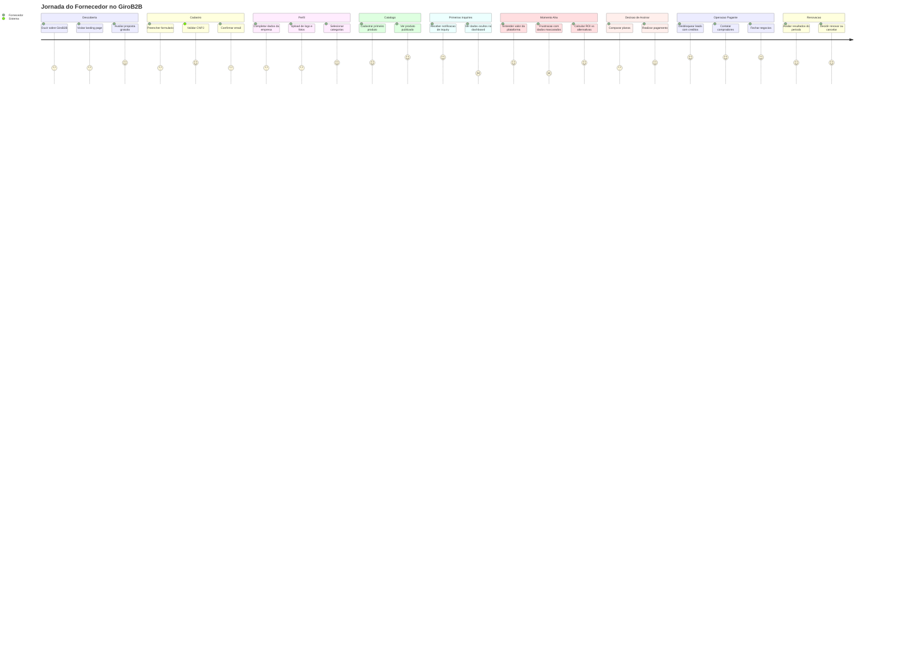

### 3.2 Visão de fluxo

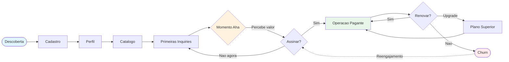

---

## 4. Etapas Detalhadas

### 4.1 DESCOBERTA

**Descrição:** O fornecedor toma conhecimento do GiroB2B pela primeira vez e decide se vale investigar mais. No MVP, o canal primário é o onboarding presencial (Márcio em campo). Em fases posteriores, canais digitais ganham relevância.

**Canais de entrada:**

| Canal | % estimado (MVP) | Descrição |
|-------|------------------|-----------|
| Márcio em campo | ~40% | Visitas presenciais em 25 de Março, Brás, Bom Retiro, polos industriais SP |
| Google orgânico | ~30% | Supplier encontra páginas SEO do GiroB2B ao pesquisar concorrentes/mercado |
| Indicação | ~20% | Fornecedor indicado por outro fornecedor ou comprador |
| LinkedIn / redes profissionais | ~10% | Conteúdo educativo, posts do GiroB2B |

**Ações na plataforma:**

| Ação | RF/RN | Fase |
|------|-------|------|
| Visualizar página "Como Funciona" para fornecedores | RF-14.01 | MVP |
| Visualizar página de planos e preços | RF-14.01 | MVP |
| Visualizar homepage com CTA de cadastro | RF-14.03 | MVP |

**Telas/páginas envolvidas:**

| Página | URL |
|--------|-----|
| Homepage | `/` |
| Como Funciona (Fornecedor) | `/como-funciona/fornecedor` |
| Planos e Preços | `/planos` |
| Cadastro | `/cadastro` |

**Decisões do fornecedor:**
- "Esta plataforma é relevante para meu segmento?"
- "É realmente gratuito para começar?"
- "Quanto tempo vou precisar investir?"
- "Meus concorrentes já estão aqui?"

**Emoções/expectativas:**
- **Curiosidade:** sobre o modelo e a proposta
- **Ceticismo:** "se é grátis, qual é a pegadinha?"
- **Comparação mental:** com feiras, Google Ads, e o custo atual de aquisição
- **Esperança cautelosa:** possibilidade de canal novo de clientes

**Fluxo interno:**

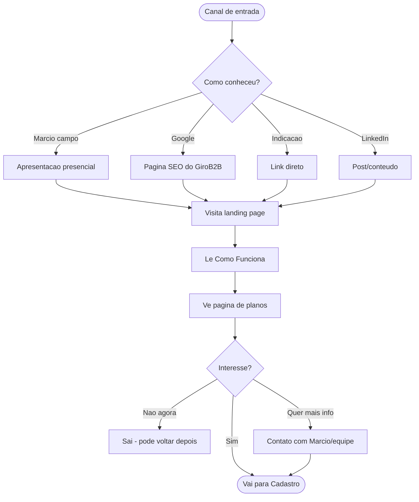

**Métricas:**

| Métrica | Alvo MVP | Descrição |
|---------|----------|-----------|
| Visitantes únicos /mês na landing | 500-1.000 | Tráfego na página do fornecedor |
| Taxa de conversão visita → cadastro | >15% | % que inicia o formulário |
| Tempo na página "Como Funciona" | >2 min | Engajamento com a proposta |
| Fornecedores cadastrados /mês | 150-300 | REFERENCIA §14 |

**Fase:** MVP

---

### 4.2 CADASTRO E UPGRADE PARA FORNECEDOR

**Descrição:** Com o cadastro unificado (RN-01.10), o processo tem duas etapas distintas. Primeiro, o futuro fornecedor cria uma conta genérica (Nível 1) com dados básicos — sem CNPJ, sem escolha de role. Depois, decide fazer upgrade para fornecedor (Nível 3) informando CNPJ com validação em tempo real. Após o upgrade, é direcionado ao wizard de perfil.

#### Passo 1: Cadastro genérico (Nível 1)

**Canais de entrada:**
- CTA "Cadastrar" na homepage/landing
- Link direto de Márcio (onboarding assistido)

**Ações na plataforma:**

| Ação | RF/RN | Fase |
|------|-------|------|
| Preencher formulário: email, senha, nome, telefone, cidade, estado | RF-01.01 | MVP |
| Envio de email de confirmação (welcome + link) | RF-01.05, RN-01.03 | MVP |
| Confirmação do email e ativação da conta | RF-01.05, RN-01.03 | MVP |
| Login por email+senha | RF-01.09 | MVP |
| Recuperação de senha | RF-01.10 | MVP |
| Login social Google | RF-01.11 | VAL |

**Telas/páginas envolvidas:**

| Página | URL |
|--------|-----|
| Formulário de cadastro (unificado) | `/cadastro` |
| Confirmação enviada | `/cadastro/confirmacao` |
| Email de confirmação | (email) |

**Decisões do fornecedor:**
- "Confirmo o email agora ou depois?" → Sem confirmação, não acessa funcionalidades (RN-01.03)

**Emoções/expectativas:**
- **Facilidade** — cadastro rápido, sem burocracia inicial
- **Satisfação** ao receber confirmação de conta gratuita
- **Curiosidade** sobre como listar seus produtos

#### Passo 2: Upgrade para fornecedor (Nível 3)

**Canais de entrada:**
- CTA "Quero vender" no painel do usuário
- Redirecionamento da página de planos/preços
- Link direto de Márcio (onboarding assistido)
- Redirecionamento pós-reivindicação de perfil [VAL]

**Ações na plataforma:**

| Ação | RF/RN | Fase |
|------|-------|------|
| Informar dados da empresa: razão social, CNPJ | RF-01.01 (upgrade) | MVP |
| Validação CNPJ em tempo real via ReceitaWS/BrasilAPI | RF-01.02, RN-01.01 | MVP |
| Rejeição de CNPJs inativos | RF-01.03, RN-01.01 | MVP |
| Verificação de CNPJ duplicado | RF-01.04, RN-01.02 | MVP |
| Criação de registro `suppliers` vinculado ao perfil | UC-31 | MVP |
| Reivindicação de perfil pré-cadastrado | RF-01.12, RN-01.08, RN-01.09 | VAL |

**Telas/páginas envolvidas:**

| Página | URL |
|--------|-----|
| Formulário de upgrade | `/upgrade/fornecedor` |
| Painel do fornecedor (pós-upgrade) | `/painel/fornecedor` |

**Decisões do fornecedor:**
- "Forneço meu CNPJ?" → Obrigatório para virar fornecedor, mas a validação instantânea gera confiança
- "Faço upgrade agora ou navego mais antes?" → Pode explorar a plataforma como Nível 1 antes de decidir

**Emoções/expectativas:**
- **Ansiedade** ao informar CNPJ (dado sensível)
- **Alívio** ao ver validação instantânea sem burocracia
- **Confiança** — já conhece a plataforma antes de fornecer dados empresariais
- **Urgência moderada** para começar a listar produtos

**Fluxo interno (ambos os passos):**

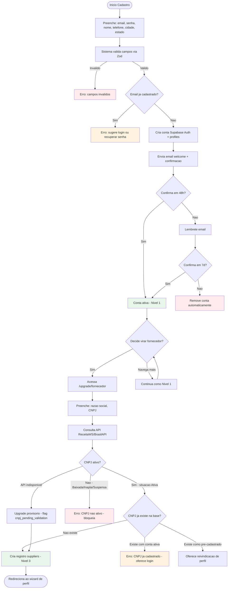

**Métricas:**

| Métrica | Alvo MVP | Descrição |
|---------|----------|-----------|
| Taxa de conclusão do cadastro (Nível 1) | >80% | Iniciou → completou (formulário simples) |
| Taxa de confirmação de email | >80% | Cadastrou → confirmou |
| Taxa de conversão Nível 1 → upgrade supplier | >30% | Usuários que se tornam fornecedores |
| Tempo médio cadastro + upgrade | <7 min | Do início ao upgrade completo |
| Taxa rejeição CNPJ | <5% | CNPJs inválidos/inativos |

**Fase:** MVP (Login social e reivindicação: VAL)

**Referências:** UC-01, UC-31, UC-17, US-001, US-002, US-033, US-034, SEQ-01, SEQ-17

---

### 4.3 CONFIGURAÇÃO DO PERFIL

**Descrição:** Após ativar a conta, o fornecedor completa seu perfil empresarial usando um wizard guiado. A barra de completude (RN-02.01) incentiva o preenchimento completo, que impacta diretamente o ranking de busca (15% do score em RN-03.01).

**Canais de entrada:**
- Redirecionamento automático pós-upgrade para fornecedor (wizard)
- Acesso direto via painel do fornecedor
- Resposta a nudges de completude (3d, 7d, 14d, 30d — RN-02.02)

**Ações na plataforma:**

| Ação | RF/RN | Fase |
|------|-------|------|
| Editar perfil: logo, descrição, endereço, horário, site, redes, ano fundação, funcionários | RF-02.01 | MVP |
| Selecionar até 5 categorias/setores da árvore hierárquica | RF-02.02 | MVP |
| Upload de fotos da empresa (até 10, 5MB cada) | RF-02.03 | MVP |
| Visualizar barra de completude com pesos | RF-02.04, RN-02.01 | MVP |
| Página pública do fornecedor gerada automaticamente | RF-02.05 | MVP |
| Adicionar vídeo institucional (YouTube/Vimeo) | RF-02.06 | MON |
| Subdomínio personalizado | RF-02.07 | ESC |

**Telas/páginas envolvidas:**

| Página | URL |
|--------|-----|
| Wizard de onboarding | `/painel/fornecedor/onboarding` |
| Edição de perfil | `/painel/fornecedor/perfil` |
| Página pública (resultado) | `/fornecedor/[slug]` |

**Decisões do fornecedor:**
- "Quanto tempo invisto agora vs depois?" → Wizard permite pular etapas
- "Quais categorias melhor descrevem meu negócio?" → Máximo 5 (RF-02.02)
- "Coloco fotos profissionais ou as que tenho?" → Qualquer foto é melhor que nenhuma (impacta completude)

**Emoções/expectativas:**
- **Motivação** ao ver a barra de progresso subir
- **Tédio** se o processo for longo (wizard otimiza)
- **Orgulho** ao ver a página pública da empresa gerada
- **Preocupação** com qualidade visual vs concorrentes

**Fluxo interno:**

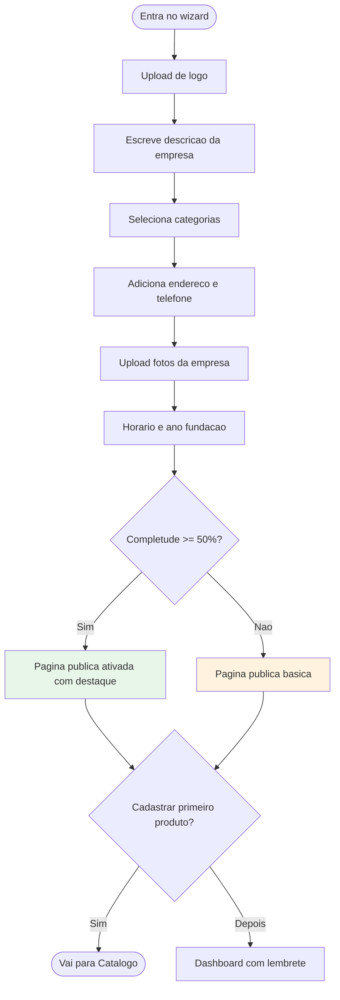

**Métricas:**

| Métrica | Alvo MVP | Descrição |
|---------|----------|-----------|
| % fornecedores com perfil ≥50% | >60% | REFERENCIA §14 (ativação) |
| % fornecedores com perfil ≥80% | >30% | Perfis altamente completos |
| Tempo médio para completar perfil | <30 min | Do wizard à ≥50% |
| Categorias médias por fornecedor | 2-3 | De 5 disponíveis |

**Fase:** MVP (Vídeo: MON, Subdomínio: ESC)

**Referências:** UC-02, US-003, US-010

---

### 4.4 CATÁLOGO

**Descrição:** O fornecedor cadastra seus produtos/serviços de forma ilimitada e gratuita. Cada produto gera automaticamente uma página otimizada para SEO, ampliando a visibilidade orgânica. A listagem ilimitada é decisão estratégica: mais produtos = mais páginas SEO = mais compradores atraídos = mais inquiries.

**Canais de entrada:**
- Continuação do wizard de onboarding
- Menu do painel do fornecedor
- Resposta a nudges de completude (3+ produtos = 20% da barra)

**Ações na plataforma:**

| Ação | RF/RN | Fase |
|------|-------|------|
| Cadastrar produto: nome, descrição (1K chars), categoria, subcategoria, fotos (5/produto, 5MB), unidade, qtd mínima, faixa de preço (opcional) | RF-03.01, RN-02.06 | MVP |
| Listagem ilimitada para todos (inclusive free) | RF-03.02, RN-02.03 | MVP |
| Editar, pausar, excluir produtos | RF-03.03, RN-02.05 | MVP |
| Categorização hierárquica obrigatória | RF-03.04, RN-02.04 | MVP |
| Geração automática de tags/keywords | RF-03.05, RN-02.07 | MVP |
| Página do produto gerada automaticamente | RF-03.06 | MVP |
| Importação em massa via CSV/XLSX | RF-03.07 | VAL |

**Telas/páginas envolvidas:**

| Página | URL |
|--------|-----|
| Gerenciamento de produtos | `/painel/fornecedor/produtos` |
| Cadastro de novo produto | `/painel/fornecedor/produtos/novo` |
| Edição de produto | `/painel/fornecedor/produtos/[id]/editar` |
| Página pública do produto (resultado) | `/produto/[slug]-[cidade]` |
| Importação em massa | `/painel/fornecedor/produtos/importar` |

**Decisões do fornecedor:**
- "Quantos produtos cadastro agora?" → Incentivo: 3+ produtos = 20% da completude
- "Coloco preço ou não?" → Opcional, exibido como faixa (RN-02.06)
- "Quais fotos usar?" → Fotos reais do produto aumentam confiança
- "Pauso ou excluo produtos descontinuados?" → Pausar mantém na completude (RN-02.05)

**Emoções/expectativas:**
- **Empoderamento** ao ver produtos publicados instantaneamente (RN-07.01: sem fila de aprovação)
- **Ansiedade** sobre qualidade vs concorrentes
- **Satisfação** ao ver página SEO gerada automaticamente
- **Impaciência** se tiver muitos produtos (importação CSV resolve em VAL)

**Fluxo interno:**

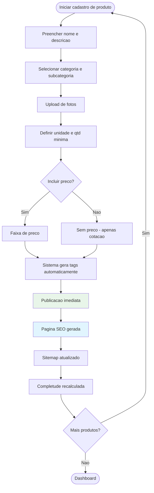

**Métricas:**

| Métrica | Alvo MVP | Descrição |
|---------|----------|-----------|
| Produtos médios por fornecedor | 5-10 | Catálogo inicial |
| % fornecedores com 3+ produtos | >50% | Threshold de completude (20%) |
| % produtos com foto | >70% | Fotos impactam conversão |
| Tempo médio para cadastrar 1 produto | <10 min | Eficiência do formulário |

**Fase:** MVP (Importação CSV: VAL)

**Referências:** UC-03, UC-04, UC-10 [VAL], US-004, US-005, US-006, US-011 [VAL]

---

### 4.5 PRIMEIRAS INQUIRIES

**Descrição:** O fornecedor recebe suas primeiras solicitações de cotação de compradores reais. Este é o momento em que a plataforma demonstra valor concreto. Porém, os dados de contato do comprador estão **mascarados** — o fornecedor vê a descrição da necessidade, quantidade, prazo e cidade do comprador, mas NÃO vê nome, email, telefone ou empresa. Isso é por design (RN-04.05).

**Canais de entrada:**
- Notificação por email: "Você recebeu uma nova solicitação de cotação" (RF-06.02, RN-09.01)
- Acesso direto ao dashboard
- [VAL] Resumo semanal de atividade por email

**Ações na plataforma:**

| Ação | RF/RN | Fase |
|------|-------|------|
| Receber notificação email de nova inquiry | RF-06.02, RN-09.01 | MVP |
| Visualizar lista de inquiries com filtros (status, data) | RF-09.02 | MVP |
| Ver detalhes da inquiry (dados mascarados para free) | RF-06.03, RF-06.04, RN-04.05 | MVP |
| Ver status das inquiries (nova/visualizada/respondida/arquivada) | RF-06.03, RN-04.08 | MVP |
| Dashboard overview: inquiries recebidas, produtos, views, completude | RF-09.01 | MVP |
| Denunciar inquiry como spam | RF-06.08, RN-07.04 | VAL |

**Telas/páginas envolvidas:**

| Página | URL |
|--------|-----|
| Dashboard principal | `/painel/fornecedor` |
| Lista de inquiries | `/painel/fornecedor/inquiries` |
| Detalhe da inquiry | `/painel/fornecedor/inquiries/[id]` |

**Decisões do fornecedor:**
- "Essa inquiry é relevante para meu negócio?" → Vê descrição, categoria, cidade
- "Por que não consigo ver quem é o comprador?" → CTA explica: "Assine para ver dados de contato"
- "Devo responder mesmo sem ver o contato?" → No MVP, não há como responder diretamente sem plano pago

**Emoções/expectativas:**
- **Excitação** ao receber primeira inquiry ("alguém quer meu produto!")
- **Validação** de que a plataforma gera demanda real
- **Frustração** ao perceber dados mascarados ("preciso pagar para ver quem é?")
- **Cálculo mental** do valor de cada lead vs custo do plano

**Fluxo interno:**

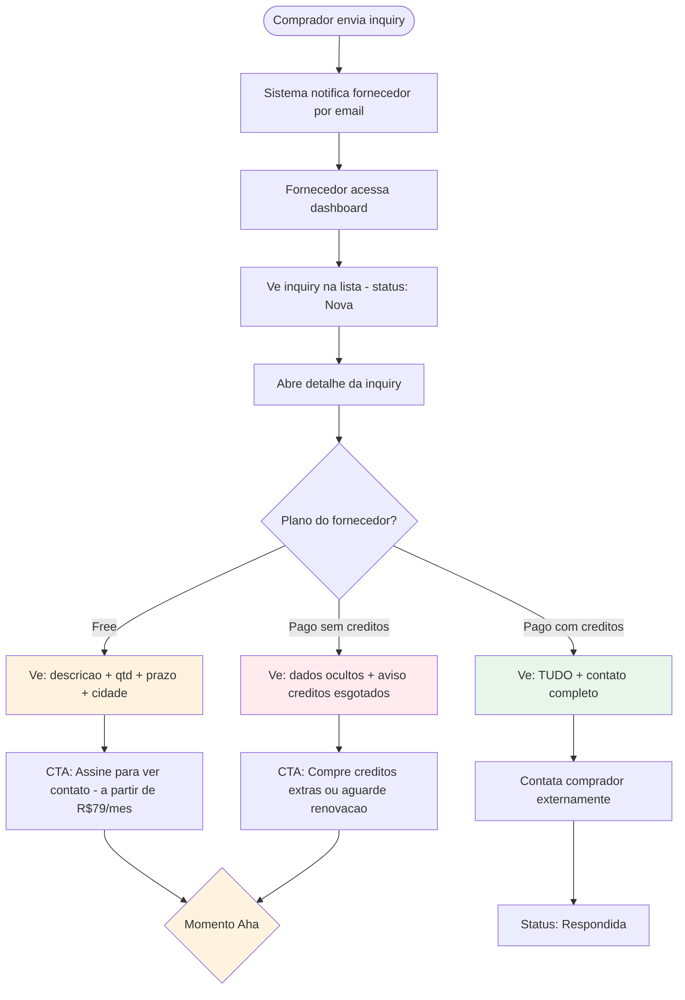

**Métricas:**

| Métrica | Alvo MVP | Descrição |
|---------|----------|-----------|
| Inquiries/fornecedor/mês | 1+ após 6 meses | Meta operacional interna (RN-08.03) |
| Taxa de visualização de inquiry | >80% | Fornecedores que abrem inquiries recebidas |
| Tempo inquiry → visualização | <24h | Agilidade do fornecedor |
| Taxa de clique no CTA de upgrade | >10% | Interesse em assinar |

**Fase:** MVP

**Referências:** UC-05, US-007, US-008, US-009

---

### 4.6 MOMENTO AHA

**Descrição:** O "Momento Aha" é o ponto psicológico em que o fornecedor conecta dois fatos: (1) a plataforma gera demanda real de compradores e (2) ele precisa assinar para acessar essa demanda por completo. É o principal gatilho de conversão free → pago. A seção 7 deste documento detalha extensivamente esta etapa.

**Canais de entrada:**
- Visualização de inquiry com dados mascarados (etapa anterior)
- Acumulação de múltiplas inquiries sem poder responder
- Resumo semanal mostrando "X inquiries não respondidas"
- Conversa com Márcio (follow-up pós-cadastro)

**Ações na plataforma:**

| Ação | RF/RN | Fase |
|------|-------|------|
| Ver dados mascarados em inquiry | RN-04.05 | MVP |
| Clicar no CTA "Assine para ver contato" | RF-14.01 | MVP |
| Visualizar página de comparativo de planos | RF-14.01 | MVP |

**Telas/páginas envolvidas:**

| Página | URL |
|--------|-----|
| Detalhe da inquiry (dados ocultos) | `/painel/fornecedor/inquiries/[id]` |
| Comparativo de planos | `/planos` |

**Decisões do fornecedor:**
- "O volume de inquiries justifica o investimento?"
- "Qual plano faz sentido para meu porte?"
- "R$79/mês por 5 leads é melhor que R$35-90/lead no Google Ads?"
- "Espero mais inquiries antes de decidir ou assino agora?"

**Emoções/expectativas:**
- **Frustração controlada:** vê demanda mas não acessa contato (by design)
- **Cálculo racional:** compara custo/benefício com alternativas
- **Urgência:** cada inquiry não respondida é oportunidade perdida
- **Confiança crescente:** volume de inquiries valida a plataforma

**Fluxo interno:**

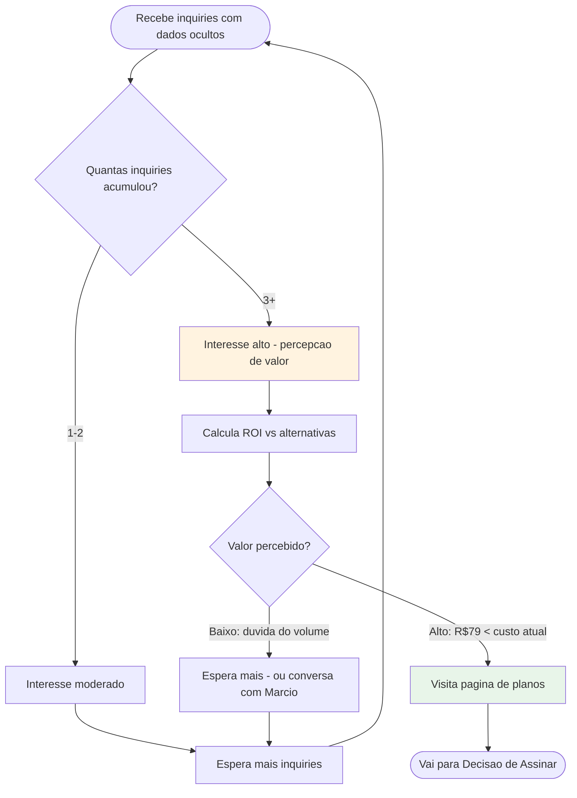

**Métricas:**

| Métrica | Alvo MVP | Descrição |
|---------|----------|-----------|
| Inquiries até primeiro clique no CTA | 2-3 | Threshold de interesse |
| Dias entre cadastro e primeiro CTA clique | <30 | Velocidade do momento aha |
| Conversão CTA → página de planos | >30% | Engajamento com monetização |

**Fase:** MVP (o momento aha existe mesmo sem planos pagos; CTAs são educativos)

**Nota MVP:** No MVP não existe gateway de pagamento. Os CTAs de upgrade são educativos — preparam o fornecedor para a fase de Monetização. A equipe pode manualmente desbloquear dados para fornecedores estratégicos (white-glove onboarding via Márcio).

---

### 4.7 DECISÃO DE ASSINAR

**Descrição:** O fornecedor, motivado pelo Momento Aha, avalia os planos disponíveis e decide assinar. Esta etapa só é ativa na fase de Monetização (quando o gateway de pagamento existe). A seção 7 deste documento detalha a lógica de conversão e comparativos.

**Canais de entrada:**
- CTA "Assine" no painel/inquiry
- Página de planos (acesso direto)
- Oferta de trial por email (RN-06.08, RN-06.09)
- Contato direto com Márcio/equipe

**Ações na plataforma:**

| Ação | RF/RN | Fase |
|------|-------|------|
| Visualizar comparativo de planos (Starter/Pro/Premium) | RF-08.01 | MON |
| Selecionar plano e ciclo (mensal/anual) | RF-08.02 | MON |
| Ativar trial 7 dias (sem cartão, se elegível) | RF-08.06, RN-06.08 | MON |
| Realizar checkout via gateway (cartão, boleto, PIX) | RF-08.03 | MON |
| Receber confirmação de ativação com créditos alocados | RF-08.04 | MON |

**Telas/páginas envolvidas:**

| Página | URL |
|--------|-----|
| Comparativo de planos | `/planos` |
| Checkout | `/planos/checkout` |
| Confirmação | `/planos/confirmacao` |
| Dashboard (pós-ativação) | `/painel/fornecedor` |

**Decisões do fornecedor:**
- "Starter (R$79/mês, 5 créditos) ou Pro (R$199/mês, 15 créditos)?"
- "Mensal ou anual (17% desconto)?"
- "Começo pelo trial de 7 dias?"
- "Cartão, boleto ou PIX?"

**Emoções/expectativas:**
- **Deliberação:** compara planos cuidadosamente
- **Ansiedade do investimento:** "vai dar retorno?"
- **Alívio** ao descobrir o trial sem cartão (RN-06.08)
- **Satisfação** ao ativar plano e ver créditos disponíveis

**Fluxo interno:**

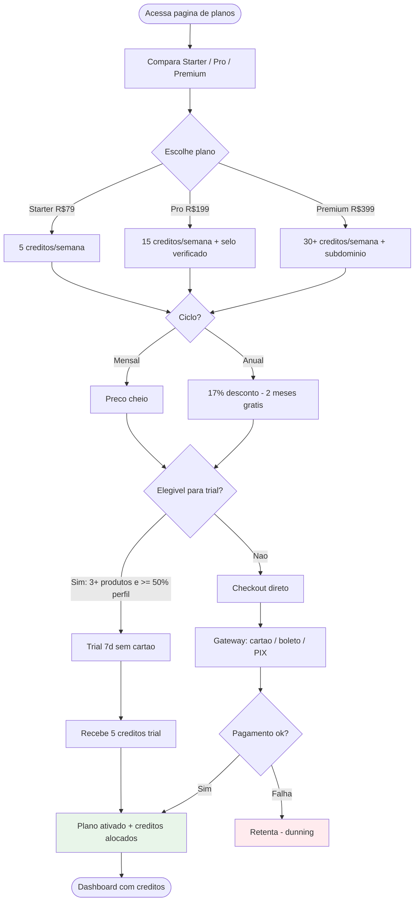

**Métricas:**

| Métrica | Alvo 12 meses | Descrição |
|---------|---------------|-----------|
| Conversão free → pago | 2-3% | IndiaMART benchmark: 2,6% |
| ARPU | R$150/mês | Mix Starter + Pro |
| % anual vs mensal | 30-40% | Adesão ao desconto anual |
| Conversão trial → pago | >40% | Eficácia do trial |

**Fase:** Monetização

**Referências:** UC-07, US-012, US-016, US-017

---

### 4.8 OPERAÇÃO COMO PAGANTE

**Descrição:** O fornecedor opera ativamente com plano pago: desbloqueia leads consumindo créditos, acessa dados completos dos compradores, registra follow-up no CRM e compra créditos extras quando esgota a cota semanal. Também recebe inquiries genéricas via sistema de distribuição em rodadas.

**Canais de entrada:**
- Dashboard diário do fornecedor
- Notificações de novas inquiries (email)
- [MON] Notificação de créditos esgotados
- [MON] Notificação de créditos renovados (domingo 00:01)

**Ações na plataforma:**

| Ação | RF/RN | Fase |
|------|-------|------|
| Desbloquear dados do comprador com 1 crédito (irreversível) | RF-07.02, RN-05.09 | MON |
| Visualizar créditos restantes, histórico de uso, data de renovação | RF-07.03 | MON |
| Comprar pacotes de créditos extras | RF-07.04, RN-05.10 | MON |
| Receber inquiries genéricas via distribuição em rodadas | RF-07.05, RF-07.06, RN-05.01-RN-05.06 | MON |
| CRM de leads: status, notas, histórico de interação | RF-09.05 | MON |
| Relatório mensal de performance | RF-09.06 | MON |
| Analytics: views, inquiries, produtos mais vistos | RF-09.04 | VAL |

**Telas/páginas envolvidas:**

| Página | URL |
|--------|-----|
| Dashboard principal (com créditos) | `/painel/fornecedor` |
| Detalhe inquiry (dados completos) | `/painel/fornecedor/inquiries/[id]` |
| Gestão de créditos | `/painel/fornecedor/creditos` |
| CRM de leads | `/painel/fornecedor/leads` |
| Comprar créditos extras | `/painel/fornecedor/creditos/comprar` |
| Relatório mensal | `/painel/fornecedor/relatorios` |

**Decisões do fornecedor:**
- "Desbloqueio este lead ou espero um melhor?" → Cada crédito conta (5/semana no Starter)
- "Meus créditos acabaram — compro extras ou espero renovação?" → Extras são mais caros/crédito (incentivo a upgrade)
- "Preciso de mais créditos — upgrade de plano?" → Starter→Pro: 3× mais créditos por 2,5× o preço
- "Esse lead genérico é relevante para mim?" → Distribuição filtra por categoria e proximidade

**Emoções/expectativas:**
- **Satisfação** ao desbloquear lead e ver contato completo
- **Produtividade** ao contatar compradores e fechar negócios
- **Escassez** quando créditos acabam antes do fim da semana
- **Avaliação** constante do ROI (leads desbloqueados vs negócios fechados)

**Fluxo interno:**

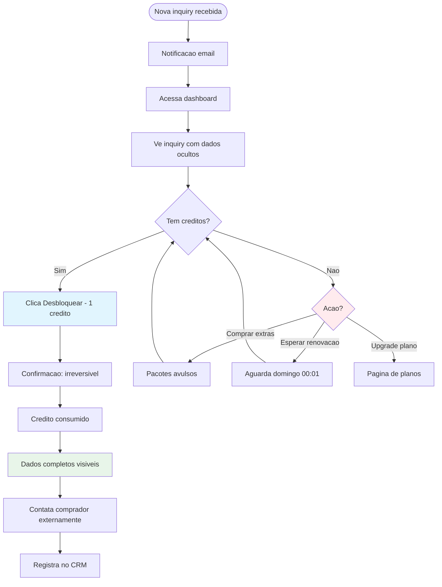

**Métricas:**

| Métrica | Alvo 12 meses | Descrição |
|---------|---------------|-----------|
| Créditos usados/semana (% do total) | >70% | Engajamento com leads |
| Taxa unlock → contato efetivo | >60% | Qualidade do lead |
| Compra de extras/mês (% pagantes) | 15-20% | Demanda por mais créditos |
| Churn mensal (pagantes) | <5% | Retenção |
| MRR | R$16K-60K | REFERENCIA §14 |

**Fase:** Monetização

**Referências:** UC-08, US-018, US-020

---

### 4.9 RENOVAÇÃO / CHURN

**Descrição:** O fornecedor pagante avalia periodicamente se o plano compensa o investimento. O ciclo de créditos semanais (renovação domingo 00:01, sem acúmulo) cria ritmo de uso. A plataforma implementa fluxos de retenção para reduzir churn e incentivar upgrades.

**Canais de entrada:**
- Renovação automática (cobrança recorrente)
- Email de lembrete 3 dias antes da renovação (RF-08.05)
- Email de falha de cobrança (dunning)
- Email de reengajamento pós-trial (RN-06.09)

**Ações na plataforma:**

| Ação | RF/RN | Fase |
|------|-------|------|
| Renovação automática mensal/anual | RN-06.01 | MON |
| Upgrade imediato com crédito pro-rata | RF-08.02, RN-06.03 | MON |
| Downgrade efetivo no próximo ciclo | RF-08.02, RN-06.04 | MON |
| Cancelamento (mantém benefícios até fim do ciclo) | RF-08.02, RN-06.05 | MON |
| Dunning: 3 tentativas de cobrança (dia 0, 3, 7) | RF-08.05, RN-06.06 | MON |
| Tolerância PIX/boleto 3 dias úteis | RN-06.07 | MON |
| Fluxo de retenção no cancelamento (ofertas, pausa) | RN-06.10 | MON |
| Garantia de satisfação 30 dias | RN-08.02 | MON |

**Telas/páginas envolvidas:**

| Página | URL |
|--------|-----|
| Gestão de assinatura | `/painel/fornecedor/plano` |
| Upgrade/Downgrade | `/painel/fornecedor/plano/alterar` |
| Cancelamento (com retenção) | `/painel/fornecedor/plano/cancelar` |

**Decisões do fornecedor:**
- "O volume de leads justifica a renovação?"
- "Devo fazer upgrade para mais créditos?"
- "Devo fazer downgrade se não estou usando todos os créditos?"
- "Cancelo ou pauso por 1 mês?" (pausa disponível via RN-06.10)

**Emoções/expectativas:**
- **Avaliação racional:** "quantos negócios fechei com os leads?"
- **Satisfação** se ROI positivo → renova
- **Frustração** se poucas inquiries → considera cancelar
- **Hesitação** ao ver oferta de retenção (desconto, pausa)

**Fluxo interno:**

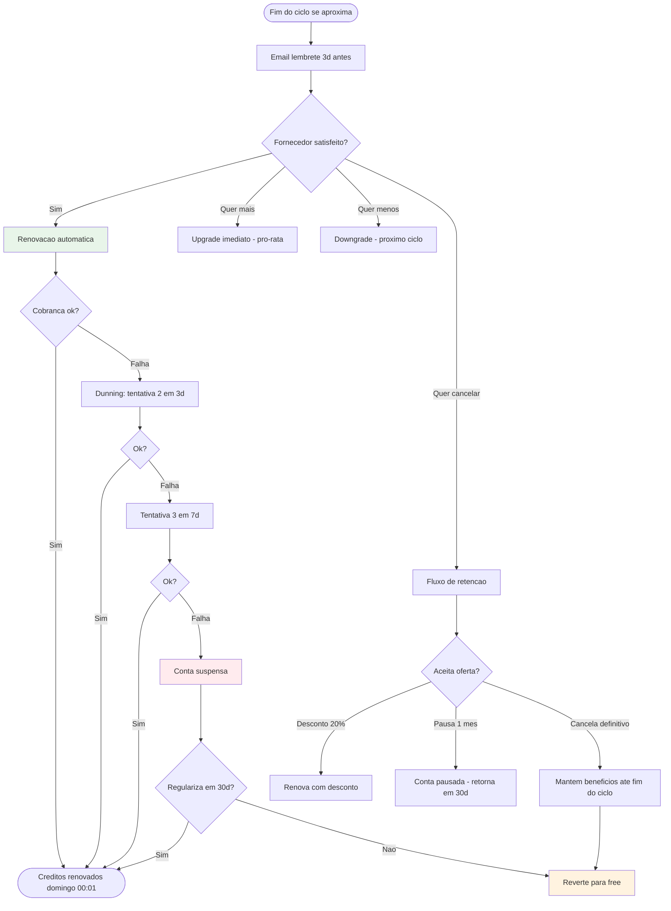

**Métricas:**

| Métrica | Alvo 12 meses | Descrição |
|---------|---------------|-----------|
| Churn mensal (pagantes) | <5% | REFERENCIA §14 |
| Taxa de upgrade | 10-15% | Starter→Pro ou Pro→Premium/mês |
| Taxa de retenção via oferta | >30% | Eficácia do fluxo de cancelamento |
| Falha de cobrança recuperada | >50% | Eficácia do dunning |
| Lifetime do fornecedor pagante | >6 meses | Retenção média |

**Fase:** Monetização

**Referências:** UC-09, US-019

---

## 5. Fluxos Críticos

### 5.1 Cadastro + Upgrade para Fornecedor

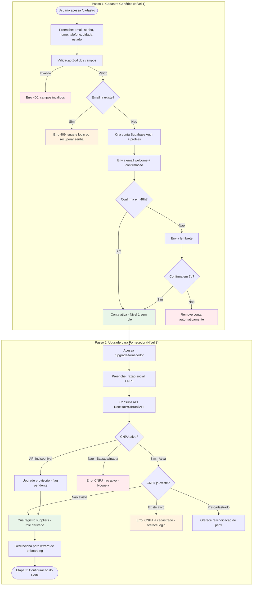

**Referências:** UC-01, UC-31, RF-01.01, RF-01.05, RN-01.01 a RN-01.03, RN-01.10, RN-01.13, US-001, US-002, SEQ-01, SEQ-17

---

### 5.2 Publicação de Produto

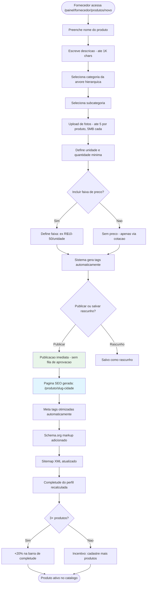

**Referências:** UC-03, UC-04, RF-03.01 a RF-03.06, RN-02.03 a RN-02.07, RN-07.01, US-004, US-005

---

### 5.3 Recebimento e Resposta a Inquiry

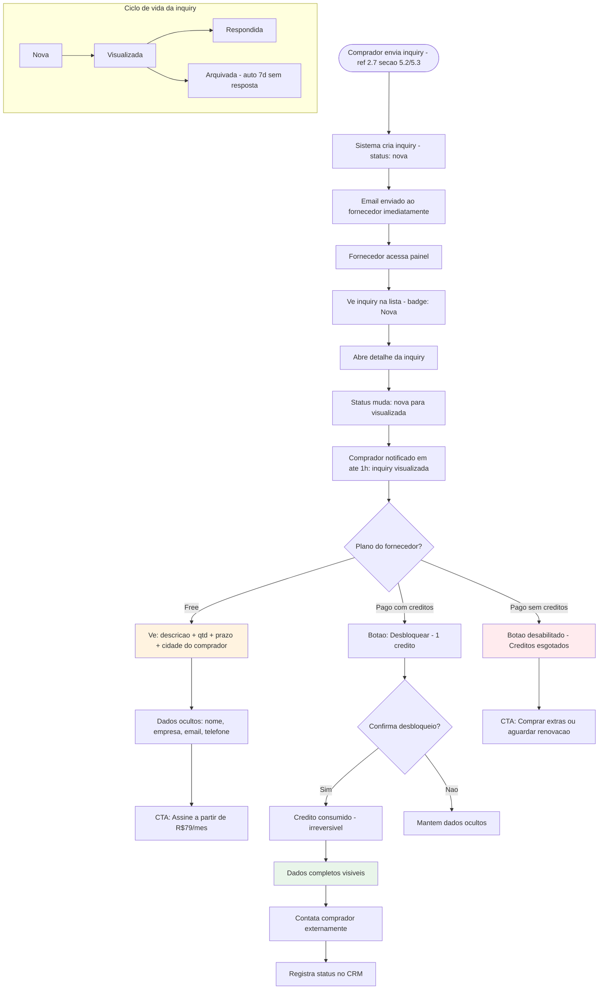

**Referências:** UC-05, RF-06.02 a RF-06.04, RN-04.05 a RN-04.08, RN-09.01, US-007, US-008

---

### 5.4 Decisão de Assinatura

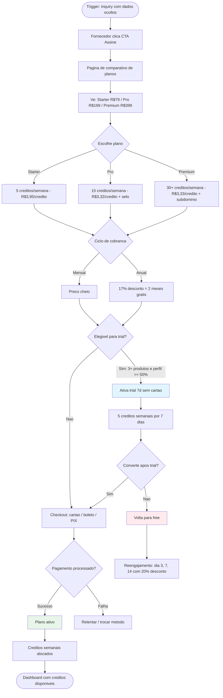

**Referências:** UC-07, RF-08.01 a RF-08.06, RN-06.01 a RN-06.10, US-012, US-016, US-017

---

### 5.5 Desbloqueio de Lead com Crédito

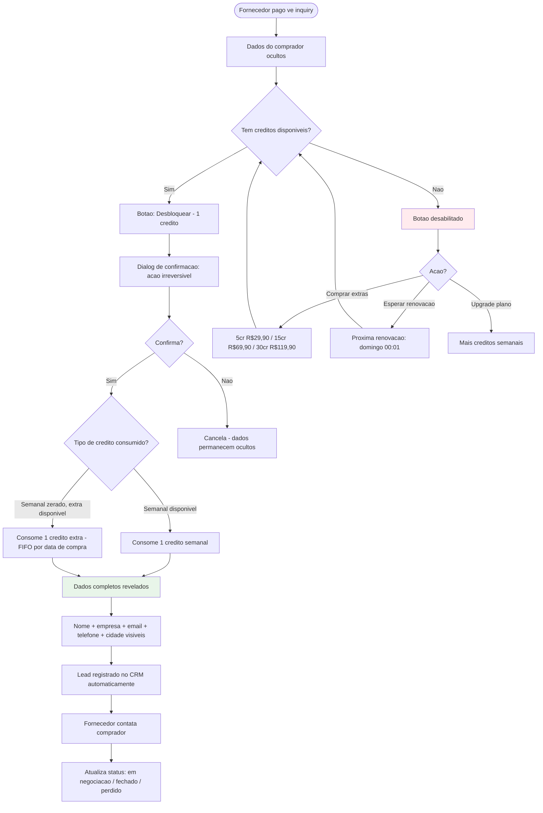

**Referências:** UC-08, RF-07.01 a RF-07.04, RN-05.09, RN-05.10, US-018, US-020

**Nota sobre consumo de créditos:** Créditos semanais são consumidos primeiro; quando zerados, créditos extras são consumidos por ordem de compra (FIFO). Créditos semanais expiram domingo 00:01 BRT sem acúmulo. Créditos extras têm validade de 90 dias.

---

### 5.6 Ciclo de Créditos e Renovação

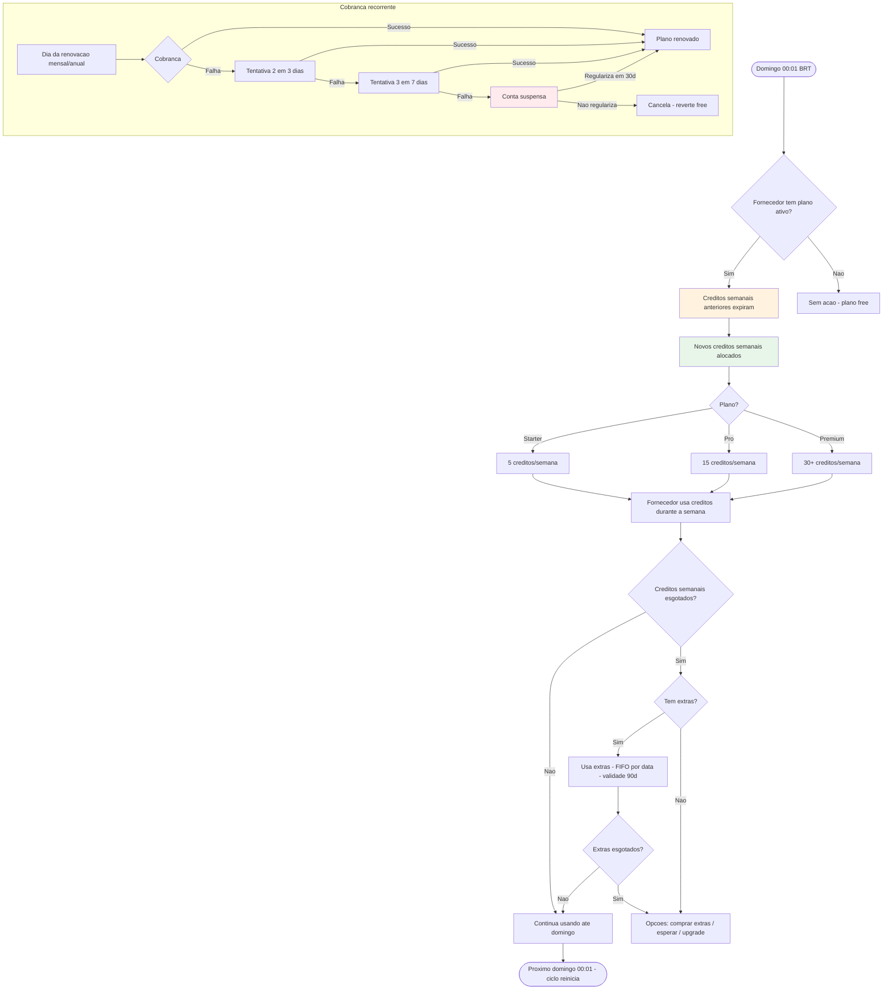

**Referências:** RF-07.01, RF-07.03, RF-08.05, RN-05.07, RN-05.08, RN-05.10, RN-06.01, RN-06.06, RN-06.07

---

## 6. Jornada por Fase do Produto

| Touchpoint | MVP | Validação | Monetização | Escala |
|------------|-----|-----------|-------------|--------|
| **Cadastro** | Email+senha, CNPJ, formulário simples | Login social Google, reivindicação de perfil | Trial 7d | Múltiplos usuários/conta |
| **Perfil** | Edição completa, barra completude, página pública | Analytics básicos | Vídeo institucional, selo L2 | Subdomínio personalizado |
| **Catálogo** | CRUD ilimitado, fotos, tags auto, páginas SEO | Importação CSV/XLSX | — | API de integração |
| **Inquiries** | Recebe inquiries direcionadas, dados mascarados para todos | Inquiry genérica, denúncia de inquiry | Desbloqueio com crédito, dados completos | WhatsApp Business API |
| **Dashboard** | Overview: inquiries, produtos, views, completude | Analytics detalhados (views/período) | CRM de leads, relatório mensal | Relatórios avançados, export |
| **Planos** | Sem planos pagos (todos free), CTAs educativos | — | Starter/Pro/Premium, checkout, dunning | Planos customizados enterprise |
| **Créditos** | — | — | Semanais + extras avulsos, gestão | Créditos ilimitados (enterprise) |
| **Verificação** | L1: CNPJ automático (revalidação 90d) | — | L2: CNPJ + endereço + documento | Verificação via API governamental |
| **Notificações** | Email: cadastro, inquiry, perfil incompleto | Resumo semanal, push PWA | Cobrança, créditos, renovação | WhatsApp, preferências granulares |

**Princípio MVP:** No MVP, todos os fornecedores operam no plano gratuito. Não existe gateway de pagamento. Todas as inquiries mostram dados mascarados. A equipe pode manualmente desbloquear dados para fornecedores estratégicos via white-glove onboarding (Márcio). Os CTAs de "Assine" são educativos, preparando o fornecedor para a fase de Monetização.

---

## 7. O "Momento Aha" e a Decisão de Pagar

Esta seção é **a mais importante do documento** porque documenta o mecanismo central de monetização do GiroB2B.

### 7.1 O momento

O "Momento Aha" ocorre quando o fornecedor recebe sua primeira inquiry de um comprador real. Nesse instante, três coisas acontecem simultaneamente:

1. **Validação:** "A plataforma realmente gera demanda para meu produto"
2. **Desejo:** "Quero contatar esse comprador e fechar negócio"
3. **Frustração:** "Não consigo ver quem é — dados estão ocultos"

A combinação de validação + desejo + frustração é o gatilho de conversão free → pago.

### 7.2 A frustração controlada

O mascaramento de dados (RN-04.05) é **intencional e estratégico**. O fornecedor free vê:

| Informação visível | Informação oculta |
|-------------------|-------------------|
| Descrição da necessidade | Nome do comprador |
| Quantidade desejada | Empresa do comprador |
| Prazo desejado | Email do comprador |
| Cidade do comprador | Telefone do comprador |

O fornecedor vê **o quê** o comprador precisa e **onde** ele está, mas não **quem** ele é. Isso é suficiente para avaliar a relevância do lead, mas insuficiente para agir. A mensagem exibida:

> *"Para ver os dados de contato deste comprador, assine um plano a partir de R$79/mês."*

### 7.3 Cálculo de valor percebido

O fornecedor faz mentalmente (ou com ajuda da página de planos) a comparação:

| Canal | Custo por lead | Observação |
|-------|---------------|------------|
| **GiroB2B Starter** | **~R$3,95** | 5 leads/semana por R$79/mês |
| **GiroB2B Pro** | **~R$3,32** | 15 leads/semana por R$199/mês |
| **GiroB2B Premium** | **~R$3,33** | 30+ leads/semana por R$399/mês |
| Google Ads (B2B Brasil) | R$35-90 | CPC R$2-15, conversão 1,8-3,5% |
| LinkedIn Ads | R$55-110 | CPL médio US$110 B2B |
| Feira presencial (stand 9m²) | R$200-500+ | R$10K-25K para 50-100 leads |
| Equipe outbound | R$80-250 | Salário + overhead por lead |

**O GiroB2B é 9× a 75× mais barato que qualquer canal alternativo.**

### 7.4 ROI break-even por plano

| Plano | Custo mensal | Break-even | Exemplo de ROI |
|-------|-------------|------------|----------------|
| Starter | R$79 | 1 pedido de R$79+ no mês | Embalagens: pedido R$500 = ROI 6,3× |
| Pro | R$199 | 1 pedido de R$199+ no mês | Autopeças: pedido R$2.000 = ROI 10× |
| Premium | R$399 | 1 pedido de R$399+ no mês | Materiais construção: pedido R$5.000 = ROI 12,5× |

**No B2B, o ticket médio tipicamente excede R$500. Um negócio por mês cobre confortavelmente o plano mais caro.**

### 7.5 Comparativo de planos

| Característica | Starter | Pro | Premium |
|---------------|---------|-----|---------|
| **Preço mensal** | R$79 | R$199 | R$399 |
| **Preço anual** | R$790 (R$65,83/mês) | R$1.990 (R$165,83/mês) | R$3.990 (R$332,50/mês) |
| **Créditos/semana** | 5 | 15 | 30+ bônus |
| **Custo/crédito** | ~R$3,95 | ~R$3,32 | ~R$3,33 |
| **Selo verificado L2** | — | Sim | Sim |
| **CRM de leads** | — | Sim | Sim |
| **Relatório mensal** | — | Sim | Sim |
| **Subdomínio** | — | — | Sim |
| **Suporte dedicado** | — | — | Sim |
| **Prioridade busca** | Baixa (40pts) | Média (70pts) | Máxima (100pts) |

### 7.6 Gatilhos de upgrade entre planos

| Transição | Trigger | Incentivo |
|-----------|---------|-----------|
| Free → Starter | Recebe inquiries mas não vê contato | "Assine para ver quem quer comprar de você" |
| Starter → Pro | Créditos acabam antes do fim da semana | Custo/crédito cai 16% (R$3,95→R$3,32) + selo verificado |
| Pro → Premium | Quer dominar categoria na sua região | Máxima prioridade busca + subdomínio + suporte dedicado |

### 7.7 Papel do onboarding white-glove (Márcio)

Nos primeiros meses (MVP e início de Validação), Márcio opera como **acelerador do Momento Aha**:

1. **Pré-cadastro:** visita presencial, explica a plataforma, ajuda no cadastro
2. **Follow-up 7d:** verifica se completou perfil e listou produtos
3. **Follow-up 30d:** verifica se recebeu inquiries, explica o modelo de monetização
4. **Conversão assistida:** quando o fornecedor demonstra interesse em assinar, Márcio acompanha o processo

No MVP (sem gateway), Márcio pode **manualmente desbloquear dados** para fornecedores estratégicos, simulando a experiência do plano pago e validando o modelo antes do lançamento da monetização.

### 7.8 Funil AARRR do fornecedor

| Métrica AARRR | Descrição | Alvo MVP | Alvo 12 meses |
|---------------|-----------|----------|---------------|
| **Acquisition** | Fornecedores cadastrados/mês | 150-300 | 800-1.000 |
| **Activation** | % com perfil ≥50% completo | >60% | >70% |
| **Retention** | Retenção 30 dias (login) | >50% | >65% |
| **Revenue** | Conversão free → pago | 1-2% | 2-3% |
| **Referral** | Cadastros via indicação | >5% | >15% |

**Fonte:** REFERENCIA §14

---

## 8. Completude do Perfil como Gamificação

### 8.1 Fórmula de completude (RN-02.01)

| Componente | Peso | Critério | Impacto visual |
|------------|------|----------|----------------|
| Logo da empresa | 10% | Upload de imagem | Profissionalismo |
| Descrição (≥100 chars) | 15% | Texto descritivo | Credibilidade |
| Endereço completo | 10% | Cidade + estado (rua opcional) | Empresa real |
| Telefone | 10% | Número comercial | Acessibilidade |
| Categorias (1+) | 10% | Seleção na árvore | Relevância em buscas |
| Produtos (3+) | 20% | Cadastro de ≥3 produtos | Catálogo real |
| Foto de produto (1+) | 15% | Upload em ≥1 produto | Credibilidade visual |
| Horário de funcionamento | 5% | Preenchimento | Nível de detalhe |
| Ano de fundação | 5% | Preenchimento | Experiência |
| **Total** | **100%** | | |

### 8.2 Impacto no ranking de busca (RN-03.01)

A completude do perfil representa **15%** do score de relevância na busca:

| Fator | Peso | Descrição |
|-------|------|-----------|
| Relevância textual | 35% | Match entre busca e produto/descrição |
| Nível do plano | 25% | Premium 100pts, Pro 70pts, Starter 40pts, Free 10pts |
| **Completude do perfil** | **15%** | **Score de 0-100% da fórmula acima** |
| Proximidade geográfica | 15% | Distância do comprador |
| Frescor do cadastro | 10% | Quão recentemente listou/atualizou |

### 8.3 Impacto no ranking de distribuição (RN-05.04)

A completude também afeta a seleção para inquiries genéricas, representando **15%** do score de distribuição (REFERENCIA §16):

| Fator | Peso | Descrição |
|-------|------|-----------|
| Relevância de categoria | 40% | Match com a necessidade do comprador |
| Proximidade geográfica | 25% | Distância do comprador |
| Tempo de resposta histórico | 20% | Média de tempo para responder inquiries |
| **Completude do perfil** | **15%** | **Score de 0-100%** |

> **Nota:** Fator "Saturação semanal" removido do algoritmo de distribuição (pendência futura [Escala]). Ver REFERENCIA §16 e §17.

**Nota:** Os rankings de busca (RN-03.01) e distribuição (RN-05.04) são **dois algoritmos independentes** com pesos diferentes.

### 8.4 Sequência recomendada de preenchimento

Ordenada por impacto na completude (maior para menor):

| Prioridade | Item | Peso | Razão |
|------------|------|------|-------|
| 1 | Cadastrar 3+ produtos | 20% | Maior peso individual; gera páginas SEO |
| 2 | Foto em pelo menos 1 produto | 15% | Alto impacto visual para compradores |
| 3 | Descrição ≥100 caracteres | 15% | Credibilidade e SEO |
| 4 | Logo | 10% | Profissionalismo imediato |
| 5 | Endereço | 10% | Sinal de empresa real |
| 6 | Telefone | 10% | Contato alternativo |
| 7 | Categorias | 10% | Aparece nas buscas certas |
| 8 | Horário de funcionamento | 5% | Detalhe complementar |
| 9 | Ano de fundação | 5% | Experiência |

**Seguindo esta ordem, o fornecedor atinge 80% de completude em apenas 5 ações.**

### 8.5 Nudges e lembretes (RN-02.02, RN-09.01)

| Quando | Tipo | Mensagem-chave | Condição |
|--------|------|---------------|----------|
| Dia 3 | Email | "Seu perfil está em X% — complete para aparecer mais nas buscas" | Completude <50% |
| Dia 7 | Email | "Fornecedores com perfil completo recebem 3× mais inquiries" | Completude <50% |
| Dia 14 | Email | "Você tem X produtos. Adicione mais para ampliar sua visibilidade" | <3 produtos |
| Dia 30+ | Email mensal | "Resumo do mês: X views, X inquiries. Complete seu perfil para melhorar" | Completude <80% |

---

## 9. Touchpoints com o Comprador

### 9.1 Assimetria de informação (espelho do 2.7 §8)

A tabela abaixo mostra o que o **fornecedor vê** em cada situação — espelho da perspectiva documentada no artefato 2.7, agora do ponto de vista do fornecedor:

| Informação | Fornecedor Free | Fornecedor Pago (com créditos) | Fornecedor Pago (sem créditos) |
|------------|----------------|-------------------------------|-------------------------------|
| **Descrição da necessidade** | Sim | Sim | Sim |
| **Quantidade desejada** | Sim | Sim | Sim |
| **Prazo desejado** | Sim | Sim | Sim |
| **Cidade do comprador** | Sim | Sim | Sim |
| **Nome do comprador** | Oculto | Visível (1 crédito) | Oculto |
| **Empresa do comprador** | Oculto | Visível (1 crédito) | Oculto |
| **Email do comprador** | Oculto | Visível (1 crédito) | Oculto |
| **Telefone do comprador** | Oculto | Visível (1 crédito) | Oculto |
| **Mensagem ao fornecedor** | — | "Assine para ver contato" | "Créditos esgotados. Compre extras ou aguarde renovação em [data]" |

**Princípio:** O comprador **não sabe** que seus dados são mascarados. Ele envia a inquiry e recebe confirmação normalmente. A mecânica de mascaramento/créditos é invisível para o comprador (2.7 §8.1). Se o comprador soubesse que seu contato está "trancado", poderia perder confiança na plataforma.

### 9.2 Impacto da resposta rápida

O tempo de resposta histórico do fornecedor afeta diretamente sua posição no ranking de distribuição de inquiries genéricas:

| Tempo de resposta | Impacto |
|-------------------|---------|
| <1h | Máximo score (20% do RN-05.04) |
| 1-4h | Score alto |
| 4-24h | Score médio |
| >24h | Score baixo |
| Sem resposta | Score mínimo + penalidade |

**Incentivo:** Fornecedores que respondem rapidamente recebem mais inquiries genéricas no futuro. O sistema premia agilidade.

### 9.3 Inquiry direcionada vs genérica (perspectiva do fornecedor)

| Aspecto | Inquiry Direcionada (MVP) | Inquiry Genérica (VAL/MON) |
|---------|--------------------------|----------------------------|
| **Origem** | Comprador escolheu este fornecedor específico | Comprador descreveu necessidade genérica |
| **Exclusividade** | Apenas este fornecedor recebe | Até 5 fornecedores recebem (RN-05.01) |
| **Distribuição** | Imediata | Em rodadas: Premium h0, Pro h4, Starter h8 (RN-05.02) |
| **Desbloqueio** | 1 crédito para ver contato | 1 crédito para ver contato |
| **Competição** | Nenhuma (exclusivo) | Concorre com até 4 outros fornecedores |
| **Relevância** | Alta (comprador escolheu deliberadamente) | Filtrada por categoria + proximidade |
| **Valor percebido** | Maior (lead exclusivo) | Menor (lead compartilhado) |

### 9.4 Distribuição em rodadas (RN-05.02)

Para inquiries genéricas, o sistema distribui em 3 rodadas com intervalo de 4h (provisório — sujeito a ajuste pós-lançamento):

| Rodada | Hora | Planos elegíveis | Vantagem |
|--------|------|-------------------|----------|
| 1 | h0 | Premium | Acesso exclusivo inicial |
| 2 | h+4 | Premium + Pro | Mais competição |
| 3 | h+8 | Premium + Pro + Starter | Todos podem participar |

Dentro de cada rodada, a seleção dos fornecedores segue o ranking de distribuição (RN-05.04): categoria 40%, proximidade 25%, tempo de resposta 20%, completude 15%.

### 9.5 Ações do comprador que afetam o fornecedor

| Ação do comprador | Efeito no fornecedor | Referência |
|-------------------|---------------------|------------|
| Envia inquiry direcionada | Recebe notificação imediata | RF-06.01, RF-06.02 |
| Envia inquiry genérica | Pode receber via distribuição (se elegível) | RF-06.06, RN-05.01 |
| Visualiza perfil/produto | Incrementa contador de views no dashboard | RF-09.01 |
| Denuncia fornecedor | Entra em fila de moderação admin | RF-11.04, RN-07.05 |
| Favoritou fornecedor [VAL] | Fornecedor não é notificado (dado interno) | RF-04.07 |

---

## 10. Ciclo de Vida da Assinatura

### 10.1 Diagrama de estados

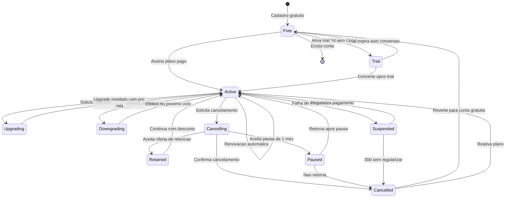

### 10.2 Ciclo de cobrança

| Aspecto | Detalhe | Referência |
|---------|---------|------------|
| Início | Data da confirmação do pagamento | RN-06.01 |
| Ciclo mensal | 30 dias a partir do início | RN-06.01 |
| Ciclo anual | 365 dias a partir do início | RN-06.01 |
| Desconto anual | 17% (~2 meses grátis) | RN-06.02 |
| Gateways | Stripe, Mercado Pago, PagSeguro | RF-08.03 |
| Métodos | Cartão de crédito, boleto, PIX | RF-08.03 |
| Tolerância PIX/boleto | 3 dias úteis para compensação | RN-06.07 |

### 10.3 Upgrade e downgrade

| Operação | Quando efetiva | Créditos | Referência |
|----------|----------------|----------|------------|
| **Upgrade** | Imediato | Crédito pro-rata do plano atual aplicado como desconto no novo | RN-06.03 |
| **Downgrade** | Próximo ciclo de cobrança | Mantém benefícios do plano atual até o fim do ciclo | RN-06.04 |

### 10.4 Dunning (falha de cobrança)

| Etapa | Quando | Ação | Referência |
|-------|--------|------|------------|
| Tentativa 1 | Dia da renovação | Cobrança automática | RN-06.06 |
| Aviso 1 | Imediato após falha | Email: "Falha na cobrança, atualize seu método" | RF-08.05 |
| Tentativa 2 | 3 dias após falha | Nova tentativa automática | RN-06.06 |
| Tentativa 3 | 7 dias após falha | Última tentativa | RN-06.06 |
| Suspensão | 10 dias após falha | Conta suspensa, créditos bloqueados | RN-06.06 |
| Cancelamento | 30 dias após falha | Reverte para free se não regularizar | — |

### 10.5 Trial (RN-06.08)

| Aspecto | Detalhe |
|---------|---------|
| Duração | 7 dias |
| Cartão necessário | Não |
| Elegibilidade | Novos fornecedores com 3+ produtos E ≥50% perfil |
| Créditos | 5 créditos semanais (equivalente Starter) |
| Conversão | Ao final, oferece assinatura Starter |
| Não converte | Volta para free; reengajamento dia 3, 7, 14 com 20% desconto (RN-06.09) |

### 10.6 Fluxo de retenção no cancelamento (RN-06.10)

Quando o fornecedor clica "Cancelar" (antes da confirmação final):

1. **Survey:** "Por que está cancelando?" (opções: custo, poucas inquiries, mudou de ramo, outro)
2. **Oferta de desconto:** 20% no próximo ciclo
3. **Oferta de pausa:** suspender conta por 1 mês sem cobrança
4. **Resumo de benefícios:** mostra o que vai perder (créditos, selo, prioridade)
5. **Confirmação final:** se insistir, cancela efetivo no fim do ciclo pago (RN-06.05)

### 10.7 Garantia de satisfação (RN-08.02)

- **30 dias:** se o fornecedor não receber nenhuma inquiry relevante nos primeiros 30 dias de assinatura, pode solicitar reembolso
- **Ações de mitigação:** distribuição manual de leads para fornecedores estratégicos, educação sobre otimização de perfil, análise de gaps de categoria (RN-08.02)
- **Meta operacional interna:** fornecedor pagante deve receber em média ≥1 inquiry relevante/semana após 6 meses na categoria principal (RN-08.03) — não comunicada ao fornecedor

### 10.8 Créditos: semanais vs extras

| Aspecto | Créditos semanais | Créditos extras |
|---------|-------------------|-----------------|
| Alocação | Domingo 00:01 BRT (RN-05.07) | Imediato após compra |
| Quantidade | Starter 5, Pro 15, Premium 30+ (RN-05.08) | Pacotes: 5, 15, 30 (RN-05.10) |
| Preço | Incluído no plano | 5 cr R$29,90 / 15 cr R$69,90 / 30 cr R$119,90 |
| Custo/crédito | R$3,32-3,95 | R$4,00-5,98 (intencionalmente mais caro) |
| Validade | Expira domingo 00:01 (não acumula) | 90 dias da data de compra |
| Prioridade consumo | Consumido primeiro | Consumido após zerado o semanal (FIFO) |
| Estratégia | Incentiva uso semanal | Incentiva upgrade de plano (extras são mais caros) |

---

## 11. Matriz de Rastreabilidade

### 11.1 Etapas × Casos de Uso

| Etapa | UC-01 | UC-02 | UC-03 | UC-04 | UC-05 | UC-06 | UC-07 | UC-08 | UC-09 | UC-10 | UC-17 |
|-------|-------|-------|-------|-------|-------|-------|-------|-------|-------|-------|-------|
| 1. Descoberta | | | | | | | | | | | |
| 2. Cadastro | **P** | | | | | | | | | | **S** |
| 3. Perfil | | **P** | | | | | | | | | |
| 4. Catálogo | | | **P** | **P** | | | | | | **S** | |
| 5. Primeiras Inquiries | | | | | **P** | **S** | | | | | |
| 6. Momento Aha | | | | | **S** | | | | | | |
| 7. Decisão de Assinar | | | | | | | **P** | | | | |
| 8. Operação Pagante | | | | | **S** | | | **P** | **S** | | |
| 9. Renovação/Churn | | | | | | | | | **P** | | |

**P** = Primário (UC é o foco principal da etapa) | **S** = Secundário (UC é acionado como suporte)

### 11.2 Etapas × Requisitos Funcionais

| Etapa | RFs envolvidos |
|-------|---------------|
| 1. Descoberta | RF-14.01, RF-14.03 |
| 2. Cadastro | RF-01.01, RF-01.02, RF-01.03, RF-01.04, RF-01.05, RF-01.09, RF-01.10, RF-01.11 [VAL], RF-01.12 [VAL] |
| 3. Perfil | RF-02.01, RF-02.02, RF-02.03, RF-02.04, RF-02.05, RF-02.06 [MON], RF-02.07 [ESC] |
| 4. Catálogo | RF-03.01, RF-03.02, RF-03.03, RF-03.04, RF-03.05, RF-03.06, RF-03.07 [VAL], RF-05.01-RF-05.09 |
| 5. Primeiras Inquiries | RF-06.02, RF-06.03, RF-06.04, RF-06.08 [VAL], RF-09.01, RF-09.02 |
| 6. Momento Aha | RF-06.04, RF-14.01 |
| 7. Decisão de Assinar | RF-08.01, RF-08.02, RF-08.03, RF-08.04, RF-08.05, RF-08.06 |
| 8. Operação Pagante | RF-07.01, RF-07.02, RF-07.03, RF-07.04, RF-07.05, RF-07.06, RF-09.04 [VAL], RF-09.05, RF-09.06 |
| 9. Renovação/Churn | RF-08.02, RF-08.05 |

### 11.3 Etapas × Regras de Negócio

| Etapa | RNs envolvidas |
|-------|---------------|
| 1. Descoberta | — |
| 2. Cadastro | RN-01.01, RN-01.02, RN-01.03, RN-01.04, RN-01.07, RN-01.08 [VAL], RN-01.09 [VAL] |
| 3. Perfil | RN-02.01, RN-02.02, RN-03.01 (completude 15%), RN-09.01 |
| 4. Catálogo | RN-02.03, RN-02.04, RN-02.05, RN-02.06, RN-02.07, RN-07.01 |
| 5. Primeiras Inquiries | RN-04.05, RN-04.08, RN-09.01 |
| 6. Momento Aha | RN-04.05 (mascaramento como gatilho) |
| 7. Decisão de Assinar | RN-06.01, RN-06.02, RN-06.08, RN-06.09 |
| 8. Operação Pagante | RN-05.01-RN-05.10, RN-08.01, RN-08.02, RN-08.03, RN-10.03 |
| 9. Renovação/Churn | RN-06.03, RN-06.04, RN-06.05, RN-06.06, RN-06.07, RN-06.10, RN-08.02 |

### 11.4 Etapas × User Stories

| Etapa | USs envolvidas |
|-------|---------------|
| 1. Descoberta | — |
| 2. Cadastro | US-001, US-002, US-033, US-034, US-035 [VAL] |
| 3. Perfil | US-003, US-010 |
| 4. Catálogo | US-004, US-005, US-006, US-011 [VAL] |
| 5. Primeiras Inquiries | US-007, US-008, US-009 |
| 6. Momento Aha | US-007 (visualização gera o momento) |
| 7. Decisão de Assinar | US-012, US-016, US-017 |
| 8. Operação Pagante | US-018, US-020 |
| 9. Renovação/Churn | US-019 |

---

## 12. Pendências e Observações

### 12.1 Decisões pendentes que afetam a jornada

| # | Pendência | Impacto na jornada | Status | Ref. |
|---|-----------|-------------------|--------|------|
| 1 | Subsetores industriais (Márcio) | Afeta categorias disponíveis nas etapas 3-4 | ⏳ Aguardando | §17.1 |
| 2 | Intervalo entre rodadas de distribuição (4h provisório) | Tempo de espera do fornecedor por inquiries genéricas na etapa 8 | ⏳ Dados reais definem | §17.2 |
| 3 | Verificação Nível 2: processo operacional, custo, APIs | Selo verificado na etapa 3 (MON) | ⏳ Definir | §17.3 |
| 4 | Stack backend: Node.js ou Python/FastAPI | Implementação técnica | ⏳ Vitor decide | §17.4 |
| 5 | LGPD: texto do consentimento (revisão advogado) | Consentimento no cadastro (etapa 2) | ⏳ Advogado | §17.6 |
| 6 | Pesos de ranking para A/B testing pós-lançamento | Posição do fornecedor nos resultados (todas as etapas) | ⏳ Dados reais | §17.7 |
| 7 | Validação elasticidade de preço dos extras | Preço dos pacotes avulsos (etapa 8) | ⏳ Pós-lançamento | §17.10 |

### 12.2 Decisões já tomadas (NÃO são pendências)

| Decisão | Valor | Referência |
|---------|-------|------------|
| Threshold de denúncias | 3 = advertência, 5 = suspensão, configurável via `system_configs` | RN-07.05, 2.7 §10 |
| Créditos semanais | Expiram domingo 00:01 BRT, não acumulam | RN-05.07 |
| Créditos extras | Validade 90 dias | RN-05.10 |
| Plano gratuito | Ausência de registro na tabela `plans` (DM-01 do ERD) | 2.5 ERD |
| SLA de leads | Planos NÃO garantem volume mínimo, apenas créditos | RN-08.01 |

### 12.3 Pontos para A/B testing pós-lançamento

| # | Teste | Hipótese |
|---|-------|----------|
| 1 | Texto do CTA de upgrade (painel) | "Assine para ver contato" vs "Desbloqueie este lead" |
| 2 | Timing dos nudges de completude | 3/7/14d vs 1/5/10d |
| 3 | Layout da página de comparativo de planos | Side-by-side vs tabela vs cards |
| 4 | Momento da oferta de trial | Após 1ª inquiry vs após 3ª inquiry |
| 5 | Preço dos créditos extras | Testar elasticidade de demanda |
| 6 | Intervalo entre rodadas de distribuição | 4h vs 2h vs 6h |

### 12.4 Inconsistências conhecidas

**✅ Todas resolvidas (2026-04-04):**

| Inconsistência | Status |
|---------------|--------|
| Pesos de ranking de busca (UC-11, UC-27, US-021, US-052) | ✅ Alinhados com RN-03.01 (35/25/15/15/10) |
| Pesos de distribuição (RN-05.04 em 1.6, 2.7, 2.8) | ✅ Alinhados com REFERENCIA §16 (40/25/20/15). Fator "Saturação" removido (pendência futura §17 #11) |
| Completude perfil (RN-02.01) | ✅ REFERENCIA §16 é autoritativa (inclui 3+ produtos 20% e foto produto 15%) |

**Fonte autoritativa para todos os pesos:** REFERENCIA §16.

### 12.5 Observações de design

1. **Paradoxo MVP:** No MVP não existe gateway de pagamento. Todos os fornecedores operam no plano gratuito. Todas as inquiries mostram dados mascarados. Os CTAs de upgrade são educativos. A equipe pode manualmente desbloquear dados para fornecedores estratégicos (white-glove via Márcio). O comprador não percebe diferença.

2. **Fornecedor como gerador de receita:** Toda decisão de UX deve facilitar a progressão do fornecedor na jornada, especialmente do "Momento Aha" à "Decisão de Assinar". O funil freemium é o modelo de negócio.

3. **Dois algoritmos, duas estratégias:** O fornecedor pode otimizar para busca (completude + frescor) E para distribuição (tempo de resposta + completude). Ambas as otimizações beneficiam a plataforma como um todo.

4. **Créditos como mecanismo de engajamento:** A expiração semanal sem acúmulo cria urgência de uso ("use or lose"). Os extras mais caros incentivam upgrade de plano. O FIFO garante que créditos mais antigos são consumidos primeiro.

---

*Fim do documento. Fase 2 — Design: COMPLETA (8/8). Próximo artefato: 3.1 Diagrama de Componentes (Fase 3 — Detalhamento).*
