# 3.1 Diagrama de Componentes

| Campo | Valor |
|-------|-------|
| **Artefato** | 3.1 — Diagrama de Componentes |
| **Fase** | 3 — Detalhamento (primeiro artefato) |
| **Data** | 04/04/2026 |
| **Versão** | 1.0 |
| **Dependências** | REFERENCIA_CONSOLIDADA, 2.4 Arquitetura, 2.6 Classes, 2.5 ERD, 1.4 RFs, 1.5 RNFs, 1.6 RNs, 2.3 Stack, 1.7 Scope Lock, DNA |

## Resumo Executivo

Este artefato decompõe o container **"Next.js (Vercel)"** documentado no artefato 2.4 (Diagrama de Arquitetura) em seus **componentes internos**, seguindo o modelo C4 — Level 3 (Component). Enquanto o 2.4 mostra os containers e suas conexões externas (C4 Level 2), este documento detalha **o que existe dentro** do monolito modular Next.js: services, repositories, API routes, pages, middleware, schemas, jobs e integrações externas.

Os **104 componentes** identificados estão organizados em **9 domínios** que traduzem os 7 domínios do Diagrama de Classes (2.6) em uma estrutura implementável, com a adição de Search & Discovery (separado de Catalog por ter responsabilidades arquiteturais distintas) e Cross-cutting (infraestrutura transversal). Cada componente mapeia para arquivos concretos na estrutura de diretórios do 2.4.

Este é o documento que o Vitor (CTO) consulta para saber **por onde começar a codar**. O foco é prático: para cada domínio, estão documentados os componentes, suas dependências, API routes, pages e a fase em que entram. Os 14 diagramas Mermaid oferecem visualização imediata da arquitetura interna e dos fluxos críticos.

---

## 1. Convenções

### 1.1 Estereótipos

| Estereótipo | Descrição | Localização no projeto |
|-------------|-----------|----------------------|
| `<<service>>` | Lógica de negócio. Orquestra repositories e aplica RNs | `src/lib/{domínio}/` |
| `<<repository>>` | Acesso a dados. Queries isoladas, ORM-agnostic | `src/lib/{domínio}/` |
| `<<api-route>>` | Endpoint HTTP. Thin controller: Zod → service → response | `src/app/api/` |
| `<<page>>` | Página UI (React Server/Client Component) | `src/app/(public\|auth\|dashboard)/` |
| `<<middleware>>` | Lógica de edge: auth, rate limit, headers, validação | `src/middleware.ts` + `src/lib/middleware/` |
| `<<schema>>` | Schema Zod para validação de input/output | `src/lib/validation/` |
| `<<job>>` | Tarefa agendada/background (Edge Functions → BullMQ futuro) | `supabase/functions/` |
| `<<external>>` | Serviço externo integrado | N/A (SDK/API) |

### 1.2 Marcação de Fases

| Marcação | Fase | Período |
|----------|------|---------|
| *(sem marcação)* | MVP | Meses 1-6 |
| `[VAL]` | Validação | Meses 4-6 |
| `[MON]` | Monetização | Meses 7-12 |
| `[TRA]` | Tração | Meses 10-15 |
| `[ESC]` | Escala | Meses 13-24 |

Consistente com 2.6 e 1.7 (Scope Lock).

### 1.3 Mapeamento Camadas → Diretórios

```
src/
├── app/                    ← <<page>> e <<api-route>>
│   ├── (public)/           ← Pages públicas (SEO, SSG/ISR/SSR)
│   ├── (auth)/             ← Pages de autenticação
│   ├── (dashboard)/        ← Pages autenticadas (fornecedor, comprador, admin)
│   └── api/                ← API Routes (thin controllers)
├── components/             ← React components reutilizáveis (UI, forms, layout, SEO)
├── lib/                    ← <<service>>, <<repository>>, <<middleware>>, <<schema>>
│   ├── {domínio}/          ← Services + Repositories por domínio
│   ├── validation/         ← Schemas Zod (cross-cutting)
│   ├── middleware/         ← Middleware helpers
│   └── utils/              ← Helpers puros (slug, date, format)
├── types/                  ← Interfaces TypeScript (30 interfaces do 2.6)
└── styles/                 ← Tailwind config + globals
```

### 1.4 Padrões de Design (do 2.6)

- **Repository Pattern:** Queries isoladas em repositories; services nunca acessam DB diretamente
- **Service Layer:** Toda lógica de negócio em services; API routes são thin controllers
- **Result Pattern:** `ServiceResult<T> = { success: true, data: T } | { success: false, error: ServiceError }`
- **DTO Pattern:** Interfaces de domínio separadas de DTOs de API
- **Soft Delete:** `deleted_at TIMESTAMPTZ` com 30 dias de recuperação
- **`as const` union types:** Sem `enum` TypeScript

---

## 2. Diagrama Consolidado

Visão geral de todos os componentes agrupados por domínio, mostrando as dependências entre domínios e serviços externos. Services e pages principais representados; schemas e repositories omitidos para legibilidade.

```mermaid
flowchart TB
    subgraph EXT["Serviços Externos"]
        SUPABASE["Supabase Auth\n+ PostgreSQL\n+ Realtime"]
        CLOUDFLARE["Cloudflare\nCDN + R2 + Turnstile"]
        RESEND["Resend\n(email)"]
        POSTHOG["PostHog\n(analytics)"]
        SENTRY["Sentry\n(errors)"]
        BETTERSTACK["Better Stack\n(uptime)"]
        BRASILAPI["BrasilAPI\n(CNPJ)"]
        STRIPE["Stripe\n(pagamentos)\n[MON]"]:::mon
    end

    subgraph CROSS["Cross-cutting"]
        AUTH_MW["authMiddleware"]
        RATE_MW["rateLimitMiddleware"]
        SEC_MW["securityHeaders"]
        ZOD_MW["zodValidation"]
        ERR_MW["errorHandler"]
    end

    subgraph IDENTITY["Identity"]
        AUTH_SVC["authService"]
        SUPPLIER_SVC["supplierService"]
        PG_CADASTRO["cadastro/"]
        PG_LOGIN["login/"]
        PG_PERFIL["fornecedor/slug"]
    end

    subgraph CATALOG["Catalog"]
        PRODUCT_SVC["productService"]
        CATEGORY_SVC["categoryService"]
        PG_PRODUTO["produto/slug"]
        PG_CATEGORIA["categoria/slug"]
        PG_DASH_PROD["dashboard/produtos"]
    end

    subgraph SEARCH["Search & Discovery"]
        SEARCH_SVC["searchService"]
        SEO_SVC["seoService"]
        PG_BUSCA["busca/"]
        PG_LOC["fornecedores/loc"]
        PG_COMBO["fornecedor-de/combo"]
    end

    subgraph INQUIRIES["Inquiries"]
        INQUIRY_SVC["inquiryService"]
        PG_INQ_F["dashboard/inquiries\n(fornecedor)"]
        PG_INQ_B["dashboard/inquiries\n(comprador)"]
    end

    subgraph LEADS["Leads & Distribution [MON]"]:::mon
        DIST_SVC["distributionService"]:::mon
        LEAD_SVC["leadService"]:::mon
        PG_LEADS["dashboard/leads"]:::mon
    end

    subgraph MONETIZATION["Monetization [MON]"]:::mon
        SUB_SVC["subscriptionService"]:::mon
        CREDIT_SVC["creditService"]:::mon
        BILLING_SVC["billingService"]:::mon
    end

    subgraph MODERATION["Moderation & Trust"]
        MOD_SVC["moderationService"]
        PG_MOD["admin/moderacao"]
    end

    subgraph NOTIFICATIONS["Notifications & Analytics"]
        NOTIF_SVC["notificationService"]
        ANALYTICS_SVC["analyticsService"]
        PG_DASH_F["dashboard/fornecedor"]
        PG_DASH_B["dashboard/comprador"]
        PG_DASH_A["dashboard/admin"]
    end

    %% Cross-cutting → All
    CROSS -.-> IDENTITY
    CROSS -.-> CATALOG
    CROSS -.-> SEARCH
    CROSS -.-> INQUIRIES

    %% Identity dependencies
    AUTH_SVC --> SUPABASE
    AUTH_SVC --> BRASILAPI
    AUTH_SVC --> NOTIF_SVC

    %% Catalog dependencies
    PRODUCT_SVC --> SUPPLIER_SVC
    PRODUCT_SVC --> CLOUDFLARE
    CATEGORY_SVC --> SUPABASE

    %% Search dependencies
    SEARCH_SVC --> SUPABASE
    SEARCH_SVC --> CLOUDFLARE
    SEO_SVC --> SUPABASE

    %% Inquiries dependencies
    INQUIRY_SVC --> NOTIF_SVC
    INQUIRY_SVC --> CLOUDFLARE

    %% Leads dependencies
    DIST_SVC --> CREDIT_SVC
    DIST_SVC --> SUB_SVC
    LEAD_SVC --> CREDIT_SVC

    %% Monetization dependencies
    SUB_SVC --> CREDIT_SVC
    SUB_SVC --> BILLING_SVC
    BILLING_SVC --> STRIPE
    BILLING_SVC --> NOTIF_SVC

    %% Moderation dependencies
    MOD_SVC --> NOTIF_SVC
    MOD_SVC --> SUPPLIER_SVC

    %% Notifications dependencies
    NOTIF_SVC --> RESEND
    NOTIF_SVC --> SUPABASE
    ANALYTICS_SVC --> POSTHOG
    ERR_MW --> SENTRY

    classDef mon stroke-dasharray: 5 5,stroke:#f59e0b
```

---

## 3. Componentes por Domínio

### 3.1 Identity (Autenticação e Perfis)

Responsável por registro, autenticação, gestão de perfis de fornecedores e compradores, validação CNPJ e localidades.

#### Componentes

| # | Componente | Estereótipo | Fase | RF/RN Principal |
|---|-----------|-------------|------|-----------------|
| 1 | authService | `<<service>>` | MVP | RF-01.01 a RF-01.10, RN-01.01 a RN-01.03 |
| 2 | supplierService | `<<service>>` | MVP | RF-02.01 a RF-02.05, RN-02.01 |
| 3 | profileRepository | `<<repository>>` | MVP | profiles (2.5) |
| 4 | supplierRepository | `<<repository>>` | MVP | suppliers, supplier_categories, supplier_images (2.5) |
| 5 | buyerRepository | `<<repository>>` | MVP | buyers (2.5) |
| 6 | locationRepository | `<<repository>>` | MVP | locations (2.5) |
| 7 | createUserSchema | `<<schema>>` | MVP | RF-01.01 (cadastro Nível 1, sem CNPJ) |
| 8 | upgradeToSupplierSchema | `<<schema>>` | MVP | RF-01.02, RF-01.13 (upgrade Nível 3, com CNPJ) |
| 9 | verifyCompanySchema | `<<schema>>` | MVP | RF-01.14, RF-01.16 (verificação buyer, CNPJ opcional) |
| 10 | updateSupplierProfileSchema | `<<schema>>` | MVP | RF-02.01 |
| 11 | /api/auth/* | `<<api-route>>` | MVP | register, login, verify, logout, reset-password, upgrade/supplier |
| 12 | /api/suppliers/* | `<<api-route>>` | MVP | CRUD perfil, upload logo, categorias, settings |
| 13 | /api/buyers/* | `<<api-route>>` | MVP | verify-company (selo Empresa Verificada) |
| 14 | cadastro/ | `<<page>>` | MVP | RF-01.01 — Cadastro unificado Nível 1 (SSR) |
| 15 | upgrade/fornecedor | `<<page>>` | MVP | UC-31 — Upgrade para supplier (SSR, autenticado) |
| 16 | comprador/verificar-empresa | `<<page>>` | MVP | UC-32 — Verificação CNPJ buyer (SSR, buyer) |
| 17 | login/ | `<<page>>` | MVP | RF-01.09 (SSR) |
| 18 | recuperar-senha/ | `<<page>>` | MVP | RF-01.10 (SSR) |
| 19 | fornecedor/[slug] | `<<page>>` | MVP | RF-02.05 (ISR 300s) |
| 20 | Supabase Auth | `<<external>>` | MVP | JWT, RBAC, RLS (ADR-04) |
| 21 | BrasilAPI/ReceitaWS | `<<external>>` | MVP | RF-01.02, RN-01.01 |

**Componentes futuros:**
- authenticateWithGoogle `[VAL]` — RF-01.11, login social Google OAuth
- claimProfile `[VAL]` — RF-01.12, RN-01.08, reivindicação de perfil pré-cadastrado

#### Diagrama

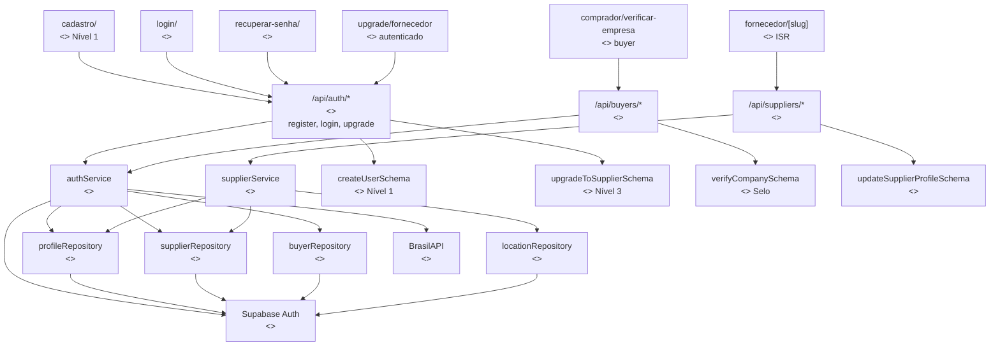

#### API Routes

| Rota | Método | Descrição | Auth |
|------|--------|-----------|------|
| `/api/auth/register` | POST | Cadastro genérico Nível 1 (email, senha, nome, telefone, cidade, estado) | Público |
| `/api/auth/upgrade/supplier` | POST | Upgrade para fornecedor Nível 3 (CNPJ, endereço) — SEQ-17, UC-31 | Autenticado |
| `/api/auth/login` | POST | Login email + senha | Público |
| `/api/auth/logout` | POST | Logout (invalida sessão) | Autenticado |
| `/api/auth/verify-email` | POST | Confirma email via token | Público |
| `/api/auth/reset-password` | POST | Solicita reset de senha | Público |
| `/api/auth/reset-password/confirm` | POST | Confirma nova senha | Público |
| `/api/buyers/verify-company` | POST | Verificar empresa comprador (CNPJ, selo) — SEQ-18, UC-32 | Buyer |
| `/api/suppliers/[id]` | GET | Perfil público do fornecedor | Público |
| `/api/suppliers/[id]` | PATCH | Atualiza perfil | Supplier (owner) |
| `/api/suppliers/[id]/logo` | POST | Upload logo | Supplier (owner) |
| `/api/suppliers/[id]/categories` | PUT | Atualiza categorias (máx 5) | Supplier (owner) |
| `/api/suppliers/[id]/images` | POST | Upload fotos empresa | Supplier (owner) |
| `/api/suppliers/[id]/completeness` | GET | Retorna % completude | Supplier (owner) |
| `/api/suppliers/[id]/settings` | PATCH | Configurações do fornecedor (filtro verificados) — SEQ-19, UC-33 | Supplier (owner) |

#### Pages

| Rota | Rendering | Acesso | Descrição |
|------|-----------|--------|-----------|
| `/(auth)/cadastro` | SSR | Público | Formulário registro unificado (Nível 1 — UC-01) |
| `/(auth)/login` | SSR | Público | Login unificado |
| `/(auth)/recuperar-senha` | SSR | Público | Reset de senha |
| `/(dashboard)/upgrade/fornecedor` | SSR | Autenticado | Formulário upgrade para supplier (Nível 3 — UC-31) |
| `/(dashboard)/comprador/verificar-empresa` | SSR | Buyer | Verificação CNPJ para selo (UC-32) |
| `/(public)/fornecedor/[slug]` | ISR 300s | Público | Perfil público fornecedor |

#### Dependências cross-domain

| De | Para | Interface |
|----|------|-----------|
| authService | notifications.notificationService | `send(email_confirmation)` |
| supplierService | — | Expõe para Catalog, Search, Moderation |

---

### 3.2 Catalog (Produtos e Categorias)

Responsável por CRUD de produtos, gestão de categorias hierárquicas, upload de imagens e páginas de produto/categoria.

#### Componentes

| # | Componente | Estereótipo | Fase | RF/RN Principal |
|---|-----------|-------------|------|-----------------|
| 1 | productService | `<<service>>` | MVP | RF-03.01 a RF-03.06, RN-02.03 a RN-02.07 |
| 2 | categoryService | `<<service>>` | MVP | RF-03.04, RN-02.04 |
| 3 | productRepository | `<<repository>>` | MVP | products, product_images (2.5) |
| 4 | categoryRepository | `<<repository>>` | MVP | categories (2.5) |
| 5 | createProductSchema | `<<schema>>` | MVP | RF-03.01 |
| 6 | updateProductSchema | `<<schema>>` | MVP | RF-03.03 |
| 7 | createCategorySchema | `<<schema>>` | MVP | RF-12.03 |
| 8 | /api/products/* | `<<api-route>>` | MVP | CRUD produtos, upload imagens |
| 9 | /api/categories/* | `<<api-route>>` | MVP | Árvore, CRUD categorias |
| 10 | produto/[slug] | `<<page>>` | MVP | RF-03.06, RF-05.01 (ISR 60s) |
| 11 | categoria/[slug] | `<<page>>` | MVP | RF-05.02 (SSG+ISR) |
| 12 | (dashboard)/fornecedor/produtos | `<<page>>` | MVP | RF-09.03 (CSR) |
| 13 | Cloudflare R2 | `<<external>>` | MVP | ADR-02, imagens produto/empresa |
| 14 | bulkImportJob | `<<job>>` | [VAL] | RF-03.07, importação CSV/XLSX |

#### Diagrama

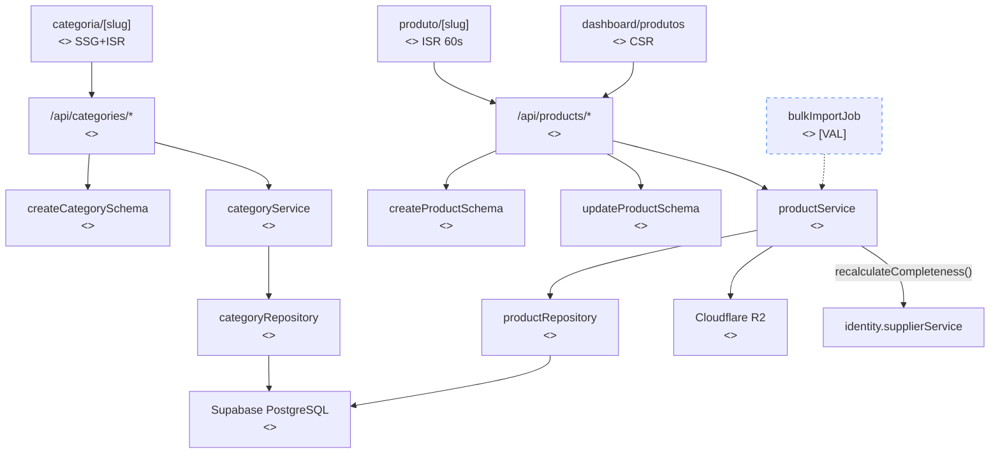

#### API Routes

| Rota | Método | Descrição | Auth |
|------|--------|-----------|------|
| `/api/products` | POST | Cria produto | Supplier |
| `/api/products/[id]` | GET | Detalhe produto | Público |
| `/api/products/[id]` | PATCH | Atualiza produto | Supplier (owner) |
| `/api/products/[id]` | DELETE | Soft delete produto | Supplier (owner) |
| `/api/products/[id]/pause` | PATCH | Pausa/despausa produto | Supplier (owner) |
| `/api/products/[id]/images` | POST | Upload imagens (máx 5) | Supplier (owner) |
| `/api/products/[id]/images/[imgId]` | DELETE | Remove imagem | Supplier (owner) |
| `/api/products/supplier/[supplierId]` | GET | Lista produtos do fornecedor | Público |
| `/api/categories` | GET | Árvore de categorias | Público |
| `/api/categories` | POST | Cria categoria | Admin |
| `/api/categories/[id]` | PATCH | Atualiza categoria | Admin |

#### Dependências cross-domain

| De | Para | Interface |
|----|------|-----------|
| productService | identity.supplierService | `calculateProfileCompleteness(supplierId)` |
| productService | identity.supplierRepository | `findById(supplierId)` — validar owner |

---

### 3.3 Search & Discovery (Busca e SEO)

Responsável por busca textual com ranking composto (RN-03.01), geração de páginas SEO programáticas, sitemap, robots.txt e meta tags. Separado de Catalog porque opera sobre múltiplos repositories (products, suppliers, categories, locations) e tem estratégias de cache e rendering distintas.

#### Componentes

| # | Componente | Estereótipo | Fase | RF/RN Principal |
|---|-----------|-------------|------|-----------------|
| 1 | searchService | `<<service>>` | MVP | RF-04.01 a RF-04.04, RN-03.01 a RN-03.06 |
| 2 | seoService | `<<service>>` | MVP | RF-05.05 a RF-05.09, RNF-08.01 a RNF-08.07 |
| 3 | searchQuerySchema | `<<schema>>` | MVP | RF-04.01 |
| 4 | searchRankingSchema | `<<schema>>` | MVP | RN-03.01 (pesos do algoritmo) |
| 5 | /api/search/* | `<<api-route>>` | MVP | Busca textual + filtros |
| 6 | busca/ | `<<page>>` | MVP | RF-04.01 (SSR — query params dinâmicos) |
| 7 | fornecedores/[loc] | `<<page>>` | MVP | RF-05.03 (SSG) |
| 8 | fornecedor-de/[combo] | `<<page>>` | MVP | RF-05.04 (ISR 300s) |
| 9 | sitemap.xml | `<<page>>` | MVP | RF-05.06, RNF-08.04 |
| 10 | robots.txt | `<<page>>` | MVP | RNF-08.05 |
| 11 | Cloudflare CDN | `<<external>>` | MVP | Cache SSG/ISR, edge |
| 12 | PostgreSQL FTS | `<<external>>` | MVP | tsvector + GIN (RNF-02.03) |

**Componente futuro:**
- getAutocompleteSuggestions `[VAL]` — RF-04.05, autocomplete durante digitação

#### Algoritmo de Busca (RN-03.01) — INDEPENDENTE de Distribuição

| Fator | Peso | Fonte |
|-------|------|-------|
| Relevância textual (tsvector) | 35% | Query FTS |
| Nível do plano | 25% | supplierService.getEffectivePlan() |
| Completude do perfil | 15% | supplierService.calculateProfileCompleteness() |
| Proximidade geográfica | 15% | locationRepository |
| Frescor (data cadastro) | 10% | suppliers.created_at |

> **Nota:** Este é o algoritmo de **busca** (RN-03.01). O algoritmo de **distribuição** (RN-05.04) é INDEPENDENTE e está documentado no domínio 3.5 Leads & Distribution.

#### Diagrama

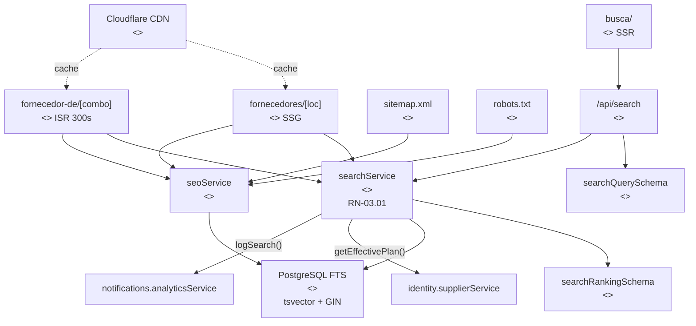

#### API Routes

| Rota | Método | Descrição | Auth |
|------|--------|-----------|------|
| `/api/search` | GET | Busca textual + filtros | Público |
| `/api/search/suggestions` | GET | Autocomplete `[VAL]` | Público |

#### Pages

| Rota | Rendering | Acesso | Descrição |
|------|-----------|--------|-----------|
| `/(public)/busca` | SSR | Público | Resultados de busca (query params dinâmicos) |
| `/(public)/fornecedores/[loc]` | SSG | Público | Fornecedores por localidade |
| `/(public)/fornecedor-de/[combo]` | ISR 300s | Público | Categoria + localidade (RN-03.05: mín 3 suppliers) |
| `/sitemap.xml` | ISR daily | Público | Sitemap XML auto-gerado |
| `/robots.txt` | SSG | Público | robots.txt dinâmico |

#### Dependências cross-domain

| De | Para | Interface |
|----|------|-----------|
| searchService | identity.supplierService | `getEffectivePlan(id)`, `calculateProfileCompleteness(id)` |
| searchService | catalog.productRepository | `search(query)` via FTS |
| searchService | notifications.analyticsService | `logSearch(term, filters, results)` |
| seoService | catalog.productRepository | `findBySlug()`, `countBySupplierId()` |
| seoService | catalog.categoryRepository | `getTree()`, `countSuppliersByCategory()` |

---

### 3.4 Inquiries (Cotações)

Responsável pelo fluxo de envio de inquiries (directed), validação anti-spam, deduplicação, notificação ao fornecedor, mascaramento de dados de contato e filtro de leads verificados (RF-01.15, RN-01.12).

#### Componentes

| # | Componente | Estereótipo | Fase | RF/RN Principal |
|---|-----------|-------------|------|-----------------|
| 1 | inquiryService | `<<service>>` | MVP | RF-06.01 a RF-06.04, RN-04.01 a RN-04.08 |
| 2 | inquiryRepository | `<<repository>>` | MVP | inquiries, inquiry_responses (2.5) |
| 3 | createDirectInquirySchema | `<<schema>>` | MVP | RF-06.01 |
| 4 | createGenericInquirySchema | `<<schema>>` | [VAL] | RF-06.06, RN-04.03 |
| 5 | inquiryFilterSchema | `<<schema>>` | MVP | RF-09.02 (filtros dashboard), RF-01.15 (filtro Empresas Verificadas) |
| 6 | updateInquiryStatusSchema | `<<schema>>` | MVP | RN-04.08 (state machine) |
| 7 | /api/inquiries/* | `<<api-route>>` | MVP | Criar, listar, atualizar status |
| 8 | (dashboard)/fornecedor/inquiries | `<<page>>` | MVP | RF-06.03, RF-09.02 (CSR) |
| 9 | (dashboard)/comprador/inquiries | `<<page>>` | MVP | RF-10.01 (CSR) |
| 10 | Cloudflare Turnstile | `<<external>>` | MVP | Anti-spam inquiry form |
| 11 | autoArchiveStaleJob | `<<job>>` | [VAL] | Arquiva inquiries sem visualização >30d |

#### State Machine da Inquiry (RN-04.08)

```
new → viewed → responded | archived | reported
```

Transições inválidas rejeitadas no service layer. Timestamps: `viewedAt`, `respondedAt`, `archivedAt`.

#### Diagrama

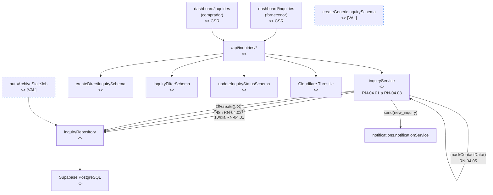

#### API Routes

| Rota | Método | Descrição | Auth |
|------|--------|-----------|------|
| `/api/inquiries` | POST | Cria inquiry directed | Buyer |
| `/api/inquiries/generic` | POST | Cria inquiry genérica `[VAL]` | Buyer |
| `/api/inquiries/supplier` | GET | Lista inquiries do fornecedor | Supplier |
| `/api/inquiries/buyer` | GET | Lista inquiries do comprador | Buyer |
| `/api/inquiries/[id]` | GET | Detalhe inquiry (dados conforme plano) | Supplier/Buyer |
| `/api/inquiries/[id]/status` | PATCH | Atualiza status | Supplier |
| `/api/inquiries/[id]/report` | POST | Denuncia inquiry | Supplier |
| `/api/inquiries/[id]/respond` | POST | Responde inquiry | Supplier |

#### Dependências cross-domain

| De | Para | Interface |
|----|------|-----------|
| inquiryService | notifications.notificationService | `sendEmail(supplier, new_inquiry)` + Supabase Realtime |
| inquiryService | identity.supplierService | `getEffectivePlan(id)` — determinar mascaramento |
| inquiryService | identity.supplierRepository | `getSettings(supplierId)` — filtro Empresas Verificadas (RF-01.15, RN-01.12) |
| inquiryService | identity.buyerRepository | `countInquiriesToday(buyerId)` — rate limit; `cnpj_verified` — filtro verificados |

---

### 3.5 Leads & Distribution [MON]

Responsável pela distribuição de inquiries genéricas para fornecedores elegíveis por rodadas (RN-05.01 a RN-05.10), desbloqueio de contatos via créditos e CRM de leads. **Inteiramente fase Monetização.**

#### Componentes

| # | Componente | Estereótipo | Fase | RF/RN Principal |
|---|-----------|-------------|------|-----------------|
| 1 | distributionService | `<<service>>` | [MON] | RF-07.05, RF-07.06, RN-05.01 a RN-05.05 |
| 2 | leadService | `<<service>>` | [MON] | RF-07.02, RF-07.03, RN-05.09 |
| 3 | distributionRepository | `<<repository>>` | [MON] | distribution_rounds (2.5) |
| 4 | leadRepository | `<<repository>>` | [MON] | leads, favorites (2.5) |
| 5 | updateLeadStatusSchema | `<<schema>>` | [MON] | RF-09.05 |
| 6 | /api/leads/* | `<<api-route>>` | [MON] | Unlock, CRM, status |
| 7 | (dashboard)/fornecedor/leads | `<<page>>` | [MON] | RF-09.05 (CSR) |
| 8 | distributeInquiryJob | `<<job>>` | [MON] | RN-05.02 (rodadas por plano) |
| 9 | handleExpiredQueueJob | `<<job>>` | [MON] | Inquiries não aceitas após 3 rodadas |
| 10 | toggleFavorite | `<<api-route>>` | [VAL] | RF-04.07 |

#### Algoritmo de Distribuição (RN-05.04) — INDEPENDENTE de Busca

| Fator | Peso | Fonte |
|-------|------|-------|
| Relevância de categoria | 35% | categoryRepository |
| Proximidade geográfica | 25% | locationRepository |
| Tempo de resposta médio | 20% | inquiryRepository |
| Saturação (penalidade) | 10% | creditRepository |
| Completude do perfil | 10% | supplierService |

> **Nota:** Este é o algoritmo de **distribuição** (RN-05.04). O algoritmo de **busca** (RN-03.01) é INDEPENDENTE e está documentado no domínio 3.3 Search & Discovery.

#### Rodadas de Distribuição (RN-05.02)

| Rodada | Planos elegíveis | Timing |
|--------|-----------------|--------|
| 1 | Premium | h0 (imediato) |
| 2 | Pro | h4 |
| 3 | Starter | h8 |

Máximo 5 fornecedores por inquiry genérica (RN-05.01). Intervalo de 4h entre rodadas (provisório, configurável via `system_configs`).

#### Diagrama

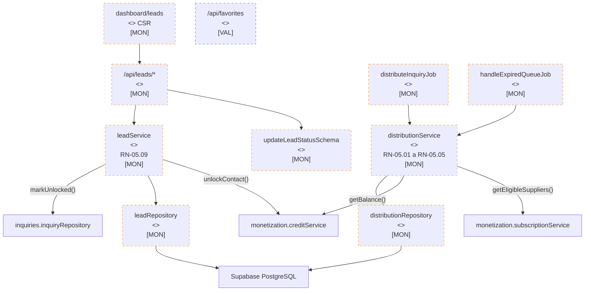

#### API Routes

| Rota | Método | Descrição | Auth |
|------|--------|-----------|------|
| `/api/leads/unlock/[inquiryId]` | POST | Desbloqueia contato (consome 1 crédito) | Supplier (pago) |
| `/api/leads` | GET | Lista leads desbloqueados (CRM) | Supplier (pago) |
| `/api/leads/[id]/status` | PATCH | Atualiza status follow-up | Supplier (pago) |
| `/api/leads/[id]/favorite` | POST | Toggle favorito `[VAL]` | Supplier |
| `/api/leads/report` | GET | Relatório mensal | Supplier (pago) |

#### Dependências cross-domain

| De | Para | Interface |
|----|------|-----------|
| distributionService | monetization.subscriptionService | `getAvailablePlans()`, verificar plano ativo |
| distributionService | monetization.creditService | `getBalance(supplierId)` |
| distributionService | identity.supplierService | `calculateProfileCompleteness(id)` |
| leadService | monetization.creditService | `consumeCredit(supplierId, inquiryId)` |
| leadService | inquiries.inquiryRepository | `markUnlocked(inquiryId, supplierId)` |

---

### 3.6 Monetization (Planos e Pagamentos) [MON]

Responsável por planos, assinaturas, créditos semanais/extras, billing recorrente e integração Stripe. **Inteiramente fase Monetização.**

#### Componentes

| # | Componente | Estereótipo | Fase | RF/RN Principal |
|---|-----------|-------------|------|-----------------|
| 1 | subscriptionService | `<<service>>` | [MON] | RF-08.01 a RF-08.06, RN-06.01 a RN-06.10 |
| 2 | creditService | `<<service>>` | [MON] | RF-07.01, RF-07.04, RN-05.07 a RN-05.10 |
| 3 | billingService | `<<service>>` | [MON] | RF-08.03, RF-08.05, RN-06.06, RN-06.07 |
| 4 | subscriptionRepository | `<<repository>>` | [MON] | subscriptions, plans (2.5) |
| 5 | creditRepository | `<<repository>>` | [MON] | credits_weekly, credits_extra, credit_transactions (2.5) |
| 6 | paymentRepository | `<<repository>>` | [MON] | payment_attempts (2.5) |
| 7 | createSubscriptionSchema | `<<schema>>` | [MON] | RF-08.02 |
| 8 | planChangeSchema | `<<schema>>` | [MON] | RF-08.02 (upgrade/downgrade) |
| 9 | /api/subscriptions/* | `<<api-route>>` | [MON] | Planos, assinar, upgrade, cancel |
| 10 | /api/billing/* | `<<api-route>>` | [MON] | Histórico, faturas |
| 11 | /api/webhooks/stripe | `<<api-route>>` | [MON] | Webhook pagamentos |
| 12 | allocateWeeklyCreditsJob | `<<job>>` | [MON] | RN-05.07, domingo 00:01 BRT |
| 13 | Stripe | `<<external>>` | [MON] | Gateway de pagamento |

#### Créditos (RN-05.07 a RN-05.10)

| Plano | Créditos/semana | Preço mensal | Preço anual (17% desc) |
|-------|----------------|-------------|----------------------|
| Starter | 5 | R$79 | R$790 |
| Pro | 15 | R$199 | R$1.990 |
| Premium | 30+ | R$399 | R$3.990 |

- **Semanais:** Alocados domingo 00:01 BRT. Expiram no domingo seguinte. Sem acúmulo.
- **Extras:** Pacotes avulsos. Validade 90 dias. Consumidos FIFO após semanais.
- **Consumo:** 1 crédito = 1 desbloqueio. Irreversível (RN-05.09).
- **Free:** Ausência de registro em `plans`. Não é um plano — é estado padrão.

#### Dunning (RN-06.06)

| Dia | Ação |
|-----|------|
| D0 | Email "falha no pagamento" |
| D3 | Retry automático |
| D7 | Último retry + email alerta |
| D10 | Suspensão (revert para free) |
| D30 | Cancelamento definitivo |

PIX/Boleto: tolerância de 3 dias úteis (RN-06.07).

#### Diagrama

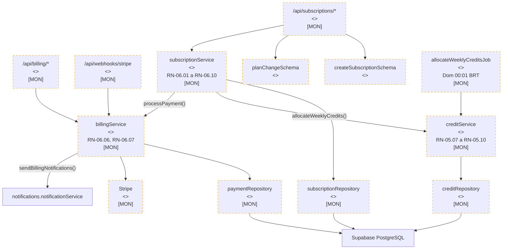

#### API Routes

| Rota | Método | Descrição | Auth |
|------|--------|-----------|------|
| `/api/subscriptions/plans` | GET | Lista planos disponíveis | Público |
| `/api/subscriptions` | POST | Assina plano | Supplier |
| `/api/subscriptions/[id]/upgrade` | POST | Upgrade (imediato) | Supplier |
| `/api/subscriptions/[id]/downgrade` | POST | Downgrade (próximo ciclo) | Supplier |
| `/api/subscriptions/[id]/cancel` | POST | Cancela (próximo ciclo) | Supplier |
| `/api/subscriptions/trial` | POST | Inicia trial 7 dias | Supplier |
| `/api/billing/credits` | GET | Saldo de créditos | Supplier |
| `/api/billing/credits/extras` | POST | Compra pacote extra | Supplier |
| `/api/billing/history` | GET | Histórico de pagamentos | Supplier |
| `/api/webhooks/stripe` | POST | Webhook Stripe (events) | Stripe (verificado) |

#### Dependências cross-domain

| De | Para | Interface |
|----|------|-----------|
| subscriptionService | creditService | `allocateWeeklyCredits(supplierId, plan)` |
| subscriptionService | billingService | `processPayment(subscriptionId)` |
| billingService | notifications.notificationService | `sendEmail(billing_notification)` |
| creditService | — | Expõe `consumeCredit()` e `getBalance()` para Leads |

---

### 3.7 Moderation & Trust (Moderação)

Responsável por denúncias (buyer→supplier, supplier→inquiry), ações administrativas, verificação CNPJ automática, suspensão/reativação de fornecedores e log de auditoria.

#### Componentes

| # | Componente | Estereótipo | Fase | RF/RN Principal |
|---|-----------|-------------|------|-----------------|
| 1 | moderationService | `<<service>>` | MVP | RF-11.01, RF-11.04, RF-12.02, RF-12.04, RF-12.05, RN-07.01 a RN-07.06 |
| 2 | reportRepository | `<<repository>>` | MVP | reports, admin_actions, verification_documents (2.5) |
| 3 | createReportSchema | `<<schema>>` | MVP | RF-11.04 |
| 4 | submitVerificationDocSchema | `<<schema>>` | [MON] | RF-11.02 (Level 2) |
| 5 | /api/admin/reports/* | `<<api-route>>` | MVP | Denúncias, moderação |
| 6 | /api/admin/actions/* | `<<api-route>>` | MVP | Suspender, reativar, advertir |
| 7 | (dashboard)/admin/moderacao | `<<page>>` | MVP | RF-12.05 (CSR) |
| 8 | (dashboard)/admin/fornecedores | `<<page>>` | MVP | RF-12.02 (CSR) |
| 9 | autoVerifyCNPJJob | `<<job>>` | MVP | RF-11.01, RN-01.01 (validação inicial) |
| 10 | revalidateCNPJJob | `<<job>>` | MVP | Revalidação a cada 90 dias |

#### Thresholds de Moderação (configuráveis via `system_configs`)

| Alvo | Threshold | Ação |
|------|-----------|------|
| Inquiry | 2+ denúncias idênticas | Auto-suspensão da inquiry (RN-07.04) |
| Buyer | 3+ spam confirmados | Bloqueio 30 dias (RN-07.04) |
| Supplier | 3 denúncias confirmadas | Advertência (RN-07.05) |
| Supplier | 5 denúncias confirmadas | Suspensão (RN-07.05) |

#### Diagrama

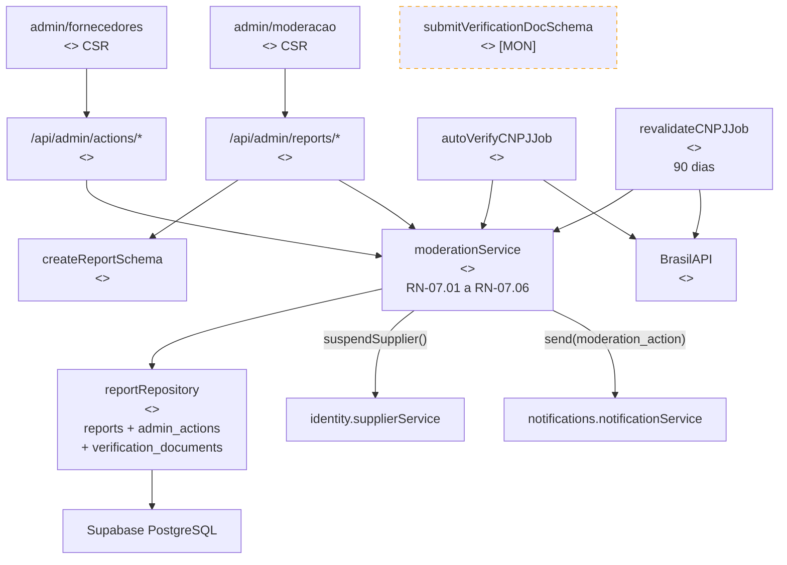

#### API Routes

| Rota | Método | Descrição | Auth |
|------|--------|-----------|------|
| `/api/admin/reports` | GET | Lista denúncias pendentes | Admin |
| `/api/admin/reports/[id]` | PATCH | Atualiza status denúncia | Admin |
| `/api/admin/actions` | POST | Registra ação admin (INSERT-ONLY) | Admin |
| `/api/admin/actions` | GET | Lista ações administrativas | Admin |
| `/api/admin/suppliers/[id]/suspend` | POST | Suspende fornecedor | Admin |
| `/api/admin/suppliers/[id]/reactivate` | POST | Reativa fornecedor | Admin |
| `/api/admin/verification/[id]` | PATCH | Analisa documento verificação `[MON]` | Admin |

#### Dependências cross-domain

| De | Para | Interface |
|----|------|-----------|
| moderationService | identity.supplierService | `suspendSupplier(id)`, `reactivateSupplier(id)` |
| moderationService | notifications.notificationService | `send(moderation_action)` |

---

### 3.8 Notifications & Analytics

Responsável por envio de emails transacionais (Resend), notificações in-app (Supabase Realtime), product analytics (PostHog), dashboards de métricas e log de buscas.

#### Componentes

| # | Componente | Estereótipo | Fase | RF/RN Principal |
|---|-----------|-------------|------|-----------------|
| 1 | notificationService | `<<service>>` | MVP | RF-13.01, RN-09.01, RN-09.02 |
| 2 | analyticsService | `<<service>>` | MVP | RF-09.01, RF-12.01, RN-10.01 a RN-10.03 |
| 3 | notificationRepository | `<<repository>>` | MVP | notifications, notification_preferences, email_logs (2.5) |
| 4 | updateNotificationPrefSchema | `<<schema>>` | [VAL] | RF-13.04 |
| 5 | adminFilterSchema | `<<schema>>` | MVP | RF-12.01 (filtros admin) |
| 6 | /api/notifications/* | `<<api-route>>` | MVP | Listar, marcar lida, preferências |
| 7 | (dashboard)/fornecedor/dashboard | `<<page>>` | MVP | RF-09.01 (CSR) |
| 8 | (dashboard)/comprador/dashboard | `<<page>>` | MVP | RF-10.01 (CSR) |
| 9 | (dashboard)/admin/dashboard | `<<page>>` | MVP | RF-12.01 (CSR) |
| 10 | Resend | `<<external>>` | MVP | Email transacional |
| 11 | Supabase Realtime | `<<external>>` | MVP | Notificações in-app |
| 12 | PostHog | `<<external>>` | MVP | ADR-05, analytics cookieless |

**Componentes futuros:**
- sendPush `[VAL]` — RF-13.02, notificações push PWA
- getPreferences / updatePreferences `[VAL]` — RF-13.04
- WhatsApp Business API `[ESC]` — RF-13.03

#### Notificações obrigatórias vs opcionais (RN-09.02)

| Tipo | Obrigatória | Canal |
|------|-------------|-------|
| Nova inquiry | Sim | Email + In-app |
| Billing (pagamento, falha) | Sim | Email |
| Completude perfil (reminder) | Não | Email |
| Créditos expirando | Não | Email |
| Resumo semanal | Não (opt-in) | Email |

#### Diagrama

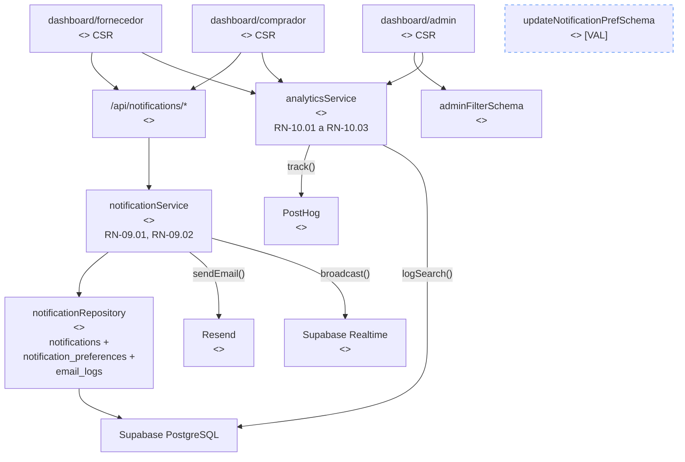

#### API Routes

| Rota | Método | Descrição | Auth |
|------|--------|-----------|------|
| `/api/notifications` | GET | Lista notificações do usuário | Autenticado |
| `/api/notifications/[id]/read` | PATCH | Marca como lida | Autenticado |
| `/api/notifications/unread-count` | GET | Contador de não lidas | Autenticado |
| `/api/notifications/preferences` | GET | Preferências `[VAL]` | Autenticado |
| `/api/notifications/preferences` | PATCH | Atualiza preferências `[VAL]` | Autenticado |

#### Dependências cross-domain

| De | Para | Interface |
|----|------|-----------|
| notificationService | — | **Recebe chamadas** de: auth, billing, moderation, inquiry |
| analyticsService | — | **Recebe chamadas** de: search (logSearch), dashboards |

---

### 3.9 Cross-cutting (Infraestrutura Transversal)

Componentes que operam em todas as requisições ou são compartilhados entre domínios. Não pertencem a nenhum domínio de negócio específico.

#### Componentes

| # | Componente | Estereótipo | Fase | RNF Principal |
|---|-----------|-------------|------|---------------|
| 1 | authMiddleware | `<<middleware>>` | MVP | RNF-04.02, RNF-04.03 (JWT validation, RBAC) |
| 2 | rateLimitMiddleware | `<<middleware>>` | MVP | RNF-04.07 (100/10/5 req/min por tier) |
| 3 | securityHeadersMiddleware | `<<middleware>>` | MVP | RNF-04.09 (CSP, HSTS, X-Frame-Options) |
| 4 | zodValidationMiddleware | `<<middleware>>` | MVP | RNF-04.06 (input sanitization) |
| 5 | errorHandler | `<<middleware>>` | MVP | RNF-09.02 (Sentry integration) |
| 6 | paginationSchema | `<<schema>>` | MVP | Shared: limit, offset, sortBy, sortOrder |
| 7 | cnpjValidationSchema | `<<schema>>` | MVP | RN-01.01 (formato + dígitos verificadores) |
| 8 | profileCompletenessSchema | `<<schema>>` | MVP | RN-02.01 (9 componentes com pesos) |
| 9 | ServiceResult\<T\> | utility | MVP | 2.6 Result Pattern |
| 10 | Sentry | `<<external>>` | MVP | RNF-09.02 (error tracking) |
| 11 | Better Stack | `<<external>>` | MVP | RNF-03.02 (uptime monitoring, health checks 60s) |
| 12 | Vercel Analytics | `<<external>>` | MVP | RNF-01.04 a RNF-01.06 (Core Web Vitals) |

#### Páginas Institucionais (RF-14)

Páginas estáticas que não pertencem a nenhum domínio de negócio específico:

| Rota | Rendering | Descrição |
|------|-----------|-----------|
| `/(public)/sobre` | SSG | Página "Sobre a GiroB2B" (RF-14.01) |
| `/(public)/contato` | SSG | Formulário de contato (RF-14.01) |
| `/(public)/termos` | SSG | Termos de uso (RF-14.01) |
| `/(public)/privacidade` | SSG | Política de privacidade / LGPD (RF-14.01) |
| `/(public)/` | SSR | Página inicial com busca e destaques (RF-14.03) |

> **Nota:** Blog (RF-14.02) está na fase Validação — não entra no MVP.

#### Rate Limiting (RNF-04.07)

| Tier | Limite | Endpoints |
|------|--------|-----------|
| Navegação | 100 req/min/IP | Páginas, GET APIs |
| Formulários | 10 req/min/IP | POST inquiry, register |
| Login | 5 req/min/IP | POST /api/auth/login |

#### Middleware Pipeline

Ordem de execução no Next.js Edge Middleware (`src/middleware.ts`):

1. `securityHeadersMiddleware` — CSP, HSTS, X-Frame-Options
2. `rateLimitMiddleware` — Verifica limites por IP/tier
3. `authMiddleware` — Valida JWT, extrai role, protege rotas dashboard/admin
4. (API routes) `zodValidationMiddleware` — Valida body/params com schema
5. (catch) `errorHandler` — Captura exceções não tratadas → Sentry

#### Diagrama

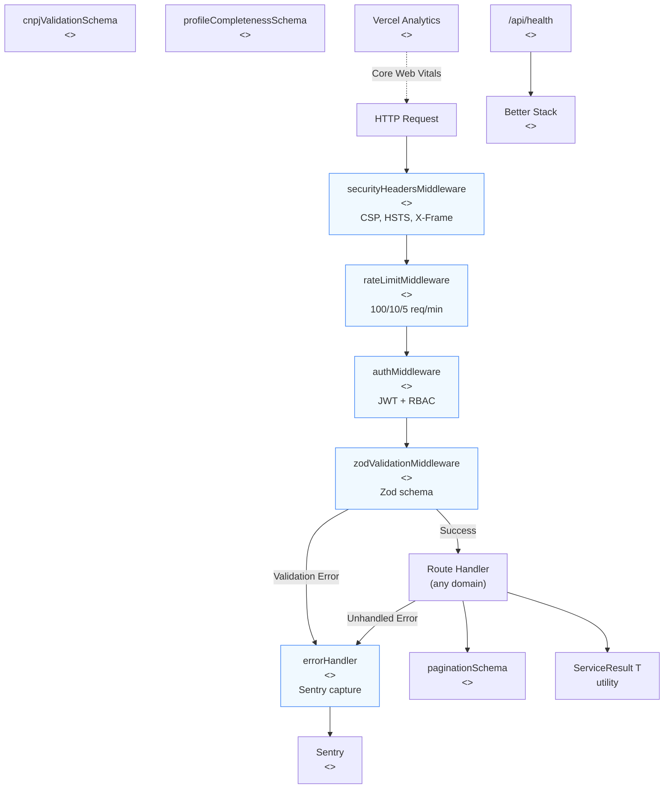

#### Endpoint de Saúde

| Rota | Método | Descrição | Auth |
|------|--------|-----------|------|
| `/api/health` | GET | Health check (DB, auth, storage) | Público |

Monitorado por Better Stack a cada 60s (RNF-03.02). Retorna status de cada subsistema.

---

## 4. Diagrama de Dependências entre Domínios

Visão das dependências entre os 9 domínios. Setas indicam direção da chamada (quem chama quem). **Sem dependências circulares** — o grafo é um DAG (Directed Acyclic Graph).

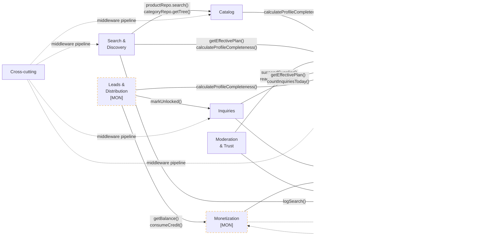

### Análise de dependências

| Domínio | Depende de | É dependido por | Acoplamento |
|---------|-----------|----------------|-------------|
| **Identity** | Notifications | Catalog, Search, Inquiries, Leads, Moderation | **Alto** (fundação) |
| **Catalog** | Identity | Search | Baixo |
| **Search & Discovery** | Identity, Catalog, Notifications | — | Médio |
| **Inquiries** | Identity, Notifications | Leads | Baixo |
| **Leads & Distribution** | Identity, Inquiries, Monetization | — | Médio |
| **Monetization** | Notifications | Leads | Baixo |
| **Moderation & Trust** | Identity, Notifications | — | Baixo |
| **Notifications & Analytics** | — | Identity, Inquiries, Monetization, Moderation, Search | **Alto** (leaf) |
| **Cross-cutting** | — | Todos | **Alto** (transversal) |

**Identity** é a fundação (5 dependentes). **Notifications** é o leaf mais demandado (5 callers). Nenhum tem dependência circular.

---

## 5. Mapeamento para Estrutura de Diretórios

Expansão da árvore do 2.4 com arquivos concretos por domínio. Apresenta **duas opções** de organização do `lib/` para decisão do CTO.

### Opção A — Organização por Domínio (recomendada)

Cada domínio contém seus services E repositories juntos. Favorece coesão, facilita extração futura para microserviço.

```
src/
├── app/
│   ├── (public)/
│   │   ├── produto/[slug]/page.tsx              # ISR 60s
│   │   ├── categoria/[slug]/page.tsx            # SSG+ISR
│   │   ├── fornecedores/[loc]/page.tsx          # SSG
│   │   ├── fornecedor-de/[combo]/page.tsx       # ISR 300s
│   │   ├── fornecedor/[slug]/page.tsx           # ISR 300s
│   │   └── busca/page.tsx                       # SSR
│   ├── (auth)/
│   │   ├── login/page.tsx
│   │   ├── cadastro/page.tsx                    # Cadastro unificado (Nível 1)
│   │   ├── upgrade/fornecedor/page.tsx           # Upgrade supplier (UC-31)
│   │   ├── comprador/verificar-empresa/page.tsx  # Verificação empresa (UC-32)
│   │   └── recuperar-senha/page.tsx
│   ├── (dashboard)/
│   │   ├── fornecedor/
│   │   │   ├── page.tsx                         # Dashboard home
│   │   │   ├── produtos/page.tsx                # CRUD produtos
│   │   │   ├── inquiries/page.tsx               # Lista inquiries
│   │   │   └── leads/page.tsx                   # CRM leads [MON]
│   │   ├── comprador/
│   │   │   ├── page.tsx                         # Dashboard home
│   │   │   └── inquiries/page.tsx               # Histórico inquiries
│   │   └── admin/
│   │       ├── page.tsx                         # Dashboard métricas
│   │       ├── fornecedores/page.tsx            # Gestão fornecedores
│   │       ├── moderacao/page.tsx               # Denúncias
│   │       └── categorias/page.tsx              # Árvore categorias
│   ├── api/
│   │   ├── auth/
│   │   │   ├── register/route.ts                 # POST genérico (Nível 1)
│   │   │   ├── upgrade/supplier/route.ts         # POST upgrade (UC-31)
│   │   │   ├── login/route.ts
│   │   │   ├── logout/route.ts
│   │   │   ├── verify-email/route.ts
│   │   │   └── reset-password/route.ts
│   │   ├── suppliers/
│   │   │   ├── [id]/route.ts                    # GET, PATCH
│   │   │   ├── [id]/logo/route.ts               # POST
│   │   │   ├── [id]/categories/route.ts         # PUT
│   │   │   └── [id]/completeness/route.ts       # GET
│   │   ├── buyers/
│   │   │   └── verify-company/route.ts          # POST (UC-32)
│   │   ├── products/
│   │   │   ├── route.ts                         # POST
│   │   │   ├── [id]/route.ts                    # GET, PATCH, DELETE
│   │   │   ├── [id]/pause/route.ts              # PATCH
│   │   │   ├── [id]/images/route.ts             # POST
│   │   │   └── supplier/[supplierId]/route.ts   # GET
│   │   ├── categories/
│   │   │   ├── route.ts                         # GET, POST
│   │   │   └── [id]/route.ts                    # PATCH
│   │   ├── search/
│   │   │   └── route.ts                         # GET
│   │   ├── inquiries/
│   │   │   ├── route.ts                         # POST
│   │   │   ├── supplier/route.ts                # GET
│   │   │   ├── buyer/route.ts                   # GET
│   │   │   ├── [id]/route.ts                    # GET
│   │   │   ├── [id]/status/route.ts             # PATCH
│   │   │   ├── [id]/report/route.ts             # POST
│   │   │   └── [id]/respond/route.ts            # POST
│   │   ├── leads/                               # [MON]
│   │   │   ├── route.ts                         # GET
│   │   │   ├── unlock/[inquiryId]/route.ts      # POST
│   │   │   └── [id]/status/route.ts             # PATCH
│   │   ├── subscriptions/                       # [MON]
│   │   │   ├── plans/route.ts                   # GET
│   │   │   ├── route.ts                         # POST
│   │   │   ├── [id]/upgrade/route.ts            # POST
│   │   │   ├── [id]/downgrade/route.ts          # POST
│   │   │   └── [id]/cancel/route.ts             # POST
│   │   ├── billing/                             # [MON]
│   │   │   ├── credits/route.ts                 # GET
│   │   │   ├── credits/extras/route.ts          # POST
│   │   │   └── history/route.ts                 # GET
│   │   ├── notifications/
│   │   │   ├── route.ts                         # GET
│   │   │   ├── [id]/read/route.ts               # PATCH
│   │   │   └── preferences/route.ts             # GET, PATCH [VAL]
│   │   ├── admin/
│   │   │   ├── reports/route.ts                 # GET
│   │   │   ├── reports/[id]/route.ts            # PATCH
│   │   │   ├── actions/route.ts                 # GET, POST
│   │   │   ├── suppliers/[id]/suspend/route.ts  # POST
│   │   │   └── suppliers/[id]/reactivate/route.ts # POST
│   │   ├── webhooks/
│   │   │   └── stripe/route.ts                  # POST [MON]
│   │   └── health/
│   │       └── route.ts                         # GET
│   ├── sitemap.xml/route.ts
│   ├── robots.txt/route.ts
│   └── layout.tsx
│
├── lib/                                         # ← Organizado por DOMÍNIO
│   ├── identity/
│   │   ├── authService.ts
│   │   ├── supplierService.ts
│   │   ├── profileRepository.ts
│   │   ├── supplierRepository.ts
│   │   ├── buyerRepository.ts
│   │   ├── locationRepository.ts
│   │   └── index.ts                             # Re-exports públicos
│   ├── catalog/
│   │   ├── productService.ts
│   │   ├── categoryService.ts
│   │   ├── productRepository.ts
│   │   ├── categoryRepository.ts
│   │   └── index.ts
│   ├── search/
│   │   ├── searchService.ts
│   │   ├── seoService.ts
│   │   ├── ranking.ts                           # Constantes RN-03.01
│   │   └── index.ts
│   ├── inquiries/
│   │   ├── inquiryService.ts
│   │   ├── inquiryRepository.ts
│   │   └── index.ts
│   ├── leads/                                   # [MON]
│   │   ├── distributionService.ts
│   │   ├── leadService.ts
│   │   ├── distributionRepository.ts
│   │   ├── leadRepository.ts
│   │   ├── distribution.ts                      # Constantes RN-05.04
│   │   └── index.ts
│   ├── monetization/                            # [MON]
│   │   ├── subscriptionService.ts
│   │   ├── creditService.ts
│   │   ├── billingService.ts
│   │   ├── subscriptionRepository.ts
│   │   ├── creditRepository.ts
│   │   ├── paymentRepository.ts
│   │   ├── stripeClient.ts                      # Wrapper Stripe SDK
│   │   └── index.ts
│   ├── moderation/
│   │   ├── moderationService.ts
│   │   ├── reportRepository.ts
│   │   └── index.ts
│   ├── notifications/
│   │   ├── notificationService.ts
│   │   ├── analyticsService.ts
│   │   ├── notificationRepository.ts
│   │   ├── resendClient.ts                      # Wrapper Resend SDK
│   │   ├── templates/                           # Email templates
│   │   │   ├── inquiry-received.tsx
│   │   │   ├── email-confirmation.tsx
│   │   │   ├── billing-notification.tsx
│   │   │   └── profile-reminder.tsx
│   │   └── index.ts
│   ├── validation/                              # Cross-cutting schemas
│   │   ├── supplier.ts                          # createSupplierSchema, updateSupplierProfileSchema
│   │   ├── buyer.ts                             # createBuyerSchema
│   │   ├── product.ts                           # createProductSchema, updateProductSchema
│   │   ├── category.ts                          # createCategorySchema, updateCategorySchema
│   │   ├── inquiry.ts                           # createDirectInquirySchema, inquiryFilterSchema, etc.
│   │   ├── subscription.ts                      # createSubscriptionSchema, planChangeSchema [MON]
│   │   ├── search.ts                            # searchQuerySchema, searchRankingSchema
│   │   ├── report.ts                            # createReportSchema
│   │   ├── notification.ts                      # updateNotificationPrefSchema [VAL]
│   │   ├── common.ts                            # paginationSchema, cnpjValidationSchema, profileCompletenessSchema
│   │   └── index.ts
│   ├── middleware/
│   │   ├── auth.ts                              # JWT validation, role check
│   │   ├── rateLimit.ts                         # IP-based rate limiting
│   │   ├── securityHeaders.ts                   # CSP, HSTS
│   │   └── errorHandler.ts                      # Sentry capture
│   └── utils/
│       ├── slug.ts                              # Geração de slugs SEO-friendly
│       ├── date.ts                              # Formatação, timezone BRT
│       ├── format.ts                            # Moeda, CNPJ, telefone
│       ├── result.ts                            # ServiceResult<T>, ServiceError
│       └── constants.ts                         # Limites, thresholds, configurações
│
├── types/                                       # Interfaces TypeScript (30 do 2.6)
│   ├── identity.ts                              # Profile, Supplier, Buyer, Location, Category
│   ├── catalog.ts                               # Product, ProductImage, SupplierImage
│   ├── inquiry.ts                               # Inquiry, InquiryResponse, DistributionRound, Lead
│   ├── monetization.ts                          # Plan, Subscription, CreditWeekly, CreditExtra, Payment
│   ├── moderation.ts                            # Report, AdminAction, VerificationDocument
│   ├── notification.ts                          # Notification, NotificationPreference, EmailLog
│   ├── analytics.ts                             # SearchLog, DashboardData
│   └── common.ts                                # AuditFields, PaginatedResult, ServiceResult, as const union types
│
├── components/
│   ├── ui/                                      # Design system (Button, Input, Card, Modal, Badge)
│   ├── forms/                                   # InquiryForm, ProductForm, RegisterForm
│   ├── layout/                                  # Header, Footer, Sidebar, Breadcrumbs
│   └── seo/                                     # MetaTags, JsonLd, OpenGraph
│
├── styles/
│   └── globals.css                              # Tailwind v4 config
│
├── middleware.ts                                 # Next.js Edge Middleware (pipeline)
```

### Opção B — Organização por Camada

Services, repositories e schemas separados por camada técnica. Familiar para devs vindos de MVC/Spring.

```
src/lib/
├── services/
│   ├── authService.ts
│   ├── supplierService.ts
│   ├── productService.ts
│   ├── searchService.ts
│   ├── inquiryService.ts
│   ├── ... (15 services)
├── db/                              # Repositories
│   ├── profileRepository.ts
│   ├── supplierRepository.ts
│   ├── productRepository.ts
│   ├── ... (14 repositories)
├── validation/                      # Schemas
│   ├── ... (25 schemas)
├── auth/                            # Auth helpers
├── email/                           # Email helpers
├── seo/                             # SEO helpers
└── utils/                           # Generic helpers
```

### Comparação

| Critério | Opção A (Domínio) | Opção B (Camada) |
|----------|-------------------|------------------|
| Coesão | **Alta** — tudo do domínio junto | Baixa — service longe do repo |
| Extração microserviço | **Fácil** — mover pasta inteira | Difícil — extrair de múltiplas pastas |
| Navegação dev | Precisa saber o domínio | Precisa saber a camada |
| Consistência com 2.6 | **Sim** — 7 domínios mapeiam 1:1 | Parcial |
| Risco de import circular | Baixo (inter-domain via index) | Médio (tudo numa pasta) |
| Familiaridade | Domain-Driven Design | MVC/Spring-style |

**Recomendação:** Opção A (Domínio), consistente com ADR-01 (monolito modular com extração futura) e com a organização do 2.6. O 2.4 já indica que `lib/` organiza "por funcionalidade".

> **Pendência CTO-01:** Vitor deve confirmar a convenção de organização do `lib/` antes do início da implementação.

---

## 6. Interfaces entre Componentes

Interfaces públicas que cruzam fronteiras de domínio. Formato: `domínio.service.método(params) → retorno`.

### 6.1 Interfaces expostas por Identity

```typescript
// identity.supplierService
calculateProfileCompleteness(supplierId: string): Promise<number>
// Consumido por: Catalog, Search, Leads

getEffectivePlan(supplierId: string): Promise<PlanName | null>
// Consumido por: Search (ranking), Inquiries (mascaramento)

getPublicProfile(supplierId: string): Promise<ServiceResult<SupplierPublicProfile>>
// Consumido por: Search (resultados), SEO (páginas)

suspendSupplier(supplierId: string, reason: string): Promise<ServiceResult<void>>
// Consumido por: Moderation

reactivateSupplier(supplierId: string): Promise<ServiceResult<void>>
// Consumido por: Moderation
```

### 6.2 Interfaces expostas por Catalog

```typescript
// catalog.productRepository (via service)
search(query: SearchQuery): Promise<PaginatedResult<ProductSearchResult>>
// Consumido por: Search (busca textual FTS)

countBySupplierId(supplierId: string): Promise<number>
// Consumido por: Identity (completude), Search (ranking)

// catalog.categoryRepository
getTree(): Promise<CategoryTree[]>
// Consumido por: Search, SEO (navegação, sitemap)

countSuppliersByCategory(categoryId: string): Promise<number>
// Consumido por: Search/SEO (thin content check RN-03.05)
```

### 6.3 Interfaces expostas por Inquiries

```typescript
// inquiries.inquiryRepository
markUnlocked(inquiryId: string, supplierId: string): Promise<ServiceResult<void>>
// Consumido por: Leads (desbloqueio)

findBySupplier(supplierId: string, filters: InquiryFilter): Promise<PaginatedResult<InquirySupplierView>>
// Consumido internamente + Leads
```

### 6.4 Interfaces expostas por Monetization

```typescript
// monetization.creditService
consumeCredit(supplierId: string, inquiryId: string): Promise<ServiceResult<CreditTransaction>>
// Consumido por: Leads (desbloqueio)

getBalance(supplierId: string): Promise<CreditBalance>
// Consumido por: Leads (elegibilidade distribuição)

allocateWeeklyCredits(supplierId: string, plan: PlanName): Promise<ServiceResult<void>>
// Consumido por: Monetization.subscriptionService + Job semanal

// monetization.subscriptionService
getAvailablePlans(): Promise<PlanPublicView[]>
// Consumido por: Leads (verificar plano ativo para distribuição)
```

### 6.5 Interfaces expostas por Notifications

```typescript
// notifications.notificationService
send(userId: string, type: NotificationType, payload: Record<string, unknown>): Promise<ServiceResult<Notification>>
// Consumido por: Identity, Inquiries, Monetization, Moderation

sendEmail(to: string, template: string, data: Record<string, unknown>): Promise<ServiceResult<void>>
// Consumido por: Identity (confirmação), Inquiries (nova inquiry), Billing (pagamento)

// notifications.analyticsService
logSearch(term: string, filters: Record<string, unknown>, resultCount: number, userId?: string): Promise<void>
// Consumido por: Search
```

---

## 7. Componentes por Fase

### Tabela consolidada

| Fase | Services | Repos | Schemas | API Routes | Pages | Middleware | Jobs | External | **Total** |
|------|----------|-------|---------|------------|-------|------------|------|----------|-----------|
| **MVP** | 10 | 9 | 15 | 12 | 14 | 5 | 2 | 8 | **75** |
| **[VAL]** | — | — | 2 | 1 | — | — | 2 | — | **5** |
| **[MON]** | 5 | 5 | 3 | 5 | 1 | — | 3 | 1 | **23** |
| **[TRA]** | — | — | — | — | — | — | — | — | **0** |
| **[ESC]** | — | — | — | — | — | — | — | 1 | **1** |
| **Total** | **15** | **14** | **20** | **18** | **15** | **5** | **7** | **10** | **104** |

> **Nota:** A contagem final de 104 reflete componentes discretos documentados. Os ~111 do plano inicial incluíam sub-componentes (ex: templates de email, constantes de ranking) que foram consolidados em seus services/domínios.

### Detalhamento MVP (75 componentes)

O MVP concentra **73% dos componentes** e cobre os módulos RF-01 a RF-06, RF-09 (parcial), RF-10 (parcial), RF-11 (parcial), RF-12, RF-13 (parcial), RF-14. Todos os 9 domínios têm presença no MVP exceto Leads & Distribution e Monetization.

### Detalhamento [VAL] (+5 componentes)

- createGenericInquirySchema (Inquiries — RF-06.06)
- updateNotificationPrefSchema (Notifications — RF-13.04)
- /api/favorites (Leads — RF-04.07)
- autoArchiveStaleJob (Inquiries)
- bulkImportJob (Catalog — RF-03.07)

Também inclui métodos adicionais em services existentes: authenticateWithGoogle, claimProfile, getAutocompleteSuggestions, sendPush.

### Detalhamento [MON] (+22 componentes)

Todo o domínio Leads & Distribution (10 componentes) + todo o domínio Monetization (12 componentes). Habilita RF-07 e RF-08 completos.

### Detalhamento [ESC] (+1 componente)

- WhatsApp Business API (Notifications — RF-13.03)

---

## 8. Fluxos de Comunicação Críticos

### 8.1 Busca de Produto (Comprador)

Fluxo completo desde a busca do comprador até a exibição de resultados ranqueados.

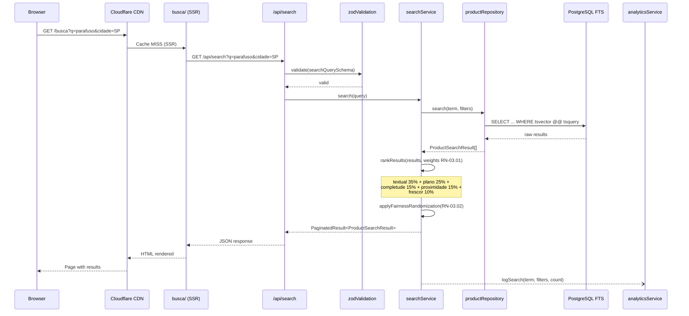

### 8.2 Envio de Inquiry (Comprador → Fornecedor)

Fluxo desde o envio da inquiry até a notificação ao fornecedor.

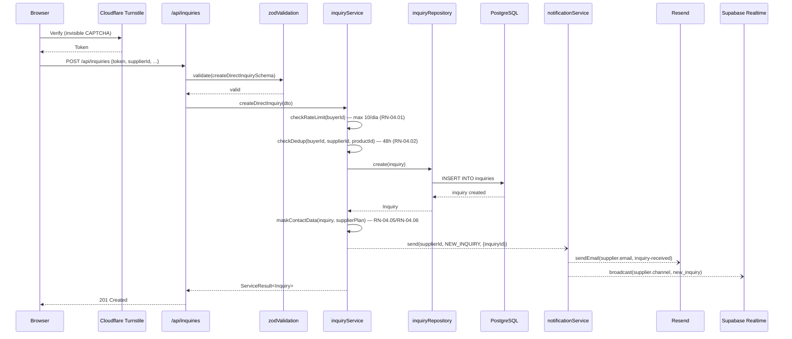

### 8.3 Desbloqueio de Lead [MON]

Fluxo de consumo de crédito para desbloquear dados de contato do comprador.

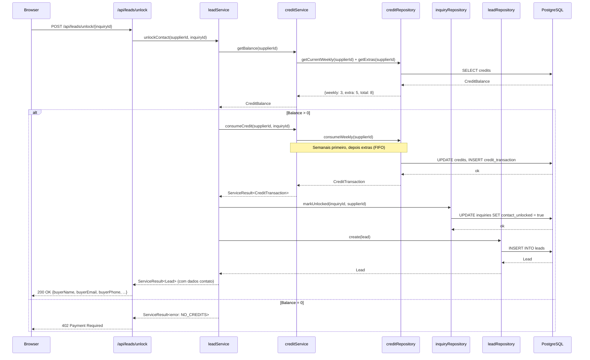

---

## 9. Matriz de Rastreabilidade

### 9.1 Domínios × Módulos RF

| Domínio | RF-01 | RF-02 | RF-03 | RF-04 | RF-05 | RF-06 | RF-07 | RF-08 | RF-09 | RF-10 | RF-11 | RF-12 | RF-13 | RF-14 |
|---------|-------|-------|-------|-------|-------|-------|-------|-------|-------|-------|-------|-------|-------|-------|
| Identity | **X** | **X** | | | | | | | | | | | | |
| Catalog | | | **X** | | | | | | | | | | | |
| Search & Discovery | | | | **X** | **X** | | | | | | | | | |
| Inquiries | | | | | | **X** | | | | | | | | |
| Leads & Distribution | | | | | | | **X** | | | | | | | |
| Monetization | | | | | | | **X** | **X** | | | | | | |
| Moderation & Trust | | | | | | | | | | | **X** | **X** | | |
| Notifications & Analytics | | | | | | | | | **X** | **X** | | **X** | **X** | |
| Cross-cutting | | | | | | | | | | | | | | **X** |

**Cobertura:** 14/14 módulos RF cobertos (100%). Cada módulo tem pelo menos um domínio responsável.

### 9.2 Domínios × Grupos RN

| Domínio | RN-01 | RN-02 | RN-03 | RN-04 | RN-05 | RN-06 | RN-07 | RN-08 | RN-09 | RN-10 |
|---------|-------|-------|-------|-------|-------|-------|-------|-------|-------|-------|
| Identity | **X** | **X** | | | | | | | | |
| Catalog | | **X** | | | | | | | | |
| Search & Discovery | | | **X** | | | | | | | |
| Inquiries | | | | **X** | | | | | | |
| Leads & Distribution | | | | | **X** | | | | | |
| Monetization | | | | | **X** | **X** | | **X** | | |
| Moderation & Trust | | | | | | | **X** | | | |
| Notifications & Analytics | | | | | | | | | **X** | **X** |
| Cross-cutting | | | | | | | | | | |

**Cobertura:** 10/10 grupos RN cobertos (100%).

### 9.3 Domínios × Categorias RNF

| Domínio | Performance | Escalabilidade | Confiabilidade | Segurança | Privacidade | Acessibilidade | Compat. | SEO | Observab. | DevOps | Backup |
|---------|-------------|----------------|----------------|-----------|-------------|----------------|---------|-----|-----------|--------|--------|
| | RNF-01 | RNF-02 | RNF-03 | RNF-04 | RNF-05 | RNF-06 | RNF-07 | RNF-08 | RNF-09 | RNF-10 | RNF-11 |
| Identity | | | | **X** | **X** | | | | | | |
| Catalog | **X** | **X** | | | | | | | | | **X** |
| Search | **X** | **X** | | | | | | **X** | **X** | | |
| Inquiries | **X** | | | | **X** | | | | | | |
| Leads | | | | | | | | | | | |
| Monetization | | | **X** | **X** | | | | | | | **X** |
| Moderation | | | | **X** | **X** | | | | | | |
| Notifications | | | **X** | | | | | | **X** | | |
| Cross-cutting | **X** | | **X** | **X** | | **X** | **X** | | **X** | **X** | |

**Cobertura:** 11/11 categorias RNF cobertos (100%).

---

## 10. Decisões de Componentização

### DC-01: Organização por domínio sobre camada técnica

**Decisão:** Services e repositories de um mesmo domínio ficam na mesma pasta (`lib/{domínio}/`), não separados por camada (`lib/services/`, `lib/db/`).

**Justificativa:** Coesão por capacidade de negócio. Cada pasta de domínio é uma unidade coesa que pode ser extraída para microserviço no futuro (ADR-01: monolito modular). O 2.6 organiza por domínio (7 domínios). O 2.4 já indica que `lib/` organiza "por funcionalidade".

**Relação ADR:** ADR-01 (monolito modular com extração futura).

> Pendência CTO-01: Apresentadas duas opções (seção 5). Vitor confirma antes da implementação.

### DC-02: Critério para dividir um componente

**Decisão:** Um service deve ser dividido quando:
- Tem >5 métodos públicos com responsabilidades claramente distintas
- Opera em lifecycle phases diferentes (ex: MVP vs MON)
- Tem dependências externas próprias (ex: Stripe SDK)

**Exemplo aplicado:** `inquiryService` (MVP) e `distributionService` (MON) são services separados mesmo pertencendo ao mesmo domínio no 2.6, porque operam em fases diferentes e têm dependências distintas.

### DC-03: Helper vs Service

**Decisão:**
- **Service:** Tem estado (ou gerencia estado via repo), tem dependências externas, ou é chamado cross-domain
- **Helper/utility:** Função pura, sem side effects, sem dependências externas

**Exemplos:**
- `slug.ts` → helper (pura transformação string)
- `searchService.ts` → service (depende de repo + ranking + analytics)
- `result.ts` → utility type (ServiceResult<T>)

### DC-04: Compartilhados (cross-cutting)

**Decisão:** `lib/validation/` e `lib/utils/` permanecem cross-cutting (fora dos domínios) porque:
- Schemas Zod são compartilhados entre frontend e backend (validação client + server)
- Utils são funções puras sem lógica de domínio

### DC-05: API routes como thin controllers

**Decisão:** API routes contêm APENAS:
1. Validação de input (Zod schema)
2. Chamada ao service
3. Formatação da response

**Justificativa:** Zero lógica de negócio em routes. Facilita testing (unit test no service, integration test na route). Consistente com 2.6 seção 9.2.

```typescript
// Exemplo: POST /api/inquiries/route.ts
export async function POST(req: Request) {
  const body = await req.json()
  const parsed = createDirectInquirySchema.safeParse(body)
  if (!parsed.success) return NextResponse.json(parsed.error, { status: 400 })

  const result = await inquiryService.createDirectInquiry(parsed.data)
  if (!result.success) return NextResponse.json(result.error, { status: mapErrorStatus(result.error) })

  return NextResponse.json(result.data, { status: 201 })
}
```

### DC-06: Dois algoritmos de ranking independentes

**Decisão:** Busca (RN-03.01) e Distribuição (RN-05.04) são implementados como componentes separados em domínios separados (Search vs Leads), com constantes de peso em arquivos dedicados (`ranking.ts` e `distribution.ts`).

**Justificativa:** São algoritmos com propósitos distintos (relevância de busca vs elegibilidade de distribuição), pesos diferentes, contextos de execução diferentes (síncrono vs job), e fases diferentes (MVP vs MON). Misturá-los criaria acoplamento desnecessário.

### DC-07: External service wrappers

**Decisão:** Cada serviço externo tem um thin wrapper no domínio correspondente:
- `lib/monetization/stripeClient.ts` — Stripe SDK
- `lib/notifications/resendClient.ts` — Resend SDK
- `lib/identity/cnpjClient.ts` — BrasilAPI/ReceitaWS

**Justificativa:** Isola dependências de SDK. Facilita mock em testes. Permite trocar provider (ex: ReceitaWS → BrasilAPI) sem impactar services.

### DC-08: Padrão de execução de jobs

**Decisão:** Jobs são documentados como `<<job>>` com interface padronizada. MVP usa Supabase Edge Functions (cron-like). Quando jobs escalarem além da capacidade das Edge Functions, migrar para BullMQ + Redis.

**Inventário de jobs (7 total):**

| Job | Domínio | Fase | Frequência | Descrição |
|-----|---------|------|-----------|-----------|
| autoVerifyCNPJJob | Moderation | MVP | On-register | Validação CNPJ no cadastro |
| revalidateCNPJJob | Moderation | MVP | Cada 90 dias | Revalidação periódica CNPJs |
| autoArchiveStaleJob | Inquiries | [VAL] | Diário | Arquiva inquiries sem visualização >30d |
| bulkImportJob | Catalog | [VAL] | On-demand | Importação CSV/XLSX de produtos |
| distributeInquiryJob | Leads | [MON] | On-inquiry | Distribui inquiry genérica em 3 rodadas |
| handleExpiredQueueJob | Leads | [MON] | Periódico | Trata inquiries não aceitas após rodadas |
| allocateWeeklyCreditsJob | Monetization | [MON] | Dom 00:01 BRT | Aloca créditos semanais por plano |

**Interface padrão:**

```typescript
interface JobHandler {
  name: string
  schedule?: string          // Cron expression (se periódico)
  execute(payload?: unknown): Promise<ServiceResult<void>>
}
```

**Evolução planejada:**
- **MVP/VAL:** Supabase Edge Functions (2 jobs)
- **MON:** Supabase Edge Functions + cron pg_cron para allocateWeeklyCredits (5 jobs)
- **ESC:** Avaliar migração para BullMQ + Redis se volume justificar

---

## 11. Pendências e Observações

### 11.1 Pendências herdadas (REFERENCIA §17)

| ID | Pendência | Prioridade | Responsável | Impacto no componente |
|----|-----------|-----------|-------------|----------------------|
| P-01 | ORM: Prisma vs Drizzle | Alta | CTO (Vitor) | Todos os 14 repositories |
| P-02 | Backend stack: Node.js vs Python/FastAPI | Alta | CTO (Vitor) | Toda camada service/API (se Python, reescrever lib/) |
| P-03 | API CNPJ: BrasilAPI vs ReceitaWS | Média | Avaliação técnica | `lib/identity/cnpjClient.ts` |

### 11.2 Pendências novas

| ID | Pendência | Prioridade | Responsável | Descrição |
|----|-----------|-----------|-------------|-----------|
| CTO-01 | Convenção diretórios `lib/` | Alta | CTO (Vitor) | Opção A (domínio) vs Opção B (camada) — seção 5 |
| CTO-02 | Job runner MVP | Média | CTO (Vitor) | Supabase Edge Functions vs pg_cron vs cron externo |
| CTO-03 | Cloudflare R2 vs Supabase Storage | Média | Análise de custo | ADR-02 recomenda R2, mas requer avaliação de custo final |

### 11.3 Decisões já tomadas (NÃO são pendências)

- Monolito modular Next.js (ADR-01)
- Cloudflare R2 para imagens (ADR-02)
- SSG/ISR para SEO (ADR-03)
- RLS no Supabase (ADR-04)
- PostHog cookieless (ADR-05)
- PWA (ADR-06)
- App Router (ADR-07)
- Vitest para testes (ADR-08)
- Repository Pattern, Result Pattern, DTO Pattern
- `as const` union types (não `enum`)
- Threshold denúncias: 3 advertência / 5 suspensão, via `system_configs`
- Pesos busca RN-03.01: textual 35%, plano 25%, completude 15%, proximidade 15%, frescor 10%
- Pesos distribuição RN-05.04: categoria 35%, proximidade 25%, tempo resposta 20%, saturação 10%, completude 10%
- Créditos semanais expiram domingo 00:01 BRT, extras 90 dias
- Free = ausência de plano (não registro em `plans`)

### 11.4 A/B testing pós-launch

| Componente | Teste | Impacto |
|-----------|-------|---------|
| searchService | Pesos RN-03.01 | Relevância dos resultados |
| distributionService | Pesos RN-05.04 | Fairness da distribuição |
| distributionService | Intervalo entre rodadas (4h provisório) | Tempo de resposta fornecedor |
| inquiryService | Limite diário buyer (10/dia) | Volume vs spam |

### 11.5 Observações de design

1. **Notifications como bottleneck:** O domínio Notifications é chamado por 5 outros domínios. Se o volume de emails crescer, considerar fila assíncrona (BullMQ) para desacoplar o envio do fluxo principal.

2. **Identity como fundação:** Qualquer mudança no Identity (supplierService, profileRepository) pode impactar 5 domínios dependentes. Mudanças nesse domínio requerem atenção redobrada a interfaces públicas.

3. **Consistência com 2.4:** A árvore de diretórios do 2.4 usa `lib/db/`, `lib/auth/`, `lib/search/` (camada). Este documento propõe `lib/identity/`, `lib/catalog/`, etc. (domínio). A reconciliação é a pendência CTO-01.

4. **MVP sem pagamento:** Domínios Leads & Distribution e Monetization não existem no MVP. Seus componentes devem ser implementados de forma que não afetem o código MVP existente (princípio de extensão sem modificação).

---

## Resumo Quantitativo

| Métrica | Valor |
|---------|-------|
| Domínios | 9 |
| Componentes totais | 104 |
| Services | 15 |
| Repositories | 14 |
| Schemas Zod | 20 |
| API Route groups | 18 |
| Pages | 15 |
| Middleware | 5 |
| Jobs | 7 |
| External services | 10 |
| Diagramas Mermaid | 14 |
| Interfaces cross-domain | 15 |
| MVP components | 75 (72%) |
| [MON] components | 23 (22%) |

---

*Próximo artefato: **3.2 Diagramas de Sequência** (Fase 3 — Detalhamento)*
