# 3.2 Diagramas de Sequência

| Campo | Valor |
|-------|-------|
| **Artefato** | 3.2 — Diagramas de Sequência |
| **Fase** | 3 — Detalhamento (segundo artefato) |
| **Data** | 04/04/2026 |
| **Versão** | 1.1 |
| **Dependências** | REFERENCIA_CONSOLIDADA, 3.1 Componentes, 2.4 Arquitetura, 2.6 Classes, 2.5 ERD, 2.1 Casos de Uso, 2.2 User Stories, 1.4 RFs, 1.6 RNs, 2.7 Jornada Comprador, 2.8 Jornada Fornecedor, 1.7 Scope Lock, DNA |

## Resumo Executivo

Este artefato documenta os **19 fluxos de interação detalhados** entre componentes, serviços externos e atores para todos os cenários críticos do GiroB2B. Enquanto o artefato 3.1 (Diagrama de Componentes) mostra a visão **estática** — quais componentes existem e como se organizam —, este artefato complementa com a visão **dinâmica**: como os componentes interagem ao longo do tempo em cada cenário.

Os 19 cenários (SEQ-01 a SEQ-19) estão organizados em 7 grupos temáticos e cobrem **23 dos 33 Use Cases** documentados no 2.1 (v1.1). Os 10 UCs não cobertos são operações CRUD simples ou painéis admin sem interação cross-domain significativa (justificativa na seção 9). Cada diagrama inclui o fluxo principal, fluxos alternativos (`alt`/`opt`), tratamento de erros (`break`) e notas de implementação para o dev.

**Nota sobre o 3.1:** O artefato 3.1 (seção 8) contém 3 `sequenceDiagram` resumidos para ilustrar a comunicação entre componentes: Busca (8.1), Inquiry (8.2) e Desbloqueio de Lead (8.3). Este artefato **não duplica** esses diagramas — os **expande** com cenários completos, fluxos alternativos, tratamento de erros e edge cases. Os diagramas do 3.1 são referenciados como "versão simplificada" nos SEQs correspondentes (SEQ-06, SEQ-07, SEQ-11).

---

## 1. Convenções

### 1.1 Formato dos Diagramas

- Todos os diagramas usam `sequenceDiagram` Mermaid com `autonumber`
- Participantes usam nomes dos componentes reais do 3.1 (services, repositories, middleware)
- Métodos chamados correspondem às assinaturas documentadas no 2.6

### 1.2 Participantes Padronizados

| Alias | Componente | Domínio |
|-------|-----------|---------|
| B | Browser (comprador ou fornecedor) | — |
| CDN | Cloudflare CDN | External |
| Turn | Cloudflare Turnstile | External |
| AM | authMiddleware | Cross-cutting |
| RL | rateLimitMiddleware | Cross-cutting |
| ZV | zodValidation | Cross-cutting |
| AS | authService | Identity |
| SS | supplierService | Identity |
| PS | productService | Catalog |
| SearchS | searchService | Search |
| SeoS | seoService | Search |
| IS | inquiryService | Inquiries |
| DS | distributionService | Leads [MON] |
| LS | leadService | Leads [MON] |
| SubS | subscriptionService | Monetization [MON] |
| CrS | creditService | Monetization [MON] |
| BillS | billingService | Monetization [MON] |
| MS | moderationService | Moderation |
| NS | notificationService | Notifications |
| AnS | analyticsService | Notifications |
| SR | supplierRepository | Identity |
| PR | productRepository | Catalog |
| IR | inquiryRepository | Inquiries |
| LR | leadRepository | Leads [MON] |
| CrR | creditRepository | Monetization [MON] |
| SubR | subscriptionRepository | Monetization [MON] |
| RepR | reportRepository | Moderation |
| SA | Supabase Auth | External |
| R2 | Cloudflare R2 | External |
| RE | Resend | External |
| RT | Supabase Realtime | External |
| ST | Stripe | External [MON] |
| BA | BrasilAPI | External |
| BR | buyerRepository | Identity |
| PG | PostgreSQL | External |

### 1.3 Notação de Fluxos

| Bloco | Uso | Exemplo |
|-------|-----|---------|
| `alt` / `else` | Condições mutuamente exclusivas | Free vs Paid |
| `opt` | Passo opcional | Upload de logo |
| `loop` | Repetição | Retry API, upload de imagens |
| `par` / `and` | Ações paralelas | Email + Realtime simultâneos |
| `break` | Saída antecipada por erro | Rate limit, validação falha |
| `Note over` | Referência a RN ou decisão | Pesos de ranking, thresholds |

### 1.4 Marcação de Fases

- Sem marcação = MVP
- `[VAL]` = Validação
- `[MON]` = Monetização
- `[ESC]` = Escala

---

## 2. Índice de Diagramas

| Código | Nome | Grupo | Fase | UCs | RFs Principais | RNs Aplicadas |
|--------|------|-------|------|-----|----------------|---------------|
| SEQ-01 | Cadastro de Usuário (Nível 1) | Identidade | MVP | UC-01 | RF-01.01, RF-01.05 | RN-01.03, RN-01.05, RN-01.13 |
| SEQ-02 | Login e Autenticação | Identidade | MVP | UC-17 | RF-01.09–10 | RN-01.03 |
| SEQ-03 | Edição de Perfil + Completude | Identidade | MVP | UC-02 | RF-02.01–04 | RN-02.01–02 |
| SEQ-04 | Cadastro de Produto com Imagens | Catálogo | MVP | UC-03 | RF-03.01–05 | RN-02.03–07 |
| SEQ-05 | Geração de Página SEO (ISR) | Catálogo | MVP | UC-25 | RF-05.01–09 | RN-03.05–06 |
| SEQ-06 | Busca com Filtros e Ranking | Busca | MVP | UC-11, UC-27 | RF-04.01–04 | RN-03.01–04 |
| SEQ-07 | Envio de Inquiry Direcionada | Inquiries | MVP | UC-13 | RF-06.01–04 | RN-04.01–02, RN-04.05 |
| SEQ-08 | Fornecedor Visualiza e Responde | Inquiries | MVP | UC-05 | RF-06.02–03 | RN-04.05–08 |
| SEQ-09 | Distribuição de Inquiry Genérica | Inquiries | VAL/MON | UC-14, UC-28 | RF-06.06 | RN-05.01–10 |
| SEQ-10 | Assinatura de Plano Pago | Monetização | MON | UC-07 | RF-07.01–02 | RN-06.04–08 |
| SEQ-11 | Desbloqueio de Lead com Crédito | Monetização | MON | UC-08 | RF-06.05 | RN-04.06, RN-05.07–09 |
| SEQ-12 | Renovação Semanal de Créditos | Monetização | MON | UC-30 | RF-07.01 | RN-05.07–08 |
| SEQ-13 | Cobrança Recorrente e Dunning | Monetização | MON | UC-29 | RF-08.01–02 | RN-06.04–06 |
| SEQ-14 | Denúncia e Moderação | Moderação | MVP | UC-06, UC-15, UC-21 | RF-11.02 | RN-07.01–05 |
| SEQ-15 | Verificação Automática de CNPJ | Sistema | MVP | UC-24 | RF-01.02–03 | RN-01.01 |
| SEQ-16 | Notificação de Perfil Incompleto | Sistema | MVP | UC-26 | RF-13.01 | RN-02.02, RN-09.01 |
| SEQ-17 | Upgrade para Fornecedor (Nível 3) | Cadastro Unificado | MVP | UC-31 | RF-01.02–04, RF-01.13 | RN-01.01, RN-01.02, RN-01.10, RN-01.11 |
| SEQ-18 | Verificação de Empresa (Comprador) | Cadastro Unificado | MVP | UC-32 | RF-01.02, RF-01.14, RF-01.16, RF-01.17 | RN-01.01, RN-01.06 |
| SEQ-19 | Filtro de Leads Verificados | Cadastro Unificado | MVP | UC-33 | RF-01.15 | RN-01.12 |

---

## 3. Grupo 1 — Identidade e Onboarding

### 3.1. SEQ-01: Cadastro de Usuário (Nível 1)

**Cenário:** Novo usuário cria conta genérica na plataforma. Não há escolha de role (comprador/fornecedor). Apenas dados básicos: email, senha, nome, telefone, cidade e estado. Resultado: conta Nível 1 que pode navegar e buscar, mas não pode enviar inquiries (precisa UC-12) nem listar produtos (precisa UC-31/SEQ-17).

**Pré-condições:**
- Nenhuma (qualquer pessoa pode se cadastrar)
- Usuário não possui conta ativa no GiroB2B

**Participantes:**

| Componente | Domínio | Estereótipo |
|-----------|---------|-------------|
| authService | Identity | `<<service>>` |
| profileRepository | Identity | `<<repository>>` |
| zodValidation | Cross-cutting | `<<middleware>>` |
| Supabase Auth | External | `<<external>>` |
| notificationService | Notifications | `<<service>>` |
| Resend | External | `<<external>>` |

**Diagrama:**

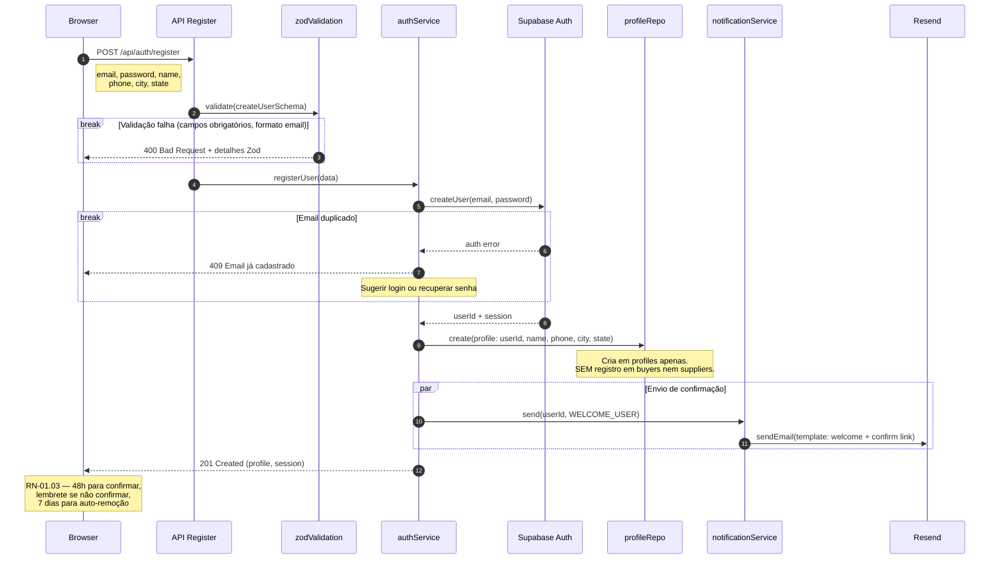
```mermaid
sequenceDiagram
    autonumber
    participant B as Browser
    participant API as API Register
    participant ZV as zodValidation
    participant AS as authService
    participant SA as Supabase Auth
    participant PR as profileRepo
    participant NS as notificationService
    participant RE as Resend

    B->>API: POST /api/auth/register
    Note right of B: email, password, name,<br/>phone, city, state
    API->>ZV: validate(createUserSchema)
    break Validação falha (campos obrigatórios, formato email)
        ZV-->>B: 400 Bad Request + detalhes Zod
    end

    API->>AS: registerUser(data)
    AS->>SA: createUser(email, password)
    break Email duplicado
        SA-->>AS: auth error
        AS-->>B: 409 Email já cadastrado
        Note over AS: Sugerir login ou recuperar senha
    end

    SA-->>AS: userId + session

    AS->>PR: create(profile: userId, name, phone, city, state)
    Note over PR: Cria em profiles apenas.<br/>SEM registro em buyers nem suppliers.

    par Envio de confirmação
        AS->>NS: send(userId, WELCOME_USER)
        NS->>RE: sendEmail(template: welcome + confirm link)
    end

    AS-->>B: 201 Created (profile, session)
    Note over B: RN-01.03 — 48h para confirmar,<br/>lembrete se não confirmar,<br/>7 dias para auto-remoção
```

**Fluxos alternativos:**

| # | Condição | Resultado | RN/UC |
|---|----------|-----------|-------|
| ALT-1 | Email já cadastrado | 409 — sugestão de login ou recuperar senha | EX-01.1 |
| ALT-2 | Senha não atende requisitos mínimos | 400 — critérios exibidos (8 chars, 1 maiúscula, 1 número) | EX-01.2 |
| ALT-3 | Validação Zod falha | 400 — campos inválidos detalhados | — |
| ALT-4 | Não confirma email em 48h | Lembrete enviado. 7 dias → conta auto-removida | FA-01.1, RN-01.03 |

**Pós-condições:**
- Conta criada no Supabase Auth **sem role específico** (Nível 1 — Usuário)
- Registro em `profiles` com dados básicos (nome, telefone, cidade, estado)
- **SEM registro em `buyers` nem `suppliers`**
- Sem CNPJ, sem dados de empresa, sem consentimento LGPD neste momento
- Usuário pode navegar, buscar produtos, ver perfis de fornecedores
- Usuário NÃO pode enviar inquiries (precisa ativação buyer, UC-12) nem listar produtos (precisa upgrade supplier, UC-31/SEQ-17)
- CPF nunca coletado (RN-01.13)

**Rastreabilidade:**
- **UCs:** UC-01
- **RFs:** RF-01.01, RF-01.05
- **RNs:** RN-01.03, RN-01.05, RN-01.13

**Notas de implementação:**
- Rota pública (sem auth middleware)
- Cadastro cria APENAS `profiles` — registros em `buyers`/`suppliers` são criados pelos fluxos de ativação (UC-12) e upgrade (UC-31/SEQ-17)
- Role do usuário é derivado da existência de registros nas tabelas `buyers`/`suppliers` (RN-01.10)
- Para se tornar buyer: precisa enviar primeira inquiry (UC-12, ativação Nível 2)
- Para se tornar supplier: precisa fazer upgrade (UC-31, SEQ-17)

---

### 3.2. SEQ-02: Login e Autenticação

**Cenário:** Usuário (fornecedor ou comprador) faz login com email/senha. O sistema valida credenciais via Supabase Auth, verifica status da conta (confirmada, ativa), emite JWT + refresh token. Inclui fluxo de refresh token para sessões expiradas.

**Pré-condições:**
- Conta existente no sistema
- Email confirmado (para acesso completo)

**Participantes:**

| Componente | Domínio | Estereótipo |
|-----------|---------|-------------|
| rateLimitMiddleware | Cross-cutting | `<<middleware>>` |
| authService | Identity | `<<service>>` |
| Supabase Auth | External | `<<external>>` |

**Diagrama:**

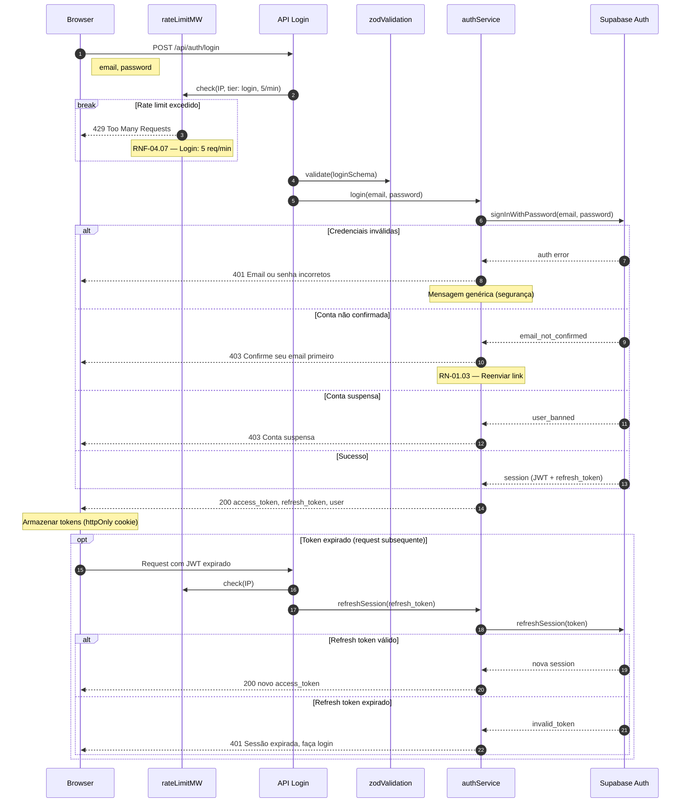
```mermaid
sequenceDiagram
    autonumber
    participant B as Browser
    participant RL as rateLimitMW
    participant API as API Login
    participant ZV as zodValidation
    participant AS as authService
    participant SA as Supabase Auth

    B->>API: POST /api/auth/login
    Note right of B: email, password
    API->>RL: check(IP, tier: login, 5/min)
    break Rate limit excedido
        RL-->>B: 429 Too Many Requests
        Note over RL: RNF-04.07 — Login: 5 req/min
    end

    API->>ZV: validate(loginSchema)
    API->>AS: login(email, password)
    AS->>SA: signInWithPassword(email, password)

    alt Credenciais inválidas
        SA-->>AS: auth error
        AS-->>B: 401 Email ou senha incorretos
        Note over AS: Mensagem genérica (segurança)
    else Conta não confirmada
        SA-->>AS: email_not_confirmed
        AS-->>B: 403 Confirme seu email primeiro
        Note over AS: RN-01.03 — Reenviar link
    else Conta suspensa
        SA-->>AS: user_banned
        AS-->>B: 403 Conta suspensa
    else Sucesso
        SA-->>AS: session (JWT + refresh_token)
    end

    AS-->>B: 200 access_token, refresh_token, user
    Note over B: Armazenar tokens (httpOnly cookie)

    opt Token expirado (request subsequente)
        B->>API: Request com JWT expirado
        API->>RL: check(IP)
        API->>AS: refreshSession(refresh_token)
        AS->>SA: refreshSession(token)
        alt Refresh token válido
            SA-->>AS: nova session
            AS-->>B: 200 novo access_token
        else Refresh token expirado
            SA-->>AS: invalid_token
            AS-->>B: 401 Sessão expirada, faça login
        end
    end
```

**Fluxos alternativos:**

| # | Condição | Resultado | Referência |
|---|----------|-----------|-----------|
| ALT-1 | Rate limit excedido (5/min) | 429 — aguardar cooldown | RNF-04.07 |
| ALT-2 | Credenciais inválidas | 401 — mensagem genérica | Segurança |
| ALT-3 | Email não confirmado | 403 — oferecer reenvio | RN-01.03 |
| ALT-4 | Conta suspensa | 403 — contato suporte | RN-07.05 |
| ALT-5 | Refresh token expirado | 401 — redirect para login | — |

**Pós-condições:**
- JWT emitido (validade curta, ~1h)
- Refresh token armazenado (validade longa, ~7d)
- Sessão ativa no Supabase Auth

**Rastreabilidade:**
- **UCs:** UC-17
- **RFs:** RF-01.09, RF-01.10
- **RNs:** RN-01.03
- **RNFs:** RNF-04.01, RNF-04.02, RNF-04.04, RNF-04.07

**Notas de implementação:**
- Supabase Auth gerencia bcrypt (cost 10+), JWT e refresh token nativamente
- Rate limit por IP no tier `login` (5 req/min). Após 5 falhas → delay 30s; após 10 → block 15min
- Nunca revelar se o email existe ou não (mensagem genérica "Email ou senha incorretos")
- Tokens via httpOnly cookie (não localStorage) para proteção contra XSS

---

### 3.3. SEQ-03: Edição de Perfil com Recálculo de Completude

**Cenário:** Fornecedor atualiza dados do perfil (nome fantasia, descrição, logo, endereço, categorias, etc.). O sistema valida, persiste, recalcula a completude conforme RN-02.01, e o novo score impacta o ranking de busca.

**Pré-condições:**
- Fornecedor autenticado com email confirmado
- Perfil existente em `suppliers`

**Participantes:**

| Componente | Domínio | Estereótipo |
|-----------|---------|-------------|
| authMiddleware | Cross-cutting | `<<middleware>>` |
| supplierService | Identity | `<<service>>` |
| supplierRepository | Identity | `<<repository>>` |
| Cloudflare R2 | External | `<<external>>` |

**Diagrama:**

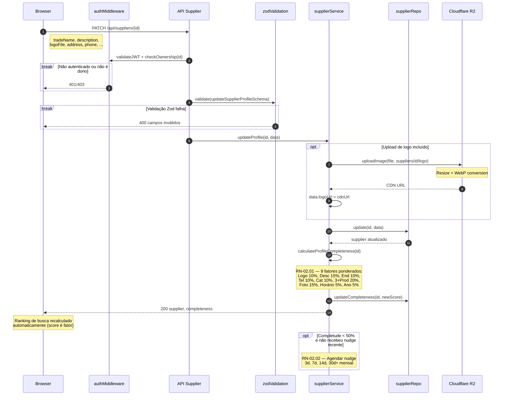
```mermaid
sequenceDiagram
    autonumber
    participant B as Browser
    participant AM as authMiddleware
    participant API as API Supplier
    participant ZV as zodValidation
    participant SS as supplierService
    participant SR as supplierRepo
    participant R2 as Cloudflare R2

    B->>API: PATCH /api/suppliers/{id}
    Note right of B: tradeName, description,<br/>logoFile, address, phone, ...
    API->>AM: validateJWT + checkOwnership(id)
    break Não autenticado ou não é dono
        AM-->>B: 401/403
    end

    API->>ZV: validate(updateSupplierProfileSchema)
    break Validação Zod falha
        ZV-->>B: 400 campos inválidos
    end

    API->>SS: updateProfile(id, data)

    opt Upload de logo incluído
        SS->>R2: uploadImage(file, suppliers/id/logo)
        Note over R2: Resize + WebP conversion
        R2-->>SS: CDN URL
        SS->>SS: data.logoUrl = cdnUrl
    end

    SS->>SR: update(id, data)
    SR-->>SS: supplier atualizado

    SS->>SS: calculateProfileCompleteness(id)
    Note over SS: RN-02.01 — 9 fatores ponderados:<br/>Logo 10%, Desc 15%, End 10%,<br/>Tel 10%, Cat 10%, 3+Prod 20%,<br/>Foto 15%, Horário 5%, Ano 5%
    SS->>SR: updateCompleteness(id, newScore)

    SS-->>B: 200 supplier, completeness
    Note over B: Ranking de busca recalculado<br/>automaticamente (score é fator)

    opt Completude < 50% e não recebeu nudge recente
        Note over SS: RN-02.02 — Agendar nudge<br/>3d, 7d, 14d, 30d+ mensal
    end
```

**Fluxos alternativos:**

| # | Condição | Resultado | RN |
|---|----------|-----------|-----|
| ALT-1 | JWT inválido/expirado | 401 → refresh ou login | — |
| ALT-2 | Supplier ID diferente do JWT | 403 — sem permissão | RLS |
| ALT-3 | Validação Zod falha | 400 — campos detalhados | — |
| ALT-4 | Upload de imagem falha (formato/tamanho) | 422 — aceitar apenas JPG/PNG/WebP, max 5MB | RF-02.03 |

**Pós-condições:**
- Dados do perfil atualizados em `suppliers`
- `profile_completeness` recalculado e persistido
- Logo no Cloudflare R2 (se enviada)
- Ranking de busca reflete novo score de completude

**Rastreabilidade:**
- **UCs:** UC-02
- **RFs:** RF-02.01, RF-02.02, RF-02.03, RF-02.04
- **RNs:** RN-02.01, RN-02.02

**Notas de implementação:**
- Partial update: apenas campos enviados são atualizados (spread + merge)
- Logo upload: processar resize server-side antes de enviar ao R2 (max 500x500px, WebP)
- Completude é calculated e stored (não computed on-read) por ser fator de ranking (performance)
- Invalidar cache ISR da página pública do fornecedor após update

---

## 4. Grupo 2 — Catálogo

### 4.1. SEQ-04: Cadastro de Produto com Imagens

**Cenário:** Fornecedor cria um produto com nome, descrição, categoria, fotos. O sistema valida, faz upload das imagens para R2, persiste o produto, atualiza o FTS (search_vector), recalcula completude do perfil e dispara revalidação ISR da página SEO.

**Pré-condições:**
- Fornecedor autenticado com email confirmado
- Categoria válida existente no sistema

**Participantes:**

| Componente | Domínio | Estereótipo |
|-----------|---------|-------------|
| authMiddleware | Cross-cutting | `<<middleware>>` |
| productService | Catalog | `<<service>>` |
| productRepository | Catalog | `<<repository>>` |
| supplierService | Identity | `<<service>>` |
| Cloudflare R2 | External | `<<external>>` |
| PostgreSQL | External | `<<external>>` |

**Diagrama:**

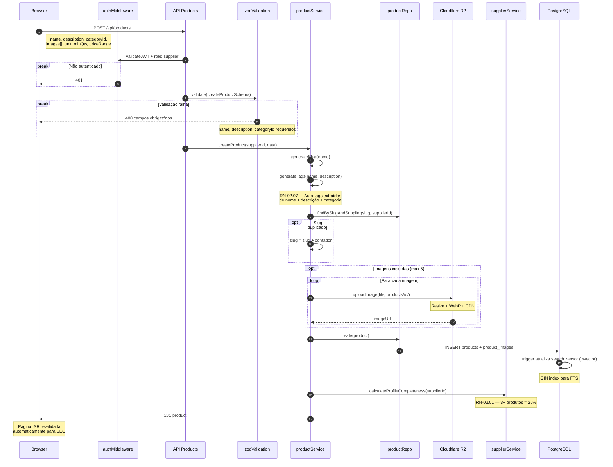
```mermaid
sequenceDiagram
    autonumber
    participant B as Browser
    participant AM as authMiddleware
    participant API as API Products
    participant ZV as zodValidation
    participant PS as productService
    participant PR as productRepo
    participant R2 as Cloudflare R2
    participant SS as supplierService
    participant PG as PostgreSQL

    B->>API: POST /api/products
    Note right of B: name, description, categoryId,<br/>images[], unit, minQty, priceRange
    API->>AM: validateJWT + role: supplier
    break Não autenticado
        AM-->>B: 401
    end

    API->>ZV: validate(createProductSchema)
    break Validação falha
        ZV-->>B: 400 campos obrigatórios
        Note over ZV: name, description, categoryId requeridos
    end

    API->>PS: createProduct(supplierId, data)
    PS->>PS: generateSlug(name)
    PS->>PS: generateTags(name, description)
    Note over PS: RN-02.07 — Auto-tags extraídos<br/>de nome + descrição + categoria

    PS->>PR: findBySlugAndSupplier(slug, supplierId)
    opt Slug duplicado
        PS->>PS: slug = slug + contador
    end

    opt Imagens incluídas (max 5)
        loop Para cada imagem
            PS->>R2: uploadImage(file, products/id/)
            Note over R2: Resize + WebP + CDN
            R2-->>PS: imageUrl
        end
    end

    PS->>PR: create(product)
    PR->>PG: INSERT products + product_images
    PG->>PG: trigger atualiza search_vector (tsvector)
    Note over PG: GIN index para FTS

    PS->>SS: calculateProfileCompleteness(supplierId)
    Note over SS: RN-02.01 — 3+ produtos = 20%

    PS-->>B: 201 product
    Note over B: Página ISR revalidada<br/>automaticamente para SEO
```

**Fluxos alternativos:**

| # | Condição | Resultado | RN |
|---|----------|-----------|-----|
| ALT-1 | Campos obrigatórios faltando | 400 — name, description, categoryId | RF-03.01 |
| ALT-2 | Imagem formato inválido | 422 — apenas JPG/PNG/WebP, max 5MB | RF-03.01 |
| ALT-3 | Mais de 5 imagens | 422 — limite de 5 fotos por produto | RF-03.01 |
| ALT-4 | Slug duplicado (mesmo nome + supplier) | Auto-incremento no slug | — |
| ALT-5 | Categoria inexistente | 400 — categoryId inválido | RN-02.04 |

**Pós-condições:**
- Produto criado em `products` com status: active
- Imagens no Cloudflare R2 com URLs CDN
- `search_vector` atualizado via trigger PostgreSQL
- `profile_completeness` do fornecedor recalculado
- Página SEO `/produto/[slug]` será gerada via ISR no próximo acesso

**Rastreabilidade:**
- **UCs:** UC-03
- **RFs:** RF-03.01, RF-03.02, RF-03.03, RF-03.05
- **RNs:** RN-02.03, RN-02.04, RN-02.07

**Notas de implementação:**
- Upload de imagens em paralelo (`Promise.all`) para performance
- Trigger PostgreSQL para `search_vector`: `tsvector_update_trigger` em name + description + tags
- Após INSERT: `revalidatePath('/produto/' + slug)` para ISR
- Sem limite de produtos por fornecedor (RN-02.03 — ilimitado para todos os planos)

---

### 4.2. SEQ-05: Geração de Página SEO (ISR)

**Cenário:** Usuário ou Googlebot acessa uma página de produto. Cloudflare CDN verifica cache; se miss, Next.js renderiza via ISR com dados do banco, gera meta tags e structured data. Páginas com menos de 3 resultados recebem `noindex`.

**Pré-condições:**
- Produto/fornecedor/categoria existe e está ativo
- Rota pública (sem autenticação)

**Participantes:**

| Componente | Domínio | Estereótipo |
|-----------|---------|-------------|
| Cloudflare CDN | External | `<<external>>` |
| seoService | Search | `<<service>>` |
| productRepository | Catalog | `<<repository>>` |
| supplierRepository | Identity | `<<repository>>` |
| categoryRepository | Catalog | `<<repository>>` |

**Diagrama:**

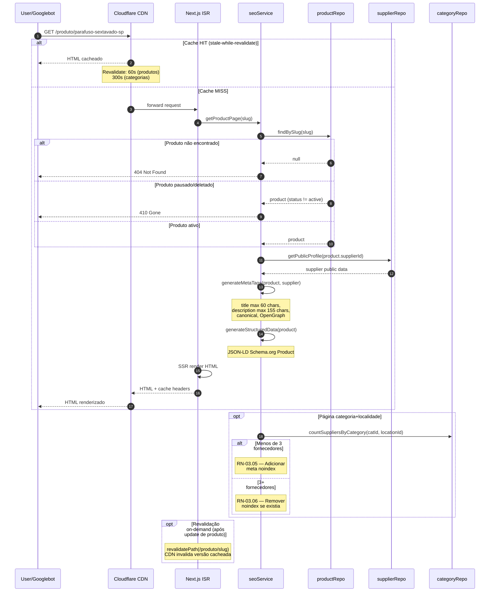
```mermaid
sequenceDiagram
    autonumber
    participant U as User/Googlebot
    participant CDN as Cloudflare CDN
    participant NJ as Next.js ISR
    participant SeoS as seoService
    participant PR as productRepo
    participant SR as supplierRepo
    participant CR as categoryRepo

    U->>CDN: GET /produto/parafuso-sextavado-sp

    alt Cache HIT (stale-while-revalidate)
        CDN-->>U: HTML cacheado
        Note over CDN: Revalidate: 60s (produtos)<br/>300s (categorias)
    else Cache MISS
        CDN->>NJ: forward request
        NJ->>SeoS: getProductPage(slug)
        SeoS->>PR: findBySlug(slug)

        alt Produto não encontrado
            PR-->>SeoS: null
            SeoS-->>U: 404 Not Found
        else Produto pausado/deletado
            PR-->>SeoS: product (status != active)
            SeoS-->>U: 410 Gone
        else Produto ativo
            PR-->>SeoS: product
        end

        SeoS->>SR: getPublicProfile(product.supplierId)
        SR-->>SeoS: supplier public data

        SeoS->>SeoS: generateMetaTags(product, supplier)
        Note over SeoS: title max 60 chars,<br/>description max 155 chars,<br/>canonical, OpenGraph
        SeoS->>SeoS: generateStructuredData(product)
        Note over SeoS: JSON-LD Schema.org Product

        NJ->>NJ: SSR render HTML
        NJ-->>CDN: HTML + cache headers
        CDN-->>U: HTML renderizado
    end

    opt Página categoria+localidade
        SeoS->>CR: countSuppliersByCategory(catId, locationId)
        alt Menos de 3 fornecedores
            Note over SeoS: RN-03.05 — Adicionar<br/>meta noindex
        else 3+ fornecedores
            Note over SeoS: RN-03.06 — Remover<br/>noindex se existia
        end
    end

    opt Revalidação on-demand (após update de produto)
        Note over NJ: revalidatePath(/produto/slug)<br/>CDN invalida versão cacheada
    end
```

**Fluxos alternativos:**

| # | Condição | Resultado | RN |
|---|----------|-----------|-----|
| ALT-1 | Cache HIT no CDN | HTML servido direto (TTFB ~50ms) | ADR-03 |
| ALT-2 | Produto não encontrado | 404 com página amigável | — |
| ALT-3 | Produto pausado/deletado | 410 Gone (sinal para Googlebot) | RN-02.05 |
| ALT-4 | Combo cat+loc com <3 suppliers | Meta noindex adicionado | RN-03.05 |

**Pós-condições:**
- HTML cacheado no CDN por 60-300s
- Structured data (JSON-LD) presente para Googlebot
- Meta tags SEO otimizadas (title, description, canonical, OG)

**Rastreabilidade:**
- **UCs:** UC-25
- **RFs:** RF-05.01, RF-05.02, RF-05.03, RF-05.04, RF-05.05, RF-05.07, RF-05.08
- **RNs:** RN-03.05, RN-03.06
- **ADRs:** ADR-03 (SSG/ISR para SEO)

**Notas de implementação:**
- ISR com `revalidate: 60` para produtos, `300` para categorias (Next.js App Router)
- `generateStaticParams()` para as top ~1000 páginas no build; restante sob demanda
- Usar `next/metadata` para meta tags (exportar `generateMetadata()`)
- JSON-LD como `<script type="application/ld+json">` no layout

---

## 5. Grupo 3 — Busca

### 5.1. SEQ-06: Busca com Filtros e Ranking

> Versão simplificada: ver 3.1 seção 8.1 (Busca de Produto)

**Cenário:** Comprador busca produtos usando texto livre e filtros. O sistema executa FTS no PostgreSQL, aplica ranking de 5 fatores (RN-03.01), randomiza empates por fairness (RN-03.02), pagina resultados e loga a busca para analytics.

**Pré-condições:**
- Rota pública (sem autenticação obrigatória)
- Pelo menos 1 produto ativo no sistema

**Participantes:**

| Componente | Domínio | Estereótipo |
|-----------|---------|-------------|
| searchService | Search | `<<service>>` |
| productRepository | Catalog | `<<repository>>` |
| analyticsService | Notifications | `<<service>>` |
| Cloudflare CDN | External | `<<external>>` |
| PostgreSQL | External | `<<external>>` |

**Diagrama:**

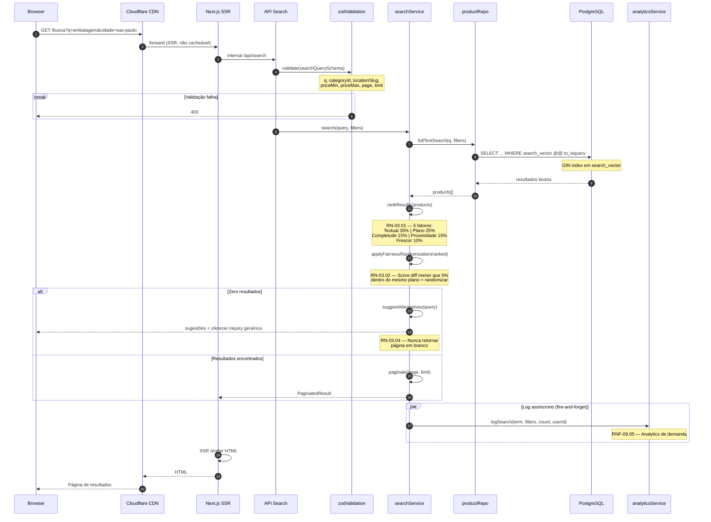
```mermaid
sequenceDiagram
    autonumber
    participant B as Browser
    participant CDN as Cloudflare CDN
    participant NJ as Next.js SSR
    participant API as API Search
    participant ZV as zodValidation
    participant SearchS as searchService
    participant PR as productRepo
    participant PG as PostgreSQL
    participant AnS as analyticsService

    B->>CDN: GET /busca?q=embalagem&cidade=sao-paulo
    CDN->>NJ: forward (SSR, não cacheável)
    NJ->>API: internal /api/search

    API->>ZV: validate(searchQuerySchema)
    Note over ZV: q, categoryId, locationSlug,<br/>priceMin, priceMax, page, limit
    break Validação falha
        ZV-->>B: 400
    end

    API->>SearchS: search(query, filters)
    SearchS->>PR: fullTextSearch(q, filters)
    PR->>PG: SELECT ... WHERE search_vector @@ to_tsquery
    Note over PG: GIN index em search_vector
    PG-->>PR: resultados brutos
    PR-->>SearchS: products[]

    SearchS->>SearchS: rankResults(products)
    Note over SearchS: RN-03.01 — 5 fatores:<br/>Textual 35% | Plano 25%<br/>Completude 15% | Proximidade 15%<br/>Frescor 10%

    SearchS->>SearchS: applyFairnessRandomization(ranked)
    Note over SearchS: RN-03.02 — Score diff menor que 5%<br/>dentro do mesmo plano = randomizar

    alt Zero resultados
        SearchS->>SearchS: suggestAlternatives(query)
        SearchS-->>B: sugestões + oferecer inquiry genérica
        Note over SearchS: RN-03.04 — Nunca retornar<br/>página em branco
    else Resultados encontrados
        SearchS->>SearchS: paginate(page, limit)
        SearchS-->>NJ: PaginatedResult
    end

    par Log assíncrono (fire-and-forget)
        SearchS->>AnS: logSearch(term, filters, count, userId)
        Note over AnS: RNF-09.05 — Analytics de demanda
    end

    NJ->>NJ: SSR render HTML
    NJ-->>CDN: HTML
    CDN-->>B: Página de resultados
```

**Fluxos alternativos:**

| # | Condição | Resultado | RN |
|---|----------|-----------|-----|
| ALT-1 | Zero resultados | Sugestões alternativas + opção inquiry genérica | RN-03.04 |
| ALT-2 | Free vs Paid no mesmo tier de relevância | Paid aparece primeiro se relevância >= 20% | RN-03.03 |
| ALT-3 | Empate de score (<5% diff, mesmo plano) | Ordem randomizada por request | RN-03.02 |
| ALT-4 | Query vazia (browse por categoria) | FTS ignorado, filtra por categoryId | RF-04.04 |

**Pós-condições:**
- HTML renderizado com resultados paginados
- Busca logada em `search_logs` para analytics
- Ranking aplicado conforme 5 fatores (RN-03.01)

**Rastreabilidade:**
- **UCs:** UC-11, UC-27
- **RFs:** RF-04.01, RF-04.02, RF-04.03, RF-04.04
- **RNs:** RN-03.01, RN-03.02, RN-03.03, RN-03.04

**Notas de implementação:**
- Busca é SSR (não cacheável por CDN): query params dinâmicos
- FTS usa `ts_rank_cd()` para o fator textual (35%)
- Pesos de plano: Premium 100pts, Pro 70pts, Starter 40pts, Free 10pts (normalizados)
- `logSearch` é fire-and-forget (não bloqueia response). `search_logs` é tabela de alto volume — considerar particionamento mensal em Escala
- Debounce no front: 300ms antes de disparar busca

---

## 6. Grupo 4 — Inquiries

### 6.1. SEQ-07: Envio de Inquiry Direcionada

> Versão simplificada: ver 3.1 seção 8.2 (Envio de Inquiry)

**Cenário:** Comprador envia cotação para um fornecedor específico. O sistema valida Turnstile (anti-spam), verifica autenticação, aplica rate limit (10/dia), checa dedup (48h), cria a inquiry com snapshot dos dados do comprador, e notifica o fornecedor via email + realtime.

**Pré-condições:**
- Fornecedor alvo existe e está ativo
- Comprador pode estar autenticado ou não (redirect se não)
- Consentimento LGPD aceito (RN-01.07)

**Participantes:**

| Componente | Domínio | Estereótipo |
|-----------|---------|-------------|
| Cloudflare Turnstile | External | `<<external>>` |
| authMiddleware | Cross-cutting | `<<middleware>>` |
| zodValidation | Cross-cutting | `<<middleware>>` |
| inquiryService | Inquiries | `<<service>>` |
| inquiryRepository | Inquiries | `<<repository>>` |
| supplierRepository | Identity | `<<repository>>` |
| notificationService | Notifications | `<<service>>` |
| Resend | External | `<<external>>` |
| Supabase Realtime | External | `<<external>>` |

**Diagrama:**

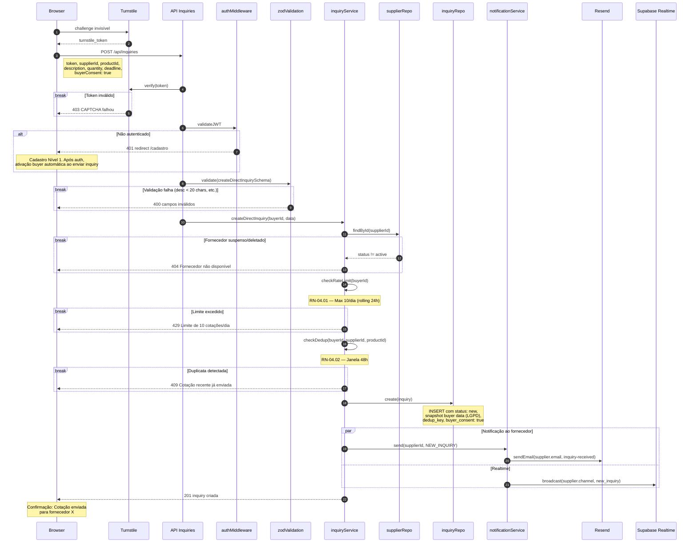
```mermaid
sequenceDiagram
    autonumber
    participant B as Browser
    participant Turn as Turnstile
    participant API as API Inquiries
    participant AM as authMiddleware
    participant ZV as zodValidation
    participant IS as inquiryService
    participant SR as supplierRepo
    participant IR as inquiryRepo
    participant NS as notificationService
    participant RE as Resend
    participant RT as Supabase Realtime

    B->>Turn: challenge invisível
    Turn-->>B: turnstile_token

    B->>API: POST /api/inquiries
    Note right of B: token, supplierId, productId,<br/>description, quantity, deadline,<br/>buyerConsent: true

    API->>Turn: verify(token)
    break Token inválido
        Turn-->>B: 403 CAPTCHA falhou
    end

    API->>AM: validateJWT
    alt Não autenticado
        AM-->>B: 401 redirect /cadastro
        Note over B: Cadastro Nível 1. Após auth,<br/>ativação buyer automática ao enviar inquiry
    end

    API->>ZV: validate(createDirectInquirySchema)
    break Validação falha (desc < 20 chars, etc.)
        ZV-->>B: 400 campos inválidos
    end

    API->>IS: createDirectInquiry(buyerId, data)

    IS->>SR: findById(supplierId)
    break Fornecedor suspenso/deletado
        SR-->>IS: status != active
        IS-->>B: 404 Fornecedor não disponível
    end

    IS->>IS: checkRateLimit(buyerId)
    Note over IS: RN-04.01 — Max 10/dia (rolling 24h)
    break Limite excedido
        IS-->>B: 429 Limite de 10 cotações/dia
    end

    IS->>IS: checkDedup(buyerId, supplierId, productId)
    Note over IS: RN-04.02 — Janela 48h
    break Duplicata detectada
        IS-->>B: 409 Cotação recente já enviada
    end

    IS->>IR: create(inquiry)
    Note over IR: INSERT com status: new,<br/>snapshot buyer data (LGPD),<br/>dedup_key, buyer_consent: true

    par Notificação ao fornecedor
        IS->>NS: send(supplierId, NEW_INQUIRY)
        NS->>RE: sendEmail(supplier.email, inquiry-received)
    and Realtime
        NS->>RT: broadcast(supplier.channel, new_inquiry)
    end

    IS-->>B: 201 inquiry criada
    Note over B: Confirmação: Cotação enviada<br/>para fornecedor X
```

**Fluxos alternativos:**

| # | Condição | Resultado | RN |
|---|----------|-----------|-----|
| ALT-1 | Turnstile falha | 403 — bot suspeito | — |
| ALT-2 | Comprador não logado | 401 → redirect cadastro → volta ao form | RF-01.07 |
| ALT-3 | Fornecedor inativo | 404 — fornecedor não disponível | — |
| ALT-4 | Rate limit 10/dia | 429 — horário de desbloqueio informado | RN-04.01 |
| ALT-5 | Dedup 48h | 409 — cotação recente já existe | RN-04.02 |
| ALT-6 | buyerConsent false | 400 — consentimento LGPD obrigatório | RN-01.07 |

**Pós-condições:**
- Inquiry criada em `inquiries` com status: `new`
- Dados do comprador snapshotados na inquiry (LGPD audit trail)
- Fornecedor notificado via email (Resend) + in-app (Realtime)
- Contagem de rate limit do comprador incrementada

**Rastreabilidade:**
- **UCs:** UC-13
- **RFs:** RF-06.01, RF-06.02, RF-06.03, RF-06.04
- **RNs:** RN-01.07, RN-04.01, RN-04.02, RN-04.05

**Notas de implementação:**
- Rate limit: contar via `SELECT COUNT(*) FROM inquiries WHERE buyer_id = ? AND created_at > NOW() - interval '24h'`
- Dedup key: hash de `buyer_id + supplier_id + product_id`, buscar na janela 48h
- Snapshot de dados do comprador no momento da criação (não FK): nome, email, phone, company, city, state
- `buyerConsent` é `CHECK (buyer_consent_to_share = true)` no PostgreSQL — impossível criar sem consentimento

---

### 6.2. SEQ-08: Fornecedor Visualiza e Responde Inquiry

**Cenário:** Fornecedor acessa inquiry no painel. O sistema retorna a inquiry com **dados de contato mascarados** (para TODOS os planos). Fornecedores free veem CTA para assinar; pagantes veem botão "Desbloquear com 1 crédito" (o desbloqueio em si é uma ação separada — SEQ-11). A primeira visualização muda o status para `viewed` e notifica o comprador.

**Pré-condições:**
- Fornecedor autenticado
- Inquiry direcionada a este fornecedor (ou distribuída via SEQ-09)

**Participantes:**

| Componente | Domínio | Estereótipo |
|-----------|---------|-------------|
| authMiddleware | Cross-cutting | `<<middleware>>` |
| inquiryService | Inquiries | `<<service>>` |
| inquiryRepository | Inquiries | `<<repository>>` |
| notificationService | Notifications | `<<service>>` |
| Resend | External | `<<external>>` |
| Supabase Realtime | External | `<<external>>` |

**Diagrama:**

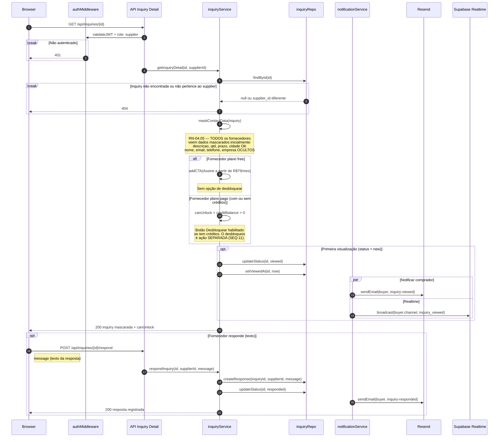
```mermaid
sequenceDiagram
    autonumber
    participant B as Browser
    participant AM as authMiddleware
    participant API as API Inquiry Detail
    participant IS as inquiryService
    participant IR as inquiryRepo
    participant NS as notificationService
    participant RE as Resend
    participant RT as Supabase Realtime

    B->>API: GET /api/inquiries/{id}
    API->>AM: validateJWT + role: supplier
    break Não autenticado
        AM-->>B: 401
    end

    API->>IS: getInquiryDetail(id, supplierId)
    IS->>IR: findById(id)

    break Inquiry não encontrada ou não pertence ao supplier
        IR-->>IS: null ou supplier_id diferente
        IS-->>B: 404
    end

    IS->>IS: maskContactData(inquiry)
    Note over IS: RN-04.05 — TODOS os fornecedores<br/>veem dados mascarados inicialmente:<br/>descricao, qtd, prazo, cidade OK<br/>nome, email, telefone, empresa OCULTOS

    alt Fornecedor plano free
        IS->>IS: addCTA(Assine a partir de R$79/mes)
        Note over IS: Sem opção de desbloquear
    else Fornecedor plano pago (com ou sem créditos)
        IS->>IS: canUnlock = creditBalance > 0
        Note over IS: Botão Desbloquear habilitado<br/>se tem créditos. O desbloqueio<br/>é ação SEPARADA (SEQ-11)
    end

    opt Primeira visualização (status = new)
        IS->>IR: updateStatus(id, viewed)
        IS->>IR: setViewedAt(id, now)
        par Notificar comprador
            NS->>RE: sendEmail(buyer, inquiry-viewed)
        and Realtime
            NS->>RT: broadcast(buyer.channel, inquiry_viewed)
        end
    end

    IS-->>B: 200 inquiry mascarada + canUnlock

    opt Fornecedor responde (texto)
        B->>API: POST /api/inquiries/{id}/respond
        Note right of B: message (texto da resposta)
        API->>IS: respondInquiry(id, supplierId, message)
        IS->>IR: createResponse(inquiryId, supplierId, message)
        IS->>IR: updateStatus(id, responded)
        NS->>RE: sendEmail(buyer, inquiry-responded)
        IS-->>B: 200 resposta registrada
    end
```

**Fluxos alternativos:**

| # | Condição | Resultado | RN |
|---|----------|-----------|-----|
| ALT-1 | Inquiry não pertence ao supplier | 404 | RLS |
| ALT-2 | Fornecedor free | Dados mascarados + CTA assinatura | RN-04.05 |
| ALT-3 | Fornecedor paid com créditos | Dados mascarados + botão Desbloquear ativo | RN-04.05 |
| ALT-4 | Fornecedor paid sem créditos | Dados mascarados + botão Desbloquear desabilitado + CTA comprar extras | RN-04.07 |
| ALT-5 | Já visualizada (status != new) | Retorna dados sem mudar status | — |

**Pós-condições:**
- Status da inquiry: `viewed` (se era `new`)
- Comprador notificado da visualização (email + realtime)
- Dados de contato permanecem mascarados até desbloqueio explícito (SEQ-11)

**Rastreabilidade:**
- **UCs:** UC-05
- **RFs:** RF-06.02, RF-06.03, RF-06.04
- **RNs:** RN-04.05, RN-04.07, RN-04.08

**Notas de implementação:**
- `maskContactData` zera campos: buyer_name, buyer_email, buyer_phone, buyer_company → substituir por "***"
- Verificar `contact_unlocked` flag: se já desbloqueado, retornar dados completos
- Status transition: `new → viewed` é idempotente (segunda visualização não muda nada)
- Resposta textual é opcional no MVP; não substitui o desbloqueio de dados

---

### 6.3. SEQ-09: Distribuição de Inquiry Genérica [VAL/MON]

**Cenário:** Comprador envia inquiry genérica (sem fornecedor específico). O sistema distribui em 3 rodadas por tier de plano: Premium (h0), Pro (h4), Starter (h8), usando o algoritmo de ranking RN-05.04 (independente do ranking de busca RN-03.01). Máximo 5 fornecedores por inquiry.

**Pré-condições:**
- Inquiry genérica criada (tipo: `generic`, com categoryId)
- Fornecedores ativos na categoria existem
- [VAL] para inquiry genérica, [MON] para créditos/desbloqueio

**Participantes:**

| Componente | Domínio | Estereótipo |
|-----------|---------|-------------|
| inquiryService | Inquiries | `<<service>>` |
| distributionService | Leads [MON] | `<<service>>` |
| subscriptionService | Monetization [MON] | `<<service>>` |
| supplierRepository | Identity | `<<repository>>` |
| inquiryRepository | Inquiries | `<<repository>>` |
| notificationService | Notifications | `<<service>>` |
| Resend | External | `<<external>>` |
| Supabase Realtime | External | `<<external>>` |

**Diagrama:**

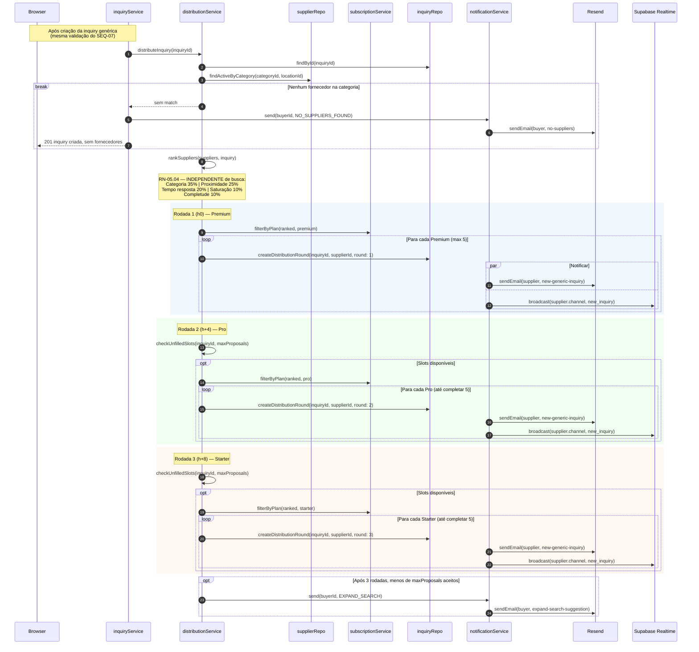
```mermaid
sequenceDiagram
    autonumber
    participant B as Browser
    participant IS as inquiryService
    participant DS as distributionService
    participant SR as supplierRepo
    participant SubS as subscriptionService
    participant IR as inquiryRepo
    participant NS as notificationService
    participant RE as Resend
    participant RT as Supabase Realtime

    Note over B,IS: Após criação da inquiry genérica<br/>(mesma validação do SEQ-07)

    IS->>DS: distributeInquiry(inquiryId)
    DS->>IR: findById(inquiryId)
    DS->>SR: findActiveByCategory(categoryId, locationId)

    break Nenhum fornecedor na categoria
        DS-->>IS: sem match
        IS->>NS: send(buyerId, NO_SUPPLIERS_FOUND)
        NS->>RE: sendEmail(buyer, no-suppliers)
        IS-->>B: 201 inquiry criada, sem fornecedores
    end

    DS->>DS: rankSuppliers(suppliers, inquiry)
    Note over DS: RN-05.04 — INDEPENDENTE de busca:<br/>Categoria 35% | Proximidade 25%<br/>Tempo resposta 20% | Saturação 10%<br/>Completude 10%

    rect rgb(240, 248, 255)
        Note over DS: Rodada 1 (h0) — Premium
        DS->>SubS: filterByPlan(ranked, premium)
        loop Para cada Premium (max 5)
            DS->>IR: createDistributionRound(inquiryId, supplierId, round: 1)
            par Notificar
                NS->>RE: sendEmail(supplier, new-generic-inquiry)
            and
                NS->>RT: broadcast(supplier.channel, new_inquiry)
            end
        end
    end

    rect rgb(240, 255, 240)
        Note over DS: Rodada 2 (h+4) — Pro
        DS->>DS: checkUnfilledSlots(inquiryId, maxProposals)
        opt Slots disponíveis
            DS->>SubS: filterByPlan(ranked, pro)
            loop Para cada Pro (até completar 5)
                DS->>IR: createDistributionRound(inquiryId, supplierId, round: 2)
                NS->>RE: sendEmail(supplier, new-generic-inquiry)
                NS->>RT: broadcast(supplier.channel, new_inquiry)
            end
        end
    end

    rect rgb(255, 248, 240)
        Note over DS: Rodada 3 (h+8) — Starter
        DS->>DS: checkUnfilledSlots(inquiryId, maxProposals)
        opt Slots disponíveis
            DS->>SubS: filterByPlan(ranked, starter)
            loop Para cada Starter (até completar 5)
                DS->>IR: createDistributionRound(inquiryId, supplierId, round: 3)
                NS->>RE: sendEmail(supplier, new-generic-inquiry)
                NS->>RT: broadcast(supplier.channel, new_inquiry)
            end
        end
    end

    opt Após 3 rodadas, menos de maxProposals aceitos
        DS->>NS: send(buyerId, EXPAND_SEARCH)
        NS->>RE: sendEmail(buyer, expand-search-suggestion)
    end
```

**Fluxos alternativos:**

| # | Condição | Resultado | RN |
|---|----------|-----------|-----|
| ALT-1 | Nenhum fornecedor na categoria | Buyer notificado, inquiry fica aberta | RN-05.01 |
| ALT-2 | Premium preenche todas as vagas na R1 | R2 e R3 não executam | RN-05.02 |
| ALT-3 | Fornecedor com saturação > 80% | Penalizado no ranking (RN-05.05) | RN-05.05 |
| ALT-4 | Fornecedor ignora (não aceita) | Slot liberado para próxima rodada | — |
| ALT-5 | Menos de 5 fornecedores totais | Distribui para quantos existirem | RN-05.01 |

**Pós-condições:**
- `distribution_rounds` criadas para cada fornecedor selecionado
- Fornecedores notificados (email + realtime) na ordem das rodadas
- Máximo 5 fornecedores por inquiry (RN-05.01)
- Comprador notificado se nenhum fornecedor encontrado

**Rastreabilidade:**
- **UCs:** UC-14, UC-28
- **RFs:** RF-06.06
- **RNs:** RN-05.01, RN-05.02, RN-05.03, RN-05.04, RN-05.05, RN-05.10

**Notas de implementação:**
- Rodadas executam via job agendado (distributeInquiryJob): R1 imediato, R2 após 4h, R3 após 8h
- Intervalo entre rodadas configurável via `system_configs.distribution_interval_hours` (default: 4)
- Saturação = `credits_consumed / credits_allocated` da semana. >80% = penalização no ranking
- Usar `pg_cron` ou Supabase Edge Functions para agendar R2 e R3
- Cada fornecedor que aceita precisa desbloquear via SEQ-11 (consumo de crédito)

---

## 7. Grupo 5 — Monetização

### 7.1. SEQ-10: Assinatura de Plano Pago [MON]

**Cenário:** Fornecedor assina plano pago (Starter/Pro/Premium). O fluxo inclui checkout via Stripe, processamento de webhook, criação de subscription, alocação de créditos semanais iniciais. Cobre também trial de 7 dias e upgrade/downgrade.

**Pré-condições:**
- Fornecedor autenticado, sem assinatura ativa
- Para trial: 3+ produtos, completude >= 50%, sem trial anterior no CNPJ (RN-06.08)

**Participantes:**

| Componente | Domínio | Estereótipo |
|-----------|---------|-------------|
| authMiddleware | Cross-cutting | `<<middleware>>` |
| subscriptionService | Monetization [MON] | `<<service>>` |
| creditService | Monetization [MON] | `<<service>>` |
| supplierRepository | Identity | `<<repository>>` |
| subscriptionRepository | Monetization [MON] | `<<repository>>` |
| notificationService | Notifications | `<<service>>` |
| Stripe | External [MON] | `<<external>>` |
| Resend | External | `<<external>>` |

**Diagrama:**

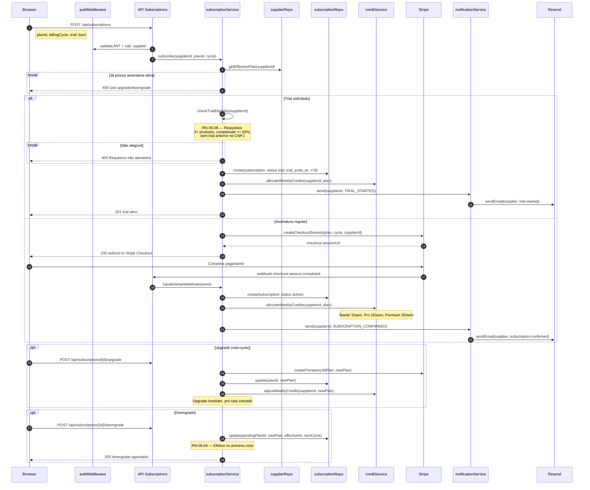
```mermaid
sequenceDiagram
    autonumber
    participant B as Browser
    participant AM as authMiddleware
    participant API as API Subscriptions
    participant SubS as subscriptionService
    participant SR as supplierRepo
    participant SubR as subscriptionRepo
    participant CrS as creditService
    participant ST as Stripe
    participant NS as notificationService
    participant RE as Resend

    B->>API: POST /api/subscriptions
    Note right of B: planId, billingCycle, trial: bool
    API->>AM: validateJWT + role: supplier

    API->>SubS: subscribe(supplierId, planId, cycle)
    SubS->>SR: getEffectivePlan(supplierId)
    break Já possui assinatura ativa
        SubS-->>B: 409 Use upgrade/downgrade
    end

    alt Trial solicitado
        SubS->>SubS: checkTrialEligibility(supplierId)
        Note over SubS: RN-06.08 — Requisitos:<br/>3+ produtos, completude >= 50%,<br/>sem trial anterior no CNPJ
        break Não elegível
            SubS-->>B: 400 Requisitos não atendidos
        end
        SubS->>SubR: create(subscription: status trial, trial_ends_at: +7d)
        SubS->>CrS: allocateWeeklyCredits(supplierId, plan)
        SubS->>NS: send(supplierId, TRIAL_STARTED)
        NS->>RE: sendEmail(supplier, trial-started)
        SubS-->>B: 201 trial ativo
    else Assinatura regular
        SubS->>ST: createCheckoutSession(plan, cycle, supplierId)
        ST-->>SubS: checkout sessionUrl
        SubS-->>B: 200 redirect to Stripe Checkout

        B->>ST: Completa pagamento
        ST->>API: webhook checkout.session.completed
        API->>SubS: handleStripeWebhook(event)
        SubS->>SubR: create(subscription: status active)
        SubS->>CrS: allocateWeeklyCredits(supplierId, plan)
        Note over CrS: Starter 5/sem, Pro 15/sem, Premium 30/sem
        SubS->>NS: send(supplierId, SUBSCRIPTION_CONFIRMED)
        NS->>RE: sendEmail(supplier, subscription-confirmed)
    end

    opt Upgrade (mid-cycle)
        B->>API: POST /api/subscriptions/{id}/upgrade
        SubS->>ST: createProration(oldPlan, newPlan)
        SubS->>SubR: update(planId: newPlan)
        SubS->>CrS: adjustWeeklyCredits(supplierId, newPlan)
        Note over SubS: Upgrade imediato, pro-rata cobrado
    end

    opt Downgrade
        B->>API: POST /api/subscriptions/{id}/downgrade
        SubS->>SubR: update(pendingPlanId: newPlan, effectiveAt: nextCycle)
        Note over SubS: RN-06.04 — Efetivo no próximo ciclo
        SubS-->>B: 200 downgrade agendado
    end
```

**Fluxos alternativos:**

| # | Condição | Resultado | RN |
|---|----------|-----------|-----|
| ALT-1 | Já tem assinatura ativa | 409 — usar upgrade/downgrade | — |
| ALT-2 | Trial não elegível | 400 — requisitos detalhados | RN-06.08 |
| ALT-3 | Pagamento Stripe recusado | Subscription não criada, notificação | — |
| ALT-4 | Upgrade mid-cycle | Imediato com cobrança pro-rata | RN-06.04 |
| ALT-5 | Downgrade | Agendado para próximo ciclo de faturamento | RN-06.04 |

**Pós-condições:**
- Subscription criada em `subscriptions` (status: trial ou active)
- Créditos semanais alocados em `credits_weekly`
- Fornecedor pode desbloquear leads (SEQ-11)

**Rastreabilidade:**
- **UCs:** UC-07
- **RFs:** RF-07.01, RF-07.02
- **RNs:** RN-06.04, RN-06.05, RN-06.08

**Notas de implementação:**
- Stripe Checkout é redirect (não embedded): menos código, compliance PCI automática
- Webhook deve ser idempotente: verificar `event.id` para evitar processamento duplicado
- Trial: sem integração Stripe (nenhum pagamento). Ao expirar (D8), auto-downgrade para free
- Upgrade pro-rata: Stripe calcula automaticamente via `createSubscriptionSchedule`
- Downgrade: manter créditos atuais até fim do ciclo, aplicar novo plano no `allocateWeeklyCredits` seguinte

---

### 7.2. SEQ-11: Desbloqueio de Lead com Crédito [MON]

> Versão simplificada: ver 3.1 seção 8.3 (Desbloqueio de Lead)

**Cenário:** Fornecedor pagante clica "Desbloquear com 1 crédito" em uma inquiry. O sistema verifica saldo, consome 1 crédito (FIFO: semanais primeiro, extras depois), marca a inquiry como desbloqueada, cria um lead com snapshot dos dados do comprador, e retorna os dados de contato completos.

**Pré-condições:**
- Fornecedor autenticado com plano pago ativo
- Inquiry pertence ao fornecedor (direcionada ou distribuída)
- Inquiry não desbloqueada anteriormente por este fornecedor

**Participantes:**

| Componente | Domínio | Estereótipo |
|-----------|---------|-------------|
| authMiddleware | Cross-cutting | `<<middleware>>` |
| leadService | Leads [MON] | `<<service>>` |
| creditService | Monetization [MON] | `<<service>>` |
| creditRepository | Monetization [MON] | `<<repository>>` |
| inquiryRepository | Inquiries | `<<repository>>` |
| leadRepository | Leads [MON] | `<<repository>>` |

**Diagrama:**

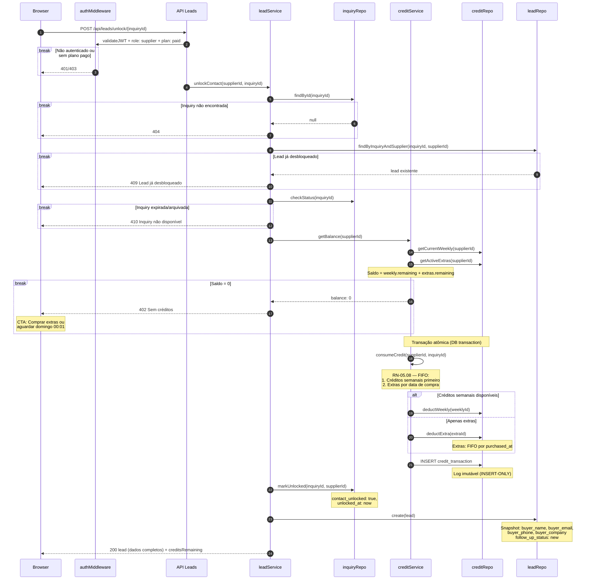
```mermaid
sequenceDiagram
    autonumber
    participant B as Browser
    participant AM as authMiddleware
    participant API as API Leads
    participant LS as leadService
    participant IR as inquiryRepo
    participant CrS as creditService
    participant CrR as creditRepo
    participant LR as leadRepo

    B->>API: POST /api/leads/unlock/{inquiryId}
    API->>AM: validateJWT + role: supplier + plan: paid
    break Não autenticado ou sem plano pago
        AM-->>B: 401/403
    end

    API->>LS: unlockContact(supplierId, inquiryId)
    LS->>IR: findById(inquiryId)
    break Inquiry não encontrada
        IR-->>LS: null
        LS-->>B: 404
    end

    LS->>LR: findByInquiryAndSupplier(inquiryId, supplierId)
    break Lead já desbloqueado
        LR-->>LS: lead existente
        LS-->>B: 409 Lead já desbloqueado
    end

    LS->>IR: checkStatus(inquiryId)
    break Inquiry expirada/arquivada
        LS-->>B: 410 Inquiry não disponível
    end

    LS->>CrS: getBalance(supplierId)
    CrS->>CrR: getCurrentWeekly(supplierId)
    CrS->>CrR: getActiveExtras(supplierId)
    Note over CrS: Saldo = weekly.remaining + extras.remaining

    break Saldo = 0
        CrS-->>LS: balance: 0
        LS-->>B: 402 Sem créditos
        Note over B: CTA: Comprar extras ou<br/>aguardar domingo 00:01
    end

    Note over CrS,CrR: Transação atômica (DB transaction)
    CrS->>CrS: consumeCredit(supplierId, inquiryId)
    Note over CrS: RN-05.08 — FIFO:<br/>1. Créditos semanais primeiro<br/>2. Extras por data de compra

    alt Créditos semanais disponíveis
        CrS->>CrR: deductWeekly(weeklyId)
    else Apenas extras
        CrS->>CrR: deductExtra(extraId)
        Note over CrR: Extras: FIFO por purchased_at
    end

    CrS->>CrR: INSERT credit_transaction
    Note over CrR: Log imutável (INSERT-ONLY)

    LS->>IR: markUnlocked(inquiryId, supplierId)
    Note over IR: contact_unlocked: true,<br/>unlocked_at: now

    LS->>LR: create(lead)
    Note over LR: Snapshot: buyer_name, buyer_email,<br/>buyer_phone, buyer_company<br/>follow_up_status: new

    LS-->>B: 200 lead (dados completos) + creditsRemaining
```

**Fluxos alternativos:**

| # | Condição | Resultado | RN |
|---|----------|-----------|-----|
| ALT-1 | Sem plano pago | 403 — assine um plano | — |
| ALT-2 | Lead já desbloqueado | 409 — dados já disponíveis (idempotente) | RN-05.09 |
| ALT-3 | Inquiry expirada/arquivada | 410 — não disponível | — |
| ALT-4 | Saldo zero | 402 — CTA comprar extras ou aguardar | RN-04.07 |
| ALT-5 | Weekly esgotados, extras disponíveis | Consome extra (FIFO) | RN-05.08 |

**Pós-condições:**
- 1 crédito consumido (weekly ou extra, FIFO)
- `credit_transaction` logada (imutável, INSERT-ONLY)
- `inquiry.contact_unlocked = true`
- Lead criado em `leads` com snapshot do comprador
- Fornecedor vê dados completos: nome, email, phone, empresa

**Rastreabilidade:**
- **UCs:** UC-08
- **RFs:** RF-06.05
- **RNs:** RN-04.06, RN-04.07, RN-05.07, RN-05.08, RN-05.09

**Notas de implementação:**
- **TRANSAÇÃO OBRIGATÓRIA**: consumeCredit + markUnlocked + createLead devem ser atômicos
- FIFO: `ORDER BY week_start ASC` para weekly, `ORDER BY purchased_at ASC` para extras
- Crédito consumido é irreversível (RN-05.09) — sem estorno
- Snapshot dos dados do comprador no `lead` (não FK): proteção contra alterações futuras (LGPD)
- Endpoint idempotente para lead já desbloqueado: retornar dados sem cobrar novamente

---

### 7.3. SEQ-12: Renovação Semanal de Créditos [MON]

**Cenário:** Job executa todo domingo 00:01 BRT. Para cada assinante ativo: expira créditos semanais não utilizados, verifica status de pagamento, aplica downgrade pendente se houver, e aloca novos créditos semanais conforme o plano.

**Pré-condições:**
- Job agendado (pg_cron ou Edge Function)
- Pelo menos 1 assinatura ativa ou trial

**Participantes:**

| Componente | Domínio | Estereótipo |
|-----------|---------|-------------|
| allocateWeeklyCreditsJob | Monetization [MON] | `<<job>>` |
| subscriptionRepository | Monetization [MON] | `<<repository>>` |
| creditService | Monetization [MON] | `<<service>>` |
| creditRepository | Monetization [MON] | `<<repository>>` |

**Diagrama:**

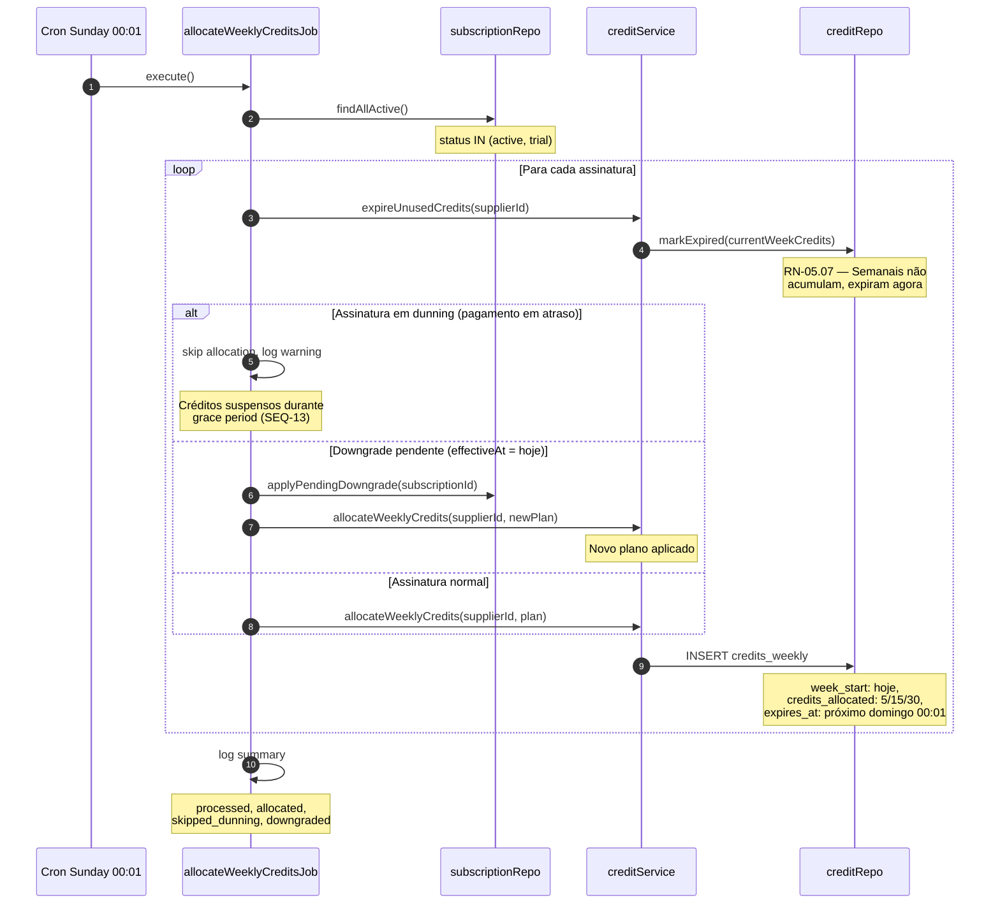
```mermaid
sequenceDiagram
    autonumber
    participant Cron as Cron Sunday 00:01
    participant Job as allocateWeeklyCreditsJob
    participant SubR as subscriptionRepo
    participant CrS as creditService
    participant CrR as creditRepo

    Cron->>Job: execute()
    Job->>SubR: findAllActive()
    Note over SubR: status IN (active, trial)

    loop Para cada assinatura
        Job->>CrS: expireUnusedCredits(supplierId)
        CrS->>CrR: markExpired(currentWeekCredits)
        Note over CrR: RN-05.07 — Semanais não<br/>acumulam, expiram agora

        alt Assinatura em dunning (pagamento em atraso)
            Job->>Job: skip allocation, log warning
            Note over Job: Créditos suspensos durante<br/>grace period (SEQ-13)
        else Downgrade pendente (effectiveAt = hoje)
            Job->>SubR: applyPendingDowngrade(subscriptionId)
            Job->>CrS: allocateWeeklyCredits(supplierId, newPlan)
            Note over CrS: Novo plano aplicado
        else Assinatura normal
            Job->>CrS: allocateWeeklyCredits(supplierId, plan)
        end

        CrS->>CrR: INSERT credits_weekly
        Note over CrR: week_start: hoje,<br/>credits_allocated: 5/15/30,<br/>expires_at: próximo domingo 00:01
    end

    Job->>Job: log summary
    Note over Job: processed, allocated,<br/>skipped_dunning, downgraded
```

**Fluxos alternativos:**

| # | Condição | Resultado | RN |
|---|----------|-----------|-----|
| ALT-1 | Assinatura em dunning | Skip alocação, log warning | — |
| ALT-2 | Downgrade pendente | Aplica novo plano, aloca com novos limites | RN-06.04 |
| ALT-3 | Trial expirado (dia 8) | Auto-cancel → skip (sem mais créditos) | RN-06.08 |

**Pós-condições:**
- Créditos semanais anteriores expirados (não utilizados perdidos)
- Novos créditos alocados: Starter 5, Pro 15, Premium 30
- Downgrades pendentes aplicados
- Assinaturas em dunning sem créditos novos

**Rastreabilidade:**
- **UCs:** UC-30
- **RFs:** RF-07.01
- **RNs:** RN-05.07, RN-05.08

**Notas de implementação:**
- Job deve ser idempotente: verificar se `credits_weekly` para `(supplierId, week_start)` já existe antes de inserir
- Timezone: **America/Sao_Paulo** (BRT/BRST). Cuidado com horário de verão
- Créditos extras NÃO são afetados por este job (têm validade de 90 dias independente)
- Monitorar via Better Stack: alerta se job não executar até 00:30

---

### 7.4. SEQ-13: Cobrança Recorrente e Dunning [MON]

**Cenário:** Stripe processa cobrança recorrente e envia webhook. Em caso de sucesso, renova faturamento. Em caso de falha, inicia fluxo de dunning com retentativas em D0, D3, D7, suspensão em D10, e cancelamento em D30.

**Pré-condições:**
- Assinatura ativa com `next_billing_date` = hoje
- Método de pagamento configurado no Stripe

**Participantes:**

| Componente | Domínio | Estereótipo |
|-----------|---------|-------------|
| Stripe | External [MON] | `<<external>>` |
| billingService | Monetization [MON] | `<<service>>` |
| subscriptionService | Monetization [MON] | `<<service>>` |
| subscriptionRepository | Monetization [MON] | `<<repository>>` |
| creditService | Monetization [MON] | `<<service>>` |
| notificationService | Notifications | `<<service>>` |
| Resend | External | `<<external>>` |

**Diagrama:**

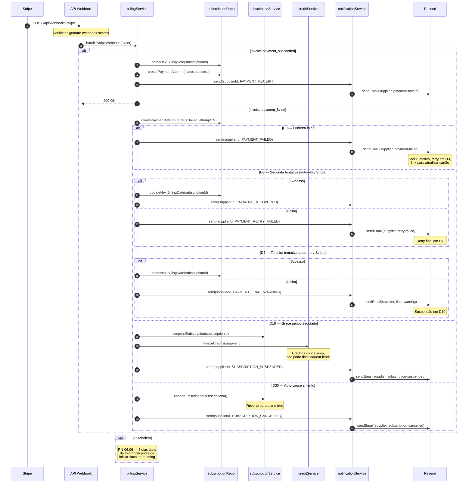
```mermaid
sequenceDiagram
    autonumber
    participant ST as Stripe
    participant API as API Webhook
    participant BillS as billingService
    participant SubR as subscriptionRepo
    participant SubS as subscriptionService
    participant CrS as creditService
    participant NS as notificationService
    participant RE as Resend

    ST->>API: POST /api/webhooks/stripe
    Note over API: Verificar signature (webhook secret)
    API->>BillS: handleStripeWebhook(event)

    alt invoice.payment_succeeded
        BillS->>SubR: updateNextBillingDate(subscriptionId)
        BillS->>SubR: createPaymentAttempt(status: success)
        BillS->>NS: send(supplierId, PAYMENT_RECEIPT)
        NS->>RE: sendEmail(supplier, payment-receipt)
        BillS-->>API: 200 OK
    else invoice.payment_failed
        BillS->>SubR: createPaymentAttempt(status: failed, attempt: N)

        alt D0 — Primeira falha
            BillS->>NS: send(supplierId, PAYMENT_FAILED)
            NS->>RE: sendEmail(supplier, payment-failed)
            Note over RE: Inclui: motivo, retry em D3,<br/>link para atualizar cartão
        else D3 — Segunda tentativa (auto-retry Stripe)
            alt Sucesso
                BillS->>SubR: updateNextBillingDate(subscriptionId)
                BillS->>NS: send(supplierId, PAYMENT_RECOVERED)
            else Falha
                BillS->>NS: send(supplierId, PAYMENT_RETRY_FAILED)
                NS->>RE: sendEmail(supplier, retry-failed)
                Note over RE: Retry final em D7
            end
        else D7 — Terceira tentativa (auto-retry Stripe)
            alt Sucesso
                BillS->>SubR: updateNextBillingDate(subscriptionId)
            else Falha
                BillS->>NS: send(supplierId, PAYMENT_FINAL_WARNING)
                NS->>RE: sendEmail(supplier, final-warning)
                Note over RE: Suspensão em D10
            end
        else D10 — Grace period esgotado
            BillS->>SubS: suspendSubscription(subscriptionId)
            BillS->>CrS: freezeCredits(supplierId)
            Note over CrS: Créditos congelados,<br/>não pode desbloquear leads
            BillS->>NS: send(supplierId, SUBSCRIPTION_SUSPENDED)
            NS->>RE: sendEmail(supplier, subscription-suspended)
        else D30 — Auto-cancelamento
            BillS->>SubS: cancelSubscription(subscriptionId)
            Note over SubS: Reverte para plano free
            BillS->>NS: send(supplierId, SUBSCRIPTION_CANCELLED)
            NS->>RE: sendEmail(supplier, subscription-cancelled)
        end
    end

    opt PIX/Boleto
        Note over BillS: RN-06.06 — 3 dias úteis<br/>de tolerância antes de<br/>iniciar fluxo de dunning
    end
```

**Fluxos alternativos:**

| # | Condição | Resultado | RN |
|---|----------|-----------|-----|
| ALT-1 | Pagamento OK | Renovação normal, receipt enviado | — |
| ALT-2 | D0 falha | Email notificação + retry D3 | RN-06.06 |
| ALT-3 | D3 falha | Email notificação + retry D7 | RN-06.06 |
| ALT-4 | D7 falha (3a e última) | Email final warning, suspensão em D10 | RN-06.06 |
| ALT-5 | D10 | Suspensão: créditos congelados, sem unlock | RN-06.06 |
| ALT-6 | D30 | Cancelamento: reverte para free | RN-06.06 |
| ALT-7 | PIX/Boleto | +3 dias úteis de tolerância | RN-06.06 |

**Pós-condições:**
- Sucesso: faturamento renovado, receipt emitido
- Falha D10: subscription suspended, créditos congelados
- Falha D30: subscription cancelled, reverte para free
- Todas as ações logadas em `payment_attempts`

**Rastreabilidade:**
- **UCs:** UC-29
- **RFs:** RF-08.01, RF-08.02
- **RNs:** RN-06.04, RN-06.05, RN-06.06

**Notas de implementação:**
- Stripe gerencia retries automaticamente (Smart Retries). Configurar retry schedule no Stripe Dashboard
- Webhook DEVE verificar signature (`stripe.webhooks.constructEvent`) para segurança
- Webhook DEVE ser idempotente: verificar `event.id` contra tabela de events processados
- D10 suspensão: supplier pode logar mas não desbloquear leads. Produtos permanecem visíveis.
- D30 cancelamento: manter dados do supplier, apenas reverter para free. Sem soft-delete.

---

## 8. Grupo 6 — Moderação e Sistema

### 8.1. SEQ-14: Denúncia e Moderação

**Cenário:** Comprador ou fornecedor denuncia conteúdo (inquiry, produto, fornecedor). O sistema registra a denúncia, verifica thresholds configuráveis (3 = advertência, 5 = suspensão), e executa ações automáticas ou encaminha para admin.

**Pré-condições:**
- Usuário autenticado (buyer ou supplier)
- Alvo da denúncia existe
- Usuário não denunciou o mesmo alvo anteriormente

**Participantes:**

| Componente | Domínio | Estereótipo |
|-----------|---------|-------------|
| authMiddleware | Cross-cutting | `<<middleware>>` |
| moderationService | Moderation | `<<service>>` |
| reportRepository | Moderation | `<<repository>>` |
| supplierRepository | Identity | `<<repository>>` |
| notificationService | Notifications | `<<service>>` |
| Resend | External | `<<external>>` |

**Diagrama:**

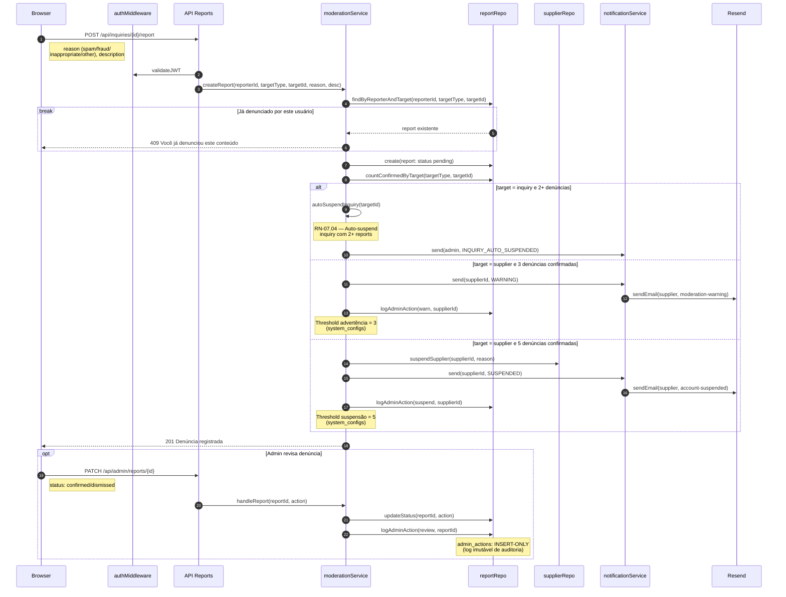
```mermaid
sequenceDiagram
    autonumber
    participant B as Browser
    participant AM as authMiddleware
    participant API as API Reports
    participant MS as moderationService
    participant RepR as reportRepo
    participant SR as supplierRepo
    participant NS as notificationService
    participant RE as Resend

    B->>API: POST /api/inquiries/{id}/report
    Note right of B: reason (spam/fraud/<br/>inappropriate/other), description
    API->>AM: validateJWT

    API->>MS: createReport(reporterId, targetType, targetId, reason, desc)
    MS->>RepR: findByReporterAndTarget(reporterId, targetType, targetId)
    break Já denunciado por este usuário
        RepR-->>MS: report existente
        MS-->>B: 409 Você já denunciou este conteúdo
    end

    MS->>RepR: create(report: status pending)
    MS->>RepR: countConfirmedByTarget(targetType, targetId)

    alt target = inquiry e 2+ denúncias
        MS->>MS: autoSuspendInquiry(targetId)
        Note over MS: RN-07.04 — Auto-suspend<br/>inquiry com 2+ reports
        MS->>NS: send(admin, INQUIRY_AUTO_SUSPENDED)
    else target = supplier e 3 denúncias confirmadas
        MS->>NS: send(supplierId, WARNING)
        NS->>RE: sendEmail(supplier, moderation-warning)
        MS->>RepR: logAdminAction(warn, supplierId)
        Note over MS: Threshold advertência = 3<br/>(system_configs)
    else target = supplier e 5 denúncias confirmadas
        MS->>SR: suspendSupplier(supplierId, reason)
        MS->>NS: send(supplierId, SUSPENDED)
        NS->>RE: sendEmail(supplier, account-suspended)
        MS->>RepR: logAdminAction(suspend, supplierId)
        Note over MS: Threshold suspensão = 5<br/>(system_configs)
    end

    MS-->>B: 201 Denúncia registrada

    opt Admin revisa denúncia
        B->>API: PATCH /api/admin/reports/{id}
        Note right of B: status: confirmed/dismissed
        API->>MS: handleReport(reportId, action)
        MS->>RepR: updateStatus(reportId, action)
        MS->>RepR: logAdminAction(review, reportId)
        Note over RepR: admin_actions: INSERT-ONLY<br/>(log imutável de auditoria)
    end
```

**Fluxos alternativos:**

| # | Condição | Resultado | RN |
|---|----------|-----------|-----|
| ALT-1 | Já denunciou o mesmo alvo | 409 — denúncia duplicada | — |
| ALT-2 | Inquiry com 2+ reports | Auto-suspend da inquiry | RN-07.04 |
| ALT-3 | Supplier com 3 confirmed reports | Advertência (email + log) | system_configs |
| ALT-4 | Supplier com 5 confirmed reports | Suspensão automática | system_configs |
| ALT-5 | Buyer com 3+ spam confirmados | Block 30 dias (RN-07.04) | RN-07.04 |

**Pós-condições:**
- Denúncia registrada em `reports` com status: pending
- Ação automática executada se threshold atingido
- Admin notificado para revisão
- Todas as ações logadas em `admin_actions` (INSERT-ONLY)

**Rastreabilidade:**
- **UCs:** UC-06, UC-15, UC-21
- **RFs:** RF-11.02
- **RNs:** RN-07.01, RN-07.02, RN-07.03, RN-07.04, RN-07.05

**Notas de implementação:**
- Thresholds configuráveis via `system_configs` (não hardcoded): `report_threshold_inquiry = 2`, `report_threshold_supplier_warn = 3`, `report_threshold_supplier_suspend = 5`
- `admin_actions` é INSERT-ONLY: nunca UPDATE/DELETE (audit trail imutável)
- Constraint UNIQUE `(reporter_id, target_type, target_id)` no PostgreSQL
- Suspension do supplier: produtos ficam ocultos na busca, mas dados preservados para eventual reativação

---

### 8.2. SEQ-15: Verificação Automática de CNPJ (Nível 1)

**Cenário:** Após upgrade para fornecedor (SEQ-17, UC-31), job assíncrono valida o CNPJ via BrasilAPI. Se API indisponível, agenda retry em intervalos de 24h (máximo 3 tentativas). Após 3 falhas, notifica admin para verificação manual. Revalidação periódica a cada 90 dias.

**Pré-condições:**
- Fornecedor recém-cadastrado com CNPJ
- BrasilAPI/ReceitaWS disponível (ou retry agendado)

**Participantes:**

| Componente | Domínio | Estereótipo |
|-----------|---------|-------------|
| autoVerifyCNPJJob | Moderation | `<<job>>` |
| cnpjClient (BrasilAPI) | External | `<<external>>` |
| supplierRepository | Identity | `<<repository>>` |
| notificationService | Notifications | `<<service>>` |
| Resend | External | `<<external>>` |

**Diagrama:**

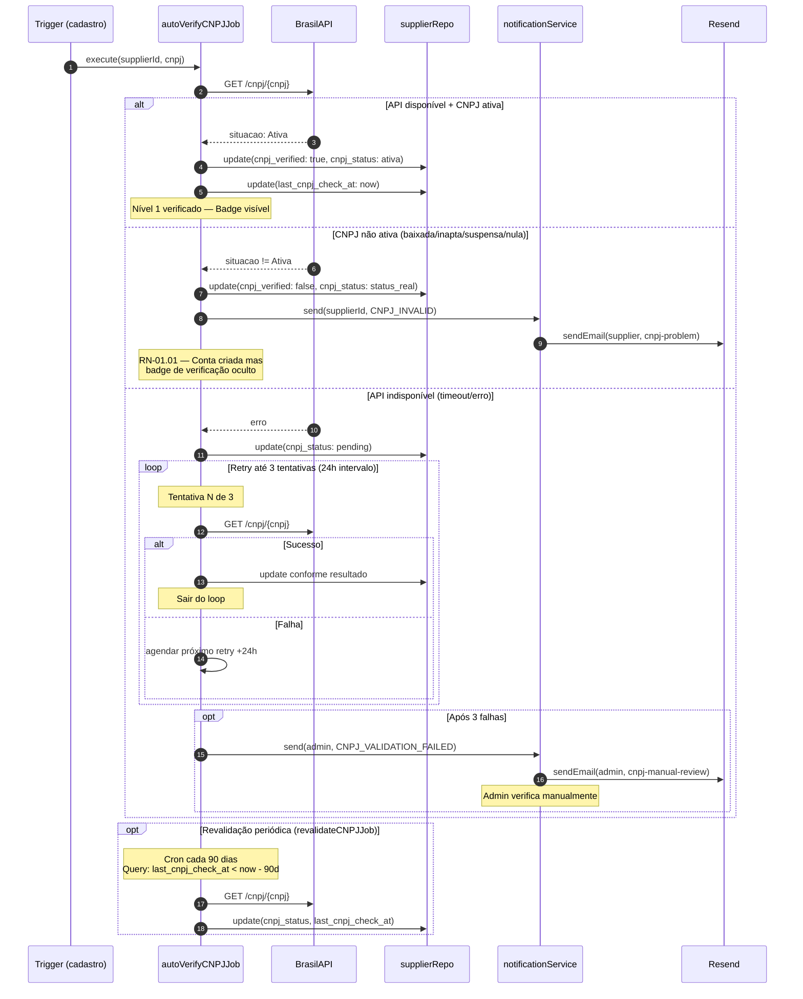
```mermaid
sequenceDiagram
    autonumber
    participant Trigger as Trigger (cadastro)
    participant Job as autoVerifyCNPJJob
    participant BA as BrasilAPI
    participant SR as supplierRepo
    participant NS as notificationService
    participant RE as Resend

    Trigger->>Job: execute(supplierId, cnpj)
    Job->>BA: GET /cnpj/{cnpj}

    alt API disponível + CNPJ ativa
        BA-->>Job: situacao: Ativa
        Job->>SR: update(cnpj_verified: true, cnpj_status: ativa)
        Job->>SR: update(last_cnpj_check_at: now)
        Note over Job: Nível 1 verificado — Badge visível
    else CNPJ não ativa (baixada/inapta/suspensa/nula)
        BA-->>Job: situacao != Ativa
        Job->>SR: update(cnpj_verified: false, cnpj_status: status_real)
        Job->>NS: send(supplierId, CNPJ_INVALID)
        NS->>RE: sendEmail(supplier, cnpj-problem)
        Note over Job: RN-01.01 — Conta criada mas<br/>badge de verificação oculto
    else API indisponível (timeout/erro)
        BA-->>Job: erro
        Job->>SR: update(cnpj_status: pending)

        loop Retry até 3 tentativas (24h intervalo)
            Note over Job: Tentativa N de 3
            Job->>BA: GET /cnpj/{cnpj}
            alt Sucesso
                Job->>SR: update conforme resultado
                Note over Job: Sair do loop
            else Falha
                Job->>Job: agendar próximo retry +24h
            end
        end

        opt Após 3 falhas
            Job->>NS: send(admin, CNPJ_VALIDATION_FAILED)
            NS->>RE: sendEmail(admin, cnpj-manual-review)
            Note over NS: Admin verifica manualmente
        end
    end

    opt Revalidação periódica (revalidateCNPJJob)
        Note over Job: Cron cada 90 dias<br/>Query: last_cnpj_check_at < now - 90d
        Job->>BA: GET /cnpj/{cnpj}
        Job->>SR: update(cnpj_status, last_cnpj_check_at)
    end
```

**Fluxos alternativos:**

| # | Condição | Resultado | RN |
|---|----------|-----------|-----|
| ALT-1 | CNPJ ativa | cnpj_verified: true, badge visível | RN-01.01 |
| ALT-2 | CNPJ não ativa | cnpj_verified: false, notificação ao supplier | RN-01.01 |
| ALT-3 | API indisponível | Retry 24h×3, status: pending | US-002 |
| ALT-4 | 3 falhas consecutivas | Admin notificado para revisão manual | — |

**Pós-condições:**
- `cnpj_verified` e `cnpj_status` atualizados
- `last_cnpj_check_at` registrado
- Se ativa: badge Nível 1 visível no perfil público
- Se falha: admin aware para ação manual

**Rastreabilidade:**
- **UCs:** UC-24
- **RFs:** RF-01.02, RF-01.03
- **RNs:** RN-01.01

**Notas de implementação:**
- BrasilAPI endpoint: `GET https://brasilapi.com.br/api/cnpj/v1/{cnpj}`
- Timeout: 5s. Retry com backoff: 24h, 48h, 72h
- Job runner MVP: Supabase Edge Function disparada por database webhook (após INSERT em suppliers)
- `revalidateCNPJJob`: pg_cron `0 3 */90 * *` (03:00 a cada 90 dias, horário de baixo tráfego)
- Configurável via `system_configs.cnpj_revalidation_days = 90`

---

### 8.3. SEQ-16: Notificação de Perfil Incompleto (Nudges)

**Cenário:** Job diário verifica fornecedores com perfil incompleto e envia nudges por email seguindo schedule configurável: dias 3, 7, 14 após cadastro, depois mensal. Respeita opt-out e limita a 1 nudge por semana.

**Pré-condições:**
- Fornecedores ativos com email confirmado
- profile_completeness < 100%

**Participantes:**

| Componente | Domínio | Estereótipo |
|-----------|---------|-------------|
| nudgeJob (sistema) | Notifications | `<<job>>` |
| supplierRepository | Identity | `<<repository>>` |
| notificationService | Notifications | `<<service>>` |
| Resend | External | `<<external>>` |

**Diagrama:**

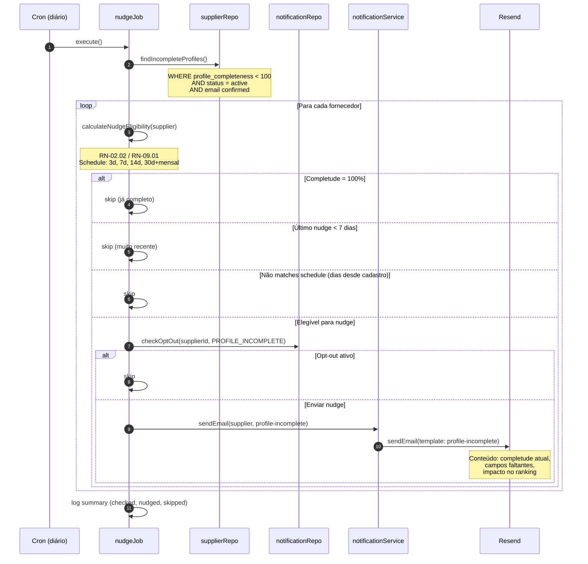
```mermaid
sequenceDiagram
    autonumber
    participant Cron as Cron (diário)
    participant Job as nudgeJob
    participant SR as supplierRepo
    participant NR as notificationRepo
    participant NS as notificationService
    participant RE as Resend

    Cron->>Job: execute()
    Job->>SR: findIncompleteProfiles()
    Note over SR: WHERE profile_completeness < 100<br/>AND status = active<br/>AND email confirmed

    loop Para cada fornecedor
        Job->>Job: calculateNudgeEligibility(supplier)
        Note over Job: RN-02.02 / RN-09.01<br/>Schedule: 3d, 7d, 14d, 30d+mensal

        alt Completude = 100%
            Job->>Job: skip (já completo)
        else Último nudge < 7 dias
            Job->>Job: skip (muito recente)
        else Não matches schedule (dias desde cadastro)
            Job->>Job: skip
        else Elegível para nudge
            Job->>NR: checkOptOut(supplierId, PROFILE_INCOMPLETE)
            alt Opt-out ativo
                Job->>Job: skip
            else Enviar nudge
                Job->>NS: sendEmail(supplier, profile-incomplete)
                NS->>RE: sendEmail(template: profile-incomplete)
                Note over RE: Conteúdo: completude atual,<br/>campos faltantes,<br/>impacto no ranking
            end
        end
    end

    Job->>Job: log summary (checked, nudged, skipped)
```

**Fluxos alternativos:**

| # | Condição | Resultado | RN |
|---|----------|-----------|-----|
| ALT-1 | Já completou 100% | Skip | — |
| ALT-2 | Nudge recente (< 7 dias) | Skip (max 1/semana) | — |
| ALT-3 | Fora do schedule | Skip | RN-02.02 |
| ALT-4 | Opt-out ativo | Skip (respeitar preferência) | — |

**Pós-condições:**
- Emails de nudge enviados para fornecedores elegíveis
- Nudges logados em `notifications` + `email_logs`
- Nenhum nudge duplicado (max 1/semana)

**Rastreabilidade:**
- **UCs:** UC-26
- **RFs:** RF-13.01
- **RNs:** RN-02.02, RN-09.01

**Notas de implementação:**
- Job diário: `0 9 * * *` (09:00 BRT, horário comercial)
- Template do email deve listar campos faltantes com links diretos para edição
- Mensagem de impacto: "Perfis completos recebem até 3x mais cotações"
- Batch processing: processar em lotes de 100 para não sobrecarregar Resend
- Considerar unsubscribe link no footer (LGPD compliance)

---

## 9. Grupo 7 — Cadastro Unificado e Verificação

### 9.1. SEQ-17: Upgrade para Fornecedor (Nível 3)

**Cenário:** Usuário existente (Nível 1) ou comprador (Nível 2) faz upgrade para fornecedor clicando em "Quero Vender". Preenche CNPJ e endereço. Sistema valida CNPJ via BrasilAPI, cria registro supplier com plano free, atribui role supplier (dual-role se já era buyer), redireciona para wizard de perfil.

**Pré-condições:**
- Usuário possui conta na plataforma (Nível 1, UC-01) com email confirmado
- Usuário ainda não é fornecedor (sem registro em `suppliers`)

**Participantes:**

| Componente | Domínio | Estereótipo |
|-----------|---------|-------------|
| authMiddleware | Cross-cutting | `<<middleware>>` |
| zodValidation | Cross-cutting | `<<middleware>>` |
| authService | Identity | `<<service>>` |
| supplierService | Identity | `<<service>>` |
| supplierRepository | Identity | `<<repository>>` |
| cnpjClient (BrasilAPI) | External | `<<external>>` |
| notificationService | Notifications | `<<service>>` |
| Resend | External | `<<external>>` |

**Diagrama:**

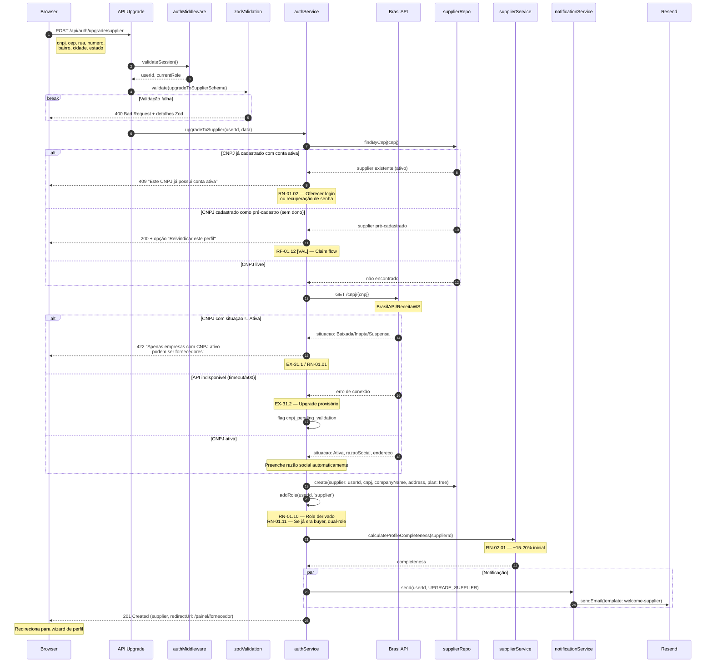
```mermaid
sequenceDiagram
    autonumber
    participant B as Browser
    participant API as API Upgrade
    participant AM as authMiddleware
    participant ZV as zodValidation
    participant AS as authService
    participant BA as BrasilAPI
    participant SR as supplierRepo
    participant SS as supplierService
    participant NS as notificationService
    participant RE as Resend

    B->>API: POST /api/auth/upgrade/supplier
    Note right of B: cnpj, cep, rua, numero,<br/>bairro, cidade, estado
    API->>AM: validateSession()
    AM-->>API: userId, currentRole
    API->>ZV: validate(upgradeToSupplierSchema)
    break Validação falha
        ZV-->>B: 400 Bad Request + detalhes Zod
    end

    API->>AS: upgradeToSupplier(userId, data)
    AS->>SR: findByCnpj(cnpj)

    alt CNPJ já cadastrado com conta ativa
        SR-->>AS: supplier existente (ativo)
        AS-->>B: 409 "Este CNPJ já possui conta ativa"
        Note over AS: RN-01.02 — Oferecer login<br/>ou recuperação de senha
    else CNPJ cadastrado como pré-cadastro (sem dono)
        SR-->>AS: supplier pré-cadastrado
        AS-->>B: 200 + opção "Reivindicar este perfil"
        Note over AS: RF-01.12 [VAL] — Claim flow
    else CNPJ livre
        SR-->>AS: não encontrado
    end

    AS->>BA: GET /cnpj/{cnpj}
    Note over BA: BrasilAPI/ReceitaWS

    alt CNPJ com situação != Ativa
        BA-->>AS: situacao: Baixada/Inapta/Suspensa
        AS-->>B: 422 "Apenas empresas com CNPJ ativo<br/>podem ser fornecedores"
        Note over AS: EX-31.1 / RN-01.01
    else API indisponível (timeout/500)
        BA-->>AS: erro de conexão
        Note over AS: EX-31.2 — Upgrade provisório
        AS->>AS: flag cnpj_pending_validation
    else CNPJ ativa
        BA-->>AS: situacao: Ativa, razaoSocial, endereco
        Note over AS: Preenche razão social automaticamente
    end

    AS->>SR: create(supplier: userId, cnpj, companyName, address, plan: free)
    AS->>AS: addRole(userId, 'supplier')
    Note over AS: RN-01.10 — Role derivado<br/>RN-01.11 — Se já era buyer, dual-role

    AS->>SS: calculateProfileCompleteness(supplierId)
    Note over SS: RN-02.01 — ~15-20% inicial
    SS-->>AS: completeness

    par Notificação
        AS->>NS: send(userId, UPGRADE_SUPPLIER)
        NS->>RE: sendEmail(template: welcome-supplier)
    end

    AS-->>B: 201 Created (supplier, redirectUrl: /painel/fornecedor)
    Note over B: Redireciona para wizard de perfil
```

**Fluxos alternativos:**

| # | Condição | Resultado | RN/UC |
|---|----------|-----------|-------|
| ALT-1 | CNPJ já cadastrado com conta ativa | 409 — login ou recuperação de senha | RN-01.02, FA-31.1 |
| ALT-2 | CNPJ pré-cadastrado sem dono | Oferecer "Reivindicar este perfil" [VAL] | RF-01.12, FA-31.2 |
| ALT-3 | CNPJ com situação irregular | 422 — apenas CNPJ Ativa permitido | RN-01.01, EX-31.1 |
| ALT-4 | BrasilAPI indisponível | Upgrade provisório com cnpj_pending_validation, retry 24h×3 | EX-31.2 |
| ALT-5 | CEP inválido ou não encontrado | Permite preenchimento manual do endereço | EX-31.3 |
| ALT-6 | Validação Zod falha | 400 — campos inválidos detalhados | — |

**Pós-condições:**
- Registro criado em `suppliers` com plano `free`
- Role inclui `supplier` (derivado, RN-01.10). Se já era buyer → dual-role (RN-01.11)
- CNPJ verificado automaticamente (ou pending se API falhou)
- Perfil público de fornecedor criado com dados mínimos (nome, cidade, CNPJ verificado)
- Completude do perfil calculada em ~15-20%

**Rastreabilidade:**
- **UCs:** UC-31
- **RFs:** RF-01.02, RF-01.03, RF-01.04, RF-01.13
- **RNs:** RN-01.01, RN-01.02, RN-01.10, RN-01.11, RN-02.01

**Notas de implementação:**
- Rota autenticada: exige sessão válida (o usuário já criou conta via SEQ-01)
- Reutilizar `cnpjClient` do SEQ-15 para validação BrasilAPI
- Transação lógica: se criar supplier falhar, não alterar role do usuário
- Job `autoVerifyCNPJJob` (SEQ-15) trata retry assíncrono se API falhou
- ⚠️ PENDÊNCIA: URL exata da página de upgrade para fornecedor (Vitor decide)

---

### 9.2. SEQ-18: Verificação de Empresa (Comprador — Selo "Empresa Verificada")

**Cenário:** Comprador (Nível 2) verifica sua empresa informando o CNPJ no painel. Sistema valida via BrasilAPI e concede selo "Empresa Verificada", visível nas inquiries enviadas. CNPJ é opcional — selo é incentivo, não obrigação. Barra de completude recalculada.

**Pré-condições:**
- Usuário é buyer (Nível 2, UC-12) com registro em `buyers`
- Buyer ainda não possui CNPJ validado (`cnpj_verified` = false)

**Participantes:**

| Componente | Domínio | Estereótipo |
|-----------|---------|-------------|
| authMiddleware | Cross-cutting | `<<middleware>>` |
| zodValidation | Cross-cutting | `<<middleware>>` |
| authService | Identity | `<<service>>` |
| buyerRepository | Identity | `<<repository>>` |
| cnpjClient (BrasilAPI) | External | `<<external>>` |
| notificationService | Notifications | `<<service>>` |
| Resend | External | `<<external>>` |

**Diagrama:**

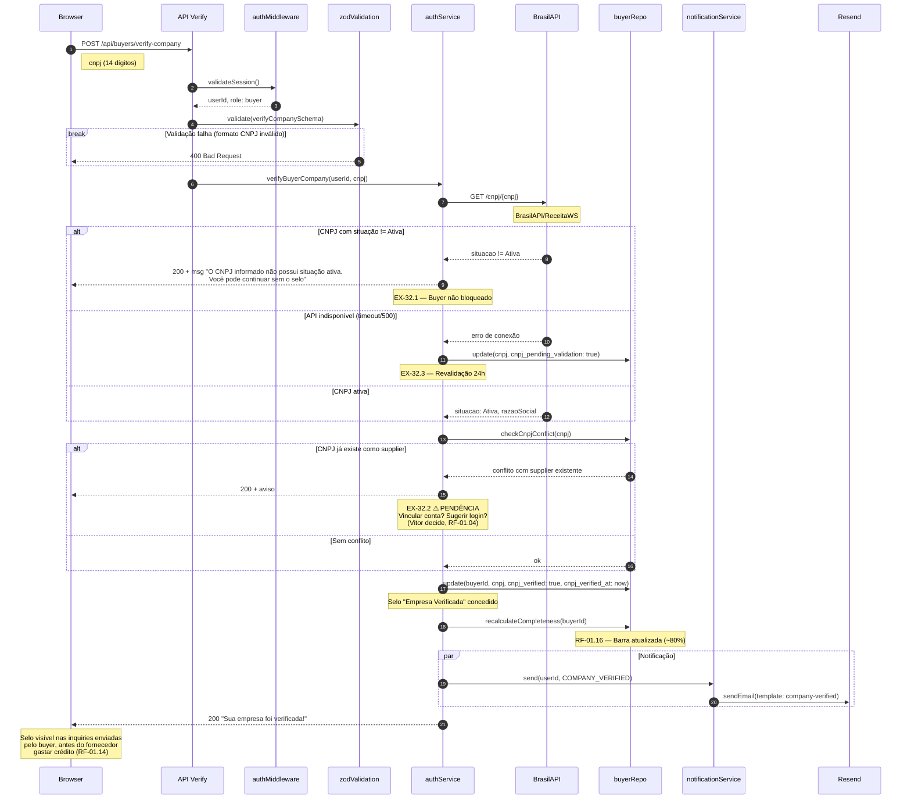
```mermaid
sequenceDiagram
    autonumber
    participant B as Browser
    participant API as API Verify
    participant AM as authMiddleware
    participant ZV as zodValidation
    participant AS as authService
    participant BA as BrasilAPI
    participant BR as buyerRepo
    participant NS as notificationService
    participant RE as Resend

    B->>API: POST /api/buyers/verify-company
    Note right of B: cnpj (14 dígitos)
    API->>AM: validateSession()
    AM-->>API: userId, role: buyer
    API->>ZV: validate(verifyCompanySchema)
    break Validação falha (formato CNPJ inválido)
        ZV-->>B: 400 Bad Request
    end

    API->>AS: verifyBuyerCompany(userId, cnpj)
    AS->>BA: GET /cnpj/{cnpj}
    Note over BA: BrasilAPI/ReceitaWS

    alt CNPJ com situação != Ativa
        BA-->>AS: situacao != Ativa
        AS-->>B: 200 + msg "O CNPJ informado não possui situação ativa.<br/>Você pode continuar sem o selo"
        Note over AS: EX-32.1 — Buyer não bloqueado
    else API indisponível (timeout/500)
        BA-->>AS: erro de conexão
        AS->>BR: update(cnpj, cnpj_pending_validation: true)
        Note over AS: EX-32.3 — Revalidação 24h
    else CNPJ ativa
        BA-->>AS: situacao: Ativa, razaoSocial
    end

    AS->>BR: checkCnpjConflict(cnpj)
    alt CNPJ já existe como supplier
        BR-->>AS: conflito com supplier existente
        AS-->>B: 200 + aviso
        Note over AS: EX-32.2 ⚠️ PENDÊNCIA<br/>Vincular conta? Sugerir login?<br/>(Vitor decide, RF-01.04)
    else Sem conflito
        BR-->>AS: ok
    end

    AS->>BR: update(buyerId, cnpj, cnpj_verified: true, cnpj_verified_at: now)
    Note over AS: Selo "Empresa Verificada" concedido

    AS->>BR: recalculateCompleteness(buyerId)
    Note over BR: RF-01.16 — Barra atualizada (~80%)

    par Notificação
        AS->>NS: send(userId, COMPANY_VERIFIED)
        NS->>RE: sendEmail(template: company-verified)
    end

    AS-->>B: 200 "Sua empresa foi verificada!"
    Note over B: Selo visível nas inquiries enviadas<br/>pelo buyer, antes do fornecedor<br/>gastar crédito (RF-01.14)
```

**Fluxos alternativos:**

| # | Condição | Resultado | RN/UC |
|---|----------|-----------|-------|
| ALT-1 | CNPJ com situação irregular | Selo não concedido, buyer não bloqueado. Mensagem informativa | EX-32.1, RN-01.06 |
| ALT-2 | BrasilAPI indisponível | CNPJ registrado com cnpj_pending_validation, revalidação 24h | EX-32.3 |
| ALT-3 | CNPJ já existe como supplier | ⚠️ PENDÊNCIA — vincular? sugerir login? (Vitor decide) | EX-32.2, RF-01.04 |
| ALT-4 | Buyer informa CNPJ durante ativação (UC-12) | Verificação inline, sem acessar UC-32 separadamente | FA-32.1 |
| ALT-5 | Validação Zod falha | 400 — formato CNPJ inválido | — |

**Pós-condições:**
- Buyer com selo "Empresa Verificada" (visível nas inquiries enviadas)
- Selo visível para fornecedor **antes** de gastar crédito para desbloquear lead
- Barra de completude atualizada (~80%)
- CNPJ permanece opcional — sem selo buyer continua operando normalmente (RN-01.06)

**Rastreabilidade:**
- **UCs:** UC-32
- **RFs:** RF-01.02, RF-01.14, RF-01.16, RF-01.17
- **RNs:** RN-01.01, RN-01.06

**Notas de implementação:**
- Reutilizar `cnpjClient` do SEQ-15 para validação BrasilAPI
- Nudge de completude (RF-01.17): "Compradores com empresa verificada recebem mais propostas" — exibido após inquiry, no dashboard, em emails
- Barra de completude do buyer: ~40% (dados base) → ~60% (empresa) → **~80% (CNPJ validado)** → ~90% (avatar) → 100% (primeira inquiry)
- ⚠️ PENDÊNCIA: valores exatos da barra (40/60/80/90/100 são sugestão — Vitor valida, ver US-064)
- ⚠️ PENDÊNCIA: comportamento exato quando CNPJ já existe como supplier (Vitor decide)

---

### 9.3. SEQ-19: Configurar Filtro de Leads Verificados

**Cenário:** Fornecedor configura preferência para ver apenas inquiries de empresas verificadas. Toggle no painel com aviso de impacto, default OFF. Inquiries de buyers não-verificados continuam no sistema — são apenas ocultadas da lista filtrada. Fornecedor pode desativar a qualquer momento.

**Pré-condições:**
- Fornecedor logado com conta ativa

**Participantes:**

| Componente | Domínio | Estereótipo |
|-----------|---------|-------------|
| authMiddleware | Cross-cutting | `<<middleware>>` |
| zodValidation | Cross-cutting | `<<middleware>>` |
| supplierRepository | Identity | `<<repository>>` |
| inquiryService | Inquiries | `<<service>>` |
| inquiryRepository | Inquiries | `<<repository>>` |

**Diagrama:**

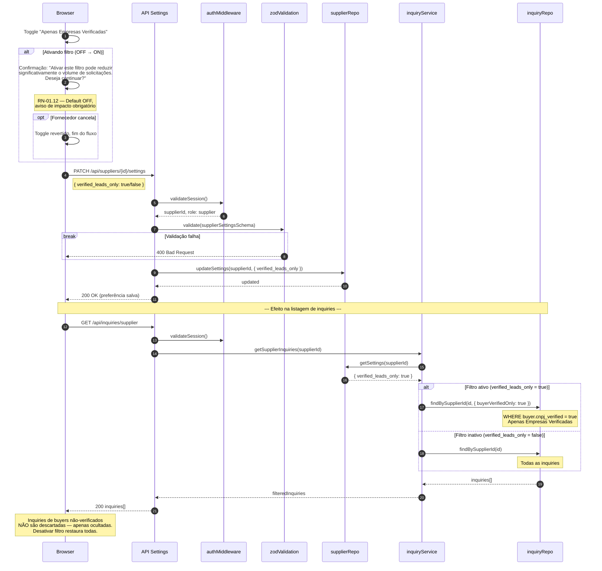
```mermaid
sequenceDiagram
    autonumber
    participant B as Browser
    participant API as API Settings
    participant AM as authMiddleware
    participant ZV as zodValidation
    participant SR as supplierRepo
    participant IS as inquiryService
    participant IR as inquiryRepo

    B->>B: Toggle "Apenas Empresas Verificadas"

    alt Ativando filtro (OFF → ON)
        B->>B: Confirmação: "Ativar este filtro pode reduzir<br/>significativamente o volume de solicitações.<br/>Deseja continuar?"
        Note over B: RN-01.12 — Default OFF,<br/>aviso de impacto obrigatório
        opt Fornecedor cancela
            B->>B: Toggle revertido, fim do fluxo
        end
    end

    B->>API: PATCH /api/suppliers/{id}/settings
    Note right of B: { verified_leads_only: true/false }
    API->>AM: validateSession()
    AM-->>API: supplierId, role: supplier
    API->>ZV: validate(supplierSettingsSchema)
    break Validação falha
        ZV-->>B: 400 Bad Request
    end

    API->>SR: updateSettings(supplierId, { verified_leads_only })
    SR-->>API: updated
    API-->>B: 200 OK (preferência salva)

    Note over B, IR: --- Efeito na listagem de inquiries ---

    B->>API: GET /api/inquiries/supplier
    API->>AM: validateSession()
    API->>IS: getSupplierInquiries(supplierId)
    IS->>SR: getSettings(supplierId)
    SR-->>IS: { verified_leads_only: true }

    alt Filtro ativo (verified_leads_only = true)
        IS->>IR: findBySupplierId(id, { buyerVerifiedOnly: true })
        Note over IR: WHERE buyer.cnpj_verified = true<br/>Apenas Empresas Verificadas
    else Filtro inativo (verified_leads_only = false)
        IS->>IR: findBySupplierId(id)
        Note over IR: Todas as inquiries
    end

    IR-->>IS: inquiries[]
    IS-->>API: filteredInquiries
    API-->>B: 200 inquiries[]
    Note over B: Inquiries de buyers não-verificados<br/>NÃO são descartadas — apenas ocultadas.<br/>Desativar filtro restaura todas.
```

**Fluxos alternativos:**

| # | Condição | Resultado | RN |
|---|----------|-----------|-----|
| ALT-1 | Ativação do filtro | Confirmação obrigatória com aviso de impacto | RN-01.12 |
| ALT-2 | Desativação do filtro | Restaura visualização de todos os leads sem aviso | FA-33.1 |
| ALT-3 | Inquiry de buyer não-verificado chega com filtro ativo | Inquiry criada normalmente, mas oculta da lista filtrada | FA-33.2 |

**Pós-condições:**
- Preferência de filtro salva no perfil do fornecedor
- Lista de leads filtrada conforme preferência
- Inquiries de buyers não-verificados continuam existindo no sistema (não são descartadas)

**Rastreabilidade:**
- **UCs:** UC-33
- **RFs:** RF-01.15
- **RNs:** RN-01.12

**Notas de implementação:**
- Campo `verified_leads_only` no registro `suppliers` (default: false)
- Filtro aplicado no query level: `inquiryRepository.findBySupplierId()` aceita opção `buyerVerifiedOnly`
- JOIN com `buyers` para verificar `cnpj_verified = true`
- UI: toggle com estado persistido, aviso modal apenas na ativação
- ⚠️ PENDÊNCIA: nomenclatura exata do filtro na UI (Vitor define)

---

## 10. Matriz de Rastreabilidade

### 10.1 SEQ × Use Cases

| SEQ | UC-01 | UC-02 | UC-03 | UC-05 | UC-06 | UC-07 | UC-08 | UC-11 | UC-13 | UC-14 | UC-15 | UC-17 | UC-21 | UC-24 | UC-25 | UC-26 | UC-27 | UC-28 | UC-29 | UC-30 | UC-31 | UC-32 | UC-33 |
|-----|:---:|:---:|:---:|:---:|:---:|:---:|:---:|:---:|:---:|:---:|:---:|:---:|:---:|:---:|:---:|:---:|:---:|:---:|:---:|:---:|:---:|:---:|:---:|
| SEQ-01 | **X** | | | | | | | | | | | | | | | | | | | | | | |
| SEQ-02 | | | | | | | | | | | | **X** | | | | | | | | | | | |
| SEQ-03 | | **X** | | | | | | | | | | | | | | | | | | | | | |
| SEQ-04 | | | **X** | | | | | | | | | | | | | | | | | | | | |
| SEQ-05 | | | | | | | | | | | | | | | **X** | | | | | | | | |
| SEQ-06 | | | | | | | | **X** | | | | | | | | | **X** | | | | | | |
| SEQ-07 | | | | | | | | | **X** | | | | | | | | | | | | | | |
| SEQ-08 | | | | **X** | | | | | | | | | | | | | | | | | | | |
| SEQ-09 | | | | | | | | | | **X** | | | | | | | | **X** | | | | | |
| SEQ-10 | | | | | | **X** | | | | | | | | | | | | | | | | | |
| SEQ-11 | | | | | | | **X** | | | | | | | | | | | | | | | | |
| SEQ-12 | | | | | | | | | | | | | | | | | | | | **X** | | | |
| SEQ-13 | | | | | | | | | | | | | | | | | | | **X** | | | | |
| SEQ-14 | | | | | **X** | | | | | | **X** | | **X** | | | | | | | | | | |
| SEQ-15 | | | | | | | | | | | | | | **X** | | | | | | | | | |
| SEQ-16 | | | | | | | | | | | | | | | | **X** | | | | | | | |
| SEQ-17 | | | | | | | | | | | | | | | | | | | | | **X** | | |
| SEQ-18 | | | | | | | | | | | | | | | | | | | | | | **X** | |
| SEQ-19 | | | | | | | | | | | | | | | | | | | | | | | **X** |

**Cobertura: 23/33 UCs** (70%)

### 10.2 UCs Não Cobertos — Justificativa

| UC | Nome | Fase | Justificativa de Exclusão |
|----|------|------|--------------------------|
| UC-04 | Gerenciar produtos (edit/pause/delete) | MVP | CRUD puro sem interação cross-domain. Operações cobertas parcialmente por SEQ-04 (create). |
| UC-09 | Gerenciar assinatura | MON | Upgrade/downgrade cobertos no SEQ-10. Cancel implícito no SEQ-13 (dunning). |
| UC-10 | Importar produtos em massa | VAL | Job de batch processing simples [VAL], sem lógica de interação complexa. |
| UC-12 | Ativar buyer (Nível 2) | MVP | Usuário Nível 1 (SEQ-01) envia primeira inquiry e ativa como buyer. Sistema cria registro em `buyers` e concede permissões Nível 2. Fluxo direto sem cross-domain complexo. |
| UC-16 | Salvar fornecedor como favorito | VAL | Toggle simples [VAL]: INSERT/DELETE em `favorites`. Sem cross-domain. |
| UC-18 | Gerenciar fornecedores (admin) | MVP | CRUD admin: listar, buscar, filtrar. Suspensão coberta no SEQ-14. |
| UC-19 | Gerenciar categorias (admin) | MVP | CRUD admin puro. Sem lógica de negócio complexa. |
| UC-20 | Moderar produtos (admin) | MVP | Fluxo similar ao SEQ-14 (denúncia). Ação admin: aprovar/rejeitar. |
| UC-22 | Visualizar métricas (admin) | MVP | Dashboard de leitura (queries agregadas). Sem sequência de interação. |
| UC-23 | Criar perfil pré-cadastrado | VAL | Seed + claim flow [VAL]. Fluxo admin simples + email de claim. |

### 10.3 SEQ × Módulos RF

| SEQ | RF-01 Auth | RF-02 Perfil | RF-03 Catálogo | RF-04 Busca | RF-05 SEO | RF-06 Inquiries | RF-07 Leads | RF-08 Billing | RF-11 Moderação | RF-13 Notif |
|-----|:---:|:---:|:---:|:---:|:---:|:---:|:---:|:---:|:---:|:---:|
| SEQ-01 | **X** | | | | | | | | | |
| SEQ-02 | **X** | | | | | | | | | |
| SEQ-03 | | **X** | | | | | | | | |
| SEQ-04 | | | **X** | | | | | | | |
| SEQ-05 | | | | | **X** | | | | | |
| SEQ-06 | | | | **X** | | | | | | |
| SEQ-07 | | | | | | **X** | | | | |
| SEQ-08 | | | | | | **X** | | | | |
| SEQ-09 | | | | | | **X** | **X** | | | |
| SEQ-10 | | | | | | | **X** | | | |
| SEQ-11 | | | | | | **X** | **X** | | | |
| SEQ-12 | | | | | | | **X** | | | |
| SEQ-13 | | | | | | | | **X** | | |
| SEQ-14 | | | | | | | | | **X** | |
| SEQ-15 | **X** | | | | | | | | | |
| SEQ-16 | | | | | | | | | | **X** |
| SEQ-17 | **X** | | | | | | | | | |
| SEQ-18 | **X** | | | | | | | | | |
| SEQ-19 | | | | | | **X** | | | | |

**10/14 módulos RF cobertos diretamente.** Módulos RF-09 (Análise), RF-10 (Admin dashboard), RF-12 (Analytics avançado), RF-14 (Landing pages) não geram sequ��ncias complexas.

### 10.4 SEQ × Grupos RN

| SEQ | RN-01 Contas | RN-02 Perfil | RN-03 Busca | RN-04 Inquiries | RN-05 Distribuição | RN-06 Planos | RN-07 Moderação | RN-09 Retenção |
|-----|:---:|:---:|:---:|:---:|:---:|:---:|:---:|:---:|
| SEQ-01 | **X** | | | | | | | |
| SEQ-02 | **X** | | | | | | | |
| SEQ-03 | | **X** | | | | | | |
| SEQ-04 | | **X** | | | | | | |
| SEQ-05 | | | **X** | | | | | |
| SEQ-06 | | | **X** | | | | | |
| SEQ-07 | **X** | | | **X** | | | | |
| SEQ-08 | | | | **X** | | | | |
| SEQ-09 | | | | | **X** | | | |
| SEQ-10 | | | | | | **X** | | |
| SEQ-11 | | | | **X** | **X** | | | |
| SEQ-12 | | | | | **X** | | | |
| SEQ-13 | | | | | | **X** | | |
| SEQ-14 | | | | | | | **X** | |
| SEQ-15 | **X** | | | | | | | |
| SEQ-16 | | **X** | | | | | | **X** |
| SEQ-17 | **X** | **X** | | | | | | |
| SEQ-18 | **X** | | | | | | | |
| SEQ-19 | **X** | | | | | | | |

**8/10 grupos RN cobertos.** RN-08 (SLA leads) e RN-10 (Escala) são regras de configuração, não geram fluxos de interação.

---

## 11. Mapa de Interações

### 11.1 Services Mais Chamados (Hub Analysis)

| Service | Vezes chamado como participante | SEQs |
|---------|-------------------------------|------|
| **notificationService** | 15 | SEQ-01, 07, 08, 09, 10, 12, 13, 14, 15, 16, 17, 18 |
| **supplierRepository** | 8 | SEQ-03, 07, 09, 14, 15, 17, 19 (x2) |
| **authMiddleware** | 10 | SEQ-03, 04, 07, 08, 10, 11, 14, 17, 18, 19 |
| **Resend** | 14 | SEQ-01, 02, 07, 08, 09, 10, 13, 14, 15, 16, 17, 18 |
| **BrasilAPI** | 3 | SEQ-15, 17, 18 |
| **inquiryRepository** | 6 | SEQ-07, 08, 09, 11 (x2), 19 |
| **creditService** | 4 | SEQ-10, 11, 12, 13 |

**Hub principal:** `notificationService` — presente em 12 dos 19 cenários. É o service mais integrado do sistema, confirmando a análise de dependências do 3.1 (5 domínios dependem dele).

### 11.2 Services que Nunca Interagem Diretamente

| Service A | Service B | Motivo |
|-----------|-----------|--------|
| searchService | creditService | Busca é pública, créditos são privados |
| seoService | moderationService | SEO é geração de página, moderação é ação admin |
| analyticsService | billingService | Analytics lê dados, billing processa pagamentos |
| categoryService | leadService | Categorias são referência, leads são transacionais |

### 11.3 Padrões de Comunicação

| Padrão | Descrição | Exemplos |
|--------|-----------|---------|
| **Síncrono (request-response)** | Chamada direta, aguarda retorno | Service → Repository → PostgreSQL |
| **Fire-and-forget** | Dispara e não aguarda resultado | searchService → analyticsService.logSearch() |
| **Paralelo (par)** | Duas ações simultâneas | email (Resend) + realtime (Supabase) |
| **Job assíncrono** | Processamento adiado via cron/trigger | allocateWeeklyCredits, autoVerifyCNPJ |
| **Webhook (inbound)** | Sistema externo notifica o nosso | Stripe → /api/webhooks/stripe |

**Predominância:** 80% síncrono (request-response via API routes → services → repositories). Comunicação assíncrona limitada a: notificações (par email+realtime), analytics (fire-and-forget), jobs (cron), webhooks (Stripe).

---

## 12. Pendências e Observações

### 12.1 Edge Cases Identificados

| # | Edge Case | SEQ | Decisão Necessária |
|---|-----------|-----|-------------------|
| EC-01 | Comprador altera dados de contato entre envio da inquiry e desbloqueio pelo fornecedor | SEQ-11 | Snapshot no momento da inquiry garante consistência (já decidido, DM-02 do 2.5) |
| EC-02 | Fornecedor é suspenso enquanto tem inquiries pendentes de distribuição | SEQ-09 | Remover das próximas rodadas, mas manter as já distribuídas |
| EC-03 | Stripe webhook chega fora de ordem (payment_failed antes de checkout.completed) | SEQ-13 | Verificar status atual da subscription antes de processar |
| EC-04 | Race condition: dois requests simultâneos de unlock no mesmo inquiry | SEQ-11 | Constraint UNIQUE (inquiry_id, supplier_id) em leads + transação DB |
| EC-05 | Crédito semanal expira no meio de um desbloqueio (domingo 00:01 durante request) | SEQ-11/12 | Transação atômica garante consistência; se expirou, cai no fluxo "sem créditos" |

### 12.2 Cenários Excluídos com Justificativa

| Cenário | Motivo |
|---------|--------|
| CRUD de produtos (edit/pause/delete) | Operação direta: form → validate → update/soft-delete. Sem cross-domain. |
| Ativação de buyer (Nível 2) | Usuário Nível 1 envia inquiry → sistema cria registro `buyers` → Nível 2 ativo. Fluxo direto. |
| Favoritos (toggle) | INSERT/DELETE atômico em `favorites`. Sem lógica complexa. |
| Admin CRUD (fornecedores, categorias, produtos) | Operações admin sem interação cross-domain significativa. |
| Dashboard de métricas | Queries de leitura agregadas. Não gera sequência de interação. |
| Bulk import [VAL] | Job de processamento de arquivo. Fluxo linear sem branches complexos. |

### 12.3 Referência a Pendências (REFERENCIA §17)

- **ORM:** Prisma vs Drizzle (CTO decide) — afeta como repositories são implementados em todos os SEQs
- **Backend stack:** Node.js vs Python/FastAPI (CTO decide) — se Python, API routes viram endpoints FastAPI
- **CNPJ API:** BrasilAPI vs ReceitaWS (avaliar) — afeta SEQ-15, SEQ-17, SEQ-18
- **Convenção lib/:** Domain vs layer (CTO-01 do 3.1) — afeta organização dos services/repos

### 12.4 Observações Técnicas

- **Transações DB:** SEQ-11 (desbloqueio) é o cenário mais crítico para atomicidade. Supabase suporta transações via `rpc()` ou client-side transaction wrapper.
- **Webhooks Stripe:** Devem ser processados de forma idempotente. Manter tabela de `processed_webhook_ids` para deduplicação.
- **Rate limiting:** Implementado no `rateLimitMiddleware` (Cross-cutting, 3.1 seção 3.9). Tiers: navegação 100/min, forms 10/min, login 5/min.
- **Dois algoritmos independentes:** Busca (RN-03.01, SEQ-06) e distribuição (RN-05.04, SEQ-09) são implementações SEPARADAS. Nunca compartilham código de ranking.

---

## Resumo Quantitativo

| Métrica | Valor |
|---------|-------|
| **Total de diagramas Mermaid** | 19 sequenceDiagrams |
| **Cenários documentados** | 19 (SEQ-01 a SEQ-19) |
| **Grupos temáticos** | 7 |
| **Fase MVP** | 12 cenários |
| **Fase VAL/MON** | 1 cenário (SEQ-09) |
| **Fase MON** | 6 cenários |
| **UCs cobertos** | 23/33 (70%) |
| **Módulos RF cobertos** | 10/14 (71%) |
| **Grupos RN cobertos** | 8/10 (80%) |
| **Fluxos alternativos documentados** | 76 alt/opt/break flows |
| **Hub principal** | notificationService (12/19 SEQs) |
| **Padrão predominante** | Síncrono request-response (80%) |

---

Próximo artefato: **3.3 Mapa de Integrações** (Fase 3 — Detalhamento)
