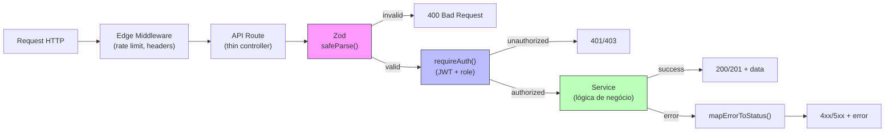
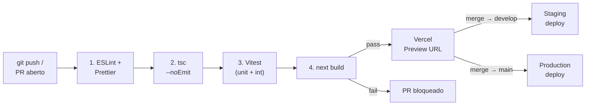

# Padrões e Convenções — GiroB2B

**Versão:** 1.0
**Data:** 2026-04-05
**Autor:** Gustavo (CEO) + Claude (Arquiteto)
**Público:** Time de desenvolvimento
**Insumo principal:** Artefatos 1.5, 2.3 a 2.6, 3.1 a 3.3, REFERENCIA_CONSOLIDADA

---

## Índice

1. [Princípios gerais](#1-princípios-gerais)
2. [Nomenclatura](#2-nomenclatura)
3. [Estrutura de diretórios](#3-estrutura-de-diretórios)
4. [Design Patterns obrigatórios](#4-design-patterns-obrigatórios)
5. [Padrões de API Routes](#5-padrões-de-api-routes)
6. [Padrões de banco de dados](#6-padrões-de-banco-de-dados)
7. [Tratamento de erros](#7-tratamento-de-erros)
8. [Logging e observabilidade](#8-logging-e-observabilidade)
9. [Testes](#9-testes)
10. [Git e versionamento](#10-git-e-versionamento)
11. [CI/CD](#11-cicd)
12. [Estilização e componentes UI](#12-estilização-e-componentes-ui)
13. [SEO e performance](#13-seo-e-performance)
14. [Segurança](#14-segurança)
15. [Internacionalização e localização](#15-internacionalização-e-localização)
16. [Documentação no código](#16-documentação-no-código)
17. [Rastreabilidade](#17-rastreabilidade)
18. [Pendências e decisões abertas](#18-pendências-e-decisões-abertas)

---

## 1. Princípios gerais

### 1.1 Filosofia de código

| # | Princípio | Descrição |
|---|-----------|-----------|
| P-01 | **Simplicidade** | Prefira a solução mais simples que resolve o problema. Três linhas repetidas > abstração prematura. |
| P-02 | **Coesão** | Cada módulo faz uma coisa. Services encapsulam lógica de negócio, repositories isolam queries, API routes são thin controllers. |
| P-03 | **Testabilidade** | Toda lógica de negócio deve ser testável sem HTTP, sem banco real. O Result Pattern e a injeção via repositories permitem isso. |
| P-04 | **Segurança por padrão** | Validação Zod no boundary, RLS no banco, sanitização de HTML, queries parametrizadas. Nunca confiar no client. |
| P-05 | **Tipagem estrita** | `strict: true` no TypeScript. Zero `any`. Union types com `as const`, não `enum`. |
| P-06 | **Consistência** | Quando em dúvida, siga o padrão documentado aqui. Se o padrão não existir, crie um e documente. |
| P-07 | **LGPD-first** | Sem cookies de analytics (PostHog cookieless — ADR-05). Consentimento explícito na ativação de buyer (RN-01.07). CPF nunca coletado (RN-01.13). |

### 1.2 Arquitetura: monolito modular

O GiroB2B segue a decisão **ADR-01** — monolito modular no Next.js:

- **Um repositório**, um deploy, uma linguagem (TypeScript end-to-end)
- API Routes organizadas por domínio (`/api/suppliers/*`, `/api/products/*`)
- Cada domínio é um módulo independente em `lib/`
- Microserviços só quando a complexidade justificar (estimativa: pós-mês 12)

> **Regra de ouro:** Se precisar de um novo padrão que não está aqui, proponha-o como ADR (seção 16.3) antes de implementar.

---

## 2. Nomenclatura

### 2.1 Tabela geral de convenções

| Elemento | Convenção | Exemplo | Fonte |
|----------|-----------|---------|-------|
| Arquivo TypeScript | camelCase | `authService.ts` | 2.6 |
| Diretório | kebab-case | `search-discovery/`, `notifications/` | 3.1 |
| Interface / Type | PascalCase | `Supplier`, `CreateProductDTO` | 2.6 |
| Variável / Função | camelCase | `getEffectivePlan()`, `supplierCount` | 2.6 |
| Constante | UPPER_SNAKE_CASE | `MAX_PRODUCTS_PER_PAGE`, `CREDIT_EXPIRY_DAYS` | 2.6 |
| Union type (enum-like) | UPPER_SNAKE values | `'PENDING' \| 'APPROVED'` | 2.6 |
| Tabela DB | snake_case, plural, inglês | `supplier_categories`, `credit_transactions` | 2.5 |
| Coluna DB | snake_case, inglês | `created_at`, `company_name`, `is_active` | 2.5 |
| PK | `id` (UUID v7) | `id UUID PRIMARY KEY DEFAULT gen_random_uuid()` | 2.5 |
| FK | `{entidade_singular}_id` | `supplier_id`, `category_id` | 2.5 |
| Índice DB | `idx_{tabela}_{colunas}` | `idx_products_supplier_id` | 2.5 |
| Constraint DB | `chk_{tabela}_{regra}` | `chk_products_price_range` | 2.5 |
| Unique DB | `unq_{tabela}_{colunas}` | `unq_suppliers_cnpj` | 2.5 |
| Enum DB | snake_case name, snake_case values | `inquiry_status_enum`, `'new'` | 2.5 |
| Rota API | kebab-case, plural | `/api/suppliers/[id]/products` | 3.1 |
| Rota pública (SEO) | slug com hífens | `/fornecedor-de/embalagens-em-sao-paulo` | 2.4 |
| Branch Git | `tipo/descrição-curta` | `feat/supplier-profile` | RNF-10.05 |
| Variável de ambiente | UPPER_SNAKE, prefixo por serviço | `SUPABASE_URL`, `STRIPE_SECRET_KEY` | 3.3 |
| Componente React | PascalCase (arquivo e export) | `SupplierCard.tsx` | 3.1 |
| Hook React | camelCase com prefixo `use` | `useSupplier.ts` | 3.1 |
| Arquivo de teste | mesmo nome + `.test.ts` | `authService.test.ts` | ADR-08 |
| Schema Zod | camelCase + `Schema` | `createProductSchema` | 2.6 |

### 2.2 Convenção de tipos (camadas)

| Camada | Padrão | Exemplo |
|--------|--------|---------|
| Interface base (domínio) | PascalCase singular | `Supplier`, `CreditWeekly` |
| DTO de criação | `Create{Entity}DTO` | `CreateUserDTO`, `UpgradeToSupplierDTO` |
| DTO de atualização | `Update{Entity}DTO` | `UpdateSupplierDTO` |
| DTO de ativação | `Activate{Entity}DTO` | `ActivateBuyerDTO` |
| Tipo derivado (view) | `{Entity}{Contexto}` | `SupplierPublicProfile`, `ProductCard` |
| Service | `{domain}Service` | `authService`, `searchService` |
| Repository | `{entity}Repository` | `supplierRepository`, `productRepository` |
| Schema Zod | `{operação}{Entity}Schema` | `createProductSchema`, `searchQuerySchema` |
| Enum (as const) | PascalCase (objeto), UPPER_SNAKE (valores) | `UserRole`, `InquiryStatus` |

### 2.3 Mapeamento DB ↔ TypeScript

O banco usa `snake_case`, o TypeScript usa `camelCase`. O mapeamento é automático na camada de repository (via ORM ou helper):

```typescript
// DB: company_name, created_at, profile_completeness
// TS: companyName, createdAt, profileCompleteness

// O repository retorna interfaces TypeScript já em camelCase
// O ORM (Prisma/Drizzle) faz o mapeamento automaticamente
```

### 2.4 Terminologia padronizada

Termos do domínio de negócio seguem a tabela da REFERENCIA §13:

| Termo PT-BR (UI) | Código/API (EN) | NUNCA usar |
|-------------------|------------------|------------|
| Marketplace | — | classificados, diretório, portal |
| Fornecedor | `supplier` | vendedor, lojista, anunciante |
| Comprador | `buyer` | cliente (ambíguo) |
| Solicitação de cotação | `inquiry` | mensagem, chat, pergunta |
| Lead | `lead` | contato (genérico demais) |
| Crédito (de lead) | `credit` | moeda, token |
| Desbloqueio | `unlock` | compra de lead |
| Plano | `plan` (starter/pro/premium) | pacote |
| Conta gratuita | `free` | plano gratuito |
| Selo Verificado | `verified_badge` | certificado |

---

## 3. Estrutura de diretórios

### 3.1 Visão geral (App Router + lib/)

O projeto segue Next.js 16.2 com App Router (ADR-07). A estrutura abaixo apresenta a **Opção A (por domínio)**, recomendada por consistência com ADR-01 (monolito modular). A Opção B (por camada) é documentada como alternativa na seção 3.3.

> **⚠️ Pendência CTO-01:** Vitor deve confirmar a convenção antes do início da implementação.

```
girob2b/
├── src/
│   ├── app/                                      # App Router (Next.js 16)
│   │   ├── (public)/                             # Rotas públicas (SEO)
│   │   │   ├── produto/[slug]/page.tsx           # ISR 60s
│   │   │   ├── categoria/[slug]/page.tsx         # SSG + ISR
│   │   │   ├── fornecedores/[loc]/page.tsx       # SSG
│   │   │   ├── fornecedor-de/[combo]/page.tsx    # ISR 300s
│   │   │   ├── fornecedor/[slug]/page.tsx        # ISR 300s
│   │   │   └── busca/page.tsx                    # SSR
│   │   ├── (auth)/                               # Rotas de autenticação
│   │   │   ├── login/page.tsx
│   │   │   ├── cadastro/page.tsx                 # Cadastro unificado (Nível 1)
│   │   │   ├── upgrade/fornecedor/page.tsx       # Upgrade supplier (UC-31)
│   │   │   ├── comprador/verificar-empresa/page.tsx # Verificação empresa (UC-32)
│   │   │   └── recuperar-senha/page.tsx
│   │   ├── (dashboard)/                          # Painéis (autenticado)
│   │   │   ├── fornecedor/
│   │   │   │   ├── page.tsx                      # Dashboard home
│   │   │   │   ├── produtos/page.tsx             # CRUD produtos
│   │   │   │   ├── inquiries/page.tsx            # Lista inquiries
│   │   │   │   └── leads/page.tsx                # CRM leads [MON]
│   │   │   ├── comprador/
│   │   │   │   ├── page.tsx                      # Dashboard home
│   │   │   │   └── inquiries/page.tsx            # Histórico inquiries
│   │   │   └── admin/
│   │   │       ├── page.tsx                      # Dashboard métricas
│   │   │       ├── fornecedores/page.tsx         # Gestão fornecedores
│   │   │       ├── moderacao/page.tsx            # Denúncias
│   │   │       └── categorias/page.tsx           # Árvore categorias
│   │   ├── api/                                  # API Routes (thin controllers)
│   │   │   ├── auth/
│   │   │   │   ├── register/route.ts             # POST genérico (Nível 1)
│   │   │   │   ├── upgrade/supplier/route.ts     # POST upgrade (UC-31)
│   │   │   │   ├── login/route.ts
│   │   │   │   ├── logout/route.ts
│   │   │   │   ├── verify-email/route.ts
│   │   │   │   └── reset-password/route.ts
│   │   │   ├── suppliers/
│   │   │   │   ├── [id]/route.ts                 # GET, PATCH
│   │   │   │   ├── [id]/logo/route.ts            # POST
│   │   │   │   ├── [id]/categories/route.ts      # PUT
│   │   │   │   └── [id]/completeness/route.ts    # GET
│   │   │   ├── buyers/
│   │   │   │   └── verify-company/route.ts       # POST (UC-32)
│   │   │   ├── products/
│   │   │   │   ├── route.ts                      # POST
│   │   │   │   ├── [id]/route.ts                 # GET, PATCH, DELETE
│   │   │   │   ├── [id]/pause/route.ts           # PATCH
│   │   │   │   ├── [id]/images/route.ts          # POST
│   │   │   │   └── supplier/[supplierId]/route.ts # GET
│   │   │   ├── categories/
│   │   │   │   ├── route.ts                      # GET, POST
│   │   │   │   └── [id]/route.ts                 # PATCH
│   │   │   ├── search/
│   │   │   │   └── route.ts                      # GET
│   │   │   ├── inquiries/
│   │   │   │   ├── route.ts                      # POST
│   │   │   │   ├── supplier/route.ts             # GET
│   │   │   │   ├── buyer/route.ts                # GET
│   │   │   │   ├── [id]/route.ts                 # GET
│   │   │   │   ├── [id]/status/route.ts          # PATCH
│   │   │   │   ├── [id]/report/route.ts          # POST
│   │   │   │   └── [id]/respond/route.ts         # POST
│   │   │   ├── leads/                            # [MON]
│   │   │   │   ├── route.ts                      # GET
│   │   │   │   ├── unlock/[inquiryId]/route.ts   # POST
│   │   │   │   └── [id]/status/route.ts          # PATCH
│   │   │   ├── subscriptions/                    # [MON]
│   │   │   │   ├── plans/route.ts                # GET
│   │   │   │   ├── route.ts                      # POST
│   │   │   │   ├── [id]/upgrade/route.ts         # POST
│   │   │   │   ├── [id]/downgrade/route.ts       # POST
│   │   │   │   └── [id]/cancel/route.ts          # POST
│   │   │   ├── billing/                          # [MON]
│   │   │   │   ├── credits/route.ts              # GET
│   │   │   │   ├── credits/extras/route.ts       # POST
│   │   │   │   └── history/route.ts              # GET
│   │   │   ├── notifications/
│   │   │   │   ├── route.ts                      # GET
│   │   │   │   ├── [id]/read/route.ts            # PATCH
│   │   │   │   └── preferences/route.ts          # GET, PATCH [VAL]
│   │   │   ├── admin/
│   │   │   │   ├── reports/route.ts              # GET
│   │   │   │   ├── reports/[id]/route.ts         # PATCH
│   │   │   │   ├── actions/route.ts              # GET, POST
│   │   │   │   ├── suppliers/[id]/suspend/route.ts  # POST
│   │   │   │   └── suppliers/[id]/reactivate/route.ts # POST
│   │   │   ├── webhooks/
│   │   │   │   └── stripe/route.ts               # POST [MON]
│   │   │   └── health/
│   │   │       └── route.ts                      # GET
│   │   ├── sitemap.xml/route.ts
│   │   ├── robots.txt/route.ts
│   │   └── layout.tsx                            # Layout raiz
│   │
│   ├── lib/                                      # Lógica de negócio (por DOMÍNIO)
│   │   ├── identity/
│   │   │   ├── authService.ts
│   │   │   ├── supplierService.ts
│   │   │   ├── profileRepository.ts
│   │   │   ├── supplierRepository.ts
│   │   │   ├── buyerRepository.ts
│   │   │   ├── locationRepository.ts
│   │   │   ├── cnpjClient.ts                     # Wrapper BrasilAPI/ReceitaWS
│   │   │   └── index.ts                          # Re-exports públicos
│   │   ├── catalog/
│   │   │   ├── productService.ts
│   │   │   ├── categoryService.ts
│   │   │   ├── productRepository.ts
│   │   │   ├── categoryRepository.ts
│   │   │   └── index.ts
│   │   ├── search/
│   │   │   ├── searchService.ts
│   │   │   ├── seoService.ts
│   │   │   ├── ranking.ts                        # Constantes RN-03.01
│   │   │   └── index.ts
│   │   ├── inquiries/
│   │   │   ├── inquiryService.ts
│   │   │   ├── inquiryRepository.ts
│   │   │   └── index.ts
│   │   ├── leads/                                # [MON]
│   │   │   ├── distributionService.ts
│   │   │   ├── leadService.ts
│   │   │   ├── distributionRepository.ts
│   │   │   ├── leadRepository.ts
│   │   │   ├── distribution.ts                   # Constantes RN-05.04
│   │   │   └── index.ts
│   │   ├── monetization/                         # [MON]
│   │   │   ├── subscriptionService.ts
│   │   │   ├── creditService.ts
│   │   │   ├── billingService.ts
│   │   │   ├── subscriptionRepository.ts
│   │   │   ├── creditRepository.ts
│   │   │   ├── paymentRepository.ts
│   │   │   ├── stripeClient.ts                   # Wrapper Stripe SDK
│   │   │   └── index.ts
│   │   ├── moderation/
│   │   │   ├── moderationService.ts
│   │   │   ├── reportRepository.ts
│   │   │   └── index.ts
│   │   ├── notifications/
│   │   │   ├── notificationService.ts
│   │   │   ├── analyticsService.ts
│   │   │   ├── notificationRepository.ts
│   │   │   ├── resendClient.ts                   # Wrapper Resend SDK
│   │   │   ├── templates/
│   │   │   │   ├── inquiry-received.tsx
│   │   │   │   ├── email-confirmation.tsx
│   │   │   │   ├── billing-notification.tsx
│   │   │   │   └── profile-reminder.tsx
│   │   │   └── index.ts
│   │   ├── validation/                           # Schemas Zod (cross-cutting)
│   │   │   ├── auth.ts
│   │   │   ├── supplier.ts
│   │   │   ├── buyer.ts
│   │   │   ├── product.ts
│   │   │   ├── category.ts
│   │   │   ├── inquiry.ts
│   │   │   ├── subscription.ts                   # [MON]
│   │   │   ├── search.ts
│   │   │   ├── report.ts
│   │   │   ├── notification.ts
│   │   │   ├── common.ts                         # paginationSchema, cnpjValidationSchema
│   │   │   └── index.ts
│   │   ├── middleware/
│   │   │   ├── auth.ts                           # JWT validation, role check
│   │   │   ├── rateLimit.ts                      # IP-based rate limiting
│   │   │   ├── securityHeaders.ts                # CSP, HSTS
│   │   │   └── errorHandler.ts                   # Sentry capture
│   │   └── utils/
│   │       ├── slug.ts                           # Geração de slugs SEO-friendly
│   │       ├── date.ts                           # Formatação, timezone BRT
│   │       ├── format.ts                         # Moeda, CNPJ, telefone
│   │       ├── result.ts                         # ServiceResult<T>, ServiceError
│   │       └── constants.ts                      # Limites, thresholds
│   │
│   ├── types/                                    # Interfaces TypeScript (30 do 2.6)
│   │   ├── identity.ts                           # Profile, Supplier, Buyer, Location
│   │   ├── catalog.ts                            # Product, ProductImage, SupplierImage
│   │   ├── inquiry.ts                            # Inquiry, InquiryResponse, Lead
│   │   ├── monetization.ts                       # Plan, Subscription, CreditWeekly
│   │   ├── moderation.ts                         # Report, AdminAction
│   │   ├── notification.ts                       # Notification, EmailLog
│   │   ├── analytics.ts                          # SearchLog, DashboardData
│   │   └── common.ts                             # AuditFields, PaginatedResult, ServiceResult, enums
│   │
│   ├── components/
│   │   ├── ui/                                   # Design system (Button, Input, Card, Modal)
│   │   ├── forms/                                # InquiryForm, ProductForm, RegisterForm
│   │   ├── layout/                               # Header, Footer, Sidebar, Breadcrumbs
│   │   └── seo/                                  # MetaTags, JsonLd, OpenGraph
│   │
│   ├── styles/
│   │   └── globals.css                           # Tailwind v4 config
│   │
│   └── middleware.ts                              # Next.js Edge Middleware (pipeline)
│
├── public/
│   ├── icons/                                    # PWA icons
│   └── manifest.json                             # PWA manifest
│
├── supabase/
│   ├── migrations/                               # Migrations SQL versionadas
│   └── seed.sql                                  # Dados de desenvolvimento
│
├── .github/
│   └── workflows/                                # GitHub Actions CI/CD
│       └── ci.yml
│
├── .env.local                                    # Env local (git-ignored)
├── .env.example                                  # Template de env vars
├── next.config.ts
├── tailwind.config.ts                            # Tailwind v4 (CSS-first)
├── tsconfig.json                                 # TypeScript strict: true
├── vitest.config.ts
├── package.json
└── README.md
```

### 3.2 Onde fica cada coisa

| Tipo de arquivo | Localização | Exemplo |
|-----------------|-------------|---------|
| Página pública (SEO) | `app/(public)/` | `produto/[slug]/page.tsx` |
| Página de auth | `app/(auth)/` | `cadastro/page.tsx` |
| Página de dashboard | `app/(dashboard)/` | `fornecedor/produtos/page.tsx` |
| API Route | `app/api/{domínio}/` | `api/suppliers/[id]/route.ts` |
| Service | `lib/{domínio}/` | `lib/identity/authService.ts` |
| Repository | `lib/{domínio}/` | `lib/identity/supplierRepository.ts` |
| Schema Zod | `lib/validation/` | `lib/validation/product.ts` |
| Interface/Type | `types/` | `types/identity.ts` |
| Componente UI | `components/ui/` | `components/ui/Button.tsx` |
| Componente de feature | `components/forms/` | `components/forms/InquiryForm.tsx` |
| Middleware | `lib/middleware/` | `lib/middleware/auth.ts` |
| Utilitário | `lib/utils/` | `lib/utils/slug.ts` |
| Wrapper externo | `lib/{domínio}/` | `lib/monetization/stripeClient.ts` |
| Email template | `lib/notifications/templates/` | `templates/inquiry-received.tsx` |
| Migration SQL | `supabase/migrations/` | `20260405_create_suppliers.sql` |
| Teste | Co-located com o arquivo | `lib/identity/authService.test.ts` |

### 3.3 Opção B — Organização por camada (alternativa)

Se o CTO preferir a organização MVC-style, a alternativa é separar por camada técnica:

```
src/lib/
├── services/                        # Todos os 15 services juntos
│   ├── authService.ts
│   ├── supplierService.ts
│   ├── productService.ts
│   └── ... (15 services)
├── db/                              # Todos os 14 repositories juntos
│   ├── profileRepository.ts
│   ├── supplierRepository.ts
│   └── ... (14 repositories)
├── validation/                      # Todos os 25 schemas juntos
│   └── ... (25 schemas)
├── auth/                            # Auth helpers
├── email/                           # Email helpers
├── seo/                             # SEO helpers
└── utils/                           # Generic helpers
```

### 3.4 Comparação Opção A vs. Opção B

| Critério | Opção A (Domínio) | Opção B (Camada) |
|----------|-------------------|------------------|
| Coesão | **Alta** — tudo do domínio junto | Baixa — service longe do repo |
| Extração para microserviço | **Fácil** — mover pasta inteira | Difícil — extrair de múltiplas pastas |
| Navegação (dev) | Precisa saber o domínio | Precisa saber a camada |
| Consistência com 2.6 | **Sim** — 7 domínios mapeiam 1:1 | Parcial |
| Risco de import circular | Baixo (inter-domain via `index.ts`) | Médio (tudo numa pasta) |
| Familiaridade | Domain-Driven Design | MVC / Spring-style |

**Recomendação:** Opção A, consistente com ADR-01 (monolito modular com extração futura).

---

## 4. Design Patterns obrigatórios

### 4.1 Repository Pattern

**O que é:** Camada que isola todas as queries ao banco de dados. O restante da aplicação nunca importa o client Supabase/Prisma/Drizzle diretamente.

**Por que:** Facilita troca de ORM (decisão pendente Prisma vs Drizzle) sem afetar services. Permite mock em testes unitários.

**Interface base:**

```typescript
// lib/identity/supplierRepository.ts
import { Supplier } from '@/types/identity'

export async function findById(id: string): Promise<Supplier | null> {
  // Query agnostic — será Prisma, Drizzle ou Supabase client
  const { data, error } = await supabase
    .from('suppliers')
    .select('*')
    .eq('id', id)
    .is('deleted_at', null)
    .single()

  if (error || !data) return null
  return mapToSupplier(data) // snake_case → camelCase
}

export async function findByUserId(userId: string): Promise<Supplier | null> { ... }
export async function create(data: Omit<Supplier, 'id' | 'createdAt'>): Promise<Supplier> { ... }
export async function update(id: string, data: Partial<Supplier>): Promise<Supplier> { ... }
export async function softDelete(id: string): Promise<void> { ... }
```

**Regras:**
- Repositories vivem em `lib/{domínio}/`
- Sempre filtram `WHERE deleted_at IS NULL` por padrão (soft delete)
- Retornam interfaces TypeScript em camelCase (mapeamento automático)
- Nunca contêm lógica de negócio

**RNFs atendidos:** RNF-10.01 (manutenibilidade), RNF-10.03 (testabilidade)

---

### 4.2 Service Layer

**O que é:** Camada que encapsula toda a lógica de negócio. Services orquestram repositories, aplicam regras de negócio e retornam `ServiceResult<T>`.

**Por que:** Isola regras de negócio do HTTP. API routes não precisam conhecer RNs. Services são testáveis sem request/response.

**Interface base:**

```typescript
// lib/identity/authService.ts
import { ServiceResult } from '@/lib/utils/result'
import { CreateUserDTO, UpgradeToSupplierDTO } from '@/types/identity'
import * as profileRepo from './profileRepository'
import * as supplierRepo from './supplierRepository'
import * as locationRepo from './locationRepository'

export async function register(data: CreateUserDTO): Promise<ServiceResult<Profile>> {
  // 1. Criar auth user no Supabase Auth
  // 2. Criar profile (Nível 1)
  // 3. findOrCreate location
  // 4. Enviar email de confirmação
  return { success: true, data: profile }
}

export async function upgradeToSupplier(
  userId: string,
  data: UpgradeToSupplierDTO
): Promise<ServiceResult<Supplier>> {
  // 1. Verificar se já é supplier (RN-01.02)
  // 2. Validar CNPJ via BrasilAPI (UC-24)
  // 3. findOrCreate location
  // 4. Criar registro em suppliers
  return { success: true, data: supplier }
}

export async function activateBuyer(
  userId: string,
  lgpdConsent: ActivateBuyerDTO
): Promise<ServiceResult<Buyer>> {
  // 1. Verificar se já é buyer
  // 2. Validar consentimento LGPD (RN-01.07)
  // 3. Criar registro em buyers
  return { success: true, data: buyer }
}
```

**Regras:**
- Services vivem em `lib/{domínio}/`
- Nunca acessam `Request`/`Response` do HTTP
- Sempre retornam `ServiceResult<T>` (nunca throw — ver 4.3)
- Chamam repositories para acesso a dados
- Contêm todas as regras de negócio (RNs)

**RNFs atendidos:** RNF-10.01 (manutenibilidade), RNF-10.03 (testabilidade)

---

### 4.3 Result Pattern

**O que é:** Services retornam um union type `ServiceResult<T>` em vez de lançar exceções. Erros são valores, não exceções.

**Por que:** Elimina try/catch cascading. Força o caller a tratar ambos os caminhos. Torna o fluxo de erro explícito e tipado.

**Interface base:**

```typescript
// lib/utils/result.ts

type ServiceResult<T> =
  | { success: true; data: T }
  | { success: false; error: ServiceError }

interface ServiceError {
  code: string        // Ex: 'CNPJ_INACTIVE', 'RATE_LIMIT_EXCEEDED'
  message: string     // Mensagem técnica (EN) para logs
  details?: unknown   // Dados adicionais opcionais
}
```

**Exemplo de uso no API route:**

```typescript
// app/api/auth/register/route.ts
export async function POST(req: Request) {
  const body = await req.json()
  const parsed = createUserSchema.safeParse(body)
  if (!parsed.success) {
    return Response.json(
      { error: { code: 'VALIDATION_ERROR', message: parsed.error.message } },
      { status: 400 }
    )
  }

  const result = await authService.register(parsed.data)

  if (!result.success) {
    const status = mapErrorToStatus(result.error.code)
    return Response.json({ error: result.error }, { status })
  }

  return Response.json({ data: result.data }, { status: 201 })
}
```

**Regras:**
- Services NUNCA lançam exceções para erros de negócio
- Exceções inesperadas (DB down, network) são capturadas pelo error handler global e enviadas ao Sentry
- Códigos de erro são strings descritivas em UPPER_SNAKE: `'CNPJ_ALREADY_EXISTS'`, `'CREDITS_EXHAUSTED'`

**RNFs atendidos:** RNF-10.01 (manutenibilidade), RNF-09.02 (error tracking)

---

### 4.4 DTO Pattern

**O que é:** Interfaces separadas para cada boundary. A interface base reflete a tabela DB. DTOs definem o que entra e sai da API. O service faz o mapeamento.

**Por que:** Evita expor campos internos (deleted_at, audit fields). Permite evolução independente do DB e da API.

**Interfaces:**

```typescript
// types/identity.ts — Interface base (espelha DB)
interface Supplier {
  id: string
  userId: string
  companyName: string
  cnpj: string
  profileCompleteness: number
  createdAt: string
  updatedAt: string
  deletedAt: string | null
  // ... todos os campos
}

// DTOs — O que entra/sai da API
/** Cadastro genérico Nível 1 (UC-01, SEQ-01) */
interface CreateUserDTO {
  email: string
  password: string
  name: string
  phone: string
  city: string
  state: string
  // Sem CNPJ, sem companyName, sem role (RN-01.10, RN-01.13)
}

/** Upgrade para fornecedor Nível 3 (UC-31, SEQ-18) */
interface UpgradeToSupplierDTO {
  companyName: string
  cnpj: string
  // locationId derivado do profile (city, state) ou findOrCreate
}

/** Ativação como comprador Nível 2 (UC-12) — na primeira inquiry */
interface ActivateBuyerDTO {
  lgpdConsent: true        // obrigatório = true (RN-01.07)
  lgpdConsentAt: string    // timestamp do aceite
}

// Tipo derivado — O que o público vê
interface SupplierPublicProfile {
  id: string
  companyName: string
  tradeName: string | null
  description: string | null
  city: string
  state: string
  profileCompleteness: number
  verifiedBadge: boolean
  // Sem CNPJ, sem email, sem dados privados
}
```

**RNFs atendidos:** RNF-04.06 (validação), RNF-05.01 (LGPD — minimização de dados)

---

### 4.5 Schema Validation (Zod)

**O que é:** Schemas Zod validam toda entrada de dados no boundary (API routes). São compartilhados entre client (form validation) e server (API validation) via inferência de tipos.

**Por que:** Runtime type safety. TypeScript valida em compile time, Zod valida em runtime. Nunca confiar no client (RNF-04.06).

**Exemplo:**

```typescript
// lib/validation/product.ts
import { z } from 'zod'

export const createProductSchema = z.object({
  name: z.string().min(1).max(255),
  description: z.string().max(1000).optional(),
  categoryId: z.string().uuid(),                  // RN-02.04: obrigatório
  subcategoryId: z.string().uuid().optional(),
  sku: z.string().max(50).optional(),
  unitOfMeasure: z.string().max(50).optional(),
  minOrderQuantity: z.number().min(0).optional(),
  priceRangeMin: z.number().min(0).optional(),
  priceRangeMax: z.number().min(0).optional(),
  currency: z.string().length(3).default('BRL'),
}).refine(
  (data) => !data.priceRangeMin || !data.priceRangeMax
    || data.priceRangeMin <= data.priceRangeMax,
  { message: 'priceRangeMin must be <= priceRangeMax' }
)

// Inferência de tipo — DTO gerado automaticamente
export type CreateProductDTO = z.infer<typeof createProductSchema>
```

**Inventário de schemas (25 total):**
- 10 criação: `createUserSchema`, `upgradeToSupplierSchema`, `activateBuyerSchema`, `createProductSchema`, `createDirectInquirySchema`, `createGenericInquirySchema`, `createReportSchema`, `createCategorySchema`, `createSubscriptionSchema`, `createBuyerAlertSchema`
- 8 atualização: `updateSupplierProfileSchema`, `updateProductSchema`, `updateInquiryStatusSchema`, `updateLeadStatusSchema`, `updateNotificationPrefSchema`, `updateSystemConfigSchema`, `updateCategorySchema`, `planChangeSchema`
- 5 consulta/filtro: `searchQuerySchema`, `inquiryFilterSchema`, `adminFilterSchema`, `paginationSchema`, `cnpjValidationSchema`
- 2 domínio/cálculo: `profileCompletenessSchema`, `searchRankingSchema`

**RNFs atendidos:** RNF-04.05 (OWASP), RNF-04.06 (input validation)

---

### 4.6 Soft Delete

**O que é:** Registros "deletados" recebem `deleted_at TIMESTAMPTZ` em vez de serem removidos fisicamente. Janela de recuperação de 30 dias (RN-02.05).

**Por que:** Permite desfazer exclusões. Mantém integridade referencial. Timestamp (não boolean) permite calcular a janela de recuperação e fazer queries temporais.

**Implementação:**

```typescript
// Repository — soft delete
export async function softDelete(id: string): Promise<void> {
  await supabase
    .from('suppliers')
    .update({ deleted_at: new Date().toISOString() })
    .eq('id', id)
}

// Repository — queries SEMPRE filtram deleted_at
export async function findAll(): Promise<Supplier[]> {
  const { data } = await supabase
    .from('suppliers')
    .select('*')
    .is('deleted_at', null)       // ← padrão obrigatório
  return data?.map(mapToSupplier) ?? []
}
```

**Tabelas com soft delete (Padrão A):** `profiles`, `suppliers`, `products`

**Job de hard delete:** Após 30 dias, um job agendado remove permanentemente registros com `deleted_at < now() - interval '30 days'`.

**RNFs atendidos:** RNF-05.05 (LGPD — direito a exclusão com período de retenção)

---

### 4.7 Derived State

**O que é:** Campos que podem ser calculados a partir de outros dados não são armazenados redundantemente (com exceção de `profile_completeness`, que é calculado e persistido por performance).

**Por que:** Evita dessincronização. Se o plano muda em `subscriptions`, não precisa atualizar `suppliers.plan`.

**Exemplos:**

```typescript
// Plano efetivo — derivado via JOIN (DM-01, DM-03)
export async function getEffectivePlan(supplierId: string): Promise<PlanName | 'free'> {
  const { data } = await supabase
    .from('subscriptions')
    .select('plans(name)')
    .eq('supplier_id', supplierId)
    .in('status', ['active', 'trial'])
    .single()

  return data?.plans?.name ?? 'free'  // free = ausência de plano
}

// Role derivado em runtime (RN-01.10)
export async function getUserRole(userId: string): Promise<UserRole[]> {
  const roles: UserRole[] = ['user']  // Nível 1 sempre presente

  const buyer = await buyerRepo.findByUserId(userId)
  if (buyer) roles.push('buyer')       // Nível 2

  const supplier = await supplierRepo.findByUserId(userId)
  if (supplier) roles.push('supplier') // Nível 3

  return roles  // Dual-role permitido (RN-01.11)
}

// Completude — calculada e persistida (DM-07, exceção controlada)
export function calculateCompleteness(supplier: Supplier, products: Product[]): number {
  let score = 0
  if (supplier.logoUrl)                  score += 10  // Logo
  if (supplier.description?.length >= 100) score += 15  // Descrição ≥100 chars
  if (supplier.locationId)               score += 10  // Endereço
  if (supplier.phone)                    score += 10  // Telefone
  // ... RN-02.01 pesos completos
  return score
}
```

**RNFs atendidos:** RNF-10.01 (manutenibilidade — evita dessincronização)

---

### 4.8 Two Independent Rankings

**O que é:** O sistema possui dois algoritmos de ranking completamente independentes. Busca ≠ Distribuição. Devem permanecer separados.

**Por que:** Servem propósitos diferentes. Busca ordena resultados para o comprador. Distribuição seleciona fornecedores para inquiries genéricas. Unificá-los seria um erro de design.

| | Ranking de Busca (RN-03.01) | Ranking de Distribuição (RN-05.04) |
|---|---|---|
| **Propósito** | Ordenar resultados de busca pública | Selecionar suppliers para inquiries genéricas |
| **Service** | `searchService.rankResults()` | `distributionService.rankWithinRound()` |
| **Fator 1** | Relevância textual: **35%** | Relevância de categoria: **40%** |
| **Fator 2** | Nível do plano: **25%** | Proximidade geográfica: **25%** |
| **Fator 3** | Completude do perfil: **15%** | Tempo de resposta: **20%** |
| **Fator 4** | Proximidade geográfica: **15%** | Completude do perfil: **15%** |
| **Fator 5** | Frescor do cadastro: **10%** | — |
| **Fase** | MVP | [MON] |
| **Fonte** | REFERENCIA §16 | REFERENCIA §16 |

> **Nota:** O fator "Saturação semanal" foi removido do algoritmo de distribuição por falta de dados reais. Será implementado quando houver volume (REFERENCIA §17 #11).

**RNFs atendidos:** RNF-01.02 (performance de busca), RNF-02.01 (escalabilidade)

---

### 4.9 Thin Controller

**O que é:** API routes são thin controllers que fazem apenas: (1) parsear input com Zod, (2) verificar auth, (3) chamar service, (4) retornar response. Zero lógica de negócio.

**Por que:** Mantém routes testáveis e previsíveis. Toda lógica vive nos services (testáveis sem HTTP).

**Exemplo completo:**

```typescript
// app/api/products/route.ts
import { NextRequest } from 'next/server'
import { createProductSchema } from '@/lib/validation/product'
import * as productService from '@/lib/catalog/productService'
import { requireAuth } from '@/lib/middleware/auth'
import { mapErrorToStatus } from '@/lib/utils/result'

export async function POST(req: NextRequest) {
  // 1. Auth
  const auth = await requireAuth(req, ['supplier'])
  if (!auth.success) {
    return Response.json({ error: auth.error }, { status: 401 })
  }

  // 2. Validação Zod
  const body = await req.json()
  const parsed = createProductSchema.safeParse(body)
  if (!parsed.success) {
    return Response.json(
      { error: { code: 'VALIDATION_ERROR', message: parsed.error.message } },
      { status: 400 }
    )
  }

  // 3. Service call
  const result = await productService.create(auth.data.supplierId, parsed.data)

  // 4. Response
  if (!result.success) {
    return Response.json({ error: result.error }, { status: mapErrorToStatus(result.error.code) })
  }

  return Response.json({ data: result.data }, { status: 201 })
}
```

**Regra:** Se um API route tem mais de ~30 linhas, provavelmente tem lógica que deveria estar no service.

**RNFs atendidos:** RNF-10.01 (manutenibilidade), RNF-10.03 (testabilidade)

---

### 4.10 External Service Wrapper (DC-07)

**O que é:** Cada serviço externo tem um thin wrapper no domínio correspondente, isolando a dependência de SDK.

**Por que:** Facilita mock em testes. Permite trocar provider (ex: ReceitaWS → BrasilAPI) sem impactar services.

**Wrappers definidos:**

| Wrapper | Localização | SDK | Domínio |
|---------|-------------|-----|---------|
| `stripeClient.ts` | `lib/monetization/` | Stripe SDK | Monetização [MON] |
| `resendClient.ts` | `lib/notifications/` | Resend SDK | Notificações |
| `cnpjClient.ts` | `lib/identity/` | BrasilAPI/ReceitaWS | Identidade |

**Exemplo:**

```typescript
// lib/identity/cnpjClient.ts
import { ServiceResult } from '@/lib/utils/result'

interface CnpjData {
  cnpj: string
  razaoSocial: string
  situacao: string  // 'Ativa', 'Baixada', etc.
  atividadePrincipal: string
}

export async function validateCnpj(cnpj: string): Promise<ServiceResult<CnpjData>> {
  try {
    const res = await fetch(`https://brasilapi.com.br/api/cnpj/v1/${cnpj}`)
    if (!res.ok) {
      return { success: false, error: { code: 'CNPJ_NOT_FOUND', message: 'CNPJ not found' } }
    }
    const data = await res.json()
    if (data.situacao_cadastral !== 'Ativa') {
      return { success: false, error: { code: 'CNPJ_INACTIVE', message: `CNPJ status: ${data.situacao_cadastral}` } }
    }
    return { success: true, data: mapToCnpjData(data) }
  } catch (err) {
    return { success: false, error: { code: 'CNPJ_SERVICE_UNAVAILABLE', message: 'BrasilAPI unavailable' } }
  }
}
```

**RNFs atendidos:** RNF-10.01 (manutenibilidade), RNF-10.03 (testabilidade)

---

### 4.11 Job Handler (DC-08)

**O que é:** Jobs assíncronos seguem uma interface padronizada `JobHandler`. MVP usa Supabase Edge Functions; escala migra para BullMQ + Redis.

**Por que:** Interface padronizada facilita migração de runtime. `ServiceResult<void>` mantém consistência com services.

**Interface base:**

```typescript
// lib/utils/jobHandler.ts
interface JobHandler {
  name: string
  schedule?: string                    // Cron expression (se periódico)
  execute(payload?: unknown): Promise<ServiceResult<void>>
}
```

**Inventário de jobs (7 total):**

| Job | Domínio | Fase | Frequência |
|-----|---------|------|------------|
| `autoVerifyCNPJJob` | Moderation | MVP | On-register |
| `revalidateCNPJJob` | Moderation | MVP | Cada 90 dias |
| `autoArchiveStaleJob` | Inquiries | [VAL] | Diário |
| `bulkImportJob` | Catalog | [VAL] | On-demand |
| `distributeInquiryJob` | Leads | [MON] | On-inquiry |
| `handleExpiredQueueJob` | Leads | [MON] | Periódico |
| `allocateWeeklyCreditsJob` | Monetization | [MON] | Dom 00:01 BRT |

**Evolução planejada:**
- **MVP/VAL:** Supabase Edge Functions (2 jobs)
- **MON:** Edge Functions + pg_cron para `allocateWeeklyCredits` (5 jobs)
- **ESC:** Avaliar migração para BullMQ + Redis se volume justificar

> **⚠️ Pendência CTO-02:** Vitor decide o job runner do MVP (Edge Functions vs alternativas).

**RNFs atendidos:** RNF-02.02 (escalabilidade), RNF-10.01 (manutenibilidade)

---

## 5. Padrões de API Routes

### 5.1 Fluxo padrão de um endpoint



### 5.2 Response format padronizado

Todas as respostas seguem a mesma estrutura:

```typescript
// Sucesso
{
  "data": { ... }                    // Payload
}

// Sucesso com paginação
{
  "data": [ ... ],
  "pagination": {
    "total": 150,
    "page": 1,
    "limit": 20,
    "hasMore": true
  }
}

// Erro
{
  "error": {
    "code": "CNPJ_ALREADY_EXISTS",   // Código máquina (UPPER_SNAKE)
    "message": "CNPJ já cadastrado"  // Mensagem humana (PT-BR para user-facing)
  }
}
```

### 5.3 Status codes

| Situação | Status | Quando usar |
|----------|--------|-------------|
| Sucesso | `200 OK` | GET, PATCH com retorno |
| Criação | `201 Created` | POST que cria recurso |
| Sem conteúdo | `204 No Content` | DELETE, PATCH sem retorno |
| Validação | `400 Bad Request` | Zod validation falhou |
| Não autenticado | `401 Unauthorized` | JWT ausente ou expirado |
| Sem permissão | `403 Forbidden` | Role insuficiente (buyer tentando endpoint de supplier) |
| Não encontrado | `404 Not Found` | Recurso não existe (ou soft-deleted) |
| Conflito | `409 Conflict` | CNPJ já cadastrado, email duplicado |
| Rate limit | `429 Too Many Requests` | Limite de requisições excedido |
| Erro interno | `500 Internal Server Error` | Erro inesperado (capturado pelo error handler) |

### 5.4 Paginação

**Padrão MVP:** Offset-based pagination (mais simples, suficiente para o volume inicial).

```typescript
// Request
GET /api/suppliers?page=2&limit=20

// Response
{
  "data": [...],
  "pagination": {
    "total": 150,
    "page": 2,
    "limit": 20,
    "hasMore": true
  }
}
```

**Evolução futura (Escala):** Cursor-based pagination para feeds e listas muito longas.

### 5.5 Rate limiting (RNF-04.07)

| Categoria | Limite | Endpoints |
|-----------|--------|-----------|
| Navegação | 100 req/min/IP | GET de listagem, busca, páginas |
| Formulários | 10 req/min/IP | POST de inquiry, report, cadastro |
| Login | 5 req/min/IP | POST auth/login |
| Webhook | Sem limite (IP Stripe) | POST webhooks/stripe |

Rate limiting implementado no Edge Middleware (`middleware.ts`) com storage em memória (MVP) ou Redis (Escala).

### 5.6 Versionamento de API

**Decisão:** Sem versionamento no MVP. A API é consumida apenas pelo próprio frontend (monolito). Se surgir necessidade de API pública (Escala), adotar versionamento via URL prefix (`/api/v2/`).

---

## 6. Padrões de banco de dados

### 6.1 Convenções gerais

| Padrão | Regra | Exemplo |
|--------|-------|---------|
| **PK** | UUID v7 em todas as tabelas | `id UUID PRIMARY KEY DEFAULT gen_random_uuid()` |
| **FK** | `{entidade_singular}_id` | `supplier_id UUID REFERENCES suppliers(id)` |
| **Tabelas** | snake_case, plural, inglês | `supplier_categories`, `credit_transactions` |
| **Colunas** | snake_case, inglês | `company_name`, `profile_completeness` |
| **Índices** | `idx_{tabela}_{colunas}` | `idx_products_supplier_id` |
| **Constraints** | `chk_{tabela}_{regra}` | `chk_products_price_range` |
| **Unique** | `unq_{tabela}_{colunas}` | `unq_suppliers_cnpj` |
| **Triggers** | `trg_{tabela}_{ação}` | `trg_suppliers_updated_at` |

### 6.2 Audit fields — 4 padrões

| Padrão | Campos | Tabelas |
|--------|--------|---------|
| **A** — Ciclo de vida completo | `created_at`, `updated_at`, `deleted_at` | `profiles`, `suppliers`, `products` |
| **B** — Mutável sem soft delete | `created_at`, `updated_at` | `buyers`, `categories`, `plans`, `subscriptions`, `leads`, `notification_preferences` |
| **C** — Imutável (log/evento) | `created_at` | `inquiry_responses`, `credit_transactions`, `reports`, `admin_actions`, `email_logs`, `search_logs`, etc. |
| **D** — Configuração | `updated_at`, `updated_by` | `system_configs` |

**SQL dos padrões:**

```sql
-- Padrão A
created_at  TIMESTAMPTZ NOT NULL DEFAULT now(),
updated_at  TIMESTAMPTZ NOT NULL DEFAULT now(),
deleted_at  TIMESTAMPTZ  -- nullable, soft delete

-- Padrão B
created_at  TIMESTAMPTZ NOT NULL DEFAULT now(),
updated_at  TIMESTAMPTZ NOT NULL DEFAULT now()

-- Padrão C
created_at  TIMESTAMPTZ NOT NULL DEFAULT now()

-- Padrão D
updated_at  TIMESTAMPTZ NOT NULL DEFAULT now(),
updated_by  UUID REFERENCES profiles(id)
```

**Trigger `updated_at` (obrigatório para Padrões A e B):**

```sql
CREATE OR REPLACE FUNCTION update_updated_at()
RETURNS TRIGGER AS $$
BEGIN
    NEW.updated_at = now();
    RETURN NEW;
END;
$$ LANGUAGE plpgsql;

-- Aplicar em cada tabela com Padrão A ou B:
CREATE TRIGGER trg_suppliers_updated_at
    BEFORE UPDATE ON suppliers
    FOR EACH ROW EXECUTE FUNCTION update_updated_at();
```

### 6.3 ENUMs PostgreSQL

**Total:** 27 ENUMs definidos no ERD (2.5).

**Convenção de nomeação:** `{contexto}_enum` em snake_case.

```sql
-- Exemplos representativos
CREATE TYPE user_role AS ENUM ('user', 'supplier', 'buyer', 'admin');
CREATE TYPE inquiry_status_enum AS ENUM ('new', 'viewed', 'responded', 'archived', 'reported');
CREATE TYPE plan_name_enum AS ENUM ('starter', 'pro', 'premium');
CREATE TYPE subscription_status_enum AS ENUM ('trial', 'active', 'suspended', 'cancelled');
```

No TypeScript, ENUMs são mapeados como `as const` union types (não `enum` keyword):

```typescript
// types/common.ts
const UserRole = { USER: 'user', SUPPLIER: 'supplier', BUYER: 'buyer', ADMIN: 'admin' } as const
type UserRole = typeof UserRole[keyof typeof UserRole]

const InquiryStatus = {
  NEW: 'new', VIEWED: 'viewed', RESPONDED: 'responded',
  ARCHIVED: 'archived', REPORTED: 'reported'
} as const
type InquiryStatus = typeof InquiryStatus[keyof typeof InquiryStatus]
```

### 6.4 RLS (Row Level Security)

Toda tabela no Supabase tem policies RLS (ADR-04). Padrão geral:

```sql
-- Habilitar RLS
ALTER TABLE suppliers ENABLE ROW LEVEL SECURITY;

-- Padrão: SELECT público para dados ativos
CREATE POLICY "suppliers_select_public"
  ON suppliers FOR SELECT
  USING (status = 'active' AND deleted_at IS NULL);

-- Padrão: SELECT próprio para dados completos
CREATE POLICY "suppliers_select_own"
  ON suppliers FOR SELECT
  TO authenticated
  USING (user_id = auth.uid());

-- Padrão: UPDATE próprio
CREATE POLICY "suppliers_update_own"
  ON suppliers FOR UPDATE
  TO authenticated
  USING (user_id = auth.uid());

-- Padrão: Admin total
CREATE POLICY "suppliers_admin_all"
  ON suppliers FOR ALL
  TO authenticated
  USING (
    EXISTS (SELECT 1 FROM profiles WHERE id = auth.uid() AND role = 'admin')
  );
```

### 6.5 Migrations

**Localização:** `supabase/migrations/`

**Nomenclatura:** `{timestamp}_{descrição}.sql`

```
supabase/migrations/
├── 20260405120000_create_profiles.sql
├── 20260405120001_create_suppliers.sql
├── 20260405120002_create_products.sql
├── 20260405120003_create_inquiries.sql
└── 20260405120004_add_rls_policies.sql
```

**Regras:**
- Uma migration por tabela ou por alteração lógica
- Migrations são **idempotentes** quando possível (`CREATE TABLE IF NOT EXISTS`)
- Nunca alterar uma migration já executada em produção — criar nova migration
- Seeds de desenvolvimento em `supabase/seed.sql` (dados fictícios, nunca dados reais)

### 6.6 Índices

**Quando criar:**
- FKs usadas em JOINs (automático com alguns ORMs, explícito com Supabase)
- Colunas usadas em filtros de busca (`status`, `category_id`, `location_id`)
- Full-text search: `tsvector` + GIN (`idx_products_search_vector`)
- JSONB arrays: GIN (`idx_products_tags`)

**Quando NÃO criar:**
- PKs (já indexadas automaticamente)
- Colunas com baixa cardinalidade em tabelas pequenas
- Colunas usadas apenas em INSERT

### 6.7 JSONB — quando usar

| Uso correto | Exemplo | Índice |
|-------------|---------|--------|
| Tags auto-geradas | `products.tags` JSONB `["tag1","tag2"]` | GIN (`@>`) |
| Horário comercial | `suppliers.business_hours` JSONB | Sem índice (leitura direta) |
| Feature flags por plano | `plans.features` JSONB | Sem índice |
| Score de matching | `distribution_rounds.matching_score` JSONB | Sem índice |
| Configuração key-value | `system_configs.value` JSONB | Sem índice |

**Quando NÃO usar JSONB:** Para dados que precisam de FK, busca frequente por campo interno, ou relatórios agregados. Nesses casos, normalizar em tabela separada.

### 6.8 Decisões de modelagem (resumo do ERD)

| DM | Decisão | Justificativa |
|----|---------|---------------|
| DM-01 | `free` = ausência de plano | Sem registro em `plans` para free. Derivado no service. |
| DM-02 | Dados do buyer denormalizados na inquiry | Snapshot LGPD no momento do envio. |
| DM-03 | Plano efetivo derivado via JOIN | Sem coluna `plan` em `suppliers`. |
| DM-04 | `locations` como tabela normalizada | URLs SEO consistentes + lat/lng para proximidade. |
| DM-05 | Tags como JSONB array | Sem tabela N:N. GIN index para busca. |
| DM-06 | Soft delete com `deleted_at TIMESTAMPTZ` | Não boolean. Janela de 30 dias. |
| DM-07 | `profile_completeness` calculado e persistido | Exceção controlada — usado em ranking e dashboard. |
| DM-08 | `system_configs` key-value JSONB | Parâmetros ajustáveis sem deploy. |
| DM-09 | Target polimórfico em reports/admin_actions | `target_type` + `target_id` extensível. |

---

## 7. Tratamento de erros

### 7.1 Hierarquia de erros

```typescript
// lib/utils/result.ts

interface ServiceError {
  code: string        // UPPER_SNAKE — ex: 'CNPJ_ALREADY_EXISTS'
  message: string     // Mensagem técnica (EN) para logs
  details?: unknown   // Stack trace, field errors, etc.
}

// Códigos de erro por domínio
const ErrorCodes = {
  // Auth / Identity
  EMAIL_ALREADY_EXISTS: 'EMAIL_ALREADY_EXISTS',
  CNPJ_ALREADY_EXISTS: 'CNPJ_ALREADY_EXISTS',
  CNPJ_INACTIVE: 'CNPJ_INACTIVE',
  CNPJ_NOT_FOUND: 'CNPJ_NOT_FOUND',
  CNPJ_SERVICE_UNAVAILABLE: 'CNPJ_SERVICE_UNAVAILABLE',
  INVALID_CREDENTIALS: 'INVALID_CREDENTIALS',
  ALREADY_SUPPLIER: 'ALREADY_SUPPLIER',
  ALREADY_BUYER: 'ALREADY_BUYER',

  // Products
  PRODUCT_LIMIT_EXCEEDED: 'PRODUCT_LIMIT_EXCEEDED',
  CATEGORY_NOT_FOUND: 'CATEGORY_NOT_FOUND',

  // Inquiries
  INQUIRY_RATE_LIMITED: 'INQUIRY_RATE_LIMITED',
  INQUIRY_DUPLICATE: 'INQUIRY_DUPLICATE',
  INQUIRY_NOT_FOUND: 'INQUIRY_NOT_FOUND',

  // Credits / Leads
  CREDITS_EXHAUSTED: 'CREDITS_EXHAUSTED',
  LEAD_ALREADY_UNLOCKED: 'LEAD_ALREADY_UNLOCKED',

  // General
  VALIDATION_ERROR: 'VALIDATION_ERROR',
  NOT_FOUND: 'NOT_FOUND',
  UNAUTHORIZED: 'UNAUTHORIZED',
  FORBIDDEN: 'FORBIDDEN',
  RATE_LIMIT_EXCEEDED: 'RATE_LIMIT_EXCEEDED',
  INTERNAL_ERROR: 'INTERNAL_ERROR',
} as const
```

### 7.2 Mapeamento ServiceError → HTTP status

```typescript
// lib/utils/result.ts
export function mapErrorToStatus(code: string): number {
  const map: Record<string, number> = {
    VALIDATION_ERROR: 400,
    INVALID_CREDENTIALS: 401,
    UNAUTHORIZED: 401,
    FORBIDDEN: 403,
    NOT_FOUND: 404,
    INQUIRY_NOT_FOUND: 404,
    CATEGORY_NOT_FOUND: 404,
    CNPJ_NOT_FOUND: 404,
    EMAIL_ALREADY_EXISTS: 409,
    CNPJ_ALREADY_EXISTS: 409,
    ALREADY_SUPPLIER: 409,
    ALREADY_BUYER: 409,
    LEAD_ALREADY_UNLOCKED: 409,
    INQUIRY_DUPLICATE: 409,
    RATE_LIMIT_EXCEEDED: 429,
    INQUIRY_RATE_LIMITED: 429,
    CREDITS_EXHAUSTED: 402,           // Payment Required
    CNPJ_INACTIVE: 422,
    CNPJ_SERVICE_UNAVAILABLE: 503,
  }
  return map[code] ?? 500
}
```

### 7.3 Logging de erros (Sentry)

```typescript
// lib/middleware/errorHandler.ts
import * as Sentry from '@sentry/nextjs'

export function captureServiceError(error: ServiceError, context?: Record<string, unknown>) {
  // Erros de negócio (4xx) → log info, sem Sentry
  const status = mapErrorToStatus(error.code)
  if (status < 500) {
    console.info(`[ServiceError] ${error.code}: ${error.message}`, context)
    return
  }

  // Erros inesperados (5xx) → Sentry + log error
  Sentry.captureException(new Error(error.message), {
    tags: { errorCode: error.code },
    extra: { ...context, details: error.details },
  })
  console.error(`[ServiceError] ${error.code}: ${error.message}`, context)
}
```

### 7.4 Error Boundaries (React)

```typescript
// components/ErrorBoundary.tsx — para erros de renderização no client
// Next.js App Router: usar error.tsx em cada route segment

// app/(dashboard)/fornecedor/error.tsx
'use client'
export default function Error({ error, reset }: { error: Error; reset: () => void }) {
  return (
    <div>
      <h2>Algo deu errado</h2>
      <p>Tente novamente ou entre em contato com o suporte.</p>
      <button onClick={reset}>Tentar novamente</button>
    </div>
  )
}
```

### 7.5 Idioma das mensagens de erro

| Contexto | Idioma | Exemplo |
|----------|--------|---------|
| Mensagem para o usuário (UI) | **PT-BR** | "CNPJ já cadastrado na plataforma" |
| Mensagem técnica (logs/Sentry) | **EN** | "CNPJ already exists in suppliers table" |
| Código de erro | **EN, UPPER_SNAKE** | `CNPJ_ALREADY_EXISTS` |

---

## 8. Logging e observabilidade

### 8.1 O que logar

| Logar | Exemplo |
|-------|---------|
| Início e fim de operações críticas | `[authService.register] started`, `completed in 245ms` |
| Erros de negócio (4xx) | `[inquiryService.create] INQUIRY_DUPLICATE for buyer_id=xxx` |
| Erros inesperados (5xx) | Stack trace completo via Sentry |
| Eventos de monetização | `[creditService.consume] credit consumed, supplier_id=xxx, remaining=4` |
| Resultados de busca | `[searchService.search] query="embalagens", results=42, took=120ms` |
| Jobs executados | `[allocateWeeklyCreditsJob] allocated credits for 150 suppliers in 3.2s` |

### 8.2 O que NUNCA logar (PII / Secrets)

| Proibido | Motivo |
|----------|--------|
| Senhas (plain ou hash) | RNF-04.01 |
| Tokens JWT completos | RNF-04.02 |
| Email/telefone do comprador | LGPD — usar `buyer_id` |
| CNPJ em logs de debug | Dado sensível — usar `supplier_id` |
| Chaves de API / secrets | RNF-04.11 |
| Body de request com dados pessoais | LGPD |

### 8.3 Structured logging

```typescript
// Formato JSON estruturado
{
  "timestamp": "2026-04-05T14:30:00.000Z",
  "level": "info",                    // info | warn | error
  "service": "authService",
  "method": "register",
  "requestId": "req_abc123",
  "userId": "usr_def456",             // Quando autenticado
  "duration": 245,                    // ms
  "message": "User registered successfully"
}
```

### 8.4 Stack de observabilidade

| Ferramenta | Função | Fase | Referência |
|------------|--------|------|------------|
| **Sentry** | Error tracking + alertas | MVP | INT-11, RNF-09.02 |
| **PostHog** | Analytics (cookieless, LGPD-first) | MVP | INT-12, ADR-05 |
| **Better Stack** | Uptime monitoring + alertas | MVP | INT-13, RNF-09.04 |
| **Vercel Analytics** | Core Web Vitals + performance | MVP | INT-14, RNF-01.04-06 |
| Vercel Functions Logs | Logs de API routes | MVP | RNF-09.01 |

### 8.5 Alertas (RNF-09.04)

| Alerta | Condição | Canal |
|--------|----------|-------|
| Downtime | Sistema indisponível > 1 min | Email + Discord |
| Taxa de erro | > 5% em janela de 5 min | Sentry |
| Latência | p95 > 2s | Vercel Analytics |
| Job falhou | Qualquer job com `success: false` | Sentry |

---

## 9. Testes

### 9.1 Framework e configuração

- **Framework:** Vitest (ADR-08) — mais rápido que Jest, integração nativa com TypeScript
- **Config:** `vitest.config.ts` na raiz do projeto
- **Coverage:** `@vitest/coverage-v8`

### 9.2 Estrutura de arquivos (co-location)

Testes ficam ao lado do arquivo testado, com sufixo `.test.ts`:

```
lib/identity/
├── authService.ts
├── authService.test.ts          # ← co-located
├── supplierService.ts
├── supplierService.test.ts
├── profileRepository.ts
└── profileRepository.test.ts
```

### 9.3 Categorias de testes

| Categoria | Escopo | Exemplo | Executado |
|-----------|--------|---------|-----------|
| **Unit** | Service isolado (repo mockado) | `authService.register()` retorna erro se email duplicado | CI (todo push) |
| **Integration** | Service + DB real | `productService.create()` persiste no Supabase local | CI (todo push) |
| **E2E** | Fluxo completo via API | `POST /api/auth/register` → `POST /api/products` → `GET /api/search` | Pré-deploy (staging) |

### 9.4 Cobertura mínima (RNF-10.03)

**Meta MVP:** 60% nas funções críticas, não 80%+ global.

**Funções críticas (obrigatórias):**
- `authService.register()`, `authService.upgradeToSupplier()`, `authService.activateBuyer()`
- `searchService.search()`, `searchService.rankResults()`
- `inquiryService.create()`
- `requireAuth()` middleware (RBAC)
- `cnpjClient.validateCnpj()`
- Todos os schemas Zod (validation)

### 9.5 Mocking

```typescript
// authService.test.ts
import { describe, it, expect, vi } from 'vitest'
import * as authService from './authService'
import * as profileRepo from './profileRepository'
import * as cnpjClient from './cnpjClient'

// Mock do repository
vi.mock('./profileRepository')
vi.mock('./cnpjClient')

describe('authService.register', () => {
  it('should create profile for valid input', async () => {
    vi.mocked(profileRepo.findByEmail).mockResolvedValue(null)
    vi.mocked(profileRepo.create).mockResolvedValue(mockProfile)

    const result = await authService.register(validCreateUserDTO)

    expect(result.success).toBe(true)
    if (result.success) {
      expect(result.data.email).toBe(validCreateUserDTO.email)
    }
  })

  it('should return error if email already exists', async () => {
    vi.mocked(profileRepo.findByEmail).mockResolvedValue(existingProfile)

    const result = await authService.register(validCreateUserDTO)

    expect(result.success).toBe(false)
    if (!result.success) {
      expect(result.error.code).toBe('EMAIL_ALREADY_EXISTS')
    }
  })
})
```

### 9.6 Testing de Zod schemas

```typescript
// lib/validation/product.test.ts
import { describe, it, expect } from 'vitest'
import { createProductSchema } from './product'

describe('createProductSchema', () => {
  it('should accept valid product', () => {
    const result = createProductSchema.safeParse({
      name: 'Embalagem PP 500ml',
      categoryId: '550e8400-e29b-41d4-a716-446655440000',
    })
    expect(result.success).toBe(true)
  })

  it('should reject if name is empty', () => {
    const result = createProductSchema.safeParse({
      name: '',
      categoryId: '550e8400-e29b-41d4-a716-446655440000',
    })
    expect(result.success).toBe(false)
  })

  it('should reject if priceRangeMin > priceRangeMax', () => {
    const result = createProductSchema.safeParse({
      name: 'Test',
      categoryId: '550e8400-e29b-41d4-a716-446655440000',
      priceRangeMin: 100,
      priceRangeMax: 50,
    })
    expect(result.success).toBe(false)
  })
})
```

---

## 10. Git e versionamento

### 10.1 Branching strategy (RNF-10.05)

Git Flow simplificado com 3 camadas:

```
main ←── produção (deploy automático via Vercel)
  └── develop ←── staging (preview automático)
        ├── feat/supplier-profile
        ├── fix/inquiry-dedup
        └── chore/update-deps
```

**Regras:**
- `main` = produção. Branch protection obrigatória. Merge via PR.
- `develop` = staging. Merge via PR (mesmo sendo 1 dev, CI valida).
- Feature branches criadas a partir de `develop`.
- Nenhum commit direto em `main` ou `develop`.

### 10.2 Branch naming

```
{tipo}/{descrição-curta-em-kebab-case}
```

| Tipo | Uso | Exemplo |
|------|-----|---------|
| `feat` | Nova funcionalidade | `feat/supplier-profile` |
| `fix` | Correção de bug | `fix/inquiry-dedup-race-condition` |
| `chore` | Manutenção, deps, configs | `chore/update-supabase-sdk` |
| `docs` | Documentação | `docs/api-readme` |
| `refactor` | Refatoração sem mudança de comportamento | `refactor/extract-ranking-service` |
| `test` | Adição/correção de testes | `test/auth-service-coverage` |
| `ci` | Pipeline CI/CD | `ci/add-lighthouse-check` |

### 10.3 Commit messages — Conventional Commits

```
{tipo}({escopo}): {descrição imperativa em inglês}

{corpo opcional — explica o "porquê"}

{footer opcional — Breaking changes, refs}
```

**Exemplos:**

```
feat(identity): add CNPJ validation via BrasilAPI

Validates CNPJ format and status (active/inactive) during supplier
upgrade flow (UC-31). Falls back to ReceitaWS if BrasilAPI is down.

Refs: UC-31, RN-01.01, RN-01.02
```

```
fix(inquiries): prevent duplicate inquiry within 24h window

Race condition allowed duplicate submissions when buyer double-clicked.
Added UNIQUE constraint on dedup_key column.

Refs: RN-04.04
```

**Regras:**
- Tipo e escopo em inglês, lowercase
- Descrição imperativa ("add", não "added" ou "adds")
- Linha 1 máx 72 caracteres
- Corpo opcional, separado por linha em branco
- Referências a RFs/RNs/UCs no footer quando aplicável

### 10.4 PR template

```markdown
## What
<!-- Resumo em 1-3 frases do que essa PR faz -->

## Why
<!-- Motivação: bug report, feature request, RFs/UCs atendidos -->

## How
<!-- Decisões de implementação relevantes -->

## Testing
- [ ] Testes unitários passando
- [ ] Testes de integração (se aplicável)
- [ ] Testado manualmente em preview

## Checklist
- [ ] Sem `any` no TypeScript
- [ ] Schemas Zod atualizados
- [ ] RLS policies atualizadas (se tocou no DB)
- [ ] Sem PII em logs
- [ ] Documentação atualizada (se mudou API)

## Screenshots
<!-- Se mudança visual, incluir antes/depois -->

## Refs
<!-- UC-XX, RF-XX.YY, RN-XX.YY, RNF-XX.YY -->
```

### 10.5 Code review checklist

Mesmo com 1 dev, o CI automatiza a maioria das checks. Para revisões futuras:

- [ ] Lógica de negócio está no service, não no API route?
- [ ] `ServiceResult<T>` usado (sem throw para erros de negócio)?
- [ ] Zod schema valida toda entrada?
- [ ] RLS policy cobre o novo endpoint?
- [ ] Testes cobrem happy path + edge case principal?
- [ ] Sem dados sensíveis em logs?
- [ ] Nomenclatura consistente com seção 2?

### 10.6 Merge strategy

**Squash merge** para feature branches → develop/main. Mantém histórico limpo com 1 commit por PR.

---

## 11. CI/CD

### 11.1 Pipeline GitHub Actions



### 11.2 Steps do pipeline

```yaml
# .github/workflows/ci.yml
name: CI
on:
  push:
    branches: [develop, main]
  pull_request:
    branches: [develop, main]

jobs:
  ci:
    runs-on: ubuntu-latest
    steps:
      - uses: actions/checkout@v4
      - uses: actions/setup-node@v4
        with:
          node-version: 24
          cache: 'npm'
      - run: npm ci

      # Step 1 — Lint
      - run: npx eslint . --max-warnings 0

      # Step 2 — Type check
      - run: npx tsc --noEmit

      # Step 3 — Tests
      - run: npx vitest run --coverage

      # Step 4 — Build
      - run: npx next build
```

### 11.3 Ambientes (RNF-10.04)

| Ambiente | Front-end | Banco | Env vars | Propósito |
|----------|-----------|-------|----------|-----------|
| **Local** | `next dev` (Turbopack) | Supabase local (Docker) | `.env.local` | Desenvolvimento |
| **Staging** | Vercel Preview (`develop`) | Supabase Free (projeto 2) | `.env.staging` | QA pré-produção |
| **Produção** | Vercel Production (`main`) | Supabase Pro (projeto 1) | `.env.production` | Usuários reais |

**Regra:** Dados de produção NUNCA vão para dev/staging (RNF-10.04). Seeds com dados fictícios.

### 11.4 Secrets management (3.3)

**28 variáveis de ambiente** documentadas no 3.3 (INT-01 a INT-18).

| Prefixo | Serviço | Exemplo |
|---------|---------|---------|
| `NEXT_PUBLIC_SUPABASE_` | Supabase (público) | `NEXT_PUBLIC_SUPABASE_URL` |
| `SUPABASE_` | Supabase (server) | `SUPABASE_SERVICE_ROLE_KEY` |
| `STRIPE_` | Stripe [MON] | `STRIPE_SECRET_KEY`, `STRIPE_WEBHOOK_SECRET` |
| `RESEND_` | Resend | `RESEND_API_KEY` |
| `SENTRY_` | Sentry | `SENTRY_DSN` |
| `NEXT_PUBLIC_POSTHOG_` | PostHog | `NEXT_PUBLIC_POSTHOG_KEY` |
| `CLOUDFLARE_` | R2/Turnstile | `CLOUDFLARE_R2_ACCESS_KEY_ID` |
| `NEXT_PUBLIC_TURNSTILE_` | Turnstile (público) | `NEXT_PUBLIC_TURNSTILE_SITE_KEY` |

**Regras:**
- Secrets gerenciados via Vercel Environment Variables (produção) e GitHub Secrets (CI)
- `NEXT_PUBLIC_` prefix = exposto ao client (apenas IDs públicos)
- Sem secrets no `.env.example` — apenas placeholders: `STRIPE_SECRET_KEY=sk_test_xxx`
- Nunca em código-fonte — scan com `git-secrets` ou `trufflehog` (RNF-04.11)

### 11.5 Deploy strategy

1. Dev faz push para feature branch
2. GitHub Actions roda lint → types → tests → build
3. Vercel cria Preview URL automática (ex: `feat-xyz.girob2b.vercel.app`)
4. PR review (CI valida)
5. Merge para `develop` → deploy automático para staging
6. Merge para `main` → deploy automático para produção
7. Zero-downtime (Vercel immutable deployments)
8. Rollback: reverter para deploy anterior em 1 clique no dashboard Vercel

---

## 12. Estilização e componentes UI

### 12.1 Tailwind CSS 4.2 — única forma de estilização

| Permitido | Proibido |
|-----------|----------|
| Tailwind utility classes | CSS Modules |
| `globals.css` (Tailwind config) | styled-components |
| `@apply` (uso mínimo, em `globals.css`) | CSS-in-JS (Emotion, Stitches) |
| CSS variables (via Tailwind) | Inline `style={{ }}` (exceto dinâmico calculado) |

### 12.2 Organização de componentes

```
components/
├── ui/                    # Design system — primitivos reutilizáveis
│   ├── Button.tsx         # Variantes: primary, secondary, outline, ghost
│   ├── Input.tsx          # Com label, error, helper text
│   ├── Card.tsx
│   ├── Modal.tsx
│   ├── Badge.tsx          # Selo Verificado, status
│   ├── Select.tsx
│   ├── Textarea.tsx
│   ├── Skeleton.tsx       # Loading state
│   └── Toast.tsx          # Notificações in-app
├── forms/                 # Formulários compostos (feature-specific)
│   ├── RegisterForm.tsx
│   ├── InquiryForm.tsx
│   ├── ProductForm.tsx
│   └── SupplierProfileForm.tsx
├── layout/                # Estrutura da página
│   ├── Header.tsx
│   ├── Footer.tsx
│   ├── Sidebar.tsx        # Dashboard
│   └── Breadcrumbs.tsx
└── seo/                   # Componentes de SEO
    ├── MetaTags.tsx
    ├── JsonLd.tsx
    └── OpenGraph.tsx
```

**Regras:**
- Componentes `ui/` são genéricos — nunca importam services ou tipos de domínio
- Componentes `forms/` podem importar schemas Zod e types
- Um componente por arquivo
- Props tipadas com interface (não inline): `interface ButtonProps { ... }`

### 12.3 Acessibilidade (RNF-06.01 a RNF-06.05)

| Requisito | Implementação |
|-----------|---------------|
| WCAG 2.1 AA | Lighthouse score >= 90 (RNF-06.01) |
| Alt text em imagens | Campo obrigatório no upload (RNF-06.02) |
| Contraste 4.5:1 | Design system com cores validadas (RNF-06.03) |
| Navegação por teclado | Tab order, `aria-describedby` em forms (RNF-06.04) |
| HTML semântico | `<header>`, `<nav>`, `<main>`, `<footer>`, ARIA landmarks (RNF-06.05) |

### 12.4 Responsividade

**Mobile-first.** Breakpoints padrão do Tailwind:

| Breakpoint | Min-width | Uso |
|------------|-----------|-----|
| (default) | 0 | Mobile |
| `sm` | 640px | Mobile landscape |
| `md` | 768px | Tablet |
| `lg` | 1024px | Desktop |
| `xl` | 1280px | Desktop wide |

### 12.5 Dark mode

**Decisão:** Não implementar no MVP. Prioridade é funcionalidade core. Implementar na fase Tração se houver demanda.

> **⚠️ Pendência:** Reavaliar dark mode na fase Tração (mês 10-12).

---

## 13. SEO e performance

### 13.1 Meta tags e structured data

```typescript
// components/seo/MetaTags.tsx — padrão para todas as páginas
interface MetaTagsProps {
  title: string           // "Embalagens em São Paulo | GiroB2B"
  description: string     // Máx 160 chars
  canonical: string       // URL canônica
  ogImage?: string        // Open Graph image (1200x630)
  jsonLd?: object         // Schema.org structured data
  noindex?: boolean       // Para páginas que não devem ser indexadas
}
```

**Structured data (Schema.org):**
- Produto: `Product` com `offers`, `brand`, `image`
- Fornecedor: `Organization` com `address`, `contactPoint`
- Busca: `SearchAction` (sitelinks searchbox)
- Breadcrumbs: `BreadcrumbList`

### 13.2 SEO programático (RF-05.x)

| Tipo de página | URL | Renderização | Revalidação |
|----------------|-----|--------------|-------------|
| Produto | `/produto/[slug]` | ISR | 60s |
| Categoria | `/categoria/[slug]` | SSG + ISR | Diária |
| Localidade | `/fornecedores/[loc]` | SSG | Diária |
| Categoria + Localidade | `/fornecedor-de/[combo]` | ISR | 300s |
| Perfil fornecedor | `/fornecedor/[slug]` | ISR | 300s |
| Busca | `/busca?q=...` | SSR | N/A |

**Volume estimado:** MVP ~4.750 páginas → Mês 12 ~51.000 → Mês 18 ~182.500.

### 13.3 Image optimization

- **`next/image`** obrigatório para todas as imagens (lazy loading, formatos modernos)
- **Cloudflare R2** (ADR-02) para storage — 10 GB free, sem egress fees
- Formatos: WebP (fallback JPEG). AVIF quando suporte browser > 90%
- Tamanhos: responsive sizes via `srcSet`

### 13.4 Bundle size budget (RNF-01.07)

| Métrica | Target |
|---------|--------|
| Page weight (sem imagens) | < 500 KB |
| First Load JS | < 100 KB (per route) |
| Total JS bundle | < 300 KB (gzipped) |

**Práticas:**
- Tree-shaking (union types `as const` em vez de `enum`)
- Dynamic imports para componentes pesados
- Sem dependências desnecessárias — cada `npm install` deve ser justificado

### 13.5 Core Web Vitals targets (RNF-01.04 a RNF-01.06)

| Métrica | Target (p75) | Medição |
|---------|--------------|---------|
| **LCP** (Largest Contentful Paint) | < 2.5s | Vercel Analytics + CrUX |
| **INP** (Interaction to Next Paint) | < 200ms | Vercel Analytics + CrUX |
| **CLS** (Cumulative Layout Shift) | < 0.1 | Vercel Analytics + CrUX |
| **Lighthouse Performance** | >= 90 (mobile) | CI + manual |

---

## 14. Segurança

### 14.1 Defense in depth (8 camadas)

| Camada | Componente | RNFs |
|--------|------------|------|
| 1. Rede | Cloudflare DDoS + WAF | RNF-04.08, RNF-04.10 |
| 2. Edge | Next.js Middleware (rate limiting, security headers) | RNF-04.07, RNF-04.09 |
| 3. Aplicação | Zod validation, sanitização HTML, queries parametrizadas | RNF-04.05, RNF-04.06 |
| 4. Autenticação | Supabase Auth (bcrypt cost 10+, JWT, refresh tokens) | RNF-04.01, RNF-04.02 |
| 5. Autorização | RBAC via RLS no PostgreSQL | RNF-04.03 |
| 6. Dados | Encryption at rest, logs de acesso LGPD | RNF-05.06, RNF-05.08 |
| 7. Secrets | Vercel env vars + GitHub Secrets | RNF-04.11 |
| 8. Monitoramento | Sentry (erros) + Better Stack (uptime) | RNF-09.02, RNF-09.04 |

### 14.2 Autenticação

- **Provider:** Supabase Auth (RNF-04.01)
- **Hashing:** bcrypt com cost factor >= 10
- **JWT:** Access token 24h, refresh token 7d (RNF-04.02)
- **Invalidação:** Tokens invalidados no logout
- **Brute-force:** 5 falhas → delay 30s, 10 falhas → block 15 min (RNF-04.04)

### 14.3 Autorização

**RBAC** implementado em 2 camadas:
1. **Middleware Next.js** — verifica JWT e role antes de chegar ao API route
2. **RLS PostgreSQL** — garante acesso mesmo se a API tiver bug (ADR-04)

```typescript
// lib/middleware/auth.ts
export async function requireAuth(
  req: NextRequest,
  allowedRoles: UserRole[]
): Promise<ServiceResult<AuthContext>> {
  const token = req.headers.get('authorization')?.replace('Bearer ', '')
  if (!token) {
    return { success: false, error: { code: 'UNAUTHORIZED', message: 'Missing token' } }
  }

  const { data: { user }, error } = await supabase.auth.getUser(token)
  if (error || !user) {
    return { success: false, error: { code: 'UNAUTHORIZED', message: 'Invalid token' } }
  }

  const roles = await getUserRole(user.id)
  const hasRole = allowedRoles.some(r => roles.includes(r))
  if (!hasRole) {
    return { success: false, error: { code: 'FORBIDDEN', message: 'Insufficient role' } }
  }

  return { success: true, data: { userId: user.id, roles } }
}
```

### 14.4 Input validation

- **Server-side:** Zod schema em todo API route (RNF-04.06). NUNCA confiar no client.
- **Client-side:** Mesmo Zod schema para UX (feedback imediato), mas não como camada de segurança.
- **SQL injection:** Queries parametrizadas via ORM (Prisma/Drizzle) ou Supabase client. Nunca string concatenation.
- **XSS:** Sanitização de HTML em campos de texto livre (`description`). CSP header.

### 14.5 Security headers (RNF-04.09)

```typescript
// lib/middleware/securityHeaders.ts
const securityHeaders = {
  'Content-Security-Policy': "default-src 'self'; script-src 'self' 'unsafe-inline'; style-src 'self' 'unsafe-inline'; img-src 'self' https://*.r2.dev data:; connect-src 'self' https://*.supabase.co https://*.posthog.com https://*.sentry.io;",
  'X-Content-Type-Options': 'nosniff',
  'X-Frame-Options': 'DENY',
  'Strict-Transport-Security': 'max-age=31536000; includeSubDomains',
  'Referrer-Policy': 'strict-origin-when-cross-origin',
  'Permissions-Policy': 'camera=(), microphone=(), geolocation=()',
}
```

### 14.6 Anti-bot

- **Cloudflare Turnstile** (INT-07) — captcha invisível em formulários críticos:
  - Cadastro (`/cadastro`)
  - Envio de inquiry
  - Reset de senha

---

## 15. Internacionalização e localização

| Aspecto | Regra | Exemplo |
|---------|-------|---------|
| Idioma da interface | **PT-BR** | "Enviar solicitação de cotação" |
| Idioma do código | **EN** | `supplierService.ts`, `getEffectivePlan()` |
| Idioma de variáveis | **EN** | `companyName`, `profileCompleteness` |
| Idioma de tabelas DB | **EN** | `suppliers`, `credit_transactions` |
| Idioma de comentários | **EN** | `// Validate CNPJ format (RN-01.01)` |
| Idioma de commits | **EN** | `feat(identity): add CNPJ validation` |
| Mensagens de erro (UI) | **PT-BR** | "CNPJ já cadastrado na plataforma" |
| Mensagens de erro (logs) | **EN** | "CNPJ already exists in suppliers table" |
| Moeda | **BRL (R$)** | `Intl.NumberFormat('pt-BR', { style: 'currency', currency: 'BRL' })` |
| Timezone | **America/Sao_Paulo** | `new Date().toLocaleString('pt-BR', { timeZone: 'America/Sao_Paulo' })` |
| Datas no DB | **ISO 8601 UTC** | `2026-04-05T14:30:00.000Z` |
| Datas na UI | **Formato brasileiro** | `05/04/2026 11:30` |
| Telefone | **Formato brasileiro** | `(11) 99999-9999` |
| CNPJ | **Formatação visual** | `65.542.877/0001-50` (armazenado como `65542877000150`) |

**Formatação de moeda:**

```typescript
// lib/utils/format.ts
export function formatCurrency(value: number): string {
  return new Intl.NumberFormat('pt-BR', {
    style: 'currency',
    currency: 'BRL',
  }).format(value)
}
// formatCurrency(79) → "R$ 79,00"
```

**Formatação de datas:**

```typescript
// lib/utils/date.ts
export function formatDate(isoString: string): string {
  return new Date(isoString).toLocaleDateString('pt-BR', {
    timeZone: 'America/Sao_Paulo',
  })
}
// formatDate('2026-04-05T14:30:00Z') → "05/04/2026"

export function formatDateTime(isoString: string): string {
  return new Date(isoString).toLocaleString('pt-BR', {
    timeZone: 'America/Sao_Paulo',
  })
}
// formatDateTime('2026-04-05T14:30:00Z') → "05/04/2026, 11:30:00"
```

---

## 16. Documentação no código

### 16.1 JSDoc — quando usar

| Usar JSDoc | Não usar JSDoc |
|------------|----------------|
| Funções públicas de services | Funções internas óbvias |
| Types/interfaces complexos | Interfaces que refletem a tabela 1:1 |
| Funções com comportamento não-óbvio | Getters/setters triviais |
| Constantes com regras de negócio | Variáveis locais |

**Exemplo:**

```typescript
/**
 * Calcula a completude do perfil do fornecedor conforme RN-02.01.
 *
 * Pesos: logo (10%) + descrição ≥100 chars (15%) + endereço (10%) +
 * telefone (10%) + 1+ categoria (10%) + 3+ produtos (20%) +
 * 1+ foto/produto (15%) + horário (5%) + ano fundação (5%).
 *
 * @returns Score de 0 a 100 (persistido em suppliers.profile_completeness)
 */
export function calculateCompleteness(supplier: Supplier, products: Product[]): number {
  // ...
}
```

### 16.2 README por domínio

Cada pasta de domínio em `lib/` pode ter um `README.md` opcional (recomendado para domínios complexos):

```markdown
<!-- lib/leads/README.md -->
# Leads & Distribution

Responsável pela distribuição de inquiries genéricas para fornecedores
e pelo sistema de créditos/desbloqueio.

## Services
- `distributionService` — algoritmo de distribuição (RN-05.01 a RN-05.10)
- `leadService` — desbloqueio e CRM

## Fase
[MON] — Monetização (mês 7-9)

## Regras de negócio
- RN-05.04: Pesos 40/25/20/15 (categoria/proximidade/tempo resposta/completude)
- RN-05.01: Máximo 5 fornecedores por inquiry
- RN-05.02: 3 rodadas com intervalo de 4h (provisório)
```

### 16.3 ADR log

**Localização:** `docs/adr/` (ou `documentacao_tecnica/` enquanto pré-code)

**Formato:**

```markdown
# ADR-{número}: {título}

**Data:** YYYY-MM-DD
**Status:** Aceito | Proposto | Substituído por ADR-XX
**Contexto:** Qual problema estamos resolvendo
**Decisão:** O que decidimos
**Consequências:** Trade-offs aceitos
```

**ADRs existentes (do 2.4):** ADR-01 a ADR-08 (ver seção 1.2 e REFERENCIA §24).

### 16.4 CHANGELOG

**Formato:** [Keep a Changelog](https://keepachangelog.com/)

```markdown
# Changelog

## [Unreleased]
### Added
- Supplier profile with completeness bar (UC-02)

### Fixed
- CNPJ validation timeout handling
```

**Política:** Atualizar o CHANGELOG a cada PR merged. Versões seguem SemVer quando houver API pública.

---

## 17. Rastreabilidade

### 17.1 Matriz: Padrões × RNFs de manutenibilidade

| Padrão | RNF-10.01 | RNF-10.02 | RNF-10.03 | RNF-10.04 | RNF-10.05 |
|--------|-----------|-----------|-----------|-----------|-----------|
| | Formatação + tipagem | CI/CD | Cobertura testes | Ambientes isolados | Git Flow |
| Repository Pattern | ✅ | — | ✅ | — | — |
| Service Layer | ✅ | — | ✅ | — | — |
| Result Pattern | ✅ | — | ✅ | — | — |
| DTO Pattern | ✅ | — | ✅ | — | — |
| Schema Validation (Zod) | ✅ | — | ✅ | — | — |
| Soft Delete | ✅ | — | — | — | — |
| Derived State | ✅ | — | — | — | — |
| Two Independent Rankings | — | — | ✅ | — | — |
| Thin Controller | ✅ | — | ✅ | — | — |
| External Service Wrapper | ✅ | — | ✅ | — | — |
| Job Handler | ✅ | — | ✅ | — | — |
| ESLint + Prettier | ✅ | ✅ | — | — | — |
| TypeScript strict | ✅ | ✅ | — | — | — |
| Vitest | — | ✅ | ✅ | — | — |
| GitHub Actions CI | — | ✅ | ✅ | — | — |
| Vercel Preview Deploys | — | ✅ | — | ✅ | — |
| Branch Protection | — | — | — | — | ✅ |
| `.env` por ambiente | — | — | — | ✅ | — |

**Cobertura:** 5/5 RNFs de manutenibilidade endereçados (100%).

### 17.2 Matriz: Padrões × outras categorias de RNF

| Padrão/Seção | Performance (01) | Segurança (04) | LGPD (05) | Acessibilidade (06) | Observabilidade (09) |
|---|---|---|---|---|---|
| SSG/ISR/SSR (ADR-03) | ✅ RNF-01.04-06 | — | — | — | — |
| Bundle budget | ✅ RNF-01.07 | — | — | — | — |
| Zod validation | — | ✅ RNF-04.05-06 | — | — | — |
| RLS (ADR-04) | — | ✅ RNF-04.03 | ✅ RNF-05.06 | — | — |
| Security headers | — | ✅ RNF-04.09 | — | — | — |
| Rate limiting | — | ✅ RNF-04.07 | — | — | — |
| PostHog cookieless | — | — | ✅ RNF-05.01 | — | — |
| Sentry integration | — | — | — | — | ✅ RNF-09.02 |
| Structured logging | — | — | — | — | ✅ RNF-09.01 |
| ARIA + semântica | — | — | — | ✅ RNF-06.01-05 | — |

### 17.3 Referência cruzada com artefatos

| Seção deste doc | Artefatos fonte |
|-----------------|----------------|
| 1. Princípios | 2.4 (ADR-01), 2.3 (princípios stack) |
| 2. Nomenclatura | 2.5 (DB naming), 2.6 (TS naming), REFERENCIA §13 |
| 3. Estrutura | 3.1 §5 (Opção A/B), 2.4 (App Router) |
| 4. Design Patterns | 2.6 §9 (8 patterns), 3.1 DC-07/DC-08 |
| 5. API Routes | 3.1 §4 (thin controller), 3.2 (sequências) |
| 6. Banco de dados | 2.5 (ERD completo, DM-01 a DM-09) |
| 7. Erros | 2.6 (ServiceResult), 3.2 (fluxos alternativos) |
| 8. Observabilidade | 3.3 INT-11 a INT-14, 1.5 RNF-09.x |
| 9. Testes | 2.4 ADR-08, 1.5 RNF-10.03 |
| 10. Git | 1.5 RNF-10.05 |
| 11. CI/CD | 2.4 §3 (infra), 3.3 INT-17/INT-18 |
| 12. UI | 2.3 (Tailwind 4.2), 1.5 RNF-06.x |
| 13. SEO | 2.4 ADR-03, 1.5 RNF-01.x, RNF-08.x |
| 14. Segurança | 2.4 §5 (8 camadas), 1.5 RNF-04.x |
| 15. i18n | REFERENCIA §13 (terminologia) |
| 16. Documentação | 2.4 (ADRs), 3.1 (README por domínio) |

---

## 18. Pendências e decisões abertas

### 18.1 Pendências herdadas

| ID | Pendência | Prioridade | Responsável | Fonte |
|----|-----------|-----------|-------------|-------|
| CTO-01 | Convenção diretórios `lib/`: Opção A (domínio) vs Opção B (camada) | **Alta** | Vitor (CTO) | 3.1 §5 |
| CTO-02 | Job runner MVP: Supabase Edge Functions vs alternativas | Média | Vitor (CTO) | 3.1 DC-08 |
| CTO-03 | R2 vs Supabase Storage: confirmar custo e implementação | Média | Vitor (CTO) | 3.1 |
| ORM | Prisma vs Drizzle | **Alta** | Vitor (CTO) | 2.3, 2.5, REFERENCIA §17 |
| Backend | Node.js puro ou Next.js API Routes | Média | Vitor (CTO) | 2.3, REFERENCIA §17 |
| API CNPJ | BrasilAPI vs ReceitaWS | Baixa | Vitor (CTO) | 2.3, 3.3 |

### 18.2 Pendências novas (identificadas neste artefato)

| ID | Pendência | Prioridade | Responsável | Contexto |
|----|-----------|-----------|-------------|----------|
| CTO-04 | Dark mode: implementar na fase Tração? | Baixa | Vitor + Gustavo | §12.5 |
| CTO-05 | Cursor-based pagination: migrar na fase Escala? | Baixa | Vitor | §5.4 |

### 18.3 Decisões tomadas neste artefato

| Decisão | Justificativa |
|---------|---------------|
| Sem versionamento de API no MVP | API consumida apenas pelo próprio frontend (monolito) |
| Offset-based pagination no MVP | Mais simples, suficiente para o volume inicial |
| Squash merge como estratégia | Histórico limpo, 1 commit por PR |
| Dark mode adiado para Tração | Prioridade é funcionalidade core |
| `mapErrorToStatus()` centralizado | Mapeamento consistente ServiceError → HTTP |

---

## Apêndice A — Quick reference card

Resumo de 1 página para consulta rápida:

```
NOMENCLATURA
  Arquivo TS:     camelCase         authService.ts
  Diretório:      kebab-case        search-discovery/
  Interface:      PascalCase        Supplier
  Variável:       camelCase         getEffectivePlan()
  Constante:      UPPER_SNAKE       MAX_PRODUCTS_PER_PAGE
  Tabela DB:      snake_case plural suppliers
  Coluna DB:      snake_case        company_name
  Branch:         tipo/descrição    feat/supplier-profile
  Commit:         Conventional      feat(identity): add CNPJ validation

ARQUITETURA
  API Route → Zod → Auth → Service → Repository → DB
  ServiceResult<T> = success + data | error + code
  Soft delete: deleted_at TIMESTAMPTZ (nunca boolean)
  PK: UUID v7 | FK: {entity}_id | Index: idx_{table}_{cols}
  RLS em todas as tabelas | Zod em todos os endpoints

STACK
  TypeScript 6.0 strict | Next.js 16.2 App Router | Tailwind 4.2
  Supabase (Auth + PG + Realtime) | Cloudflare (R2 + CDN + Turnstile)
  Vitest | ESLint + Prettier | GitHub Actions

PATTERNS
  Repository → Service → Thin Controller → Result Pattern
  DTO (domain ≠ API) | Zod (runtime validation) | Soft Delete
  Derived State (roles, plans) | Two Rankings (search ≠ distribution)
  External Wrappers (stripeClient, resendClient, cnpjClient)
  JobHandler interface (Edge Functions → BullMQ)
```

---

*Documento gerado em 2026-04-05. Fonte autoritativa para padrões de desenvolvimento do GiroB2B. Consultar REFERENCIA_CONSOLIDADA.md para decisões de negócio e produto.*
