# Fluxogramas de Processos — GiroB2B

**Versão:** 1.0
**Data:** 05/04/2026
**Autor:** Gustavo (CEO) + Claude (Arquiteto)
**Público:** Time de operações, desenvolvimento e gestão
**Insumo principal:** Artefatos 2.1, 2.2, 1.6, ESCOPO_PAINEL_ADMIN, 3.2, 3.4

---

## 0. Índice e Legenda

### 0.1 Índice de Fluxogramas

| FLOW-ID | Nome | Grupo |
|---------|------|-------|
| FLOW-01 | Cadastro Unificado e Progressão de Níveis | A — Onboarding e Verificação |
| FLOW-02 | Validação de CNPJ (com fallback) | A — Onboarding e Verificação |
| FLOW-03 | Criação de Perfil Pré-Cadastrado (Admin) | A — Onboarding e Verificação |
| FLOW-04 | Moderação de Produtos | B — Moderação e Compliance |
| FLOW-05 | Tratamento de Denúncias e Escalonamento | B — Moderação e Compliance |
| FLOW-06 | Suspensão e Reativação de Fornecedor | B — Moderação e Compliance |
| FLOW-07 | Cobrança Recorrente (com retentativas) | C — Monetização e Créditos |
| FLOW-08 | Ciclo de Vida dos Créditos | C — Monetização e Créditos |
| FLOW-09 | Distribuição de Inquiry Genérica (3 Waves) | D — Distribuição e Sistema |
| FLOW-10 | Geração de Páginas SEO Programáticas | D — Distribuição e Sistema |

### 0.2 Legenda Visual

#### Formas

| Forma | Significado | Sintaxe Mermaid |
|-------|-------------|-----------------|
| Retângulo | Ação / etapa normal | `A[texto]` |
| Losango | Decisão / condição | `A{texto}` |
| Retângulo arredondado | Início / fim | `A([texto])` |
| Paralelogramo | Entrada / saída de dados | `A[/texto/]` |
| Cilindro | Banco de dados | `A[(texto)]` |
| Hexágono | Evento / trigger assíncrono | `A{{texto}}` |

#### Cores por Ator

| Ator | Cor de Fundo | classDef |
|------|-------------|----------|
| Usuário / Comprador / Fornecedor | Azul claro `#E3F2FD` | `user` |
| Sistema | Roxo claro `#F3E5F5` | `system` |
| Admin | Laranja claro `#FFF3E0` | `admin` |
| Serviço externo | Verde claro `#E8F5E9` | `external` |
| Erro / exceção | Vermelho claro `#FFEBEE` | `error` |
| Sucesso / fim positivo | Verde claro `#E8F5E9` | `success` |

### 0.3 Relação com Outros Artefatos

| Artefato | Foco | Exemplo |
|----------|------|---------|
| **3.5 (este)** | Processo operacional: quem faz o quê, decisões, caminhos | "Admin revisa denúncia → decide ação → escalonamento automático" |
| **3.2 (Sequência)** | Sequência técnica: chamadas entre componentes do sistema | "Client → API Route → Service → Repository → Supabase" |
| **2.7/2.8 (Jornadas)** | Experiência do usuário: jornadas e touchpoints emocionais | "Fornecedor descobre plataforma → cadastra → recebe 1º lead" |

> Os diagramas de sequência (3.2) detalham o **como** técnico; os fluxogramas (3.5) detalham o **quem, quando e por quê** operacional. Não há duplicação — há complementaridade.

### 0.4 Como Usar Este Documento

1. **Operadores/Moderadores:** Consulte os fluxos do Grupo B (FLOW-04 a FLOW-06) para entender as decisões que devem ser tomadas no painel admin. Os thresholds de escalonamento estão no Apêndice A.
2. **CTO/Desenvolvimento:** Use os fluxogramas como requisitos para implementação. Cada decisão (losango) é um `if/else` no código. Cada hexágono é um job assíncrono ou evento. Cruze com os SEQs da coluna "SEQs relacionados" para ver as chamadas técnicas.
3. **CEO/Produto:** Os fluxos mostram a lógica operacional que sustenta as jornadas de usuário (2.7/2.8). Use para validar se o comportamento do sistema está alinhado com a estratégia de produto.
4. **Nomenclatura:** Todos os termos seguem a terminologia padronizada da REFERENCIA §13 (supplier, buyer, inquiry, lead, credit, unlock, plan, verified_badge). Termos em português são usados na descrição; termos em inglês são usados em referências técnicas.

### 0.5 Estados Chave das Entidades

#### Status do Fornecedor (supplier)

| Status | Descrição | Transições Possíveis |
|--------|-----------|---------------------|
| `active` | Conta ativa e visível | → `suspended`, → `deleted` |
| `pre_registered` | Criado por admin, aguardando reivindicação | → `active` (reivindicado) |
| `suspended` | Suspenso por violação ou inadimplência | → `active` (reativado), → `deleted` |
| `deleted` | Soft delete — anonimizado após 30d | Terminal |

#### Status da Inquiry

| Status | Descrição | Transições Possíveis |
|--------|-----------|---------------------|
| `nova` | Recebida, não visualizada pelo fornecedor | → `visualizada` |
| `visualizada` | Fornecedor abriu (dados ainda ocultos) | → `respondida`, → `arquivada`, → `denunciada` |
| `respondida` | Fornecedor desbloqueou dados e/ou respondeu | Terminal |
| `arquivada` | Fornecedor descartou (não relevante) | Terminal |
| `denunciada` | Fornecedor reportou como spam/falsa | → fila de moderação (FLOW-05) |
| `suspensa` | Auto-suspensa por 2+ denúncias | → fila admin (FLOW-05) |

#### Status do Plano (plan)

| Status | Descrição | Transições Possíveis |
|--------|-----------|---------------------|
| `free` | Conta gratuita — sem créditos | → `active` (assinatura) |
| `active` | Plano pago ativo — créditos semanais | → `suspended`, → `free` (cancelamento) |
| `suspended` | Suspenso por falha de pagamento | → `active` (pagamento regularizado), → `free` (D+30) |
| `trial` | Trial gratuito de 7 dias (Starter) | → `active` (conversão), → `free` (expirou) |

---

## 1. FLOW-01: Cadastro Unificado e Progressão de Níveis

**Resumo:** Visão panorâmica do onboarding progressivo em 3 níveis. Um usuário se cadastra sem definir role (Nível 1), ativa buyer na primeira inquiry (Nível 2) e/ou faz upgrade para supplier com CNPJ obrigatório (Nível 3). Os dois caminhos são independentes — dual-role é permitido (RN-01.11).

**Atores:** 👤 Usuário, 🛒 Comprador, 🏭 Fornecedor, ⚙️ Sistema

**Trigger(s):**
- Usuário acessa `/cadastro`

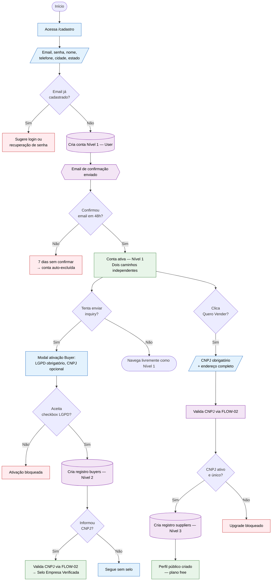

| Campo | Valor |
|-------|-------|
| ID | FLOW-01 |
| Atores | Usuário, Comprador, Fornecedor, Sistema |
| Trigger | Usuário acessa `/cadastro` |
| Pré-condições | Nenhuma (qualquer pessoa pode se cadastrar) |
| Pós-condições | Conta criada em 1 dos 3 níveis; role derivado em runtime (RN-01.10); CPF nunca coletado (RN-01.13) |
| UCs referenciados | UC-01, UC-12, UC-31, UC-32 |
| RNs referenciados | RN-01.01 a RN-01.13 |
| SEQs relacionados | SEQ-01, SEQ-17, SEQ-18 (3.2) |
| Fase | MVP |

**Notas e exceções:**

1. **Dual-role (RN-01.11):** Um mesmo usuário pode ativar buyer E supplier simultaneamente. O JWT permanece unificado — não há duas sessões separadas.
2. **Login social (FA-01.2):** Google OAuth será adicionado na fase Validação; o fluxo se simplifica (dados auto-preenchidos).
3. **Draft de upgrade (FA-31.3):** Se o fornecedor não completa o formulário de upgrade, o sistema permite salvar rascunho e retomar depois. URL exata pendente (Vitor decide).
4. **Lembrete de email:** Se não confirmar em 48h, sistema envia lembrete. Após 7 dias sem confirmação, conta é excluída automaticamente (RN-01.03).
5. **CNPJ buyer já existente como supplier:** Comportamento pendente — vincular conta? Bloquear? Sugerir login? (Vitor decide, EX-12.2/EX-32.2).
6. **Senha mínima (EX-01.2):** Mínimo 8 caracteres, 1 maiúscula, 1 número. Sistema exibe critérios em caso de falha.
7. **Progressão de completude:** Após upgrade supplier, perfil começa com ~15-20% de completude. Sistema exibe wizard de preenchimento com nudges progressivos (3d, 7d, 14d, 30d via UC-26).
8. **Filtro de leads verificados (RN-01.12):** Fornecedor pode ativar filtro para ver apenas inquiries de buyers com selo de verificação. Filtro desativado por padrão com aviso: "Ativar este filtro pode reduzir o volume de solicitações recebidas."

---

## 2. FLOW-02: Validação de CNPJ (com fallback)

**Resumo:** Processo completo de validação de CNPJ via API externa, incluindo validação de formato, consulta à Receita Federal, tratamento de indisponibilidade com retentativas (máx. 3, janela de 72h) e verificação de unicidade no banco de dados.

**Atores:** ⚙️ Sistema, 🌐 API Externa (BrasilAPI/ReceitaWS), 🔧 Admin (em caso de falha)

**Trigger(s):**
- Upgrade para supplier (UC-31)
- Verificação de empresa pelo buyer (UC-32)
- Pré-cadastro pelo admin (UC-23)

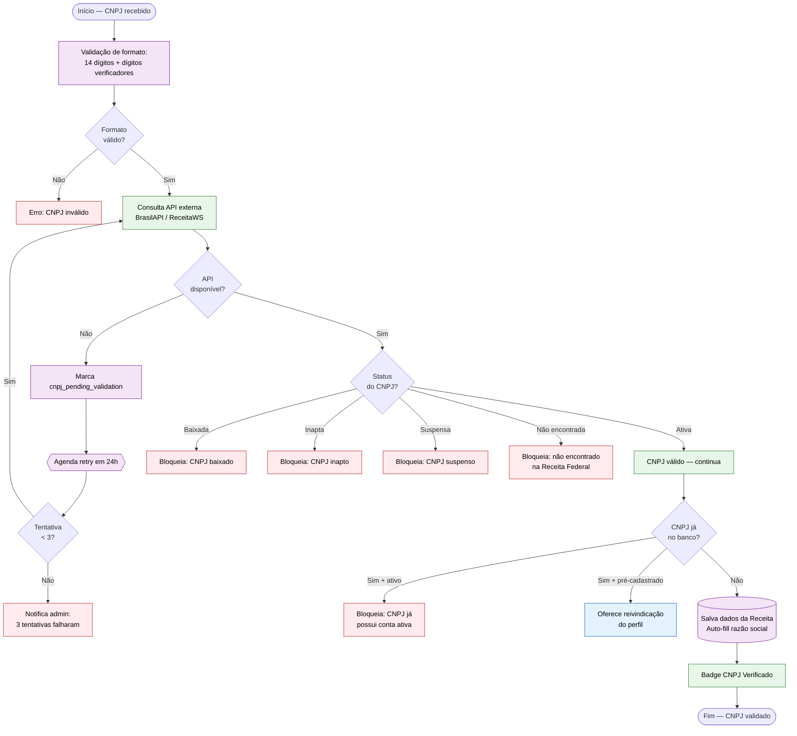

| Campo | Valor |
|-------|-------|
| ID | FLOW-02 |
| Atores | Sistema, API Externa, Admin (fallback) |
| Trigger | Upgrade supplier (UC-31), verificação buyer (UC-32), pré-cadastro admin (UC-23) |
| Pré-condições | CNPJ informado pelo usuário ou admin |
| Pós-condições | CNPJ validado com badge "Verificado" OU bloqueio com motivo específico OU pendência para retry |
| UCs referenciados | UC-24, UC-31, UC-32, UC-23 |
| RNs referenciados | RN-01.01, RN-01.02, RN-07.06 |
| SEQs relacionados | SEQ-15 (3.2) |
| Fase | MVP |

**Notas e exceções:**

1. **Janela de retentativa:** Máximo 3 tentativas em 72h (1 tentativa a cada 24h). Após 3 falhas, admin é notificado para ação manual.
2. **Upgrade provisório (EX-31.2):** Se a API estiver indisponível no momento do upgrade supplier, o sistema permite o upgrade provisório com flag `cnpj_pending_validation`, agendando revalidação.
3. **Revalidação periódica (RN-07.06):** CNPJ verificado é revalidado a cada 90 dias (CNPJ pode ser baixado após cadastro).
4. **Auto-fill:** Quando a API retorna dados, razão social e endereço (quando disponível) são preenchidos automaticamente.
5. **Seller vs buyer:** Para supplier, CNPJ não-ativo bloqueia o upgrade. Para buyer, CNPJ não-ativo apenas não concede o selo (buyer não é bloqueado, RN-01.06).
6. **Dados retornados pela API:** Status cadastral, razão social, natureza jurídica, endereço, CNAEs. Esses dados são salvos e utilizados para auto-fill e para a página SEO do fornecedor.
7. **Nível 2 de verificação (RN-07.06):** Selo "GiroB2B Verificado" (planos Pro e Premium) requer: CNPJ ativo + confirmação de endereço (foto fachada) + identidade do representante legal. Revalidação anual. Diferente do Nível 1 (automático via API).
8. **Wrapper cnpjClient (DC-07):** A chamada à API externa é encapsulada pelo pattern External Service Wrapper definido no 3.4. Em caso de timeout ou erro, o wrapper retorna `ServiceResult<T>` com erro tipado `CNPJ_SERVICE_UNAVAILABLE`.

---

## 3. FLOW-03: Criação de Perfil Pré-Cadastrado (Admin)

**Resumo:** Admin cria perfil de fornecedor para seeding inicial do marketplace (popular a plataforma com dados públicos antes dos fornecedores se cadastrarem). O perfil fica com status `pre_registered` até ser reivindicado pelo representante legal da empresa.

**Atores:** 🔧 Admin, ⚙️ Sistema, 🌐 API Externa

**Trigger(s):**
- Admin acessa painel admin → Fornecedores → Criar Pré-Cadastro

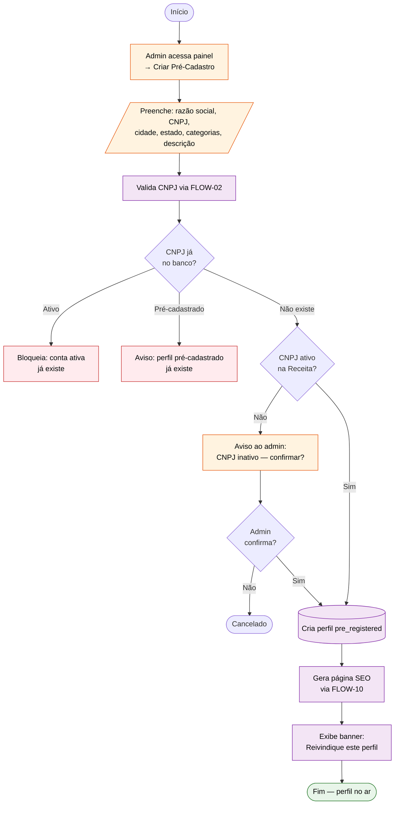

| Campo | Valor |
|-------|-------|
| ID | FLOW-03 |
| Atores | Admin, Sistema, API Externa |
| Trigger | Admin cria pré-cadastro no painel |
| Pré-condições | Admin logado; CNPJ não existir como conta ativa |
| Pós-condições | Perfil `pre_registered` visível na busca com dados básicos; página SEO gerada; banner de reivindicação ativo |
| UCs referenciados | UC-23, UC-24, UC-25 |
| RNs referenciados | RN-01.01, RN-01.02, RN-01.08, RN-01.09 |
| SEQs relacionados | SEQ-15 (3.2) |
| Fase | Validação |

**Notas e exceções:**

1. **Dados visíveis (RN-01.09):** Perfil pré-cadastrado exibe apenas: nome da empresa, cidade, categorias e produtos básicos. Sem logo, sem descrição personalizada, sem dados de contato.
2. **Reivindicação (RN-01.08):** Representante registra com mesmo CNPJ → sistema oferece opção "Reivindicar este perfil". Verificação aceita: (a) email com domínio corporativo, ou (b) envio de documento (contrato social/procuração). Prazo: 48h úteis.
3. **Log de auditoria:** Toda criação de pré-cadastro é registrada em `admin_actions` (ESCOPO_PAINEL_ADMIN §4.6).
4. **CNPJ inativo:** Admin pode forçar criação mesmo com CNPJ inativo (após confirmação), útil para empresas em processo de regularização.
5. **Formulário do admin (ESCOPO §4.2):** Campos do pré-cadastro: razão social, CNPJ, cidade, estado, categorias (seleção múltipla), descrição opcional. Campos não disponíveis: logo, fotos, dados de contato (aguardam reivindicação).
6. **Estratégia de seeding:** Perfis pré-cadastrados servem para popular o marketplace antes dos fornecedores se cadastrarem. Geram páginas SEO indexáveis (FLOW-10), aumentando a descoberta orgânica. O banner "Você é o dono desta empresa? Reivindique seu perfil" é exibido no topo do perfil público.
7. **Verificação de reivindicação (RN-01.08):** Aceita: (a) email com domínio corporativo da empresa (verificação automática), ou (b) envio de documento — contrato social ou procuração (verificação manual em 48h úteis).

---

## 4. FLOW-04: Moderação de Produtos

**Resumo:** Ciclo completo de moderação reativa de produtos. Produtos são publicados imediatamente (sem fila de aprovação) para não criar fricção. A moderação é acionada por denúncias de usuários ou por filtros automáticos. Admin revisa e decide: aprovar, solicitar edição ou rejeitar.

**Atores:** 🏭 Fornecedor, 🛒 Comprador, 🔧 Admin, ⚙️ Sistema

**Trigger(s):**
- Denúncia de usuário (buyer ou supplier)
- Filtro automático detecta anomalia

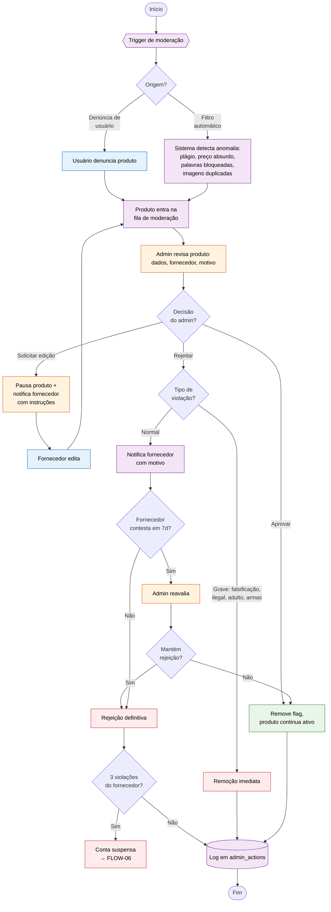

| Campo | Valor |
|-------|-------|
| ID | FLOW-04 |
| Atores | Fornecedor, Comprador, Admin, Sistema |
| Trigger | Denúncia de usuário OU filtro automático |
| Pré-condições | Produto publicado na plataforma; admin logado no painel |
| Pós-condições | Produto aprovado, editado ou rejeitado; ação registrada em `admin_actions` |
| UCs referenciados | UC-20 |
| RNs referenciados | RN-07.01, RN-07.02, RN-07.03 |
| SEQs relacionados | SEQ-14 (3.2) |
| Fase | MVP |

**Notas e exceções:**

1. **Publicação imediata (RN-07.01):** Produtos são publicados sem fila de aprovação prévia. A moderação é 100% reativa.
2. **Filtros automáticos (RN-07.02):** Detectam: (a) descrição copiada de outro fornecedor (plágio), (b) preço absurdo (ex: R$ 0,01), (c) palavras proibidas (lista em `system_configs`), (d) imagens duplicadas de outros perfis.
3. **Palavras bloqueadas:** Lista editável via `system_configs` sem deploy (ESCOPO_PAINEL_ADMIN §4.7).
4. **Prazo de contestação (RN-07.03):** 7 dias corridos (configurável via `violation_contest_days` em `system_configs`).
5. **Reincidência (RN-07.03):** 3 violações confirmadas → conta suspensa (threshold configurável via `violation_reoffense_threshold`).

---

## 5. FLOW-05: Tratamento de Denúncias e Escalonamento

**Resumo:** Processo completo desde o recebimento de uma denúncia até a resolução, incluindo escalonamento automático por acúmulo. Cobre denúncias de buyers contra suppliers E de suppliers contra inquiries (spam/leads falsos). SLA de revisão: 48h úteis.

**Atores:** 🛒 Comprador, 🏭 Fornecedor, 🔧 Admin, ⚙️ Sistema

**Trigger(s):**
- Buyer denuncia supplier (info falsa, produto inexistente, conduta, spam)
- Supplier denuncia inquiry (spam, lead falso)

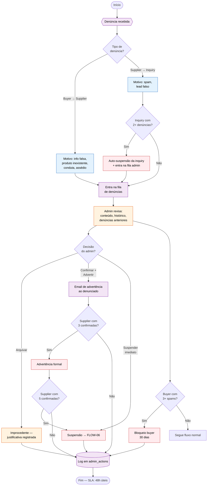

| Campo | Valor |
|-------|-------|
| ID | FLOW-05 |
| Atores | Comprador, Fornecedor, Admin, Sistema |
| Trigger | Denúncia de buyer contra supplier OU de supplier contra inquiry |
| Pré-condições | Denúncia registrada no sistema; admin logado |
| Pós-condições | Denúncia resolvida (arquivada, advertência ou suspensão); ação logada em `admin_actions` |
| UCs referenciados | UC-21 |
| RNs referenciados | RN-07.04, RN-07.05 |
| SEQs relacionados | SEQ-14 (3.2) |
| Fase | MVP |

**Notas e exceções:**

1. **Escalonamento automático de inquiry (RN-07.04):** 2+ denúncias de suppliers diferentes sobre a mesma inquiry → auto-suspensão + fila admin. Threshold configurável via `report_threshold_inquiry` em `system_configs`.
2. **Bloqueio de buyer spammer (RN-07.04):** 3+ inquiries confirmadas como spam → bloqueio temporário de 30 dias. Threshold via `spam_block_days`.
3. **Escalonamento de supplier:**
   - 3 denúncias confirmadas → advertência formal (threshold via `report_threshold_supplier_warn`)
   - 5 denúncias confirmadas → suspensão automática (threshold via `report_threshold_supplier_suspend`)
4. **SLA (RN-07.05):** Revisão em até 48 horas úteis.
5. **Imutabilidade:** Todas as ações registradas em `admin_actions` — tabela INSERT-only, sem UPDATE/DELETE (ESCOPO_PAINEL_ADMIN §4.6).
6. **Notificação ao denunciante:** Opcional — denunciante pode ser informado do resultado (decisão de produto).
7. **Tipos de denúncia de buyer → supplier:** Informações falsas no perfil, produtos inexistentes ou fora da descrição, comportamento inadequado em comunicação, assédio comercial (contato insistente fora da plataforma).
8. **Tipos de denúncia de supplier → inquiry:** Inquiry é spam (não é solicitação genuína), lead falso (dados de contato inexistentes ou inventados), inquiry duplicada (mesmo pedido repetido).
9. **Histórico na análise:** Admin vê no painel: dados do denunciante, dados do denunciado, motivo da denúncia, histórico de denúncias anteriores do denunciado, e histórico de abuso do denunciante (para detectar denúncias frívolas).
10. **Denúncias frívolas:** Se um buyer ou supplier fizer denúncias repetidamente infundadas (3+ arquivadas), o admin pode advertir o denunciante por uso abusivo do sistema de denúncias.

---

## 6. FLOW-06: Suspensão e Reativação de Fornecedor

**Resumo:** Ciclo de vida do status do fornecedor quando há violação de regras ou inadimplência. Cobre suspensão (manual ou por escalonamento), seus efeitos na conta, a reativação e a exclusão definitiva com anonimização LGPD.

**Atores:** 🔧 Admin, ⚙️ Sistema, 🏭 Fornecedor

**Trigger(s):**
- Escalonamento automático (FLOW-05)
- Falha de pagamento (FLOW-07)
- Ação manual do admin

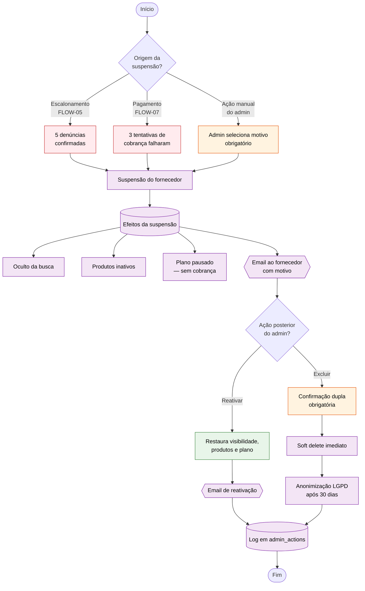

| Campo | Valor |
|-------|-------|
| ID | FLOW-06 |
| Atores | Admin, Sistema, Fornecedor |
| Trigger | Escalonamento (FLOW-05), falha de pagamento (FLOW-07), ação manual admin |
| Pré-condições | Fornecedor com conta ativa; motivo identificado |
| Pós-condições | Fornecedor suspenso (oculto, produtos inativos, plano pausado) OU reativado OU excluído com anonimização |
| UCs referenciados | UC-18 (FA-18.2, FA-18.3) |
| RNs referenciados | RN-07.02, RN-07.03, RN-07.05 |
| SEQs relacionados | — |
| Fase | MVP |

**Notas e exceções:**

1. **Efeitos completos da suspensão:**
   - Fornecedor oculto da busca e das páginas de categoria
   - Todos os produtos ficam inativos (não visíveis)
   - Plano pago pausado — sem cobrança durante suspensão
   - Créditos semanais não renovam durante suspensão
   - Créditos avulsos mantêm validade original (90 dias)
2. **Exclusão e LGPD (FA-18.4):** Confirmação dupla obrigatória. Dados anonimizados após 30 dias (soft delete seguido de anonimização). Registros em `admin_actions` são mantidos (apenas o target_id é preservado, dados pessoais removidos).
3. **Plano pausado:** Ao reativar, o plano retoma de onde parou (dias restantes no ciclo são restaurados).
4. **Motivo obrigatório:** Admin deve selecionar motivo ao suspender. Motivos possíveis: violação de termos, denúncias acumuladas, inadimplência, fraude, outro.
5. **Impacto em inquiries ativas:** Inquiries já distribuídas para o fornecedor suspenso permanecem no histórico, mas o fornecedor perde a capacidade de desbloquear novos leads. Inquiries futuras não são direcionadas a fornecedores suspensos.
6. **Páginas SEO:** Produtos de fornecedores suspensos retornam 404 ou são removidos do sitemap. Ao reativar, as páginas são regeneradas via FLOW-10.
7. **Anonimização LGPD (detalhes):** Após 30 dias do soft delete, os seguintes campos são anonimizados: nome, email, telefone, endereço, razão social. O CNPJ é mantido na tabela para evitar reuso. Registros em `admin_actions` preservam o `target_id` (UUID) mas dados pessoais do target são removidos.
8. **Cancelamento definitivo (RN-06.06):** Na suspensão por inadimplência, se o fornecedor não regularizar em 30 dias (D+30), a assinatura é cancelada definitivamente. A conta permanece como free.

---

## 7. FLOW-07: Cobrança Recorrente (com retentativas)

**Resumo:** Ciclo completo de billing incluindo lembrete pré-cobrança, processamento do pagamento, 3 tentativas automáticas em caso de falha (dunning), suspensão do plano e tratamento de cancelamento antecipado.

**Atores:** ⚙️ Sistema, 🌐 Gateway de Pagamento, 🏭 Fornecedor

**Trigger(s):**
- Data de renovação do plano se aproxima (D-3)
- Data de renovação atingida (D+0)

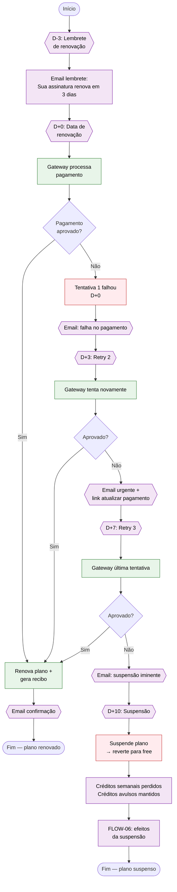

| Campo | Valor |
|-------|-------|
| ID | FLOW-07 |
| Atores | Sistema, Gateway de Pagamento, Fornecedor |
| Trigger | Data de renovação do plano (D-3 para lembrete, D+0 para cobrança) |
| Pré-condições | Fornecedor com plano pago ativo; método de pagamento cadastrado |
| Pós-condições | Plano renovado (sucesso) OU plano suspenso e revertido para free (3 falhas) |
| UCs referenciados | UC-29, UC-26 |
| RNs referenciados | RN-06.01, RN-06.05, RN-06.06, RN-06.07 |
| SEQs relacionados | SEQ-13 (3.2) |
| Fase | Monetização |

**Notas e exceções:**

1. **Timeline de dunning (RN-06.06):**
   - D-3: email lembrete
   - D+0: tentativa 1 → falha → email
   - D+3: tentativa 2 → falha → email urgente com link para atualizar pagamento
   - D+7: tentativa 3 → falha → email aviso de suspensão iminente
   - D+10: conta suspensa → benefícios removidos → reverte para free
   - D+30: se não regularizar → assinatura cancelada definitivamente
2. **Créditos na suspensão:** Créditos semanais do plano são perdidos. Créditos avulsos comprados são mantidos com validade original (90 dias).
3. **Cancelamento antecipado (RN-06.05):** Plano permanece ativo até a data programada de expiração. Créditos avulsos mantidos. Sem cobrança adicional.
4. **PIX/Boleto (RN-06.07):** Tolerância de 3 dias úteis para compensação antes de considerar falha.
5. **Fluxo de retenção (RN-06.10):** Ao clicar "Cancelar assinatura", fornecedor passa por pesquisa de motivo com ofertas de retenção contextuais (1 mês grátis se "poucos leads", downgrade se "muito caro").
6. **Suspensão conecta com FLOW-06:** Efeitos da suspensão por inadimplência seguem o mesmo fluxo do FLOW-06 (oculto da busca, produtos inativos, etc.).
7. **Upgrade imediato (RN-06.03):** Upgrade de plano entra em vigor imediatamente. Valor proporcional do plano atual (dias restantes) é creditado como desconto na primeira cobrança do novo plano (pro-rata).
8. **Downgrade diferido (RN-06.04):** Downgrade só entra em vigor no próximo ciclo. Fornecedor mantém benefícios do plano atual até o fim do ciclo pago.
9. **Trial (RN-06.08):** Fornecedores com 3+ produtos e perfil >= 50% recebem oferta de trial gratuito de 7 dias (Starter). Sem cartão necessário. 5 créditos durante o trial. Não conversão → free + sequência de reengajamento (emails em D+3, D+7, D+14 com desconto 20%).
10. **Negative working capital (RN-06.02):** Plano anual = 10x mensalidade (2 meses grátis). Pagamento integral antecipado gera receita adiantada — modelo comprovado pela IndiaMART.

---

## 8. FLOW-08: Ciclo de Vida dos Créditos

**Resumo:** Dois sub-processos do ciclo de créditos: (a) renovação semanal automática com expiração dos não utilizados, e (b) consumo de crédito no desbloqueio de lead. Créditos semanais não acumulam; créditos avulsos têm validade de 90 dias com consumo FIFO.

**Atores:** ⚙️ Sistema, 🏭 Fornecedor, 🛒 Comprador

**Trigger(s):**
- Cron job domingo 00:01 BRT (renovação)
- Fornecedor clica "Desbloquear Lead" (consumo)

### 8a. Renovação Semanal de Créditos

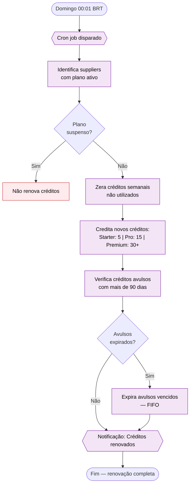

### 8b. Consumo de Crédito (Desbloqueio de Lead)

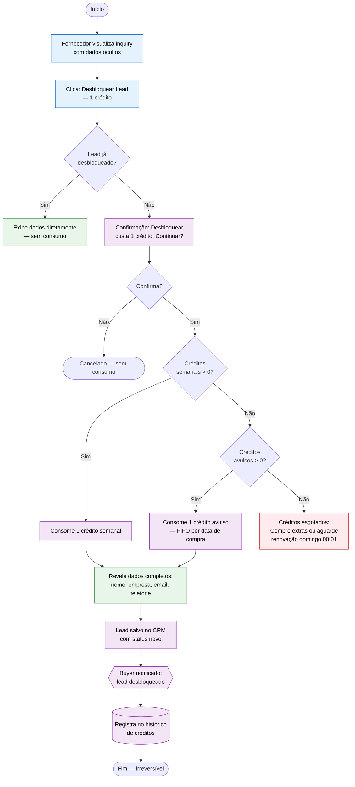

| Campo | Valor |
|-------|-------|
| ID | FLOW-08 |
| Atores | Sistema, Fornecedor, Comprador |
| Trigger | Cron domingo 00:01 BRT (renovação); clique em "Desbloquear Lead" (consumo) |
| Pré-condições | Renovação: supplier com plano ativo. Consumo: supplier com plano pago e inquiry recebida |
| Pós-condições | Renovação: créditos zerados e recreditados. Consumo: 1 crédito consumido irreversivelmente, dados do buyer revelados |
| UCs referenciados | UC-08, UC-30 |
| RNs referenciados | RN-04.02, RN-04.03, RN-04.04, RN-05.01, RN-05.03, RN-05.07, RN-05.08, RN-05.09, RN-05.10 |
| SEQs relacionados | SEQ-11, SEQ-12 (3.2) |
| Fase | Monetização |

**Notas e exceções:**

1. **Não-cumulatividade (RN-05.03/RN-05.07):** Créditos semanais expiram todo domingo 00:01. Não acumulam de uma semana para outra.
2. **Irreversibilidade (RN-05.09/RN-04.03):** Desbloqueio consome 1 crédito independentemente de o fornecedor conseguir contato com o comprador. Sem estorno.
3. **Prioridade de consumo:** Primeiro consome créditos semanais. Apenas quando semanais zerados, consome avulsos (FIFO por data de compra).
4. **Avulsos (RN-05.10):** Validade de 90 dias independente do plano. Comprados em lotes (preços no artefato 1.9).
5. **Buyer notificado (RN-04.04):** Comprador recebe notificação quando seu lead é desbloqueado — incentiva engajamento.
6. **Fornecedor sem plano:** Fornecedor free vê a inquiry com dados ocultos e CTA para assinar plano. Não há botão de desbloqueio para plano free.
7. **Alocação semanal por plano:**

   | Plano | Créditos/semana | Custo efetivo por lead |
   |-------|----------------|----------------------|
   | Starter | 5 | ~R$ 15,80/lead |
   | Pro | 15 | ~R$ 9,93/lead |
   | Premium | 30+ | ~R$ 8,30/lead |

   > Valores exatos de créditos e preços serão detalhados no artefato 1.9.

8. **Deduplicação (RN-04.04):** Inquiries do mesmo buyer para o mesmo supplier sobre o mesmo produto em 48h são agrupadas. Fornecedor vê apenas a versão mais recente — sem consumo duplo de crédito.
9. **Inquiry desbloqueada anteriormente (EX-08.2):** Se o supplier já desbloqueou determinada inquiry no passado, dados são exibidos diretamente sem consumo adicional.
10. **CRM do fornecedor:** Lead desbloqueado é salvo automaticamente no CRM integrado com status "novo". Fornecedor pode mudar para: "em contato", "proposta enviada", "negócio fechado", "perdido".

---

## 9. FLOW-09: Distribuição de Inquiry Genérica (3 Waves)

**Resumo:** Quando um buyer envia uma inquiry genérica, o sistema distribui para até 5 fornecedores elegíveis usando um modelo de 3 ondas por nível de plano (Premium → Pro → Starter), com intervalos de 4h entre ondas. Dentro de cada onda, fornecedores são ordenados por score de relevância (40% categoria + 25% proximidade + 20% tempo de resposta + 15% completude).

**Atores:** 🛒 Comprador, ⚙️ Sistema, 🏭 Fornecedor

**Trigger(s):**
- Buyer envia inquiry genérica (UC-14)

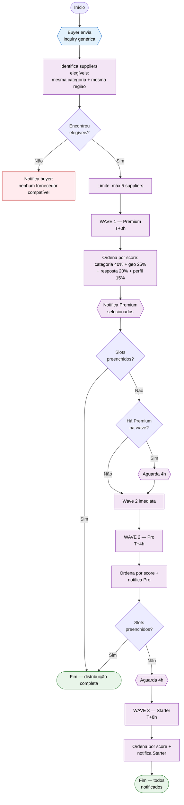

| Campo | Valor |
|-------|-------|
| ID | FLOW-09 |
| Atores | Comprador, Sistema, Fornecedor |
| Trigger | Buyer envia inquiry genérica (UC-14) |
| Pré-condições | Buyer com perfil ativo (Nível 2+); inquiry válida com categoria e região |
| Pós-condições | Inquiry distribuída para até 5 suppliers; cada supplier pode desbloquear lead com 1 crédito (FLOW-08b) |
| UCs referenciados | UC-14, UC-28, UC-08 |
| RNs referenciados | RN-05.01, RN-05.02, RN-05.03, RN-05.04, RN-05.07 |
| SEQs relacionados | SEQ-09 (3.2) |
| Fase | Monetização |

**Notas e exceções:**

1. **Score de ordenação (RN-05.04):**

   | Fator | Peso | Lógica |
   |-------|------|--------|
   | Relevância da categoria | 40% | Match exato subcategoria: 100 pts, match categoria pai: 60 pts |
   | Proximidade geográfica | 25% | Mesma cidade: 100 pts, mesmo estado: 60 pts, estado vizinho: 30 pts |
   | Tempo de resposta histórico | 20% | < 1h: 100 pts, < 4h: 70 pts, < 24h: 40 pts, > 24h: 10 pts |
   | Completude do perfil | 15% | % de completude (RN-02.01) convertida em pontos |

2. **Fairness:** Dentro da mesma faixa de score (diferença < 5%), a ordem é randomizada.
3. **Slots vs notificações (RN-05.03):** Fornecedores sem crédito recebem a inquiry (veem descrição, quantidade, cidade), mas NÃO ocupam vaga no limite. A vaga só é ocupada no desbloqueio efetivo.
4. **Conversão de créditos extras:** Fornecedores sem créditos semanais que recebem inquiry veem CTA "Compre créditos extras para acessar este lead" — momento de conversão.
5. **Intervalo entre waves:** 4h é provisório e configurável (variável de ambiente ou painel admin). Pode ser ajustado sem deploy.
6. **Nenhum match (EX-28.3):** Buyer notificado "Nenhum fornecedor compatível encontrado", inquiry marcada como "no match".
7. **Menos de 5 elegíveis (EX-28.2):** Distribui para todos os disponíveis (pode ser < 5).
8. **Escolha do buyer (RN-05.01):** Buyer escolhe quantas propostas quer receber: 3, 5 ou 10. Default pré-selecionado: 5. O limite define quantos desbloqueios efetivos encerram a distribuição.
9. **Visibilidade para free:** Fornecedores no plano free NÃO recebem inquiries genéricas — apenas direcionadas. Inquiries genéricas são exclusivas para planos pagos (Starter, Pro, Premium).
10. **Inquiry direcionada vs genérica:** Inquiry direcionada (UC-13) vai exclusivamente para 1 fornecedor — sem sistema de waves. A vantagem é a exclusividade do lead. As regras de visibilidade (dados ocultos para free, 1 crédito para desbloquear) se aplicam igualmente a ambos os tipos.
11. **Saturação futura (RN-05.05):** Fator de saturação semanal foi removido do algoritmo por falta de dados reais para calibração. Será implementado pós-lançamento com base nos dados de consumo reais.
12. **Expansão geográfica:** Se houver poucos suppliers na mesma região do buyer, o sistema pode expandir para estados vizinhos (geo score 30 pts). Essa expansão é automática e transparente para o buyer.

---

## 10. FLOW-10: Geração de Páginas SEO Programáticas

**Resumo:** Processo automático de geração e atualização de páginas otimizadas para SEO via SSG/ISR do Next.js. Disparado por eventos de criação/edição de produtos, fornecedores e categorias. Inclui geração de 4 tipos de páginas, atualização do sitemap XML e submissão ao Google Search Console.

**Atores:** ⚙️ Sistema, 🏭 Fornecedor (indiretamente), 🔧 Admin (categorias)

**Trigger(s):**
- Produto criado, editado ou deletado
- Supplier criado (inclusive pré-cadastro)
- Categoria alterada

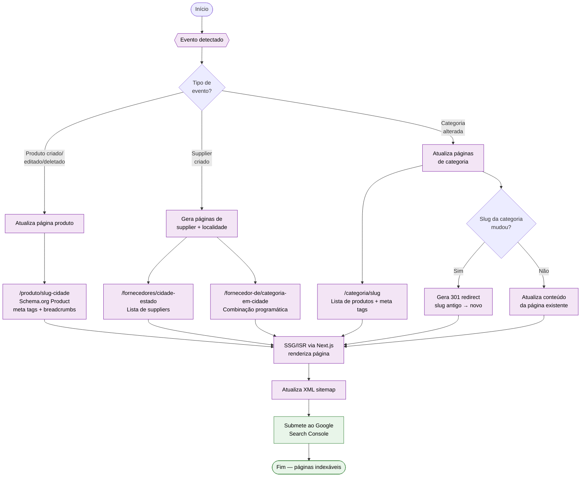

| Campo | Valor |
|-------|-------|
| ID | FLOW-10 |
| Atores | Sistema, Fornecedor (indireto), Admin (categorias) |
| Trigger | Criação/edição/exclusão de produto, criação de supplier, alteração de categoria |
| Pré-condições | Dado indexável alterado no banco de dados |
| Pós-condições | Páginas SEO geradas/atualizadas; sitemap XML atualizado; 301 redirects criados quando necessário |
| UCs referenciados | UC-25 |
| RNs referenciados | RN-08 (SEO), RN-03.01 |
| SEQs relacionados | SEQ-05 (3.2) |
| Fase | MVP |

**Notas e exceções:**

1. **4 tipos de páginas geradas:**

   | Tipo | URL Pattern | Conteúdo |
   |------|------------|----------|
   | Produto | `/produto/[slug]-[cidade]` | Schema.org `Product`, meta tags, breadcrumbs, dados do fornecedor |
   | Categoria | `/categoria/[slug]` | Lista de produtos, meta tags, filtros por localidade |
   | Localidade | `/fornecedores/[cidade]-[estado]` | Lista de suppliers daquela região |
   | Combinação | `/fornecedor-de/[categoria]-em-[cidade]` | Cruzamento programático categoria × localidade |

2. **SSG/ISR (ADR-03):** Páginas são geradas estaticamente com revalidação incremental. ISR garante que páginas sejam atualizadas sem rebuild completo.
3. **301 Redirects:** Quando o slug de uma categoria muda (ex: renomeação), o sistema gera automaticamente um redirect 301 para preservar SEO.
4. **Pré-cadastro (FLOW-03):** Perfis pré-cadastrados também geram páginas SEO — estratégia de seeding para indexação.
5. **Produto deletado:** Página retorna 410 (Gone) para indicar ao Google que o conteúdo foi intencionalmente removido.
6. **Meta tags:** Geradas automaticamente a partir dos dados do produto/supplier. Incluem `title`, `description`, `og:image`, `canonical`.
7. **Supplier suspenso/deletado:** Páginas do supplier suspenso são removidas do sitemap e retornam 404. Ao reativar, páginas são regeneradas. Supplier deletado: páginas retornam 410 (Gone).
8. **Core Web Vitals (RNF-01.04):** Páginas SEO devem atingir LCP < 2.5s, FID < 100ms, CLS < 0.1 para manter boa posição no Google. SSG/ISR é a principal estratégia para garantir performance.
9. **Volume estimado:** Com 1.000 suppliers × 5 produtos × 50 cidades, o sistema pode gerar ~250.000 páginas programáticas. O sitemap XML é particionado automaticamente em sitemaps de 50.000 URLs.

---

## 11. Matriz de Rastreabilidade

### 11.1 Cobertura: FLOW × UC × RN × SEQ × Fase

| FLOW | UCs Cobertos | RNs Cobertos | SEQs Relacionados | Fase |
|------|-------------|-------------|-------------------|------|
| FLOW-01 | UC-01, UC-12, UC-31, UC-32 | RN-01.01 a RN-01.13 | SEQ-01, SEQ-17, SEQ-18 | MVP |
| FLOW-02 | UC-24, UC-31, UC-32, UC-23 | RN-01.01, RN-01.02, RN-07.06 | SEQ-15 | MVP |
| FLOW-03 | UC-23, UC-24, UC-25 | RN-01.01, RN-01.02, RN-01.08, RN-01.09 | SEQ-15 | Validação |
| FLOW-04 | UC-20 | RN-07.01, RN-07.02, RN-07.03 | SEQ-14 | MVP |
| FLOW-05 | UC-21 | RN-07.04, RN-07.05 | SEQ-14 | MVP |
| FLOW-06 | UC-18 | RN-07.02, RN-07.03, RN-07.05 | — | MVP |
| FLOW-07 | UC-29, UC-26 | RN-06.01, RN-06.05, RN-06.06, RN-06.07 | SEQ-13 | Monetização |
| FLOW-08 | UC-08, UC-30 | RN-04.02 a RN-04.04, RN-05.01, RN-05.03, RN-05.07 a RN-05.10 | SEQ-11, SEQ-12 | Monetização |
| FLOW-09 | UC-14, UC-28, UC-08 | RN-05.01 a RN-05.04, RN-05.07 | SEQ-09 | Monetização |
| FLOW-10 | UC-25 | RN-08, RN-03.01 | SEQ-05 | MVP |

### 11.2 UCs com Fluxograma vs UCs sem Fluxograma

#### UCs cobertos por fluxogramas (16 UCs)

UC-01, UC-08, UC-12, UC-14, UC-18, UC-20, UC-21, UC-23, UC-24, UC-25, UC-26, UC-28, UC-29, UC-30, UC-31, UC-32

#### UCs sem fluxograma (17 UCs) — e justificativa

| UC | Nome | Justificativa |
|----|------|---------------|
| UC-02 | Editar perfil | CRUD simples, sem decisões complexas — coberto por SEQ-03 |
| UC-03 | Cadastrar produto | CRUD com upload — coberto por SEQ-04 |
| UC-04 | Editar produto | CRUD simples |
| UC-05 | Gerenciar categorias | CRUD admin simples — coberto por ESCOPO_PAINEL_ADMIN §4.3 |
| UC-06 | Denunciar inquiry | Ação simples (formulário) — resultado tratado em FLOW-05 |
| UC-07 | Assinar plano | Ação de compra — coberto por SEQ-10 |
| UC-09 | Comprar créditos extras | Ação de compra simples — fluxo de pagamento análogo a UC-07 |
| UC-10 | Gerenciar preferências de notificação | CRUD de configurações |
| UC-11 | Buscar no catálogo | Busca com ranking — coberto por SEQ-06 e UC-27 |
| UC-13 | Enviar inquiry direcionada | Similar a UC-14 mas sem distribuição — coberto por SEQ-07 |
| UC-15 | Denunciar fornecedor | Ação simples (formulário) — resultado tratado em FLOW-05 |
| UC-16 | Visualizar dashboard admin | Leitura de dados — coberto por ESCOPO_PAINEL_ADMIN §4.1 |
| UC-17 | Gerenciar compradores | CRUD admin simples — coberto por ESCOPO_PAINEL_ADMIN §4.8 |
| UC-19 | Gerenciar categorias | CRUD admin — coberto por ESCOPO_PAINEL_ADMIN §4.3 |
| UC-22 | Visualizar métricas | Leitura de dados |
| UC-26 | Enviar notificações | Sistema de notificação — coberto por tabela de eventos (REFERENCIA §19) |
| UC-27 | Calcular ranking de busca | Algoritmo puro — coberto por REFERENCIA §16 |

> **Critério de seleção:** Fluxogramas foram criados para processos com múltiplos atores, decisões condicionais, caminhos alternativos e/ou etapas assíncronas. CRUDs simples e ações de leitura foram omitidos por não agregarem valor como fluxograma.

### 11.3 Cobertura de Regras de Negócio (RN) por Grupo

| Grupo RN | Total de RNs | RNs Cobertos por FLOWs | Cobertura |
|----------|-------------|----------------------|-----------|
| RN-01 (Cadastro) | 13 | RN-01.01 a RN-01.13 (FLOW-01, 02, 03) | 100% |
| RN-04 (Inquiries) | 8 | RN-04.02 a RN-04.08 (FLOW-08, 09) | 87% |
| RN-05 (Distribuição) | 10 | RN-05.01 a RN-05.10 (FLOW-08, 09) | 100% |
| RN-06 (Monetização) | 10 | RN-06.01 a RN-06.10 (FLOW-07) | 100% |
| RN-07 (Moderação) | 6 | RN-07.01 a RN-07.06 (FLOW-04, 05, 06) | 100% |
| RN-08 (SEO) | — | Coberto por FLOW-10 | 100% |
| RN-09 (Notificações) | 3 | RN-09.01 a RN-09.03 (transversal) | 100% |

> **RNs não cobertos:** RN-02 (perfil e completude) e RN-03 (busca e ranking) não possuem fluxograma dedicado por serem algoritmos puros sem decisões operacionais. Estão documentados na REFERENCIA §16.

### 11.4 Cobertura por Fase

| Fase | FLOWs | Quantidade |
|------|-------|-----------|
| MVP | FLOW-01, 02, 04, 05, 06, 10 | 6 |
| Monetização | FLOW-07, 08, 09 | 3 |
| Validação | FLOW-03 | 1 |
| **Total** | | **10** |

---

## 12. Interdependências entre Processos

O diagrama abaixo mostra como os 10 fluxogramas se conectam, formando o ecossistema operacional da plataforma.

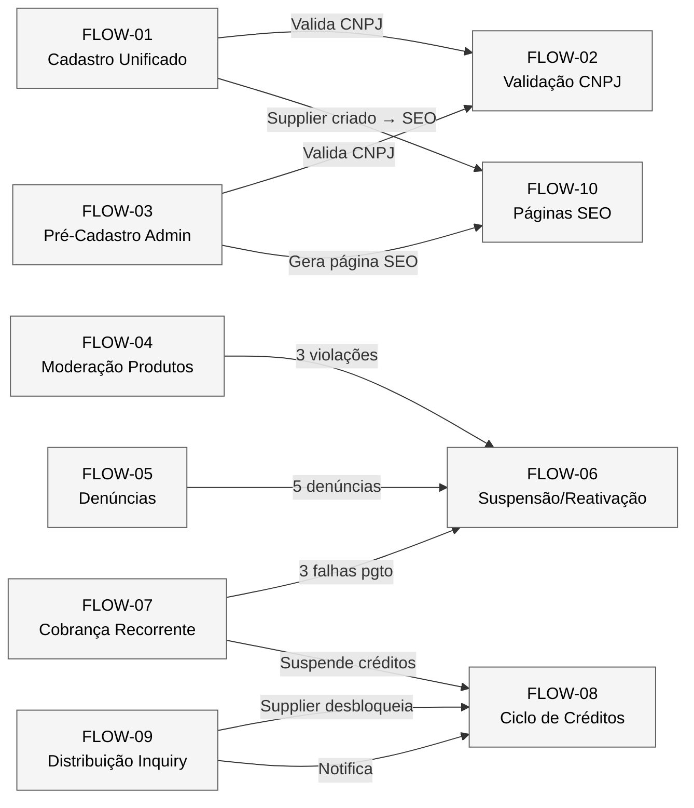

### Mapa de Dependências

| FLOW origem | FLOW destino | Tipo de conexão |
|-------------|-------------|-----------------|
| FLOW-01 | FLOW-02 | Chama: validação de CNPJ no upgrade supplier e verificação buyer |
| FLOW-01 | FLOW-10 | Dispara: criação de supplier gera página SEO |
| FLOW-03 | FLOW-02 | Chama: validação de CNPJ no pré-cadastro |
| FLOW-03 | FLOW-10 | Dispara: pré-cadastro gera página SEO |
| FLOW-04 | FLOW-06 | Escala: 3 violações de produto → suspensão do fornecedor |
| FLOW-05 | FLOW-06 | Escala: 5 denúncias confirmadas → suspensão do fornecedor |
| FLOW-07 | FLOW-06 | Escala: 3 falhas de pagamento → suspensão por inadimplência |
| FLOW-07 | FLOW-08 | Afeta: suspensão do plano interrompe renovação de créditos semanais |
| FLOW-09 | FLOW-08 | Consome: supplier desbloqueia lead usando créditos |

### Análise de Clusters

Os 10 fluxogramas formam **3 clusters operacionais** interconectados:

**Cluster 1 — Onboarding (FLOW-01, 02, 03, 10):**
Responsável pela entrada de atores na plataforma. FLOW-02 é um sub-processo chamado por FLOW-01 e FLOW-03. FLOW-10 é disparado como efeito colateral da criação de suppliers. Este cluster é predominantemente MVP.

**Cluster 2 — Trust & Safety (FLOW-04, 05, 06):**
Responsável pela integridade da plataforma. Fluxo linear: denúncia/moderação → escalonamento → suspensão/reativação. FLOW-06 é o destino final dos escalonamentos tanto de FLOW-04 (violações de produto) quanto de FLOW-05 (denúncias de usuário). Predominantemente MVP.

**Cluster 3 — Monetização (FLOW-07, 08, 09):**
Responsável pela geração de receita. FLOW-09 (distribuição) gera demanda por créditos, que são consumidos via FLOW-08, que depende de FLOW-07 (billing) para manter o plano ativo. Falha no billing (FLOW-07) conecta com FLOW-06 (suspensão). Todo Monetização.

> **Ponto de convergência:** FLOW-06 (Suspensão/Reativação) é o hub central — recebe inputs de 3 outros fluxos (FLOW-04, 05, 07) e afeta FLOW-08 (créditos) e FLOW-10 (SEO).

---

## 13. Pendências e Decisões Abertas

### 13.1 Pendências Herdadas

| ID | Descrição | Origem | Responsável |
|----|-----------|--------|-------------|
| CTO-01 | Escolha da estrutura de diretórios (Opção A by domain vs Opção B by layer) | 3.1 | Vitor (CTO) |
| CTO-02 | Escolha do ORM/Query Builder (Drizzle, Prisma ou Supabase client direto) | 3.4 | Vitor (CTO) |
| CTO-03 | Necessidade de backend separado (API Routes vs servidor dedicado) | 3.4 | Vitor (CTO) |

### 13.2 Pendências Identificadas nos Fluxogramas

| ID | Descrição | FLOW | Responsável |
|----|-----------|------|-------------|
| CTO-06 | Comportamento quando buyer informa CNPJ que já existe como supplier — vincular conta? bloquear? sugerir login? | FLOW-01 (EX-12.2/EX-32.2) | Vitor (CTO) |
| CTO-07 | URL exata da página de draft do upgrade supplier (FA-31.3) | FLOW-01 | Vitor (CTO) |
| CTO-08 | Intervalo entre waves da distribuição — 4h é provisório, confirmar com dados reais pós-lançamento | FLOW-09 (RN-05.02) | Gustavo + Vitor |
| CTO-09 | Quantidade exata de créditos por plano (Starter: 5, Pro: 15, Premium: 30+) — confirmar no artefato 1.9 | FLOW-08 | Gustavo (CEO) |
| CTO-10 | Preços de créditos avulsos e configuração de lotes — detalhar no artefato 1.9 | FLOW-08 (RN-05.10) | Gustavo (CEO) |

### 13.3 Pendências Existentes Relevantes

| ID | Descrição | Relevância |
|----|-----------|------------|
| CTO-04 | Dark mode adiado para fase Tração | Sem impacto nos fluxos |
| CTO-05 | Cursor pagination na fase Escala | Sem impacto nos fluxos (offset-based no MVP) |

---

## Apêndice A — Quick Reference Card

### Thresholds Configuráveis (system_configs)

| Parâmetro | Default | FLOW |
|-----------|---------|------|
| `report_threshold_supplier_warn` | 3 | FLOW-05 |
| `report_threshold_supplier_suspend` | 5 | FLOW-05, FLOW-06 |
| `spam_block_days` | 30 | FLOW-05 |
| `report_threshold_inquiry` | 2 | FLOW-05 |
| `violation_reoffense_threshold` | 3 | FLOW-04 |
| `violation_contest_days` | 7 | FLOW-04 |
| `blocked_words` | lista | FLOW-04 |
| `profile_incomplete_reminders` | [3, 7, 14, 30] dias | — |

### Eventos de Notificação (UC-26) por FLOW

| FLOW | Evento | Destinatário | Timing |
|------|--------|-------------|--------|
| FLOW-01 | Confirmação de cadastro | Usuário | Imediato |
| FLOW-04 | Produto rejeitado / edição solicitada | Fornecedor | Imediato |
| FLOW-05 | Advertência / suspensão | Denunciado | Imediato |
| FLOW-06 | Suspensão / reativação | Fornecedor | Imediato |
| FLOW-07 | Lembrete renovação | Fornecedor | D-3 |
| FLOW-07 | Falha no pagamento | Fornecedor | Imediato |
| FLOW-07 | Confirmação renovação | Fornecedor | Imediato |
| FLOW-08 | Créditos renovados | Fornecedor | Domingo 00:01 |
| FLOW-08 | Créditos esgotados | Fornecedor | Ao consumir último |
| FLOW-08 | Lead desbloqueado | Comprador | Imediato |
| FLOW-09 | Inquiry distribuída | Fornecedor | Imediato (por wave) |
| FLOW-09 | Nenhum match | Comprador | Após última wave |

### Cronograma de Jobs Automáticos

| Job | Schedule | FLOW |
|-----|----------|------|
| Renovação semanal de créditos | Domingo 00:01 BRT | FLOW-08a |
| Expiração de créditos avulsos | Domingo 00:01 BRT | FLOW-08a |
| Tentativa de cobrança (retry) | D+3, D+7 após falha | FLOW-07 |
| Suspensão por inadimplência | D+10 após 1ª falha | FLOW-07 |
| Cancelamento definitivo | D+30 após 1ª falha | FLOW-07 |
| Exclusão de contas não confirmadas | Diário | FLOW-01 |
| Revalidação de CNPJ | A cada 90 dias | FLOW-02 |
| Wave 2 distribuição | T+4h após inquiry | FLOW-09 |
| Wave 3 distribuição | T+8h após inquiry | FLOW-09 |
| Atualização sitemap | Ao alterar dados indexáveis | FLOW-10 |

### Tabela de Erros Técnicos por FLOW

Referência cruzada com os error codes do 3.4 §7:

| FLOW | Cenário de Erro | Error Code (3.4) | HTTP Status |
|------|----------------|-------------------|-------------|
| FLOW-01 | Email já cadastrado | `EMAIL_ALREADY_EXISTS` | 409 |
| FLOW-01 | Usuário já é supplier | `ALREADY_SUPPLIER` | 409 |
| FLOW-01 | Usuário já é buyer | `ALREADY_BUYER` | 409 |
| FLOW-02 | CNPJ já existe como supplier ativo | `CNPJ_ALREADY_EXISTS` | 409 |
| FLOW-02 | CNPJ com status inativo | `CNPJ_INACTIVE` | 422 |
| FLOW-02 | CNPJ não encontrado na Receita | `CNPJ_NOT_FOUND` | 404 |
| FLOW-02 | API da Receita indisponível | `CNPJ_SERVICE_UNAVAILABLE` | 503 |
| FLOW-04 | Produto não encontrado | `NOT_FOUND` | 404 |
| FLOW-08 | Créditos esgotados | `CREDITS_EXHAUSTED` | 402 |
| FLOW-08 | Lead já desbloqueado | `LEAD_ALREADY_UNLOCKED` | 409 |
| FLOW-09 | Inquiry não encontrada | `INQUIRY_NOT_FOUND` | 404 |
| FLOW-09 | Limite de inquiries/dia | `INQUIRY_RATE_LIMITED` | 429 |
| FLOW-09 | Inquiry duplicada (48h) | `INQUIRY_DUPLICATE` | 409 |

### Tabela de ADRs Relevantes por FLOW

| FLOW | ADRs Aplicáveis | Justificativa |
|------|----------------|---------------|
| FLOW-01 | ADR-01 (Monolito modular) | Cadastro é um módulo do monolito |
| FLOW-02 | ADR-01, DC-07 (External Wrapper) | cnpjClient wraps BrasilAPI/ReceitaWS |
| FLOW-07 | ADR-01, DC-07 (External Wrapper) | stripeClient wraps gateway de pagamento |
| FLOW-08 | ADR-01, DC-08 (Job Handler) | Renovação semanal é um cron job |
| FLOW-09 | ADR-01, DC-08 (Job Handler) | Waves são jobs assíncronos agendados |
| FLOW-10 | ADR-03 (SSG/ISR), ADR-07 (App Router) | Geração de páginas estáticas via Next.js |
| FLOW-04/05 | ADR-04 (RLS) | Ações admin usam service key (bypass RLS) |
| FLOW-01 | ADR-05 (PostHog cookieless) | Tracking de funil de cadastro |
| FLOW-01 | ADR-06 (PWA) | Push notifications para fornecedores |

### Glossário Rápido (REFERENCIA §13)

| Termo PT-BR | Código/API | Nunca usar |
|-------------|-----------|------------|
| Marketplace | — | classificados, diretório, portal |
| Fornecedor | `supplier` | vendedor, lojista, anunciante |
| Comprador | `buyer` | cliente (ambíguo) |
| Cotação / Solicitação | `inquiry` | mensagem, chat, pergunta |
| Lead | `lead` | contato (genérico demais) |
| Crédito (de lead) | `credit` | moeda, token |
| Desbloqueio | `unlock` | compra de lead |
| Plano | `plan` (free/starter/pro/premium) | pacote |
| Selo Verificado | `verified_badge` | certificado |

---

## Apêndice B — Checklist Operacional para Moderadores

### B.1 Checklist Diário (Admin)

- [ ] Verificar fila de moderação de produtos (FLOW-04)
  - Quantos produtos pendentes?
  - Há produtos flagados por filtro automático?
- [ ] Verificar fila de denúncias (FLOW-05)
  - Quantas denúncias pendentes?
  - Alguma no limite de SLA (48h)?
- [ ] Verificar fornecedores com pagamento falhando (FLOW-07)
  - Quantos na fase D+3? D+7? D+10?
- [ ] Verificar métricas do dashboard (ESCOPO_PAINEL_ADMIN §4.1)
  - Novos cadastros do dia
  - Inquiries enviadas
  - Conversão free → pago

### B.2 Checklist Semanal (Admin/CEO)

- [ ] Revisar suppliers suspensos (FLOW-06)
  - Algum pendente de reativação?
  - Algum próximo do D+30 (cancelamento definitivo)?
- [ ] Revisar métricas de créditos (FLOW-08)
  - Taxa de consumo de créditos semanais por plano
  - Conversão de CTA "compre créditos extras"
- [ ] Revisar distribuição de inquiries (FLOW-09)
  - Percentual de inquiries com "no match"
  - Tempo médio de preenchimento de slots
  - Efetividade de cada wave (% de desbloqueios por wave)
- [ ] Revisar SEO (FLOW-10)
  - Novas páginas geradas na semana
  - Páginas indexadas pelo Google (via Search Console)
  - 301 redirects gerados

### B.3 Checklist Mensal (CEO)

- [ ] Revisar thresholds de moderação (system_configs)
  - Os valores atuais estão adequados?
  - Volume de denúncias frívolas vs legítimas?
- [ ] Revisar intervalo entre waves da distribuição
  - 4h está gerando preenchimento adequado?
  - Considerar ajuste baseado em dados reais
- [ ] Analisar churn de fornecedores pagantes
  - Principais motivos de cancelamento (FLOW-07 §5)
  - Efetividade das ofertas de retenção
- [ ] Avaliar pendências CTO (seção 13)
  - Alguma decisão pendente foi resolvida?
  - Novas pendências surgiram?

---

> **Documento gerado em:** 05/04/2026
> **Próximos artefatos:** 3.6 (Dicionário de Dados)
> **Referência autoritativa:** REFERENCIA_CONSOLIDADA.md
