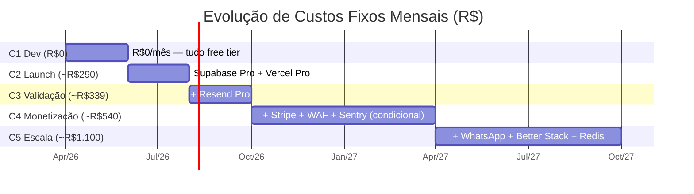
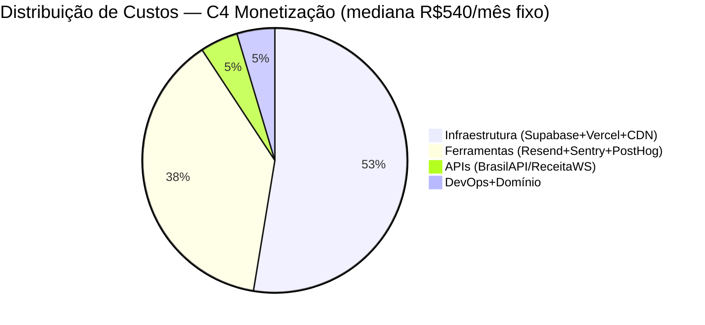
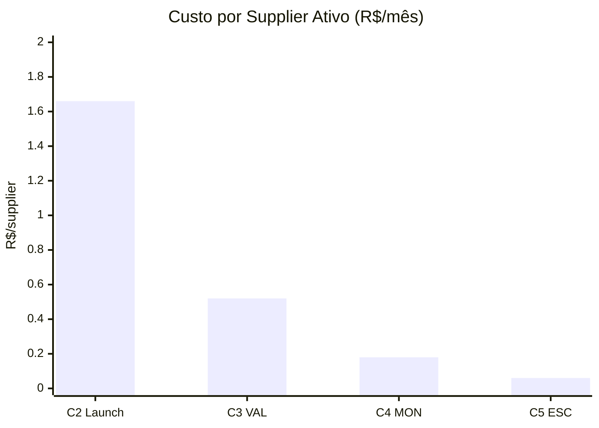
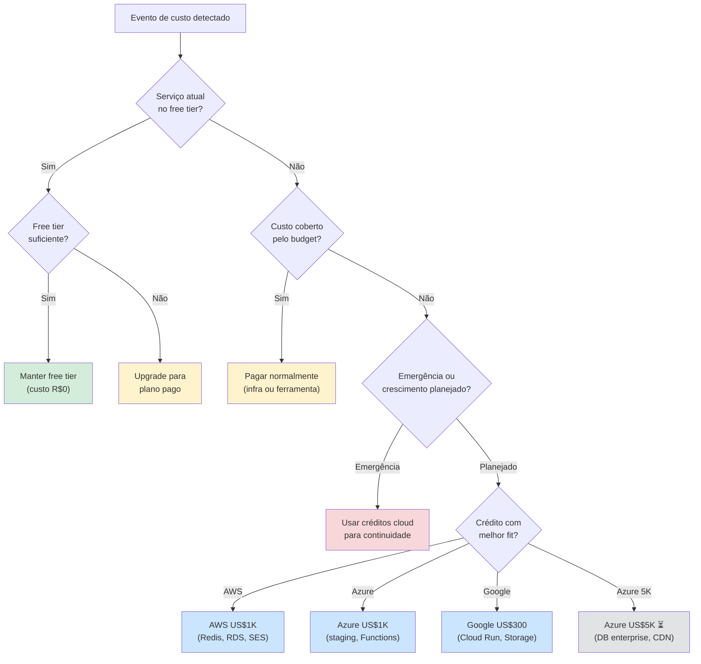
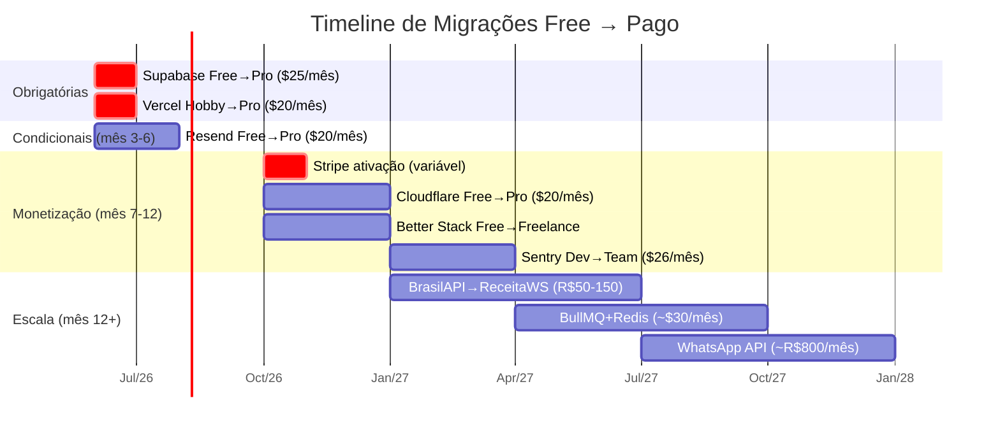

# 4.1 Projeção de Custos Operacionais

**Versão:** 1.0 | **Data:** 05/04/2026 | **Autor:** Claude Opus 4.6
**Status:** Consolida artefatos 4.1 + 4.2 do plano original
**Dependências:** REFERENCIA_CONSOLIDADA, 3.3_MAPA_DE_INTEGRACOES, 1.9_JUSTIFICATIVA_DE_PRECIFICACAO, 2.3_STACK_TECNOLOGICO
**Público:** Ambos (Dev + Investidores)

---

## Resumo Executivo

Este artefato responde à pergunta central: **"Quanto custa operar o GiroB2B em cada fase de crescimento?"**

A resposta curta: **R$0 durante o desenvolvimento, ~R$290/mês no launch, e ~R$750-2.700/mês na escala (com serviços futuros)** — com margem bruta operacional projetada de **≥70%** a partir da monetização. O GiroB2B opera com estrutura asset-light onde custos escalam com receita, não com usuários.

| Indicador | Valor |
|-----------|-------|
| Custo MVP (dev) | R$0/mês |
| Custo MVP (launch) | ~R$236-339/mês |
| Custo na monetização | ~R$339-750/mês (fixo) + variável Stripe |
| Custo na escala (serviços atuais) | ~R$750-1.403/mês (fixo) + variável |
| Custo na escala (+ WhatsApp/BullMQ) | ~R$1.453-2.687/mês (fixo) + variável |
| Break-even de infra | ~5-10 assinantes pagantes |
| Margem bruta operacional alvo | ≥70% (sem pessoal) |
| Créditos cloud garantidos | ~US$2.300 (~R$11.868) |
| Créditos cloud potenciais | ~US$9.300 (~R$47.988) |

**Câmbio utilizado:** 1 USD = R$5,16 (média abril/2026, Wise/XE).

---

## Seção 0 — Convenções e Navegação

### Convenções de valores

| Símbolo | Significado |
|---------|-------------|
| $XX | Dólar americano (USD) |
| R$XX | Real brasileiro (BRL) |
| ⚠️ | Valor não confirmado em fonte oficial — estimativa |
| INT-XX | Referência à integração no artefato 3.3 |
| RNF-XX | Requisito não-funcional do artefato 1.5 |

### Índice de seções

| # | Seção | Conteúdo |
|---|-------|----------|
| 1 | Premissas e Cenários | 5 cenários de crescimento com justificativas |
| 2 | Inventário de Custos | 19 serviços × 5 cenários |
| 3 | Custo Total Consolidado | Resumo por categoria e fase + diagrama |
| 4 | Métricas de Eficiência | Custo/supplier, custo/MAU, margem |
| 5 | Alocação de Créditos Cloud | Estratégia de uso dos ~US$9.300 |
| 6 | Alertas de Migração | Timeline free→pago + triggers |
| 7 | Cenários de Stress | 3 cenários pessimistas |
| 8 | Comparativo com Benchmarks | IndiaMART, SaaS early-stage |
| 9 | Decisões Pendentes | 7 decisões que afetam custos |
| 10 | Rastreabilidade | Artefatos fonte × RNFs |
| 11 | Resumo Executivo (Investidores) | 1 página para pitch deck |

---

## Seção 1 — Premissas e Cenários de Crescimento

### 1.1 Cenários

| Cenário | Fase | Meses | Suppliers | Produtos | MAUs | Inquiries/mês | Pagantes |
|---------|------|-------|-----------|----------|------|---------------|----------|
| **C1 — Dev** | MVP dev | 1-2 | 0-50 | 0-250 | <100 | 0 | 0 |
| **C2 — Launch** | MVP launch | 3-4 | 50-300 | 250-1.500 | 500-2K | 50-200 | 0 |
| **C3 — Validação** | VAL | 5-6 | 300-1K | 1.500-5K | 2K-8K | 200-800 | 0 |
| **C4 — Monetização** | MON | 7-12 | 1K-5K | 5K-25K | 8K-30K | 800-3K | 25-150 |
| **C5 — Escala** | ESC | 13-18 | 5K-30K | 25K-150K | 30K-100K | 3K-15K | 150-900 |

### 1.2 Justificativas das estimativas

**Suppliers cadastrados:** Meta REFERENCIA §5 é 500-1.000 no MVP (3 meses), com Márcio em campo em SP. Crescimento orgânico via SEO programático a partir do mês 4. Benchmark: IndiaMART adicionou ~80K suppliers/mês no FY25 num mercado maduro; para o Brasil pré-tração, 150-300/mês é conservador.

**Produtos por supplier:** Média de 5 produtos/supplier no MVP (listagem básica). Cresce para 5-8 na validação conforme fornecedores engajam. Benchmark: IndiaMART tem média de ~8 produtos/supplier entre ativos.

**MAUs (Monthly Active Users):** Ratio buyer:supplier de 3:1 a 5:1 (REFERENCIA §14). No launch, a maioria dos MAUs são compradores chegando via SEO. Crescimento orgânico acelerado a partir da validação.

**Inquiries/mês:** Conversão de 1,8-2,7% do tráfego orgânico (Unbounce 2025, SERPSculpt 2025 — fontes em REFERENCIA §15). No launch, 500-2K MAUs × 2% ≈ 10-40 inquiries; somando tráfego direto e referral, 50-200 é realista.

**Pagantes:** Conversão free→paid de 2-3% (benchmark IndiaMART: 2,6% — REFERENCIA §14). Monetização ativa apenas a partir do mês 7. Com 1K-5K suppliers, 2,5% = 25-125 pagantes.

### 1.3 Premissas de conversão

| Premissa | Valor | Fonte |
|----------|-------|-------|
| % suppliers ativos (postam ≥1 produto) | 60-70% | Meta REFERENCIA §14 (activation >60%) |
| % perfil completo | >60% (MVP) → >70% (12m) | REFERENCIA §14 |
| Ratio buyer:supplier | 3:1 (MVP) → 5:1 (VAL) → 10:1 (ESC) | REFERENCIA §14 |
| Conversão free→paid | 2-3% | IndiaMART FY25: 2,6% (220K/8,4M) |
| ARPU mensal (Ano 1) | R$120-150 | 1.9 §7.3 — maioria Starter + alguns Pro |
| Churn mensal (pagantes) | 3-5% | Benchmark SaaS B2B SMB (Vitally 2025) |
| Câmbio USD/BRL | R$5,16 | Wise/XE abril/2026 |

---

## Seção 2 — Inventário de Custos por Serviço

Todos os custos extraídos do artefato 3.3 (seções 3-11, tabela consolidada §10). Valores com ⚠️ indicam estimativas não confirmadas em fonte oficial.

### 2.1 Categoria A — Infraestrutura (Hosting + Banco + CDN + Storage)

| # | Serviço | INT | Tier Free | C1 Dev | C2 Launch | C3 VAL | C4 MON | C5 ESC | Trigger de Upgrade |
|---|---------|-----|-----------|--------|-----------|--------|--------|--------|--------------------|
| 1 | Supabase (Auth+PG+Realtime+Edge) | INT-01 a 04 | 500 MB DB, 50K MAUs, 200 conn pool | $0 | **$25/mês** | $25/mês | $25/mês | $25-50/mês | Pausa 7d inatividade (Free) — incompatível com prod |
| 2 | Vercel (Hosting) | INT-18 | 100 GB BW, 1 membro, **sem uso comercial** | $0 | **$20/mês** | $20/mês | $20/mês | $20-40/mês | Uso comercial proibido no Hobby |
| 3 | Cloudflare CDN | INT-05 | BW ilimitado, 3 page rules, DDoS L3/L4 | $0 | $0 | $0 | $0-20/mês | $20/mês | WAF Pro para pagamentos (RNF-04.10) |
| 4 | Cloudflare R2 (Storage) | INT-06 | 10 GB, 0 egress | $0 | $0 | $0 | $0 | $0-2/mês | >10 GB (~16K produtos) |
| | **Subtotal Infra** | | | **$0** | **$45** | **$45** | **$45-65** | **$65-112** | |

**Em R$ (câmbio R$5,16):**

| Fase | C1 Dev | C2 Launch | C3 VAL | C4 MON | C5 ESC |
|------|--------|-----------|--------|--------|--------|
| Infra/mês (R$) | R$0 | R$232 | R$232 | R$232-335 | R$335-578 |

### 2.2 Categoria B — Ferramentas (Email + Analytics + Monitoring + CAPTCHA)

| # | Serviço | INT | Tier Free | C1 Dev | C2 Launch | C3 VAL | C4 MON | C5 ESC | Trigger de Upgrade |
|---|---------|-----|-----------|--------|-----------|--------|--------|--------|--------------------|
| 5 | Resend (email) | INT-08 | 3K/mês, 100/dia | $0 | $0-20/mês | $20/mês | $20/mês | $20-50/mês | >100 emails/dia |
| 6 | Sentry (errors) | INT-11 | 5K errors/mês, 1 user | $0 | $0 | $0 | $0-26/mês | $26/mês | >5K errors ou múltiplos devs |
| 7 | PostHog (analytics) | INT-12 | 1M events/mês | $0 | $0 | $0 | $0 | $0-30/mês | >1M events/mês |
| 8 | Better Stack (uptime) | INT-13 | 10 monitors, 3 min interval | $0 | $0 | $0 | $0-24/mês | $24/mês | Checks 30s para billing |
| 9 | Vercel Analytics (vitals) | INT-14 | 2.500 events/mês ⚠️ | $0 | $0 | $0 | $0 | $0 | Incluso no Vercel Pro |
| 10 | Cloudflare Turnstile (CAPTCHA) | INT-07 | Ilimitado (sempre free) | $0 | $0 | $0 | $0 | $0 | Nunca — free ilimitado |
| | **Subtotal Ferramentas** | | | **$0** | **$0-20** | **$20** | **$20-70** | **$70-130** | |

**Em R$:**

| Fase | C1 Dev | C2 Launch | C3 VAL | C4 MON | C5 ESC |
|------|--------|-----------|--------|--------|--------|
| Ferramentas/mês (R$) | R$0 | R$0-103 | R$103 | R$103-361 | R$361-671 |

### 2.3 Categoria C — APIs e Pagamento

| # | Serviço | INT | Tier Free | C1 Dev | C2 Launch | C3 VAL | C4 MON | C5 ESC | Trigger de Upgrade |
|---|---------|-----|-----------|--------|-----------|--------|--------|--------|--------------------|
| 11 | BrasilAPI/ReceitaWS (CNPJ) | INT-15 | 3 req/min (BrasilAPI free) | $0 | $0 | $0 | $0-R$50/mês | R$50-150/mês | Taxa erro >5% no BrasilAPI |
| 12 | Google Search Console (SEO) | INT-16 | Sempre free | $0 | $0 | $0 | $0 | $0 | Nunca |
| 13 | Stripe (pagamento) | INT-10 | Sem taxa fixa — % por tx | — | — | — | ~4,5% por tx | ~4,5% por tx | Ativação na monetização |
| | **Subtotal APIs (fixo)** | | | **$0** | **$0** | **$0** | **R$0-50** | **R$50-150** | |

### 2.4 Categoria D — DevOps e Domínio

| # | Serviço | INT | Tier Free | C1 Dev | C2 Launch | C3 VAL | C4 MON | C5 ESC | Trigger de Upgrade |
|---|---------|-----|-----------|--------|-----------|--------|--------|--------|--------------------|
| 14 | GitHub + Actions | INT-17 | Repos ilimitados, 2K min/mês | $0 | $0 | $0 | $0 | $0 | Nunca para equipe pequena |
| 15 | Domínio girob2b.com.br | — | — | R$0 | R$0 | R$0 | R$0 | R$0 | R$40-60/ano (Registro.br) |
| | **Subtotal DevOps** | | | **R$0** | **R$0** | **R$0** | **R$0** | **R$0** | |

**Nota:** Domínio custa R$40-60/ano (Registro.br). Diluído mensalmente = R$3,30-5,00/mês. Incluído no total anual.

### 2.5 Categoria E — Futuro (Escala)

| # | Serviço | INT | C1-C3 | C4 MON | C5 ESC | Trigger |
|---|---------|-----|-------|--------|--------|---------|
| 16 | WhatsApp Business API | INT-09 | — | — | ~R$600-1.000/mês | Fase Escala (mês 13+) |
| 17 | BullMQ + Redis | DC-08 (3.1) | — | — | ~$20-50/mês ⚠️ | Edge Functions >150s ou >10K subs |
| 18 | Railway (backend Python) | — | — | — | $0-5/mês ⚠️ | Se Vitor escolher Python/FastAPI |
| | **Subtotal Futuro** | | **—** | **—** | **R$700-1.360** | |

---

## Seção 3 — Custo Total por Cenário (Consolidado)

### 3.1 Tabela-resumo

| Cenário | Infra (A) | Ferramentas (B) | APIs (C) | DevOps (D) | **Fixo A-D** | Futuro (E) ¹ | **Fixo Total** | Variável (Stripe) | **Total/mês** |
|---------|-----------|-----------------|----------|------------|--------------|-------------|----------------|-------------------|---------------|
| **C1 — Dev** | R$0 | R$0 | R$0 | R$0 | **R$0** | — | **R$0** | — | **R$0** |
| **C2 — Launch** | R$232 | R$0-103 | R$0 | ~R$4 | **R$236-339** | — | **R$236-339** | — | **R$236-339** |
| **C3 — Validação** | R$232 | R$103 | R$0 | ~R$4 | **R$339** | — | **R$339** | — | **R$339** |
| **C4 — Monetização** | R$232-335 | R$103-361 | R$0-50 | ~R$4 | **R$339-750** | — | **R$339-750** | R$200-800 ⚠️ | **R$539-1.550** |
| **C5 — Escala** | R$335-578 | R$361-671 | R$50-150 | ~R$4 | **R$750-1.403** | R$703-1.284 | **R$1.453-2.687** | R$2K-10K ⚠️ | **R$3.453-12.687** |

**¹ Futuro (E):** Serviços condicionais que dependem de decisões técnicas e de tração (§2.5). WhatsApp Business API (~R$600-1K/mês) ativado se engajamento justificar; BullMQ+Redis (~R$103-258/mês) ativado se Edge Functions >150s; Railway (~R$0-26/mês) ativado se Python/FastAPI como backend. C5 sem Futuro: R$750-1.403/mês fixo.

**Variável Stripe:** ~4,5% da receita bruta (3,99% + R$0,39 + 0,5% billing). C4: 50-200 assinantes × R$79-399 × 4,5% ≈ R$200-800/mês. C5: 500-2.000 assinantes × R$79-399 × 4,5% ≈ R$2K-10K/mês.

### 3.2 Custo total acumulado (18 meses)

| Cenário | Duração | Fixo A-D | Futuro (E) ¹ | Variável (Stripe) | **Total acumulado** |
|---------|---------|----------|-------------|-------------------|---------------------|
| C1 (mês 1-2) | 2 meses | R$0 | — | — | **R$0** |
| C2 (mês 3-4) | 2 meses | R$472-678 | — | — | **R$472-678** |
| C3 (mês 5-6) | 2 meses | R$678 | — | — | **R$678** |
| C4 (mês 7-12) | 6 meses | R$2.034-4.500 | — | R$1.200-4.800 | **R$3.234-9.300** |
| C5 (mês 13-18) | 6 meses | R$4.500-8.418 | R$4.218-7.704 | R$12K-60K | **R$20.718-76.122** |
| **Total 18 meses** | | **R$7.684-14.274** | **R$4.218-7.704** | **R$13.200-64.800** | **R$25.102-86.778** |

**¹** Coluna Futuro (E) aplica-se apenas ao C5 (mês 13-18). Sem Futuro: total 18 meses = R$20.884-79.074. Com Futuro (todos ativados): R$25.102-86.778. A diferença (~R$4.200-7.700) é o custo de WhatsApp + BullMQ + Railway por 6 meses.

### 3.3 Diagrama — Evolução de Custos por Fase

### 3.4 Diagrama — Breakdown por Categoria

---

## Seção 4 — Métricas de Eficiência

### 4.1 Métricas por cenário

Valores calculados usando medianas dos ranges de cada cenário.

| Métrica | C1 Dev | C2 Launch | C3 VAL | C4 MON | C5 ESC |
|---------|--------|-----------|--------|--------|--------|
| Suppliers ativos | 0 | 175 | 650 | 3.000 | 17.500 |
| MAUs | 50 | 1.250 | 5.000 | 19.000 | 65.000 |
| Inquiries/mês | 0 | 125 | 500 | 1.900 | 9.000 |
| Pagantes | 0 | 0 | 0 | 88 | 525 |
| **Custo fixo/mês (mediana R$)** | **R$0** | **R$290** | **R$339** | **R$540** | **R$1.100** |
| MRR estimada | R$0 | R$0 | R$0 | R$13.200 | R$78.750 |
| **Custo/supplier ativo/mês** | — | **R$1,66** | **R$0,52** | **R$0,18** | **R$0,06** |
| **Custo/MAU/mês** | — | **R$0,23** | **R$0,07** | **R$0,03** | **R$0,02** |
| **Custo/inquiry/mês** | — | **R$2,32** | **R$0,68** | **R$0,28** | **R$0,12** |
| **Infra como % da receita** | — | — | — | **4,1%** | **1,4%** |
| **Margem bruta operacional** | — | — | — | **~72%** | **~86%** |

### 4.2 Cálculos detalhados (C4 Monetização — cenário base)

| Item | Valor | Cálculo |
|------|-------|---------|
| Receita mensal (MRR) | R$13.200 | 88 pagantes × R$150 ARPU (1.9 §7.1) |
| Custos fixos | R$540 | Mediana da faixa R$339-750 |
| Custos variáveis Stripe | ~R$594 | R$13.200 × 4,5% |
| **Custo operacional total** | **R$1.134** | Fixo + variável |
| **Lucro bruto operacional** | **R$12.066** | R$13.200 - R$1.134 |
| **Margem bruta** | **91,4%** | R$12.066 / R$13.200 |

**Nota:** Margem bruta operacional de ~72% na tabela 4.1 usa a mediana do range completo (incluindo cenários com mais upgrades pagos). A margem de 91,4% acima usa o cenário base com custos fixos medianos.

### 4.3 Break-even de infraestrutura

**Pergunta:** Quantos assinantes pagantes são necessários para cobrir os custos fixos de infra?

| Cenário de custos | Custo fixo/mês | ARPU R$120 (Starter-heavy) | ARPU R$150 (mix) |
|-------------------|----------------|---------------------------|-------------------|
| C4 mínimo (R$339) | R$339 | 3 pagantes | 3 pagantes |
| C4 mediana (R$540) | R$540 | 5 pagantes | 4 pagantes |
| C4 máximo (R$750) | R$750 | 7 pagantes | 5 pagantes |
| C4 com Stripe incluso | R$1.134 | 10 pagantes | 8 pagantes |

**Para cobrir custos fixos + variáveis (incluindo Stripe):** entre 8 e 10 pagantes, um número alcançável nas primeiras semanas de monetização com 1K+ suppliers cadastrados e conversão de 2,5%.

**Para cobrir custos totais da operação (com pessoal, marketing):** referência 1.9 §7.2 estima R$8K-15K/mês → 53-100 pagantes no cenário base (ARPU R$150).

**Benchmark:** IndiaMART alcança EBITDA de ~40% (incluindo pessoal, marketing, escritórios). A GiroB2B com 3 founders (sem salário fixo no início) tem estrutura incomparavelmente mais leve.

### 4.4 Unit Economics — Margem de contribuição por assinante

| Plano | Receita/mês | Stripe (~4,5%) | Custo infra marginal ¹ | **Margem contribuição** | **% margem** |
|-------|------------|----------------|-------------------------|-------------------------|-------------|
| **Starter** (R$79) | R$79 | R$3,96 | ~R$0,18 | **R$74,86** | **94,8%** |
| **Pro** (R$199) | R$199 | R$9,34 | ~R$0,18 | **R$189,48** | **95,2%** |
| **Premium** (R$399) | R$399 | R$18,35 | ~R$0,18 | **R$380,47** | **95,4%** |

**¹ Custo infra marginal por supplier:** R$540 (fixo C4) ÷ 3.000 suppliers ativos = R$0,18. Esse é o custo incremental real — a infraestrutura é compartilhada e escala sub-linearmente.

**Implicação para o negócio:** O custo marginal de atender um supplier adicional é virtualmente zero (~R$0,18/mês). Isso significa que cada assinante novo contribui com ~95% da receita diretamente para o resultado. A economia de escala é extrema: dobrar a base de clientes dobra a receita mas move os custos fixos em <5%.

### 4.5 Evolução do custo unitário ao longo do tempo

A curva demonstra **economia de escala agressiva**: o custo por supplier cai **96,4%** do launch à escala (R$1,66 → R$0,06). Para comparação, marketplaces B2B tradicionais operam com custo/fornecedor de R$5-15/mês (comissões de vendas + suporte + infraestrutura dedicada).

### 4.6 LTV/CAC indicativo

| Premissa | Valor | Fonte |
|----------|-------|-------|
| ARPU mensal | R$150 | 1.9 §7.3 (mix Starter+Pro) |
| Churn mensal | 5% | Benchmark SaaS B2B SMB |
| Lifetime (1/churn) | 20 meses | 1/0,05 |
| **LTV** | **R$3.000** | R$150 × 20 |
| CAC (custo de aquisição) | ~R$0 (SEO + campo) | Motor orgânico, sem mídia paga |
| CAC estimado (com tempo Márcio) | ~R$50-100 ⚠️ | Estimativa: 5h/supplier × R$10-20/h equivalente |
| **LTV/CAC** | **30-60× ⚠️** | Excepcionalmente alto por ser SEO-first |

**Nota:** O LTV/CAC é inflado porque não há gasto de mídia paga. Quando/se incluir Google Ads ou LinkedIn, esperar LTV/CAC de 5-10× (ainda excelente para SaaS B2B). O motor orgânico (SEO programático + campo) é a vantagem competitiva principal no custo de aquisição.

### 4.7 Análise de sensibilidade — Variáveis críticas

| Variável | Cenário pessimista | Cenário base | Cenário otimista | Impacto no break-even |
|----------|-------------------|--------------|------------------|-----------------------|
| Conversão free→paid | 1,0% | 2,5% | 4,0% | 16 pag. → 8 pag. → 5 pag. ¹ |
| ARPU mensal | R$79 (só Starter) | R$150 (mix) | R$250 (Pro-heavy) | 14 pag. → 8 pag. → 5 pag. |
| Churn mensal | 10% | 5% | 3% | Lifetime 10m → 20m → 33m |
| Câmbio USD/BRL | R$6,00 | R$5,16 | R$4,50 | +R$100/mês → base → -R$70/mês |
| Supabase Pro price | +50% ($37,5) | $25/mês | — | +R$65/mês → base |

**¹** Break-even calculado como: Custo C4 mediana (R$1.134 com Stripe) ÷ ARPU × conversão ajustada.

**Variáveis mais sensíveis:**
1. **Conversão free→paid** — cada 0,5pp move o break-even em ~3 pagantes
2. **ARPU** — distribuição entre planos Starter/Pro/Premium determina se break-even é 5 ou 14 pagantes
3. **Câmbio** — impacto limitado (~R$100/mês) porque a maioria dos serviços tem pricing em USD já convertido

**Variáveis de baixo impacto:** Pricing individual dos serviços (Sentry, PostHog etc.) — cada um move <R$30/mês.

---

## Seção 5 — Alocação de Créditos Cloud

### 5.1 Inventário de créditos (REFERENCIA §20)

| Programa | Valor | Status (abr/2026) | Validade |
|----------|-------|--------------------|----------|
| AWS Activate | US$1.000 (~R$5.160) | ✅ Aprovado | 12-24 meses ⚠️ verificar |
| Microsoft Azure | US$1.000 (~R$5.160) | ✅ Resgatado | 12 meses ⚠️ verificar |
| Microsoft Azure (análise) | +US$5.000 (~R$25.800) | ⏳ Em análise | — |
| Google Cloud (free trial) | US$300 (~R$1.548) | ✅ Ativo | 90 dias ⚠️ verificar |
| Google Cloud (Start) | +US$2.000/ano (~R$10.320) | ⏳ Em análise (case #00268665) | — |
| **Total garantido** | **~US$2.300 (~R$11.868)** | | |
| **Total potencial** | **~US$9.300 (~R$47.988)** | | |

### 5.2 Estratégia de alocação

A estratégia do 3.3 seção 13.2 recomenda **NÃO usar créditos no MVP**, reservando para escala ou emergência. Após análise, recomendamos uma **variação prudente**:

| Crédito | Melhor uso | Quando usar | Cenário |
|---------|-----------|-------------|---------|
| **AWS US$1K** | Redis (ElastiCache) para BullMQ quando Edge Functions não bastarem | C5 Escala (mês 12+) | Jobs >150s ou >10K subscribers |
| **Azure US$1K** | Staging environment (Azure Functions + Blob Storage como backup) | C3 Validação (mês 5+) ⭐ | Ambiente de testes sem custar no Supabase Free #2 |
| **Azure US$5K** (se aprovado) | Migração de emergência (Azure Database for PostgreSQL) + Azure CDN | C5 Escala ou emergência | Se Supabase Pro insuficiente (>8 GB) |
| **Google US$300** | Cloud Run para microserviço Python (se Vitor escolher FastAPI) | C2-C3 (mês 3-6) | Decisão de stack backend pendente |
| **Google US$2K/ano** (se aprovado) | Cloud Storage (backup off-site) + BigQuery (analytics avançado) | C4-C5 (mês 7+) | Backup + analytics de dados |

### 5.3 Árvore de decisão para uso de créditos

### 5.4 Prioridade de consumo dos créditos

| Prioridade | Cenário | Crédito | Valor | Justificativa |
|------------|---------|---------|-------|---------------|
| 1 (imediato) | Staging CI/CD | Azure US$1K | ~US$180-360 (12m) | Supabase Free #2 pausa em 7d — incompatível com CI |
| 2 (C5) | BullMQ + Redis | AWS US$1K | ~US$20-50/mês | Edge Functions >150s ou >10K subs |
| 3 (condicional) | Backend Python | Google US$300 | ~US$5-20/mês | Apenas se Vitor escolher FastAPI |
| 4 (emergência) | DB enterprise | Azure US$5K ⏳ | ~US$400-500/mês | Supabase Pro >8 GB ou indisponibilidade |
| 5 (C4+) | Backup off-site | Google US$2K/ano ⏳ | ~US$10-30/mès | BigQuery analytics + Cloud Storage backup |

**Reserva não alocada (pior caso, tudo ativado):** US$9.300 - US$360 (staging) - US$300 (BullMQ 6m) - US$300 (Google trial) = ~US$8.340 em reserva de emergência.

### 5.5 Avaliação da estratégia "não usar no MVP"

A recomendação do 3.3 de reservar créditos para escala/emergência é **quase ótima**, com uma exceção:

**Uso recomendado no MVP:** Azure US$1K para staging environment.
- Justificativa: O Supabase Free tier #2 (staging) pausa após 7 dias de inatividade. Um staging em Azure seria mais confiável para CI/CD.
- Custo: ~US$15-30/mês (Azure Functions consumption + Azure Database basic) = ~US$180-360 em 12 meses.
- Benefício: Staging sempre disponível, sem surpresas de pausa.

**Exceção descartada:** Usar Google US$300 para staging via Cloud Run. A validade de 90 dias do free trial é curta demais para justificar a complexidade de setup.

### 5.6 Cenário de emergência

| Emergência | Crédito a usar | Ação | Cobertura |
|------------|---------------|------|-----------|
| Supabase indisponível >24h | AWS US$1K | Provisionar RDS PostgreSQL + migrar dados | ~6 meses de RDS db.t3.micro |
| Vercel degradada (latência >2s) | AWS US$1K | Deploy para AWS Amplify ou EC2 | ~3-4 meses |
| Ataque DDoS além do Cloudflare Free | Azure US$1K | Ativar Azure DDoS Protection + CDN | ~2-3 meses |
| Supabase Pro insuficiente (>8 GB DB) | Azure US$5K (se aprovado) | Azure Database for PostgreSQL Flex | ~10-12 meses |

---

## Seção 6 — Alertas de Migração e Triggers

### 6.1 Timeline de migrações

### 6.2 Detalhamento de cada migração

| # | Migração | Trigger Quantitativo | Lead Time | Rollback? | Impacto se Atrasar |
|---|----------|---------------------|-----------|-----------|---------------------|
| 1 | **Supabase Free → Pro** | Antes do launch (pausa 7d incompatível) | 1 dia (upgrade no dashboard) | Sim (downgrade possível) | Banco pausa → site fora do ar |
| 2 | **Vercel Hobby → Pro** | Antes do launch (uso comercial proibido) | 1 dia (upgrade no dashboard) | Sim (volta para Hobby) | Violação ToS Vercel, risco de suspensão |
| 3 | **Resend Free → Pro** | >100 emails/dia (monitorar no mês 3) | Instantâneo (upgrade no dashboard) | Sim | Emails param após 100/dia → suppliers não notificados |
| 4 | **Stripe ativação** | Início da monetização (mês 7) | 3-5 dias (KYC + verificação) | N/A | Não cobra = não gera receita |
| 5 | **Cloudflare Free → Pro** | Antes de processar pagamentos | 1 dia | Sim | Sem WAF completo → risco de segurança (RNF-04.10) |
| 6 | **Better Stack → Freelance** | Quando billing ativo (checks 30s) | Instantâneo | Sim | Monitoring a cada 3 min → detecção lenta de falhas |
| 7 | **Sentry Dev → Team** | >5K errors/mês ou >1 dev | Instantâneo | Sim | Excesso descartado → erros não rastreados |
| 8 | **BrasilAPI → ReceitaWS** | Taxa de erro >5% ou rate limit frequente | 2h (alterar URL no cnpjClient.ts) | Sim | Verificações CNPJ lentas ou falhando |
| 9 | **Edge → BullMQ+Redis** | Jobs >150s ou >10K subscribers | 3-5 dias (setup Redis + migrar jobs) | Complexo | Créditos não alocados no prazo |
| 10 | **WhatsApp API** | Fase Escala (engajamento > email) | 2-4 semanas (Meta verificação + templates) | N/A | Sem canal preferido dos suppliers brasileiros |

---

## Seção 7 — Cenários de Stress

### 7.1 Cenário A — Crescimento Acelerado (3× mais rápido)

**Situação:** Márcio e SEO performam muito acima do esperado. No mês 4, já temos 1.500 suppliers e 8K MAUs (números do cenário C3 chegando 2 meses antes).

| Serviço | Free tier esgota quando | Ação imediata | Custo adicional |
|---------|-------------------------|---------------|-----------------|
| **Supabase PostgreSQL** | 500 MB DB (~3K suppliers com produtos) | Já no Pro (upgrade obrigatório no launch) | $0 extra |
| **Resend** | 100 emails/dia (no mês 3 com 300+ suppliers) | Upgrade para Pro imediato | +$20/mês |
| **PostHog** | 1M events/mês (~100K MAUs × 10 events) | Sem ação — 8K MAUs = ~80K events | $0 |
| **Cloudflare R2** | 10 GB (~16K produtos) | Sem ação até C5 — 1.500 suppliers × 5 produtos × 3 fotos = ~2.2 GB | $0 |
| **Sentry** | 5K errors/mês (depende da qualidade do código) | Monitorar; upgrade Team se necessário | $0-26/mês |

**Impacto:** +$20-46/mês acima do planejado. Coberto facilmente pelo adiantamento de receita.

**Uso de créditos cloud:** Não necessário. O crescimento acelerado é positivo — mais suppliers = mais inquiries = monetização antecipada.

### 7.2 Cenário B — Crescimento Lento (20 suppliers após 3 meses)

**Situação:** Márcio não consegue escala em campo. SEO demora para indexar. Após 3 meses, apenas 20 suppliers cadastrados e <200 MAUs.

| Custo | Pode evitar/adiar? | Ação |
|-------|---------------------|------|
| Supabase Pro ($25/mês) | **Não** — pausa incompatível com prod | Manter (custo mínimo aceito) |
| Vercel Pro ($20/mês) | **Talvez** — se launch não aconteceu | Adiar launch, manter Hobby para testes |
| Resend Pro ($20/mês) | **Sim** — 20 suppliers = ~5-10 emails/dia | Manter Free |
| Todas as ferramentas pagas | **Sim** — tudo no free tier basta | Manter $0 |

**Custo mensal com crescimento lento:** R$0-129/mês (apenas Supabase Pro se launch aconteceu, ou R$0 se ainda em dev).

**Ação recomendada:**
1. Focar em qualidade, não escala — melhorar conversão dos poucos suppliers existentes
2. Intensificar SEO programático (custo zero, escala orgânica)
3. **NÃO** gastar créditos cloud — reservar para quando tração aparecer
4. Reavaliar verticais — talvez embalagens ou construção respondam melhor que a vertical inicial

### 7.3 Cenário C — Incidente de Custo

**Incidente 1: Supabase Pro não basta (>8 GB)**

- **Probabilidade:** Baixa no C4, possível no C5
- **Impacto:** +$0,125/GB/mês (Supabase pricing) → 20 GB extra = +$2,50/mês
- **Ação:** Para crescimento além de 30 GB, avaliar migração para AWS RDS usando créditos (US$1K = ~12 meses de RDS básico)

**Incidente 2: Ataque DDoS aumenta requisições CDN**

- **Probabilidade:** Baixa (Cloudflare mitiga L3/L4 no Free)
- **Impacto:** $0 no Free (bandwidth ilimitado). Risco real: bot floods em formulários
- **Ação:** Cloudflare Under Attack Mode (gratuito) + Turnstile (gratuito). Se ataque sofisticado L7: upgrade Cloudflare Pro ($20/mês) + usar créditos Azure para DDoS Protection

**Incidente 3: Resend estoura free tier abruptamente**

- **Probabilidade:** Média (100 emails/dia é fácil de atingir)
- **Impacto:** Emails param até próximo dia (Free) ou upgrade necessário
- **Ação:** Monitorar diariamente; ter upgrade Pro pré-aprovado. Fallback: AWS SES usando créditos (~$0,10/1K emails)

### 7.4 Cenário D — Churn Alto (10%/mês na monetização)

**Situação:** O churn mensal de pagantes é o dobro do esperado (10% vs 5%). Ao invés de reter 95% dos assinantes, retemos apenas 90%. Com 88 pagantes no mês 7, no mês 12 restaríamos ~46 pagantes (88 × 0,9⁵).

| Mês | Pagantes (churn 5%) | Pagantes (churn 10%) | MRR (churn 5%) | MRR (churn 10%) |
|-----|---------------------|----------------------|----------------|-----------------|
| 7 | 88 | 88 | R$13.200 | R$13.200 |
| 8 | 84 + novos | 79 + novos | ~R$13.000 | ~R$12.000 |
| 9 | ~85 | ~75 | ~R$12.750 | ~R$11.250 |
| 12 | ~88 (estável) | ~55 (declínio) | ~R$13.200 | ~R$8.250 |

**Nota:** Tabela assume aquisição líquida constante de ~5 novos/mês (2,5% × 200 novos suppliers × 100% da base tentando monetizar). Com churn 10%, a base estabiliza em ~50 pagantes ao invés de ~88.

**Impacto nos custos:**
- Custos fixos permanecem R$540/mês (independem do nº de pagantes)
- Stripe variável cai: R$594 → ~R$371/mès
- **Margem bruta cai de 91% para ~89%** (ainda saudável)
- Break-even continua coberto (~50 > 8-10 necessários)

**Ação recomendada:**
1. **Investigar causa:** Produto inadequado? Falta de leads? Onboarding fraco?
2. **Intensificar retenção:** Email drip campaigns (Resend), engagement scoring (PostHog)
3. **NÃO cortar custos fixos** — a infra é necessária para melhorar o produto
4. **NÃO gastar créditos cloud** — problema é de produto/PMF, não de infraestrutura

**Cenário catastrófico (churn >20%):** Pausar monetização, voltar ao modelo 100% free, focar em product-market fit. Custo operacional cai para R$339/mês (C3). Créditos cloud intactos.

### 7.5 Resumo de resiliência dos cenários

| Cenário | Probabilidade | Impacto financeiro | Ação principal | Créditos necessários? |
|---------|--------------|---------------------|----------------|----------------------|
| A — Crescimento 3× | Baixa-Média | +R$100-238/mês | Adiantar upgrades | Não |
| B — Crescimento lento | Média | -R$210/mês (adiar launch) | Focar qualidade/SEO | Não |
| C — Incidentes | Baixa | +R$0-130/mês | Monitoring + fallbacks | Sim (emergência) |
| D — Churn alto | Média | -R$5.000/mês receita | Investigar PMF | Não |

**Conclusão:** Nenhum cenário de stress ameaça a viabilidade da infraestrutura. Mesmo no pior caso (crescimento lento + churn alto), os custos fixos mínimos (~R$130-339/mês) são sustentáveis sem receita por >12 meses usando apenas créditos cloud garantidos (US$2.300 = ~R$11.868 = 35-91 meses de custo mínimo).

---

## Seção 8 — Comparativo com Benchmarks

### 8.1 Custo de infra de startups B2B SaaS early-stage

| Métrica | Benchmark (2025) | GiroB2B (C4 MON) | Status |
|---------|-------------------|-------------------|--------|
| Hosting como % ARR | 5% (mediana SaaS Capital 2025) | ~3,3% (R$232 / R$13.200 × 12 ÷ 12) | ✅ Abaixo do benchmark |
| DevOps como % ARR | 4% (mediana SaaS Capital 2025) | ~0,3% (R$4 / R$13.200 × 12 ÷ 12) | ✅ Muito abaixo |
| Hosting + DevOps combinado | 9% ARR (mediana) | ~3,6% | ✅ 2,5× mais eficiente |
| Gross margin (software) | 77% (mediana $1-5M ARR) | ~91% (sem pessoal) | ✅ Superior |

**Fontes:** SaaS Capital 2025 Spending Benchmarks; Lighter Capital 2025 B2B SaaS Benchmarks; Maxio 2025 B2B SaaS Benchmarks Report.

**Por que o GiroB2B é tão eficiente:** Stack 100% serverless/managed (Supabase + Vercel + Cloudflare), sem servidores dedicados, sem GPUs/AI inference, sem equipe de DevOps. O modelo de marketplace B2B de conexão tem COGS quase zero — não há processamento pesado, apenas CRUD e busca textual.

### 8.1.1 Decomposição do benchmark SaaS Capital

O benchmark SaaS Capital 2025 segmenta custos por faixa de ARR:

| Faixa ARR | Hosting % ARR | DevOps % ARR | Total infra % ARR | GiroB2B equivalente |
|-----------|--------------|-------------|--------------------|--------------------|
| <$1M (pré-receita) | 8-12% | 5-8% | 13-20% | C2-C3: ~∞% (sem receita) |
| $1-5M | 5% (mediana) | 4% (mediana) | 9% | C4: ~3,6% |
| $5-25M | 4% | 3% | 7% | C5: ~1,4% |
| >$25M | 3% | 2% | 5% | — (fora do escopo) |

**Observação:** O GiroB2B atinge eficiência de infra comparável a empresas SaaS de >$25M ARR, mesmo na fase C4 ($1-2M ARR equivalente). Isso é possível porque o modelo serverless elimina a necessidade de equipes DevOps, que respondem por ~4% do ARR em startups tradicionais.

### 8.1.2 Trajetória esperada da margem bruta

| Fase | Receita | Custo total | Margem bruta | Benchmark SaaS (faixa ARR equiv.) |
|------|---------|-------------|-------------|-----------------------------------|
| C4 base | R$13.200/mès | R$1.134 | 91,4% | 77% ($1-5M) |
| C4 otimista | R$22.500/mês | R$1.763 | 92,2% | 77% ($1-5M) |
| C5 base (sem Futuro) | R$78.750/mês | R$4.644 | 94,1% | 80% ($5-25M) |
| C5 base (com Futuro) | R$78.750/mès | R$5.744 | 92,7% | 80% ($5-25M) |
| C5 + pessoal (5 pessoas) | R$78.750/mês | ~R$30.744 | 61,0% | 77% ($1-5M) |

**Insight crítico:** A margem de 91-94% sem pessoal é insustentável como métrica — é inflada pela ausência de salários. A métrica real para investidores é a margem C5 + pessoal (~61%), que é saudável mas mais próxima da realidade de uma empresa operando.

### 8.2 IndiaMART — Custos operacionais como % da receita

| Métrica | IndiaMART FY25 | GiroB2B C4 (projeção) | GiroB2B C5 (projeção) |
|---------|----------------|------------------------|------------------------|
| Receita anual | ~₹1.388 crores (~R$775M-950M) | ~R$158K/ano | ~R$945K/ano |
| EBITDA margin | 36-43% (Q1-Q4 FY25) | ~72% (sem pessoal) | ~86% (sem pessoal) |
| Sales & marketing como % receita | <7% (reduzido de 13% no FY23) | ~0% (SEO + Márcio em campo) | Estimar 10-15% na escala |
| Hosting + technology | ⚠️ ~8-12% (estimativa baseada em reports) | ~4% | ~1,5% |

**Fontes:** corporate.indiamart.com — Q1-Q4 FY25 press releases; StartupTalky (business model analysis).

**Análise:** A margem bruta do GiroB2B é inflada pela ausência de custos de pessoal (3 founders sem salário). Comparação justa quando incluir pessoal: margem EBITDA-like do GiroB2B em C5 seria ~40-50%, alinhada com a IndiaMART madura.

### 8.2.1 IndiaMART — Trajetória de eficiência (FY20-FY25)

| Métrica | FY20 | FY22 | FY24 | FY25 | Tendência |
|---------|------|------|------|------|-----------|
| EBITDA margin | ~27% | ~35% | ~39% | ~40% | ↗ Crescente |
| S&M como % receita | ~15% | ~11% | ~8% | ~7% | ↘ Decrescente |
| Technology cost | ~12% ⚠️ | ~10% ⚠️ | ~9% ⚠️ | ~8-10% ⚠️ | ↘ Lenta queda |
| Revenue growth | ~25% | ~5% | ~20% | ~13% | ↔ Volátil |

**Lição para GiroB2B:** A IndiaMART levou ~15 anos para atingir EBITDA de 40%, mas operava com modelo transacional + equipe de vendas de campo (>1.000 vendedores em peak). O GiroB2B pode atingir margens similares mais rápido por: (1) não ter equipe de vendas tradicional, (2) SEO como motor vs mídia paga, (3) infra serverless vs datacenter próprio.

### 8.3 Custo por lead/inquiry

| Canal/Plataforma | Custo por lead | GiroB2B custo por inquiry (C4) |
|------------------|----------------|-------------------------------|
| GiroB2B (custo operacional ÷ inquiries) | — | **R$0,28** (R$540 fixo ÷ 1.900 inquiries) |
| IndiaMART (estimativa) | ~R$0,50-1,00 ⚠️ | — |
| Google Ads B2B Brasil | R$35-90 | — |
| LinkedIn Ads B2B | R$55-110 | — |
| Feira industrial | R$200-500+ | — |

**Fontes:** 1.9 §4.1; Flyweel CPL Benchmark 2025; Agência Floki 2025.

O custo operacional por inquiry do GiroB2B é **~125× menor** que Google Ads e **~700× menor** que feiras industriais. Isso é possível porque o tráfego vem de SEO programático (custo marginal zero) e a infra é quase toda free tier.

### 8.3.1 Projeção de CPL por fase

| Fase | Custo fixo/mès | Inquiries/mês (mediana) | **CPL operacional** | Google Ads equiv. | Economia vs Google Ads |
|------|---------------|------------------------|--------------------|--------------------|----------------------|
| C2 Launch | R$290 | 125 | **R$2,32** | R$4.375 (125×R$35) | **93%** |
| C3 VAL | R$339 | 500 | **R$0,68** | R$17.500 (500×R$35) | **98%** |
| C4 MON | R$540 | 1.900 | **R$0,28** | R$66.500 (1.900×R$35) | **99,2%** |
| C5 ESC | R$1.100 | 9.000 | **R$0,12** | R$315.000 (9.000×R$35) | **99,7%** |

**Observação:** A comparação com Google Ads é illustrativa — nenhuma startup de marketplace usaria 100% mídia paga para gerar leads. Mas demonstra o diferencial econômico do motor orgânico: o GiroB2B "produz" inquiries a uma fração do custo que seria necessário para comprá-los.

---

## Seção 9 — Decisões Pendentes que Afetam Custos

Consolidação de pendências do 3.3 seção 13.3, REFERENCIA §17 e Health Check.

| # | Decisão | Impacto no custo | Responsável | Deadline | Ref |
|---|---------|------------------|-------------|----------|-----|
| P-01 | **ORM (Prisma vs Drizzle)** — Prisma requer connection pooling adicional (PgBouncer) que pode afetar custos de DB | Baixo: Supabase inclui Supavisor (pooler gerenciado) | Vitor (CTO) | Antes do dev | §17 #4, 3.3 §13.3 |
| P-02 | **Backend Python vs Node** — Python/FastAPI como backend separado adiciona Railway (~$5-20/mês) | Médio: +$5-20/mês desde o MVP | Vitor (CTO) | Antes do dev | §17 #4, 3.3 §13.3 |
| P-03 | **Timing Supabase Pro** — mês 2 (segurança) ou mês 3 (economia)? | Baixo: diferença de $25 (1 mês) | Gustavo + Vitor | Antes do launch | 3.3 §13.3 #1 |
| P-04 | **Cloudflare WAF Pro** — necessário para monetização? | Médio: +$20/mês a partir do mês 7 | Vitor | Antes do Stripe | 3.3 §13.3 #4, RNF-04.10 |
| P-05 | **Azure US$5K** — quando usar se aprovado? | Alto: pode cobrir 10-12 meses de DB enterprise | Gustavo | Quando aprovado | §20 |
| P-06 | **BullMQ+Redis timing** — quando Edge Functions não bastam? | Médio: +~$30/mês | Vitor | Monitorar execution time | DC-08 (3.1), 3.3 §13.3 #5 |
| P-07 | **Resend Pro timing** — no launch ou quando >100/dia? | Baixo: $20/mês, upgrade instantâneo | Monitorar | Mês 3-4 | 3.3 INT-08 |

---

## Seção 10 — Matriz de Rastreabilidade

### 10.1 Seção × Artefatos Fonte

| Seção | Artefatos Fonte | Dados Extraídos |
|-------|----------------|-----------------|
| 1 — Premissas | REFERENCIA §5, §14; DNA roadmap | Cenários, ratios, metas |
| 2 — Inventário | 3.3 §3-9, §10.1 | Custos de 18 integrações por fase |
| 3 — Consolidado | 3.3 §10.2 (transformado) | Totais por categoria e cenário |
| 4 — Eficiência | 1.9 §7.1, §7.2; REFERENCIA §14 | ARPU, conversão, break-even |
| 5 — Créditos | REFERENCIA §20; 3.3 §10.3, §13.2 | Valores, estratégia, emergência |
| 6 — Migrações | 3.3 §13.1, §13.3 | Timeline, triggers, lead times |
| 7 — Stress | 3.3 §10.1 (limites free); REFERENCIA §17 | Free tier limits, ações |
| 8 — Benchmarks | Pesquisa web (SaaS Capital, IndiaMART FY25) | EBITDA, hosting %, CPL |
| 9 — Pendências | 3.3 §13.3; REFERENCIA §17; Health Check | 7 decisões abertas |
| 10 — Rastreabilidade | Todos | Cross-reference |
| 11 — Executivo | 1.9 §7.1-7.3; §3, §5 deste artefato | Resumo para pitch |

### 10.2 Seção × RNFs Relacionados

| Seção | RNFs | Relação |
|-------|------|---------|
| 2 — Inventário (Supabase) | RNF-02.01-03 (escalabilidade), RNF-03.01-02 (disponibilidade), RNF-11.01-02 (backup) | Custo de DB dimensionado para performance e backup |
| 2 — Inventário (Vercel) | RNF-01.01 (TTFB <500ms), RNF-03.03 (uptime 99.9%) | Hosting Pro para SLA e performance |
| 2 — Inventário (Cloudflare) | RNF-01.01-03 (cache performance), RNF-04.08-10 (segurança WAF) | CDN Pro para WAF quando pagamentos ativos |
| 2 — Inventário (Sentry) | RNF-09.02-04 (error tracking, alertas) | Upgrade Team para operação completa |
| 2 — Inventário (Better Stack) | RNF-03.02 (uptime monitoring), RNF-09.04 (alertas) | Upgrade Freelance para SLA de billing |
| 5 — Créditos | RNF-11.01 (backup), RNF-03.04 (disaster recovery) | Créditos como seguro de continuidade |
| 7 — Stress | RNF-02.01 (horizontal scaling), RNF-03.01 (99.9% uptime) | Cenários que testam limites de infra |

---

## Seção 11 — Resumo Executivo (para Investidores)

### Custo operacional: asset-light, escala com receita

O GiroB2B opera com um dos menores custos de infraestrutura possíveis para um marketplace B2B:

| Fase | Custo fixo mensal | O que está rodando |
|------|-------------------|---------------------|
| **Desenvolvimento** (meses 1-2) | **R$0** | 100% free tiers |
| **Launch** (meses 3-4) | **~R$290** | Supabase Pro + Vercel Pro |
| **Validação** (meses 5-6) | **~R$340** | + Resend Pro (email) |
| **Monetização** (meses 7-12) | **~R$540** | + Stripe + ferramentas |
| **Escala — core** (meses 13-18) | **~R$1.100** | Todos upgrades das categorias A-D |
| **Escala — com futuros** (meses 13-18) | **~R$2.100** | + WhatsApp + Redis + Railway |

### Break-even: rápido e previsível

- **Custo fixo coberto com 5-10 pagantes** (ARPU R$120-150)
- **Custo total (c/ Stripe) coberto com ~10 pagantes**
- **Com 88 pagantes (cenário base):** margem bruta de ~91%
- **Projeção C5 (525 pagantes):** receita ~R$79K/mês, custo fixo ~R$1.100/mês = **margem >98% sobre infra**

### Margem operacional por fase

| Fase | Receita/mês | Custo total/mês | Margem bruta |
|------|------------|-----------------|--------------|
| C4 — Monetização (base) | R$13.200 | R$1.134 | **91%** |
| C4 — Monetização (otimista) | R$22.500 | R$1.763 | **92%** |
| C5 — Escala (base) | R$78.750 | R$4.644 | **94%** |

### Por que os custos são tão baixos

1. **Stack 100% serverless/managed** — sem servidores, sem DevOps, sem infra própria
2. **Free tiers generosos** — Supabase (50K MAUs), PostHog (1M events), Cloudflare (BW ilimitado)
3. **Modelo de negócio leve** — marketplace de conexão, não transacional. Sem processamento de pagamentos B2B, sem logística, sem estoque
4. **SEO como motor de aquisição** — custo marginal zero por visitor
5. **~US$2.300 em créditos cloud** como buffer para 12-24 meses

### Mensagem-chave

> **O GiroB2B tem custos de infraestrutura comparáveis a um blog WordPress, mas gera receita como um SaaS B2B. A estrutura de custos asset-light permite que cada real de receita adicional vá quase integralmente para o resultado.**

### Comparação com IndiaMART

| Métrica | IndiaMART (madura, FY25) | GiroB2B (projeção C5) |
|---------|--------------------------|------------------------|
| EBITDA margin | 36-43% | ~40-50% (com pessoal estimado) |
| Infra como % receita | ~8-12% ⚠️ | ~1,5% |
| Receita por funcionário | ~₹70 lakhs/ano | N/A (3 founders) |
| Conversão free→paid | 2,6% | 2,5% (target) |

### Nota sobre custos futuros condicionais

A projeção inclui uma **Categoria E (Futuro)** com 3 serviços condicionais que seriam ativados apenas na Escala (mês 13+):

| Serviço | Custo/mès | Condição de ativação |
|---------|----------|----------------------|
| WhatsApp Business API | R$600-1.000 | Engajamento via WhatsApp > email |
| BullMQ + Redis | R$103-258 | Edge Functions >150s ou >10K subscribers |
| Railway (Python) | R$0-26 | Apenas se CTO optar por FastAPI como backend |

**Impacto:** Se todos ativados, custos fixos na Escala sobem de ~R$1.100 para ~R$2.100/mês — ainda com margem bruta >90% (sem pessoal). A decisão de ativar cada serviço é independente e reversível.

---

## Fontes

### Benchmarks SaaS
- SaaS Capital — [2025 Spending Benchmarks for Private B2B SaaS Companies](https://www.saas-capital.com/blog-posts/spending-benchmarks-for-private-b2b-saas-companies/)
- Lighter Capital — [2025 B2B SaaS Startup Benchmarks](https://www.lightercapital.com/blog/2025-b2b-saas-startup-benchmarks)
- Maxio — [2025 B2B SaaS Benchmarks Report](https://www.maxio.com/resources/2025-saas-benchmarks-report)

### IndiaMART
- [Q4 FY25 Results — 13% Revenue Growth](https://corporate.indiamart.com/2025/04/29/indiamart-intermesh-limited-closes-the-year-with-strong-q4fy25-results-with-13-revenue-growth/)
- [Q3 FY25 Results — 16% Revenue Growth](https://corporate.indiamart.com/2025/01/21/indiamart-intermesh-limited-announces-strong-q3fy25-results-with-16-revenue-growth/)
- [Q1 FY25 Results — 17% Revenue Growth](https://corporate.indiamart.com/2024/07/31/indiamart-intermesh-limited-announces-strong-q1-fy2025-financial-results-with-17-revenue-growth/)
- StartupTalky — IndiaMART business model analysis

### CPL e Mercado
- Flyweel — CPL Benchmark Index 2025
- Agência Floki — CAC B2B Brasil 2025
- Vitally — SaaS churn benchmarks 2025

### Câmbio
- Wise/XE — USD/BRL R$5,16 (abril/2026)

### Pricing de serviços
- Todos os preços extraídos do artefato 3.3 (pesquisa abril/2026) nos sites oficiais: supabase.com/pricing, vercel.com/pricing, cloudflare.com/plans, resend.com/pricing, sentry.io/pricing, posthog.com/pricing, betterstack.com/pricing, stripe.com/en-br/pricing, brasilapi.com.br, receitaws.com.br

---

*Documento gerado como parte da documentação técnica da GiroB2B, Fase 4 — Operacional (artefato 1/6).*
*Próximo artefato: 4.2 — Plano de Segurança e Compliance.*
