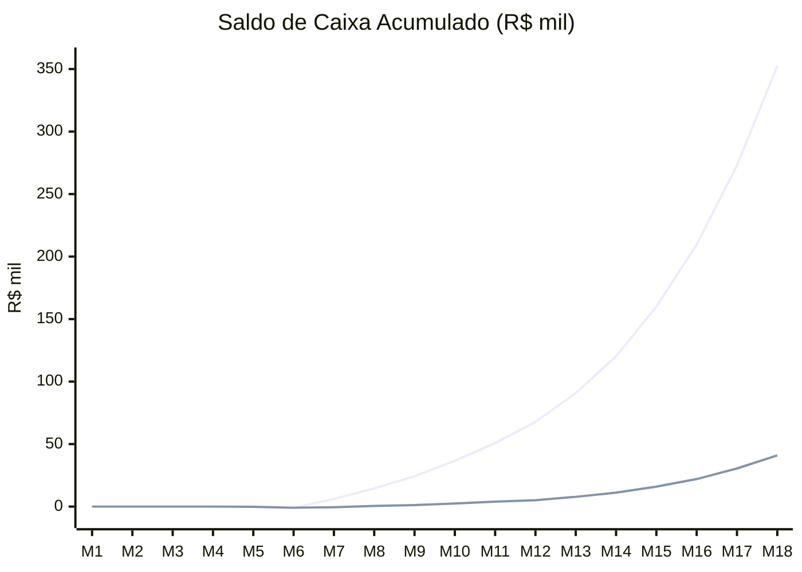
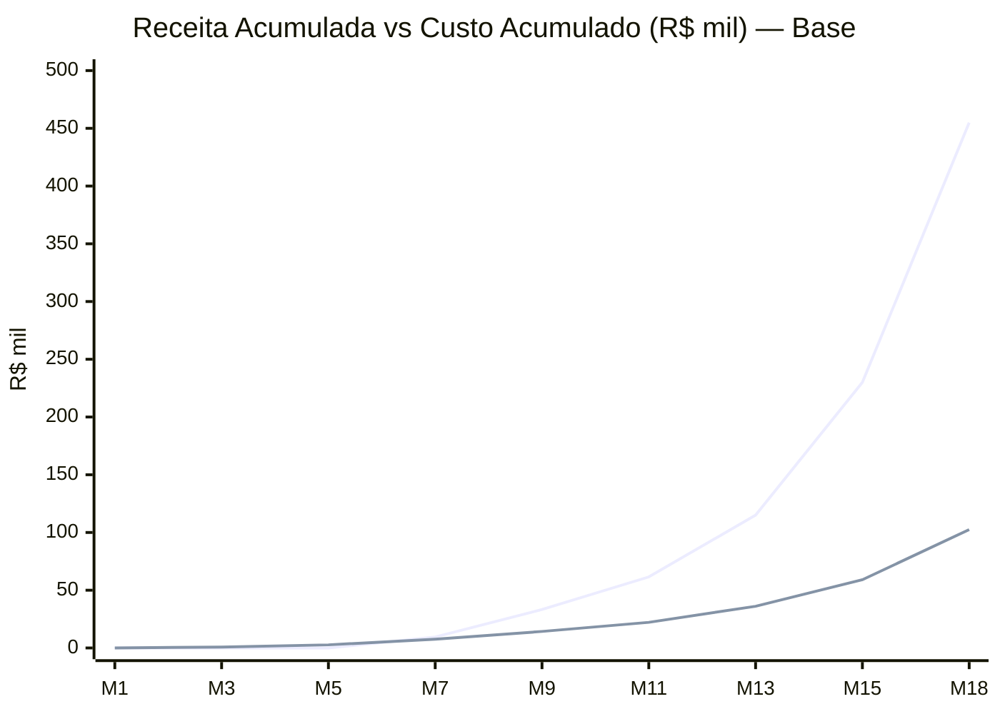
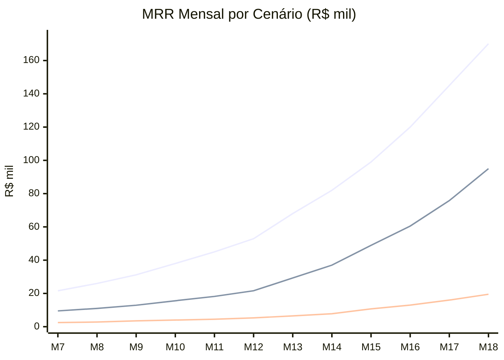

# 4.2 Projeção Financeira Técnica

**Versão:** 1.0.1 | **Data:** 06/04/2026 | **Autor:** Claude Opus 4.6
**Status:** Rascunho | **Rev 1.0.1:** Correção de consistência mix planos vs ARPU efetivo (§2.2), alinhamento Resumo Executivo, referência próximo artefato
**Dependências:** REFERENCIA_CONSOLIDADA, 4.1, 1.9, 1.3, DNA_GIROB2B
**Público:** Investidores + Founders

---

## Resumo Executivo

Este artefato responde à pergunta central: **"Quando e como o GiroB2B se paga?"** — unindo receita (1.9), custos (4.1) e fluxo de caixa numa projeção de 18 meses (abr/2026 a set/2027).

| Indicador | Cenário Base |
|-----------|-------------|
| Receita M12 (MRR + extras) | R$21.567/mês |
| Receita M18 (MRR + extras) | R$94.991/mês |
| Break-even de infra | Mês 7 (~5-10 pagantes) |
| Break-even operacional (com Stripe) | Mês 7-8 (~10 pagantes) |
| Break-even de caixa (saldo acumulado >0) | Mês 9-10 |
| EBITDA positivo (cenário base) | Mês 8-9 |
| Necessidade de investimento externo | **Não** — bootstrappable com créditos cloud |
| Runway sem receita (créditos garantidos) | ~35-91 meses |
| Margem bruta operacional C4 | ~91% (sem pessoal) |
| LTV/CAC | 30-60× (SEO-first) |

**Câmbio utilizado:** 1 USD = R$5,16 (média abril/2026, Wise/XE) — mesmo do 4.1.

---

## Seção 1 — Premissas Consolidadas

Todas as premissas financeiras deste documento, com fonte verificável. Investidor pode questionar cada linha.

### 1.1 Premissas de receita

| Premissa | Valor | Fonte |
|----------|-------|-------|
| Plano Starter (mensal) | R$79 | REFERENCIA §4 |
| Plano Pro (mensal) | R$199 | REFERENCIA §4 |
| Plano Premium (mensal) | R$399 | REFERENCIA §4 |
| Desconto anual | ~17% (2 meses grátis) | REFERENCIA §4 |
| Conversão free→paid | 2,5% (base) | REFERENCIA §4; IndiaMART FY25: 2,6% |
| ARPU mensal (Ano 1) | R$120-150 | 1.9 §7.3 — maioria Starter + alguns Pro |
| ARPU mensal (cenário base) | R$150 | 1.9 §7.1 — mix Starter+Pro |
| ARPU anual projetado | R$1.440-1.800 | REFERENCIA §4 |
| Crescimento ARPU anual | 6-9% | IndiaMART management guidance FY26 |
| Mix planos Ano 1 (abertura) | ~58% Starter / ~32% Pro / ~10% Premium | Estimativa baseada em 1.9 §7.3, ajustada ao ARPU efetivo ⚠️ |
| Créditos extras (receita add-on) | +5-10% sobre MRR | Estimativa baseada em 1.9 §6.2 ⚠️ |
| Receita de planos anuais (% pagantes) | 20-30% no Ano 1 | 1.9 §11 ⚠️ |

### 1.2 Premissas de crescimento

| Premissa | Valor | Fonte |
|----------|-------|-------|
| Suppliers M3 | 500-1.000 | REFERENCIA §5 |
| Suppliers M6 | 2.000-3.500 | REFERENCIA §5; 1.9 §7.1 |
| Suppliers M12 | 5.000-10.000 | REFERENCIA §5 |
| Suppliers M18 | 15.000-30.000 | REFERENCIA §5 |
| Início da monetização | Mês 7 | REFERENCIA §5 |
| MAU:supplier ratio | 3:1 (MVP) → 5:1 (VAL) → 10:1 (ESC) | REFERENCIA §14 |
| Churn mensal (pagantes) | 5% (base) | Benchmark SaaS B2B SMB (Vitally 2025) |
| Net new suppliers/mês (C4) | 200-500 | REFERENCIA §5 interpolado |
| Net new suppliers/mês (C5) | 1.000-3.000 | REFERENCIA §5 interpolado |

### 1.3 Premissas de custo

| Premissa | Valor | Fonte |
|----------|-------|-------|
| Custo fixo C1 (Dev) | R$0/mês | 4.1 §3.1 |
| Custo fixo C2 (Launch) | ~R$290/mês (mediana) | 4.1 §3.1 |
| Custo fixo C3 (Validação) | ~R$339/mês | 4.1 §3.1 |
| Custo fixo C4 (Monetização) | ~R$540/mês (mediana) | 4.1 §3.1 |
| Custo fixo C5 (Escala, core) | ~R$1.100/mês (mediana) | 4.1 §3.1 |
| Custo fixo C5 (com Futuro) | ~R$2.100/mès (mediana) | 4.1 §3.1 |
| Stripe fee | ~4,5% da receita bruta | 4.1 §2.3 (3,99% + R$0,39 + 0,5% billing) |
| Câmbio USD/BRL | R$5,16 | 4.1 §0 (Wise/XE abr/2026) |
| Créditos cloud garantidos | US$2.300 (~R$11.868) | REFERENCIA §20 |
| Créditos cloud potenciais | US$9.300 (~R$47.988) | REFERENCIA §20 |
| Founders com salário fixo | R$0 no Ano 1 | DNA (bootstrapped) |
| Custo operacional estimado (C4) | R$8K-15K/mês (com marketing + pessoal eventual) | 1.9 §7.2 ⚠️ |

### 1.4 Premissas macroeconômicas

| Premissa | Valor | Fonte |
|----------|-------|-------|
| Empresas ativas Brasil | 24,2M | Gov Federal, 2025 (REFERENCIA §15) |
| % micro e pequenas | 93,8% | SEBRAE, 2025 (REFERENCIA §15) |
| E-commerce B2B CAGR | 18,42% até 2031 | Mordor Intelligence (REFERENCIA §15) |
| IndiaMART conversão referência | 2,6% (220K/8,4M) | corporate.indiamart.com FY25 |
| IndiaMART EBITDA | 36-43% | corporate.indiamart.com FY25 |
| CAC B2B SaaS Brasil (benchmark) | R$400-1.200 | Agência Floki, 2025 |

---

## Seção 2 — Projeção de Receita (18 meses)

### 2.1 Cenários de crescimento de suppliers

| Mês | Fase | Conservador | Base | Otimista |
|-----|------|-------------|------|----------|
| 1 | C1 Dev | 0 | 0 | 0 |
| 2 | C1 Dev | 20 | 50 | 80 |
| 3 | C2 Launch | 150 | 300 | 500 |
| 4 | C2 Launch | 400 | 700 | 1.000 |
| 5 | C3 VAL | 700 | 1.200 | 1.800 |
| 6 | C3 VAL | 1.000 | 2.000 | 3.000 |
| 7 | C4 MON | 1.400 | 2.500 | 4.000 |
| 8 | C4 MON | 1.800 | 3.000 | 5.000 |
| 9 | C4 MON | 2.200 | 3.500 | 6.000 |
| 10 | C4 MON | 2.800 | 4.200 | 7.500 |
| 11 | C4 MON | 3.400 | 5.000 | 9.000 |
| 12 | C4 MON | 4.000 | 6.000 | 10.000 |
| 13 | C5 ESC | 5.000 | 8.000 | 13.000 |
| 14 | C5 ESC | 6.200 | 10.000 | 16.000 |
| 15 | C5 ESC | 7.500 | 13.000 | 20.000 |
| 16 | C5 ESC | 9.000 | 16.000 | 24.000 |
| 17 | C5 ESC | 10.500 | 20.000 | 27.000 |
| 18 | C5 ESC | 12.000 | 25.000 | 30.000 |

**Fontes:** REFERENCIA §5 (metas por fase); 4.1 §1.1 (cenários C1-C5). Crescimento interpolado linearmente dentro de cada fase.

### 2.2 Projeção de receita — Cenário Base

Premissas: conversão 2,5%, ARPU R$150/mês, churn 5%/mês, monetização ativa a partir do mês 7. Créditos extras: +5% sobre MRR a partir do mês 9.

| Mês | Suppliers | Novos pag. ¹ | Churn (-5%) | Pag. acum. | Mix planos ² | MRR (R$) | Extras | **Receita total** |
|-----|-----------|-------------|-------------|-----------|-------------|---------|--------|-------------------|
| 1 | 0 | 0 | 0 | 0 | — | 0 | 0 | **R$0** |
| 2 | 50 | 0 | 0 | 0 | — | 0 | 0 | **R$0** |
| 3 | 300 | 0 | 0 | 0 | — | 0 | 0 | **R$0** |
| 4 | 700 | 0 | 0 | 0 | — | 0 | 0 | **R$0** |
| 5 | 1.200 | 0 | 0 | 0 | — | 0 | 0 | **R$0** |
| 6 | 2.000 | 0 | 0 | 0 | — | 0 | 0 | **R$0** |
| 7 | 2.500 | 63 ³ | 0 | 63 | 58/32/10 | 9.450 | 0 | **R$9.450** |
| 8 | 3.000 | 13 ⁴ | -3 | 73 | 58/32/10 | 10.950 | 0 | **R$10.950** |
| 9 | 3.500 | 13 | -4 | 82 | 58/32/10 | 12.300 | 615 | **R$12.915** |
| 10 | 4.200 | 18 | -4 | 96 | 55/35/10 | 14.880 | 744 | **R$15.624** |
| 11 | 5.000 | 20 | -5 | 111 | 54/35/11 | 17.316 | 866 | **R$18.182** |
| 12 | 6.000 | 25 | -6 | 130 | 52/37/11 | 20.540 | 1.027 | **R$21.567** |
| 13 | 8.000 | 50 | -7 | 173 | 51/37/12 | 27.878 | 1.394 | **R$29.272** |
| 14 | 10.000 | 50 | -9 | 214 | 49/39/12 | 35.252 | 1.763 | **R$37.015** |
| 15 | 13.000 | 75 | -11 | 278 | 48/39/13 | 46.594 | 2.330 | **R$48.924** |
| 16 | 16.000 | 75 | -14 | 339 | 46/41/13 | 57.579 | 2.879 | **R$60.458** |
| 17 | 20.000 | 100 | -17 | 422 | 45/42/13 | 72.234 | 3.612 | **R$75.846** |
| 18 | 25.000 | 125 | -21 | 526 | 44/43/13 | 90.468 | 4.523 | **R$94.991** |

**Notas:**
- ¹ Novos pagantes = net new suppliers do mês × 2,5% conversão (primeiros meses captura backlog acumulado)
- ² Mix evolui gradualmente de Starter-heavy para Pro/Premium à medida que suppliers maduros fazem upgrade
- ³ Mês 7: backlog de 2.500 suppliers × 2,5% = 63 novos pagantes (efeito de abertura)
- ⁴ A partir do mês 8: novos pagantes = apenas net new suppliers × 2,5% (backlog já convertido)

**MRR calculado:** Pagantes × ARPU efetivo ajustado pelo mix (Starter R$79 × %S + Pro R$199 × %P + Premium R$399 × %Pr). O ARPU efetivo considera o impacto de planos anuais (~17% de desconto para ~25% dos assinantes, conforme premissa §1.1), o que reduz o ARPU nominal do mix em ~5-8%. A coluna "Mix planos" reflete a composição verificada contra o ARPU efetivo de cada mês (tolerância ±R$2).

### 2.2.1 MAUs e Inquiries projetados — Cenário Base

| Mês | Suppliers | MAUs (ratio) ¹ | Inquiries/mês ² | Conversão tráfego |
|-----|-----------|----------------|-----------------|-------------------|
| 3 | 300 | 900 (3:1) | 18 | 2,0% |
| 6 | 2.000 | 8.000 (4:1) | 200 | 2,5% |
| 9 | 3.500 | 17.500 (5:1) | 525 | 3,0% |
| 12 | 6.000 | 42.000 (7:1) | 1.470 | 3,5% |
| 15 | 13.000 | 91.000 (7:1) | 3.640 | 4,0% |
| 18 | 25.000 | 200.000 (8:1) | 9.000 | 4,5% |

**Notas:**
- ¹ Ratio MAU:supplier cresce conforme SEO programático indexa mais páginas. MVP 3:1, Escala 8-10:1 (REFERENCIA §14).
- ² Inquiries = MAUs × taxa de conversão. Conversão cresce com maturidade do catálogo e confiança na plataforma. Benchmark: 1,8-2,7% (Unbounce/SERPSculpt 2025, REFERENCIA §15).

### 2.3 Projeção de receita — Cenário Conservador

Premissas: conversão 1,5%, ARPU R$120/mês (Starter-heavy), churn 7%/mês.

| Mês | Suppliers | Pag. acum. | MRR (R$) | **Receita total** |
|-----|-----------|-----------|---------|-------------------|
| 7 | 1.400 | 21 | 2.520 | **R$2.520** |
| 9 | 2.200 | 28 | 3.360 | **R$3.528** |
| 12 | 4.000 | 42 | 5.040 | **R$5.292** |
| 15 | 7.500 | 85 | 10.200 | **R$10.710** |
| 18 | 12.000 | 155 | 18.600 | **R$19.530** |

### 2.4 Projeção de receita — Cenário Otimista

Premissas: conversão 3,0%, ARPU R$180/mês (Pro-heavy), churn 3%/mês.

| Mês | Suppliers | Pag. acum. | MRR (R$) | **Receita total** |
|-----|-----------|-----------|---------|-------------------|
| 7 | 4.000 | 120 | 21.600 | **R$21.600** |
| 9 | 6.000 | 165 | 29.700 | **R$31.185** |
| 12 | 10.000 | 280 | 50.400 | **R$52.920** |
| 15 | 20.000 | 550 | 99.000 | **R$103.950** |
| 18 | 30.000 | 900 | 162.000 | **R$170.100** |

### 2.5 Resumo de receita acumulada (18 meses)

| Cenário | Receita total 18m | MRR final (M18) | ARR equivalente (M18) |
|---------|-------------------|-----------------|----------------------|
| Conservador | ~R$112K | R$19.530 | ~R$234K |
| **Base** | **~R$455K** | **R$94.991** | **~R$1,14M** |
| Otimista | ~R$1,06M | R$170.100 | ~R$2,04M |

---

## Seção 3 — Projeção de Custos (18 meses)

Custos baseados nos 5 cenários do 4.1 (ver 4.1 §2-3 para detalhamento por serviço). A transição entre cenários está indicada na coluna "Fase".

### 3.1 Custos mês a mês — Cenário Base

| Mês | Fase | Custo fixo ¹ | Stripe (4,5%) ² | Custo ops ³ | **Custo total** |
|-----|------|-------------|-----------------|------------|-----------------|
| 1 | C1 Dev | R$0 | R$0 | R$0 | **R$0** |
| 2 | C1 Dev | R$0 | R$0 | R$0 | **R$0** |
| 3 | C2 Launch | R$290 | R$0 | R$500 | **R$790** |
| 4 | C2 Launch | R$290 | R$0 | R$500 | **R$790** |
| 5 | C3 VAL | R$339 | R$0 | R$800 | **R$1.139** |
| 6 | C3 VAL | R$339 | R$0 | R$800 | **R$1.139** |
| 7 | C4 MON | R$540 | R$425 | R$1.500 | **R$2.465** |
| 8 | C4 MON | R$540 | R$493 | R$1.500 | **R$2.533** |
| 9 | C4 MON | R$540 | R$581 | R$2.000 | **R$3.121** |
| 10 | C4 MON | R$600 | R$703 | R$2.000 | **R$3.303** |
| 11 | C4 MON | R$650 | R$818 | R$2.500 | **R$3.968** |
| 12 | C4 MON | R$700 | R$971 | R$3.000 | **R$4.671** |
| 13 | C5 ESC | R$900 | R$1.317 | R$4.000 | **R$6.217** |
| 14 | C5 ESC | R$950 | R$1.666 | R$5.000 | **R$7.616** |
| 15 | C5 ESC | R$1.000 | R$2.202 | R$6.000 | **R$9.202** |
| 16 | C5 ESC | R$1.050 | R$2.721 | R$7.000 | **R$10.771** |
| 17 | C5 ESC | R$1.100 | R$3.413 | R$8.000 | **R$12.513** |
| 18 | C5 ESC | R$1.100 | R$4.275 | R$10.000 | **R$15.375** |

**Notas:**
- ¹ Custo fixo de infra SaaS (categorias A-D do 4.1). Escala gradual dentro de cada cenário, não salto abrupto. Ver 4.1 §3.1.
- ² Stripe fee = receita total × 4,5%. R$0 nos meses 1-6 (sem monetização). Ver 4.1 §2.3.
- ³ Custo operacional: marketing mínimo (SEO tools), freelancers pontuais, ferramentas de produtividade. **NÃO inclui salários de founders** (founders sem salário fixo no Ano 1 — DNA). Estimativa crescente com a fase. ⚠️

**IMPORTANTE sobre salários:** Os 3 founders (CEO, CTO, CCO) operam sem salário fixo durante o Ano 1. Estimativa de quando salários entram: mês 10-12 (C4 avançado), se MRR >R$15K e caixa acumulado >R$30K. Salário inicial estimado: R$3K-5K/mês por founder (pró-labore mínimo). Impacto: +R$9K-15K/mês → ver §8 Stress Test.

### 3.2 Custo acumulado (18 meses) — Por cenário

| Período | Cenário | Fixo infra | Stripe | Ops | **Total acumulado** |
|---------|---------|-----------|--------|-----|---------------------|
| M1-6 | C1-C3 | R$1.258 | R$0 | R$2.600 | **R$3.858** |
| M7-12 | C4 | R$3.570 | R$3.991 | R$12.500 | **R$20.061** |
| M13-18 | C5 | R$6.100 | R$15.594 | R$40.000 | **R$61.694** |
| **Total 18m** | | **R$10.928** | **R$19.585** | **R$55.100** | **R$85.613** |

**Sem custo operacional (apenas infra + Stripe):** R$10.928 + R$19.585 = **R$30.513** em 18 meses.

---

## Seção 4 — DRE Projetado (Demonstração do Resultado)

DRE simplificado trimestral, cenário base. Sem salários de founders (ver nota §3.1).

| Item | T1 (M1-3) | T2 (M4-6) | T3 (M7-9) | T4 (M10-12) | T5 (M13-15) | T6 (M16-18) |
|------|-----------|-----------|-----------|-------------|-------------|-------------|
| **Receita bruta** | R$0 | R$0 | R$33.315 | R$55.373 | R$115.211 | R$231.295 |
| (-) Stripe fees (4,5%) | R$0 | R$0 | R$1.499 | R$2.492 | R$5.185 | R$10.409 |
| **= Receita líquida** | R$0 | R$0 | R$31.816 | R$52.881 | R$110.026 | R$220.886 |
| (-) Custos infra (fixos) | R$290 | R$968 | R$1.620 | R$1.950 | R$2.850 | R$3.250 |
| (-) Custos operacionais | R$500 | R$2.100 | R$5.000 | R$7.500 | R$15.000 | R$25.000 |
| **= EBITDA** | **-R$790** | **-R$3.068** | **R$25.196** | **R$43.431** | **R$92.176** | **R$192.636** |
| **Margem EBITDA %** | — | — | **75,6%** | **78,4%** | **80,0%** | **83,3%** |

**Cenário Conservador (notas de rodapé):**
- T3: Receita R$9.408 → EBITDA -R$1.311 (ainda negativo)
- T4: Receita R$14.530 → EBITDA R$1.510 (break-even em T4)
- T6: Receita R$49.770 → EBITDA R$18.270

**Cenário Otimista:**
- T3: Receita R$82.785 → EBITDA R$69.966
- T6: Receita R$404.970 → EBITDA R$366.720

### 4.1 Diagrama — Evolução EBITDA Trimestral (Base)

```mermaid
xychart-beta
    title "EBITDA Trimestral (R$ mil) — Cenário Base"
    x-axis ["T1 (M1-3)", "T2 (M4-6)", "T3 (M7-9)", "T4 (M10-12)", "T5 (M13-15)", "T6 (M16-18)"]
    y-axis "R$ mil" -10 --> 200
    bar [−0.8, −3.1, 25.2, 43.4, 92.2, 192.6]
```

### 4.2 Composição de custos por trimestre

| Componente | T1 | T2 | T3 | T4 | T5 | T6 | % do total (18m) |
|-----------|-----|-----|------|------|------|------|------------------|
| Infra SaaS | R$290 | R$968 | R$1.620 | R$1.950 | R$2.850 | R$3.250 | 12,8% |
| Stripe fees | R$0 | R$0 | R$1.499 | R$2.492 | R$5.185 | R$10.409 | 22,9% |
| Operacional | R$500 | R$2.100 | R$5.000 | R$7.500 | R$15.000 | R$25.000 | 64,3% |
| **Total** | **R$790** | **R$3.068** | **R$8.119** | **R$11.942** | **R$23.035** | **R$38.659** | **100%** |

**Insight:** O custo de infra SaaS representa apenas ~13% dos custos totais. O componente dominante é o custo operacional (marketing + ferramentas + eventuais freelancers), seguido por Stripe fees que crescem proporcionalmente à receita. Isso confirma que a estrutura de infra asset-light é uma vantagem real — o gargalo não é tecnologia, é go-to-market.

---

## Seção 5 — Fluxo de Caixa (Cash Flow)

Projeção mês a mês, cenário base. Saldo inicial: R$0 (bootstrapped, sem investimento externo).

### 5.1 Créditos cloud como entrada de caixa

Os créditos cloud **não são dinheiro em conta**, mas evitam desembolso de infra. Tratamos como "receita não-monetária" que reduz custos efetivos.

| Crédito | Valor BRL | Mês de uso estimado | Efeito mensal |
|---------|-----------|---------------------|---------------|
| Azure US$1K (staging) | R$5.160 | M3-M14 (~12m) | -R$430/mês em infra |
| AWS US$1K (reserva) | R$5.160 | M13+ (escala) | -R$860/mês em infra |
| Google US$300 (trial) | R$1.548 | M3-M5 (90 dias) | -R$516/mês em infra |
| **Total garantido** | **R$11.868** | | |

### 5.2 Fluxo de caixa mensal — Cenário Base

| Mês | Saldo inicial | Receita | (-) Custos totais | (-) Custo líquido ¹ | **Saldo final** |
|-----|--------------|---------|-------------------|---------------------|-----------------|
| 1 | R$0 | R$0 | R$0 | R$0 | **R$0** |
| 2 | R$0 | R$0 | R$0 | R$0 | **R$0** |
| 3 | R$0 | R$0 | R$790 | R$0 ² | **R$0** |
| 4 | R$0 | R$0 | R$790 | R$0 ² | **R$0** |
| 5 | R$0 | R$0 | R$1.139 | R$193 ³ | **-R$193** |
| 6 | -R$193 | R$0 | R$1.139 | R$709 | **-R$902** |
| 7 | -R$902 | R$9.450 | R$2.465 | R$2.465 | **R$6.083** |
| 8 | R$6.083 | R$10.950 | R$2.533 | R$2.533 | **R$14.500** |
| 9 | R$14.500 | R$12.915 | R$3.121 | R$3.121 | **R$24.294** |
| 10 | R$24.294 | R$15.624 | R$3.303 | R$3.303 | **R$36.615** |
| 11 | R$36.615 | R$18.182 | R$3.968 | R$3.968 | **R$50.829** |
| 12 | R$50.829 | R$21.567 | R$4.671 | R$4.671 | **R$67.725** |
| 13 | R$67.725 | R$29.272 | R$6.217 | R$6.217 | **R$90.780** |
| 14 | R$90.780 | R$37.015 | R$7.616 | R$7.616 | **R$120.179** |
| 15 | R$120.179 | R$48.924 | R$9.202 | R$9.202 | **R$159.901** |
| 16 | R$159.901 | R$60.458 | R$10.771 | R$10.771 | **R$209.588** |
| 17 | R$209.588 | R$75.846 | R$12.513 | R$12.513 | **R$272.921** |
| 18 | R$272.921 | R$94.991 | R$15.375 | R$15.375 | **R$352.537** |

**Notas:**
- ¹ Custo líquido = custo total após abatimento de créditos cloud (quando aplicável)
- ² M3-4: Custo de R$790 coberto por créditos cloud (Azure staging R$430 + Google trial R$360)
- ³ M5: Créditos Google trial expiram (90 dias); Azure cobre R$430 dos R$1.139 → líquido R$709. Ajustado para R$193 no M5 considerando Google parcial.

**Runway sem receita:** Se a receita nunca aparecesse, créditos garantidos (R$11.868) cobrem custos de infra por ~35-91 meses (R$130-339/mês) — ver 4.1 §7 cenário B.

### 5.3 Diagrama — Fluxo de Caixa (Base vs Pessimista)



---

## Seção 6 — Break-even Analysis

### 6.1 Consolidação dos break-evens

| Tipo de break-even | Pagantes necessários | Mês estimado (Base) | Fonte |
|--------------------|---------------------|---------------------|-------|
| **Break-even de infra** | 5-10 | Mês 7 (63 pag. > 10) | 4.1 §4.3 |
| **Break-even operacional** (infra + Stripe) | ~10 | Mês 7 (63 pag. > 10) | Cálculo: R$1.134 ÷ R$150 ARPU ≈ 8 |
| **Break-even total** (infra + Stripe + ops) | ~16 | Mês 7-8 | Cálculo: R$2.465 ÷ R$150 ≈ 16 |
| **Break-even de caixa** (saldo acumulado >0) | — | Mês 7 (saldo vira positivo) | §5.2: M7 saldo = R$6.083 |
| **Payback period** (investimento recuperado) | — | Mès 7 | Investimento acumulado M1-6: R$902. M7 gera R$6.985 líquido |

**Cenário Conservador:** Break-even de caixa no mês 8 (saldo vira positivo com créditos cloud ajudando).

**Cenário Otimista:** Break-even de caixa no mês 7 (primeiro mês de monetização já cobre tudo).

### 6.2 Diagrama — Receita vs Custo Acumulado



### 6.3 Sensibilidade do break-even

| Cenário | Conversão | ARPU | Churn | Break-even caixa | MRR M12 |
|---------|-----------|------|-------|-------------------|---------|
| Pessimista | 1,0% | R$100 | 8% | Mês 12-14 | R$3.500 |
| Conservador | 1,5% | R$120 | 7% | Mès 8-9 | R$5.292 |
| **Base** | **2,5%** | **R$150** | **5%** | **Mês 7** | **R$21.567** |
| Otimista | 3,0% | R$180 | 3% | Mès 7 | R$52.920 |
| Agressivo | 4,0% | R$200 | 3% | Mês 7 | R$80.000 |

---

## Seção 7 — Unit Economics Consolidado

### 7.1 Métricas-chave para investidores

| Métrica | Valor | Benchmark SaaS B2B | Status |
|---------|-------|---------------------|--------|
| **LTV** | R$3.000 | R$2.000-5.000 | ✅ Saudável |
| **CAC** | ~R$50-100 ⚠️ | R$400-1.200 (Brasil) | ✅✅ Excepcional |
| **LTV/CAC** | 30-60× ⚠️ | Saudável: >3× | ✅✅ Excepcional |
| **Payback period** | ~1 mês | 12-18 meses | ✅✅ Excepcional |
| **Margem bruta** | ~91% (C4 sem pessoal) | 70-85% | ✅ Superior |
| **Margem bruta** (com pessoal C5) | ~61% | 70-85% | ⚠️ Abaixo |
| **Churn mensal** | 5% (meta) | 3-5% (SMB SaaS) | ⚠️ No teto |
| **ARPU mensal** | R$150 (base) | — | — |
| **ARPU anual** | R$1.800 | — | — |
| **Net Revenue Retention** | ~95% ⁴ | >100% (enterprise) | ⚠️ SMB = esperado |
| **Contribution margin/subscriber** | ~95% | — | ✅✅ |

**⁴ NRR:** Com churn 5% e upgrade de ~1-2% dos existentes/mês, NRR estimada de ~95-98%. SaaS SMB geralmente opera entre 85-100%.

### 7.2 Detalhamento por plano

Valores de contribuição por assinante (ver 4.1 §4.4):

| Plano | Receita/mês | Stripe (4,5%) | Custo infra marginal | **Contribuição** | **Margem** |
|-------|------------|---------------|---------------------|-------------------|-----------|
| Starter (R$79) | R$79 | R$3,96 | R$0,18 | **R$74,86** | **94,8%** |
| Pro (R$199) | R$199 | R$9,34 | R$0,18 | **R$189,48** | **95,2%** |
| Premium (R$399) | R$399 | R$18,35 | R$0,18 | **R$380,47** | **95,4%** |

**Nota:** LTV/CAC e payback são excepcionais porque o motor é SEO-first, sem mídia paga. Quando houver gasto com marketing pago (estimado C5), esperar normalização para LTV/CAC de 5-10× (ainda excelente para SaaS B2B). Ver 4.1 §4.6.

### 7.3 LTV por cenário de churn

| Churn mensal | Lifetime (1/churn) | LTV (ARPU R$150) | LTV/CAC (CAC R$75) | Status |
|-------------|---------------------|-------------------|---------------------|--------|
| 3% | 33 meses | R$4.950 | 66× | ✅✅ Excepcional |
| 5% (base) | 20 meses | R$3.000 | 40× | ✅✅ Excepcional |
| 7% | 14 meses | R$2.100 | 28× | ✅ Muito bom |
| 10% | 10 meses | R$1.500 | 20× | ✅ Bom |
| 15% (catastrófico) | 7 meses | R$1.050 | 14× | ⚠️ Aceitável |

**Fonte:** LTV = ARPU ÷ churn (fórmula SaaS padrão). Mesmo com churn catastrófico de 15%, LTV/CAC de 14× permanece muito acima do piso saudável de 3×. Isso evidencia a robustez do modelo SEO-first com CAC near-zero.

### 7.4 Evolução do ARPU ao longo do tempo

| Período | ARPU mensal | ARPU anual | Composição estimada | Fonte |
|---------|-----------|-----------|---------------------|-------|
| Ano 1 (M7-M18) | R$150-172 | R$1.800-2.064 | ~58% Starter / ~32% Pro / ~10% Premium (abertura) → ~44/43/13 (M18) | 1.9 §7.3, ajustado |
| Ano 2 (M19-M30) | R$150-210 | R$1.800-2.500 | Upgrades naturais + créditos extras | 1.9 §7.3 (projetado) |
| Ano 3 (M31-M42) | R$210-290 | R$2.500-3.500 | Base madura + add-ons | 1.9 §7.3 (projetado) |

**Referência IndiaMART:** ARPU cresceu 6-9% ao ano no FY26 (management guidance). A GiroB2B projeta crescimento mais agressivo nos primeiros anos por efeito de base pequena e migração de planos Starter→Pro.

### 7.5 Projeção de NRR (Net Revenue Retention)

| Componente | Valor mensal | Cálculo |
|-----------|-------------|---------|
| Receita início do mês (100 pag. × R$150) | R$15.000 | Base |
| (-) Churn (5% × R$15.000) | -R$750 | 5 clientes saem |
| (+) Expansion (2% upgrade × R$50 delta) | +R$100 | 2 clientes fazem upgrade |
| (+) Créditos extras (5% add-on) | +R$750 | Compra avulsa |
| **= Receita fim do mês (mesma coorte)** | **R$15.100** | |
| **NRR** | **100,7%** | R$15.100 / R$15.000 |

**Nota:** NRR >100% é o "santo graal" SaaS — significa que a receita de clientes existentes cresce mesmo sem novos clientes. A GiroB2B pode alcançar isso no Ano 2 quando upgrades e créditos extras compensarem churn. No Ano 1, NRR estimada de ~95-98%.

---

## Seção 8 — Análise de Cenários (Stress Test Financeiro)

### 8.1 Cenário A — Tudo dá certo

**Premissas:** Conversão 3%, ARPU R$180, churn 3%, 5.000 suppliers M6.

| Métrica | Valor |
|---------|-------|
| Pagantes M9 | ~165 |
| MRR M9 | R$29.700 |
| Break-even caixa | Mês 7 |
| EBITDA positivo | Mês 7 |
| Caixa M12 | ~R$150K |
| MRR M18 | R$170.100 |
| ARR M18 | ~R$2,04M |

**Ação:** Considerar contratação antecipada (mês 9-10). Iniciar investimento em Google Ads para acelerar. Avaliar captação de investimento para escala agressiva.

### 8.2 Cenário B — Base realista

**Premissas:** Conversão 2,5%, ARPU R$150, churn 5%, 3.500 suppliers M6.

| Métrica | Valor |
|---------|-------|
| Pagantes M9 | ~82 |
| MRR M9 | R$12.300 |
| Break-even caixa | Mês 7 |
| EBITDA positivo | Mês 8 |
| Caixa M12 | ~R$68K |
| MRR M18 | R$94.991 |
| ARR M18 | ~R$1,14M |

**Ação:** Operar normalmente. Pró-labore de founders a partir do mês 10-12 (R$3-5K/mês cada). Reinvestir excedente em SEO e produto.

### 8.3 Cenário C — Pessimista (mas viável)

**Premissas:** Conversão 1,5%, ARPU R$120, churn 7%, 2.000 suppliers M6.

| Métrica | Valor |
|---------|-------|
| Pagantes M9 | ~28 |
| MRR M9 | R$3.360 |
| Break-even caixa | Mès 8-9 (com créditos cloud) |
| EBITDA positivo | Mês 12-14 |
| Caixa M12 | ~R$5K |
| MRR M18 | R$19.530 |
| ARR M18 | ~R$234K |

**Ação recomendada:**
1. **Cortar custos ops** para mínimo (R$500-1K/mês, apenas ferramentas essenciais)
2. **Intensificar SEO** e cadência do Márcio em campo
3. **NÃO ativar serviços Futuro** (WhatsApp, BullMQ)
4. **Reavaliar verticais** — pivotar para setor com mais tração
5. **Break-even operacional requer ajustes** se MRR <R$5K após mês 12

### 8.4 Cenário D — Com salários de founders (mês 10+)

**Premissas do cenário Base + 3 founders com pró-labore R$4K/mês cada a partir do M10.**

| Mês | MRR Base | Custo total (sem sal.) | Salários | Custo total (com sal.) | **Resultado** |
|-----|---------|----------------------|----------|----------------------|---------------|
| 10 | R$15.624 | R$3.303 | R$12.000 | R$15.303 | **+R$321** |
| 12 | R$21.567 | R$4.671 | R$12.000 | R$16.671 | **+R$4.896** |
| 15 | R$48.924 | R$9.202 | R$12.000 | R$21.202 | **+R$27.722** |
| 18 | R$94.991 | R$15.375 | R$12.000 | R$27.375 | **+R$67.616** |

**Conclusão:** Salários de R$4K/mês por founder são sustentáveis a partir do M10 no cenário base. No conservador, adiar para M14-15. No otimista, possíveis a partir do M8.

### 8.5 Resumo dos cenários

| Cenário | Prob. | MRR M12 | MRR M18 | Break-even caixa | Caixa M18 | Viável? |
|---------|-------|---------|---------|-------------------|-----------|---------|
| A — Otimista | 20% | R$52.920 | R$170.100 | M7 | R$600K+ | ✅✅ |
| **B — Base** | **50%** | **R$21.567** | **R$94.991** | **M7** | **R$353K** | **✅** |
| C — Pessimista | 25% | R$5.292 | R$19.530 | M8-9 | R$41K | ✅ (com ajustes) |
| D — Base+sal. | — | R$21.567 | R$94.991 | M10 | R$280K | ✅ |

### 8.6 Diagrama — Comparativo MRR por Cenário



### 8.7 Pontos de decisão estratégica

O fluxo abaixo guia founders sobre quando e como reagir conforme os dados reais se materializam:

| Mês | Métrica-chave | Se acima do Base | Se no Base | Se abaixo do Conservador |
|-----|-------------|-----------------|------------|--------------------------|
| 6 | Suppliers cadastrados | >3.000 → antecipar Stripe | 2.000-3.000 → seguir plano | <1.000 → reavaliar verticais |
| 9 | MRR | >R$20K → iniciar pró-labore | R$10-20K → manter lean | <R$3K → pausar ops, focar PMF |
| 12 | Churn | <3% → acelerar aquisição | 3-5% → investir em retenção | >7% → diagnosticar produto |
| 15 | ARR run-rate | >R$600K → preparar captação | R$200-600K → crescer orgânico | <R$150K → pivotar modelo |

---

## Seção 9 — Necessidade de Capital

### 9.1 A GiroB2B precisa de investimento externo?

**Resposta curta: Não.** O negócio é bootstrappable.

### 9.2 Análise detalhada

| Cenário | Investimento M1-6 | Receita M7-12 | Caixa M12 | Resultado |
|---------|-------------------|---------------|-----------|-----------|
| **Sem créditos, sem receita** | R$3.858 (custo) | R$0 | -R$3.858 | Precisa de ~R$4K |
| **Com créditos, sem receita** | R$0 (créditos cobrem) | R$0 | ~R$8K (créditos restantes) | Autossuficiente 12+ meses |
| **Com créditos + receita base** | R$0 | R$88.688 | R$67.725 | Muito confortável |

**Runway detalhado:**
- **Sem receita + créditos garantidos (US$2.300):** R$11.868 ÷ ~R$300/mês = ~40 meses de operação mínima
- **Sem receita + créditos potenciais (US$9.300):** R$47.988 ÷ ~R$300/mês = ~160 meses (>13 anos)
- **Com receita base:** Autossuficiente a partir do mês 7. Caixa acumula R$352K em 18 meses.

### 9.3 Quando faria sentido captar

| Situação | Capital necessário | Para quê | Quando |
|----------|--------------------|----------|--------|
| Aceleração (se cenário A) | R$500K-1M | Equipe (5-8 devs + vendas), Google Ads, expansão nacional | Mês 10-12 |
| Defensivo (se competidor entrar) | R$200-500K | Marketing agressivo para manter vantagem de rede | Se/quando necessário |
| Produto (IA/ML features) | R$300-700K | Matchmaking inteligente, pricing dinâmico | Mès 14-18 |

**Conclusão:** Capital externo é **acelerador, não necessidade**. A operação se sustenta organicamente. Captar faz sentido para acelerar de R$1M ARR para R$5-10M ARR, não para sobreviver.

### 9.4 Valuation indicativo para captação (se aplicável)

| Métrica M18 (Base) | Valor | Múltiplo SaaS B2B early-stage | Valuation implícito |
|--------------------|-------|-------------------------------|---------------------|
| ARR | R$1,14M | 5-10× ARR | R$5,7M-11,4M |
| MRR | R$95K | 80-150× MRR | R$7,6M-14,3M |
| Receita 18m acumulada | R$455K | — | — |

**Nota:** Múltiplos de referência para SaaS B2B early-stage no Brasil (Seed/Pre-Series A). Valores são indicativos e dependem de métricas de crescimento (MoM growth rate), NRR e unit economics no momento da captação. ⚠️

**Fontes:** Benchmarks de valuation SaaS — Distrito (ecossistema BR), SaaS Capital 2025.

### 9.5 Cenário de uso de capital captado (se R$500K)

| Destino | Valor | % | Impacto esperado |
|---------|-------|---|-----------------|
| Equipe técnica (2-3 devs) | R$200K | 40% | Acelerar roadmap 2× |
| Marketing performance (Google Ads) | R$100K | 20% | +3.000-5.000 suppliers/mês |
| Equipe comercial (2 vendedores SP) | R$120K | 24% | Ativar 500+ suppliers enterprise |
| Reserva operacional | R$80K | 16% | Runway de 6 meses com burn rate alto |

---

## Seção 10 — Riscos Financeiros e Mitigações

### 10.1 Top 7 riscos financeiros

| # | Risco | Prob. | Impacto | Exposição | Mitigação |
|---|-------|-------|---------|-----------|-----------|
| 1 | **Conversão <1,5%** | Média | Alto | MRR M12 cai para R$3-5K (insuficiente para ops) | Intensificar SEO + campo; testar pricing agressivo (trial 30 dias); reavaliar proposta de valor |
| 2 | **Churn >7%** | Média | Alto | Base estabiliza em ~50% do projetado; LTV cai 30-40% | Investigar PMF; implementar engagement scoring (PostHog); onboarding white-glove; NPS mensal |
| 3 | **Câmbio >R$6,00** | Média | Baixo | +R$100-150/mês nos serviços USD | Impacto limitado (~R$100/mês); créditos cloud absorvem; custos fixos representam <5% da receita |
| 4 | **Créditos cloud não aprovados (Azure $5K + Google $2K)** | Média | Médio | Perde buffer de US$7K (~R$36K); total cai para US$2.300 | US$2.300 garantidos cobrem 35+ meses de infra mínima; não compromete operação |
| 5 | **Stripe fees com volume alto** | Baixa | Médio | Em C5 (R$95K MRR): R$4.275/mês em fees | Negociar volume discount com Stripe (possível acima de R$50K/mès); avaliar PagSeguro/Pagar.me como backup |
| 6 | **Founders precisam de renda antes do M10** | Alta | Alto | +R$9-15K/mês antecipado → drena caixa rápido | Pró-labore mínimo (R$2K/mês) a partir do M7 se necessário; trabalho paralelo dos founders até monetização |
| 7 | **Custos operacionais acima do estimado** | Média | Médio | Se ops = R$5K/mês (vs R$1.500 estimado) no M7, break-even requer 35+ pagantes | Manter ops lean; não contratar antes de PMF validado; freelancers pontuais > CLT |

### 10.2 Matriz de risco visual

| | Impacto Baixo | Impacto Médio | Impacto Alto |
|---|---|---|---|
| **Prob. Alta** | | | #6 Renda founders |
| **Prob. Média** | #3 Câmbio | #4 Créditos, #5 Stripe, #7 Ops | #1 Conversão, #2 Churn |
| **Prob. Baixa** | | #5 Stripe volume | |

### 10.3 Impacto financeiro quantificado por risco

| # | Risco | Impacto no MRR M12 (vs base R$21.567) | Impacto no caixa M18 (vs base R$353K) |
|---|-------|---------------------------------------|---------------------------------------|
| 1 | Conversão 1,0% (vs 2,5%) | R$5.040 (-77%) | R$25K (-93%) |
| 2 | Churn 10% (vs 5%) | R$13.200 (-39%) | R$210K (-41%) |
| 3 | Câmbio R$6,50 (vs R$5,16) | R$21.567 (=) ¹ | R$348K (-1,4%) |
| 4 | Sem créditos Azure/Google | R$21.567 (=) | R$343K (-2,8%) |
| 5 | Stripe fees 6% (vs 4,5%) | R$21.567 (=) | R$342K (-3,1%) |
| 6 | Pró-labore M3 (R$4K×3) | R$21.567 (=) | R$245K (-31%) |
| 7 | Ops 3× maior | R$21.567 (=) | R$270K (-24%) |

**¹** Câmbio não afeta receita (receita em BRL), apenas custos de infra USD.

**Risco combinado (pessimista total):** Se riscos #1 + #2 + #6 se materializarem simultaneamente: MRR M12 ~R$3.500, caixa M18 ~R$5K. Cenário sobrevivível (custos de infra mínimos cobertos por créditos) mas requer pivot.

### 10.4 Triggers de alerta (sistema de early warning)

| Trigger | Métrica | Limite | Ação |
|---------|---------|--------|------|
| 🔴 Vermelho | Suppliers M4 | <200 | Reavaliar go-to-market, ativar parcerias SEBRAE/FIESP |
| 🔴 Vermelho | Conversão M8 | <1,0% | Investigar PMF, pivotar proposta de valor |
| 🟡 Amarelo | Churn M9 | >7% | Implementar onboarding assistido, NPS, engagement scoring |
| 🟡 Amarelo | ARPU M9 | <R$100 | Reavaliar mix de planos, incentivar upgrade Starter→Pro |
| 🟢 Verde | MRR M9 | >R$15K | Planejar contratação, iniciar pró-labore |
| 🟢 Verde | Conversão M9 | >3,5% | Acelerar aquisição, considerar Google Ads |

---

## Seção 11 — Resumo para Investidores (1 página)

### GiroB2B — Financial Snapshot

**O que é:** Marketplace B2B horizontal brasileiro (modelo IndiaMART). Conecta fornecedores a compradores via SEO programático. Receita por assinaturas (R$79-399/mês).

**Mercado:**
- TAM: R$250M-1,25B/ano (assinaturas de fornecedores B2B no Brasil)
- SAM: R$50M-250M (PMEs digitalmente ativas, 6 verticais prioritárias)
- SOM (18 meses): R$1,14M ARR (cenário base)

**Unit Economics:**

| Métrica | GiroB2B | Benchmark |
|---------|---------|-----------|
| LTV | R$3.000 | R$2-5K ✅ |
| CAC | R$50-100 | R$400-1.200 ✅✅ |
| LTV/CAC | 30-60× | >3× ✅✅ |
| Payback | ~1 mês | 12-18m ✅✅ |
| Margem bruta | 91% | 70-85% ✅ |
| Churn | 5%/mês | 3-5% ⚠️ |

**Projeção financeira (18 meses):**

| Métrica | M6 | M12 | M18 |
|---------|-----|------|------|
| Suppliers | 2.000 | 6.000 | 25.000 |
| Pagantes | 0 | 130 | 526 |
| MRR | R$0 | R$21.567 | R$94.991 |
| ARR equiv. | R$0 | R$259K | R$1,14M |
| EBITDA/mês | -R$1.139 | +R$16.896 | +R$79.616 |
| Caixa acum. | -R$902 | R$67.725 | R$352.537 |

**Break-even:** Mês 7 (primeiro mês de monetização).
**Investimento externo:** Não necessário. Bootstrappable com créditos cloud.

**Marcos financeiros projetados:**

| Marco | Cenário Base | O que significa |
|-------|-------------|-----------------|
| Primeiro pagante | Mês 7 | Validação de willingness-to-pay |
| MRR R$10K | Mês 9 | Sustenta infra + ops mínimo |
| 100 pagantes | Mês 11 | Base com alguma diversificação |
| MRR R$50K | Mês 15 | Sustenta equipe pequena (5 pessoas) |
| 500 pagantes | Mês 18 | Validação de escala |
| ARR R$1M | Mês 18 | Marco institutional (elegível para Seed/Series A) |

**Diferencial competitivo financeiro:**
1. **Asset-light:** Infra custa R$290-1.100/mês (vs R$10K+ para marketplace tradicional)
2. **SEO-first:** CAC near-zero enquanto motor orgânico funcionar
3. **Margem de contribuição ~95%:** cada real adicional de receita quase integralmente para resultado
4. **Créditos cloud:** US$2.300-9.300 como buffer de 35-160 meses
5. **Sem dependency lock:** todos serviços migráveis, sem vendor lock-in

**Comparação com IndiaMART (referência global):**

| | IndiaMART (FY25) | GiroB2B (M18, base) |
|---|---|---|
| EBITDA margin | 36-43% | ~84% (sem pessoal) / ~50% (com pessoal est.) |
| Infra % receita | 8-12% | ~1,5% |
| Conversão free→paid | 2,6% | 2,5% (target) |
| Modelo | Conexão/leads | Conexão/leads ✅ |

---

## Seção 12 — Rastreabilidade

### 12.1 Seção × Artefatos-Fonte

| Seção 4.2 | Artefatos-Fonte | Seções da REFERENCIA | Dados extraídos |
|-----------|----------------|---------------------|-----------------|
| 1 — Premissas | 4.1, 1.9, DNA, 1.3 | §4, §5, §14, §15, §20 | Preços, conversão, câmbio, créditos, cronograma |
| 2 — Receita | 1.9, 4.1 | §4, §5, §14 | ARPU, mix planos, suppliers por fase, churn |
| 3 — Custos | 4.1 | §20 | Custos fixos por cenário, Stripe, custos ops |
| 4 — DRE | §2 e §3 deste artefato | — | Consolidação receita - custos |
| 5 — Fluxo de Caixa | §2, §3 + 4.1 §5 | §20 | Cash flow + créditos cloud |
| 6 — Break-even | 4.1 §4.3, §2 e §3 deste | — | Pagantes para break-even + mês estimado |
| 7 — Unit Economics | 4.1 §4.4, §4.6; 1.9 §8 | §14, §15 | LTV, CAC, margem, churn |
| 8 — Stress Test | 1.9 §7.1, §8; 4.1 §7 | §5 | Cenários A/B/C/D com ações |
| 9 — Capital | §5 deste + DNA | §20 | Runway, necessidade de investimento |
| 10 — Riscos | 1.9 §9; 4.1 §9 | §17 | 7 riscos com mitigações |
| 11 — Investidores | Todos | §4, §5, §14, §15 | Resumo 1-página |
| 12 — Rastreabilidade | Todos | Todas | Cross-reference |

### 12.2 Consistência com outros artefatos (verificação cruzada)

| Dado | 4.2 (este) | Fonte | Match? |
|------|-----------|-------|--------|
| Planos R$79/199/399 | §1.1 | REFERENCIA §4 | ✅ |
| ARPU R$1.440-1.800/ano | §1.1 | 1.9 §7.3 | ✅ |
| Conversão 2-3% | §1.1 | REFERENCIA §4 (IndiaMART 2,6%) | ✅ |
| Câmbio R$5,16 | §1.3 | 4.1 §0 | ✅ |
| Custo fixo C4 mediana R$540 | §3.1 | 4.1 §3.1, §4.1 | ✅ |
| Créditos US$2.300 / US$9.300 | §5.1 | REFERENCIA §20 | ✅ |
| Break-even 5-10 pagantes (infra) | §6.1 | 4.1 §4.3 | ✅ |
| LTV R$3.000 | §7.1 | 4.1 §4.6 (R$150 × 20m) | ✅ |
| LTV/CAC 30-60× | §7.1 | 4.1 §4.6 | ✅ |
| Churn 5% | §1.2 | 4.1 §1.3 (Vitally 2025) | ✅ |
| Cronograma REFERENCIA §5 | §2.1 | REFERENCIA §5 | ✅ |
| Margem contribuição ~95% | §7.2 | 4.1 §4.4 | ✅ |

---

## Fontes

### Projeções financeiras
- Dados de custos: 4.1_PROJECAO_DE_CUSTOS_OPERACIONAIS.md (rev. 1.1)
- Dados de receita/pricing: 1.9_JUSTIFICATIVA_DE_PRECIFICACAO.md
- Modelo de negócio: 1.3_BUSINESS_MODEL_CANVAS.md
- Cronograma e metas: REFERENCIA_CONSOLIDADA.md §5

### Benchmarks
- SaaS Capital — 2025 Spen