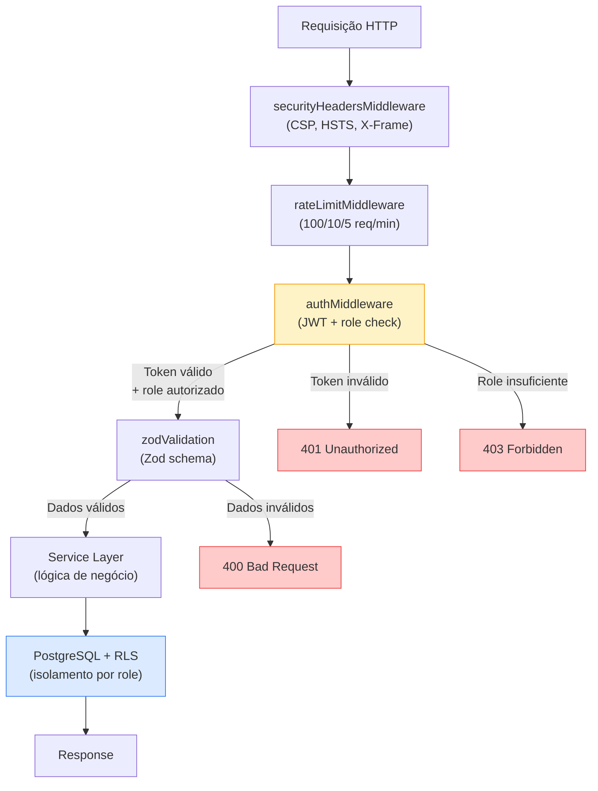
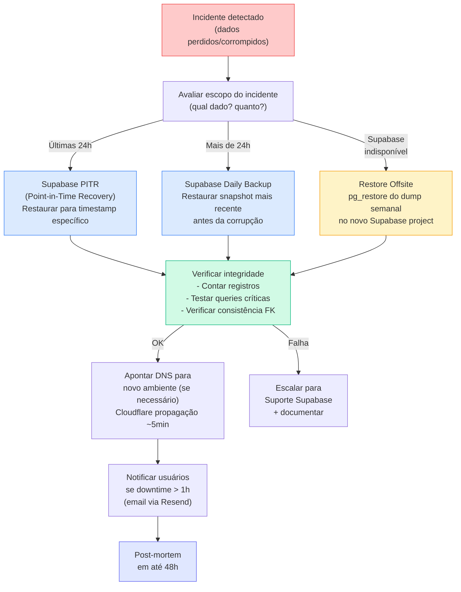

# 4.3 Política de Segurança

**Versão:** 1.0 | **Data:** 06/04/2026 | **Autor:** Claude Opus 4.6
**Status:** Rascunho
**Dependências:** REFERENCIA_CONSOLIDADA, 1.5, 3.1, 3.2, 3.3, 3.4
**Público:** Dev (implementação) + Investidores (conformidade)

---

## Resumo Executivo

Este documento transforma os 15 requisitos não-funcionais de segurança (RNF-04.01 a 04.11) e backup (RNF-11.01 a 11.04) em **políticas implementáveis** para o GiroB2B. É o documento que o CTO usa para configurar a segurança do sistema e que investidores/aceleradoras exigem para due diligence.

| Aspecto | Decisão |
|---------|---------|
| Dados mais sensíveis | Chaves API, secrets Stripe, `SUPABASE_SERVICE_ROLE_KEY` |
| Auth provider | Supabase Auth (bcrypt cost ≥10, JWT 24h, refresh 7d) |
| Autorização | RBAC 2 camadas: middleware Next.js + RLS PostgreSQL |
| Criptografia trânsito | TLS 1.2+ via Cloudflare + Vercel (SSL Labs ≥ A) |
| Criptografia repouso | Supabase (AES-256), Cloudflare R2 (encryption at rest) |
| Pagamentos | Stripe PCI DSS Level 1 — zero dados de cartão no servidor |
| Anti-DDoS | Cloudflare CDN + WAF (free tier) |
| Anti-bot | Cloudflare Turnstile (invisible CAPTCHA) |
| Backup | Diário + PITR (Supabase Pro), regra 3-2-1, RPO 24h/1h, RTO 4h |
| Secrets | 28 env vars em Vercel (encrypted) + GitHub Secrets (CI) |
| Monitoramento | Sentry (erros) + Better Stack (uptime) + PostHog (comportamento) |
| Compliance | LGPD (→ artefato 4.4), PCI DSS (→ Stripe), CPF nunca coletado |
| Postura | Startup pragmática — 8 camadas de defesa, implementáveis com 1-3 devs |

**Tom deste documento:** Pragmático. A GiroB2B é uma startup early-stage com 3 founders. As políticas aqui são implementáveis agora, com roadmap claro para escalar quando necessário.

---

## Seção 1 — Escopo e Classificação de Dados

### 1.1 Escopo

Esta política cobre todos os dados processados, armazenados ou transmitidos pelo GiroB2B:

- **Plataforma web:** girob2b.com.br (Next.js 16.2 / Vercel)
- **Banco de dados:** PostgreSQL 15+ (Supabase)
- **Object storage:** Cloudflare R2 (imagens de produtos, logos)
- **Pagamentos:** Stripe (processamento delegado — PCI DSS Level 1)
- **Comunicação:** Resend (email transacional)
- **Observabilidade:** Sentry, PostHog, Better Stack

**Fora do escopo:** Dados pessoais de funcionários (não há CLT no MVP), dados financeiros bancários dos founders (gestão pessoal).

### 1.2 Classificação de dados

| Nível | Classificação | Exemplos | Proteção | Acesso |
|-------|---------------|----------|----------|--------|
| 1 | **Público** | Nome da empresa, produtos, descrições, categorias, cidade/estado | Baixo — visível para qualquer visitante | Qualquer pessoa (SEO indexável) |
| 2 | **Interno** | Email, telefone, CNPJ do supplier, dados de perfil | Médio — visível apenas para usuários autenticados com permissão | Roles autorizados + RLS |
| 3 | **Confidencial** | Senhas (hash bcrypt), tokens JWT, dados de inquiries, leads, métricas de uso | Alto — criptografia em repouso e trânsito | Server-side only + logs restritos |
| 4 | **Restrito** | Chaves API (`SUPABASE_SERVICE_ROLE_KEY`, `STRIPE_SECRET_KEY`), `DATABASE_URL`, webhook secrets | Crítico — nunca em código, logs ou transmissão não-criptografada | Apenas founders + CI/CD |

### 1.3 Dados que o GiroB2B NÃO coleta

| Dado | Motivo | Referência |
|------|--------|------------|
| **CPF** | Decisão explícita — dado sensível (LGPD), sem valor de negócio para marketplace B2B | REFERENCIA §17 #14, RN-01.13 |
| **Dados de cartão de crédito** | Delegado integralmente ao Stripe (PCI DSS Level 1) | INT-10 |
| **Dados bancários** | Stripe gerencia repasses — GiroB2B nunca vê conta bancária do supplier | INT-10 |
| **Biometria** | Não aplicável ao modelo de negócio | — |
| **Geolocalização precisa** | Apenas cidade/estado do supplier (dado público) | RN-01.05 |

### 1.4 CNPJ — tratamento especial

- **CNPJ do supplier:** obrigatório no upgrade para Nível 3. Validado via BrasilAPI (INT-15). Armazenado como dado **Interno** (nível 2).
- **CNPJ do buyer:** opcional — selo de verificação. Armazenado como dado **Interno** (nível 2) se fornecido.
- **Validação:** formato + dígitos verificadores + consulta API externa (SEQ-15). Revalidação automática a cada 90 dias.

---

## Seção 2 — Autenticação

### 2.1 Provedor e método

| Aspecto | Política | RNF |
|---------|----------|-----|
| **Provedor** | Supabase Auth (INT-01) | — |
| **Método MVP** | Email + senha | — |
| **Método futuro** | Social login (Google OAuth2) — fase Validação | — |
| **Hashing** | bcrypt com cost factor ≥ 10 (Supabase default) ou Argon2id | RNF-04.01 |
| **Senhas em plaintext** | **Proibido** em qualquer camada (logs, banco, transmissão, código) | RNF-04.01 |

### 2.2 Política de senhas

| Requisito | Valor | Justificativa |
|-----------|-------|---------------|
| Comprimento mínimo | 8 caracteres | NIST SP 800-63B (2024) |
| Complexidade | Pelo menos 1 letra + 1 número | Equilíbrio UX vs segurança |
| Comprimento máximo | 128 caracteres | Prevenir DoS via hash de senhas longas |
| Senhas comuns | Bloquear top 10.000 senhas (lista HIBP) | OWASP recommendation |
| Reutilização | Não verificar histórico no MVP | Complexidade desproporcional para early-stage |

**Implementação:** Validação via `createUserSchema` (Zod) no server-side (3.4 DC-05). Supabase Auth aplica hashing automaticamente.

### 2.3 Sessões e tokens

| Token | Duração | Storage | Invalidação | RNF |
|-------|---------|---------|-------------|-----|
| **Access token (JWT)** | 24 horas | httpOnly cookie (SameSite=Lax) | Logout explícito | RNF-04.02 |
| **Refresh token** | 7 dias | httpOnly cookie (SameSite=Lax) | Logout, rotação automática | RNF-04.02 |

**Fluxo de refresh:** Quando o access token expira, o client envia o refresh token para obter novo par (access + refresh). Se o refresh token estiver expirado → redirect para login. Ver SEQ-02 para diagrama completo.

### 2.4 Verificação de email

| Etapa | Prazo | Ação | Referência |
|-------|-------|------|------------|
| Envio do link de confirmação | Imediato (via Resend) | Email com token único | SEQ-01 |
| Prazo para confirmar | 48 horas | Conta funcional mas com banner de alerta | RN-01.03 |
| Lembrete se não confirmar | 24 horas após cadastro | Email de lembrete | RN-01.03 |
| Auto-remoção se não confirmar | 7 dias | Conta e dados removidos automaticamente | RN-01.03 |

### 2.5 Recuperação de senha

1. Usuário solicita reset via email
2. Supabase Auth envia link com token único (expiração: 1 hora)
3. Usuário define nova senha (mesmas regras da §2.2)
4. Todos os tokens de sessão anteriores são invalidados
5. Email de confirmação de mudança enviado

**Rate limiting:** 3 solicitações de reset por hora por email (RNF-04.07).

### 2.6 Proteção contra brute force

| Tentativas falhas | Ação | Duração | RNF |
|-------------------|------|---------|-----|
| 5 consecutivas | Delay de 30 segundos entre tentativas | Até acerto ou timeout | RNF-04.04 |
| 10 consecutivas | Bloqueio temporário da conta | 15 minutos | RNF-04.04 |
| 10 consecutivas | Notificação por email ao titular | Imediata | RNF-04.04 |
| 20+ consecutivas | Bloqueio IP via Cloudflare WAF | 1 hora | RNF-04.07, RNF-04.10 |

**Mensagem de erro genérica:** "Email ou senha incorretos" — nunca revelar se o email existe (prevenção de enumeração de usuários, RNF-04.05).

---

## Seção 3 — Autorização e Controle de Acesso

### 3.1 Modelo: cadastro unificado 3 níveis

O GiroB2B usa cadastro unificado progressivo (REFERENCIA §6):

| Nível | Role | Como ativa | Capacidades |
|-------|------|------------|-------------|
| 1 | **user** | Cadastro básico (email + senha + nome + telefone + cidade/estado) | Navegar, buscar, ver perfis públicos |
| 2 | **buyer** | Ativação de comprador (aceitar termos) | Nível 1 + enviar inquiries, ver contatos desbloqueados |
| 3 | **supplier** | Upgrade com CNPJ + dados empresa | Nível 2 + listar produtos, receber inquiries, dashboard |
| — | **admin** | Atribuição manual (founders) | Tudo + moderação + relatórios + gestão de usuários |
| — | **dual** | Derivado em runtime | Supplier que também é buyer (mesmo login, 2 dashboards) |

### 3.2 Implementação: RBAC em 2 camadas (ADR-04)

**Camada 1 — Middleware Next.js:** Verifica JWT e role antes de processar a requisição. Bloqueia acesso a rotas protegidas.

**Camada 2 — RLS PostgreSQL (Supabase):** Políticas de Row Level Security no banco de dados. Mesmo se a API tiver bug, o banco garante isolamento de dados.

### 3.3 Tabela de permissões por role × recurso

| Recurso | user | buyer | supplier | admin |
|---------|------|-------|----------|-------|
| **Perfis públicos (suppliers)** | R | R | R | CRUD |
| **Produtos (catálogo)** | R | R | CRUD (próprios) | CRUD |
| **Inquiries — enviar** | ✗ | C | ✗ | C |
| **Inquiries — receber/responder** | ✗ | ✗ | R/U (próprias) | R/U |
| **Leads (contatos desbloqueados)** | ✗ | R (próprios) | R (próprios) | R |
| **Dashboard supplier** | ✗ | ✗ | R (próprio) | R (todos) |
| **Dashboard buyer** | ✗ | R (próprio) | ✗ | R (todos) |
| **Planos/assinaturas** | ✗ | ✗ | CRUD (próprio) | CRUD |
| **Créditos (compra avulsa)** | ✗ | C/R (próprios) | ✗ | CRUD |
| **Categorias** | R | R | R | CRUD |
| **Moderação/reports** | C | C | C | CRUD |
| **Configurações do sistema** | ✗ | ✗ | ✗ | CRUD |
| **Usuários** | R (próprio) | R (próprio) | R (próprio) | CRUD |
| **Logs de auditoria** | ✗ | ✗ | ✗ | R |

**Legenda:** C = Create, R = Read, U = Update, D = Delete, ✗ = sem acesso

### 3.4 Dados mascarados (modelo freemium)

Antes do desbloqueio via crédito ou plano pago:
- **Buyer vê:** Nome da empresa, cidade/estado, categorias, produtos
- **Buyer NÃO vê:** Email, telefone, CNPJ, endereço completo
- **Após desbloqueio:** Dados de contato revelados para aquele buyer (SEQ-08)

**Implementação:** RLS policy + campo `is_contact_unlocked` na tabela de leads. Server-side rendering nunca inclui dados mascarados no HTML (previne scraping).

### 3.5 Admin — acesso e auditoria

| Política | Detalhe |
|----------|---------|
| Quem é admin | Apenas founders (3 pessoas), atribuição manual no banco |
| Acesso | Todas as funcionalidades + moderação + relatórios |
| Auditoria | Toda ação admin logada com `user_id`, `action`, `target`, `timestamp` |
| Logs | Armazenados em tabela `admin_audit_logs` com retenção de 1 ano |
| 2FA | Obrigatório para acesso admin (ver §11) |

---

## Seção 4 — Proteção de Dados em Trânsito e em Repouso

### 4.1 Dados em trânsito

| Camada | Proteção | Implementação | RNF |
|--------|----------|---------------|-----|
| **Cliente ↔ Edge** | HTTPS obrigatório (TLS 1.2+) | Cloudflare SSL (free), HTTP→HTTPS redirect automático | RNF-04.08 |
| **Edge ↔ Vercel** | HTTPS | Vercel managed SSL | RNF-04.08 |
| **Vercel ↔ Supabase** | HTTPS + connection pooler | Supabase managed SSL (connection string com `sslmode=require`) | RNF-04.08 |
| **Vercel ↔ Stripe** | HTTPS | Stripe SDK (TLS 1.2 obrigatório) | RNF-04.08 |
| **Vercel ↔ R2** | HTTPS | S3-compatible API com HTTPS | RNF-04.08 |

**Meta:** SSL Labs score ≥ A (RNF-04.08). Verificação mensal.

### 4.2 Dados em repouso

| Componente | Criptografia | Gerenciamento de chaves | Responsável |
|------------|-------------|------------------------|-------------|
| **PostgreSQL (Supabase)** | AES-256 encryption at rest | Supabase managed (AWS KMS) | Supabase |
| **Cloudflare R2** | AES-256 encryption at rest | Cloudflare managed | Cloudflare |
| **Backups Supabase** | Criptografados em repouso | Supabase managed | Supabase |
| **Vercel env vars** | Criptografados em repouso | Vercel managed (AES-256-GCM) | Vercel |
| **GitHub Secrets** | Criptografados (libsodium sealed box) | GitHub managed | GitHub |

### 4.3 Dados de pagamento — PCI DSS

| Aspecto | Política |
|---------|----------|
| **Processamento** | 100% delegado ao Stripe (PCI DSS Level 1 — padrão mais rigoroso) |
| **Dados de cartão** | **Nunca** tocam nosso servidor. Stripe Elements no front-end → tokenização → API Stripe |
| **Webhooks** | Verificação de assinatura obrigatória (`STRIPE_WEBHOOK_SECRET`) |
| **Armazenamento** | Apenas `stripe_customer_id` e `stripe_subscription_id` no nosso banco |
| **Certificação própria** | Não necessária — somos "merchant" que delega ao Stripe |

### 4.4 Cookies e storage no browser

| Cookie/Storage | Tipo | Dados | HttpOnly | Secure | SameSite |
|----------------|------|-------|----------|--------|----------|
| Access token | httpOnly cookie | JWT (sub, role, exp) | ✅ | ✅ | Lax |
| Refresh token | httpOnly cookie | Opaque token | ✅ | ✅ | Lax |
| PostHog | Memory only (cookieless) | Eventos anônimos | N/A | N/A | N/A |
| Preferências UI | localStorage | Tema, filtros salvos | N/A | N/A | N/A |

**PostHog cookieless (ADR-05):** Implementação sem cookies para compliance LGPD desde o dia 1. Dados de analytics em memória apenas, sem persistência no browser.

---

## Seção 5 — Proteção contra Ameaças Comuns

### 5.1 Mapeamento OWASP Top 10 2025 × Proteções

| # | Ameaça OWASP 2025 | Proteção GiroB2B | Implementação | RNF |
|---|-------------------|-----------------|---------------|-----|
| A01 | **Broken Access Control** | RBAC 2 camadas (middleware + RLS) | authMiddleware + PostgreSQL RLS policies | RNF-04.03, RNF-04.05 |
| A02 | **Security Misconfiguration** | Security headers + env vars + staging separado | securityHeadersMiddleware + Vercel config | RNF-04.09, RNF-04.05 |
| A03 | Injection | Queries parametrizadas + Zod validation | ORM/Supabase client + zodValidation | RNF-04.06 |
| A04 | Insecure Design | Modelo de ameaças documentado (este artefato) | Política + code review | RNF-04.05 |
| A05 | **Cryptographic Failures** | TLS 1.2+, bcrypt, AES-256 at rest | Cloudflare + Supabase + Vercel managed | RNF-04.01, RNF-04.08 |
| A06 | Vulnerable Components | Dependabot + npm audit | GitHub Dependabot + CI pipeline | RNF-04.05 |
| A07 | Auth Failures | Rate limiting + brute force protection | rateLimitMiddleware + Cloudflare WAF | RNF-04.04, RNF-04.07 |
| A08 | Data Integrity Failures | Stripe webhook signature verification | `stripe.webhooks.constructEvent()` | — |
| A09 | Logging Failures | Sentry + audit logs | errorHandler + admin_audit_logs | RNF-09.02 |
| A10 | **SSRF** | Allowlist de URLs externas | Validação de URLs em inputs de imagem | RNF-04.05 |

### 5.2 Proteções específicas

| Ameaça | Proteção | Implementação | RNF |
|--------|----------|---------------|-----|
| **SQL Injection** | Queries parametrizadas | ORM (Prisma/Drizzle) + Supabase client (nunca string concatenation) | RNF-04.06 |
| **XSS** | CSP + sanitização + escape automático | Content-Security-Policy header + React auto-escape + DOMPurify para campos rich text | RNF-04.06, RNF-04.09 |
| **CSRF** | SameSite cookies + verificação de origin | Cookies com `SameSite=Lax` + verificação de `Origin` header em mutations | RNF-04.06 |
| **Brute force** | Rate limiting progressivo | 5 falhas → 30s delay, 10 → 15min block (RNF-04.04) + Cloudflare WAF | RNF-04.04, RNF-04.07 |
| **DDoS** | CDN + WAF | Cloudflare (free tier) com modo "Under Attack" disponível | RNF-04.10 |
| **Bot/spam** | Invisible CAPTCHA | Cloudflare Turnstile (INT-07) em cadastro, inquiry, reset de senha | RNF-04.09 |
| **Upload malicioso** | Validação rigorosa | Tipo MIME whitelist (image/jpeg, image/png, image/webp), tamanho máx 5MB, sem execução server-side | RNF-04.10 |
| **Enumeração de usuários** | Mensagens genéricas | Login: "Email ou senha incorretos". Register: "Se este email existir, enviamos um link". | RNF-04.05 |
| **Clickjacking** | X-Frame-Options | `X-Frame-Options: DENY` | RNF-04.09 |
| **MIME sniffing** | X-Content-Type-Options | `X-Content-Type-Options: nosniff` | RNF-04.09 |

### 5.3 Security headers obrigatórios (RNF-04.09)

| Header | Valor | Propósito |
|--------|-------|-----------|
| `Content-Security-Policy` | `default-src 'self'; script-src 'self' 'unsafe-inline'; style-src 'self' 'unsafe-inline'; img-src 'self' https://*.r2.dev data:; connect-src 'self' https://*.supabase.co https://*.posthog.com https://*.sentry.io;` | Prevenir XSS e injeção de recursos |
| `X-Content-Type-Options` | `nosniff` | Prevenir MIME sniffing |
| `X-Frame-Options` | `DENY` | Prevenir clickjacking |
| `Strict-Transport-Security` | `max-age=31536000; includeSubDomains` | Forçar HTTPS por 1 ano |
| `Referrer-Policy` | `strict-origin-when-cross-origin` | Limitar informações de referrer |
| `Permissions-Policy` | `camera=(), microphone=(), geolocation=()` | Desabilitar APIs desnecessárias |

**Meta:** securityheaders.com nota ≥ A (RNF-04.09). Verificação mensal.

**Implementação:** `securityHeadersMiddleware` em `lib/middleware/securityHeaders.ts` (3.4 §14.5), aplicado via `next.config.ts` headers ou middleware Next.js.

---

## Seção 6 — Segurança de APIs

### 6.1 Validação de entrada (RNF-04.06)

| Política | Detalhe | Referência |
|----------|---------|------------|
| **Server-side obrigatório** | Zod schema em toda API route — nunca confiar no client | 3.4 DC-05 |
| **Client-side complementar** | Mesmo Zod schema para UX (feedback imediato), mas não como camada de segurança | 3.4 DC-05 |
| **25 schemas Zod** | Inventário completo em `lib/validation/` | 3.4 §14.4 |
| **Erro de validação** | 400 Bad Request com detalhes Zod (`.error.flatten()`) | 3.4 DC-05 |

### 6.2 Rate limiting por endpoint (RNF-04.07)

| Tier | Limite | Endpoints | Implementação |
|------|--------|-----------|---------------|
| **Navegação** | 100 req/min/IP | GET páginas, GET APIs | rateLimitMiddleware |
| **Formulários** | 10 req/min/IP | POST cadastro, POST inquiry, POST contato | rateLimitMiddleware |
| **Login** | 5 req/min/IP | POST /api/auth/login | rateLimitMiddleware |
| **Reset de senha** | 3 req/h/email | POST /api/auth/reset | rateLimitMiddleware |
| **Upload** | 5 req/min/user | POST /api/uploads | rateLimitMiddleware |

**Resposta quando excedido:** 429 Too Many Requests com header `Retry-After`.

### 6.3 Autenticação de API

| Aspecto | Política |
|---------|----------|
| **Método** | JWT Bearer token em header `Authorization: Bearer <token>` |
| **Rotas públicas** | Páginas SEO, catálogo, busca — sem auth necessário |
| **Rotas protegidas** | Dashboard, APIs de mutation — auth obrigatório |
| **Rotas admin** | Moderação, configurações — auth + role admin obrigatório |

### 6.4 CORS (Cross-Origin Resource Sharing)

| Política | Valor |
|----------|-------|
| **Allowed origins** | `https://girob2b.com.br`, `https://www.girob2b.com.br`, staging URLs (Vercel preview) |
| **Allowed methods** | GET, POST, PUT, PATCH, DELETE |
| **Allowed headers** | Authorization, Content-Type |
| **Credentials** | true (para enviar cookies httpOnly) |
| **Max-age** | 86400 (24h cache de preflight) |

**Política restritiva:** Apenas domínios próprios. Nunca wildcard (`*`) em produção.

### 6.5 Logs de acesso

| O que é logado | Onde | Retenção |
|----------------|------|----------|
| Erros de aplicação (500) | Sentry (INT-11) | 90 dias (free tier) |
| Erros de auth (401/403) | Sentry + `auth_error_logs` | 90 dias |
| Ações admin | `admin_audit_logs` (PostgreSQL) | 1 ano |
| Eventos de comportamento | PostHog (INT-12, cookieless) | 1 ano (free tier) |
| Uptime/disponibilidade | Better Stack (INT-13) | 180 dias |

**O que NÃO é logado:** Senhas, tokens JWT completos, dados de cartão, corpos de request com dados sensíveis. Mascaramento automático em logs (`password: ***`, `token: ***`).

### 6.6 Versionamento de API

**Decisão MVP:** Sem versionamento de API (3.4 decisão). URL pattern: `/api/resource`. Quando necessário versionar (breaking changes em produção com clientes ativos), usar header `Accept-Version` ou path `/api/v2/resource`.

---

## Seção 7 — Gestão de Secrets e Variáveis de Ambiente

### 7.1 Inventário completo — 28 env vars (conforme 3.3)

#### Categoria A — Supabase (BaaS)

| # | Variável | Serviço | Client? | Sensível? | Fase |
|---|----------|---------|---------|-----------|------|
| 1 | `NEXT_PUBLIC_SUPABASE_URL` | Supabase | ✅ | Não | MVP |
| 2 | `NEXT_PUBLIC_SUPABASE_ANON_KEY` | Supabase | ✅ | Não ¹ | MVP |
| 3 | `SUPABASE_SERVICE_ROLE_KEY` | Supabase | ❌ | **SIM** ² | MVP |
| 4 | `DATABASE_URL` | PostgreSQL | ❌ | **SIM** | MVP |

¹ Anon Key é público por design — RLS protege os dados.
² Service Role Key **bypassa RLS** — nunca expor ao client. Uso restrito a server-side admin/cron.

#### Categoria B — Cloudflare (Edge)

| # | Variável | Serviço | Client? | Sensível? | Fase |
|---|----------|---------|---------|-----------|------|
| 5 | `R2_ACCOUNT_ID` | R2 | ❌ | Não | MVP |
| 6 | `R2_ACCESS_KEY_ID` | R2 | ❌ | **SIM** | MVP |
| 7 | `R2_SECRET_ACCESS_KEY` | R2 | ❌ | **SIM** | MVP |
| 8 | `R2_BUCKET_NAME` | R2 | ❌ | Não | MVP |
| 9 | `R2_PUBLIC_URL` | R2 | ✅ | Não | MVP |
| 10 | `NEXT_PUBLIC_TURNSTILE_SITE_KEY` | Turnstile | ✅ | Não | MVP |
| 11 | `TURNSTILE_SECRET_KEY` | Turnstile | ❌ | **SIM** | MVP |
| 23 | `CLOUDFLARE_API_TOKEN` | CDN | ❌ | **SIM** | Opcional |
| 24 | `CLOUDFLARE_ZONE_ID` | CDN | ❌ | Não | Opcional |

#### Categoria C — Comunicação

| # | Variável | Serviço | Client? | Sensível? | Fase |
|---|----------|---------|---------|-----------|------|
| 12 | `RESEND_API_KEY` | Resend | ❌ | **SIM** | MVP |
| 13 | `RESEND_FROM_EMAIL` | Resend | ❌ | Não | MVP |

#### Categoria D — Pagamento

| # | Variável | Serviço | Client? | Sensível? | Fase |
|---|----------|---------|---------|-----------|------|
| 14 | `NEXT_PUBLIC_STRIPE_PUBLISHABLE_KEY` | Stripe | ✅ | Não | [MON] |
| 15 | `STRIPE_SECRET_KEY` | Stripe | ❌ | **SIM** | [MON] |
| 16 | `STRIPE_WEBHOOK_SECRET` | Stripe | ❌ | **SIM** | [MON] |

#### Categoria E — Observabilidade

| # | Variável | Serviço | Client? | Sensível? | Fase |
|---|----------|---------|---------|-----------|------|
| 17 | `SENTRY_DSN` | Sentry | ✅ | Não | MVP |
| 18 | `SENTRY_AUTH_TOKEN` | Sentry | ❌ | **SIM** | MVP (CI) |
| 19 | `SENTRY_ORG` | Sentry | ❌ | Não | MVP (CI) |
| 20 | `SENTRY_PROJECT` | Sentry | ❌ | Não | MVP (CI) |
| 21 | `NEXT_PUBLIC_POSTHOG_KEY` | PostHog | ✅ | Não | MVP |
| 22 | `NEXT_PUBLIC_POSTHOG_HOST` | PostHog | ✅ | Não | MVP |

#### Categoria F — APIs de Dados + Config

| # | Variável | Serviço | Client? | Sensível? | Fase |
|---|----------|---------|---------|-----------|------|
| 25 | `CNPJ_API_URL` | BrasilAPI | ❌ | Não | MVP |
| 26 | `RECEITAWS_API_KEY` | ReceitaWS | ❌ | **SIM** | Opcional |
| 27 | `NEXT_PUBLIC_APP_URL` | Config | ✅ | Não | MVP |
| 28 | `NODE_ENV` | Node.js | ❌ | Não | MVP |

### 7.2 Resumo de classificação

| Tipo | Quantidade | Regra |
|------|-----------|-------|
| **Sensíveis (server-only)** | 11 | Nunca no client, nunca em logs, nunca no código |
| **Públicas (client-safe)** | 9 | Prefixo `NEXT_PUBLIC_`, seguras para expor |
| **CI-only** | 4 | Apenas em GitHub Secrets para pipeline |
| **Opcionais** | 4 | Não obrigatórias para operação |

### 7.3 Política de rotação de secrets

| Secret | Frequência de rotação | Procedimento |
|--------|-----------------------|-------------|
| `SUPABASE_SERVICE_ROLE_KEY` | A cada 6 meses ou se comprometido | Regenerar no dashboard Supabase → atualizar Vercel |
| `STRIPE_SECRET_KEY` | A cada 6 meses | Stripe Dashboard → Rolling keys (zero downtime) |
| `STRIPE_WEBHOOK_SECRET` | A cada 6 meses | Stripe Dashboard → novo endpoint → atualizar Vercel |
| `R2_SECRET_ACCESS_KEY` | A cada 6 meses | Cloudflare Dashboard → nova key → atualizar Vercel |
| `RESEND_API_KEY` | A cada 6 meses | Resend Dashboard → nova key → atualizar Vercel |
| `DATABASE_URL` | Quando comprometido | Supabase Dashboard → resetar senha do pool |
| Demais secrets | Quando comprometido | Dashboard do provedor → regenerar → atualizar Vercel + GitHub |

### 7.4 Plataformas de armazenamento

| Ambiente | Plataforma | Acesso |
|----------|-----------|--------|
| **Local** | `.env.local` (gitignored) | Dev individual |
| **Staging** | Vercel Environment Variables (Preview) | Founders |
| **Produção** | Vercel Environment Variables (Production) | Founders |
| **CI/CD** | GitHub Secrets | Founders |

**Regras invioláveis (RNF-04.11):**
1. **NUNCA** secrets no código-fonte — scan com `git-secrets` ou `trufflehog`
2. **NUNCA** secrets em `.env.example` — apenas placeholders (`STRIPE_SECRET_KEY=sk_test_xxx`)
3. **NUNCA** secrets em logs — mascaramento automático
4. **NUNCA** secrets em commits — pre-commit hook para detecção
5. Staging e Production usam secrets **diferentes** (ambientes isolados)

---

## Seção 8 — Backup e Recuperação (Disaster Recovery)

### 8.1 Objetivos de recuperação

| Métrica | Valor | Significado | RNF |
|---------|-------|-------------|-----|
| **RPO (Recovery Point Objective)** | 24h dados gerais / 1h transacionais | Máximo de dados que podem ser perdidos | RNF-11.01 |
| **RTO (Recovery Time Objective)** | 4 horas | Tempo máximo para restaurar o sistema | RNF-11.02 |

### 8.2 Estratégia por componente

| Componente | Backup | Frequência | Retenção | Responsável |
|------------|--------|-----------|----------|-------------|
| **PostgreSQL (Supabase)** | Automático (Supabase Pro) | Diário + PITR | 30 dias | Supabase |
| **PostgreSQL (cópia offsite)** | Export pg_dump → AWS S3 ou Azure Blob | Semanal | 90 dias | Founders (cron manual ou Edge Function) |
| **Cloudflare R2 (imagens)** | Redundância geográfica nativa | Contínua | Indefinida (11 nines de durabilidade) | Cloudflare |
| **R2 (cópia offsite)** | Sync para outro bucket ou AWS S3 | Mensal | 6 meses | Founders |
| **Código-fonte** | Git (GitHub) | Cada push | Indefinida | GitHub |
| **Configurações (env vars)** | Export manual → arquivo criptografado offline | Trimestral | Última versão | Founders |
| **Stripe (dados financeiros)** | Stripe managed | Contínua | Indefinida | Stripe |

### 8.3 Regra 3-2-1 (RNF-11.04)

| Cópia | Localização | Tipo | Fase |
|-------|-------------|------|------|
| **1. Produção** | Supabase (AWS us-east-1) | Banco ativo | MVP |
| **2. Backup automático** | Supabase backup (mesma região) | Snapshot diário + PITR | MVP |
| **3. Offsite** | AWS S3 (via créditos) ou Azure Blob (via créditos) | pg_dump semanal | Validação |

**Nota:** Cópia offsite (#3) é fase Validação (RNF-11.04, prioridade Média). MVP opera com cópias 1 e 2 apenas. US$2.300 em créditos cloud garantidos cobrem o storage offsite.

### 8.4 Procedimento de restore

### 8.5 Teste de restore

| Teste | Frequência | Procedimento | RNF |
|-------|-----------|-------------|-----|
| **Restore de daily backup** | Trimestral | Restaurar backup em Supabase project de teste → verificar integridade | RNF-11.02 |
| **Restore de offsite** | Semestral | pg_restore do dump semanal → verificar dados | RNF-11.04 |
| **Tempo de restore** | Documentar a cada teste | Deve ser ≤ 4 horas | RNF-11.02 |

### 8.6 Imagens e uploads (RNF-11.03)

| Aspecto | Política |
|---------|----------|
| **Storage** | Cloudflare R2 (object storage com redundância geográfica) — nunca filesystem do servidor |
| **CDN** | Servidas via Cloudflare CDN (cache automático) |
| **Durabilidade** | 99.999999999% (11 nines) — R2 SLA |
| **Backup adicional** | Sync mensal para segundo bucket ou AWS S3 (fase Validação) |
| **Validação de upload** | MIME type whitelist, tamanho máx 5MB, renomear com hash (prevenir path traversal) |

---

## Seção 9 — Monitoramento e Resposta a Incidentes

### 9.1 Stack de monitoramento

| Ferramenta | Função | O que monitora | Alertas | INT |
|-----------|--------|----------------|---------|-----|
| **Sentry** | Error tracking | Erros de aplicação (JS errors, API 500s, exceções) | Email imediato para erros novos | INT-11 |
| **Better Stack** | Uptime monitoring | Disponibilidade de endpoints (health check cada 60s) | Email + SMS se down > 1min | INT-13 |
| **PostHog** | Analytics comportamental | Eventos de usuário (sign-up, inquiry, conversion) + anomalias | Dashboard (sem alerta automático no MVP) | INT-12 |
| **Vercel Analytics** | Performance | Core Web Vitals (LCP, FID, CLS) | Dashboard | INT-14 |
| **Cloudflare** | Segurança de rede | Requests, threats blocked, WAF events | Dashboard | INT-05 |
| **Stripe Dashboard** | Pagamentos | Transações, falhas de pagamento, chargebacks | Email | INT-10 |

### 9.2 Configuração de alertas

| Alerta | Threshold | Canal | Ação |
|--------|-----------|-------|------|
| **Site down** | Health check falha 2× consecutivas (2 min) | Email + SMS (Better Stack) | Verificar Vercel status → Cloudflare status → Supabase status |
| **Erro novo em produção** | Primeira ocorrência de exception não vista | Email (Sentry) | Investigar em até 4h úteis |
| **Spike de erros** | >50 erros/hora (5× baseline) | Email (Sentry) | Investigar imediatamente |
| **Auth failures spike** | >100 falhas de login/hora | Sentry custom alert | Verificar se é ataque brute force → ativar Cloudflare "Under Attack" |
| **Pagamento falho** | Qualquer falha de webhook Stripe | Email (Stripe) | Verificar integração em até 1h |
| **Certificado SSL** | 30 dias antes de expirar | Better Stack | Cloudflare renova automaticamente — verificar se falhou |

### 9.3 Plano de resposta a incidentes

**Classificação de severidade:**

| Nível | Descrição | Tempo de resposta | Exemplos |
|-------|-----------|-------------------|----------|
| **P0 — Crítico** | Sistema inacessível ou dados comprometidos | 30 minutos | Site down, breach de dados, Supabase offline |
| **P1 — Alto** | Funcionalidade core degradada | 2 horas | Login não funciona, pagamentos falhando, uploads quebrados |
| **P2 — Médio** | Funcionalidade secundária impactada | 8 horas | Emails não chegando, analytics parado, busca lenta |
| **P3 — Baixo** | Impacto cosmético ou edge case | 24 horas | Erro visual, bug em fluxo raro, degradação menor de performance |

**Procedimento para P0/P1:**

| Passo | Ação | Responsável | Tempo |
|-------|------|-------------|-------|
| 1 | **Detectar** — Alerta automático (Better Stack/Sentry) ou report de usuário | Automático / Qualquer founder | 0-5 min |
| 2 | **Comunicar** — Notificar todos os founders via WhatsApp (grupo dedicado) | Quem detectou | 5 min |
| 3 | **Diagnosticar** — Verificar dashboards (Vercel, Supabase, Cloudflare, Sentry) | CTO (Vitor) ou dev disponível | 15-30 min |
| 4 | **Mitigar** — Ação imediata (rollback deploy, ativar modo "Under Attack", restaurar backup) | CTO | 30 min - 2h |
| 5 | **Resolver** — Fix definitivo (hotfix, patch, reconfiguração) | CTO + dev | 2-24h |
| 6 | **Comunicar resolução** — Notificar usuários afetados (se impacto > 1h) | CEO (Gustavo) via Resend | Após resolução |
| 7 | **Post-mortem** — Documento com root cause, timeline, ações preventivas | CTO | Em até 48h |

### 9.4 Comunicação de incidentes

| Audiência | Quando comunicar | Canal | Template |
|-----------|-----------------|-------|----------|
| **Founders (interno)** | Qualquer P0/P1 | WhatsApp (grupo) | "🔴 P0: [descrição]. Status: [investigando/mitigando/resolvido]" |
| **Usuários afetados** | Se downtime > 1h ou dados afetados | Email (Resend) | "Informamos que houve uma indisponibilidade... [status, ETA, ações tomadas]" |
| **ANPD** | Se breach envolver dados pessoais de usuários brasileiros | Formulário oficial ANPD | Conforme art. 48 da LGPD — em até 2 dias úteis |
| **Stripe** | Se suspeita de fraude ou comprometimento de dados de pagamento | Suporte Stripe | Conforme PCI DSS incident response |

### 9.5 Post-mortem

Todo incidente P0 e P1 gera documento de post-mortem com:

1. **Timeline** — hora a hora do incidente
2. **Root cause** — causa raiz técnica
3. **Impacto** — quantos usuários afetados, quanto tempo, dados perdidos
4. **O que funcionou** — detecção, comunicação, mitigação
5. **O que falhou** — gaps no monitoramento, processo, ferramentas
6. **Ações preventivas** — tarefas específicas com responsável e prazo

Armazenamento: repositório Git em `/docs/postmortems/YYYY-MM-DD-descricao.md`.

---

## Seção 10 — Segurança no Ciclo de Desenvolvimento (DevSecOps)

### 10.1 Pipeline CI/CD seguro

| Etapa | Ferramenta | O que verifica | Bloqueia deploy? |
|-------|-----------|----------------|------------------|
| 1. **Lint** | ESLint | Código style + regras de segurança (no-eval, no-implied-eval) | ✅ Sim |
| 2. **Type check** | TypeScript (`tsc --noEmit`) | Erros de tipo (type safety = segurança) | ✅ Sim |
| 3. **Testes** | Vitest | Lógica de negócio + testes de auth/authz | ✅ Sim |
| 4. **Build** | Next.js (`next build`) | Compilação sem erros | ✅ Sim |
| 5. **Dependências** | npm audit + Dependabot | Vulnerabilidades em pacotes | ⚠️ Warning (não bloqueia no MVP, bloqueia com severity critical) |

**Pipeline:** `git push` → GitHub Actions → lint → types → test → build → Vercel Preview URL → PR review → merge → deploy.

### 10.2 Code review

| Política | Detalhe |
|----------|---------|
| **Obrigatório?** | Sim, para todo merge em `develop` e `main` (3.4 §10.5) |
| **Quem revisa?** | Outro founder ou CI automatizado (no MVP com 1 dev, CI é o "revisor") |
| **Checklist** | Lógica no service? ServiceResult<T>? Zod valida? RLS cobre? Testes? Sem dados sensíveis em logs? |
| **Merge strategy** | Squash merge (histórico limpo, 1 commit por PR) |

### 10.3 Gestão de dependências

| Aspecto | Política |
|---------|----------|
| **Scan automático** | GitHub Dependabot habilitado — PRs automáticos para updates de segurança |
| **npm audit** | Executado no CI (`npm audit --audit-level=critical`) |
| **Frequência de update** | Dependências de segurança: imediato. Outras: mensal ou ao iniciar feature |
| **Lock file** | `package-lock.json` commitado — builds reproduzíveis |

### 10.4 Detecção de secrets no código (RNF-04.11)

| Ferramenta | Quando executa | O que detecta |
|-----------|----------------|---------------|
| **Pre-commit hook** | Antes de cada commit local | Patterns de API keys, tokens, passwords em arquivos staged |
| **git-secrets** ou **trufflehog** | No CI (GitHub Actions) | Scan do repositório inteiro por secrets |
| **.gitignore** | Sempre | `.env.local`, `.env.production`, `.env.*` (exceto `.env.example`) |

### 10.5 Ambientes isolados (RNF-10.04)

| Ambiente | Front-end | Banco | Env vars | Dados |
|----------|-----------|-------|----------|-------|
| **Local** | `next dev` (Turbopack) | Supabase local (Docker) | `.env.local` | Seed fictício |
| **Staging** | Vercel Preview (`develop`) | Supabase Free (projeto separado) | Vercel Preview vars | Seed fictício |
| **Produção** | Vercel Production (`main`) | Supabase Pro (projeto principal) | Vercel Production vars | Dados reais |

**Regra:** Dados de produção **NUNCA** vão para dev/staging. Seeds com dados fictícios gerados por script.

---

## Seção 11 — Políticas de Acesso Humano

### 11.1 Acesso atual (MVP — 3 founders)

| Pessoa | Role | Acessos | 2FA |
|--------|------|---------|-----|
| **Gustavo** (CEO) | Admin plataforma + negócios | GitHub (owner), Vercel (owner), Stripe (owner), Cloudflare (owner) | Obrigatório |
| **Vitor** (CTO) | Admin técnico + dev | GitHub (owner), Vercel (admin), Supabase (owner), Sentry (owner), todos os dashboards técnicos | Obrigatório |
| **Founder 3** | Admin operações | GitHub (contributor), Vercel (viewer), Supabase (viewer), dashboards de analytics | Obrigatório |

### 11.2 Princípios de acesso

| Princípio | Política |
|-----------|----------|
| **Menor privilégio** | Cada pessoa só tem o acesso que precisa para sua função |
| **2FA obrigatório** | Para todos com acesso a produção (GitHub, Vercel, Supabase, Cloudflare, Stripe) |
| **Senhas únicas** | Cada serviço com senha diferente (password manager recomendado: 1Password ou Bitwarden) |
| **Sem compartilhamento** | Credenciais pessoais nunca compartilhadas — cada um tem seu login |
| **Revisão trimestral** | Revisar acessos a cada 3 meses — remover acessos desnecessários |

### 11.3 Futuros desenvolvedores

| Aspecto | Política |
|---------|----------|
| **Onboarding** | Criar contas individuais em cada serviço (nunca compartilhar logins de founders) |
| **Acesso ao código** | GitHub com branch protection — PR obrigatório para `develop` e `main` |
| **Acesso ao banco** | Supabase com role limitado — nunca `service_role_key` para devs |
| **Acesso a produção** | Leitura de logs (Sentry, Vercel) — nunca acesso direto ao banco de produção |
| **Acesso a secrets** | Nunca. Devs usam `.env.local` com secrets de desenvolvimento |

### 11.4 Offboarding — quando alguém sai

| Passo | Ação | Prazo | Responsável |
|-------|------|-------|-------------|
| 1 | Revogar acesso a **todos** os serviços (GitHub, Vercel, Supabase, Cloudflare, Stripe, Sentry, PostHog) | Imediato (mesmo dia) | CTO |
| 2 | Rotacionar **todos** os secrets que a pessoa teve acesso | Em até 24 horas | CTO |
| 3 | Verificar sessions ativas e invalidar | Imediato | CTO |
| 4 | Remover do grupo WhatsApp de incidentes | Imediato | CEO |
| 5 | Documentar o offboarding | Em até 48 horas | CTO |

---

## Seção 12 — Compliance e Certificações

### 12.1 LGPD (Lei Geral de Proteção de Dados)

| Aspecto | Status | Detalhes |
|---------|--------|----------|
| **Artefato dedicado** | → 4.4 (Compliance LGPD) | Documento completo com DPO, bases legais, direitos do titular |
| **CPF** | ✅ Nunca coletado | REFERENCIA §17 #14 — decisão explícita |
| **Consentimento** | ✅ Termos de uso no cadastro | Aceite obrigatório (checkbox) |
| **Cookies** | ✅ Cookieless analytics (PostHog ADR-05) | Sem banner de cookies necessário |
| **Direitos do titular** | ⏳ Implementar em 4.4 | Acesso, correção, exclusão, portabilidade |
| **Notificação ANPD** | Processo definido (§9.4) | Em até 2 dias úteis após breach com dados pessoais |
| **Encarregado (DPO)** | ⏳ Definir em 4.4 | Provavelmente CEO ou advogado externo |

### 12.2 PCI DSS (Payment Card Industry)

| Aspecto | Status |
|---------|--------|
| **Nível** | Não aplicável diretamente — GiroB2B é "merchant" que delega ao Stripe |
| **Stripe** | PCI DSS Level 1 (padrão mais rigoroso, auditoria anual) |
| **Dados de cartão no nosso servidor** | **Zero** — Stripe Elements tokeniza no front-end |
| **O que armazenamos** | Apenas `stripe_customer_id` e `stripe_subscription_id` |
| **SAQ (Self-Assessment Questionnaire)** | SAQ A — menor escopo possível (redirect/iframe) |
| **Certificação própria** | Não necessária no momento |

### 12.3 SOC 2 / ISO 27001

| Certificação | Status | Roadmap |
|-------------|--------|---------|
| **SOC 2 Type I** | Não aplicável (startup early-stage) | Considerar quando ARR > R$1M e clientes enterprise |
| **SOC 2 Type II** | Não aplicável | Após SOC 2 Type I |
| **ISO 27001** | Não aplicável | Enterprise-grade — 2+ anos no futuro |

**Nossos provedores são certificados:**
- Supabase: SOC 2 Type II
- Stripe: PCI DSS Level 1, SOC 2 Type II
- Cloudflare: SOC 2 Type II, ISO 27001
- Vercel: SOC 2 Type II
- GitHub: SOC 2 Type II

### 12.4 Política de privacidade e termos de uso

| Documento | Status | URL |
|-----------|--------|-----|
| Política de privacidade | ⏳ Redigir (artefato 4.4) | girob2b.com.br/privacidade |
| Termos de uso | ⏳ Redigir (artefato 4.4) | girob2b.com.br/termos |
| Termos de uso para suppliers | ⏳ Redigir | girob2b.com.br/termos-fornecedor |

---

## Seção 13 — Rastreabilidade

### 13.1 Seção × RNFs × Artefatos × Integrações

| Seção | RNFs endereçados | Artefatos-fonte | Integrações |
|-------|-----------------|----------------|-------------|
| 1 — Escopo e Classificação | — | REFERENCIA §17 #14 | — |
| 2 — Autenticação | RNF-04.01, RNF-04.02, RNF-04.04, RNF-04.07 | 1.5, 3.2 (SEQ-01, SEQ-02), 3.4 §14.2 | INT-01 (Supabase Auth) |
| 3 — Autorização | RNF-04.03 | 1.5, 3.1 (Identity, Cross-cutting), 3.4 §14.3, REFERENCIA §6 | INT-01, INT-02 (RLS) |
| 4 — Proteção de Dados | RNF-04.08 | 1.5, 3.3 (todas INTs) | INT-01, INT-02, INT-06 (R2), INT-10 (Stripe) |
| 5 — Ameaças | RNF-04.05, RNF-04.06, RNF-04.09, RNF-04.10 | 1.5, 3.4 §14 (8 camadas), OWASP Top 10 2025 | INT-05 (Cloudflare), INT-07 (Turnstile) |
| 6 — APIs | RNF-04.06, RNF-04.07 | 1.5, 3.4 DC-05 (Zod), 3.4 §14.4 | INT-11 (Sentry), INT-12 (PostHog) |
| 7 — Secrets | RNF-04.11 | 1.5, 3.3 (28 env vars), 3.4 §11.4 | Todas (28 vars em 18 integrações) |
| 8 — Backup | RNF-11.01, RNF-11.02, RNF-11.03, RNF-11.04 | 1.5, 3.3 (INT-02, INT-06) | INT-02 (Supabase), INT-06 (R2) |
| 9 — Monitoramento | RNF-09.02 | 3.3 (INT-11, INT-13), 3.4 §14.8 | INT-11 (Sentry), INT-13 (Better Stack) |
| 10 — DevSecOps | RNF-04.11, RNF-10.04 | 3.4 §10, §11, §14.5 | INT-17 (GitHub Actions) |
| 11 — Acesso Humano | RNF-04.02, RNF-04.03, RNF-04.11 | — | Todos os dashboards |
| 12 — Compliance | RNF-05.01 a 05.08 | REFERENCIA §17 #14 | INT-10 (Stripe), INT-12 (PostHog) |

### 13.2 Cobertura de RNFs

#### Segurança (RNF-04.01 a 04.11) — 11/11 ✅

| RNF | Descrição resumida | Seção(ões) | Status |
|-----|-------------------|-----------|--------|
| RNF-04.01 | Hashing seguro (bcrypt ≥10 / Argon2id) | §2.1, §2.2 | ✅ |
| RNF-04.02 | JWT 24h, refresh 7d, invalidação no logout | §2.3 | ✅ |
| RNF-04.03 | RBAC (fornecedor, comprador, admin) | §3.1, §3.2, §3.3 | ✅ |
| RNF-04.04 | Rate limiting progressivo (5→30s, 10→15min) | §2.6 | ✅ |
| RNF-04.05 | OWASP Top 10 2025 | §5.1, §5.2 | ✅ |
| RNF-04.06 | Input sanitização (SQLi, XSS, CSRF) | §5.2, §6.1 | ✅ |
| RNF-04.07 | Rate limiting endpoints (100/10/5 req/min) | §6.2, §2.5, §2.6 | ✅ |
| RNF-04.08 | HTTPS TLS 1.2+ | §4.1 | ✅ |
| RNF-04.09 | Security headers (CSP, HSTS, X-Frame etc.) | §5.3 | ✅ |
| RNF-04.10 | DDoS via Cloudflare WAF | §5.2 | ✅ |
| RNF-04.11 | Secrets via env vars, nunca no código | §7, §10.4 | ✅ |

#### Backup e Recuperação (RNF-11.01 a 11.04) — 4/4 ✅

| RNF | Descrição resumida | Seção(ões) | Status |
|-----|-------------------|-----------|--------|
| RNF-11.01 | Backup diário, retenção 30d, RPO 24h/1h | §8.1, §8.2 | ✅ |
| RNF-11.02 | RTO 4h, teste trimestral | §8.1, §8.4, §8.5 | ✅ |
| RNF-11.03 | Object storage com redundância (R2) | §8.6 | ✅ |
| RNF-11.04 | Regra 3-2-1 | §8.3 | ✅ |

---

## Fontes

### Requisitos e arquitetura
- 1.5_REQUISITOS_NAO_FUNCIONAIS.md — RNF-04.01 a 04.11, RNF-11.01 a 11.04
- 3.1_DIAGRAMA_DE_COMPONENTES.md — Identity, Cross-cutting
- 3.2_DIAGRAMAS_DE_SEQUENCIA.md — SEQ-01 (cadastro), SEQ-02 (login), SEQ-15 (CNPJ)
- 3.3_MAPA_DE_INTEGRACOES.md — 18 integrações, 28 env vars
- 3.4_PADROES_E_CONVENCOES.md — §14 (Segurança), DC-05 (Zod), §10-11 (CI/CD)
- REFERENCIA_CONSOLIDADA.md — §6, §10, §17, §23, §24, §32

### Padrões e benchmarks
- OWASP Top 10 — 2025 edition (A01–A10)
- NIST SP 800-63B — Digital Identity Guidelines (2024)
- LGPD — Lei 13.709/2018, art. 48 (notificação ANPD)
- PCI DSS v4.0 — Payment Card Industry Data Security Standard
- Stripe — PCI compliance documentation

### Stack
- Supabase — Auth, PostgreSQL, RLS, Edge Functions, backups
- Cloudflare — CDN, WAF, R2, Turnstile
- Vercel — Hosting, environment variables, analytics
- Stripe — Payments (PCI DSS Level 1)
- Sentry — Error tracking
- PostHog — Cookieless analytics (ADR-05)
- Better Stack — Uptime monitoring

---

*Documento gerado como parte da documentação técnica da GiroB2B, Fase 4 — Operacional (artefato 3/5).*
*Próximo artefato: 4.4 — Compliance LGPD.*
