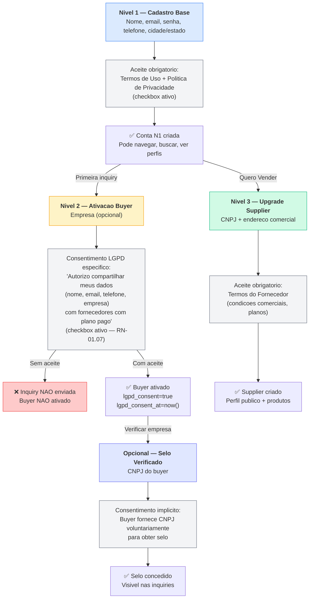
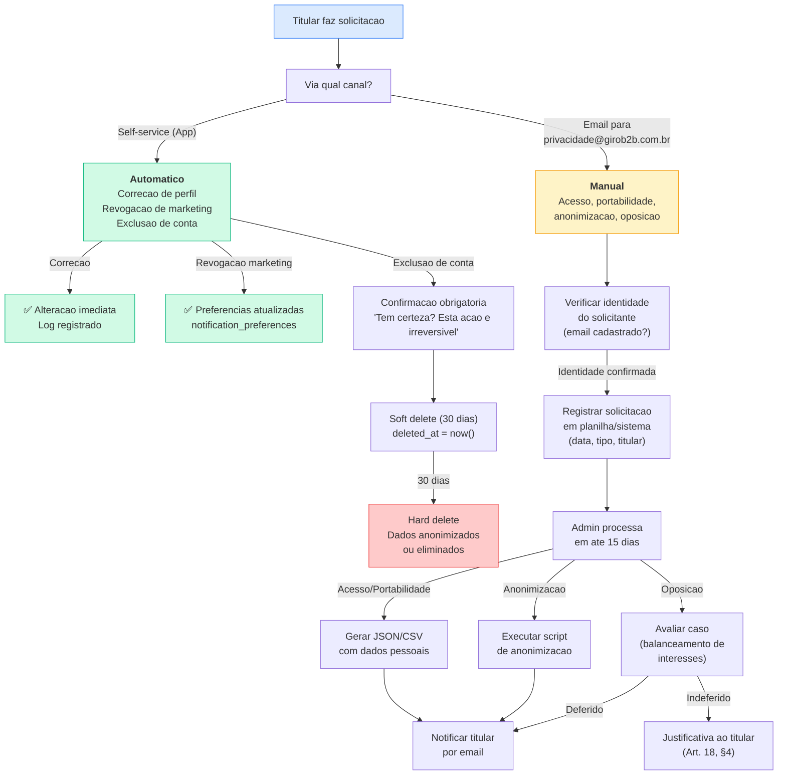

# 4.4 Compliance LGPD

**Versao:** 1.0 | **Data:** 06/04/2026 | **Autor:** Claude Opus 4.6
**Status:** Rascunho — pendente revisao juridica
**Dependencias:** REFERENCIA_CONSOLIDADA, 1.5, 1.6, 4.3, 2.5, 3.2, DNA_GIROB2B
**Publico:** Ambos (Dev + Investidores/Juridico)

---

## Resumo Executivo

Este documento estabelece o framework de compliance LGPD (Lei 13.709/2018) do GiroB2B, marketplace B2B horizontal de conexao/leads. Cobre o inventario completo de dados pessoais, bases legais para cada tratamento, mecanismos de consentimento no cadastro unificado de 3 niveis, os 9 direitos dos titulares com implementacao tecnica, compartilhamento com 9 providers terceiros (todos USA-based), politica de retencao e eliminacao, resposta a incidentes, e 10 pendencias juridicas priorizadas.

**Decisoes-chave de privacidade:**
- **CPF nunca coletado** — privacy by design (RN-01.13)
- **PostHog cookieless** — LGPD-first desde a arquitetura (ADR-05)
- **Stripe PCI DSS Level 1** — zero dados de cartao nos nossos servidores
- **Consentimento granular** — coletado no momento da acao (buyer activation), nao no cadastro base
- **Soft delete + hard delete** — janela de 30 dias para recuperacao, depois eliminacao irreversivel

**Cobertura:** 8 RNFs de privacidade (RNF-05.01 a 05.08), 3 regras de negocio (RN-01.07, RN-01.13, RN-09.02), 9 direitos Art. 18 LGPD.

> **⚠️ AVISO LEGAL:** Este documento e um framework tecnico-operacional elaborado pela equipe de produto. **Nao substitui revisao juridica** por advogado especializado em protecao de dados. As pendencias que requerem validacao juridica estao marcadas com ⚠️ ao longo do texto e consolidadas na Secao 12.

---

## Indice

1. [Escopo e Aplicabilidade](#1-escopo-e-aplicabilidade)
2. [Inventario de Dados Pessoais (Data Mapping)](#2-inventario-de-dados-pessoais-data-mapping)
3. [Bases Legais Utilizadas](#3-bases-legais-utilizadas)
4. [Consentimento e Transparencia](#4-consentimento-e-transparencia)
5. [Direitos do Titular (Art. 18)](#5-direitos-do-titular-art-18)
6. [Compartilhamento de Dados com Terceiros](#6-compartilhamento-de-dados-com-terceiros)
7. [Seguranca dos Dados (Art. 46)](#7-seguranca-dos-dados-art-46)
8. [Retencao e Eliminacao de Dados](#8-retencao-e-eliminacao-de-dados)
9. [Incidentes de Seguranca e Notificacao (Art. 48)](#9-incidentes-de-seguranca-e-notificacao-art-48)
10. [Relatorio de Impacto a Protecao de Dados — RIPD (Art. 38)](#10-relatorio-de-impacto-a-protecao-de-dados--ripd-art-38)
11. [Cookies e Rastreamento](#11-cookies-e-rastreamento)
12. [Pendencias Juridicas](#12-pendencias-juridicas)
13. [Rastreabilidade](#13-rastreabilidade)

---

## 1. Escopo e Aplicabilidade

### 1.1 Controlador de dados

| Aspecto | Detalhe |
|---------|---------|
| **Razao social** | GIROB2B PLATAFORMA DE NEGOCIOS DIGITAIS INOVA SIMPLES (I.S.) |
| **CNPJ** | 65.542.877/0001-50 |
| **Regime tributario** | Inova Simples |
| **CNAE principal** | 6319-4/00 (Portais e provedores de conteudo) |
| **CNAE secundario** | 7490-1/04 (Intermediacao de negocios) |
| **Site** | girob2b.com.br |
| **Fundacao** | 07/03/2026 |

O GiroB2B atua como **controlador** de dados pessoais conforme Art. 5, V da LGPD — e a pessoa juridica que toma as decisoes referentes ao tratamento de dados pessoais dos usuarios da plataforma.

### 1.2 Encarregado de Protecao de Dados (DPO) — Art. 41

| Aspecto | Status |
|---------|--------|
| **Designacao** | ⚠️ **PENDENCIA** — a designar formalmente |
| **Responsavel interino** | Gustavo (CEO) — ponto de contato para titulares e ANPD |
| **Canal de contato** | privacidade@girob2b.com.br (a configurar) |
| **Publicacao** | Informacao do encarregado deve constar na Politica de Privacidade e no site |

> **⚠️ PENDENCIA JURIDICA #PJ-01:** A LGPD (Art. 41) exige a indicacao de encarregado. Para startups no regime Inova Simples, avaliar com advogado se ha dispensa regulamentar (Resolucao CD/ANPD n. 2/2022 — agentes de tratamento de pequeno porte). Caso haja dispensa, documentar. Caso contrario, designar formalmente.

### 1.3 Escopo de dados processados

O GiroB2B processa:

- **Dados pessoais:** nome, email, telefone de usuarios (compradores e representantes de fornecedores)
- **Dados empresariais:** CNPJ, razao social, endereco comercial, redes sociais de fornecedores
- **Dados comportamentais:** buscas realizadas, paginas visitadas, eventos de uso (via PostHog cookieless)
- **Dados tecnicos:** endereco IP, user-agent, logs de erro (via Sentry/Vercel)
- **Dados financeiros:** processados **exclusivamente** pelo Stripe — nunca armazenados no GiroB2B

### 1.4 Dados que o GiroB2B NAO coleta — Privacy by Design

| Dado | Motivo da nao-coleta | Referencia |
|------|---------------------|------------|
| **CPF** | Decisao explicita — dado sensivel (LGPD Art. 5, II), sem valor de negocio para marketplace B2B. CNPJ (empresa) e o unico documento utilizado | RN-01.13, REFERENCIA §17 #14 |
| **Dados de cartao de credito** | Delegado integralmente ao Stripe (PCI DSS Level 1). Tokenizacao via Stripe Elements — dados nunca transitam pelo nosso servidor | INT-10 |
| **Dados bancarios** | Stripe gerencia repasses. GiroB2B nunca ve conta bancaria do supplier | INT-10 |
| **Biometria** | Nao aplicavel ao modelo de negocio B2B | — |
| **Geolocalizacao precisa** | Apenas cidade/estado do supplier (dado publico para listagem no marketplace) | RN-01.05 |
| **Dados de saude** | Nao aplicavel | — |
| **Dados de menores** | Plataforma B2B direcionada a empresas. Termos exigem maioridade (18+) | ⚠️ PJ-02 |

> A decisao de nunca coletar CPF e uma medida proativa de **minimizacao de dados** (Art. 6, III da LGPD). Em um marketplace B2B, o CNPJ da empresa e suficiente para todas as necessidades de verificacao. Isso reduz significativamente o risco regulatorio e a superficie de exposicao em caso de incidente.

### 1.5 Base legal aplicavel

- **LGPD** — Lei 13.709/2018 (Lei Geral de Protecao de Dados Pessoais)
- **Marco Civil da Internet** — Lei 12.965/2014 (retencao de logs de acesso)
- **Codigo de Defesa do Consumidor** — Lei 8.078/1990 (relacoes de consumo)
- **Codigo Civil** — Lei 10.406/2002 (prazo prescricional de 5 anos para relacoes contratuais)
- **Resolucao CD/ANPD n. 2/2022** — Agentes de tratamento de pequeno porte

### 1.6 Publico-alvo dos dados

| Tipo de titular | Nivel | Dados coletados | Volume estimado |
|-----------------|-------|-----------------|-----------------|
| **Usuarios base** | N1 (user) | Nome, email, telefone, cidade/estado | Majoritario |
| **Compradores** | N2 (buyer) | N1 + empresa (opcional), CNPJ (opcional) | ~60-70% dos N1 |
| **Fornecedores** | N3 (supplier) | CNPJ, razao social, endereco completo, telefone comercial, redes sociais | ~500 (M12) a ~3.000 (M18) |
| **Administradores** | admin | Mesmo que N1 (founders) | 3 pessoas |

---

## 2. Inventario de Dados Pessoais (Data Mapping)

### 2.1 Mapeamento completo — dados coletados diretamente

| # | Dado pessoal | Titular | Finalidade | Base legal (Art. 7) | Onde armazenado | Entidade BD | Obrigatorio? |
|---|-------------|---------|------------|---------------------|-----------------|-------------|-------------|
| 1 | **Nome completo** | Todos (N1+) | Identificacao na plataforma | I — Consentimento | Supabase PostgreSQL | `profiles.display_name` | Sim |
| 2 | **Email** | Todos (N1+) | Autenticacao + comunicacao | V — Execucao contratual | Supabase Auth + `profiles` | `auth.users.email` | Sim |
| 3 | **Senha (hash bcrypt)** | Todos (N1+) | Autenticacao | V — Execucao contratual | Supabase Auth | `auth.users` (hash only) | Sim |
| 4 | **Telefone** | Todos (N1+) | Contato comercial (buyer→supplier) | I — Consentimento | Supabase PostgreSQL | `profiles.phone` | Sim |
| 5 | **Cidade/Estado** | Todos (N1+) | Segmentacao geografica | I — Consentimento | Supabase PostgreSQL | `profiles` via `locations` | Sim |
| 6 | **Avatar (foto)** | Opcional | Personalizacao do perfil | I — Consentimento | Cloudflare R2 | `profiles.avatar_url` | Nao |
| 7 | **Nome da empresa** | Buyer (N2, opcional) | Selo "Empresa Verificada" | I — Consentimento | Supabase PostgreSQL | `buyers.company_name` | Nao |
| 8 | **CNPJ (buyer)** | Buyer (N2, opcional) | Selo "Empresa Verificada" (SEQ-18) | I — Consentimento | Supabase PostgreSQL | `buyers.cnpj` | Nao |
| 9 | **Consentimento LGPD** | Buyer (N2) | Registro de consentimento | I — Consentimento | Supabase PostgreSQL | `buyers.lgpd_consent` + `lgpd_consent_at` | Sim (ativacao) |
| 10 | **CNPJ (supplier)** | Supplier (N3) | Verificacao empresarial, listagem | V — Execucao contratual | Supabase PostgreSQL | `suppliers.cnpj` | Sim |
| 11 | **Razao social** | Supplier (N3) | Identificacao legal da empresa | V — Execucao contratual | Supabase PostgreSQL | `suppliers.company_name` | Sim |
| 12 | **Nome fantasia** | Supplier (N3) | Exibicao publica no marketplace | V — Execucao contratual | Supabase PostgreSQL | `suppliers.trade_name` | Nao |
| 13 | **Endereco comercial** | Supplier (N3) | Listagem no marketplace, confianca | I — Consentimento | Supabase PostgreSQL | `suppliers.address_*` | Parcial |
| 14 | **CEP** | Supplier (N3) | Localizacao geografica | I — Consentimento | Supabase PostgreSQL | `suppliers.address_zip` | Nao |
| 15 | **Telefone comercial** | Supplier (N3) | Contato B2B | I — Consentimento | Supabase PostgreSQL | `suppliers.phone` | Nao |
| 16 | **Website** | Supplier (N3) | Perfil publico | I — Consentimento | Supabase PostgreSQL | `suppliers.website_url` | Nao |
| 17 | **Redes sociais** | Supplier (N3) | Perfil publico (LinkedIn, Instagram, Facebook) | I — Consentimento | Supabase PostgreSQL | `suppliers.*_url` | Nao |
| 18 | **Logo da empresa** | Supplier (N3) | Perfil publico | I — Consentimento | Cloudflare R2 | `suppliers.logo_url` | Nao |
| 19 | **Fotos de produtos** | Supplier (N3) | Catalogo publico | I — Consentimento | Cloudflare R2 | `product_images.image_url` | Nao |
| 20 | **Fotos da empresa** | Supplier (N3) | Perfil publico | I — Consentimento | Cloudflare R2 | `supplier_images.image_url` | Nao |
| 21 | **Documentos de verificacao** | Supplier (N3, [MON]) | Selo verificado nivel 2 | I — Consentimento | Cloudflare R2 | `verification_documents` | Nao |

### 2.2 Dados coletados indiretamente (snapshots e derivados)

| # | Dado | Origem | Finalidade | Base legal | Entidade BD |
|---|------|--------|-----------|------------|-------------|
| 22 | **Snapshot buyer em inquiry** (nome, email, telefone, empresa, cidade, estado) | Buyer ao enviar inquiry | Registro imutavel do lead para fornecedor | V — Execucao contratual + I — Consentimento | `inquiries.buyer_*` |
| 23 | **Snapshot buyer em lead** (nome, email, telefone, empresa) | Inquiry desbloqueada | Dados de contato revelados ao supplier | V — Execucao contratual | `leads.buyer_*` |
| 24 | **Email de destinatario** | Sistema (envio de emails) | Auditoria de comunicacao | IX — Legitimo interesse | `email_logs.recipient_email` |
| 25 | **Token de unsubscribe** | Sistema | Exercicio de direito LGPD (opt-out) | II — Obrigacao legal | `email_logs.unsubscribe_token` |

> **Nota sobre snapshots:** As tabelas `inquiries` e `leads` contem copias denormalizadas dos dados do buyer no momento da acao (RNF-05.01). Isso garante que: (a) o fornecedor mantem os dados que recebeu legitimamente, e (b) alteracoes posteriores no perfil do buyer nao alteram inquiries ja enviadas. Essa decisao tem implicacao direta na politica de retencao (ver Secao 8).

### 2.3 Dados tecnicos e comportamentais

| # | Dado | Fonte | Finalidade | Base legal | Onde armazenado | Retencao |
|---|------|-------|-----------|------------|-----------------|----------|
| 26 | **Endereco IP** | Toda requisicao | Seguranca, rate limiting, prevencao de abuso | IX — Legitimo interesse | Vercel logs, Cloudflare logs | 30 dias (Vercel), 72h (Cloudflare) |
| 27 | **User-agent** | Toda requisicao | Compatibilidade, debug | IX — Legitimo interesse | Vercel logs | 30 dias |
| 28 | **Erros de aplicacao** | Sentry (INT-11) | Qualidade do servico | IX — Legitimo interesse | Sentry cloud | 90 dias (free tier) |
| 29 | **Eventos de uso** | PostHog (INT-12) | Analytics comportamental | IX — Legitimo interesse | PostHog cloud (cookieless) | 1 ano (free tier) |
| 30 | **Buscas realizadas** | Acao do usuario | Melhoria de relevancia | IX — Legitimo interesse | Supabase PostgreSQL | `search_logs` — ver §8 |
| 31 | **Tentativas de login falhas** | Supabase Auth | Seguranca (brute force) | IX — Legitimo interesse | Sentry + `auth_error_logs` | 90 dias |
| 32 | **Acoes admin** | Acao administrativa | Auditoria e compliance | II — Obrigacao legal | Supabase PostgreSQL | `admin_actions` — 1 ano |
| 33 | **Webhooks de pagamento** | Stripe (INT-10) | Processamento de assinaturas | V — Execucao contratual | Logs do servidor | 90 dias |

### 2.4 Resumo estatistico

| Categoria | Quantidade | Exemplos |
|-----------|-----------|----------|
| **Dados pessoais diretos** | 21 campos | Nome, email, telefone, CNPJ, endereco |
| **Dados derivados/snapshot** | 4 grupos | Snapshots em inquiries e leads, email logs |
| **Dados tecnicos/comportamentais** | 8 tipos | IP, user-agent, erros, analytics, buscas |
| **Total de campos mapeados** | **33** | — |
| **Entidades com dados pessoais** | **9 de 30** | profiles, buyers, suppliers, inquiries, leads, email_logs, search_logs, notifications, notification_preferences |

---

## 3. Bases Legais Utilizadas

### 3.1 Fundamento: Art. 7 da LGPD

A LGPD (Art. 7) estabelece 10 hipoteses de base legal para tratamento de dados pessoais. O GiroB2B utiliza 4 delas:

| Base legal | Artigo | Uso no GiroB2B |
|-----------|--------|----------------|
| **I — Consentimento** | Art. 7, I + Art. 8 | Cadastro, compartilhamento de dados do buyer, marketing |
| **II — Obrigacao legal** | Art. 7, II | Retencao de logs (Marco Civil), registros fiscais |
| **V — Execucao contratual** | Art. 7, V | Funcionalidades core (inquiries, pagamentos, verificacao) |
| **IX — Legitimo interesse** | Art. 7, IX | Analytics, seguranca, prevencao de fraude |

### 3.2 Mapeamento tratamento × base legal

| Tratamento | Base legal | Justificativa | Titular |
|-----------|-----------|---------------|---------|
| Cadastro (nome, email, senha, telefone) | I — Consentimento | Aceite dos Termos de Uso no cadastro (N1). Usuario fornece dados voluntariamente | Todos |
| Autenticacao (login, sessao) | V — Execucao contratual | Necessario para entregar o servico contratado | Todos |
| Envio de inquiry (dados do buyer) | V — Execucao contratual + I — Consentimento | Core da plataforma. Consentimento especifico coletado (RN-01.07, checkbox buyer) | Buyer |
| Snapshot de dados em inquiry | V — Execucao contratual | Registro imutavel necessario para a relacao comercial | Buyer |
| Desbloqueio de lead (dados de contato) | V — Execucao contratual | Supplier pagou pelo acesso — prestacao do servico | Buyer + Supplier |
| Verificacao de CNPJ (BrasilAPI) | IX — Legitimo interesse | Confiabilidade do marketplace, prevencao de fraude | Supplier |
| Verificacao de CNPJ buyer (selo) | I — Consentimento | Buyer fornece CNPJ voluntariamente para obter selo | Buyer |
| Processamento de pagamentos (Stripe) | V — Execucao contratual | Cobranca de assinaturas/creditos contratados | Supplier |
| Envio de emails transacionais | V — Execucao contratual | Notificacoes operacionais (inquiries, pagamentos, seguranca) | Todos |
| Envio de emails marketing | I — Consentimento | Opt-in explicito, com unsubscribe em todo email (RN-09.02) | Todos |
| Analytics comportamental (PostHog) | IX — Legitimo interesse | Melhoria do servico, sem identificacao pessoal (cookieless) | Todos |
| Logs de seguranca (IP, erros) | IX — Legitimo interesse | Seguranca, prevencao de ataques, debug | Todos |
| Logs de acesso (Marco Civil) | II — Obrigacao legal | Lei 12.965/2014 — retencao obrigatoria de 6 meses | Todos |
| Auditoria admin | II — Obrigacao legal | Accountability, LGPD Art. 6, X | Admin |

### 3.3 Teste de Legitimo Interesse (LIA simplificado)

Para os tratamentos baseados em legitimo interesse (Art. 7, IX), aplicamos o teste de balanceamento:

| Tratamento | Interesse legitimo | Necessidade | Balanceamento | Resultado |
|-----------|-------------------|-------------|---------------|-----------|
| **Analytics (PostHog)** | Entender uso do produto para melhorar o servico | Essencial para decisoes de produto em startup early-stage | Cookieless = sem identificacao pessoal, dados anonimos, impacto minimo ao titular | **Aprovado** |
| **Verificacao CNPJ** | Confiabilidade do marketplace (prevencao de fraude) | Necessario para garantir qualidade das listagens | CNPJ e dado publico (Receita Federal). Titular nao sofre prejuizo | **Aprovado** |
| **Rate limiting (IP)** | Seguranca da plataforma e de todos os usuarios | Unica forma eficaz de prevenir ataques automatizados | IP retido por 30 dias max, nao vinculado a identidade, interesse coletivo prevalece | **Aprovado** |
| **Logs de erro (Sentry)** | Qualidade e estabilidade do servico | Necessario para deteccao e correcao de bugs | Dados pessoais mascarados em logs (4.3 §6.5), retencao de 90 dias | **Aprovado** |

> ⚠️ **PENDENCIA JURIDICA #PJ-03:** Validar com advogado se os LIAs simplificados acima atendem o Art. 10 da LGPD (requisitos de legitimo interesse). Documentar formalmente quando necessario.

---

## 4. Consentimento e Transparencia

### 4.1 Principios de consentimento (Art. 8 LGPD)

O consentimento no GiroB2B e:
- **Livre** — nenhuma funcionalidade essencial e condicionada a consentimento para marketing
- **Informado** — texto claro sobre quais dados, com quem, para que
- **Inequivoco** — checkbox ativo (nao pre-marcado), com timestamp registrado
- **Especifico** — consentimentos separados para diferentes finalidades
- **Revogavel** — titular pode revogar a qualquer momento (Art. 8, §5)

### 4.2 Momentos de coleta de consentimento

O cadastro unificado de 3 niveis coleta consentimento de forma **progressiva** — apenas quando o dado e efetivamente necessario:

### 4.3 Consentimento Nivel 1 — Cadastro (SEQ-01)

| Aspecto | Detalhe |
|---------|---------|
| **Momento** | Formulario de cadastro |
| **Mecanismo** | Checkbox ativo (nao pre-marcado): "Li e aceito os [Termos de Uso] e a [Politica de Privacidade]" |
| **Dados cobertos** | Nome, email, senha, telefone, cidade/estado |
| **Registro** | `profiles.created_at` como timestamp de aceite |
| **Sem consentimento** | Cadastro nao e concluido |
| **LGPD especifico?** | Nao — consentimento generico para uso do servico |

**Nota:** No N1, nenhum dado e compartilhado com terceiros (exceto providers de infraestrutura). O consentimento LGPD especifico para compartilhamento de dados e coletado apenas no N2.

### 4.4 Consentimento Nivel 2 — Ativacao Buyer (RN-01.07)

| Aspecto | Detalhe |
|---------|---------|
| **Momento** | Primeira inquiry (formulario de solicitacao de cotacao) |
| **Mecanismo** | Checkbox ativo com texto explicito (RNF-05.01) |
| **Texto do consentimento** | "Autorizo o GiroB2B a compartilhar meus dados de contato (nome, email, telefone e empresa) com fornecedores que possuam plano pago, para que possam responder a esta solicitacao de cotacao." |
| **Dados cobertos** | Nome, email, telefone, empresa do buyer |
| **Registro** | `buyers.lgpd_consent = true`, `buyers.lgpd_consent_at = timestamp` |
| **Sem consentimento** | Inquiry **nao** e enviada, buyer **nao** e ativado |
| **Revogacao** | Ver Secao 5 (direito VIII) |

> **⚠️ PENDENCIA JURIDICA #PJ-04:** Texto exato do consentimento deve ser revisado por advogado antes do lancamento (RNF-05.01). O texto acima e uma minuta tecnica.

### 4.5 Consentimento para comunicacoes marketing

| Aspecto | Detalhe |
|---------|---------|
| **Mecanismo** | Opt-in separado do consentimento de servico (checkbox independente) |
| **Texto** | "Desejo receber novidades, dicas e ofertas do GiroB2B por email" |
| **Padrao** | Desmarcado (opt-in, nao opt-out) |
| **Unsubscribe** | Link funcional em todo email (RN-09.02) |
| **Registro** | `notification_preferences` com `email_enabled` por tipo de evento |

### 4.6 Politica de Privacidade — conteudo minimo (Art. 9 LGPD)

A Politica de Privacidade do GiroB2B deve conter, no minimo:

| Item | Art. 9 | Conteudo |
|------|--------|----------|
| Finalidade | I | Para que cada dado e coletado (tabela da Secao 2) |
| Forma e duracao | II | Como os dados sao processados e por quanto tempo (Secao 8) |
| Identificacao do controlador | III | Razao social, CNPJ, endereco, contato |
| Contato do controlador | III | Email: privacidade@girob2b.com.br |
| Compartilhamento | IV | Lista de terceiros (Secao 6) |
| Responsabilidades dos agentes | V | Papel de cada operador (providers) |
| Direitos do titular | VI | Todos os 9 direitos (Secao 5) com canais |
| ⚠️ | — | Informar que o DPO sera designado (§1.2) |

**Acessibilidade (RNF-05.05):**
- Link permanente no rodape de todas as paginas
- Linguagem clara e acessivel (nao juridiques excessivo)
- Versao em portugues brasileiro
- ⚠️ Revisao por advogado antes do lancamento

### 4.7 Termos de Uso (RN-01.07)

| Aspecto | Detalhe |
|---------|---------|
| **Aceite obrigatorio** | Checkbox no cadastro (N1) e no upgrade supplier (N3) |
| **Conteudo minimo** | Descricao do servico, regras de conduta, propriedade intelectual, limitacao de responsabilidade, foro |
| **Menores** | Uso restrito a maiores de 18 anos (marketplace B2B). ⚠️ PJ-02 |
| **Atualizacao** | Notificacao por email + banner no login. Re-aceite obrigatorio para mudancas materiais |

### 4.8 Menores de idade (Art. 14 LGPD)

O GiroB2B e uma plataforma B2B direcionada a empresas e profissionais. Os Termos de Uso restringem o uso a maiores de 18 anos. Nao ha coleta intencional de dados de menores.

| Aspecto | Politica |
|---------|----------|
| **Restricao** | Maiores de 18 anos apenas (Termos de Uso) |
| **Verificacao** | Autodeclaracao no aceite dos Termos (MVP) |
| **Deteccao** | Nao ha mecanismo ativo de verificacao de idade (proporcional ao risco — marketplace B2B) |
| **Se detectado** | Conta removida imediatamente + dados eliminados |

> ⚠️ **PENDENCIA JURIDICA #PJ-02:** Validar com advogado se a autodeclaracao e suficiente para marketplace B2B, considerando que o Art. 14 da LGPD exige consentimento dos pais para tratamento de dados de menores.

---

## 5. Direitos do Titular (Art. 18)

### 5.1 Visao geral dos 9 direitos

A LGPD garante ao titular 9 direitos sobre seus dados pessoais (Art. 18). A tabela abaixo descreve como o GiroB2B implementa cada um:

| # | Direito (Art. 18) | Implementacao MVP | Canal | Prazo | RNF |
|---|-------------------|-------------------|-------|-------|-----|
| I | **Confirmacao de tratamento** | Politica de Privacidade publica, listando todos os tratamentos | Site (rodape) | Imediato | RNF-05.05 |
| II | **Acesso aos dados** | Painel do usuario (dados do perfil) + exportacao por email | App + email | 15 dias | RNF-05.02 |
| III | **Correcao** | Edicao no perfil (self-service) | App | Imediato | RNF-05.02 |
| IV | **Anonimizacao/bloqueio de dados desnecessarios** | Solicitacao por email → admin processa | Email | 15 dias | RNF-05.02 |
| V | **Portabilidade** | Export JSON/CSV dos dados pessoais | Email (MVP) → App (futuro) | 15 dias | RNF-05.02 |
| VI | **Eliminacao (direito ao esquecimento)** | Exclusao de conta: soft delete → hard delete apos 30 dias | App + email | 15 dias (inicio) + 30 dias (eliminacao total) | RNF-05.04 |
| VII | **Info sobre compartilhamento** | Politica de Privacidade com lista de terceiros (Secao 6) | Site | Imediato | RNF-05.05 |
| VIII | **Revogacao de consentimento** | Configuracoes de conta (marketing). Para dados de inquiry: solicitacao por email | App + email | Imediato (marketing) / 15 dias (inquiry) | RNF-05.02 |
| IX | **Oposicao ao tratamento por legitimo interesse** | Solicitacao por email → avaliacao caso a caso | Email | 15 dias | RNF-05.02 |

### 5.2 Fluxo de exercicio de direitos

### 5.3 Detalhamento por direito

#### Direito II — Acesso aos dados

**Self-service (imediato):** O painel do usuario exibe todos os dados pessoais armazenados (nome, email, telefone, cidade, empresa, CNPJ se aplicavel).

**Por email (ate 15 dias):** O titular pode solicitar um relatorio completo contendo:
- Dados do perfil
- Inquiries enviadas (se buyer)
- Produtos listados (se supplier)
- Leads desbloqueados (se supplier)
- Logs de consentimento
- Historico de emails enviados

**Formato:** JSON (formato estruturado, Art. 19, §3) ou relatorio legivel em PDF.

#### Direito V — Portabilidade

| Aspecto | MVP | Futuro |
|---------|-----|--------|
| **Formato** | JSON + CSV | JSON + CSV + integracao API |
| **Canal** | Email (admin gera e envia) | Download direto no App |
| **Conteudo** | Dados pessoais + produtos + inquiries | + analytics do perfil |
| **Prazo** | 15 dias | Imediato (self-service) |

#### Direito VI — Eliminacao (exclusao de conta)

O processo de eliminacao segue duas etapas:

| Etapa | Prazo | Acao | Dados afetados |
|-------|-------|------|----------------|
| **1. Soft delete** | Imediato | `deleted_at = now()` | Perfil fica invisivel. Dados mascarados. Login bloqueado |
| **2. Janela de recuperacao** | 30 dias | Titular pode solicitar reativacao por email | Dados intactos no banco |
| **3. Hard delete** | Apos 30 dias | Job automatizado elimina ou anonimiza dados | Ver tabela abaixo |

**Dados apos hard delete:**

| Entidade | Acao | Detalhe |
|----------|------|---------|
| `profiles` | Anonimizar | `display_name` → hash, `phone` → null, `avatar_url` → null |
| `auth.users` | Deletar | Supabase Auth remove o registro |
| `buyers` | Anonimizar | `name` → null, `company_name` → null, `cnpj` → null |
| `suppliers` | Anonimizar | `company_name` → hash, `cnpj` → null, emails → null, enderecos → null |
| `inquiries` (como buyer) | Anonimizar | `buyer_name/email/phone` → "Anonimo", `buyer_company` → null |
| `leads` (como buyer) | ⚠️ **PENDENCIA** | Ver §5.4 |
| `products` (como supplier) | Soft delete → hard delete | Produtos removidos do catalogo |
| `search_logs` | Anonimizar | `user_id` → null (manter query para analytics agregado) |
| `email_logs` | Anonimizar | `recipient_email` → hash |
| `notifications` | Deletar | Remover todas as notificacoes do usuario |
| Imagens (R2) | Deletar | Remover avatar, logo, fotos de produtos e empresa |

#### 5.4 Caso especial: leads desbloqueados vs exclusao de conta

> ⚠️ **PENDENCIA JURIDICA #PJ-05 (PRIORIDADE ALTA):** Quando um buyer exclui sua conta, o que acontece com os leads ja desbloqueados por suppliers que pagaram creditos?

**Opcoes para decisao juridica:**

| Opcao | Descricao | Proa | Contra |
|-------|-----------|------|--------|
| **A — Manter** | Leads permanecem (supplier pagou) | Respeita relacao contratual do supplier | Pode conflitar com direito de eliminacao do buyer |
| **B — Anonimizar** | Substituir dados pessoais por dados agregados (categoria, cidade) | Respeita LGPD Art. 18, VI | Supplier perde ROI do credito gasto |
| **C — Notificar + prazo** | Avisar suppliers 30 dias antes da eliminacao | Compromisso equilibrado | Complexidade tecnica maior |

**Recomendacao tecnica:** Opcao B (anonimizar) — manter `category_id`, `city`, `state` mas remover `buyer_name`, `buyer_email`, `buyer_phone`, `buyer_company`. O supplier mantem o insight comercial mas nao os dados pessoais.

#### Direito VIII — Revogacao de consentimento

| Tipo de consentimento | Como revogar | Consequencia |
|----------------------|-------------|-------------|
| **Marketing (email)** | Configuracoes de conta ou link unsubscribe no email | Para de receber emails promocionais. Emails operacionais (seguranca, cobranca) continuam (RN-09.02) |
| **Push notifications** | Configuracoes de conta | Desativa notificacoes push (RN-09.03) |
| **Compartilhamento de dados (buyer)** | Solicitacao por email | Buyer nao pode mais enviar inquiries. Inquiries passadas permanecem (execucao contratual). ⚠️ PJ-05 |

### 5.5 Registro de solicitacoes (RNF-05.02)

Toda solicitacao de exercicio de direito e registrada com:

| Campo | Descricao |
|-------|-----------|
| **Data/hora** | Timestamp da solicitacao |
| **Titular** | Identificacao (email) |
| **Tipo** | Qual direito (acesso, correcao, eliminacao, etc.) |
| **Canal** | App (self-service) ou email |
| **Status** | Recebido → Em processamento → Concluido / Indeferido |
| **Prazo** | Data limite para resposta (15 dias) |
| **Responsavel** | Qual founder processou |
| **Resolucao** | O que foi feito + justificativa (se indeferido) |

**MVP:** Planilha interna (Google Sheets ou Notion) com acesso restrito aos founders.
**Futuro:** Modulo administrativo integrado a plataforma.

---

## 6. Compartilhamento de Dados com Terceiros

### 6.1 Inventario de terceiros (operadores)

O GiroB2B compartilha dados com os seguintes terceiros, todos atuando como **operadores** de dados (Art. 5, VII):

| # | Terceiro | Sede | Dados compartilhados | Finalidade | Base legal | DPA/Contrato | INT |
|---|----------|------|---------------------|------------|------------|-------------|-----|
| 1 | **Supabase** | USA (AWS) | Todos os dados do banco (PostgreSQL) + auth | Backend-as-a-Service | V — Execucao contratual | ToS + DPA Supabase | INT-01 |
| 2 | **Stripe** | USA | Email, nome (billing). Dados de cartao diretamente (nunca via GiroB2B) | Processamento de pagamentos | V — Execucao contratual | Sim — PCI DSS Level 1 | INT-10 |
| 3 | **Vercel** | USA | Logs de acesso (IP, user-agent), codigo-fonte (deploy) | Hospedagem + CDN | IX — Legitimo interesse | ToS Vercel | INT-04 |
| 4 | **Cloudflare** | USA | IP, HTTP headers, DNS queries | CDN, WAF, protecao DDoS | IX — Legitimo interesse | DPA Cloudflare | INT-05 |
| 5 | **Resend** | USA | Email do destinatario, conteudo do email | Envio de emails transacionais | V — Exec. contratual + I — Consentimento (marketing) | ToS Resend | INT-08 |
| 6 | **Sentry** | USA | Stack traces, metadata de erros (pode incluir IP, user-agent) | Error tracking | IX — Legitimo interesse | DPA Sentry | INT-11 |
| 7 | **PostHog** | EU/USA | Eventos anonimos (cookieless), sem dados pessoais identificaveis | Analytics comportamental | IX — Legitimo interesse | DPA PostHog | INT-12 |
| 8 | **Better Stack** | USA/EU | URL de health check, status HTTP | Monitoramento de uptime | IX — Legitimo interesse | ToS Better Stack | INT-13 |
| 9 | **BrasilAPI** | Brasil | CNPJ (consulta publica) | Verificacao de empresa | IX — Legitimo interesse | API publica (sem DPA) | INT-07 |

### 6.2 Transferencia internacional de dados (Art. 33 LGPD)

**Situacao:** 7 dos 9 providers estao sediados nos EUA. A LGPD (Art. 33) permite transferencia internacional quando:

| Hipotese (Art. 33) | Aplicabilidade ao GiroB2B |
|---------------------|--------------------------|
| I — Pais com nivel adequado (ANPD) | ❌ EUA nao possuem decisao de adequacao da ANPD |
| II — Garantias (clausulas contratuais padrao) | ✅ Providers possuem SCCs e DPAs |
| VIII — Consentimento especifico e destacado | ✅ Informar na Politica de Privacidade |
| IX — Execucao contratual | ✅ Para Supabase/Stripe (core do servico) |

**Salvaguardas adotadas:**

| Provider | Salvaguarda | Status |
|----------|-----------|--------|
| Supabase | SOC 2 Type II, dados criptografados AES-256, DPA disponivel | ⚠️ Verificar DPA |
| Stripe | PCI DSS Level 1, SOC 2, SCCs europeus adotados | ✅ Adequado |
| Vercel | SOC 2 Type II, criptografia em transito e repouso | ⚠️ Verificar DPA |
| Cloudflare | ISO 27001, SOC 2, DPA disponivel para download | ⚠️ Verificar DPA |
| Resend | Criptografia em transito | ⚠️ Verificar termos |
| Sentry | SOC 2, DPA disponivel | ⚠️ Verificar DPA |
| PostHog | EU hosting disponivel, SOC 2, cookieless | ⚠️ Verificar DPA |
| Better Stack | Criptografia em transito | ⚠️ Verificar termos |

> ⚠️ **PENDENCIA JURIDICA #PJ-06:** Antes do lancamento, baixar e arquivar os DPAs (Data Processing Agreements) de cada provider. Verificar se cada um contem clausulas contratuais padrao (SCCs) ou outras salvaguardas aceitas pela LGPD para transferencia internacional. Se algum provider nao oferecer DPA adequado, avaliar alternativa ou obter consentimento especifico do titular.

### 6.3 Compartilhamento entre usuarios da plataforma

Alem dos providers terceiros, o GiroB2B promove compartilhamento de dados **entre usuarios**:

| Cenario | Dados compartilhados | De quem → Para quem | Base legal | Consentimento |
|---------|---------------------|---------------------|------------|---------------|
| **Inquiry enviada (antes do desbloqueio)** | Descricao da inquiry, quantidade, prazo, cidade do buyer | Buyer → Supplier | V — Execucao contratual | Implicito (acao do buyer) |
| **Lead desbloqueado (apos credito)** | Nome, email, telefone, empresa do buyer | Buyer → Supplier | V — Exec. contratual + I — Consentimento | Explicito (RN-01.07, checkbox) |
| **Perfil publico do supplier** | Nome da empresa, produtos, cidade/estado, redes sociais | Supplier → Qualquer visitante | I — Consentimento (ao criar perfil publico) | Implicito (acao do supplier) |

**Modelo freemium e dados mascarados (RN-04.05, RN-04.06):**
- Fornecedor **sem plano pago** ve: descricao da inquiry, cidade do buyer. **Nao** ve: nome, email, telefone, empresa.
- Fornecedor **com plano pago + credito** ve: todos os dados de contato apos consumir 1 credito (irreversivel).

---

## 7. Seguranca dos Dados (Art. 46)

A LGPD (Art. 46) exige que o controlador adote medidas de seguranca tecnicas e administrativas para proteger os dados pessoais. O GiroB2B documenta essas medidas em detalhe no artefato **4.3 — Politica de Seguranca**. Esta secao faz referencia cruzada.

### 7.1 Medidas tecnicas

| Medida | Descricao | Referencia 4.3 | RNF |
|--------|-----------|----------------|-----|
| **Criptografia em transito** | TLS 1.2+ obrigatorio em todas as conexoes (SSL Labs ≥ A) | 4.3 §4.1 | RNF-04.08 |
| **Criptografia em repouso** | AES-256 no PostgreSQL (Supabase managed), R2, backups | 4.3 §4.2 | RNF-05.06 |
| **Autenticacao** | Supabase Auth, bcrypt cost ≥ 10, JWT 24h, refresh 7d | 4.3 §2 | RNF-04.01, 04.02 |
| **Autorizacao** | RBAC 2 camadas (middleware Next.js + RLS PostgreSQL) | 4.3 §3 | RNF-04.03 |
| **Validacao de entrada** | Zod schemas (25 schemas), server-side obrigatorio | 4.3 §6.1 | RNF-04.06 |
| **Rate limiting** | Por tier (100/10/5/3 req/min) + Cloudflare WAF | 4.3 §6.2 | RNF-04.07 |
| **Protecao contra brute force** | 5→delay, 10→bloqueio 15min, 20→bloqueio IP | 4.3 §2.6 | RNF-04.04 |
| **Headers de seguranca** | CSP, HSTS, X-Frame-Options, X-Content-Type | 4.3 §5 | RNF-04.09 |
| **Mascaramento em logs** | Senhas, tokens, dados de cartao nunca em logs | 4.3 §6.5 | RNF-04.11 |
| **PCI DSS** | 100% delegado ao Stripe (Level 1). Zero dados de cartao no GiroB2B | 4.3 §4.3 | — |

### 7.2 Medidas administrativas

| Medida | Descricao | Referencia 4.3 |
|--------|-----------|----------------|
| **Acesso minimo** | 3 founders com acessos distintos (Gustavo/CEO, Vitor/CTO, Márcio/CCO) | 4.3 §11.1 |
| **2FA obrigatorio** | Para todos com acesso a producao | 4.3 §11.2 |
| **Senhas unicas** | Cada servico com senha diferente (password manager) | 4.3 §11.2 |
| **Rotacao de secrets** | Ciclo de 6 meses para todas as chaves sensiveis | 4.3 §7.3 |
| **Code review** | PR obrigatorio para `develop` e `main` | 4.3 §10 |
| **Offboarding** | 5 passos: revogar acessos, rotacionar secrets, invalidar sessoes | 4.3 §11.4 |
| **Revisao trimestral** | Auditoria de acessos a cada 3 meses | 4.3 §11.2 |

### 7.3 Medidas de monitoramento

| Ferramenta | Funcao | Dados monitorados | Referencia 4.3 |
|-----------|--------|------------------|----------------|
| Sentry | Error tracking | Erros de aplicacao, auth failures | 4.3 §9.1 |
| Better Stack | Uptime | Disponibilidade de endpoints | 4.3 §9.1 |
| PostHog | Analytics | Eventos anonimos (cookieless) | 4.3 §9.1 |
| Cloudflare | Seguranca | Requests, WAF events, DDoS | 4.3 §9.1 |

---

## 8. Retencao e Eliminacao de Dados

### 8.1 Politica de retencao por tipo de dado

| # | Dado | Retencao ativa | Apos exclusao de conta | Eliminacao definitiva | Base legal retencao |
|---|------|---------------|------------------------|----------------------|---------------------|
| 1 | **Perfil (nome, email, telefone)** | Enquanto conta ativa | Soft delete 30 dias → hard delete (anonimizacao) | 30 dias apos exclusao | RNF-05.04 |
| 2 | **Conta inativa** | Ate 24 meses de inatividade | Notificacao → 30 dias → anonimizacao automatica | 24 meses + 30 dias | RNF-05.07 |
| 3 | **Produtos/catalogo** | Enquanto conta ativa | Soft delete 30 dias → hard delete | 30 dias apos exclusao | RN-02.05 |
| 4 | **Inquiries enviadas (buyer)** | Enquanto conta ativa ou 5 anos apos ultimo contato | Dados pessoais anonimizados (buyer_name→"Anonimo") | Dados pessoais removidos, dados agregados mantidos | Art. 15, III + CC |
| 5 | **Leads desbloqueados** | Enquanto conta do supplier ativa | ⚠️ **PENDENCIA PJ-05** — manter, anonimizar ou notificar? | A definir | — |
| 6 | **Fotos/imagens (R2)** | Enquanto conta ativa | Removidas apos hard delete | Com o hard delete | — |
| 7 | **Logs de acesso (IP, user-agent)** | 30 dias (Vercel) | Automatico | Automatico | Marco Civil 12.965/2014 |
| 8 | **Logs de erro (Sentry)** | 90 dias (free tier) | Automatico (provider) | Automatico | — |
| 9 | **Analytics (PostHog)** | 1 ano (free tier) | Cookieless — sem dados pessoais | Automatico | — |
| 10 | **Buscas (search_logs)** | 12 meses | user_id → null (anonimizacao) | Automatico | RNF-05.07 |
| 11 | **Emails enviados (email_logs)** | 12 meses | recipient_email → hash | 12 meses | — |
| 12 | **Acoes admin (admin_actions)** | 1 ano | Mantido (auditoria) | 1 ano | Art. 37 |
| 13 | **Dados de pagamento (Stripe)** | Stripe gerencia | Stripe PCI compliance | Conforme Stripe | — |
| 14 | **Preferencias de notificacao** | Enquanto conta ativa | Removidas com hard delete | Com hard delete | — |
| 15 | **Documentos de verificacao** | Enquanto conta ativa | Removidos apos hard delete | Com hard delete | — |

### 8.2 Prazos legais de retencao obrigatoria

| Obrigacao | Lei | Prazo | Dados afetados |
|-----------|-----|-------|----------------|
| **Registros de acesso a aplicacao** | Marco Civil da Internet (Art. 15) | 6 meses | Logs de acesso (IP, timestamp, URL) |
| **Relacoes contratuais** | Codigo Civil (Art. 206, §5, I) | 5 anos | Inquiries, contratos de assinatura |
| **Documentos fiscais** | Legislacao fiscal | 5 anos | Notas fiscais, comprovantes de pagamento (Stripe) |
| **Registro de operacoes de tratamento** | LGPD (Art. 37) | Indefinido (enquanto tratar dados) | ROPA (este documento) |

### 8.3 Processo de anonimizacao (RNF-05.04)

A anonimizacao e **irreversivel** — uma vez executada, nao e possivel reidentificar o titular:

| Campo | Tecnica | Resultado |
|-------|---------|-----------|
| `display_name` | Hash SHA-256 truncado | `a7f3b2...` |
| `email` | Deletar (Supabase Auth) | Removido |
| `phone` | Set null | null |
| `company_name` | Hash SHA-256 truncado | `c9d1e4...` |
| `cnpj` | Set null | null |
| `address_*` | Set null | null |
| `avatar_url` / `logo_url` | Deletar arquivo no R2 + set null | null |
| `buyer_name` em inquiries | Substituir por "Anonimo" | "Anonimo" |
| `buyer_email` em inquiries | Set null | null |
| `buyer_phone` em inquiries | Set null | null |
| `buyer_company` em inquiries | Set null | null |

**Dados mantidos apos anonimizacao** (para analytics agregado):
- Categoria da inquiry
- Cidade/estado (dado geografico agregado)
- Timestamps (sem vinculo a pessoa)
- Metricas numericas (quantidade, valores)

### 8.4 Automacao de limpeza (RNF-05.07)

| Job | Frequencia | Acao |
|-----|-----------|------|
| **Hard delete apos soft delete** | Diario | `WHERE deleted_at < now() - interval '30 days'` → anonimizar + deletar |
| **Contas inativas** | Mensal | `WHERE last_login < now() - interval '24 months'` → notificar. Se nao reativar em 30 dias → anonimizar |
| **Limpeza de search_logs** | Mensal | `WHERE created_at < now() - interval '12 months'` → `user_id = null` |
| **Limpeza de email_logs** | Mensal | `WHERE created_at < now() - interval '12 months'` → hash email + deletar |
| **Email nao confirmado** | Diario | `WHERE email_confirmed = false AND created_at < now() - interval '7 days'` → deletar conta (RN-01.03) |

**Implementacao MVP:** Edge Functions no Supabase (cron) ou pg_cron.
**Monitoramento:** Log de execucao de cada job com contagem de registros afetados.

---

## 9. Incidentes de Seguranca e Notificacao (Art. 48)

### 9.1 Definicao de incidente com dados pessoais

Um incidente de seguranca envolvendo dados pessoais e qualquer evento que resulte em:
- **Acesso nao autorizado** a dados pessoais
- **Destruicao** acidental ou ilicita de dados
- **Perda** de dados pessoais
- **Alteracao** nao autorizada de dados
- **Comunicacao** ou difusao nao autorizada de dados

### 9.2 Classificacao de incidentes

| Severidade | Descricao | Notificacao ANPD | Notificacao titulares | Prazo | Referencia 4.3 |
|-----------|-----------|-----------------|----------------------|-------|----------------|
| **P0 — Critico** | Breach confirmado (dados pessoais expostos a terceiros) | ✅ Obrigatoria | ✅ Obrigatoria | 2 dias uteis (ANPD) | 4.3 §9.3 |
| **P1 — Alto** | Acesso nao autorizado detectado (sem confirmacao de exfiltracao) | ✅ Preventiva | Avaliar caso a caso | 2 dias uteis (ANPD) | 4.3 §9.3 |
| **P2 — Medio** | Vulnerabilidade detectada (sem exploracao) | ❌ Nao obrigatoria | ❌ Nao obrigatoria | — | 4.3 §9.3 |
| **P3 — Baixo** | Tentativa de ataque bloqueada | ❌ Nao obrigatoria | ❌ Nao obrigatoria | — | 4.3 §9.3 |

### 9.3 Procedimento de notificacao a ANPD (Art. 48)

**Prazo:** A LGPD (Art. 48) nao define prazo exato, mas a ANPD recomenda **2 dias uteis** apos conhecimento do incidente. O RNF-05.08 define 72 horas como meta interna.

**Conteudo da notificacao (Art. 48, §1):**

| Item | Art. 48, §1 | Conteudo |
|------|------------|----------|
| I | Natureza dos dados pessoais afetados | Tipos de dados (nome, email, telefone, etc.) |
| II | Titulares envolvidos | Numero e categorias (buyers, suppliers) |
| III | Medidas tecnicas e de seguranca | O que estava em vigor (criptografia, RLS, etc.) |
| IV | Riscos relacionados | Potencial de dano aos titulares |
| V | Medidas adotadas | O que foi feito para mitigar |
| — | Motivos da demora (se aplicavel) | Justificativa |

**Canal:** Formulario eletronico da ANPD (https://www.gov.br/anpd).

### 9.4 Procedimento de notificacao aos titulares

| Aspecto | Politica |
|---------|---------|
| **Quando** | Quando o incidente puder acarretar risco ou dano relevante aos titulares (Art. 48) |
| **Canal** | Email (via Resend) para todos os titulares afetados |
| **Conteudo** | Descricao do incidente, dados afetados, medidas tomadas, recomendacoes ao titular |
| **Prazo** | O mais rapido possivel apos notificacao a ANPD |
| **Template** | A ser elaborado e revisado por advogado |

### 9.5 Registro de incidentes

Todo incidente e registrado com:
- Data/hora de deteccao
- Data/hora de inicio estimado
- Descricao do incidente
- Dados pessoais afetados (tipos e volume)
- Titulares afetados (categorias e numero)
- Medidas de contencao adotadas
- Resultado da investigacao (root cause)
- Post-mortem (ver 4.3 §9.5)

**Armazenamento:** Repositorio Git em `/docs/incidents/YYYY-MM-DD-descricao.md` (acesso restrito a founders).

### 9.6 Plano de resposta — referencia cruzada

O plano detalhado de resposta a incidentes (procedimento P0/P1 em 7 passos, comunicacao, post-mortem) esta documentado em **4.3 §9.3-9.5**. A matriz de comunicacao (founders, usuarios, ANPD, Stripe) esta em **4.3 §9.4**.

---

## 10. Relatorio de Impacto a Protecao de Dados — RIPD (Art. 38)

### 10.1 Quando e necessario

A LGPD (Art. 38) preve que a ANPD pode solicitar ao controlador a elaboracao de RIPD (Relatorio de Impacto a Protecao de Dados Pessoais), especialmente quando o tratamento for baseado em legitimo interesse.

### 10.2 Avaliacao para o GiroB2B MVP

| Fator | Avaliacao | Risco |
|-------|-----------|-------|
| **Volume de dados** | Baixo no MVP (<500 suppliers, <5.000 buyers) | Baixo |
| **Dados sensiveis (Art. 5, II)** | Nao coleta dados sensiveis (CPF, saude, religiao, biometria) | Baixo |
| **Perfilamento** | PostHog cookieless — sem perfilamento individual | Baixo |
| **Decisoes automatizadas** | Nao ha decisoes automatizadas sobre titulares (Art. 20) | Baixo |
| **Menores** | Plataforma B2B — risco baixo | Baixo |
| **Transferencia internacional** | Sim (USA) — mas com salvaguardas dos providers | Medio |
| **Compartilhamento buyer→supplier** | Sim — com consentimento explicito | Medio |

**Conclusao:** O risco geral e **baixo a medio**. Um RIPD simplificado e suficiente para o MVP. RIPD completo sera elaborado quando o volume de usuarios justificar (meta: 10.000 usuarios ativos).

### 10.3 Conteudo minimo do RIPD simplificado

| Secao | Conteudo | Referencia neste documento |
|-------|----------|---------------------------|
| Descricao do tratamento | Inventario de dados (o que, de quem, para que) | Secao 2 |
| Necessidade e proporcionalidade | Minimizacao de dados, CPF nunca coletado | §1.4 |
| Riscos aos titulares | Exposicao de dados de contato, transferencia internacional | §6.2 |
| Medidas de mitigacao | Criptografia, RBAC, consentimento, retencao definida | §7, §8 |
| Parecer do encarregado | ⚠️ Pendente designacao do DPO | §1.2 |

> ⚠️ **PENDENCIA JURIDICA #PJ-07:** Elaborar RIPD simplificado formalmente, com parecer do encarregado, antes do lancamento. Este documento (4.4) contem a base tecnica necessaria.

### 10.4 Roadmap de RIPD

| Fase | Gatilho | Acao |
|------|---------|------|
| **MVP** | Pre-lancamento | RIPD simplificado baseado neste documento |
| **Escala** | >10.000 usuarios ou >1.000 suppliers | RIPD completo com avaliacao formal de risco |
| **Sob demanda** | Solicitacao da ANPD | RIPD conforme Art. 38 |

---

## 11. Cookies e Rastreamento

### 11.1 Inventario de cookies e storage

| # | Cookie/Storage | Tipo | Finalidade | Dados armazenados | Necessita consentimento? |
|---|---------------|------|-----------|-------------------|-------------------------|
| 1 | **Access token (JWT)** | httpOnly cookie | Autenticacao | user_id, role, exp (token opaco para o browser) | ❌ Essencial |
| 2 | **Refresh token** | httpOnly cookie | Manter sessao | Token opaco | ❌ Essencial |
| 3 | **Preferencias UI** | localStorage | Personalizacao | Tema (light/dark), filtros salvos | ❌ Essencial |
| 4 | **PostHog events** | Memory only | Analytics | Eventos anonimos (nunca persistidos no browser) | ❌ Cookieless ¹ |
| 5 | **Cloudflare `__cf_bm`** | Cookie tecnico | Bot detection | Token de seguranca | ❌ Essencial (seguranca) |
| 6 | **Vercel `__vercel_live_token`** | Cookie tecnico | Preview (staging only) | Token de preview | ❌ Apenas staging |

¹ **ADR-05 — PostHog cookieless:** Decisao arquitetural explicita de usar PostHog no modo cookieless (sem cookies, sem localStorage, dados em memoria apenas). Isso elimina a necessidade de consentimento para analytics e simplifica compliance LGPD. Os dados de analytics sao anonimos e agregados — nao e possivel identificar usuarios individuais.

### 11.2 Cookies de terceiros

| Terceiro | Cookie? | Tipo | Consentimento? |
|----------|---------|------|---------------|
| **PostHog** | ❌ Nenhum (cookieless) | — | Nao necessario |
| **Vercel Analytics** | ❌ Nenhum (privacy-focused) | — | Nao necessario |
| **Stripe** | ✅ Cookies de sessao (Stripe Elements) | Essencial (pagamento) | Nao (essencial) |
| **Sentry** | ❌ Nenhum | — | Nao necessario |
| **Cloudflare** | ✅ `__cf_bm` (bot management) | Essencial (seguranca) | Nao (essencial) |

### 11.3 Banner de cookies

**Situacao atual:** O GiroB2B utiliza **apenas cookies essenciais** (autenticacao, seguranca) e analytics cookieless (PostHog). Nao ha cookies de rastreamento, publicidade ou marketing de terceiros.

| Aspecto | Politica |
|---------|---------|
| **Banner obrigatorio?** | Recomendado mesmo para cookies essenciais (transparencia) |
| **Implementacao MVP** | Banner informativo simples: "Este site usa apenas cookies essenciais para autenticacao e seguranca. Nao usamos cookies de rastreamento." |
| **Opcoes para o usuario** | Informativo (sem opcao de recusar — todos sao essenciais) |
| **Link** | "Saiba mais" → Politica de Cookies (parte da Politica de Privacidade) |

### 11.4 Politica de cookies — conteudo

A Politica de Cookies (pode ser secao da Politica de Privacidade) deve conter:

1. O que sao cookies e por que usamos
2. Lista de cookies utilizados (tabela §11.1)
3. Afirmacao de que **nao usamos cookies de rastreamento ou publicidade**
4. Como PostHog funciona sem cookies (transparencia)
5. Como desativar cookies no navegador (instrucoes gerais)
6. Contato para duvidas: privacidade@girob2b.com.br

---

## 12. Pendencias Juridicas

### 12.1 Consolidacao de todas as pendencias

| # | ID | Pendencia | Prioridade | Afeta | Secao | Status |
|---|-----|-----------|-----------|-------|-------|--------|
| 1 | PJ-01 | **Designacao de DPO (encarregado)** — avaliar dispensa ANPD para pequeno porte (Resolucao CD/ANPD n. 2/2022) | Alta | Art. 41, Politica de Privacidade | §1.2 | ⏳ |
| 2 | PJ-02 | **Menores de idade** — validar se autodeclaracao e suficiente para marketplace B2B (Art. 14) | Baixa | Termos de Uso | §4.8 | ⏳ |
| 3 | PJ-03 | **LIA (Teste de Legitimo Interesse)** — validar testes simplificados para analytics, CNPJ, rate limiting (Art. 10) | Media | Bases legais | §3.3 | ⏳ |
| 4 | PJ-04 | **Texto de consentimento LGPD** — redacao final do checkbox de buyer activation (Art. 8, RNF-05.01) | Alta | Formulario de inquiry, lancamento | §4.4 | ⏳ |
| 5 | PJ-05 | **Leads desbloqueados vs exclusao de conta** — o que acontece com leads pagos quando buyer exclui conta? (Art. 18, VI) | Alta | Modelo de negocio, RN-05.10 | §5.4 | ⏳ |
| 6 | PJ-06 | **DPAs de providers (transferencia internacional)** — baixar, revisar e arquivar DPAs de todos os 9 providers (Art. 33) | Media | Compliance, lancamento | §6.2 | ⏳ |
| 7 | PJ-07 | **RIPD simplificado** — elaborar formalmente com parecer do encarregado (Art. 38) | Media | Compliance | §10 | ⏳ |
| 8 | PJ-08 | **Termos de Uso** — redacao final por advogado | Alta | Lancamento | §4.7 | ⏳ |
| 9 | PJ-09 | **Politica de Privacidade** — redacao final por advogado (Art. 9) | Alta | Lancamento, RNF-05.05 | §4.6 | ⏳ |
| 10 | PJ-10 | **Retencao pos-cancelamento de assinatura** — definir politica para dados de suppliers que cancelam plano pago mas mantem conta | Media | RN-05.10 | §8 | ⏳ |

### 12.2 Priorizacao por fase

**Antes do lancamento (bloqueantes):**
- PJ-04 — Texto de consentimento LGPD
- PJ-05 — Leads vs exclusao de conta
- PJ-08 — Termos de Uso
- PJ-09 — Politica de Privacidade

**Ate 90 dias apos lancamento:**
- PJ-01 — DPO
- PJ-06 — DPAs de providers
- PJ-07 — RIPD simplificado

**Quando escalar:**
- PJ-02 — Menores de idade
- PJ-03 — LIA formal
- PJ-10 — Retencao pos-cancelamento

### 12.3 Referencia: pendencias anteriores

| Origem | Pendencia | Status neste documento |
|--------|-----------|----------------------|
| REFERENCIA §17 #6 | "LGPD: consentimento, moderacao, retencao" | Endereacada nas Secoes 4, 5, 8. Pendencias remanescentes em PJ-04, PJ-05 |
| REFERENCIA §17 #14 | "CPF nunca coletado" | ✅ Incorporada como privacy by design (§1.4) |

---

## 13. Rastreabilidade

### 13.1 Secao × RNFs × RNs × Artigos LGPD

| Secao | Descricao | RNFs | RNs | Artigos LGPD | Artefatos ref. |
|-------|-----------|------|-----|-------------|----------------|
| §1 | Escopo e Aplicabilidade | — | RN-01.13 | Art. 5, 6, 41 | DNA, REFERENCIA §17 |
| §2 | Inventario de Dados (Data Mapping) | RNF-05.03 | — | Art. 5, 37 | 2.5 (ERD), 3.3 (Integracoes) |
| §3 | Bases Legais | — | — | Art. 7, 10 | — |
| §4 | Consentimento e Transparencia | RNF-05.01, RNF-05.05 | RN-01.07 | Art. 8, 9, 14 | 3.2 SEQ-01 |
| §5 | Direitos do Titular | RNF-05.02, RNF-05.04 | — | Art. 18, 19 | — |
| §6 | Compartilhamento com Terceiros | — | — | Art. 33 | 3.3 (Integracoes) |
| §7 | Seguranca dos Dados | RNF-05.06 | — | Art. 46 | 4.3 (Seguranca) |
| §8 | Retencao e Eliminacao | RNF-05.04, RNF-05.07 | RN-09.02 | Art. 15, 16 | — |
| §9 | Incidentes e Notificacao | RNF-05.08 | — | Art. 48 | 4.3 §9 |
| §10 | RIPD | — | — | Art. 38 | — |
| §11 | Cookies e Rastreamento | — | RN-09.03 | — | 2.4 ADR-05 |
| §12 | Pendencias Juridicas | RNF-05.05 | RN-01.07 | Art. 33, 38, 41 | REFERENCIA §17 |
| §13 | Rastreabilidade | — | — | — | Todos |

### 13.2 Verificacao de cobertura de RNFs

| RNF | Descricao | Secao(oes) | Status |
|-----|-----------|-----------|--------|
| **RNF-05.01** | Consentimento explicito (checkbox buyer) | §4.4 | ✅ Endereacado (texto pendente revisao juridica PJ-04) |
| **RNF-05.02** | Direitos dos titulares (15 dias) | §5.1-5.5 | ✅ 9 direitos mapeados com implementacao |
| **RNF-05.03** | Registro de operacoes (ROPA) | §2 (este documento e o ROPA) | ✅ Data mapping completo (33 campos) |
| **RNF-05.04** | Anonimizacao e exclusao (30 dias) | §5.3 (eliminacao), §8.3 (anonimizacao) | ✅ Processo detalhado |
| **RNF-05.05** | Politica de Privacidade e Termos de Uso | §4.6 (Privacidade), §4.7 (Termos) | ✅ Conteudo definido (redacao pendente PJ-08, PJ-09) |
| **RNF-05.06** | Criptografia em repouso | §7.1 (ref. 4.3 §4.2) | ✅ AES-256 Supabase managed |
| **RNF-05.07** | Periodos de retencao | §8.1-8.4 | ✅ Tabela completa + jobs de automacao |
| **RNF-05.08** | Plano de resposta a incidentes (72h) | §9.1-9.6 | ✅ Procedimento com classificacao e prazos |

**Resultado: 8/8 RNFs endereacados (100%).** Pendencias juridicas nao bloqueiam cobertura tecnica.

### 13.3 Verificacao de cobertura de RNs

| RN | Descricao | Secao | Status |
|----|-----------|-------|--------|
| **RN-01.07** | Consentimento LGPD no N2 (buyer activation) | §4.4 | ✅ |
| **RN-01.13** | CPF nunca coletado | §1.4 | ✅ |
| **RN-09.02** | Email unsubscribe + LGPD | §5.3 (revogacao), §8 | ✅ |

### 13.4 Cobertura de artigos da LGPD

| Artigo | Tema | Secao |
|--------|------|-------|
| Art. 5 | Definicoes (dados pessoais, controlador, operador) | §1 |
| Art. 6 | Principios (finalidade, adequacao, necessidade, minimizacao) | §1.4 (privacy by design) |
| Art. 7 | Bases legais | §3 |
| Art. 8 | Consentimento | §4 |
| Art. 9 | Direito a informacao | §4.6 (Politica de Privacidade) |
| Art. 10 | Legitimo interesse | §3.3 |
| Art. 14 | Menores | §4.8 |
| Art. 15 | Termino do tratamento | §8 |
| Art. 16 | Eliminacao de dados | §8.3 |
| Art. 18 | Direitos do titular (9 direitos) | §5 |
| Art. 19 | Formato de confirmacao e acesso | §5.3 |
| Art. 33 | Transferencia internacional | §6.2 |
| Art. 37 | Registro de operacoes (ROPA) | §2 |
| Art. 38 | RIPD | §10 |
| Art. 41 | Encarregado (DPO) | §1.2 |
| Art. 46 | Medidas de seguranca | §7 |
| Art. 48 | Comunicacao de incidentes | §9 |
| Art. 50 | Boas praticas e governanca | §12 (pendencias como governanca ativa) |

---

## Glossario

| Termo | Definicao |
|-------|-----------|
| **ANPD** | Autoridade Nacional de Protecao de Dados |
| **Controlador** | Pessoa que toma decisoes sobre tratamento de dados (GiroB2B) |
| **DPA** | Data Processing Agreement (contrato com operadores) |
| **DPO** | Data Protection Officer (Encarregado) |
| **LGPD** | Lei Geral de Protecao de Dados (Lei 13.709/2018) |
| **LIA** | Legitimate Interest Assessment (Teste de Legitimo Interesse) |
| **Operador** | Pessoa que trata dados em nome do controlador (providers) |
| **RIPD** | Relatorio de Impacto a Protecao de Dados Pessoais |
| **ROPA** | Record of Processing Activities (Registro de Operacoes) |
| **SCC** | Standard Contractual Clauses (clausulas contratuais padrao) |
| **Titular** | Pessoa natural a quem se referem os dados pessoais |

---

*Proximo artefato:* **4.5 — Roadmap de Desenvolvimento**
