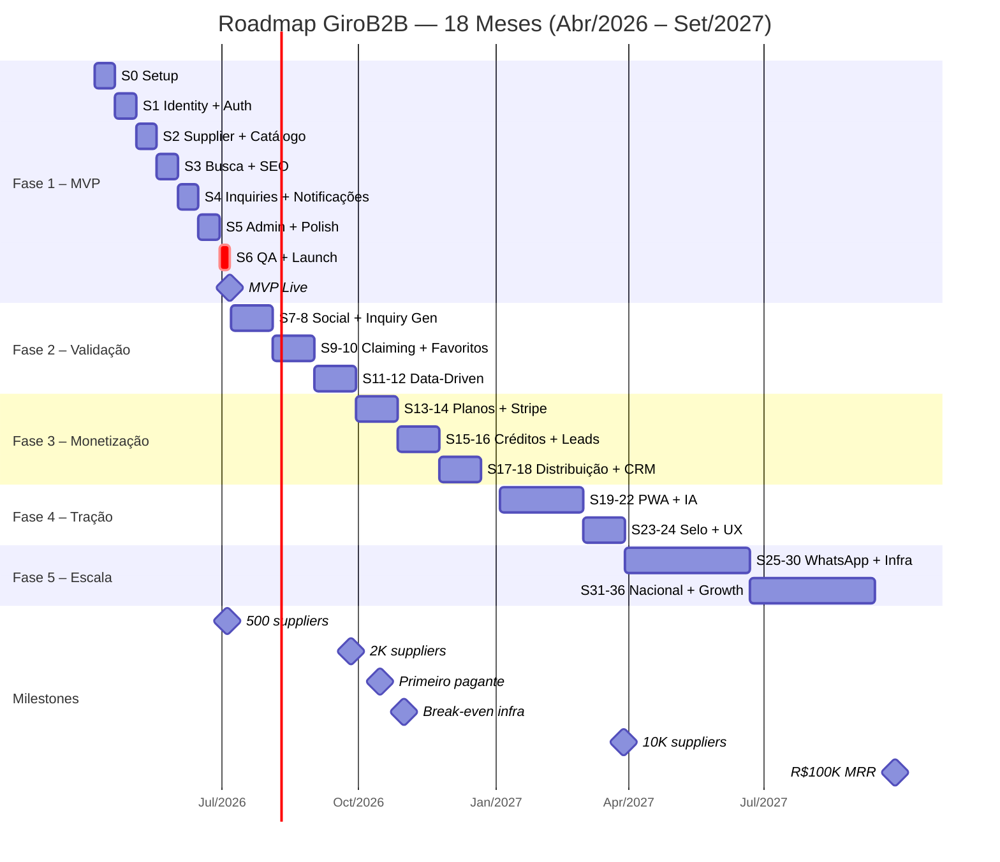
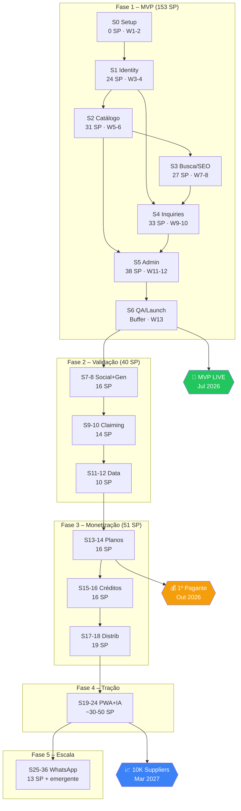

# 4.5 Roadmap de Desenvolvimento

**Versão:** 1.0 | **Data:** 06/04/2026 | **Autor:** Claude Opus 4.6
**Status:** rascunho — estimativas pendentes validação do CTO
**Dependências:** REFERENCIA_CONSOLIDADA, 2.1, 2.2, 3.1, 1.7, 4.1, 4.2, DNA
**Público:** Ambos (Dev + Investidores)

---

> **Resumo Executivo:**
> Plano de execução para 18 meses (Abr/2026–Set/2027) em 5 fases. O MVP consome **153 SP** em **7 sprints** (13 semanas), seguido por Validação (40 SP, 12 semanas), Monetização (51 SP, 12 semanas), Tração (backlog emergente, 12 semanas) e Escala (13 SP + emergente, 26 semanas). Time: 1 dev full-stack (Vitor/CTO) + IA copilot. Total documentado: **257 SP** em **64 user stories** cobrindo **104 componentes** em **9 domínios**. Buffer de 30% no MVP prevê extensão de até 4 meses em cenário adverso. Primeiro pagante estimado em M7 (Out/2026); break-even infraestrutura no mesmo mês.

---

## 1. Premissas de Planejamento

| Premissa | Valor | Fonte |
|----------|-------|-------|
| Duração do sprint | 2 semanas | Padrão startup |
| Time de desenvolvimento | 1 dev full-stack (Vitor/CTO) + IA copilot | DNA §3 |
| Velocity S1–S2 (ramp-up) | 24–31 SP/sprint | Ajustado para IA copilot |
| Velocity S3–S5 (maturidade) | 27–38 SP/sprint | CRUD-heavy + padrões estabelecidos |
| Total SP MVP | **153** | 2.2 (soma individual das 41 US) |
| Total SP Validação | 40 | 2.2 (10 US) |
| Total SP Monetização | 51 | 2.2 (12 US) |
| Total SP Escala | 13 | 2.2 (1 US: WhatsApp) |
| **Total SP geral** | **257** | **2.2 (64 US)** |
| Componentes MVP | 75 de 104 (72%) | 3.1 |
| Componentes Monetização | 23 de 104 (22%) | 3.1 |
| Buffer de risco MVP | +30% (≈46 SP / 3 semanas) | Best practice |
| Início do desenvolvimento | **6 Abril 2026** | Documentação completa |
| MVP Live (meta) | **4 Julho 2026** (Semana 13) | Sem buffer ativado |
| MVP Live (com buffer) | Até **1 Agosto 2026** (Semana 17) | Buffer 30% |

### 1.1 Sobre a velocity

O artefato 2.2 estima velocity de **15–20 SP/sprint** para 1 dev solo. Este roadmap usa valores mais altos (24–38 SP/sprint) justificados por:

1. **IA copilot (Cursor/Claude):** multiplica throughput em 1.5–1.8× para padrões web (auth, CRUD, admin, SEO) — exatamente o perfil do MVP.
2. **Stack moderna com scaffolding:** Next.js + shadcn/ui + Supabase Auth reduzem boilerplate drasticamente.
3. **Documentação completa:** Fases 1–4 prontas significam zero ambiguidade de requisitos — Vitor tem schemas Zod, diagramas de sequência e regras de negócio detalhadas.

Se a velocity real ficar abaixo do projetado, a **mitigação primária** é defer de stories "Should" para Validação. As 12 stories "Should" do MVP somam 32 SP. Removendo-as, o MVP fica com **121 SP** (29 stories "Must") → 24,2 SP/sprint em 5 sprints — confortável.

⚠️ **Correção de coerência:** O REFERENCIA §22 registrava 154 SP (MVP) e 258 SP (total). A soma individual das 41 User Stories no artefato 2.2 totaliza **153 SP** e **257 SP**. Os valores foram corrigidos no REFERENCIA para manter coerência.

⚠️ **Correção de coerência:** O REFERENCIA §29 registrava 22 componentes [MON]. O artefato 3.1 totaliza **23 componentes** [MON] (5 services + 5 repos + 3 schemas + 5 API routes + 1 page + 3 jobs + 1 external). Corrigido no REFERENCIA.

---

## 2. Fase 1: MVP (Meses 1–3, Abril–Julho 2026)

### 2.1 Visão Geral

| Métrica | Valor |
|---------|-------|
| Período | 6 Abr – 4 Jul 2026 (13 semanas) |
| Sprints | S0 (setup) + S1–S5 (features) + S6 (QA/buffer) |
| Story Points | 153 SP em 41 User Stories |
| Casos de Uso | 22 UCs |
| Componentes | 75 (10 services, 9 repos, 15 schemas, 12 API routes, 14 pages, 5 middleware, 2 jobs, 8 external) |
| RF cobertos | 59 de 95 |
| RN cobertos | 33 de 50 |
| RNF aplicáveis | 56 de 67 |
| Meta de suppliers | 500–1.000 cadastrados ao final de M3 |
| Custo infra | R$0/mês (free tiers, M1–M2) → ~R$290/mês (M3+, Supabase Pro + Vercel Pro) |

### 2.2 Sprint 0 — Setup (Semanas 1–2: 6–17 Abr 2026)

**Objetivo:** Ambiente de desenvolvimento funcional com deploy automático.
**Story Points:** 0 (infraestrutura, sem US formal)

| Entrega | Detalhe |
|---------|---------|
| Repositório GitHub | Monorepo Next.js 16.2 + TypeScript 5.8 |
| Deploy automático | Vercel: push → preview; merge main → produção |
| CI/CD pipeline | `lint → types → test:unit → build` (GitHub Actions) |
| Supabase projeto | PG 15+, Auth configurado, RLS habilitado |
| Design system base | Tailwind CSS 4.2 + shadcn/ui + tokens (cores, tipografia, espaçamento) |
| Schemas Zod iniciais | Schemas de domínio core: `registerSchema`, `loginSchema`, `productSchema` |
| Estrutura de diretórios | Conforme 3.4, organização `lib/` por domínio (pendência CTO-01) |
| Middleware base | Auth guard, rate limiter, error handler (Cross-cutting, 3.1) |
| Resend setup | Conta ativa, template base de email transacional |

**Domínios 3.1:** Cross-cutting (middleware, schemas, utils) + Notifications (base: emailService, resendClient)
**UCs:** Nenhum (infraestrutura)
**Critério de conclusão:** `git push` faz deploy para preview URL funcional com página em branco + health check

---

### 2.3 Sprint 1 — Identity + Auth (Semanas 3–4: 20 Abr–1 Mai 2026)

**Objetivo:** Cadastro unificado 3 níveis + autenticação completa.
**Story Points:** 24 SP (7 User Stories)

| US | Título | SP | Prioridade |
|----|--------|---:|------------|
| US-001 | Cadastro unificado (Nível 1) | 5 | Must |
| US-033 | Login com email e senha | 3 | Must |
| US-034 | Recuperar senha | 2 | Must |
| US-035 | Logout | 1 | Must |
| US-024 | Ativação de buyer na inquiry (Nível 2) | 5 | Must |
| US-061 | Upgrade para fornecedor (Nível 3) | 5 | Must |
| US-062 | Verificar empresa como comprador (Selo) | 3 | Should |

**Casos de Uso:** UC-01, UC-12, UC-17, UC-31, UC-32
**Domínio 3.1:** Identity (authService, supplierService, buyerService, profileRepository, supplierRepository, buyerRepository)

**Entregas técnicas:**
- Supabase Auth: signup, login, password recovery, logout
- RLS policies: profiles, buyers, suppliers (row-level)
- Fluxo de cadastro unificado (N1 → N2 → N3) conforme SEQ-01
- Ativação buyer inline durante envio de inquiry (SEQ-17)
- Upgrade supplier com validação de CNPJ (SEQ-18) — UI pronta, integração BrasilAPI no S2
- Checkbox LGPD + aceite de Termos (RN-01.07) no momento da ativação buyer (N2)
- Selo "Empresa Verificada" para buyer com CNPJ (UC-32)

**Critério de conclusão:** Usuário completa cadastro N1 → ativa buyer N2 → faz upgrade supplier N3 com CNPJ

---

### 2.4 Sprint 2 — Supplier + Catálogo (Semanas 5–6: 4–15 Mai 2026)

**Objetivo:** Perfil de fornecedor editável + catálogo de produtos ilimitado.
**Story Points:** 31 SP (8 User Stories)

| US | Título | SP | Prioridade |
|----|--------|---:|------------|
| US-003 | Editar perfil da empresa | 5 | Must |
| US-004 | Cadastrar produto | 5 | Must |
| US-005 | Salvar produto como rascunho | 2 | Should |
| US-006 | Gerenciar produtos (editar, pausar, reativar, excluir) | 5 | Must |
| US-010 | Wizard de perfil no primeiro acesso | 3 | Should |
| US-002 | Cadastro provisório quando API indisponível | 3 | Must |
| US-048 | Validação automática de CNPJ | 5 | Must |
| US-063 | Filtrar leads de empresas verificadas | 3 | Should |

**Casos de Uso:** UC-02, UC-03, UC-04, UC-24, UC-33
**Domínio 3.1:** Catalog (productService, categoryService, productRepository, categoryRepository) + Identity (cnpjClient via BrasilAPI INT-15)

**Entregas técnicas:**
- Perfil fornecedor: logo, descrição, endereço, categorias (até 5), fotos (até 10)
- Barra de completude do fornecedor (RN-02.01)
- CRUD completo de produtos (nome, descrição, categoria, fotos, unidade, quantidade mínima, faixa de preço)
- Upload de imagens via Cloudflare R2 (INT-06)
- Integração BrasilAPI para validação de CNPJ em tempo real (INT-15)
- Fallback: cadastro provisório com status "pendente_verificacao" se API indisponível
- Filtro de leads verificados para suppliers (UC-33)

**Critério de conclusão:** Fornecedor cria perfil completo, cadastra 3+ produtos com fotos, CNPJ validado automaticamente

---

### 2.5 Sprint 3 — Busca + SEO (Semanas 7–8: 18–29 Mai 2026)

**Objetivo:** Busca textual funcional + SEO programático gerando páginas indexáveis.
**Story Points:** 27 SP (5 User Stories)

| US | Título | SP | Prioridade |
|----|--------|---:|------------|
| US-021 | Busca textual de produtos e fornecedores | 8 | Must |
| US-022 | Filtros de busca | 3 | Must |
| US-023 | Navegação por categorias (browse) | 3 | Must |
| US-049 | Geração de páginas SEO programáticas | 8 | Must |
| US-052 | Cálculo do ranking de busca | 5 | Must |

**Casos de Uso:** UC-11, UC-25, UC-27
**Domínio 3.1:** Search & Discovery (searchService, rankingService, seoService, searchRepository)

**Entregas técnicas:**
- Full-text search PostgreSQL (tsvector + GIN index) via Supabase
- Filtros: categoria, subcategoria, cidade, estado, faixa de preço, verificação
- Algoritmo de ranking composto (RN-03.01): relevância textual 35% + completude 25% + atividade 15% + verificação 15% + recência 10%
- SEO programático: páginas de produto, categoria, localidade, combinadas (categoria+localidade)
- SSR/SSG com ISR para páginas públicas (Next.js)
- Schema.org JSON-LD (Product, Organization, BreadcrumbList)
- Sitemap XML automático + configuração Google Search Console
- Meta tags otimizadas por template (título, descrição, OpenGraph)

**Critério de conclusão:** Busca retorna resultados ranqueados; páginas SEO geram no build; Lighthouse SEO ≥ 90

---

### 2.6 Sprint 4 — Inquiries + Notificações (Semanas 9–10: 1–12 Jun 2026)

**Objetivo:** Fluxo completo de inquiry + sistema de notificações por email.
**Story Points:** 33 SP (9 User Stories)

| US | Título | SP | Prioridade |
|----|--------|---:|------------|
| US-025 | Enviar inquiry direcionada | 5 | Must |
| US-007 | Visualizar inquiries recebidas (fornecedor gratuito) | 5 | Must |
| US-013 | Página de produto com CTA de cotação | 3 | Must |
| US-014 | Perfil público do fornecedor | 3 | Must |
| US-030 | Páginas SEO por localidade | 5 | Must |
| US-050 | Envio de email transacional | 5 | Must |
| US-026 | Painel do comprador (minhas inquiries) | 3 | Should |
| US-027 | Denunciar fornecedor | 2 | Should |
| US-051 | Lembretes de perfil incompleto | 2 | Should |

**Casos de Uso:** UC-05, UC-13, UC-15, UC-26
**Domínio 3.1:** Inquiries (inquiryService, inquiryRepository, spamDetector) + Notifications (emailService, notificationService, resendClient)

**Entregas técnicas:**
- Formulário de inquiry com Turnstile anti-bot (INT-12)
- Dados de contato do buyer mascarados para fornecedor gratuito (nome, empresa, email, telefone ocultos — mostra apenas descrição, quantidade, prazo, cidade)
- Limite de 10 inquiries/dia por buyer (RN-04.04)
- Deduplicação: mesmo buyer+supplier+produto em 48h (RN-04.02)
- Lifecycle da inquiry: Nova → Visualizada → Respondida/Arquivada/Denunciada
- Emails transacionais via Resend: confirmação de cadastro, inquiry recebida, inquiry respondida, perfil incompleto
- Unsubscribe link em todos os emails (LGPD, RN-09.02)
- Página pública do fornecedor com CTA "Solicitar Cotação"
- Perfil público SEO-friendly com Schema.org Organization
- Painel do comprador: lista de inquiries enviadas + status

**Critério de conclusão:** Buyer envia inquiry → supplier recebe email + vê no painel (dados mascarados) → buyer vê status no painel

---

### 2.7 Sprint 5 — Admin + Polish (Semanas 11–12: 15–26 Jun 2026)

**Objetivo:** Painel administrativo completo + polish de UX.
**Story Points:** 38 SP (12 User Stories)

| US | Título | SP | Prioridade |
|----|--------|---:|------------|
| US-036 | Listar e buscar fornecedores (admin) | 3 | Must |
| US-037 | Suspender e reativar fornecedor | 3 | Must |
| US-038 | Gerenciar categorias e subcategorias | 3 | Must |
| US-039 | Moderar produtos | 3 | Must |
| US-040 | Tratar denúncias | 3 | Must |
| US-041 | Dashboard de métricas (admin) | 5 | Must |
| US-043 | Editar dados de fornecedor (admin) | 2 | Should |
| US-044 | Log de auditoria | 3 | Must |
| US-009 | Painel do fornecedor com analytics básico | 5 | Must |
| US-012 | Visualizar comparativo de planos | 3 | Must |
| US-064 | Barra de completude do comprador | 3 | Should |
| US-053 | Resumo semanal por email | 2 | Should |

**Casos de Uso:** UC-18, UC-19, UC-20, UC-21, UC-22
**Domínio 3.1:** Moderation & Trust (moderationService, reportService, moderationRepository) + Notifications (jobs: weeklyDigestJob)

**Entregas técnicas:**
- Admin panel: listagem de fornecedores com busca/filtro, ações (suspender/reativar/editar)
- Gerenciamento de categorias: árvore hierárquica CRUD (criar, renomear, reordenar, desativar)
- Moderação de produtos: fila com ações (aprovar, rejeitar, solicitar edição)
- Tratamento de denúncias: fila com SLA 48h (RN-07.03)
- Dashboard admin: cadastros, inquiries, produtos, conversões, crescimento
- Log de auditoria: registro de todas as ações admin com timestamp/autor
- Painel do fornecedor: overview (inquiries recebidas, produtos listados, visualizações, completude)
- Comparativo de planos: página informativa (Starter/Pro/Premium) — sem compra no MVP
- Barra de completude do comprador + nudges
- Job: resumo semanal por email (Supabase Edge Function)
- Páginas institucionais: Sobre, Como Funciona, Planos, Contato, Termos de Uso, Política de Privacidade

> **Nota sobre velocity:** Sprint CRUD-heavy com alta taxa de reúso de componentes (tabelas, formulários, modais). IA copilot é particularmente eficaz nesse tipo de trabalho, justificando 38 SP para 2 semanas.

**Critério de conclusão:** Admin gerencia todo o ecossistema; fornecedor vê analytics; páginas institucionais publicadas

---

### 2.8 Sprint 6 — QA + Launch (Semana 13: 29 Jun–4 Jul 2026)

**Objetivo:** Estabilização, testes end-to-end e soft launch.
**Story Points:** 0 (buffer — absorve débito técnico e hotfixes)

| Atividade | Detalhe |
|-----------|---------|
| Testes E2E | Fluxos críticos: cadastro → produto → busca → inquiry |
| Performance audit | Lighthouse ≥ 90 mobile, Core Web Vitals no verde (LCP < 2.5s, INP < 200ms, CLS < 0.1) |
| Segurança | Checklist 4.3: HTTPS, RLS, rate limiting, Turnstile, headers segurança |
| Seed de dados | Categorias (macro → subcategorias), localizações (estados + principais cidades) |
| LGPD | Verificação final: banner cookies, links termos/privacidade, consentimento N2 |
| Soft launch | Deploy para early adopters (rede Márcio), monitoramento 48h |
| Migração infra | Supabase → Pro ($25/mês), Vercel → Pro ($20/mês) |

**🚀 Entrega: MVP LIVE — ~4 Julho 2026**

---

### 2.9 Totalizadores do MVP

| Sprint | Semanas | SP | Stories | UCs | Domínio principal |
|--------|---------|---:|--------:|----:|-------------------|
| S0 Setup | 1–2 | 0 | 0 | 0 | Cross-cutting + Notifications |
| S1 Identity | 3–4 | 24 | 7 | 5 | Identity |
| S2 Catálogo | 5–6 | 31 | 8 | 5 | Catalog + Identity |
| S3 Busca/SEO | 7–8 | 27 | 5 | 3 | Search & Discovery |
| S4 Inquiries | 9–10 | 33 | 9 | 4 | Inquiries + Notifications |
| S5 Admin | 11–12 | 38 | 12 | 5 | Moderation + Admin |
| S6 QA/Launch | 13 | 0 | 0 | 0 | — |
| **Total** | **13 sem** | **153** | **41** | **22** | **6 domínios** |

**Prioridade das 41 stories MVP:**

| Prioridade | Qtd | SP | Papel |
|------------|----:|---:|-------|
| Must | 29 | 121 | Core — inegociável |
| Should | 12 | 32 | Qualidade — deferível para Validação se necessário |
| **Total** | **41** | **153** | |

---

## 3. Fase 2: Validação (Meses 4–6, Julho–Setembro 2026)

### 3.1 Visão Geral

| Métrica | Valor |
|---------|-------|
| Período | 7 Jul – 26 Set 2026 (12 semanas, 6 sprints) |
| Story Points | 40 SP em 10 User Stories |
| Componentes novos | 5 (2 schemas, 1 API route, 2 jobs) |
| Meta suppliers | 2.000–3.000 cadastrados |
| Meta inquiries | 200+/mês |
| Custo infra | ~R$339/mês (+ Resend Pro quando >100 emails/dia) |

### 3.2 Sprints 7–8 (Jul 7–31): Login Social + Inquiry Genérica + Importação

| US | Título | SP | Prioridade |
|----|--------|---:|------------|
| US-031 | Login social Google | 3 | Should |
| US-028 | Enviar inquiry genérica (múltiplos fornecedores) | 5 | Must |
| US-011 | Importar produtos em massa via planilha | 8 | Should |

**SP:** 16 | **UCs:** UC-14, UC-10
**Foco:** Reduzir fricção de onboarding (login social), escalar inquiries (genérica), e acelerar cadastro de catálogos (importação CSV/XLSX para time de Márcio no campo).

### 3.3 Sprints 9–10 (Ago 4–29): Reivindicação + Favoritos + Denúncia

| US | Título | SP | Prioridade |
|----|--------|---:|------------|
| US-045 | Criar perfil pré-cadastrado (seed de fornecedores) | 5 | Should |
| US-015 | Salvar fornecedor como favorito | 2 | Could |
| US-008 | Denunciar inquiry como spam | 2 | Should |
| US-042 | Relatórios analíticos (admin) | 5 | Should |

**SP:** 14 | **UCs:** UC-06, UC-16, UC-23, UC-22 (estendido)
**Foco:** Pré-cadastrar fornecedores (Márcio faz prospecção, admin cria perfis que fornecedores reivindicam); melhorar confiança (spam reporting); analytics para decisões data-driven.

### 3.4 Sprints 11–12 (Set 1–26): Melhorias Data-Driven

| US | Título | SP | Prioridade |
|----|--------|---:|------------|
| US-029 | Autocompletar na busca | 3 | Could |
| US-032 | Alertas de novos fornecedores | 2 | Could |
| US-042 | (continuação relatórios) | — | — |
| US-059 | Push notifications (PWA) | 5 | Could |

**SP:** 10 | **UCs:** UC-26 (estendido)
**Foco:** Otimização baseada em dados de 3–4 meses de operação. A/B tests de ranking, refinamento de categorias, push via PWA.

> **Nota:** Velocity mais baixa (6–8 SP/sprint) é intencional — Vitor divide tempo entre dev e ops. Grande parte do esforço nesta fase é manutenção, bug fixes, e suporte ao campo de Márcio.

---

## 4. Fase 3: Monetização (Meses 7–9, Outubro–Dezembro 2026)

### 4.1 Visão Geral

| Métrica | Valor |
|---------|-------|
| Período | 28 Set – 19 Dez 2026 (12 semanas, 6 sprints) |
| Story Points | 51 SP em 12 User Stories |
| Componentes novos | 23 (Monetization: 13 + Leads & Distribution: 10) |
| Meta | Gateway ativo, primeiros pagantes, R$5K–15K/mês |
| Custo infra | ~R$540/mês (+ Stripe ~4.5% por transação) |
| Pré-requisito | Conta Stripe BR aprovada (aplicar M5, testar M6) |

### 4.2 Sprints 13–14 (Set 28–Out 24): Planos + Stripe

| US | Título | SP | Prioridade |
|----|--------|---:|------------|
| US-016 | Assinar plano pago | 8 | Must |
| US-017 | Trial gratuito de 7 dias (Starter) | 3 | Should |
| US-055 | Processamento de cobrança recorrente | 5 | Must |

**SP:** 16 | **UCs:** UC-07, UC-29
**Domínio 3.1:** Monetization (subscriptionService, billingService, stripeClient)
**Entregas:** Integração Stripe Checkout + Billing Portal, 3 planos (Starter R$79, Pro R$199, Premium R$399), trial 7 dias, webhooks de pagamento, dunning (retry automático em falha).

### 4.3 Sprints 15–16 (Out 27–Nov 21): Créditos + Desbloqueio de Leads

| US | Título | SP | Prioridade |
|----|--------|---:|------------|
| US-018 | Desbloquear lead com crédito | 5 | Must |
| US-019 | Gerenciar assinatura (upgrade, downgrade, cancelar) | 5 | Must |
| US-020 | Comprar créditos extras avulsos | 3 | Should |
| US-056 | Renovação e expiração de créditos semanais | 3 | Must |

**SP:** 16 | **UCs:** UC-08, UC-09, UC-30
**Domínio 3.1:** Leads & Distribution (creditService, leadService, creditRepository, leadRepository)
**Entregas:** Sistema de créditos semanais por plano (Starter: 5/semana, Pro: 15/semana, Premium: 30+/semana), desbloqueio de dados de contato do buyer, créditos extras (pacote avulso R$49/10), renovação semanal (dom 00:01), expiração de avulsos em 90 dias.

### 4.4 Sprints 17–18 (Nov 24–Dez 19): Distribuição + CRM

| US | Título | SP | Prioridade |
|----|--------|---:|------------|
| US-054 | Distribuição automática de inquiry genérica | 8 | Must |
| US-057 | Notificações da fase de Monetização | 3 | Must |
| US-058 | Expiração de créditos avulsos (90 dias) | 2 | Should |
| US-046 | Relatórios para fornecedor pagante (email) | 3 | Could |
| US-047 | Relatórios para fornecedor pagante (painel) | 3 | Should |

**SP:** 19 | **UCs:** UC-28, UC-05 (estendido com dados desbloqueados)
**Domínio 3.1:** Leads & Distribution (distributionService, roundRepository) + Notifications (billingNotificationJob)
**Entregas:** Distribuição por rodadas (RN-05.01 a 05.10) — inquiry genérica vai para Top N fornecedores da categoria/região, cada um consome 1 crédito para ver dados. CRM básico de leads para supplier pagante. Relatórios de performance.

---

## 5. Fase 4: Tração (Meses 10–12, Janeiro–Março 2027)

### 5.1 Visão Geral

| Métrica | Valor |
|---------|-------|
| Período | 4 Jan – 28 Mar 2027 (12 semanas, 6 sprints: S19–S24) |
| Story Points | Backlog emergente (~30–50 SP estimados) |
| Componentes novos | 0 (melhorias em domínios existentes) |
| Meta suppliers | 10.000+ cadastrados |
| Meta MRR | R$20K–80K/mês |
| Custo infra | ~R$540–800/mês |

### 5.2 Sprints 19–22: PWA + IA + Analytics Avançado

- **PWA:** Instalação como app, funcionamento offline para catálogo, sync quando online
- **IA matchmaking (experimental):** Recomendação de fornecedores baseada em histórico de inquiries + categoria + localidade. Implementação: embedding de perfis + similaridade coseno. Sem US formal — sprint de experimentação.
- **Analytics avançado:** Dashboard de conversão (visitante → cadastro → inquiry → lead), cohort analysis, funil por categoria

### 5.3 Sprints 23–24: Selo Verificado N2 + UX

- **Selo GiroB2B Verificado Nível 2:** Verificação manual (documentação, visita virtual) — diferenciador premium
- **Melhorias UX:** Baseadas em 6 meses de dados de uso real + feedback de suppliers pagantes
- **Performance tuning:** Otimização de queries lentas, cache estratégico, CDN refinement

> **Nota:** Esta fase não tem User Stories formais no 2.2. O backlog é construído iterativamente a partir dos dados de Validação e Monetização. Estimativa de ~30–50 SP baseada em complexidade similar de features de Validação.

---

## 6. Fase 5: Escala (Meses 13–18, Abril–Setembro 2027)

### 6.1 Visão Geral

| Métrica | Valor |
|---------|-------|
| Período | Abr – Set 2027 (26 semanas, ~13 sprints: S25–S36) |
| Story Points documentados | 13 SP (US-060: WhatsApp) + backlog emergente |
| Componentes novos | 1 (WhatsApp Business API external) |
| Meta suppliers | 30.000+ |
| Meta MRR | R$100K–300K/mês |
| Custo infra | ~R$1.100–2.100/mês |

### 6.2 Entregas Planejadas

| Entrega | Sprint est. | Complexidade | Dependência |
|---------|-------------|-------------|-------------|
| **WhatsApp Business API** (US-060, 13 SP) | S25–26 | Alta | Conta Meta Business verificada |
| **BullMQ + Redis** para jobs | S27–28 | Média | Migração de Edge Functions |
| Microsserviço de distribuição de leads | S29–30 | Alta | Volume justifica extração |
| Expansão geográfica nacional | S31+ | Baixa (config) | Categorias regionais mapeadas |
| Equipe dev (1–2 devs adicionais) | S25+ | — | MRR sustentando contratação |
| Equipe comercial (1–2 SDRs) | S25+ | — | Pipeline de campo escalável |

### 6.3 Decisões Técnicas de Escala

| Decisão | Trigger | De → Para |
|---------|---------|-----------|
| Job runner | >1.000 jobs/dia | Edge Functions → BullMQ + Redis |
| Distribuição de leads | >500 inquiries genéricas/dia | Service interno → microsserviço |
| Banco de dados | >100GB ou >1.000 qps | Supabase Pro → Supabase Enterprise ou RDS |
| Busca | >50.000 produtos | FTS PostgreSQL → Typesense ou Meilisearch |
| CDN/Storage | >1TB imagens | R2 free tier → R2 paid |

---

## 7. Diagrama de Gantt

---

## 8. Diagrama de Dependências entre Sprints

---

## 9. Milestones e KPIs por Fase

| # | Milestone | Mês | KPI | Alvo | Fonte |
|---|-----------|-----|-----|------|-------|
| M1 | MVP Live | M3 | Deploy em produção estável | ✅ | 4.5 §2.8 |
| M2 | 500 suppliers | M3–4 | Cadastros acumulados | 500 | DNA §5 |
| M3 | 1.000 inquiries | M5–6 | Inquiries acumuladas | 1.000 | DNA §5 |
| M4 | 2.000 suppliers | M6 | Cadastros acumulados | 2.000 | REFERENCIA §5 |
| M5 | Primeiro pagante | M7 | MRR > R$0 | R$79+ | 4.2 |
| M6 | Break-even infra | M7 | MRR > custo infra | R$540+ (5–10 assinantes) | 4.1/4.2 |
| M7 | Break-even operacional | M7–8 | MRR > custos totais (infra + Stripe) | ~16 assinantes | 4.2 |
| M8 | NPS > 30 | M6 | Net Promoter Score | > 30 | Validação qualitativa |
| M9 | Salário founders | M10 | MRR sustentável | R$15K+ MRR, cash > R$30K | 4.2 §7 |
| M10 | 10.000 suppliers | M12 | Cadastros acumulados | 10.000 | DNA §5 |
| M11 | R$100K MRR | M18 | Receita recorrente mensal | R$100.000 | 4.2 cenário base |

---

## 10. Dependências Críticas e Riscos

| # | Dependência | Impacto | Mitigação | Responsável | Status |
|---|-------------|---------|-----------|-------------|--------|
| D-01 | Vitor confirma stack backend (Node.js recomendado) | Bloqueia S0 | Recomendação: Node.js (REFERENCIA §23) | Vitor/CTO | ⏳ Aguardando |
| D-02 | Vitor escolhe ORM (Prisma vs Drizzle) | Bloqueia S1 | Ambos viáveis; escolher e seguir | Vitor/CTO | ⏳ Aguardando |
| D-03 | Vitor define convenção de diretórios `lib/` | Afeta S0 | Opção A (por domínio) recomendada (3.1 CTO-01) | Vitor/CTO | ⏳ Aguardando |
| D-04 | Márcio: lista de subsetores industriais | Afeta seed de categorias (S6) | Começar com macro-categorias, refinar depois | Márcio/CCO | ⏳ Aguardando |
| D-05 | Créditos cloud (Google, Azure extra) | Afeta runway M3–M14 | AWS + Azure garantidos (R$10.320), Google R$1.548 | Gustavo/CEO | ⏳ Parcial |
| D-06 | Aprovação conta Stripe BR | Bloqueia monetização (S13) | Aplicar M5, testar M6, buffer de 1 sprint | Gustavo/CEO | ⏳ Futuro |
| D-07 | Termos de Uso + Política de Privacidade (revisão jurídica) | Bloqueia launch (S6) | Draft técnico pronto (4.4 PJ-04/PJ-05); advogado necessário | Gustavo/CEO | ⚠️ Pendente |
| D-08 | Conta Meta Business para WhatsApp | Bloqueia S25 (Escala) | Aplicar M12, processo de verificação | Gustavo/CEO | ⏳ Futuro |

### Riscos

| # | Risco | Probabilidade | Impacto | Mitigação |
|---|-------|:---:|:---:|-----------|
| R-01 | Velocity abaixo do projetado | Média | Alto | Defer 12 stories "Should" (32 SP) para Validação → MVP fica 121 SP |
| R-02 | BrasilAPI instável/indisponível | Baixa | Médio | Fallback cadastro provisório (US-002) já no MVP |
| R-03 | Supabase free tier insuficiente antes de M3 | Baixa | Baixo | Upgrade antecipado (~R$45/mês, coberto por créditos) |
| R-04 | Stripe rejeita conta BR | Baixa | Alto | Alternativas: Pagar.me, MercadoPago. Delay de 1–2 sprints para integração |
| R-05 | Churn > 10% em M7–M9 | Média | Alto | Foco em customer success, melhorar onboarding, adicionar features de retenção |
| R-06 | Founders sem capital para M5–M6 (pré-receita) | Média | Médio | Custo total: ~R$902 (cenário base). Créditos cloud cobrem infra. |
| R-07 | Scope creep no MVP | Média | Alto | Scope lock (1.7): 4 critérios de inclusão. Qualquer adição > 1 semana fica fora. |

---

## 11. Critérios de Decisão Go/No-Go por Fase

### MVP → Validação (M3)

| # | Critério | Métrica | Mínimo |
|---|----------|---------|--------|
| G1 | Deploy estável | Uptime 48h sem downtime crítico | 99%+ |
| G2 | Cadastros orgânicos | Fornecedores reais (não seed) | 100+ |
| G3 | Inquiries reais | Inquiries de compradores reais | 10+ |
| G4 | Core Web Vitals | LCP, INP, CLS | Verde (bom) |
| G5 | SEO indexação | Páginas indexadas no Google | 50+ |
| G6 | Zero bugs críticos | P0/P1 abertos | 0 |

### Validação → Monetização (M6)

| # | Critério | Métrica | Mínimo |
|---|----------|---------|--------|
| G7 | Base de suppliers | Cadastros acumulados | 2.000+ |
| G8 | Inquiries/mês | Volume mensal sustentado | 200+ |
| G9 | Feedback qualitativo | NPS suppliers | > 30 |
| G10 | Stripe aprovada | Conta ativa e testada | ✅ |
| G11 | Retenção de suppliers | Suppliers ativos/mês (login ou update) | > 40% |
| G12 | SEO orgânico | Visitas orgânicas/mês | 1.000+ |

### Monetização → Tração (M9)

| # | Critério | Métrica | Mínimo |
|---|----------|---------|--------|
| G13 | Pagantes ativos | Assinantes com plano ativo | 20+ |
| G14 | Churn mensal | Taxa de cancelamento | < 7% |
| G15 | Unit economics | LTV/CAC | > 3× |
| G16 | MRR | Receita recorrente | R$5.000+ |
| G17 | Desbloqueios de leads | Leads desbloqueados/mês | 100+ |

### Tração → Escala (M12)

| # | Critério | Métrica | Mínimo |
|---|----------|---------|--------|
| G18 | Base de suppliers | Cadastros acumulados | 10.000+ |
| G19 | MRR | Receita recorrente | R$20.000+ |
| G20 | Cash acumulado | Caixa disponível | R$50.000+ |
| G21 | Sustentabilidade | Salários founders sendo pagos | ✅ |
| G22 | Infraestrutura | Sem gargalos técnicos bloqueantes | ✅ |

---

## 12. Roadmap Paralelo (Não-Dev)

| Mês | Gustavo (CEO) | Márcio (CCO/Comercial) | Vitor (CTO) |
|-----|---------------|------------------------|-------------|
| **M1–3** | Créditos cloud (Google, AWS extra), landing page, LinkedIn, aplicação aceleradoras (Inovativa, FAPESP PIPE), INPI trademark | Mapeamento subsetores industriais, primeiros contatos com fornecedores (25 de Março, Brás, Bom Retiro), lista de early adopters | Desenvolvimento MVP full-time |
| **M4–6** | Métricas e analytics, pitch deck v1, buscar investimento pré-seed, customer success primeiros suppliers, networking SEBRAE/FIESP | Campo: cadastrar fornecedores (meta 2K), feedback presencial, mapear dores, treinamento de uso da plataforma | Dev + ops + bug fixes + suporte |
| **M7–9** | Onboarding primeiros pagantes, customer success ativo, conteúdo educativo, refinar pitch para seed | Expansão geográfica (interior SP, Campinas, RMC), parcerias associações comerciais, upsell Starter → Pro | Monetização + integração Stripe + suporte pagantes |
| **M10–12** | Growth marketing, parcerias estratégicas, conteúdo SEO/blog, preparação Series A | Scale campo: delegar para SDRs juniores, processos comerciais, materiais de venda | Otimização, PWA, IA experimental, contratação dev #2 |
| **M13–18** | Fundraising seed/Series A, expansão nacional, governança, board | Equipe comercial (2–3 SDRs), cobertura nacional, eventos B2B | Equipe dev (2–3 devs), arquitetura escala, WhatsApp API |

---

## 13. Rastreabilidade

### 13.1 Sprints × User Stories × Casos de Uso × Domínios

| Sprint | User Stories | UCs | Domínio (3.1) | SP |
|--------|-------------|-----|---------------|---:|
| S0 | — | — | Cross-cutting + Notifications (base) | 0 |
| S1 | US-001, 024, 033, 034, 035, 061, 062 | UC-01, 12, 17, 31, 32 | Identity | 24 |
| S2 | US-002, 003, 004, 005, 006, 010, 048, 063 | UC-02, 03, 04, 24, 33 | Catalog + Identity | 31 |
| S3 | US-021, 022, 023, 049, 052 | UC-11, 25, 27 | Search & Discovery | 27 |
| S4 | US-007, 013, 014, 025, 026, 027, 030, 050, 051 | UC-05, 13, 15, 26 | Inquiries + Notifications | 33 |
| S5 | US-009, 012, 036–041, 043, 044, 053, 064 | UC-18, 19, 20, 21, 22 | Moderation + Notifications | 38 |
| S6 | — (QA/buffer) | — | — | 0 |
| S7-8 | US-011, 028, 031 | UC-10, 14 | Identity + Inquiries | 16 |
| S9-10 | US-008, 015, 042, 045 | UC-06, 16, 22, 23 | Moderation + Identity | 14 |
| S11-12 | US-029, 032, 059 | UC-26 (ext) | Search + Notifications | 10 |
| S13-14 | US-016, 017, 055 | UC-07, 29 | Monetization | 16 |
| S15-16 | US-018, 019, 020, 056 | UC-08, 09, 30 | Leads + Monetization | 16 |
| S17-18 | US-046, 047, 054, 057, 058 | UC-28, 05 (ext) | Leads (distribution) | 19 |
| S19-24 | Backlog emergente | — | Melhorias cross-domain | ~30–50 |
| S25+ | US-060 | UC-26 (WhatsApp) | Notifications (ext) | 13 |

### 13.2 Verificação SP por Fase

| Fase | US alocadas | SP somados | SP esperado (2.2) | ✅ |
|------|-------------|------------|--------------------|----|
| MVP (S1–S5) | 41 | 153 | 153 | ✓ |
| Validação (S7–S12) | 10 | 40 | 40 | ✓ |
| Monetização (S13–S18) | 12 | 51 | 51 | ✓ |
| Escala (S25+) | 1 | 13 | 13 | ✓ |
| **Total** | **64** | **257** | **257** | **✓** |

### 13.3 Verificação Componentes por Fase

| Fase | Componentes (3.1) | Implementados em | ✅ |
|------|--------------------:|------------------|-----|
| MVP | 75 | S0–S5 | ✓ |
| Validação | 5 | S7–S12 | ✓ |
| Monetização | 23 | S13–S18 | ✓ |
| Tração | 0 (melhorias) | S19–S24 | ✓ |
| Escala | 1 | S25+ | ✓ |
| **Total** | **104** | | **✓** |

### 13.4 Cobertura de Artefatos-Fonte

| Artefato-fonte | Seções que o referenciam | Cobertura |
|----------------|--------------------------|-----------|
| REFERENCIA_CONSOLIDADA §5 | §§2–6 (fases), §9 (milestones) | Todas as 5 fases alinhadas |
| REFERENCIA §9 (RFs) | §2 (59 MVP), §3–4 (36 pós-MVP) | 95/95 RFs cobertos |
| REFERENCIA §10 (RNFs) | §2.8 (QA), §11 (Go/No-Go) | 67/67 RNFs referenciados |
| REFERENCIA §12 (Scope Lock) | §2 (escopo MVP) | Scope lock respeitado |
| REFERENCIA §22 (User Stories) | §§2–6, §13.2 | 64/64 US alocadas |
| REFERENCIA §29 (Componentes) | §§2–6, §13.3 | 104/104 componentes mapeados |
| 2.1 (Casos de Uso) | §2.3–2.7, §3–4, §13.1 | 33/33 UCs mapeados |
| 2.2 (User Stories) | §§2–6, §13.1–13.2 | 64/64 US com SP verificados |
| 3.1 (Componentes) | §2.2–2.7, §6.3, §13.3 | 9/9 domínios cobertos |
| 1.7 (MVP Scope Lock) | §2 (features in/out) | Escopo respeitado |
| 4.1 (Custos) | §§2–6 (custo infra), §9, §10 | 5 cenários C1–C5 referenciados |
| 4.2 (Financeiro) | §9 (milestones), §11 (Go/No-Go) | Break-even, MRR, salários |
| DNA_GIROB2B | §12 (roadmap paralelo), §9 | Visão estratégica mantida |

---

## Changelog

| Versão | Data | Alteração |
|--------|------|-----------|
| 1.0 | 06/04/2026 | Criação inicial — 12 seções, 2 diagramas Mermaid, 153+40+51+13 = 257 SP alocados |
